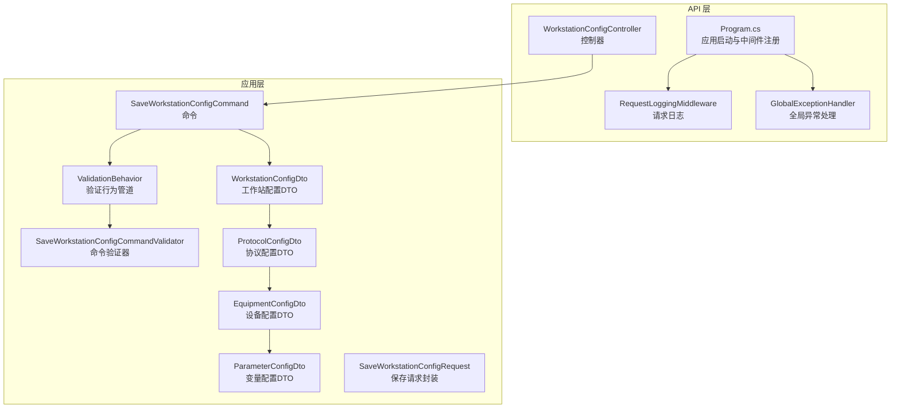
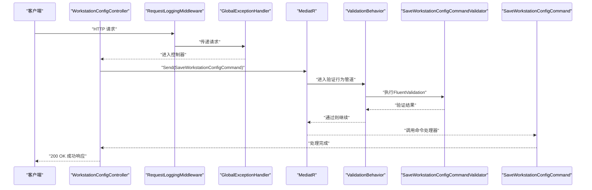
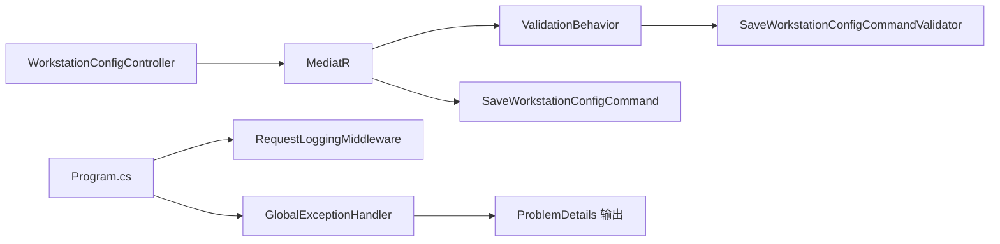

# API接口文档

<cite>
**本文引用的文件**
- [WorkstationConfigController.cs](file://IndustrialDataSolution/IndustrialDataProcessor.Api/Controllers/WorkstationConfigController.cs)
- [Program.cs](file://IndustrialDataSolution/IndustrialDataProcessor.Api/Program.cs)
- [GlobalExceptionHandler.cs](file://IndustrialDataSolution/IndustrialDataProcessor.Api/Middleware/GlobalExceptionHandler.cs)
- [RequestLoggingMiddleware.cs](file://IndustrialDataSolution/IndustrialDataProcessor.Api/Middleware/RequestLoggingMiddleware.cs)
- [SaveWorkstationConfigCommand.cs](file://IndustrialDataSolution/IndustrialDataProcessor.Application/Commands/SaveWorkstationConfigCommand.cs)
- [SaveWorkstationConfigCommandValidator.cs](file://IndustrialDataSolution/IndustrialDataProcessor.Application/Validators/SaveWorkstationConfigCommandValidator.cs)
- [ValidationBehavior.cs](file://IndustrialDataSolution/IndustrialDataProcessor.Application/Behaviors/ValidationBehavior.cs)
- [WorkstationConfigDto.cs](file://IndustrialDataSolution/IndustrialDataProcessor.Application/Dtos/WorkstationDto/WorkstationConfigDto.cs)
- [ProtocolConfigDto.cs](file://IndustrialDataSolution/IndustrialDataProcessor.Application/Dtos/WorkstationDto/ProtocolConfigDto.cs)
- [EquipmentConfigDto.cs](file://IndustrialDataSolution/IndustrialDataProcessor.Application/Dtos/WorkstationDto/EquipmentConfigDto.cs)
- [ParameterConfigDto.cs](file://IndustrialDataSolution/IndustrialDataProcessor.Application/Dtos/WorkstationDto/ParameterConfigDto.cs)
- [SaveWorkstationConfigRequest.cs](file://IndustrialDataSolution/IndustrialDataProcessor.Application/Dtos/SaveWorkstationConfigRequest.cs)
- [appsettings.json](file://IndustrialDataSolution/IndustrialDataProcessor.Api/appsettings.json)
</cite>

## 目录
1. [简介](#简介)
2. [项目结构](#项目结构)
3. [核心组件](#核心组件)
4. [架构总览](#架构总览)
5. [详细组件分析](#详细组件分析)
6. [依赖关系分析](#依赖关系分析)
7. [性能与安全](#性能与安全)
8. [故障排查指南](#故障排查指南)
9. [结论](#结论)
10. [附录](#附录)

## 简介
本文件为“DDD工业数据处理解决方案”的API接口文档，聚焦于工作站配置管理相关接口。文档覆盖REST端点定义、请求/响应规范、认证授权机制、参数校验规则、错误处理策略、HTTP状态码语义、版本控制与兼容性、速率限制与安全建议等。当前仓库中仅暴露一个工作站配置保存接口，后续可按相同模式扩展其他端点。

## 项目结构
- API层负责HTTP入口、中间件与Swagger文档生成
- 应用层负责命令、验证器、行为管道与DTO
- 中间件层提供全局异常处理与请求日志
- 配置层提供连接字符串与第三方授权码

**图表来源**
- [WorkstationConfigController.cs](file://IndustrialDataSolution/IndustrialDataProcessor.Api/Controllers/WorkstationConfigController.cs#L1-L22)
- [Program.cs](file://IndustrialDataSolution/IndustrialDataProcessor.Api/Program.cs#L1-L54)
- [GlobalExceptionHandler.cs](file://IndustrialDataSolution/IndustrialDataProcessor.Api/Middleware/GlobalExceptionHandler.cs#L1-L94)
- [RequestLoggingMiddleware.cs](file://IndustrialDataSolution/IndustrialDataProcessor.Api/Middleware/RequestLoggingMiddleware.cs#L1-L141)
- [SaveWorkstationConfigCommand.cs](file://IndustrialDataSolution/IndustrialDataProcessor.Application/Commands/SaveWorkstationConfigCommand.cs#L1-L9)
- [SaveWorkstationConfigCommandValidator.cs](file://IndustrialDataSolution/IndustrialDataProcessor.Application/Validators/SaveWorkstationConfigCommandValidator.cs#L1-L13)
- [ValidationBehavior.cs](file://IndustrialDataSolution/IndustrialDataProcessor.Application/Behaviors/ValidationBehavior.cs#L1-L31)
- [WorkstationConfigDto.cs](file://IndustrialDataSolution/IndustrialDataProcessor.Application/Dtos/WorkstationDto/WorkstationConfigDto.cs#L1-L27)
- [ProtocolConfigDto.cs](file://IndustrialDataSolution/IndustrialDataProcessor.Application/Dtos/WorkstationDto/ProtocolConfigDto.cs#L1-L92)
- [EquipmentConfigDto.cs](file://IndustrialDataSolution/IndustrialDataProcessor.Application/Dtos/WorkstationDto/EquipmentConfigDto.cs#L1-L39)
- [ParameterConfigDto.cs](file://IndustrialDataSolution/IndustrialDataProcessor.Application/Dtos/WorkstationDto/ParameterConfigDto.cs#L1-L94)
- [SaveWorkstationConfigRequest.cs](file://IndustrialDataSolution/IndustrialDataProcessor.Application/Dtos/SaveWorkstationConfigRequest.cs#L1-L12)

**章节来源**
- [Program.cs](file://IndustrialDataSolution/IndustrialDataProcessor.Api/Program.cs#L10-L51)
- [appsettings.json](file://IndustrialDataSolution/IndustrialDataProcessor.Api/appsettings.json#L1-L17)

## 核心组件
- 控制器：提供REST端点，接收工作站配置并转发至应用层
- 应用层命令与DTO：承载业务数据结构与验证规则
- 中间件：统一异常处理与请求日志
- 配置：数据库连接与第三方授权码

**章节来源**
- [WorkstationConfigController.cs](file://IndustrialDataSolution/IndustrialDataProcessor.Api/Controllers/WorkstationConfigController.cs#L8-L22)
- [SaveWorkstationConfigCommand.cs](file://IndustrialDataSolution/IndustrialDataProcessor.Application/Commands/SaveWorkstationConfigCommand.cs#L7-L8)
- [GlobalExceptionHandler.cs](file://IndustrialDataSolution/IndustrialDataProcessor.Api/Middleware/GlobalExceptionHandler.cs#L8-L47)
- [RequestLoggingMiddleware.cs](file://IndustrialDataSolution/IndustrialDataProcessor.Api/Middleware/RequestLoggingMiddleware.cs#L16-L84)
- [appsettings.json](file://IndustrialDataSolution/IndustrialDataProcessor.Api/appsettings.json#L10-L15)

## 架构总览
API请求在进入控制器前会经过中间件链路：请求日志 → 全局异常处理；随后由MediatR路由到命令处理器，验证行为管道先执行FluentValidation，再交由具体命令处理器处理。

**图表来源**
- [WorkstationConfigController.cs](file://IndustrialDataSolution/IndustrialDataProcessor.Api/Controllers/WorkstationConfigController.cs#L14-L21)
- [Program.cs](file://IndustrialDataSolution/IndustrialDataProcessor.Api/Program.cs#L38-L49)
- [ValidationBehavior.cs](file://IndustrialDataSolution/IndustrialDataProcessor.Application/Behaviors/ValidationBehavior.cs#L12-L28)
- [SaveWorkstationConfigCommandValidator.cs](file://IndustrialDataSolution/IndustrialDataProcessor.Application/Validators/SaveWorkstationConfigCommandValidator.cs#L6-L11)
- [SaveWorkstationConfigCommand.cs](file://IndustrialDataSolution/IndustrialDataProcessor.Application/Commands/SaveWorkstationConfigCommand.cs#L7-L8)

## 详细组件分析

### 工作站配置保存接口
- HTTP方法：POST
- URL模式：/api/workstation-config
- 功能：接收工作站配置并持久化保存
- 认证授权：当前中间件链路包含授权中间件，但未显式配置身份认证方案；请结合部署环境配置JWT等认证策略
- 请求体：JSON对象，字段见下方“请求参数”小节
- 成功响应：200 OK，返回统一结构
- 错误响应：根据异常类型映射到不同HTTP状态码，详见“错误处理策略”

请求参数
- 字段：dto（WorkstationConfigDto）
  - id：字符串，必填；示例："WS001"
  - name：字符串，可选
  - ipAddress：字符串，必填；需为IPv4地址
  - protocols：数组，必填；元素为ProtocolConfigDto

协议配置（ProtocolConfigDto）参数
- id：字符串，必填
- interfaceType：枚举，必填；取值范围参见接口类型枚举
- protocolType：枚举，必填；取值范围参见协议类型枚举
- communicationDelay：整数，可选；默认500
- receiveTimeOut：整数，可选；默认500
- connectTimeOut：整数，可选；默认500
- account/password：字符串，可选
- remark：字符串，可选
- additionalOptions：字符串，可选
- equipements：数组，必填；元素为EquipmentConfigDto
- 网络相关：ipAddress、protocolPort、gateway（可选）
- 串口相关：serialPortName、baudRate、dataBits、parity、stopBits（可选）
- 数据库相关：databaseName、databaseConnectString、querySqlString（可选）
- API相关：requestMethod（枚举）、accessApiString（可选）

设备配置（EquipmentConfigDto）参数
- id：字符串，必填
- isCollect：布尔，必填；默认true
- name：字符串，可选
- equipmentType：枚举，必填；取值范围参见设备类型枚举
- parameters：数组，可选；元素为ParameterConfigDto
- protocolType：枚举，必填

变量配置（ParameterConfigDto）参数
- label：字符串，必填
- address：字符串，必填；虚拟点固定地址"VirtualPoint"
- isMonitor：布尔，必填；默认false
- stationNo：字符串，可选
- dataFormat：枚举，可选；取值范围参见数据格式枚举
- addressStartWithZero：布尔，可选
- instrumentType：枚举，可选；取值范围参见仪表类型枚举
- dataType：枚举，可选；取值范围参见数据类型枚举
- length：整数，可选
- defaultValue：字符串，可选
- cycle：整数，可选
- positiveExpression：字符串，可选
- minValue/maxValue/value：字符串，可选
- protocolType：枚举，必填
- equipmentId：字符串，必填

请求示例
- 方法与路径：POST /api/workstation-config
- Content-Type：application/json
- 示例负载（简化）：
{
  "id": "WS001",
  "name": "主控工作站",
  "ipAddress": "192.168.1.100",
  "protocols": [
    {
      "id": "P001",
      "interfaceType": "Tcp",
      "protocolType": "ModbusTcp",
      "communicationDelay": 500,
      "receiveTimeOut": 500,
      "connectTimeOut": 500,
      "equipments": [
        {
          "id": "E001",
          "isCollect": true,
          "name": "流量计",
          "equipmentType": "Equipment",
          "parameters": [
            {
              "label": "瞬时流量",
              "address": "VirtualPoint",
              "isMonitor": false,
              "dataType": "Float",
              "length": 4,
              "cycle": 5,
              "protocolType": "ModbusTcp",
              "equipmentId": "E001"
            }
          ],
          "protocolType": "ModbusTcp"
        }
      ]
    }
  ]
}

响应示例
- 成功响应（200 OK）：
{
  "success": true,
  "message": "配置保存成功"
}

- 失败响应（400 Bad Request，参数验证失败）：
{
  "type": "https://httpstatuses.com/400",
  "title": "数据验证失败",
  "status": 400,
  "detail": "提交的数据不符合验证规则，请检查后重试",
  "instance": "/api/workstation-config",
  "errors": {
    "dto.id": ["工作站ID不能为空"],
    "dto.ipAddress": ["IP地址格式不正确"],
    "dto.protocols[0].id": ["协议ID不能为空"]
  }
}

- 失败响应（409 Conflict，业务规则冲突）：
{
  "type": "https://httpstatuses.com/409",
  "title": "业务规则冲突",
  "status": 409,
  "detail": "例如：重复的工作站ID",
  "instance": "/api/workstation-config"
}

- 失败响应（500 Internal Server Error，应用服务执行失败）：
{
  "type": "https://httpstatuses.com/500",
  "title": "应用服务执行失败",
  "status": 500,
  "detail": "例如：命令处理器内部异常",
  "instance": "/api/workstation-config"
}

- 失败响应（503 Service Unavailable，基础设施不可用）：
{
  "type": "https://httpstatuses.com/503",
  "title": "基础设施不可用",
  "status": 503,
  "detail": "数据库或外部服务不可用",
  "instance": "/api/workstation-config"
}

- 失败响应（500 Internal Server Error，未知错误）：
{
  "type": "https://httpstatuses.com/500",
  "title": "服务器内部错误",
  "status": 500,
  "detail": "发生未知异常",
  "instance": "/api/workstation-config"
}

**章节来源**
- [WorkstationConfigController.cs](file://IndustrialDataSolution/IndustrialDataProcessor.Api/Controllers/WorkstationConfigController.cs#L14-L21)
- [WorkstationConfigDto.cs](file://IndustrialDataSolution/IndustrialDataProcessor.Application/Dtos/WorkstationDto/WorkstationConfigDto.cs#L5-L26)
- [ProtocolConfigDto.cs](file://IndustrialDataSolution/IndustrialDataProcessor.Application/Dtos/WorkstationDto/ProtocolConfigDto.cs#L7-L91)
- [EquipmentConfigDto.cs](file://IndustrialDataSolution/IndustrialDataProcessor.Application/Dtos/WorkstationDto/EquipmentConfigDto.cs#L8-L38)
- [ParameterConfigDto.cs](file://IndustrialDataSolution/IndustrialDataProcessor.Application/Dtos/WorkstationDto/ParameterConfigDto.cs#L9-L93)
- [SaveWorkstationConfigCommandValidator.cs](file://IndustrialDataSolution/IndustrialDataProcessor.Application/Validators/SaveWorkstationConfigCommandValidator.cs#L6-L11)
- [ValidationBehavior.cs](file://IndustrialDataSolution/IndustrialDataProcessor.Application/Behaviors/ValidationBehavior.cs#L12-L28)
- [GlobalExceptionHandler.cs](file://IndustrialDataSolution/IndustrialDataProcessor.Api/Middleware/GlobalExceptionHandler.cs#L22-L47)

## 依赖关系分析
- 控制器依赖MediatR进行命令分发
- 命令经由验证行为管道，再由具体命令处理器处理
- 全局异常处理中间件统一捕获异常并输出RFC 7807格式的ProblemDetails
- 请求日志中间件在调试级别下记录请求/响应体

**图表来源**
- [WorkstationConfigController.cs](file://IndustrialDataSolution/IndustrialDataProcessor.Api/Controllers/WorkstationConfigController.cs#L10-L21)
- [Program.cs](file://IndustrialDataSolution/IndustrialDataProcessor.Api/Program.cs#L38-L49)
- [ValidationBehavior.cs](file://IndustrialDataSolution/IndustrialDataProcessor.Application/Behaviors/ValidationBehavior.cs#L9-L29)
- [SaveWorkstationConfigCommandValidator.cs](file://IndustrialDataSolution/IndustrialDataProcessor.Application/Validators/SaveWorkstationConfigCommandValidator.cs#L6-L11)
- [SaveWorkstationConfigCommand.cs](file://IndustrialDataSolution/IndustrialDataProcessor.Application/Commands/SaveWorkstationConfigCommand.cs#L7-L8)
- [GlobalExceptionHandler.cs](file://IndustrialDataSolution/IndustrialDataProcessor.Api/Middleware/GlobalExceptionHandler.cs#L49-L92)

**章节来源**
- [Program.cs](file://IndustrialDataSolution/IndustrialDataProcessor.Api/Program.cs#L38-L49)
- [ValidationBehavior.cs](file://IndustrialDataSolution/IndustrialDataProcessor.Application/Behaviors/ValidationBehavior.cs#L9-L29)
- [GlobalExceptionHandler.cs](file://IndustrialDataSolution/IndustrialDataProcessor.Api/Middleware/GlobalExceptionHandler.cs#L12-L47)

## 性能与安全
- 性能
  - 请求日志中间件在Debug级别下会读取并记录请求/响应体，可能带来额外开销；生产环境建议关闭或限制记录范围
  - 验证行为管道对所有验证器并行执行，有助于提升吞吐
- 安全
  - 当前中间件链路包含授权中间件，但未配置具体认证方案；建议在部署环境中接入JWT等认证机制
  - 建议启用HTTPS、CORS白名单、请求大小限制、速率限制等
- 速率限制
  - 仓库未内置速率限制中间件；可在部署层（如反向代理或API网关）或应用层添加限流策略
- 版本控制
  - 仓库未体现API版本控制；建议采用URL路径版本（/api/v1/workstation-config）或媒体类型版本策略，以保证向后兼容

**章节来源**
- [RequestLoggingMiddleware.cs](file://IndustrialDataSolution/IndustrialDataProcessor.Api/Middleware/RequestLoggingMiddleware.cs#L114-L131)
- [Program.cs](file://IndustrialDataSolution/IndustrialDataProcessor.Api/Program.cs#L48-L49)

## 故障排查指南
- 常见问题
  - 400 验证失败：检查dto字段是否为空、IP地址格式是否正确、协议/设备/变量配置是否满足必填项
  - 409 业务规则冲突：检查是否存在重复ID或违反业务约束
  - 500 应用服务执行失败：查看服务端日志定位命令处理器异常
  - 503 基础设施不可用：检查数据库连接字符串与可用性
- 日志
  - 启用Debug级别可记录请求/响应体，便于问题定位
- Swagger
  - 通过Swagger UI访问接口文档与测试页面

**章节来源**
- [GlobalExceptionHandler.cs](file://IndustrialDataSolution/IndustrialDataProcessor.Api/Middleware/GlobalExceptionHandler.cs#L14-L47)
- [RequestLoggingMiddleware.cs](file://IndustrialDataSolution/IndustrialDataProcessor.Api/Middleware/RequestLoggingMiddleware.cs#L23-L78)
- [Program.cs](file://IndustrialDataSolution/IndustrialDataProcessor.Api/Program.cs#L45-L46)

## 结论
当前仓库实现了单一工作站配置保存接口，具备完善的参数验证、统一异常处理与请求日志能力。建议在部署环境中补充认证授权、速率限制与API版本控制策略，以满足生产环境的安全与稳定性要求。

## 附录

### HTTP状态码语义
- 200 OK：请求成功
- 400 Bad Request：参数验证失败（含FluentValidation错误集合）
- 409 Conflict：业务规则冲突
- 500 Internal Server Error：应用服务执行失败或未知错误
- 503 Service Unavailable：基础设施不可用

### 认证与授权
- 当前中间件链路包含授权中间件，但未配置具体认证方案；请结合部署环境配置JWT等认证机制

**章节来源**
- [GlobalExceptionHandler.cs](file://IndustrialDataSolution/IndustrialDataProcessor.Api/Middleware/GlobalExceptionHandler.cs#L22-L47)
- [Program.cs](file://IndustrialDataSolution/IndustrialDataProcessor.Api/Program.cs#L48-L49)