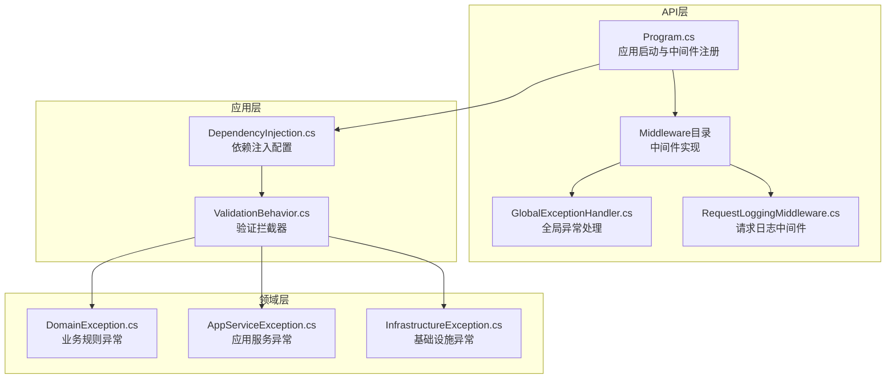
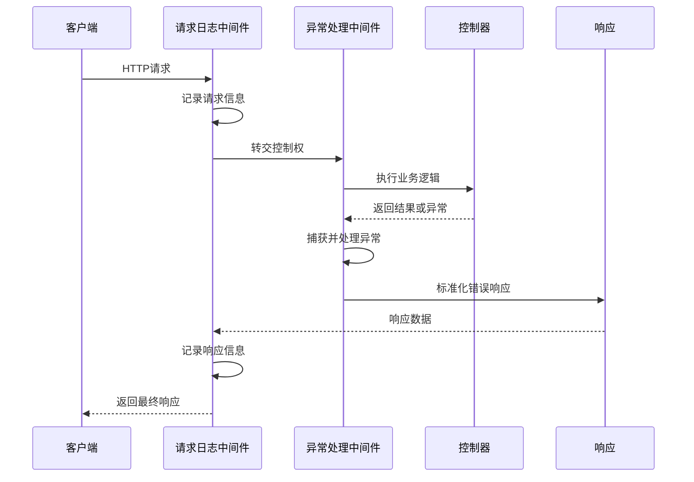
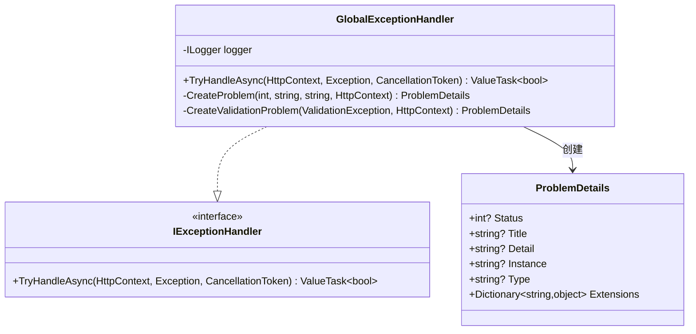
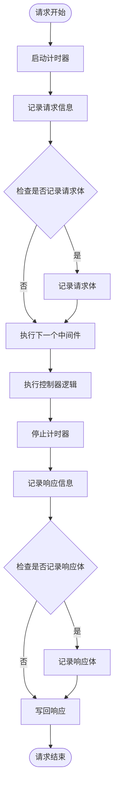
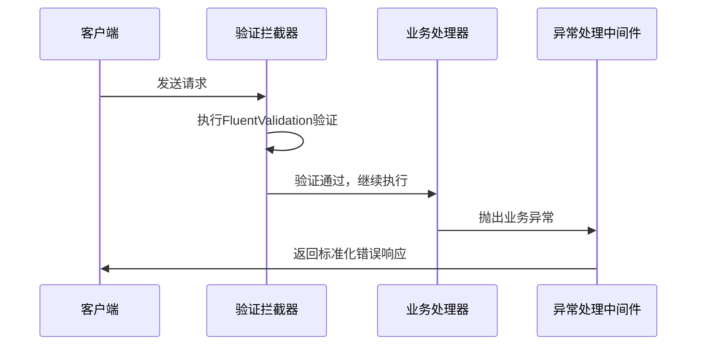
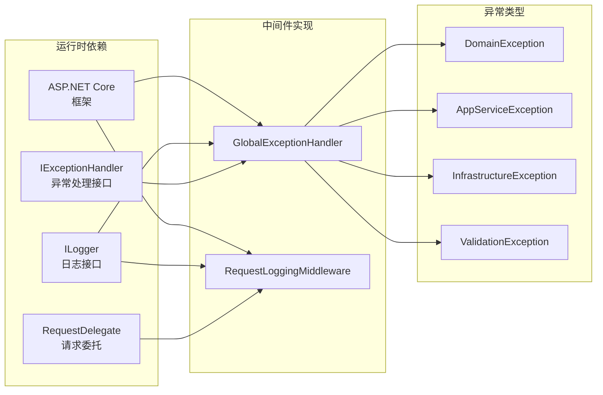
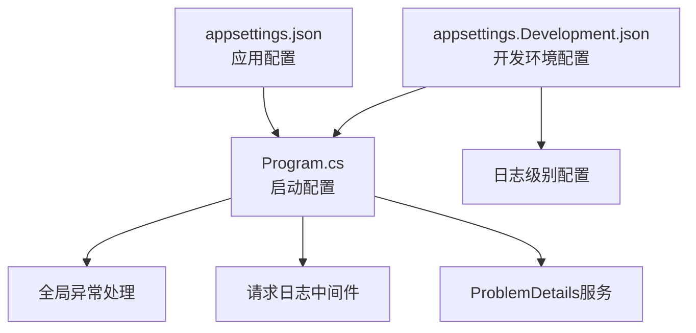

# 中间件与拦截器

<cite>
**本文档引用的文件**
- [GlobalExceptionHandler.cs](file://IndustrialDataSolution/IndustrialDataProcessor.Api/Middleware/GlobalExceptionHandler.cs)
- [RequestLoggingMiddleware.cs](file://IndustrialDataSolution/IndustrialDataProcessor.Api/Middleware/RequestLoggingMiddleware.cs)
- [Program.cs](file://IndustrialDataSolution/IndustrialDataProcessor.Api/Program.cs)
- [appsettings.json](file://IndustrialDataSolution/IndustrialDataProcessor.Api/appsettings.json)
- [appsettings.Development.json](file://IndustrialDataSolution/IndustrialDataProcessor.Api/appsettings.Development.json)
- [DependencyInjection.cs](file://IndustrialDataSolution/IndustrialDataProcessor.Application/DependencyInjection.cs)
- [ValidationBehavior.cs](file://IndustrialDataSolution/IndustrialDataProcessor.Application/Behaviors/ValidationBehavior.cs)
- [AppServiceException.cs](file://IndustrialDataSolution/IndustrialDataProcessor.Domain/Exceptions/AppServiceException.cs)
- [DomainException.cs](file://IndustrialDataSolution/IndustrialDataProcessor.Domain/Exceptions/DomainException.cs)
- [InfrastructureException.cs](file://IndustrialDataSolution/IndustrialDataProcessor.Domain/Exceptions/InfrastructureException.cs)
</cite>

## 目录
1. [简介](#简介)
2. [项目结构](#项目结构)
3. [核心组件](#核心组件)
4. [架构概览](#架构概览)
5. [详细组件分析](#详细组件分析)
6. [依赖关系分析](#依赖关系分析)
7. [性能考虑](#性能考虑)
8. [故障排除指南](#故障排除指南)
9. [结论](#结论)
10. [附录](#附录)

## 简介
本技术文档深入解析工业数据处理解决方案中的API中间件与拦截器实现，重点涵盖全局异常处理中间件和请求日志中间件的设计与实现。文档详细说明了异常捕获机制、错误分类策略、响应格式标准化以及日志记录策略；同时阐述了请求/响应数据记录、敏感信息过滤和性能监控功能。此外，文档提供了中间件配置选项、自定义扩展方法、执行顺序说明及其对API性能的影响分析，并包含调试技巧和故障排除方法，以及如何向请求管道中添加新中间件的实践指导。

## 项目结构
该项目采用分层架构设计，API层负责HTTP请求处理和中间件集成，应用层提供业务逻辑和验证行为，领域层封装业务规则和异常类型，基础设施层处理外部依赖。中间件位于API层的Middleware目录下，通过依赖注入在Program.cs中注册并配置执行顺序。



**图表来源**
- [Program.cs](file://IndustrialDataSolution/IndustrialDataProcessor.Api/Program.cs#L36-L51)
- [GlobalExceptionHandler.cs](file://IndustrialDataSolution/IndustrialDataProcessor.Api/Middleware/GlobalExceptionHandler.cs#L8-L47)
- [RequestLoggingMiddleware.cs](file://IndustrialDataSolution/IndustrialDataProcessor.Api/Middleware/RequestLoggingMiddleware.cs#L9-L84)

**章节来源**
- [Program.cs](file://IndustrialDataSolution/IndustrialDataProcessor.Api/Program.cs#L1-L54)
- [DependencyInjection.cs](file://IndustrialDataSolution/IndustrialDataProcessor.Application/DependencyInjection.cs#L16-L39)

## 核心组件
本项目的核心中间件组件包括：
- 全局异常处理中间件：统一捕获未处理异常，进行错误分类并返回标准化的ProblemDetails响应
- 请求日志中间件：记录请求/响应信息，支持可选的请求体/响应体记录，包含性能监控

两个中间件均实现了ASP.NET Core的标准中间件接口模式，通过依赖注入容器进行管理，并在应用启动时按特定顺序注册到HTTP请求管道中。

**章节来源**
- [GlobalExceptionHandler.cs](file://IndustrialDataSolution/IndustrialDataProcessor.Api/Middleware/GlobalExceptionHandler.cs#L8-L47)
- [RequestLoggingMiddleware.cs](file://IndustrialDataSolution/IndustrialDataProcessor.Api/Middleware/RequestLoggingMiddleware.cs#L9-L84)

## 架构概览
中间件在ASP.NET Core请求管道中的执行顺序如下：



**图表来源**
- [Program.cs](file://IndustrialDataSolution/IndustrialDataProcessor.Api/Program.cs#L38-L41)
- [RequestLoggingMiddleware.cs](file://IndustrialDataSolution/IndustrialDataProcessor.Api/Middleware/RequestLoggingMiddleware.cs#L16-L84)
- [GlobalExceptionHandler.cs](file://IndustrialDataSolution/IndustrialDataProcessor.Api/Middleware/GlobalExceptionHandler.cs#L12-L47)

## 详细组件分析

### 全局异常处理中间件

#### 实现机制
全局异常处理中间件实现了IExceptionHandler接口，提供统一的异常捕获和响应处理能力：



**图表来源**
- [GlobalExceptionHandler.cs](file://IndustrialDataSolution/IndustrialDataProcessor.Api/Middleware/GlobalExceptionHandler.cs#L8-L47)

#### 异常捕获与错误分类
中间件根据异常类型进行智能分类处理：

| 异常类型 | HTTP状态码 | 错误类别 | 处理方式 |
|---------|-----------|---------|---------|
| ValidationException | 400 | 数据验证失败 | 提取详细验证错误字典 |
| ArgumentNullException | 400 | 参数缺失 | 返回通用参数缺失信息 |
| ArgumentException | 400 | 参数错误 | 返回参数错误详情 |
| DomainException | 409 | 业务规则冲突 | 返回业务规则冲突信息 |
| AppServiceException | 500 | 应用服务执行失败 | 返回应用服务错误信息 |
| InfrastructureException | 503 | 基础设施不可用 | 返回基础设施故障信息 |
| 其他异常 | 500 | 服务器内部错误 | 返回通用内部错误信息 |

#### 响应格式标准化
所有异常响应都遵循RFC 7807标准的ProblemDetails格式，包含以下标准化字段：
- status: HTTP状态码
- title: 错误标题
- detail: 详细错误描述
- instance: 请求路径
- type: 错误类型URL
- extensions: 额外的错误详情（特别是验证错误）

#### 日志记录策略
中间件采用分级日志记录策略：
- 参数验证失败：使用警告级别日志
- 其他异常：使用错误级别日志，包含完整的异常堆栈信息
- 日志上下文：包含请求路径、方法、跟踪标识符等关键信息

**章节来源**
- [GlobalExceptionHandler.cs](file://IndustrialDataSolution/IndustrialDataProcessor.Api/Middleware/GlobalExceptionHandler.cs#L12-L47)

### 请求日志中间件

#### 功能特性
请求日志中间件提供全面的请求/响应监控能力：



**图表来源**
- [RequestLoggingMiddleware.cs](file://IndustrialDataSolution/IndustrialDataProcessor.Api/Middleware/RequestLoggingMiddleware.cs#L16-L84)

#### 请求/响应数据记录
中间件自动记录以下关键信息：
- 请求阶段：HTTP方法、路径、查询字符串、请求头、可选的请求体
- 响应阶段：HTTP状态码、耗时统计、可选的响应体
- 性能监控：毫秒级响应时间统计

#### 敏感信息过滤
中间件实现了智能的敏感信息过滤机制：
- 条件性记录：仅对POST/PUT/PATCH的JSON请求记录请求体
- 成功响应记录：仅对状态码小于400的JSON响应记录响应体
- 内存优化：使用内存流拦截响应，避免阻塞主响应流

#### 性能监控
中间件集成了精确的性能监控：
- 高精度计时：使用Stopwatch进行微秒级计时
- 资源管理：正确释放内存流和恢复原始响应流
- 条件日志：仅在Debug级别启用详细日志记录

**章节来源**
- [RequestLoggingMiddleware.cs](file://IndustrialDataSolution/IndustrialDataProcessor.Api/Middleware/RequestLoggingMiddleware.cs#L16-L84)

### 验证拦截器集成
应用层的验证拦截器与全局异常处理中间件形成完整的错误处理链：



**图表来源**
- [ValidationBehavior.cs](file://IndustrialDataSolution/IndustrialDataProcessor.Application/Behaviors/ValidationBehavior.cs#L9-L30)
- [DependencyInjection.cs](file://IndustrialDataSolution/IndustrialDataProcessor.Application/DependencyInjection.cs#L34-L36)

**章节来源**
- [ValidationBehavior.cs](file://IndustrialDataSolution/IndustrialDataProcessor.Application/Behaviors/ValidationBehavior.cs#L9-L30)
- [DependencyInjection.cs](file://IndustrialDataSolution/IndustrialDataProcessor.Application/DependencyInjection.cs#L34-L36)

## 依赖关系分析

### 中间件依赖图
中间件之间的依赖关系体现了清晰的职责分离：



**图表来源**
- [GlobalExceptionHandler.cs](file://IndustrialDataSolution/IndustrialDataProcessor.Api/Middleware/GlobalExceptionHandler.cs#L1-L10)
- [RequestLoggingMiddleware.cs](file://IndustrialDataSolution/IndustrialDataProcessor.Api/Middleware/RequestLoggingMiddleware.cs#L1-L14)

### 配置依赖
中间件的配置依赖于应用启动配置：



**图表来源**
- [Program.cs](file://IndustrialDataSolution/IndustrialDataProcessor.Api/Program.cs#L32-L34)
- [appsettings.json](file://IndustrialDataSolution/IndustrialDataProcessor.Api/appsettings.json#L2-L7)
- [appsettings.Development.json](file://IndustrialDataSolution/IndustrialDataProcessor.Api/appsettings.Development.json#L2-L7)

**章节来源**
- [Program.cs](file://IndustrialDataSolution/IndustrialDataProcessor.Api/Program.cs#L32-L34)
- [appsettings.json](file://IndustrialDataSolution/IndustrialDataProcessor.Api/appsettings.json#L2-L7)
- [appsettings.Development.json](file://IndustrialDataSolution/IndustrialDataProcessor.Api/appsettings.Development.json#L2-L7)

## 性能考虑

### 中间件执行顺序对性能的影响
中间件的执行顺序直接影响API性能表现：

| 中间件 | 执行位置 | 性能影响 | 优化建议 |
|--------|----------|----------|----------|
| 请求日志中间件 | 最先执行 | 中等 | 条件性记录，避免不必要的日志输出 |
| 异常处理中间件 | 第二执行 | 无额外开销 | 使用内置异常处理管道 |
| Swagger | 后续执行 | 无额外开销 | 仅在开发环境启用 |
| 授权中间件 | 后续执行 | 无额外开销 | 使用策略授权 |
| 控制器中间件 | 最终执行 | 主要业务开销 | 优化业务逻辑 |

### 性能监控指标
中间件提供的性能监控包括：
- 响应时间：毫秒级精确计时
- 请求体大小：内存流使用量监控
- 日志级别：条件性日志输出控制
- 异常率：异常处理统计

### 内存使用优化
中间件采用了多项内存优化策略：
- 内存流拦截：避免阻塞主响应流
- 流位置重置：确保请求体可重复读取
- 条件日志：仅在Debug级别记录详细信息
- 资源清理：finally块确保资源正确释放

**章节来源**
- [RequestLoggingMiddleware.cs](file://IndustrialDataSolution/IndustrialDataProcessor.Api/Middleware/RequestLoggingMiddleware.cs#L16-L84)

## 故障排除指南

### 常见问题诊断

#### 异常处理问题
- **症状**：异常未被正确捕获
- **原因**：中间件注册顺序错误或异常类型未覆盖
- **解决**：检查Program.cs中的中间件注册顺序，确认异常类型分支完整

#### 日志记录问题
- **症状**：缺少请求/响应日志
- **原因**：日志级别设置过低或条件过滤导致
- **解决**：调整appsettings.json中的日志级别，检查ShouldLogRequestBody/ShouldLogResponseBody条件

#### 性能问题
- **症状**：API响应时间过长
- **原因**：请求体/响应体日志记录过多
- **解决**：在生产环境中禁用详细日志记录，优化日志级别

### 调试技巧

#### 启用详细日志
在开发环境中启用更详细的日志记录：
```json
{
  "Logging": {
    "LogLevel": {
      "Default": "Debug",
      "Microsoft.AspNetCore": "Warning"
    }
  }
}
```

#### 异常追踪
利用中间件提供的TraceId进行异常追踪：
- 每个请求都有唯一的TraceIdentifier
- 日志中包含完整的请求上下文信息
- 支持跨服务的分布式追踪

#### 性能分析
使用中间件提供的性能指标进行分析：
- 响应时间统计
- 请求体大小监控
- 异常率统计

**章节来源**
- [appsettings.json](file://IndustrialDataSolution/IndustrialDataProcessor.Api/appsettings.json#L2-L7)
- [RequestLoggingMiddleware.cs](file://IndustrialDataSolution/IndustrialDataProcessor.Api/Middleware/RequestLoggingMiddleware.cs#L22-L27)

## 结论
本项目的中间件与拦截器实现展现了现代Web API开发的最佳实践。全局异常处理中间件提供了统一、标准化的错误处理机制，而请求日志中间件则实现了全面的性能监控和调试支持。通过合理的执行顺序设计和性能优化策略，这些中间件在保证系统稳定性的同时，最大限度地减少了对API性能的影响。

两个中间件的组合使用，配合应用层的验证拦截器，形成了完整的错误处理和监控体系，为工业数据处理系统的可靠运行提供了坚实的技术基础。

## 附录

### 配置选项参考

#### 日志配置
```json
{
  "Logging": {
    "LogLevel": {
      "Default": "Information",
      "Microsoft.AspNetCore": "Warning"
    }
  }
}
```

#### 中间件配置示例
```csharp
// 在Program.cs中注册中间件
app.UseMiddleware<RequestLoggingMiddleware>();
app.UseExceptionHandler();
```

### 自定义扩展方法

#### 添加新的异常类型处理
1. 在领域层定义新的异常类型
2. 在全局异常处理中间件中添加对应的处理分支
3. 更新异常分类映射表

#### 扩展日志记录功能
1. 修改RequestLoggingMiddleware中的ShouldLogRequestBody/ShouldLogResponseBody方法
2. 添加新的条件判断逻辑
3. 更新日志记录策略

#### 性能监控增强
1. 在中间件中添加自定义性能指标
2. 集成到现有的计时系统
3. 添加性能阈值告警机制

### 新中间件添加指南

#### 步骤1：实现中间件类
```csharp
public class CustomMiddleware(RequestDelegate next, ILogger<CustomMiddleware> logger)
{
    public async Task InvokeAsync(HttpContext context)
    {
        // 中间件逻辑
        await _next(context);
    }
}
```

#### 步骤2：在Program.cs中注册
```csharp
// 在现有中间件之后添加
app.UseMiddleware<CustomMiddleware>();
```

#### 步骤3：配置依赖注入
```csharp
builder.Services.AddScoped<CustomMiddleware>();
```

**章节来源**
- [Program.cs](file://IndustrialDataSolution/IndustrialDataProcessor.Api/Program.cs#L38-L41)