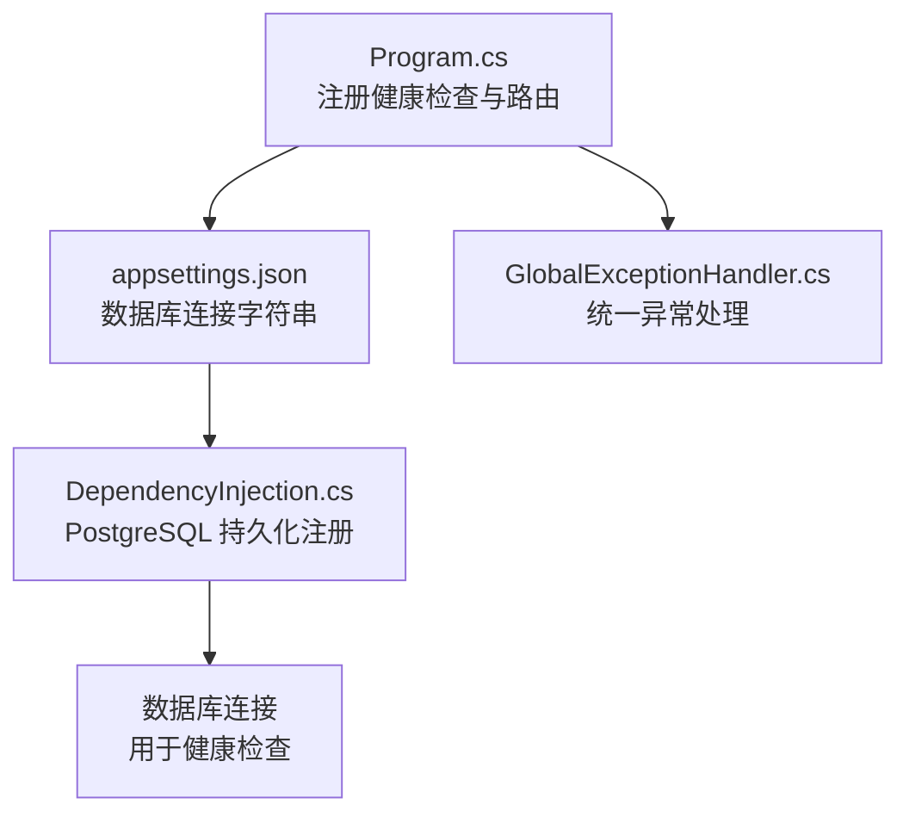
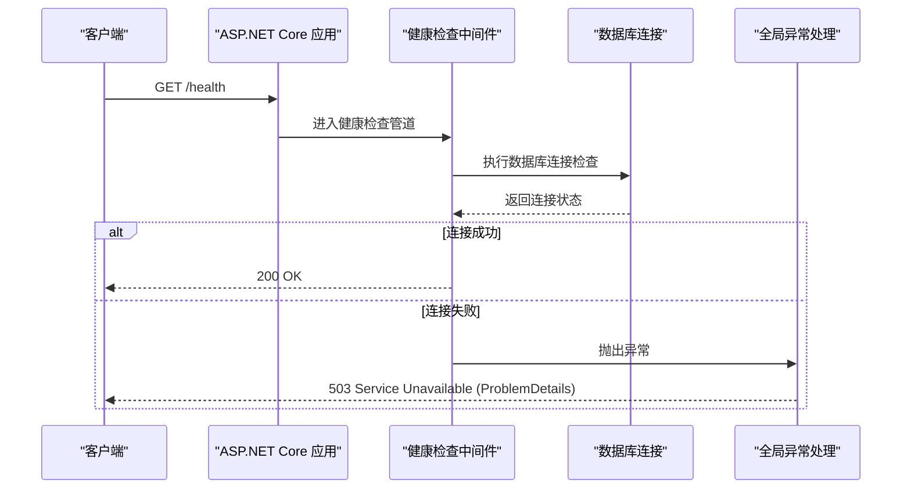
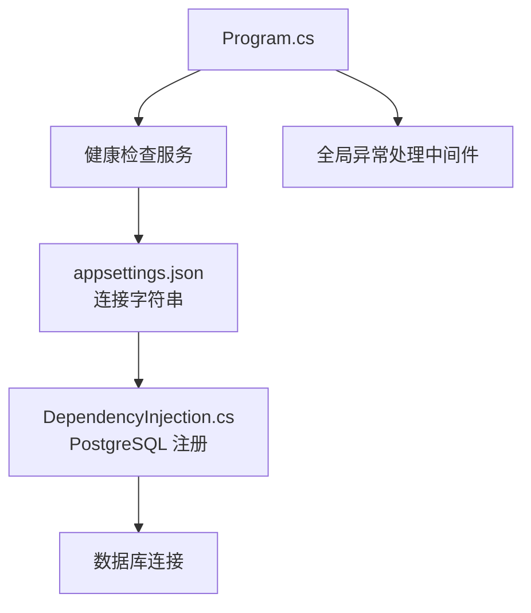

# 健康检查API

<cite>
**本文档引用的文件**
- [Program.cs](file://IndustrialDataSolution/IndustrialDataProcessor.Api/Program.cs)
- [appsettings.json](file://IndustrialDataSolution/IndustrialDataProcessor.Api/appsettings.json)
- [DependencyInjection.cs](file://IndustrialDataSolution/IndustrialDataProcessor.Infrastructure.Persistence.SqlSugar/DependencyInjection.cs)
- [GlobalExceptionHandler.cs](file://IndustrialDataSolution/IndustrialDataProcessor.Api/Middleware/GlobalExceptionHandler.cs)
</cite>

## 目录
1. [简介](#简介)
2. [项目结构](#项目结构)
3. [核心组件](#核心组件)
4. [架构概览](#架构概览)
5. [详细组件分析](#详细组件分析)
6. [依赖关系分析](#依赖关系分析)
7. [性能考虑](#性能考虑)
8. [故障排除指南](#故障排除指南)
9. [结论](#结论)

## 简介
本文件详细说明系统健康检查API的实现与使用，重点围绕 `/health` 端点的功能、用途与响应格式。根据代码库分析，系统通过 ASP.NET Core 内置的健康检查机制提供服务可用性检查能力，并结合全局异常处理中间件对健康检查过程中的异常进行统一处理。本文档还涵盖如何在 Kubernetes 等容器编排平台中使用该接口进行健康探针配置，以及常见故障排除方法。

## 项目结构
健康检查功能由以下关键文件支撑：
- 应用程序入口与健康检查路由注册
- 数据库连接配置与健康检查集成
- 全局异常处理与健康检查响应格式

图表来源
- [Program.cs](file://IndustrialDataSolution/IndustrialDataProcessor.Api/Program.cs#L27-L47)
- [appsettings.json](file://IndustrialDataSolution/IndustrialDataProcessor.Api/appsettings.json#L10-L12)
- [DependencyInjection.cs](file://IndustrialDataSolution/IndustrialDataProcessor.Infrastructure.Persistence.SqlSugar/DependencyInjection.cs#L11-L43)
- [GlobalExceptionHandler.cs](file://IndustrialDataSolution/IndustrialDataProcessor.Api/Middleware/GlobalExceptionHandler.cs#L37-L42)

章节来源
- [Program.cs](file://IndustrialDataSolution/IndustrialDataProcessor.Api/Program.cs#L10-L51)
- [appsettings.json](file://IndustrialDataSolution/IndustrialDataProcessor.Api/appsettings.json#L10-L12)

## 核心组件
- 健康检查端点注册：在应用程序构建阶段注册健康检查服务，并将 `/health` 路由映射到健康检查端点。
- 数据库连接健康检查：通过 PostgreSQL 持久化配置中的连接字符串，将数据库连接可用性纳入健康检查范围。
- 统一异常处理：当健康检查过程中出现异常时，由全局异常处理中间件输出标准 ProblemDetails 格式的错误响应。

章节来源
- [Program.cs](file://IndustrialDataSolution/IndustrialDataProcessor.Api/Program.cs#L27-L47)
- [DependencyInjection.cs](file://IndustrialDataSolution/IndustrialDataProcessor.Infrastructure.Persistence.SqlSugar/DependencyInjection.cs#L11-L43)
- [GlobalExceptionHandler.cs](file://IndustrialDataSolution/IndustrialDataProcessor.Api/Middleware/GlobalExceptionHandler.cs#L37-L42)

## 架构概览
健康检查端点的调用流程如下：

图表来源
- [Program.cs](file://IndustrialDataSolution/IndustrialDataProcessor.Api/Program.cs#L27-L47)
- [DependencyInjection.cs](file://IndustrialDataSolution/IndustrialDataProcessor.Infrastructure.Persistence.SqlSugar/DependencyInjection.cs#L11-L43)
- [GlobalExceptionHandler.cs](file://IndustrialDataSolution/IndustrialDataProcessor.Api/Middleware/GlobalExceptionHandler.cs#L37-L42)

## 详细组件分析

### 健康检查端点与路由
- 健康检查服务注册：在应用程序构建阶段调用健康检查服务注册方法，启用内置的健康检查能力。
- 路由映射：将 `/health` 路由映射到健康检查端点，使外部系统可通过该路径进行服务可用性探测。

章节来源
- [Program.cs](file://IndustrialDataSolution/IndustrialDataProcessor.Api/Program.cs#L27-L47)

### 数据库连接健康检查
- 连接字符串配置：数据库连接字符串从应用配置中读取，用于建立与 PostgreSQL 的连接。
- 健康检查集成：通过持久化层的依赖注入注册，将数据库连接可用性纳入健康检查范围，确保在健康检查时验证数据库可达性。

章节来源
- [appsettings.json](file://IndustrialDataSolution/IndustrialDataProcessor.Api/appsettings.json#L10-L12)
- [DependencyInjection.cs](file://IndustrialDataSolution/IndustrialDataProcessor.Infrastructure.Persistence.SqlSugar/DependencyInjection.cs#L11-L43)

### 统一异常处理与健康检查响应
- 异常捕获：当健康检查过程中发生异常（如数据库连接失败），由全局异常处理中间件捕获。
- 响应格式：异常处理中间件将错误封装为标准的 ProblemDetails 格式，包含状态码、标题与详情信息，便于监控系统识别服务状态。

章节来源
- [GlobalExceptionHandler.cs](file://IndustrialDataSolution/IndustrialDataProcessor.Api/Middleware/GlobalExceptionHandler.cs#L37-L42)

### 健康检查响应格式与状态码
- 成功响应：当数据库连接检查通过时，健康检查返回 200 OK。
- 失败响应：当数据库连接检查失败时，返回 503 Service Unavailable，并包含 ProblemDetails 格式的错误信息，其中标题为“基础设施不可用”，详情为“数据库或外部服务不可用”。

章节来源
- [GlobalExceptionHandler.cs](file://IndustrialDataSolution/IndustrialDataProcessor.Api/Middleware/GlobalExceptionHandler.cs#L37-L42)

## 依赖关系分析
健康检查功能的依赖关系如下：

图表来源
- [Program.cs](file://IndustrialDataSolution/IndustrialDataProcessor.Api/Program.cs#L27-L47)
- [appsettings.json](file://IndustrialDataSolution/IndustrialDataProcessor.Api/appsettings.json#L10-L12)
- [DependencyInjection.cs](file://IndustrialDataSolution/IndustrialDataProcessor.Infrastructure.Persistence.SqlSugar/DependencyInjection.cs#L11-L43)
- [GlobalExceptionHandler.cs](file://IndustrialDataSolution/IndustrialDataProcessor.Api/Middleware/GlobalExceptionHandler.cs#L37-L42)

章节来源
- [Program.cs](file://IndustrialDataSolution/IndustrialDataProcessor.Api/Program.cs#L10-L51)
- [appsettings.json](file://IndustrialDataSolution/IndustrialDataProcessor.Api/appsettings.json#L10-L12)
- [DependencyInjection.cs](file://IndustrialDataSolution/IndustrialDataProcessor.Infrastructure.Persistence.SqlSugar/DependencyInjection.cs#L11-L43)
- [GlobalExceptionHandler.cs](file://IndustrialDataSolution/IndustrialDataProcessor.Api/Middleware/GlobalExceptionHandler.cs#L37-L42)

## 性能考虑
- 健康检查应尽量轻量：仅执行必要的最小化检查（如数据库连接），避免执行耗时操作，以免影响探针频率与系统负载。
- 探针间隔与超时：在容器编排平台中合理设置探针的检查间隔与超时时间，避免过于频繁的检查造成数据库压力。
- 缓存与连接池：数据库连接池配置应满足健康检查的瞬时需求，避免因连接池耗尽导致健康检查失败。

## 故障排除指南
- 健康检查返回 503 Service Unavailable
  - 可能原因：数据库连接失败或不可用。
  - 处理步骤：
    1. 检查数据库服务状态与网络连通性。
    2. 验证连接字符串配置是否正确。
    3. 查看全局异常处理中间件输出的 ProblemDetails 详情，确认错误类型与提示信息。
- 健康检查返回 200 OK
  - 表示数据库连接正常，服务可用。
- 健康检查无响应或超时
  - 可能原因：探针超时时间过短、数据库连接池耗尽或网络延迟过高。
  - 处理步骤：
    1. 调整探针超时与重试策略。
    2. 检查数据库连接池配置与资源使用情况。
    3. 确认防火墙与网络策略允许健康检查流量访问。

章节来源
- [GlobalExceptionHandler.cs](file://IndustrialDataSolution/IndustrialDataProcessor.Api/Middleware/GlobalExceptionHandler.cs#L37-L42)
- [appsettings.json](file://IndustrialDataSolution/IndustrialDataProcessor.Api/appsettings.json#L10-L12)

## 结论
本系统通过 ASP.NET Core 的健康检查机制与统一异常处理中间件，实现了对数据库连接状态的健康检查，并以标准 ProblemDetails 格式对外输出结果。在容器编排环境中，可通过 `/health` 端点进行服务可用性探测，结合合理的探针配置与故障排除流程，确保系统稳定运行与快速故障定位。