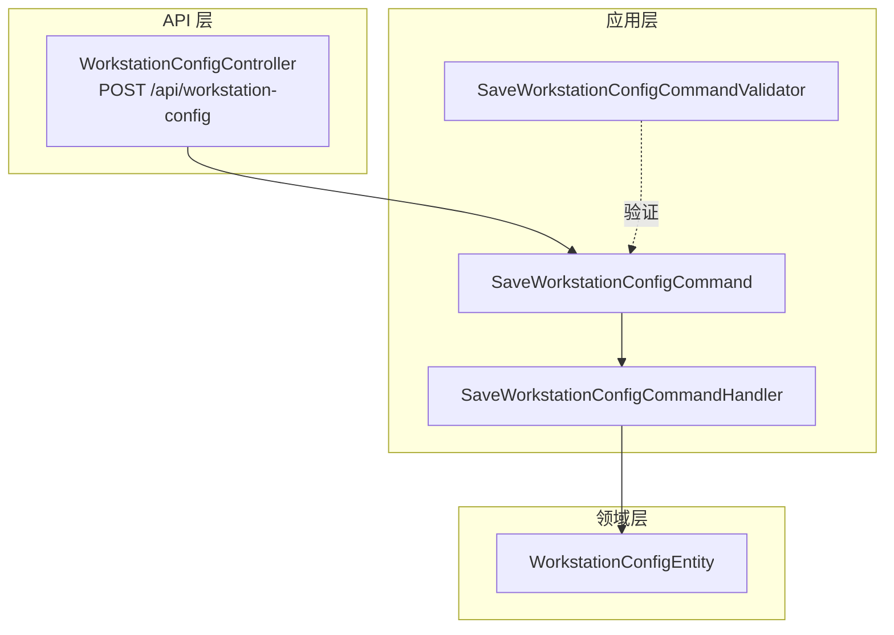
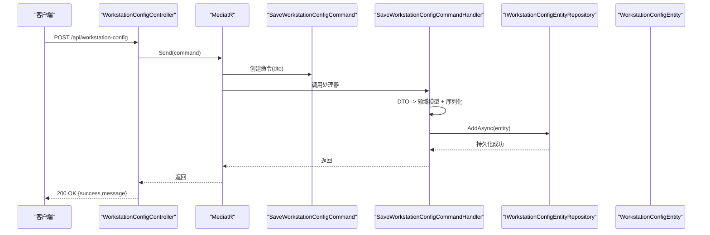
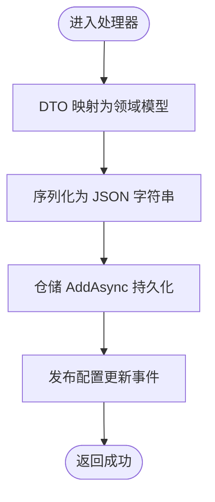
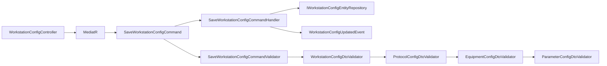

# 工作站配置API

<cite>
**本文引用的文件**
- [WorkstationConfigController.cs](file://IndustrialDataSolution/IndustrialDataProcessor.Api/Controllers/WorkstationConfigController.cs)
- [SaveWorkstationConfigCommand.cs](file://IndustrialDataSolution/IndustrialDataProcessor.Application/Commands/SaveWorkstationConfigCommand.cs)
- [SaveWorkstationConfigCommandHandler.cs](file://IndustrialDataSolution/IndustrialDataProcessor.Application/CommandHandlers/SaveWorkstationConfigCommandHandler.cs)
- [WorkstationConfigDto.cs](file://IndustrialDataSolution/IndustrialDataProcessor.Application/Dtos/WorkstationDto/WorkstationConfigDto.cs)
- [EquipmentConfigDto.cs](file://IndustrialDataSolution/IndustrialDataProcessor.Application/Dtos/WorkstationDto/EquipmentConfigDto.cs)
- [ParameterConfigDto.cs](file://IndustrialDataSolution/IndustrialDataProcessor.Application/Dtos/WorkstationDto/ParameterConfigDto.cs)
- [ProtocolConfigDto.cs](file://IndustrialDataSolution/IndustrialDataProcessor.Application/Dtos/WorkstationDto/ProtocolConfigDto.cs)
- [WorkstationConfigDtoValidator.cs](file://IndustrialDataSolution/IndustrialDataProcessor.Application/Validators/WorkstationConfigDtoValidator.cs)
- [ProtocolConfigDtoValidator.cs](file://IndustrialDataSolution/IndustrialDataProcessor.Application/Validators/ProtocolConfigDtoValidator.cs)
- [EquipmentConfigDtoValidator.cs](file://IndustrialDataSolution/IndustrialDataProcessor.Application/Validators/EquipmentConfigDtoValidator.cs)
- [ParameterConfigDtoValidator.cs](file://IndustrialDataSolution/IndustrialDataProcessor.Application/Validators/ParameterConfigDtoValidator.cs)
- [SaveWorkstationConfigCommandValidator.cs](file://IndustrialDataSolution/IndustrialDataProcessor.Application/Validators/SaveWorkstationConfigCommandValidator.cs)
- [WorkstationConfigEntity.cs](file://IndustrialDataSolution/IndustrialDataProcessor.Domain/Entities/WorkstationConfigEntity.cs)
- [Program.cs](file://IndustrialDataSolution/IndustrialDataProcessor.Api/Program.cs)
</cite>

## 目录
1. [简介](#简介)
2. [项目结构](#项目结构)
3. [核心组件](#核心组件)
4. [架构总览](#架构总览)
5. [详细组件分析](#详细组件分析)
6. [依赖分析](#依赖分析)
7. [性能考虑](#性能考虑)
8. [故障排查指南](#故障排查指南)
9. [结论](#结论)
10. [附录：API规范与示例](#附录api规范与示例)

## 简介
本文件为“工作站配置”管理功能的API文档，聚焦于保存工作站配置的POST接口。内容涵盖：
- 完整请求参数结构与数据模型（WorkstationConfigDto及其嵌套结构）
- 请求数据验证规则与错误处理
- 响应格式与状态码
- 认证与授权要求
- 常见错误场景与最佳实践

## 项目结构
工作站配置API位于Web层控制器，通过MediatR命令模式将HTTP请求转换为应用层命令，再由处理器调用仓储持久化至数据库。

图表来源
- [WorkstationConfigController.cs](file://IndustrialDataSolution/IndustrialDataProcessor.Api/Controllers/WorkstationConfigController.cs#L10-L21)
- [SaveWorkstationConfigCommand.cs](file://IndustrialDataSolution/IndustrialDataProcessor.Application/Commands/SaveWorkstationConfigCommand.cs#L7-L7)
- [SaveWorkstationConfigCommandHandler.cs](file://IndustrialDataSolution/IndustrialDataProcessor.Application/CommandHandlers/SaveWorkstationConfigCommandHandler.cs#L18-L30)
- [WorkstationConfigEntity.cs](file://IndustrialDataSolution/IndustrialDataProcessor.Domain/Entities/WorkstationConfigEntity.cs#L3-L6)

章节来源
- [WorkstationConfigController.cs](file://IndustrialDataSolution/IndustrialDataProcessor.Api/Controllers/WorkstationConfigController.cs#L10-L21)
- [Program.cs](file://IndustrialDataSolution/IndustrialDataProcessor.Api/Program.cs#L38-L49)

## 核心组件
- 控制器：接收HTTP请求，封装为命令并交由MediatR处理。
- 命令与处理器：负责将DTO映射为领域实体，序列化后持久化，并发布配置更新事件。
- 验证器：对WorkstationConfigDto及其嵌套对象进行严格校验。
- 数据模型：WorkstationConfigDto、ProtocolConfigDto、EquipmentConfigDto、ParameterConfigDto构成完整的配置结构。

章节来源
- [SaveWorkstationConfigCommand.cs](file://IndustrialDataSolution/IndustrialDataProcessor.Application/Commands/SaveWorkstationConfigCommand.cs#L7-L7)
- [SaveWorkstationConfigCommandHandler.cs](file://IndustrialDataSolution/IndustrialDataProcessor.Application/CommandHandlers/SaveWorkstationConfigCommandHandler.cs#L18-L30)
- [WorkstationConfigDto.cs](file://IndustrialDataSolution/IndustrialDataProcessor.Application/Dtos/WorkstationDto/WorkstationConfigDto.cs#L5-L26)

## 架构总览
POST保存配置的完整流程如下：

图表来源
- [WorkstationConfigController.cs](file://IndustrialDataSolution/IndustrialDataProcessor.Api/Controllers/WorkstationConfigController.cs#L14-L21)
- [SaveWorkstationConfigCommand.cs](file://IndustrialDataSolution/IndustrialDataProcessor.Application/Commands/SaveWorkstationConfigCommand.cs#L7-L7)
- [SaveWorkstationConfigCommandHandler.cs](file://IndustrialDataSolution/IndustrialDataProcessor.Application/CommandHandlers/SaveWorkstationConfigCommandHandler.cs#L18-L30)
- [WorkstationConfigEntity.cs](file://IndustrialDataSolution/IndustrialDataProcessor.Domain/Entities/WorkstationConfigEntity.cs#L3-L6)

## 详细组件分析

### 数据模型与嵌套结构
WorkstationConfigDto为核心容器，包含以下字段：
- Id：工作站标识，必填
- Name：工作站名称，可空
- IpAddress：IP地址，必填且需为IPv4
- Protocols：协议配置列表，必填，至少一项

每个ProtocolConfigDto包含：
- Id：协议标识，必填
- InterfaceType：接口类型（如LAN、COM、DATABASE、API），必填且有效
- ProtocolType：协议类型，必填且有效
- 通讯超时与延时：均有默认值，但不得为负数
- 凭据与备注：可空
- 可选参数：可空
- 设备列表：必填，至少一项
- 网络参数：当接口类型为LAN时，需提供IP与合法端口
- 串口参数：当接口类型为COM时，需提供串口名与完整的串口参数枚举
- 数据库参数：当接口类型为DATABASE时，需提供查询SQL；连接方式可使用连接字符串或分离字段组合
- API参数：当接口类型为API时，需提供请求方法与访问API字符串

每个EquipmentConfigDto包含：
- Id：设备标识，必填
- IsCollect：是否采集，必填
- Name：设备名称，可空
- EquipmentType：设备类型枚举，必填
- Parameters：参数列表，必填且至少一项
- ProtocolType：协议类型，由上层传递

每个ParameterConfigDto包含：
- Label：参数标签，必填
- Address：地址，必填
- IsMonitor：是否监控，布尔，默认false
- StationNo：站号，按协议类型可能必填
- DataFormat：数据格式/字节序，按协议类型可能必填
- AddressStartWithZero：地址是否从0开始，按协议类型可能必填
- InstrumentType：仪表类型，按协议类型可能必填
- DataType：数据类型，可空但若提供需有效
- Length：长度，>=0
- DefaultValue：默认值，可空
- Cycle：采集周期，>=0
- PositiveExpression：表达式，可空
- MinValue/MaxValue：数值范围校验，MinValue不得大于MaxValue
- Value：写入值，可空
- ProtocolType：协议类型，由上层传递
- EquipmentId：设备Id，由上层传递

章节来源
- [WorkstationConfigDto.cs](file://IndustrialDataSolution/IndustrialDataProcessor.Application/Dtos/WorkstationDto/WorkstationConfigDto.cs#L5-L26)
- [ProtocolConfigDto.cs](file://IndustrialDataSolution/IndustrialDataProcessor.Application/Dtos/WorkstationDto/ProtocolConfigDto.cs#L7-L91)
- [EquipmentConfigDto.cs](file://IndustrialDataSolution/IndustrialDataProcessor.Application/Dtos/WorkstationDto/EquipmentConfigDto.cs#L8-L38)
- [ParameterConfigDto.cs](file://IndustrialDataSolution/IndustrialDataProcessor.Application/Dtos/WorkstationDto/ParameterConfigDto.cs#L9-L93)

### 验证规则与错误处理
- WorkstationConfigDtoValidator
  - Id非空
  - IpAddress非空且为IPv4
  - Protocols非空，逐个委托ProtocolConfigDtoValidator验证
- ProtocolConfigDtoValidator
  - Id、ProtocolType、InterfaceType非空且有效
  - InterfaceType与ProtocolType需兼容
  - 通讯超时与延时>=0（延时>=500）
  - LAN：IP非空且有效，端口>0且<=65535
  - COM：串口名非空，波特率、数据位、校验位、停止位均非空且有效
  - DATABASE：查询SQL非空；连接方式至少满足一种（连接字符串或IP+端口+库名）
  - API：请求方法非空且有效，访问API字符串非空
  - Equipments非空，逐个委托EquipmentConfigDtoValidator验证
- EquipmentConfigDtoValidator
  - Id非空
  - EquipmentType有效枚举
  - Parameters非空且至少一项
  - 向下传递ProtocolType与EquipmentId给每个Parameter
- ParameterConfigDtoValidator
  - Label、Address非空
  - DataType、DataFormat、InstrumentType按需校验有效性
  - Length、Cycle>=0
  - MinValue与MaxValue：若均提供则MinValue不得大于MaxValue
  - 协议特定字段：依据协议类型特性，按ProtocolValidateParameterAttribute要求进行强制校验

章节来源
- [WorkstationConfigDtoValidator.cs](file://IndustrialDataSolution/IndustrialDataProcessor.Application/Validators/WorkstationConfigDtoValidator.cs#L6-L35)
- [ProtocolConfigDtoValidator.cs](file://IndustrialDataSolution/IndustrialDataProcessor.Application/Validators/ProtocolConfigDtoValidator.cs#L8-L163)
- [EquipmentConfigDtoValidator.cs](file://IndustrialDataSolution/IndustrialDataProcessor.Application/Validators/EquipmentConfigDtoValidator.cs#L6-L42)
- [ParameterConfigDtoValidator.cs](file://IndustrialDataSolution/IndustrialDataProcessor.Application/Validators/ParameterConfigDtoValidator.cs#L9-L96)

### 保存流程与持久化
- 控制器接收请求，封装为SaveWorkstationConfigCommand
- 处理器将DTO映射为领域实体并序列化为JSON
- 使用仓储添加实体，随后发布WorkstationConfigUpdatedEvent以触发后续事件（如清理缓存）

图表来源
- [SaveWorkstationConfigCommandHandler.cs](file://IndustrialDataSolution/IndustrialDataProcessor.Application/CommandHandlers/SaveWorkstationConfigCommandHandler.cs#L18-L30)
- [WorkstationConfigEntity.cs](file://IndustrialDataSolution/IndustrialDataProcessor.Domain/Entities/WorkstationConfigEntity.cs#L3-L6)

章节来源
- [SaveWorkstationConfigCommandHandler.cs](file://IndustrialDataSolution/IndustrialDataProcessor.Application/CommandHandlers/SaveWorkstationConfigCommandHandler.cs#L18-L30)

## 依赖分析
- 控制器依赖MediatR以解耦请求处理
- 命令处理器依赖仓储与事件总线，实现关注点分离
- 验证器链路自上而下：SaveWorkstationConfigCommandValidator -> WorkstationConfigDtoValidator -> ProtocolConfigDtoValidator -> EquipmentConfigDtoValidator -> ParameterConfigDtoValidator

图表来源
- [WorkstationConfigController.cs](file://IndustrialDataSolution/IndustrialDataProcessor.Api/Controllers/WorkstationConfigController.cs#L10-L21)
- [SaveWorkstationConfigCommand.cs](file://IndustrialDataSolution/IndustrialDataProcessor.Application/Commands/SaveWorkstationConfigCommand.cs#L7-L7)
- [SaveWorkstationConfigCommandHandler.cs](file://IndustrialDataSolution/IndustrialDataProcessor.Application/CommandHandlers/SaveWorkstationConfigCommandHandler.cs#L11-L16)
- [SaveWorkstationConfigCommandValidator.cs](file://IndustrialDataSolution/IndustrialDataProcessor.Application/Validators/SaveWorkstationConfigCommandValidator.cs#L6-L12)

章节来源
- [SaveWorkstationConfigCommandValidator.cs](file://IndustrialDataSolution/IndustrialDataProcessor.Application/Validators/SaveWorkstationConfigCommandValidator.cs#L6-L12)

## 性能考虑
- 验证器在应用层集中执行，避免无效请求进入持久化层
- JSON序列化采用统一选项，保证一致性
- 事件发布用于触发缓存清理等副作用，建议在高并发场景下评估事件处理开销

## 故障排查指南
- 常见错误与状态码
  - 400 Bad Request：请求体缺失、JSON格式错误、字段校验失败（如IP格式不正确、端口越界、枚举值无效、协议与接口不兼容等）
  - 401 Unauthorized：未通过身份认证
  - 403 Forbidden：无权限访问
  - 500 Internal Server Error：服务器内部异常（由全局异常中间件统一处理）
- 定位步骤
  - 查看控制器返回的响应体与状态码
  - 检查验证器抛出的具体字段与消息
  - 关注接口类型与协议类型的兼容性
  - 确认网络、串口、数据库、API参数的完整性与合法性

章节来源
- [Program.cs](file://IndustrialDataSolution/IndustrialDataProcessor.Api/Program.cs#L32-L41)

## 结论
该API通过清晰的DTO分层与严格的验证规则，确保工作站配置在保存前即具备强一致性和可执行性。结合MediatR与仓储模式，实现了职责分离与可维护性。建议在生产环境中配合完善的日志与监控，以便快速定位配置错误与运行异常。

## 附录：API规范与示例

### 端点定义
- 方法：POST
- 路径：/api/workstation-config
- 功能：保存工作站配置

### 请求头
- Content-Type: application/json
- 授权：根据部署环境启用的身份认证机制

### 请求体
- 类型：WorkstationConfigDto
- 结构要点：
  - Id：必填，非空
  - IpAddress：必填，必须为有效的IPv4地址
  - Protocols：必填，至少一项
  - Protocols[].InterfaceType：必填，有效枚举
  - Protocols[].ProtocolType：必填，有效枚举
  - Protocols[].Equipments：必填，至少一项
  - 根据InterfaceType提供相应参数：
    - LAN：Protocols[].IpAddress、Protocols[].ProtocolPort
    - COM：Protocols[].SerialPortName、BaudRate、DataBits、Parity、StopBits
    - DATABASE：Protocols[].QuerySqlString；至少提供连接字符串或IP+端口+库名
    - API：Protocols[].RequestMethod、AccessApiString

### 成功响应
- 状态码：200 OK
- 响应体：
  - success：布尔，表示操作是否成功
  - message：字符串，描述结果

### 错误响应
- 状态码：400 Bad Request（字段校验失败）、401 Unauthorized（未认证）、403 Forbidden（无权限）、500 Internal Server Error（服务器异常）
- 响应体：包含错误详情（由全局异常中间件统一格式化）

### 示例

- 正常配置请求（简化示意）
  - WorkstationConfigDto
    - Id："WS001"
    - IpAddress："192.168.1.10"
    - Protocols：
      - Id："P001"
      - InterfaceType："LAN"
      - ProtocolType："ModbusTcp"
      - IpAddress："192.168.1.200"
      - ProtocolPort：502
      - Equipments：
        - Id："E001"
        - EquipmentType："Equipment"
        - Parameters：
          - Label："温度"
          - Address："1001"
          - DataType："Float32"
          - Length：2
          - Cycle：1000

- 正常响应
  - 200 OK
  - {"success":true,"message":"配置保存成功"}

- 错误配置示例
  - LAN接口缺少端口或IP无效
  - COM接口缺少串口参数或枚举值无效
  - DATABASE接口缺少查询SQL或连接方式不完整
  - API接口缺少请求方法或访问API字符串
  - 参数中MinValue大于MaxValue
  - 协议与接口类型不兼容

章节来源
- [WorkstationConfigController.cs](file://IndustrialDataSolution/IndustrialDataProcessor.Api/Controllers/WorkstationConfigController.cs#L14-L21)
- [WorkstationConfigDto.cs](file://IndustrialDataSolution/IndustrialDataProcessor.Application/Dtos/WorkstationDto/WorkstationConfigDto.cs#L5-L26)
- [ProtocolConfigDto.cs](file://IndustrialDataSolution/IndustrialDataProcessor.Application/Dtos/WorkstationDto/ProtocolConfigDto.cs#L7-L91)
- [EquipmentConfigDto.cs](file://IndustrialDataSolution/IndustrialDataProcessor.Application/Dtos/WorkstationDto/EquipmentConfigDto.cs#L8-L38)
- [ParameterConfigDto.cs](file://IndustrialDataSolution/IndustrialDataProcessor.Application/Dtos/WorkstationDto/ParameterConfigDto.cs#L9-L93)
- [WorkstationConfigDtoValidator.cs](file://IndustrialDataSolution/IndustrialDataProcessor.Application/Validators/WorkstationConfigDtoValidator.cs#L6-L35)
- [ProtocolConfigDtoValidator.cs](file://IndustrialDataSolution/IndustrialDataProcessor.Application/Validators/ProtocolConfigDtoValidator.cs#L8-L163)
- [EquipmentConfigDtoValidator.cs](file://IndustrialDataSolution/IndustrialDataProcessor.Application/Validators/EquipmentConfigDtoValidator.cs#L6-L42)
- [ParameterConfigDtoValidator.cs](file://IndustrialDataSolution/IndustrialDataProcessor.Application/Validators/ParameterConfigDtoValidator.cs#L9-L96)