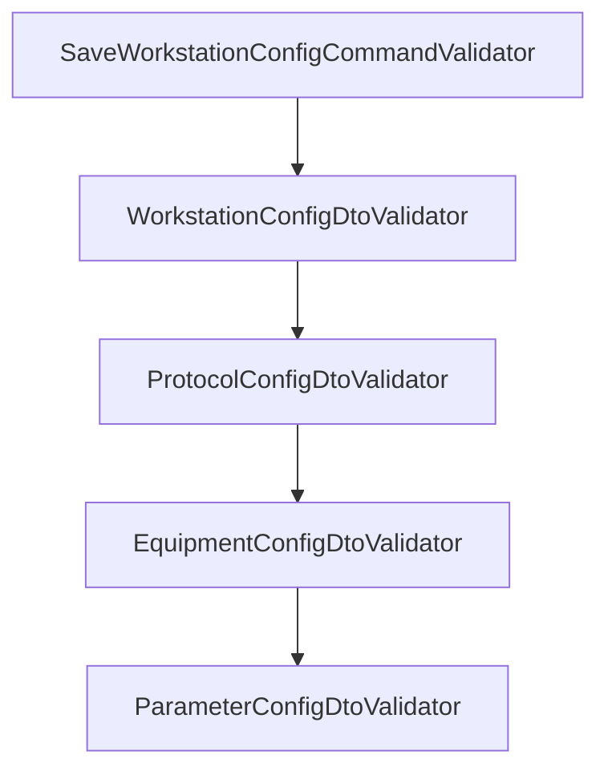

# 工作站配置验证规则

<cite>
**本文引用的文件**
- [WorkstationConfigDtoValidator.cs](file://IndustrialDataSolution/IndustrialDataProcessor.Application/Validators/WorkstationConfigDtoValidator.cs)
- [ProtocolConfigDtoValidator.cs](file://IndustrialDataSolution/IndustrialDataProcessor.Application/Validators/ProtocolConfigDtoValidator.cs)
- [EquipmentConfigDtoValidator.cs](file://IndustrialDataSolution/IndustrialDataProcessor.Application/Validators/EquipmentConfigDtoValidator.cs)
- [ParameterConfigDtoValidator.cs](file://IndustrialDataSolution/IndustrialDataProcessor.Application/Validators/ParameterConfigDtoValidator.cs)
- [ProtocolType.cs](file://IndustrialDataSolution/IndustrialDataProcessor.Domain/Enums/ProtocolType.cs)
</cite>

## 目录
1. [概述](#概述)
2. [验证器层级结构](#验证器层级结构)
3. [WorkstationConfigDto 验证规则](#workstationconfigdto-验证规则)
4. [ProtocolConfigDto 验证规则](#protocolconfigdto-验证规则)
5. [EquipmentConfigDto 验证规则](#equipmentconfigdto-验证规则)
6. [ParameterConfigDto 验证规则](#parameterconfigdto-验证规则)
7. [测试用例汇总](#测试用例汇总)

## 概述

工作站配置API使用FluentValidation进行请求数据验证。验证器采用层级结构，自上而下逐级校验：

```
SaveWorkstationConfigCommandValidator
    └── WorkstationConfigDtoValidator
            └── ProtocolConfigDtoValidator
                    └── EquipmentConfigDtoValidator
                            └── ParameterConfigDtoValidator
```

## 验证器层级结构



## WorkstationConfigDto 验证规则

### 字段验证规则

| 字段 | 是否必填 | 验证规则 | 错误消息 |
|------|----------|----------|----------|
| Id | 可选 | 允许为空或空字符串 | - |
| Name | 可选 | 允许为空 | - |
| IpAddress | 可选 | 允许为空或空字符串 | - |
| Protocols | 必填 | 不能为null且不能为空数组 | "协议列表不能为null" / "协议列表不能为空，至少需要一个协议配置" |

### 测试用例

| 序号 | 场景 | 输入 | 预期结果 |
|------|------|------|----------|
| WS-01 | Protocols为null | `{"Protocols": null}` | 400 - "协议列表不能为null" |
| WS-02 | Protocols为空数组 | `{"Protocols": []}` | 400 - "协议列表不能为空，至少需要一个协议配置" |
| WS-03 | Id为空但有有效Protocols | `{"Id": "", "Protocols": [...]}` | 200 - 成功（Id可选） |
| WS-04 | 完整有效配置 | 完整配置 | 200 - 成功 |

## ProtocolConfigDto 验证规则

### 基础必填字段

| 字段 | 是否必填 | 验证规则 | 错误消息 |
|------|----------|----------|----------|
| Id | 必填 | 不能为空 | "协议Id不能为空" |
| InterfaceType | 必填 | 必须是合法枚举值 | "协议Id: {Id} 接口类型无效，必须是 LAN, COM, API, DATABASE 之一" |
| ProtocolType | 必填 | 必须是合法枚举值，且与InterfaceType兼容 | "协议Id: {Id} 协议类型无效" / "协议Id: {Id} 接口类型 {InterfaceType} 不支持协议类型 {ProtocolType}" |
| Equipments | 必填 | 不能为null且不能为空 | "协议Id: {Id} 设备列表不能为null" / "协议Id: {Id} 设备列表不能为空，至少需要一个设备配置" |

### 通讯参数（可选，有默认值）

| 字段 | 默认值 | 说明 |
|------|--------|------|
| CommunicationDelay | 50000 | 通讯延时（毫秒） |
| ReceiveTimeOut | 10000 | 接收超时（毫秒） |
| ConnectTimeOut | 10000 | 连接超时（毫秒） |

### 接口类型条件验证 - LAN

当 `InterfaceType = LAN` 时，以下字段必填：

| 字段 | 验证规则 | 错误消息 |
|------|----------|----------|
| IpAddress | 不能为空且必须是合法IPv4格式 | "协议Id: {Id} 协议类型: {ProtocolType} IP地址不能为空" / "IP地址格式不正确" |
| ProtocolPort | 不能为null，范围1-65535 | "端口不能为空" / "端口必须大于0" / "端口不能超过65535" |

### 接口类型条件验证 - COM

当 `InterfaceType = COM` 时，以下字段必填：

| 字段 | 验证规则 | 错误消息 |
|------|----------|----------|
| SerialPortName | 不能为空 | "协议Id: {Id} 协议类型: {ProtocolType} 串口名称不能为空" |
| BaudRate | 不能为null，必须是合法枚举 | "波特率不能为空" / "波特率无效" |
| DataBits | 不能为null，必须是合法枚举 | "数据位不能为空" / "数据位无效" |
| Parity | 不能为null，必须是合法枚举 | "校验位不能为空" / "校验位无效" |
| StopBits | 不能为null，必须是合法枚举 | "停止位不能为空" / "停止位无效" |

### 接口类型条件验证 - DATABASE

当 `InterfaceType = DATABASE` 时，以下字段必填：

| 字段 | 验证规则 | 错误消息 |
|------|----------|----------|
| DatabaseName | 不能为空 | "协议Id: {Id} 协议类型: {ProtocolType} 数据库名称不能为空" |
| DatabaseConnectString | 不能为空 | "协议Id: {Id} 协议类型: {ProtocolType} 数据库连接字符串不能为空" |
| QuerySqlString | 不能为空 | "协议Id: {Id} 协议类型: {ProtocolType} 查询SQL语句不能为空" |

### 接口类型条件验证 - API

当 `InterfaceType = API` 时，以下字段必填：

| 字段 | 验证规则 | 错误消息 |
|------|----------|----------|
| RequestMethod | 不能为null，必须是合法枚举 | "协议Id: {Id} 协议类型: {ProtocolType} 请求方式不能为空" / "请求方式无效" |
| AccessApiString | 不能为空 | "协议Id: {Id} 协议类型: {ProtocolType} 访问API地址不能为空" |

### ProtocolConfigDto 测试用例

| 序号 | 场景 | InterfaceType | 预期错误 |
|------|------|---------------|----------|
| P-01 | Id为空 | 任意 | "协议Id不能为空" |
| P-02 | InterfaceType无效 | 999 | "接口类型无效" |
| P-03 | ProtocolType无效 | 任意 | "协议类型无效" |
| P-04 | 接口与协议不兼容 | LAN + ModbusRtu | "接口类型 LAN 不支持协议类型 ModbusRtu" |
| P-05 | Equipments为null | 任意 | "设备列表不能为null" |
| P-06 | Equipments为空 | 任意 | "设备列表不能为空，至少需要一个设备配置" |
| P-07 | LAN缺少IpAddress | LAN | "IP地址不能为空" |
| P-08 | LAN的IP格式错误 | LAN | "IP地址格式不正确" |
| P-09 | LAN缺少端口 | LAN | "端口不能为空" |
| P-10 | LAN端口为0 | LAN | "端口必须大于0" |
| P-11 | LAN端口超过65535 | LAN | "端口不能超过65535" |
| P-12 | COM缺少串口名 | COM | "串口名称不能为空" |
| P-13 | COM缺少波特率 | COM | "波特率不能为空" |
| P-14 | COM缺少数据位 | COM | "数据位不能为空" |
| P-15 | COM缺少校验位 | COM | "校验位不能为空" |
| P-16 | COM缺少停止位 | COM | "停止位不能为空" |
| P-17 | DATABASE缺少数据库名 | DATABASE | "数据库名称不能为空" |
| P-18 | DATABASE缺少连接字符串 | DATABASE | "数据库连接字符串不能为空" |
| P-19 | DATABASE缺少SQL | DATABASE | "查询SQL语句不能为空" |
| P-20 | API缺少请求方法 | API | "请求方式不能为空" |
| P-21 | API缺少访问地址 | API | "访问API地址不能为空" |

## EquipmentConfigDto 验证规则

### 字段验证规则

| 字段 | 是否必填 | 默认值 | 验证规则 | 错误消息 |
|------|----------|--------|----------|----------|
| Id | 必填 | - | 不能为空 | "协议类型: {ProtocolType} 设备[Id]不能为空" |
| IsCollect | 可选 | true | - | - |
| Name | 可选 | null | - | - |
| EquipmentType | 必填 | Equipment | 必须是合法枚举 | "协议类型: {ProtocolType} 设备: {Id} 的[设备类型]值无效" |
| Parameters | 可选 | [] | 可为空或空集合 | - |

### EquipmentConfigDto 测试用例

| 序号 | 场景 | 预期结果 |
|------|------|----------|
| E-01 | Id为空 | 400 - "设备[Id]不能为空" |
| E-02 | EquipmentType无效枚举 | 400 - "设备类型值无效" |
| E-03 | Parameters为null | 200 - 成功（可选字段） |
| E-04 | Parameters为空数组 | 200 - 成功（可选字段） |
| E-05 | 完整有效配置 | 200 - 成功 |

## ParameterConfigDto 验证规则

### 基础必填字段

| 字段 | 是否必填 | 验证规则 | 错误消息 |
|------|----------|----------|----------|
| Label | 必填 | 不能为空 | "协议类型: {ProtocolType} 设备: {EquipmentId} 参数[标签]不能为空" |
| Address | 必填 | 不能为空 | "协议类型: {ProtocolType} 设备: {EquipmentId} 标签: {Label} 参数[地址]不能为空" |

### 可选字段

| 字段 | 默认值 | 说明 |
|------|--------|------|
| IsMonitor | true | 是否监控 |
| DefaultValue | null | 默认值 |
| Cycle | null | 采集周期 |
| PositiveExpression | null | 表达式 |
| MinValue | null | 最小值 |
| MaxValue | null | 最大值 |
| Value | null | 写入值 |

### 枚举字段验证

| 字段 | 验证规则 | 错误消息 |
|------|----------|----------|
| DataType | 若提供则必须是合法枚举 | "的[数据类型]值无效" |
| DataFormat | 若提供则必须是合法枚举 | "的[数据格式/字节序]值无效" |
| InstrumentType | 若提供则必须是合法枚举 | "的[仪表类型]值无效" |

### 条件验证

| 字段 | 验证规则 | 错误消息 |
|------|----------|----------|
| Length | 当DataType=String时必填 | "当数据类型为String时[长度]不能为空" |
| MinValue/MaxValue | MinValue不能大于MaxValue | "的[最小值]({min})不能大于[最大值]({max})" |

### 协议类型驱动的动态验证

不同协议类型对参数字段有不同要求，通过 `ProtocolValidateParameterAttribute` 特性定义：

| 协议类型 | 要求StationNo | 要求DataFormat | 要求DataType | 要求AddressStartWithZero | 要求InstrumentType |
|----------|---------------|----------------|--------------|--------------------------|---------------------|
| ModbusTcpNet | 是 | 是 | 是 | 是 | 否 |
| ModbusRtuOverTcp | 是 | 是 | 是 | 是 | 否 |
| ModbusRtu | 是 | 是 | 是 | 是 | 否 |
| OmronFinsTcp | 否 | 否 | 是 | 否 | 否 |
| OmronCipNet | 否 | 否 | 是 | 否 | 否 |
| SiemensS200Smart | 否 | 否 | 是 | 否 | 否 |
| SiemensS1200 | 否 | 否 | 是 | 否 | 否 |
| SiemensS1500 | 否 | 否 | 是 | 否 | 否 |
| DLT6452007OverTcp | 是 | 否 | 是 | 否 | 否 |
| CJT1882004OverTcp | 是 | 否 | 是 | 否 | 是 |
| CJT1882004Serial | 是 | 否 | 是 | 否 | 是 |
| OpcUa | 否 | 否 | 否 | 否 | 否 |
| Api | 否 | 否 | 否 | 否 | 否 |
| MySQL | 否 | 否 | 否 | 否 | 否 |

### ParameterConfigDto 测试用例

| 序号 | 场景 | 协议类型 | 预期结果 |
|------|------|----------|----------|
| PM-01 | Label为空 | 任意 | "参数[标签]不能为空" |
| PM-02 | Address为空 | 任意 | "参数[地址]不能为空" |
| PM-03 | DataType无效枚举 | 任意 | "数据类型值无效" |
| PM-04 | DataFormat无效枚举 | 任意 | "数据格式/字节序值无效" |
| PM-05 | DataType=String但Length为空 | 任意 | "当数据类型为String时[长度]不能为空" |
| PM-06 | MinValue > MaxValue | 任意 | "最小值不能大于最大值" |
| PM-07 | 缺少StationNo | ModbusTcpNet | "要求参数必须包含[站号/通讯地址]" |
| PM-08 | 缺少DataFormat | ModbusTcpNet | "要求参数必须包含[数据格式/字节序]" |
| PM-09 | 缺少DataType | ModbusTcpNet | "要求参数必须包含[数据类型]" |
| PM-10 | 缺少AddressStartWithZero | ModbusTcpNet | "要求参数必须包含[地址从0开始?]" |
| PM-11 | 缺少InstrumentType | CJT1882004OverTcp | "要求参数必须包含[仪表类型]" |
| PM-12 | OpcUa只需Label和Address | OpcUa | 200 - 成功 |

## 测试用例汇总

### 成功场景 - LAN接口完整配置

```json
{
  "Id": "WS-001",
  "Name": "工作站1",
  "IpAddress": "192.168.1.100",
  "Protocols": [
    {
      "Id": "P-001",
      "InterfaceType": "LAN",
      "ProtocolType": "ModbusTcpNet",
      "IpAddress": "192.168.1.200",
      "ProtocolPort": 502,
      "CommunicationDelay": 50000,
      "ReceiveTimeOut": 10000,
      "ConnectTimeOut": 10000,
      "Equipments": [
        {
          "Id": "E-001",
          "IsCollect": true,
          "Name": "设备1",
          "EquipmentType": "Equipment",
          "Parameters": [
            {
              "Label": "温度",
              "Address": "40001",
              "IsMonitor": true,
              "StationNo": "1",
              "DataFormat": "ABCD",
              "DataType": "Float",
              "AddressStartWithZero": true,
              "Length": 2,
              "Cycle": 1000
            }
          ]
        }
      ]
    }
  ]
}
```

### 成功场景 - COM接口完整配置

```json
{
  "Protocols": [
    {
      "Id": "P-002",
      "InterfaceType": "COM",
      "ProtocolType": "ModbusRtu",
      "SerialPortName": "COM1",
      "BaudRate": "B9600",
      "DataBits": "D8",
      "Parity": "None",
      "StopBits": "One",
      "Equipments": [
        {
          "Id": "E-001",
          "EquipmentType": "Equipment",
          "Parameters": [
            {
              "Label": "压力",
              "Address": "40001",
              "StationNo": "1",
              "DataFormat": "ABCD",
              "DataType": "Float",
              "AddressStartWithZero": true
            }
          ]
        }
      ]
    }
  ]
}
```

### 成功场景 - DATABASE接口完整配置

```json
{
  "Protocols": [
    {
      "Id": "P-003",
      "InterfaceType": "DATABASE",
      "ProtocolType": "MySQL",
      "DatabaseName": "industrial_db",
      "DatabaseConnectString": "Server=localhost;Database=industrial_db;Uid=root;Pwd=123456;",
      "QuerySqlString": "SELECT * FROM sensor_data",
      "Equipments": [
        {
          "Id": "E-001",
          "EquipmentType": "Equipment",
          "Parameters": [
            {
              "Label": "数据值",
              "Address": "column_name"
            }
          ]
        }
      ]
    }
  ]
}
```

### 成功场景 - API接口完整配置

```json
{
  "Protocols": [
    {
      "Id": "P-004",
      "InterfaceType": "API",
      "ProtocolType": "Api",
      "RequestMethod": "Get",
      "AccessApiString": "https://api.example.com/data",
      "Equipments": [
        {
          "Id": "E-001",
          "EquipmentType": "Equipment",
          "Parameters": [
            {
              "Label": "API数据",
              "Address": "$.data.value"
            }
          ]
        }
      ]
    }
  ]
}
```

### 失败场景示例

#### 协议列表为空

```json
{
  "Protocols": []
}
```
响应：`400 - "协议列表不能为空，至少需要一个协议配置"`

#### LAN接口缺少IP地址

```json
{
  "Protocols": [
    {
      "Id": "P-001",
      "InterfaceType": "LAN",
      "ProtocolType": "ModbusTcpNet",
      "ProtocolPort": 502,
      "Equipments": [...]
    }
  ]
}
```
响应：`400 - "协议Id: P-001 协议类型: ModbusTcpNet IP地址不能为空"`

#### 参数缺少协议要求的字段

```json
{
  "Protocols": [
    {
      "Id": "P-001",
      "InterfaceType": "LAN",
      "ProtocolType": "ModbusTcpNet",
      "IpAddress": "192.168.1.200",
      "ProtocolPort": 502,
      "Equipments": [
        {
          "Id": "E-001",
          "Parameters": [
            {
              "Label": "温度",
              "Address": "40001"
              // 缺少 StationNo, DataFormat, DataType, AddressStartWithZero
            }
          ]
        }
      ]
    }
  ]
}
```
响应：`400 - 多个验证错误`
