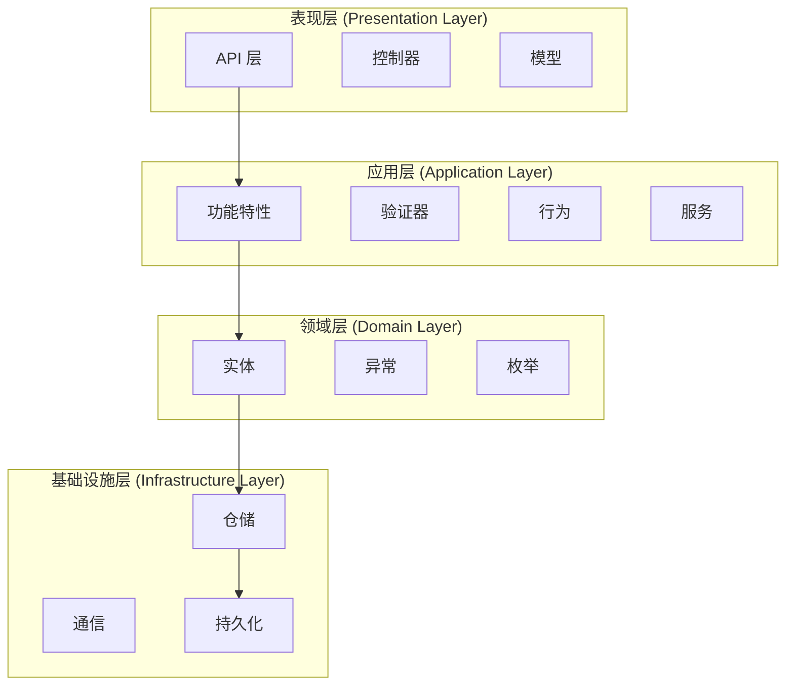
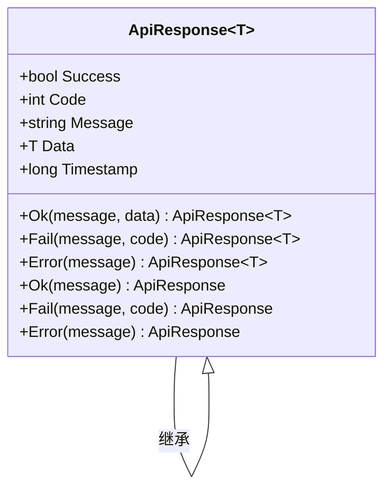
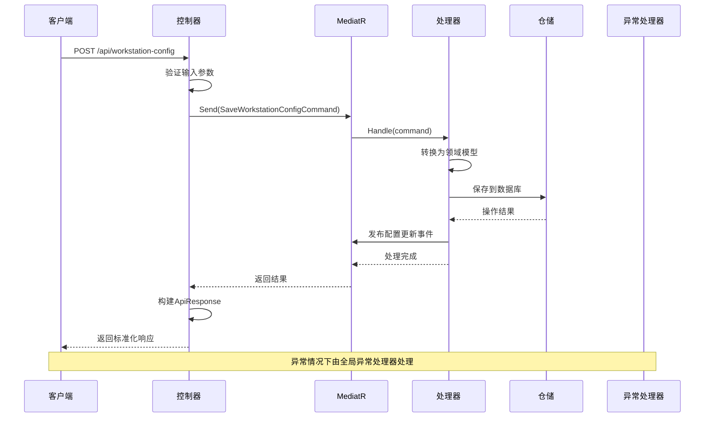
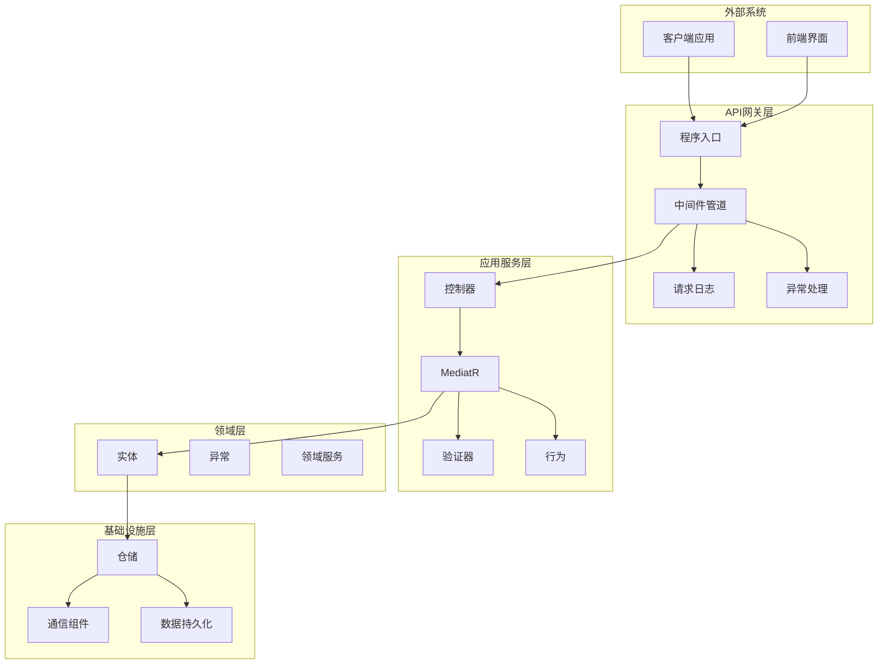
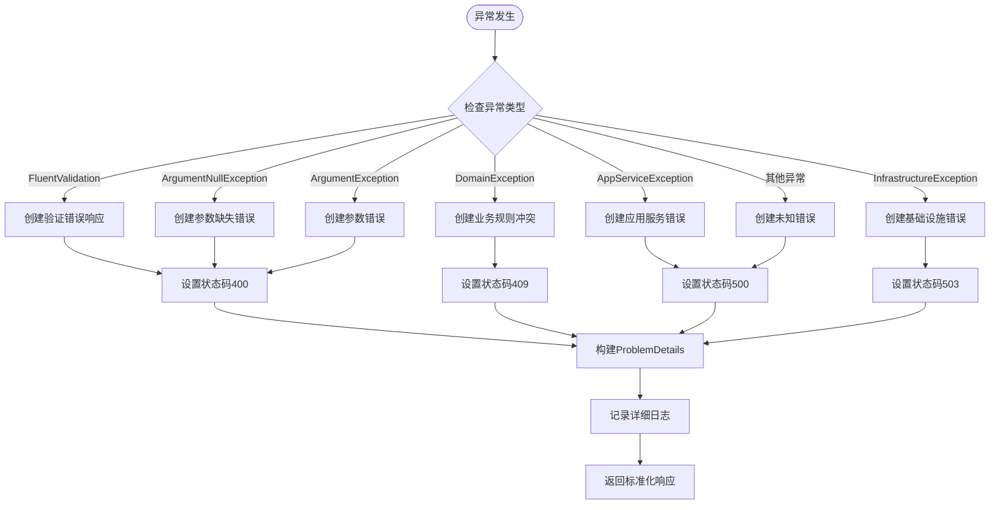
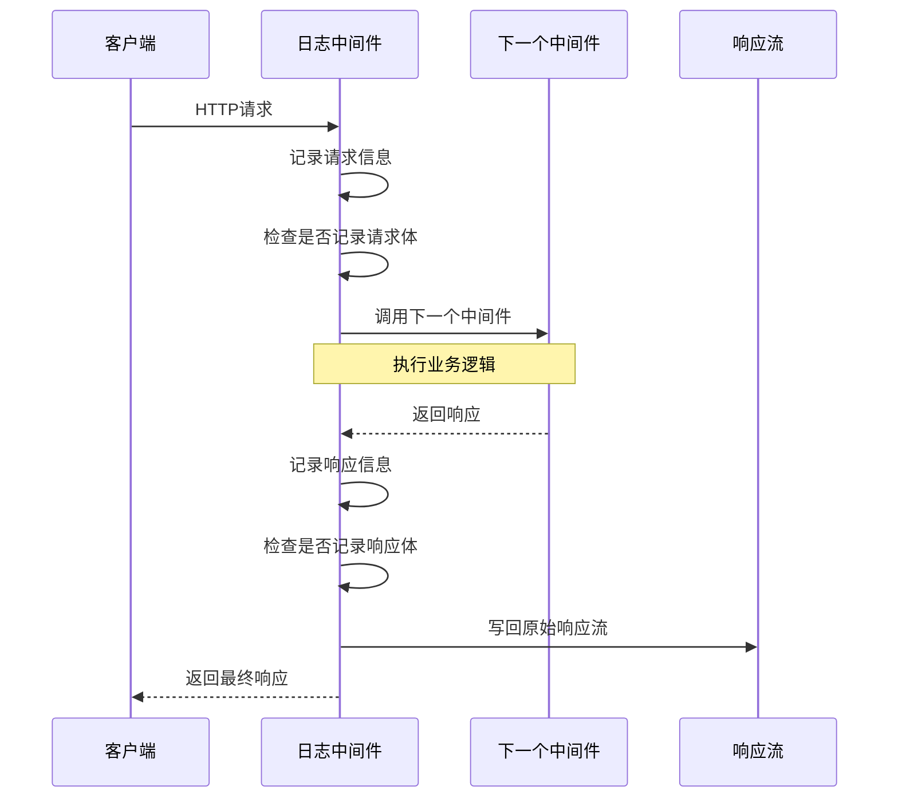
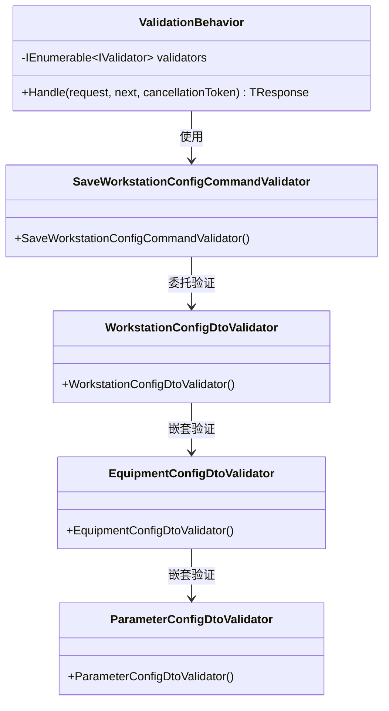
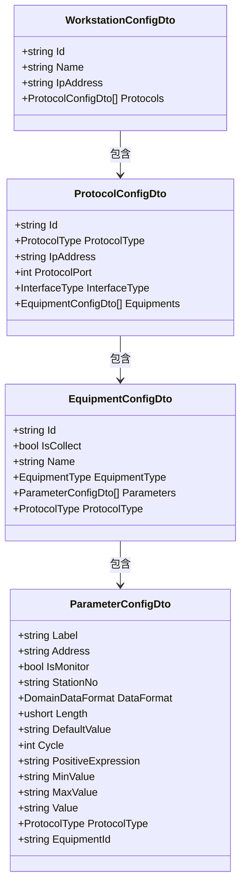
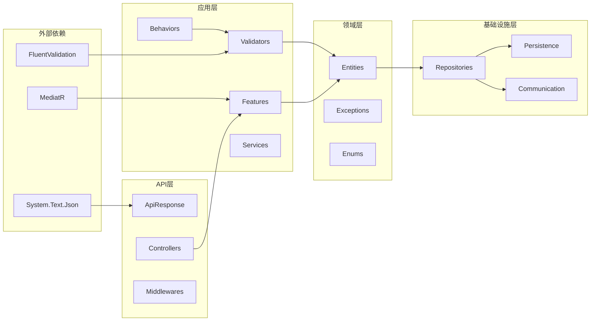

# 统一API响应模型

<cite>
**本文档引用的文件**
- [ApiResponse.cs](file://IndustrialDataSolution/IndustrialDataProcessor.Api/Models/ApiResponse.cs)
- [WorkstationConfigController.cs](file://IndustrialDataSolution/IndustrialDataProcessor.Api/Controllers/WorkstationConfigController.cs)
- [GlobalExceptionHandler.cs](file://IndustrialDataSolution/IndustrialDataProcessor.Api/Middleware/GlobalExceptionHandler.cs)
- [Program.cs](file://IndustrialDataSolution/IndustrialDataProcessor.Api/Program.cs)
- [RequestLoggingMiddleware.cs](file://IndustrialDataSolution/IndustrialDataProcessor.Api/Middleware/RequestLoggingMiddleware.cs)
- [SaveWorkstationConfigCommand.cs](file://IndustrialDataSolution/IndustrialDataProcessor.Application/Features/SaveWorkstationConfigCommand.cs)
- [SaveWorkstationConfigCommandValidator.cs](file://IndustrialDataSolution/IndustrialDataProcessor.Application/Validators/SaveWorkstationConfigCommandValidator.cs)
- [ValidationBehavior.cs](file://IndustrialDataSolution/IndustrialDataProcessor.Application/Behaviors/ValidationBehavior.cs)
- [WorkstationConfigDto.cs](file://IndustrialDataSolution/IndustrialDataProcessor.Application/Dtos/WorkstationDto/WorkstationConfigDto.cs)
- [EquipmentConfigDto.cs](file://IndustrialDataSolution/IndustrialDataProcessor.Application/Dtos/WorkstationDto/EquipmentConfigDto.cs)
- [ParameterConfigDto.cs](file://IndustrialDataSolution/IndustrialDataProcessor.Application/Dtos/WorkstationDto/ParameterConfigDto.cs)
- [SaveWorkstationConfigRequest.cs](file://IndustrialDataSolution/IndustrialDataProcessor.Application/Dtos/SaveWorkstationConfigRequest.cs)
- [AppServiceException.cs](file://IndustrialDataSolution/IndustrialDataProcessor.Domain/Exceptions/AppServiceException.cs)
- [appsettings.json](file://IndustrialDataSolution/IndustrialDataProcessor.Api/appsettings.json)
- [appsettings.Development.json](file://IndustrialDataSolution/IndustrialDataProcessor.Api/appsettings.Development.json)
- [DependencyInjection.cs](file://IndustrialDataSolution/IndustrialDataProcessor.Application/DependencyInjection.cs)
</cite>

## 目录
1. [简介](#简介)
2. [项目结构](#项目结构)
3. [核心组件](#核心组件)
4. [架构概览](#架构概览)
5. [详细组件分析](#详细组件分析)
6. [依赖关系分析](#依赖关系分析)
7. [性能考虑](#性能考虑)
8. [故障排除指南](#故障排除指南)
9. [结论](#结论)

## 简介

本项目是一个工业数据处理系统，采用了领域驱动设计（DDD）架构模式。本文档重点分析系统的统一API响应模型设计，包括响应格式标准化、异常处理机制、中间件管道配置以及完整的请求处理流程。

系统通过统一的ApiResponse模型实现了标准化的API响应格式，确保前后端交互的一致性和可预测性。同时，结合全局异常处理中间件和请求日志中间件，提供了完整的错误处理和调试支持。

## 项目结构

项目采用分层架构设计，主要分为以下层次：

**图表来源**
- [Program.cs](file://IndustrialDataSolution/IndustrialDataProcessor.Api/Program.cs#L1-L52)
- [DependencyInjection.cs](file://IndustrialDataSolution/IndustrialDataProcessor.Application/DependencyInjection.cs#L1-L41)

**章节来源**
- [Program.cs](file://IndustrialDataSolution/IndustrialDataProcessor.Api/Program.cs#L1-L52)
- [DependencyInjection.cs](file://IndustrialDataSolution/IndustrialDataProcessor.Application/DependencyInjection.cs#L1-L41)

## 核心组件

### 统一API响应模型

系统的核心是统一的API响应模型，通过ApiResponse类实现标准化的响应格式：

**图表来源**
- [ApiResponse.cs](file://IndustrialDataSolution/IndustrialDataProcessor.Api/Models/ApiResponse.cs#L9-L127)

ApiResponse模型包含以下关键字段：
- **Success**: 操作是否成功的布尔标志
- **Code**: HTTP状态码或业务状态码
- **Message**: 用户可读的消息描述
- **Data**: 泛型响应数据
- **Timestamp**: Unix毫秒时间戳

**章节来源**
- [ApiResponse.cs](file://IndustrialDataSolution/IndustrialDataProcessor.Api/Models/ApiResponse.cs#L1-L127)

### 控制器层

控制器层负责处理HTTP请求并返回标准化的API响应：

**图表来源**
- [WorkstationConfigController.cs](file://IndustrialDataSolution/IndustrialDataProcessor.Api/Controllers/WorkstationConfigController.cs#L34-L61)
- [SaveWorkstationConfigCommand.cs](file://IndustrialDataSolution/IndustrialDataProcessor.Application/Features/SaveWorkstationConfigCommand.cs#L28-L41)

**章节来源**
- [WorkstationConfigController.cs](file://IndustrialDataSolution/IndustrialDataProcessor.Api/Controllers/WorkstationConfigController.cs#L1-L61)
- [SaveWorkstationConfigCommand.cs](file://IndustrialDataSolution/IndustrialDataProcessor.Application/Features/SaveWorkstationConfigCommand.cs#L1-L42)

## 架构概览

系统采用Clean Architecture设计原则，通过多层解耦实现关注点分离：

**图表来源**
- [Program.cs](file://IndustrialDataSolution/IndustrialDataProcessor.Api/Program.cs#L32-L47)
- [DependencyInjection.cs](file://IndustrialDataSolution/IndustrialDataProcessor.Application/DependencyInjection.cs#L16-L37)

## 详细组件分析

### 全局异常处理机制

系统实现了完善的全局异常处理机制，通过GlobalExceptionHandler中间件统一处理各种异常情况：

**图表来源**
- [GlobalExceptionHandler.cs](file://IndustrialDataSolution/IndustrialDataProcessor.Api/Middleware/GlobalExceptionHandler.cs#L12-L47)

异常处理策略：
- **400 Bad Request**: 参数验证失败、参数缺失、参数错误
- **409 Conflict**: 业务规则冲突（DomainException）
- **500 Internal Server Error**: 应用服务执行失败（AppServiceException）
- **503 Service Unavailable**: 基础设施不可用
- **500 Internal Server Error**: 未知异常

**章节来源**
- [GlobalExceptionHandler.cs](file://IndustrialDataSolution/IndustrialDataProcessor.Api/Middleware/GlobalExceptionHandler.cs#L1-L94)
- [AppServiceException.cs](file://IndustrialDataSolution/IndustrialDataProcessor.Domain/Exceptions/AppServiceException.cs#L1-L11)

### 请求日志中间件

RequestLoggingMiddleware提供了详细的请求和响应日志记录功能：

**图表来源**
- [RequestLoggingMiddleware.cs](file://IndustrialDataSolution/IndustrialDataProcessor.Api/Middleware/RequestLoggingMiddleware.cs#L16-L84)

日志记录策略：
- **请求信息**: 方法、路径、查询字符串、头部信息
- **响应信息**: 状态码、耗时、响应体
- **性能考虑**: 条件性记录，避免不必要的性能开销

**章节来源**
- [RequestLoggingMiddleware.cs](file://IndustrialDataSolution/IndustrialDataProcessor.Api/Middleware/RequestLoggingMiddleware.cs#L1-L141)

### 数据验证机制

系统采用FluentValidation进行数据验证，通过ValidationBehavior实现全局验证拦截：

**图表来源**
- [ValidationBehavior.cs](file://IndustrialDataSolution/IndustrialDataProcessor.Application/Behaviors/ValidationBehavior.cs#L9-L31)
- [SaveWorkstationConfigCommandValidator.cs](file://IndustrialDataSolution/IndustrialDataProcessor.Application/Validators/SaveWorkstationConfigCommandValidator.cs#L6-L13)

**章节来源**
- [ValidationBehavior.cs](file://IndustrialDataSolution/IndustrialDataProcessor.Application/Behaviors/ValidationBehavior.cs#L1-L31)
- [SaveWorkstationConfigCommandValidator.cs](file://IndustrialDataSolution/IndustrialDataProcessor.Application/Validators/SaveWorkstationConfigCommandValidator.cs#L1-L13)

### 数据传输对象

系统定义了完整的DTO层次结构，用于API层与应用层之间的数据传输：

**图表来源**
- [WorkstationConfigDto.cs](file://IndustrialDataSolution/IndustrialDataProcessor.Application/Dtos/WorkstationDto/WorkstationConfigDto.cs#L7-L29)
- [EquipmentConfigDto.cs](file://IndustrialDataSolution/IndustrialDataProcessor.Application/Dtos/WorkstationDto/EquipmentConfigDto.cs#L8-L39)
- [ParameterConfigDto.cs](file://IndustrialDataSolution/IndustrialDataProcessor.Application/Dtos/WorkstationDto/ParameterConfigDto.cs#L9-L94)

**章节来源**
- [WorkstationConfigDto.cs](file://IndustrialDataSolution/IndustrialDataProcessor.Application/Dtos/WorkstationDto/WorkstationConfigDto.cs#L1-L29)
- [EquipmentConfigDto.cs](file://IndustrialDataSolution/IndustrialDataProcessor.Application/Dtos/WorkstationDto/EquipmentConfigDto.cs#L1-L39)
- [ParameterConfigDto.cs](file://IndustrialDataSolution/IndustrialDataProcessor.Application/Dtos/WorkstationDto/ParameterConfigDto.cs#L1-L94)

## 依赖关系分析

系统各层之间的依赖关系清晰明确，遵循依赖倒置原则：

**图表来源**
- [DependencyInjection.cs](file://IndustrialDataSolution/IndustrialDataProcessor.Application/DependencyInjection.cs#L16-L37)
- [Program.cs](file://IndustrialDataSolution/IndustrialDataProcessor.Api/Program.cs#L32-L34)

**章节来源**
- [DependencyInjection.cs](file://IndustrialDataSolution/IndustrialDataProcessor.Application/DependencyInjection.cs#L1-L41)
- [Program.cs](file://IndustrialDataSolution/IndustrialDataProcessor.Api/Program.cs#L1-L52)

## 性能考虑

系统在设计时充分考虑了性能优化：

### 响应序列化优化
- 使用System.Text.Json进行高性能JSON序列化
- ApiResponse.Data字段在null时自动忽略，减少响应体积
- 统一的时间戳格式使用Unix毫秒时间戳

### 异常处理性能
- 全局异常处理器避免重复的异常处理代码
- 条件性日志记录，避免不必要的性能开销
- 异步处理机制确保高并发场景下的响应性

### 缓存策略
- 内存缓存服务注册
- 进程内消息总线减少网络通信开销

## 故障排除指南

### 常见问题诊断

**API响应格式问题**
- 检查ApiResponse模型的JSON属性映射
- 验证响应数据的序列化配置
- 确认时间戳字段的正确性

**异常处理问题**
- 查看GlobalExceptionHandler的日志记录
- 检查异常类型的分类和处理逻辑
- 验证ProblemDetails的构建过程

**验证失败问题**
- 检查FluentValidation验证器的配置
- 验证ValidationBehavior的拦截逻辑
- 确认DTO属性的验证规则

**章节来源**
- [GlobalExceptionHandler.cs](file://IndustrialDataSolution/IndustrialDataProcessor.Api/Middleware/GlobalExceptionHandler.cs#L12-L47)
- [ValidationBehavior.cs](file://IndustrialDataSolution/IndustrialDataProcessor.Application/Behaviors/ValidationBehavior.cs#L12-L29)

### 调试建议

1. **启用详细日志**: 在开发环境中调整日志级别
2. **使用Swagger**: 通过Swagger UI测试API端点
3. **单元测试**: 编写针对各个组件的单元测试
4. **集成测试**: 验证完整的工作流程

**章节来源**
- [appsettings.Development.json](file://IndustrialDataSolution/IndustrialDataProcessor.Api/appsettings.Development.json#L1-L10)
- [appsettings.json](file://IndustrialDataSolution/IndustrialDataProcessor.Api/appsettings.json#L1-L17)

## 结论

本项目通过统一的API响应模型设计，成功实现了标准化的API交互格式。系统采用Clean Architecture架构，通过分层解耦实现了关注点分离，确保了代码的可维护性和可扩展性。

关键设计亮点：
- **统一响应格式**: ApiResponse模型提供一致的响应结构
- **完善的异常处理**: 全局异常处理器支持多种异常类型
- **强大的验证机制**: FluentValidation结合Pipeline Behavior实现全局验证
- **详细的日志记录**: RequestLoggingMiddleware提供完整的请求追踪
- **清晰的架构分层**: 遵循DDD原则，职责分离明确

这些设计使得系统具有良好的可维护性、可测试性和可扩展性，为工业数据处理场景提供了可靠的API基础架构。