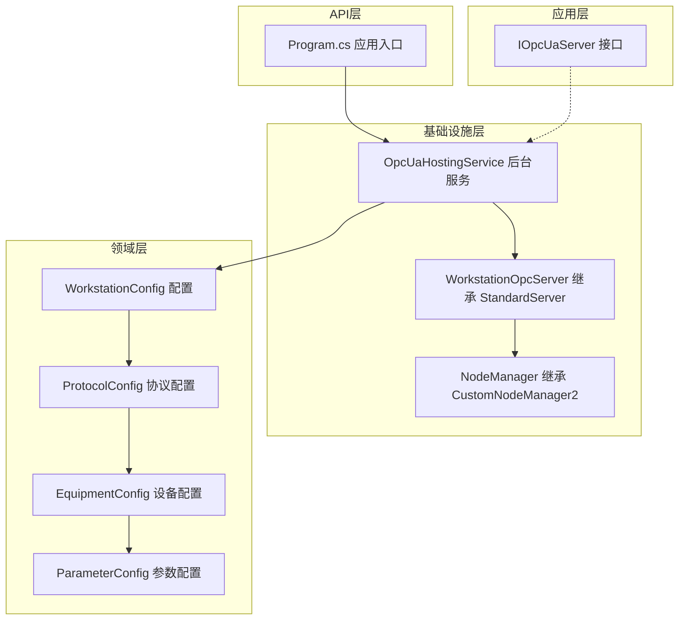
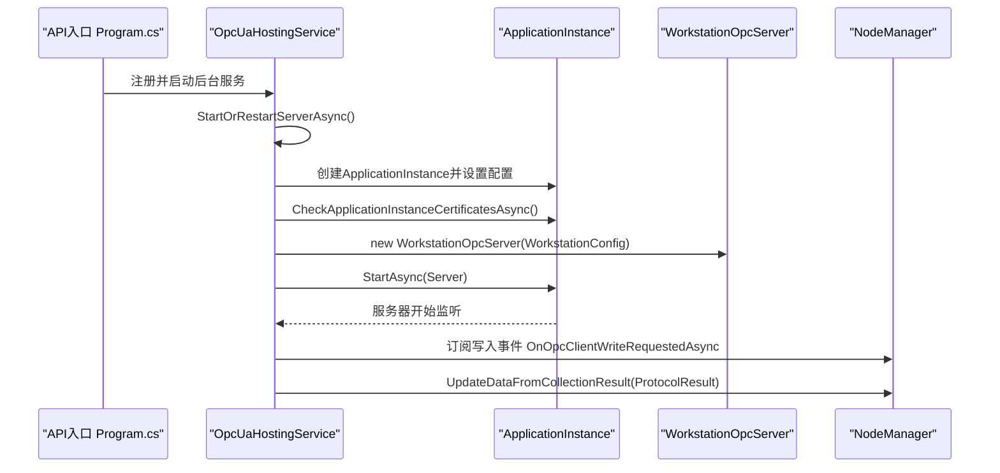
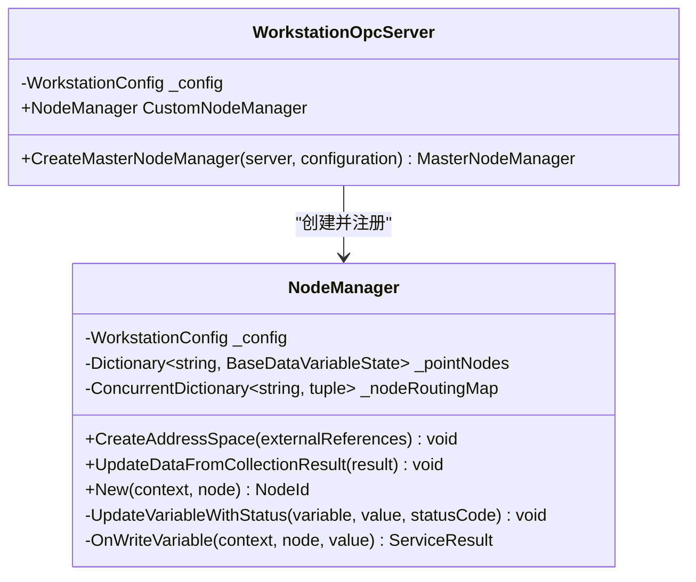
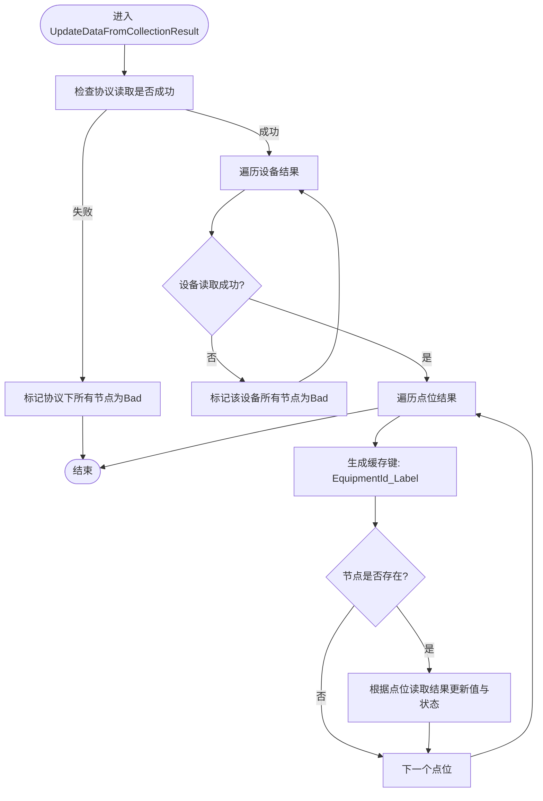
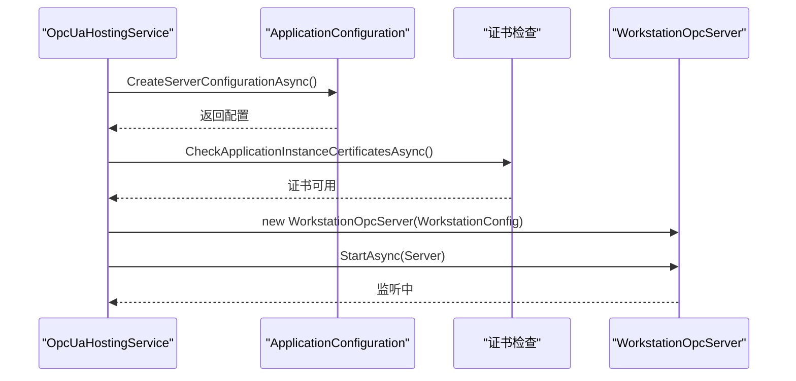
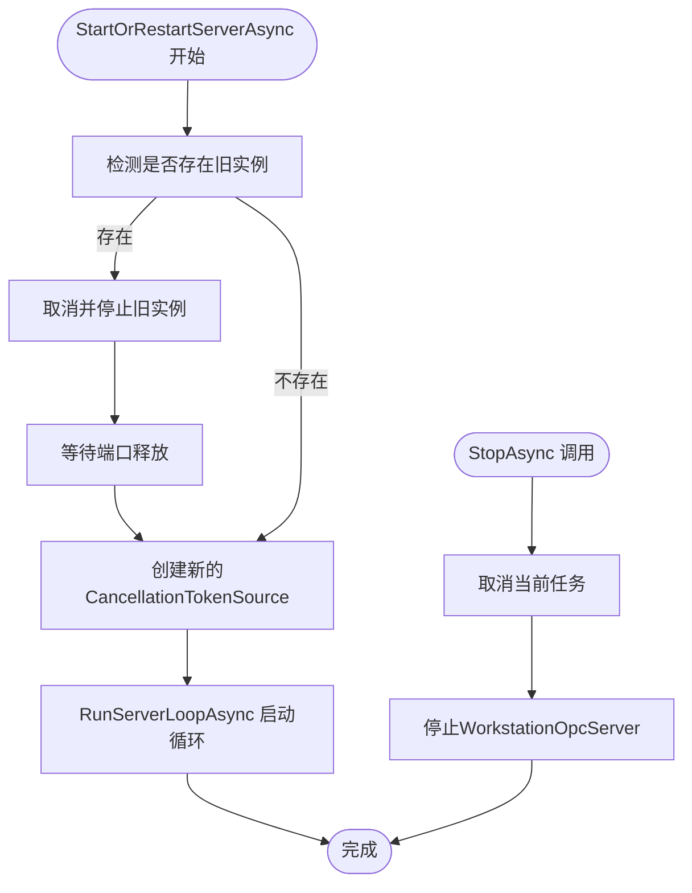
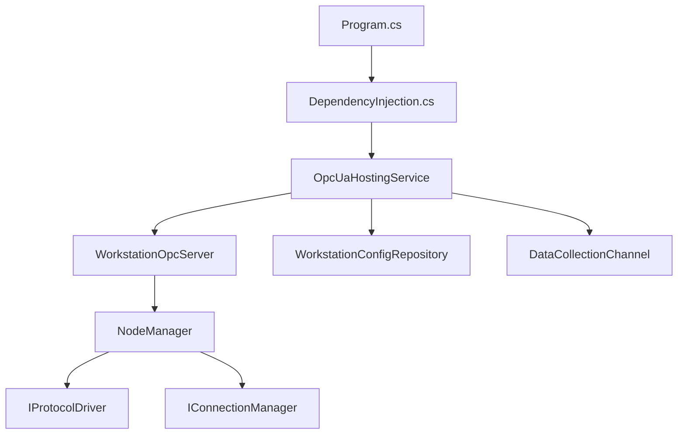
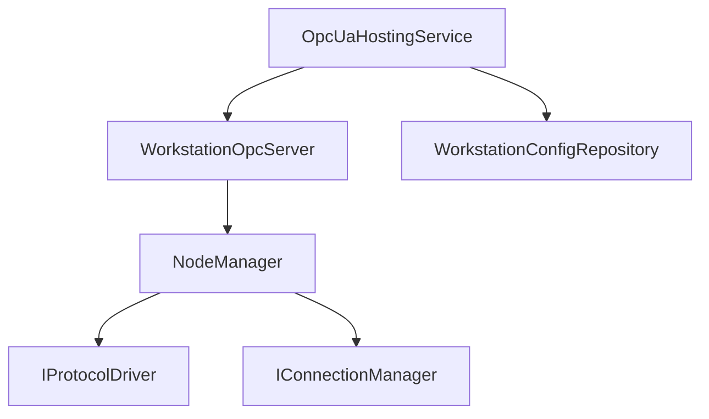

# OPC UA服务器实现

<cite>
**本文档引用的文件**
- [WorkstationOpcServer.cs](file://IndustrialDataSolution/IndustrialDataProcessor.Infrastructure/OpcUa/WorkstationOpcServer.cs)
- [NodeManager.cs](file://IndustrialDataSolution/IndustrialDataProcessor.Infrastructure/OpcUa/NodeManager.cs)
- [OpcUaHostingService.cs](file://IndustrialDataSolution/IndustrialDataProcessor.Infrastructure/BackgroundServices/OpcUaHostingService.cs)
- [IOpcUaServer.cs](file://IndustrialDataSolution/IndustrialDataProcessor.Application/OpcUa/IOpcUaServer.cs)
- [DependencyInjection.cs](file://IndustrialDataSolution/IndustrialDataProcessor.Infrastructure/DependencyInjection.cs)
- [Program.cs](file://IndustrialDataSolution/IndustrialDataProcessor.Api/Program.cs)
- [WorkstationConfig.cs](file://IndustrialDataSolution/IndustrialDataProcessor.Domain/Workstation/Configs/WorkstationConfig.cs)
- [ProtocolConfig.cs](file://IndustrialDataSolution/IndustrialDataProcessor.Domain/Workstation/Configs/ProtocolConfig.cs)
- [EquipmentConfig.cs](file://IndustrialDataSolution/IndustrialDataProcessor.Domain/Workstation/Configs/EquipmentConfig.cs)
- [ParameterConfig.cs](file://IndustrialDataSolution/IndustrialDataProcessor.Domain/Workstation/Configs/ParameterConfig.cs)
</cite>

## 目录
1. [简介](#简介)
2. [项目结构](#项目结构)
3. [核心组件](#核心组件)
4. [架构总览](#架构总览)
5. [详细组件分析](#详细组件分析)
6. [依赖关系分析](#依赖关系分析)
7. [性能考虑](#性能考虑)
8. [故障排除指南](#故障排除指南)
9. [结论](#结论)
10. [附录](#附录)

## 简介
本文件面向OPC UA服务器实现，围绕WorkstationOpcServer类展开，深入解释其基于StandardServer的继承关系与重写方法，阐述服务器初始化过程中的网络通信配置与证书安全管理机制，详解CreateMasterNodeManager方法的作用与自定义节点管理器的创建与注册流程，并提供服务器启动、停止与生命周期管理的完整指导。同时，文档给出服务器配置参数说明（端口号、安全策略、证书路径等），并通过代码片段路径展示正确的初始化与使用方式，并解释与其他组件的集成关系。

## 项目结构
OPC UA服务器实现位于基础设施层，采用分层架构设计：
- 应用层：定义接口IOpcUaServer，用于对外暴露能力
- 基础设施层：实现WorkstationOpcServer（继承StandardServer）、NodeManager（继承CustomNodeManager2），以及OpcUaHostingService（后台服务）
- 领域层：WorkstationConfig及协议、设备、参数配置模型
- API层：Program.cs负责注册基础设施与后台服务

图表来源
- [Program.cs](file://IndustrialDataSolution/IndustrialDataProcessor.Api/Program.cs#L18-L25)
- [DependencyInjection.cs](file://IndustrialDataSolution/IndustrialDataProcessor.Infrastructure/DependencyInjection.cs#L40-L46)
- [OpcUaHostingService.cs](file://IndustrialDataSolution/IndustrialDataProcessor.Infrastructure/BackgroundServices/OpcUaHostingService.cs#L117-L131)
- [WorkstationOpcServer.cs](file://IndustrialDataSolution/IndustrialDataProcessor.Infrastructure/OpcUa/WorkstationOpcServer.cs#L11-L34)
- [NodeManager.cs](file://IndustrialDataSolution/IndustrialDataProcessor.Infrastructure/OpcUa/NodeManager.cs#L10-L34)
- [WorkstationConfig.cs](file://IndustrialDataSolution/IndustrialDataProcessor.Domain/Workstation/Configs/WorkstationConfig.cs#L6-L26)
- [ProtocolConfig.cs](file://IndustrialDataSolution/IndustrialDataProcessor.Domain/Workstation/Configs/ProtocolConfig.cs#L8-L63)
- [EquipmentConfig.cs](file://IndustrialDataSolution/IndustrialDataProcessor.Domain/Workstation/Configs/EquipmentConfig.cs#L7-L32)
- [ParameterConfig.cs](file://IndustrialDataSolution/IndustrialDataProcessor.Domain/Workstation/Configs/ParameterConfig.cs#L7-L83)

章节来源
- [Program.cs](file://IndustrialDataSolution/IndustrialDataProcessor.Api/Program.cs#L18-L25)
- [DependencyInjection.cs](file://IndustrialDataSolution/IndustrialDataProcessor.Infrastructure/DependencyInjection.cs#L40-L46)

## 核心组件
本节聚焦于WorkstationOpcServer类的设计与实现要点，包括继承关系、重写方法、节点管理器注册与生命周期管理。

- 继承关系与职责
  - WorkstationOpcServer继承StandardServer，承担OPC UA服务器的生命周期与地址空间注册职责
  - 通过重写CreateMasterNodeManager方法，将自定义NodeManager纳入MasterNodeManager统一调度
  - 暴露CustomNodeManager属性，供外部（如后台服务）推送采集数据与处理写入请求

- 重写方法：CreateMasterNodeManager
  - 实例化NodeManager并传入工作配置
  - 将NodeManager加入INodeManager列表
  - 返回由MasterNodeManager统一管理的节点集合

- 生命周期管理
  - OpcUaHostingService负责服务器启动、停止与重启
  - 提供StartOrRestartServerAsync与StopAsync，确保并发安全与资源释放

章节来源
- [WorkstationOpcServer.cs](file://IndustrialDataSolution/IndustrialDataProcessor.Infrastructure/OpcUa/WorkstationOpcServer.cs#L11-L34)
- [OpcUaHostingService.cs](file://IndustrialDataSolution/IndustrialDataProcessor.Infrastructure/BackgroundServices/OpcUaHostingService.cs#L63-L98)
- [OpcUaHostingService.cs](file://IndustrialDataSolution/IndustrialDataProcessor.Infrastructure/BackgroundServices/OpcUaHostingService.cs#L216-L227)

## 架构总览
OPC UA服务器的整体架构如下：
- 应用入口Program.cs注册基础设施与后台服务
- OpcUaHostingService作为后台服务，负责服务器生命周期与数据通道对接
- WorkstationOpcServer继承StandardServer，重写节点管理器注册逻辑
- NodeManager负责地址空间创建、数据更新与写入回调
- 领域配置模型WorkstationConfig及其子模型驱动地址空间与数据流

图表来源
- [Program.cs](file://IndustrialDataSolution/IndustrialDataProcessor.Api/Program.cs#L18-L25)
- [OpcUaHostingService.cs](file://IndustrialDataSolution/IndustrialDataProcessor.Infrastructure/BackgroundServices/OpcUaHostingService.cs#L117-L131)
- [WorkstationOpcServer.cs](file://IndustrialDataSolution/IndustrialDataProcessor.Infrastructure/OpcUa/WorkstationOpcServer.cs#L11-L34)
- [NodeManager.cs](file://IndustrialDataSolution/IndustrialDataProcessor.Infrastructure/OpcUa/NodeManager.cs#L18-L19)

## 详细组件分析

### WorkstationOpcServer类分析
- 继承StandardServer，重写CreateMasterNodeManager以注册自定义节点管理器
- 通过CustomNodeManager暴露给外部，用于推送数据与处理写入事件
- 与WorkstationConfig耦合，后者驱动地址空间创建与数据映射

图表来源
- [WorkstationOpcServer.cs](file://IndustrialDataSolution/IndustrialDataProcessor.Infrastructure/OpcUa/WorkstationOpcServer.cs#L11-L34)
- [NodeManager.cs](file://IndustrialDataSolution/IndustrialDataProcessor.Infrastructure/OpcUa/NodeManager.cs#L10-L34)

章节来源
- [WorkstationOpcServer.cs](file://IndustrialDataSolution/IndustrialDataProcessor.Infrastructure/OpcUa/WorkstationOpcServer.cs#L11-L34)

### NodeManager类分析
- 继承CustomNodeManager2，负责地址空间创建与数据更新
- CreateAddressSpace根据WorkstationConfig构建工作站、设备、参数三层结构
- UpdateDataFromCollectionResult按协议/设备/点位粒度更新节点值与状态
- OnWriteVariable处理客户端写入，触发应用层写入流程

图表来源
- [NodeManager.cs](file://IndustrialDataSolution/IndustrialDataProcessor.Infrastructure/OpcUa/NodeManager.cs#L81-L127)

章节来源
- [NodeManager.cs](file://IndustrialDataSolution/IndustrialDataProcessor.Infrastructure/OpcUa/NodeManager.cs#L36-L79)
- [NodeManager.cs](file://IndustrialDataSolution/IndustrialDataProcessor.Infrastructure/OpcUa/NodeManager.cs#L81-L127)
- [NodeManager.cs](file://IndustrialDataSolution/IndustrialDataProcessor.Infrastructure/OpcUa/NodeManager.cs#L167-L183)

### 服务器初始化与证书安全管理
- OpcUaHostingService在RunServerLoopAsync中创建ApplicationInstance并加载ApplicationConfiguration
- CreateServerConfigurationAsync配置安全策略、证书存储路径、传输参数与服务器基础地址
- 证书管理：ApplicationCertificate、TrustedPeerCertificates、TrustedIssuerCertificates、RejectedCertificateStore
- 传输与安全策略：BaseAddresses、SecurityPolicies、UserTokenPolicies

图表来源
- [OpcUaHostingService.cs](file://IndustrialDataSolution/IndustrialDataProcessor.Infrastructure/BackgroundServices/OpcUaHostingService.cs#L117-L131)
- [OpcUaHostingService.cs](file://IndustrialDataSolution/IndustrialDataProcessor.Infrastructure/BackgroundServices/OpcUaHostingService.cs#L186-L214)

章节来源
- [OpcUaHostingService.cs](file://IndustrialDataSolution/IndustrialDataProcessor.Infrastructure/BackgroundServices/OpcUaHostingService.cs#L186-L214)

### 服务器启动、停止与生命周期管理
- 启动流程：StartOrRestartServerAsync确保停止旧实例后启动新实例，RunServerLoopAsync完成配置获取、证书检查、服务器实例化与启动
- 停止流程：StopAsync取消当前任务并停止WorkstationOpcServer
- 并发控制：使用SemaphoreSlim保护重启操作，避免并发重启

图表来源
- [OpcUaHostingService.cs](file://IndustrialDataSolution/IndustrialDataProcessor.Infrastructure/BackgroundServices/OpcUaHostingService.cs#L63-L98)
- [OpcUaHostingService.cs](file://IndustrialDataSolution/IndustrialDataProcessor.Infrastructure/BackgroundServices/OpcUaHostingService.cs#L216-L227)

章节来源
- [OpcUaHostingService.cs](file://IndustrialDataSolution/IndustrialDataProcessor.Infrastructure/BackgroundServices/OpcUaHostingService.cs#L63-L98)
- [OpcUaHostingService.cs](file://IndustrialDataSolution/IndustrialDataProcessor.Infrastructure/BackgroundServices/OpcUaHostingService.cs#L216-L227)

### 服务器配置参数说明
- 端口与地址
  - BaseAddresses：服务器监听地址，示例为opc.tcp://0.0.0.0:4840/WorkstationServer
- 安全策略
  - SecurityPolicies：消息安全模式与策略URI，示例为None
  - UserTokenPolicies：用户令牌策略，示例为Anonymous
- 证书路径
  - ApplicationCertificate：应用证书存储目录与主题名
  - TrustedPeerCertificates：受信任对等证书存储目录
  - TrustedIssuerCertificates：受信任颁发者证书存储目录
  - RejectedCertificateStore：拒绝证书存储目录
- 传输与超时
  - TransportQuotas：操作超时等传输配额
- 配置校验
  - ValidateAsync：对ApplicationConfiguration进行有效性校验

章节来源
- [OpcUaHostingService.cs](file://IndustrialDataSolution/IndustrialDataProcessor.Infrastructure/BackgroundServices/OpcUaHostingService.cs#L186-L214)

### 代码示例路径
以下为正确初始化与使用OPC UA服务器的关键步骤与对应文件路径：
- 初始化服务器配置与证书检查
  - [CreateServerConfigurationAsync](file://IndustrialDataSolution/IndustrialDataProcessor.Infrastructure/BackgroundServices/OpcUaHostingService.cs#L186-L214)
  - [CheckApplicationInstanceCertificatesAsync](file://IndustrialDataSolution/IndustrialDataProcessor.Infrastructure/BackgroundServices/OpcUaHostingService.cs#L126-L126)
- 实例化并启动服务器
  - [WorkstationOpcServer构造与StartAsync](file://IndustrialDataSolution/IndustrialDataProcessor.Infrastructure/BackgroundServices/OpcUaHostingService.cs#L128-L131)
- 注册写入事件与数据更新
  - [订阅写入事件](file://IndustrialDataSolution/IndustrialDataProcessor.Infrastructure/BackgroundServices/OpcUaHostingService.cs#L136-L158)
  - [推送采集数据](file://IndustrialDataSolution/IndustrialDataProcessor.Infrastructure/BackgroundServices/OpcUaHostingService.cs#L161-L174)
- 停止服务器
  - [StopAsync](file://IndustrialDataSolution/IndustrialDataProcessor.Infrastructure/BackgroundServices/OpcUaHostingService.cs#L216-L227)

章节来源
- [OpcUaHostingService.cs](file://IndustrialDataSolution/IndustrialDataProcessor.Infrastructure/BackgroundServices/OpcUaHostingService.cs#L124-L131)
- [OpcUaHostingService.cs](file://IndustrialDataSolution/IndustrialDataProcessor.Infrastructure/BackgroundServices/OpcUaHostingService.cs#L136-L158)
- [OpcUaHostingService.cs](file://IndustrialDataSolution/IndustrialDataProcessor.Infrastructure/BackgroundServices/OpcUaHostingService.cs#L161-L174)
- [OpcUaHostingService.cs](file://IndustrialDataSolution/IndustrialDataProcessor.Infrastructure/BackgroundServices/OpcUaHostingService.cs#L216-L227)

### 与其他组件的集成方式与依赖关系
- 依赖注入集成
  - Program.cs注册基础设施与后台服务
  - DependencyInjection.cs注册OpcUaHostingService为单例并暴露IDataPublishServerManager接口
- 领域配置驱动
  - WorkstationConfig及其子模型驱动地址空间创建与数据更新
- 数据通道集成
  - OpcUaHostingService通过DataCollectionChannel接收采集结果并调用NodeManager.UpdateDataFromCollectionResult
- 写入链路集成
  - NodeManager.OnOpcClientWriteRequestedAsync事件由OpcUaHostingService订阅，转发至协议驱动与连接管理器

图表来源
- [Program.cs](file://IndustrialDataSolution/IndustrialDataProcessor.Api/Program.cs#L18-L25)
- [DependencyInjection.cs](file://IndustrialDataSolution/IndustrialDataProcessor.Infrastructure/DependencyInjection.cs#L40-L46)
- [OpcUaHostingService.cs](file://IndustrialDataSolution/IndustrialDataProcessor.Infrastructure/BackgroundServices/OpcUaHostingService.cs#L108-L112)
- [NodeManager.cs](file://IndustrialDataSolution/IndustrialDataProcessor.Infrastructure/OpcUa/NodeManager.cs#L18-L19)

章节来源
- [Program.cs](file://IndustrialDataSolution/IndustrialDataProcessor.Api/Program.cs#L18-L25)
- [DependencyInjection.cs](file://IndustrialDataSolution/IndustrialDataProcessor.Infrastructure/DependencyInjection.cs#L40-L46)
- [OpcUaHostingService.cs](file://IndustrialDataSolution/IndustrialDataProcessor.Infrastructure/BackgroundServices/OpcUaHostingService.cs#L108-L112)
- [NodeManager.cs](file://IndustrialDataSolution/IndustrialDataProcessor.Infrastructure/OpcUa/NodeManager.cs#L18-L19)

## 依赖关系分析
- 组件耦合
  - WorkstationOpcServer与NodeManager强耦合，前者负责生命周期，后者负责地址空间与数据
  - OpcUaHostingService与WorkstationOpcServer弱耦合，通过ApplicationInstance启动与停止
- 外部依赖
  - Opc.Ua与Opc.Ua.Server库提供StandardServer与节点管理器基类
  - IProtocolDriver与IConnectionManager用于写入链路的协议转换与连接管理
- 循环依赖
  - 未发现循环依赖，模块边界清晰

图表来源
- [WorkstationOpcServer.cs](file://IndustrialDataSolution/IndustrialDataProcessor.Infrastructure/OpcUa/WorkstationOpcServer.cs#L11-L34)
- [NodeManager.cs](file://IndustrialDataSolution/IndustrialDataProcessor.Infrastructure/OpcUa/NodeManager.cs#L10-L34)
- [OpcUaHostingService.cs](file://IndustrialDataSolution/IndustrialDataProcessor.Infrastructure/BackgroundServices/OpcUaHostingService.cs#L108-L112)

章节来源
- [WorkstationOpcServer.cs](file://IndustrialDataSolution/IndustrialDataProcessor.Infrastructure/OpcUa/WorkstationOpcServer.cs#L11-L34)
- [NodeManager.cs](file://IndustrialDataSolution/IndustrialDataProcessor.Infrastructure/OpcUa/NodeManager.cs#L10-L34)
- [OpcUaHostingService.cs](file://IndustrialDataSolution/IndustrialDataProcessor.Infrastructure/BackgroundServices/OpcUaHostingService.cs#L108-L112)

## 性能考虑
- 节点缓存优化
  - NodeManager使用字典缓存变量节点，按EquipmentId_Label键快速定位，降低查找复杂度
- 线程安全
  - UpdateDataFromCollectionResult与UpdateVariableWithStatus内部使用锁保护，避免并发更新冲突
- 状态码与时间戳
  - 统一设置StatusCode与Timestamp，减少客户端轮询开销
- 写入路径
  - OnWriteVariable为同步回调，内部通过异步委托阻塞等待，确保写入一致性

章节来源
- [NodeManager.cs](file://IndustrialDataSolution/IndustrialDataProcessor.Infrastructure/OpcUa/NodeManager.cs#L15-L22)
- [NodeManager.cs](file://IndustrialDataSolution/IndustrialDataProcessor.Infrastructure/OpcUa/NodeManager.cs#L85-L127)
- [NodeManager.cs](file://IndustrialDataSolution/IndustrialDataProcessor.Infrastructure/OpcUa/NodeManager.cs#L167-L183)
- [NodeManager.cs](file://IndustrialDataSolution/IndustrialDataProcessor.Infrastructure/OpcUa/NodeManager.cs#L341-L383)

## 故障排除指南
- 证书问题
  - 确认证书存储路径与主题名配置正确，使用CheckApplicationInstanceCertificatesAsync进行证书检查
- 端口占用
  - 重启前等待端口释放，避免端口被占用导致启动失败
- 写入失败
  - 检查OnOpcClientWriteRequestedAsync事件是否订阅，确认协议驱动与连接管理器可用
- 数据更新异常
  - 确认UpdateDataFromCollectionResult输入的ProtocolResult结构正确，节点缓存键一致

章节来源
- [OpcUaHostingService.cs](file://IndustrialDataSolution/IndustrialDataProcessor.Infrastructure/BackgroundServices/OpcUaHostingService.cs#L70-L84)
- [OpcUaHostingService.cs](file://IndustrialDataSolution/IndustrialDataProcessor.Infrastructure/BackgroundServices/OpcUaHostingService.cs#L136-L158)
- [NodeManager.cs](file://IndustrialDataSolution/IndustrialDataProcessor.Infrastructure/OpcUa/NodeManager.cs#L108-L127)

## 结论
本实现通过WorkstationOpcServer与NodeManager的协作，结合OpcUaHostingService的生命周期管理，构建了可扩展、可维护的OPC UA服务器。服务器初始化过程涵盖配置加载、证书检查与启动流程，支持动态地址空间与高效数据更新。通过事件驱动的写入链路，实现了从客户端到设备的闭环控制。建议在生产环境中完善安全策略与证书管理，并持续优化节点缓存与并发控制策略。

## 附录
- 配置参数速查
  - BaseAddresses：服务器监听地址
  - SecurityPolicies：消息安全模式与策略URI
  - UserTokenPolicies：用户令牌策略
  - ApplicationCertificate/TrustedPeerCertificates/TrustedIssuerCertificates/RejectedCertificateStore：证书存储路径
  - TransportQuotas：操作超时等传输配额
- 代码片段路径
  - [CreateServerConfigurationAsync](file://IndustrialDataSolution/IndustrialDataProcessor.Infrastructure/BackgroundServices/OpcUaHostingService.cs#L186-L214)
  - [WorkstationOpcServer构造与StartAsync](file://IndustrialDataSolution/IndustrialDataProcessor.Infrastructure/BackgroundServices/OpcUaHostingService.cs#L128-L131)
  - [订阅写入事件](file://IndustrialDataSolution/IndustrialDataProcessor.Infrastructure/BackgroundServices/OpcUaHostingService.cs#L136-L158)
  - [推送采集数据](file://IndustrialDataSolution/IndustrialDataProcessor.Infrastructure/BackgroundServices/OpcUaHostingService.cs#L161-L174)
  - [StopAsync](file://IndustrialDataSolution/IndustrialDataProcessor.Infrastructure/BackgroundServices/OpcUaHostingService.cs#L216-L227)