# OPC UA集成

<cite>
**本文引用的文件**
- [WorkstationOpcServer.cs](file://IndustrialDataSolution/IndustrialDataProcessor.Infrastructure/OpcUa/WorkstationOpcServer.cs)
- [NodeManager.cs](file://IndustrialDataSolution/IndustrialDataProcessor.Infrastructure/OpcUa/NodeManager.cs)
- [OpcUaHostingService.cs](file://IndustrialDataSolution/IndustrialDataProcessor.Infrastructure/BackgroundServices/OpcUaHostingService.cs)
- [OpcUaOptions.cs](file://IndustrialDataSolution/IndustrialDataProcessor.Infrastructure/OpcUa/OpcUaOptions.cs)
- [IOpcUaServer.cs](file://IndustrialDataSolution/IndustrialDataProcessor.Application/OpcUa/IOpcUaServer.cs)
- [Program.cs](file://IndustrialDataSolution/IndustrialDataProcessor.Api/Program.cs)
- [DependencyInjection.cs（基础设施层）](file://IndustrialDataSolution/IndustrialDataProcessor.Infrastructure/DependencyInjection.cs)
- [DependencyInjection.cs（应用层）](file://IndustrialDataSolution/IndustrialDataProcessor.Application/DependencyInjection.cs)
- [WorkstationConfig.cs](file://IndustrialDataSolution/IndustrialDataProcessor.Domain/Workstation/Configs/WorkstationConfig.cs)
- [ProtocolConfig.cs](file://IndustrialDataSolution/IndustrialDataProcessor.Domain/Workstation/Configs/ProtocolConfig.cs)
- [EquipmentConfig.cs](file://IndustrialDataSolution/IndustrialDataProcessor.Domain/Workstation/Configs/EquipmentConfig.cs)
- [ParameterConfig.cs](file://IndustrialDataSolution/IndustrialDataProcessor.Domain/Workstation/Configs/ParameterConfig.cs)
- [IDataPublishServerManager.cs](file://IndustrialDataSolution/IndustrialDataProcessor.Domain/Repositories/IDataPublishServerManager.cs)
- [appsettings.json](file://IndustrialDataSolution/IndustrialDataProcessor.Api/appsettings.json)
- [appsettings.Development.json](file://IndustrialDataSolution/IndustrialDataProcessor.Api/appsettings.Development.json)
- [IEC104Client.cs](file://IndustrialDataSolution/IndustrialDataProcessor.Infrastructure/Communication/Drivers/TcpSpecial/IEC104Client.cs)
- [IEC104Driver.cs](file://IndustrialDataSolution/IndustrialDataProcessor.Infrastructure/Communication/Drivers/TcpSpecial/IEC104Driver.cs)
- [ConnectionManager.cs](file://IndustrialDataSolution/IndustrialDataProcessor.Infrastructure/Communication/Connection/ConnectionManager.cs)
- [OpcUaDriver.cs](file://IndustrialDataSolution/IndustrialDataProcessor.Infrastructure/Communication/Drivers/TcpSpecial/OpcUaDriver.cs)
- [PointExpressionConverter.cs](file://IndustrialDataSolution/IndustrialDataProcessor.Infrastructure/EquipmentCollectionDataProcessing/PointExpressionConverter.cs)
- [EquipmentDataProcessor.cs](file://IndustrialDataSolution/IndustrialDataProcessor.Infrastructure/EquipmentCollectionDataProcessing/EquipmentDataProcessor.cs)
- [SingleVariableExpressionEvaluator.cs](file://IndustrialDataSolution/IndustrialDataProcessor.Infrastructure/EquipmentCollectionDataProcessing/SingleVariableExpressionEvaluator.cs)
- [VirtualPointCalculator.cs](file://IndustrialDataSolution/IndustrialDataProcessor.Infrastructure/EquipmentCollectionDataProcessing/VirtualPointCalculator.cs)
- [DataType.cs](file://IndustrialDataSolution/IndustrialDataProcessor.Domain/Enums/DataType.cs)
</cite>

## 更新摘要
**所做更改**
- 新增集中式OPC UA配置管理章节，详细介绍OpcUaOptions类的引入和配置管理机制
- 更新配置与部署章节，说明从手动配置到自动配置管理的转变
- 增强依赖关系分析，展示OpcUaOptions在依赖注入中的作用
- 新增配置迁移指南，帮助用户从旧配置方式迁移到新的集中式配置管理
- 更新故障排除指南，增加配置相关的问题诊断建议

## 目录
1. [简介](#简介)
2. [项目结构](#项目结构)
3. [核心组件](#核心组件)
4. [架构总览](#架构总览)
5. [组件详解](#组件详解)
6. [集中式OPC UA配置管理](#集中式opc-ua配置管理)
7. [OPC UA类型转换功能](#opc-ua类型转换功能)
8. [表达式计算与类型转换集成](#表达式计算与类型转换集成)
9. [IEC 60870-5-104协议支持](#iec-60870-5-104协议支持)
10. [依赖关系分析](#依赖关系分析)
11. [性能考量](#性能考量)
12. [故障排除指南](#故障排除指南)
13. [结论](#结论)
14. [附录](#附录)

## 简介
本文件面向DDD工业数据处理解决方案中的OPC UA集成，系统性阐述OPC UA服务器实现架构、节点管理机制、客户端连接与会话管理、安全认证与数据订阅、实时与历史数据发布、事件通知、配置与部署、客户端集成最佳实践、OPC UA标准与工业互操作性，以及故障排除与性能监控要点。内容基于仓库现有代码实现，聚焦于WorkstationOpcServer设计、NodeManager功能与实现、后台托管服务的生命周期与数据通道集成。

**更新** 新增集中式OPC UA配置管理章节，详细说明OpcUaOptions类的引入如何简化配置管理，实现从手动配置到自动配置管理的转变。

## 项目结构
OPC UA相关能力主要分布在基础设施层与应用层：
- 基础设施层提供OPC UA服务器封装、节点管理器、后台托管服务与协议驱动集成；
- 应用层提供依赖注入装配、API入口与配置；
- 领域层提供工作站配置模型与协议/设备/参数配置结构。

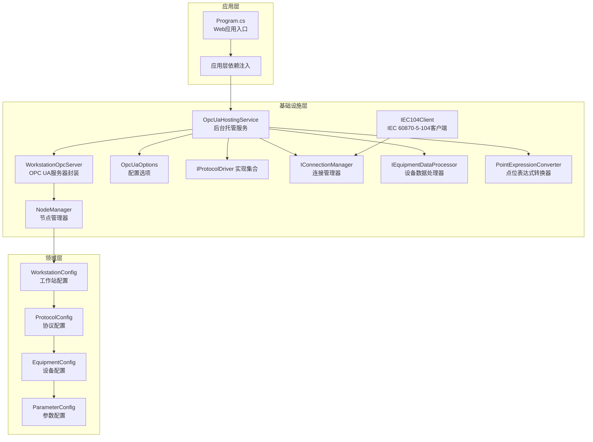

**图表来源**
- [Program.cs:1-56](file://IndustrialDataSolution/IndustrialDataProcessor.Api/Program.cs#L1-L56)
- [OpcUaHostingService.cs:1-241](file://IndustrialDataSolution/IndustrialDataProcessor.Infrastructure/BackgroundServices/OpcUaHostingService.cs#L1-L241)
- [WorkstationOpcServer.cs:1-36](file://IndustrialDataSolution/IndustrialDataProcessor.Infrastructure/OpcUa/WorkstationOpcServer.cs#L1-L36)
- [NodeManager.cs:1-424](file://IndustrialDataSolution/IndustrialDataProcessor.Infrastructure/OpcUa/NodeManager.cs#L1-L424)
- [OpcUaOptions.cs:1-13](file://IndustrialDataSolution/IndustrialDataProcessor.Infrastructure/OpcUa/OpcUaOptions.cs#L1-L13)
- [IEC104Client.cs:1-44](file://IndustrialDataSolution/IndustrialDataProcessor.Infrastructure/Communication/Drivers/TcpSpecial/IEC104Client.cs#L1-L44)
- [ConnectionManager.cs:334-339](file://IndustrialDataSolution/IndustrialDataProcessor.Infrastructure/Communication/Connection/ConnectionManager.cs#L334-L339)

**章节来源**
- [Program.cs:1-56](file://IndustrialDataSolution/IndustrialDataProcessor.Api/Program.cs#L1-L56)
- [DependencyInjection.cs（基础设施层）:1-299](file://IndustrialDataSolution/IndustrialDataProcessor.Infrastructure/DependencyInjection.cs#L1-L299)
- [DependencyInjection.cs（应用层）:1-42](file://IndustrialDataSolution/IndustrialDataProcessor.Application/DependencyInjection.cs#L1-L42)

## 核心组件
- WorkstationOpcServer：继承标准OPC UA服务器，负责注册自定义节点管理器，暴露CustomNodeManager供外部推送数据。
- NodeManager：继承CustomNodeManager2，负责按配置创建地址空间（工作站/设备/变量）、维护节点字典、更新节点值与状态、处理客户端写入回调、建立节点到协议/设备/参数的路由映射。**新增** 支持声明数据类型存储和自动类型转换，解决表达式计算导致的OPC UA类型错误。
- OpcUaHostingService：后台托管服务，负责启动/重启OPC UA服务器、订阅数据通道、接收采集结果并更新节点、响应客户端写请求并转发至协议驱动。**新增** 通过IOptions<OpcUaOptions>注入配置选项，实现集中式配置管理。
- **IEC104Client**：新增IEC 60870-5-104协议客户端，支持31字节帧头长度，增强与IEC 60870-5-104标准的兼容性。
- **OpcUaOptions**：新增配置选项类，提供集中式的OPC UA服务器配置管理，支持从appsettings.json自动绑定配置。
- 依赖注入：基础设施层注册OpcUaHostingService为单例并作为IDataPublishServerManager；应用层注册数据通道与MediatR等。

**更新** 新增OpcUaOptions类和集中式配置管理机制，通过依赖注入实现自动配置绑定和管理。

**章节来源**
- [WorkstationOpcServer.cs:1-36](file://IndustrialDataSolution/IndustrialDataProcessor.Infrastructure/OpcUa/WorkstationOpcServer.cs#L1-L36)
- [NodeManager.cs:1-424](file://IndustrialDataSolution/IndustrialDataProcessor.Infrastructure/OpcUa/NodeManager.cs#L1-L424)
- [OpcUaHostingService.cs:1-241](file://IndustrialDataSolution/IndustrialDataProcessor.Infrastructure/BackgroundServices/OpcUaHostingService.cs#L1-L241)
- [OpcUaOptions.cs:1-13](file://IndustrialDataSolution/IndustrialDataProcessor.Infrastructure/OpcUa/OpcUaOptions.cs#L1-L13)
- [IEC104Client.cs:1-44](file://IndustrialDataSolution/IndustrialDataProcessor.Infrastructure/Communication/Drivers/TcpSpecial/IEC104Client.cs#L1-L44)
- [DependencyInjection.cs（基础设施层）:26-27](file://IndustrialDataSolution/IndustrialDataProcessor.Infrastructure/DependencyInjection.cs#L26-L27)
- [DependencyInjection.cs（应用层）:1-42](file://IndustrialDataSolution/IndustrialDataProcessor.Application/DependencyInjection.cs#L1-L42)

## 架构总览
OPC UA服务器通过后台服务启动，依据工作站配置动态构建地址空间，采集线程将数据写入节点，客户端可读取实时值与订阅变化；当客户端发起写操作时，服务器通过事件回调将写请求反向推送到应用层，经协议驱动与连接管理器下发至设备。**更新** 新增集中式OPC UA配置管理，通过OpcUaOptions类实现配置的自动绑定和管理，简化配置流程并提高可维护性。

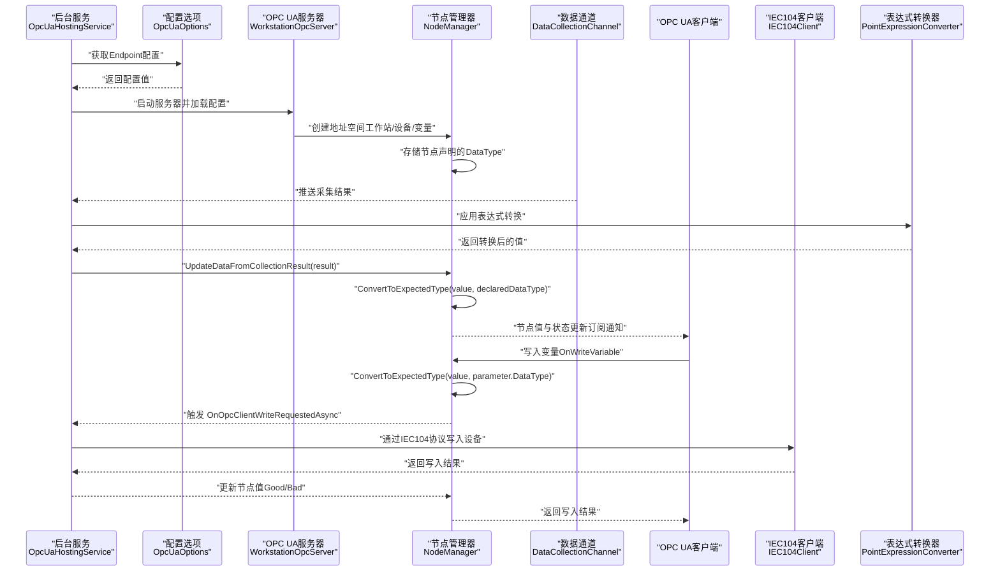

**图表来源**
- [OpcUaHostingService.cs:137-146](file://IndustrialDataSolution/IndustrialDataProcessor.Infrastructure/BackgroundServices/OpcUaHostingService.cs#L137-L146)
- [OpcUaOptions.cs:10-10](file://IndustrialDataSolution/IndustrialDataProcessor.Infrastructure/OpcUa/OpcUaOptions.cs#L10-L10)
- [NodeManager.cs:334-390](file://IndustrialDataSolution/IndustrialDataProcessor.Infrastructure/OpcUa/NodeManager.cs#L334-L390)
- [WorkstationOpcServer.cs:21-34](file://IndustrialDataSolution/IndustrialDataProcessor.Infrastructure/OpcUa/WorkstationOpcServer.cs#L21-L34)
- [IEC104Client.cs:29-33](file://IndustrialDataSolution/IndustrialDataProcessor.Infrastructure/Communication/Drivers/TcpSpecial/IEC104Client.cs#L29-L33)
- [PointExpressionConverter.cs:16-35](file://IndustrialDataSolution/IndustrialDataProcessor.Infrastructure/EquipmentCollectionDataProcessing/PointExpressionConverter.cs#L16-L35)

## 组件详解

### WorkstationOpcServer：服务器封装与节点管理器注册
- 继承StandardServer，重写CreateMasterNodeManager，注入自定义NodeManager并交由MasterNodeManager统一调度。
- 暴露CustomNodeManager属性，供外部（如事件处理器）推送最新采集数据。

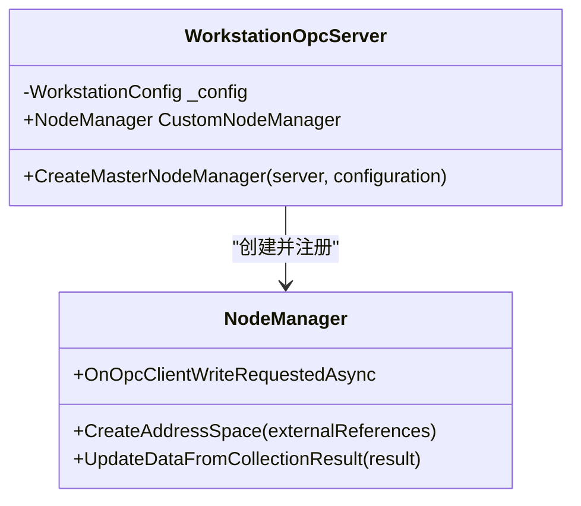

**图表来源**
- [WorkstationOpcServer.cs:11-34](file://IndustrialDataSolution/IndustrialDataProcessor.Infrastructure/OpcUa/WorkstationOpcServer.cs#L11-L34)
- [NodeManager.cs:36-79](file://IndustrialDataSolution/IndustrialDataProcessor.Infrastructure/OpcUa/NodeManager.cs#L36-L79)

**章节来源**
- [WorkstationOpcServer.cs:1-36](file://IndustrialDataSolution/IndustrialDataProcessor.Infrastructure/OpcUa/WorkstationOpcServer.cs#L1-L36)

### NodeManager：地址空间构建、节点维护与写入回调
- 地址空间构建：按WorkstationConfig创建工作站文件夹、设备文件夹与变量节点，变量节点采用设备ID+标签的唯一标识，避免冲突。
- 节点缓存与路由：以"设备ID_标签"为键缓存变量节点；同时建立"节点ID→协议/设备/参数"的路由映射，支持写入回调时定位物理点位。
- 数据更新策略：UpdateDataFromCollectionResult按协议/设备/点位逐级判断，失败时设置对应状态码（如通信错误、未连接），成功时更新值与时间戳并触发订阅通知。
- 写入回调：OnWriteVariable根据节点ID查找路由，触发OnOpcClientWriteRequestedAsync事件，等待应用层完成协议写入后更新节点值。
- **类型转换机制**：提供ConvertToExpectedType方法，将表达式计算后的值严格转换为目标数据类型，防止OPC UA类型不匹配错误。

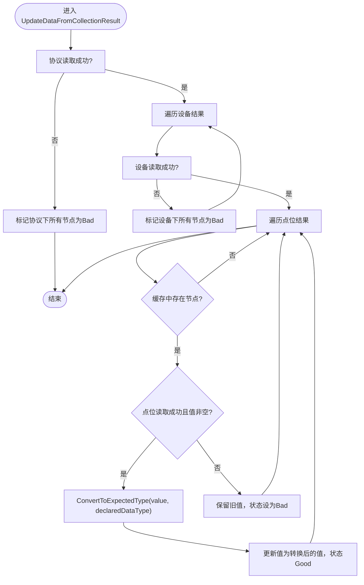

**图表来源**
- [NodeManager.cs:81-131](file://IndustrialDataSolution/IndustrialDataProcessor.Infrastructure/OpcUa/NodeManager.cs#L81-L131)
- [NodeManager.cs:164-190](file://IndustrialDataSolution/IndustrialDataProcessor.Infrastructure/OpcUa/NodeManager.cs#L164-L190)

**章节来源**
- [NodeManager.cs:1-424](file://IndustrialDataSolution/IndustrialDataProcessor.Infrastructure/OpcUa/NodeManager.cs#L1-L424)

### 后台托管服务：生命周期、配置与数据通道
- 生命周期：继承BackgroundService，ExecuteAsync保活；StartOrRestartServerAsync支持安全重启，内部使用CancellationTokenSource协调。
- 服务器启动：RunServerLoopAsync获取最新工作站配置，创建ApplicationConfiguration并启动WorkstationOpcServer；挂载写事件回调。
- 数据通道：从DataCollectionChannel读取采集结果，调用NodeManager.UpdateDataFromCollectionResult更新节点。
- **配置管理**：通过IOptions<OpcUaOptions>注入配置选项，自动获取Endpoint配置，简化配置流程。
- 写入处理：回调中通过IProtocolDriver与IConnectionManager将业务值逆向转换为物理值并下发。

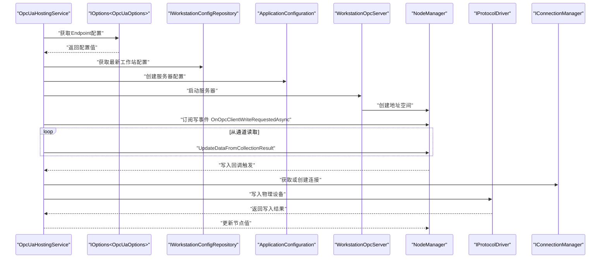

**图表来源**
- [OpcUaHostingService.cs:49-146](file://IndustrialDataSolution/IndustrialDataProcessor.Infrastructure/BackgroundServices/OpcUaHostingService.cs#L49-L146)

**章节来源**
- [OpcUaHostingService.cs:1-241](file://IndustrialDataSolution/IndustrialDataProcessor.Infrastructure/BackgroundServices/OpcUaHostingService.cs#L1-L241)

### 客户端连接、会话与订阅
- 会话与用户策略：服务器配置启用匿名用户令牌策略，允许匿名会话。
- 订阅通知：NodeManager在更新变量值时清除变更掩码并触发订阅通知，客户端可订阅节点变化。
- 写入流程：客户端写入变量触发OnWriteVariable，回调中通过事件委托将写请求传递给应用层，应用层再通过协议驱动下发至设备。

**章节来源**
- [OpcUaHostingService.cs:209-222](file://IndustrialDataSolution/IndustrialDataProcessor.Infrastructure/BackgroundServices/OpcUaHostingService.cs#L209-L222)
- [NodeManager.cs:334-390](file://IndustrialDataSolution/IndustrialDataProcessor.Infrastructure/OpcUa/NodeManager.cs#L334-L390)

### 数据发布机制：实时、历史与事件
- 实时数据：采集线程通过DataCollectionChannel推送结果，后台服务调用NodeManager更新节点值与状态，客户端可即时读取。
- 历史数据：当前实现未见历史数据节点配置或历史服务注册，若需历史访问，可在ApplicationConfiguration中扩展历史服务或引入第三方历史库。
- 事件通知：订阅变更时触发通知；写入失败时返回Bad状态码，客户端可据此处理。

**章节来源**
- [NodeManager.cs:160-183](file://IndustrialDataSolution/IndustrialDataProcessor.Infrastructure/OpcUa/NodeManager.cs#L160-L183)
- [OpcUaHostingService.cs:174-187](file://IndustrialDataSolution/IndustrialDataProcessor.Infrastructure/BackgroundServices/OpcUaHostingService.cs#L174-L187)

### 配置与部署：证书、网络与性能
- **集中式配置管理**：通过OpcUaOptions类实现配置的自动绑定，支持从appsettings.json的OpcUa节自动读取Endpoint配置。
- 证书管理：ApplicationConfiguration配置pki目录下的own/trusted/issuers/rejected证书存储路径，支持自动接受不受信证书与自动导入信任存储。
- 网络配置：服务器基地址从配置选项获取，默认为opc.tcp://0.0.0.0:4840/WorkstationServer，支持匿名用户策略启用。
- 性能调优：TransportQuotas设置操作超时；后台服务使用SemaphoreSlim限制并发重启；节点更新加锁保证线程安全；表达式逆向转换减少类型不匹配风险。

**更新** 新增集中式配置管理机制，通过OpcUaOptions类简化配置流程，提高配置管理的可维护性和一致性。

**章节来源**
- [OpcUaHostingService.cs:137-146](file://IndustrialDataSolution/IndustrialDataProcessor.Infrastructure/BackgroundServices/OpcUaHostingService.cs#L137-L146)
- [OpcUaOptions.cs:1-13](file://IndustrialDataSolution/IndustrialDataProcessor.Infrastructure/OpcUa/OpcUaOptions.cs#L1-L13)
- [appsettings.json:19-21](file://IndustrialDataSolution/IndustrialDataProcessor.Api/appsettings.json#L19-L21)

### 客户端集成最佳实践
- 连接与发现：使用OPC UA客户端连接opc.tcp://<服务器IP>:4840/WorkstationServer，匿名登录即可。
- 地址空间浏览：按工作站→设备→变量层级浏览，变量节点ID采用"设备ID_标签"，便于脚本化访问。
- 订阅与轮询：对关键点位使用订阅获取实时变化；对非关键点位可采用周期性轮询。
- 写入流程：写入前确认节点路由映射（协议/设备/参数），写入值需符合参数配置的数据类型，必要时进行表达式逆向转换。

**章节来源**
- [NodeManager.cs:65-69](file://IndustrialDataSolution/IndustrialDataProcessor.Infrastructure/OpcUa/NodeManager.cs#L65-L69)
- [OpcUaHostingService.cs:137-146](file://IndustrialDataSolution/IndustrialDataProcessor.Infrastructure/BackgroundServices/OpcUaHostingService.cs#L137-L146)

### OPC UA标准与工业互操作性
- 地址空间建模：按工作站/设备/变量分层组织，符合OPC UA信息模型规范。
- 数据类型映射：将领域数据类型映射到OPC UA标准数据类型，避免类型不匹配。
- 写入一致性：写入回调中通过事件委托与协议驱动解耦，提升跨协议互操作性。
- **IEC 60870-5-104集成**：通过IEC104Client实现与IEC 60870-5-104标准的兼容，支持31字节帧头长度，增强工业通信互操作性。

**更新** 新增集中式配置管理带来的标准化配置流程，通过OpcUaOptions类实现配置的统一管理和自动绑定。

**章节来源**
- [NodeManager.cs:188-208](file://IndustrialDataSolution/IndustrialDataProcessor.Infrastructure/OpcUa/NodeManager.cs#L188-L208)
- [WorkstationConfig.cs:1-27](file://IndustrialDataSolution/IndustrialDataProcessor.Domain/Workstation/Configs/WorkstationConfig.cs#L1-L27)
- [ProtocolConfig.cs:1-64](file://IndustrialDataSolution/IndustrialDataProcessor.Domain/Workstation/Configs/ProtocolConfig.cs#L1-L64)
- [EquipmentConfig.cs:1-34](file://IndustrialDataSolution/IndustrialDataProcessor.Domain/Workstation/Configs/EquipmentConfig.cs#L1-L34)
- [ParameterConfig.cs:1-84](file://IndustrialDataSolution/IndustrialDataProcessor.Domain/Workstation/Configs/ParameterConfig.cs#L1-L84)
- [IEC104Client.cs:1-44](file://IndustrialDataSolution/IndustrialDataProcessor.Infrastructure/Communication/Drivers/TcpSpecial/IEC104Client.cs#L1-L44)

## 集中式OPC UA配置管理

### OpcUaOptions类设计
OpcUaOptions类提供了集中式的OPC UA配置管理，通过强类型配置选项简化配置流程：

- **配置节名称**：const string SectionName = "OpcUa"，用于在appsettings.json中标识配置节
- **Endpoint配置**：默认端点地址为opc.tcp://0.0.0.0:14840/WorkstationServer，可通过appsettings.json覆盖
- **自动绑定**：通过Configure<OpcUaOptions>实现配置的自动绑定和验证

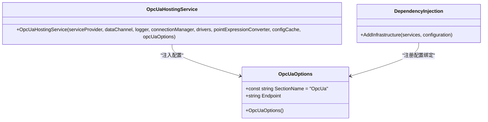

**图表来源**
- [OpcUaOptions.cs:3-12](file://IndustrialDataSolution/IndustrialDataProcessor.Infrastructure/OpcUa/OpcUaOptions.cs#L3-L12)
- [DependencyInjection.cs（基础设施层）:26-27](file://IndustrialDataSolution/IndustrialDataProcessor.Infrastructure/DependencyInjection.cs#L26-L27)
- [OpcUaHostingService.cs:29-44](file://IndustrialDataSolution/IndustrialDataProcessor.Infrastructure/BackgroundServices/OpcUaHostingService.cs#L29-L44)

### 配置绑定与注入机制
基础设施层通过依赖注入实现配置的自动绑定和管理：

- **配置注册**：services.Configure<OpcUaOptions>(configuration.GetSection(OpcUaOptions.SectionName))自动绑定appsettings.json中的OpcUa节
- **服务注入**：OpcUaHostingService通过构造函数注入IOptions<OpcUaOptions>获取配置值
- **配置访问**：_opcUaOptions.Value获取实际的配置实例

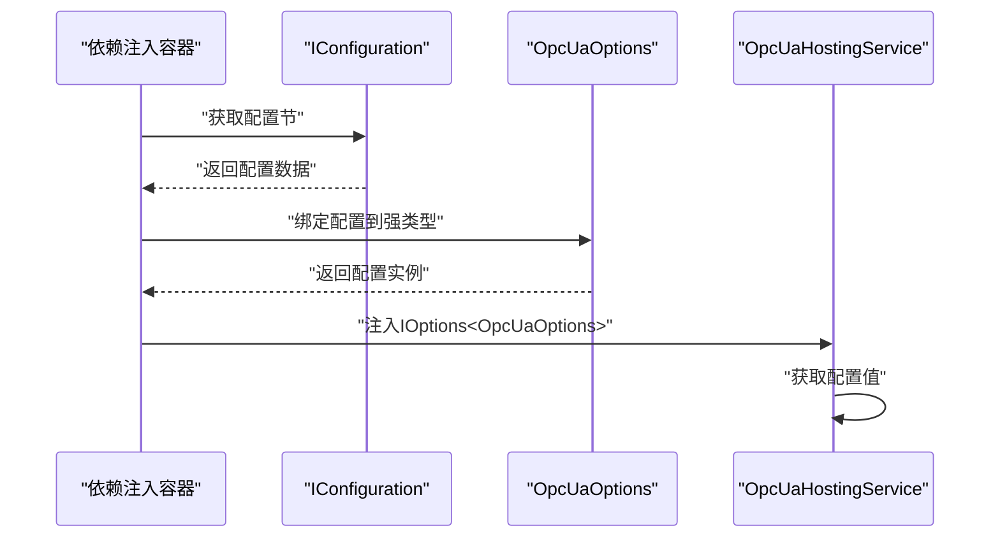

**图表来源**
- [DependencyInjection.cs（基础设施层）:26-27](file://IndustrialDataSolution/IndustrialDataProcessor.Infrastructure/DependencyInjection.cs#L26-L27)
- [OpcUaHostingService.cs:44-44](file://IndustrialDataSolution/IndustrialDataProcessor.Infrastructure/BackgroundServices/OpcUaHostingService.cs#L44-L44)

### 配置文件结构
appsettings.json中的OPC UA配置结构：

```json
{
  "OpcUa": {
    "Endpoint": "opc.tcp://0.0.0.0:4840/WorkstationServer"
  }
}
```

- **SectionName**："OpcUa" - 配置节名称
- **Endpoint**：服务器监听端点地址
- **默认值**：opc.tcp://0.0.0.0:14840/WorkstationServer

**章节来源**
- [OpcUaOptions.cs:1-13](file://IndustrialDataSolution/IndustrialDataProcessor.Infrastructure/OpcUa/OpcUaOptions.cs#L1-L13)
- [DependencyInjection.cs（基础设施层）:26-27](file://IndustrialDataSolution/IndustrialDataProcessor.Infrastructure/DependencyInjection.cs#L26-L27)
- [OpcUaHostingService.cs:44-44](file://IndustrialDataSolution/IndustrialDataProcessor.Infrastructure/BackgroundServices/OpcUaHostingService.cs#L44-L44)
- [appsettings.json:19-21](file://IndustrialDataSolution/IndustrialDataProcessor.Api/appsettings.json#L19-L21)

### 配置迁移指南
从手动配置迁移到集中式配置管理：

**旧配置方式（手动）**：
```csharp
// 直接在代码中硬编码端点地址
var endpoint = "opc.tcp://0.0.0.0:4840/WorkstationServer";
```

**新配置方式（自动）**：
1. 在appsettings.json中添加配置节
2. 在基础设施层注册配置绑定
3. 通过依赖注入获取配置值

**迁移步骤**：
1. 确保appsettings.json包含OpcUa节
2. 在AddInfrastructure中注册配置绑定
3. 修改OpcUaHostingService构造函数使用IOptions<OpcUaOptions>
4. 移除硬编码的端点地址

**章节来源**
- [OpcUaOptions.cs:10-10](file://IndustrialDataSolution/IndustrialDataProcessor.Infrastructure/OpcUa/OpcUaOptions.cs#L10-L10)
- [DependencyInjection.cs（基础设施层）:26-27](file://IndustrialDataSolution/IndustrialDataProcessor.Infrastructure/DependencyInjection.cs#L26-L27)
- [OpcUaHostingService.cs:137-137](file://IndustrialDataSolution/IndustrialDataProcessor.Infrastructure/BackgroundServices/OpcUaHostingService.cs#L137-L137)

## OPC UA类型转换功能

### 声明数据类型存储机制
NodeManager通过增强的节点缓存机制存储节点声明的数据类型，确保类型转换的准确性：

- **节点缓存增强**：`Dictionary<string, (BaseDataVariableState Node, DataType? DeclaredDataType)>`缓存节点及其声明的数据类型
- **路由映射**：`ConcurrentDictionary<string, (ProtocolConfig, EquipmentConfig, ParameterConfig)>`存储节点ID到物理配置的映射
- **初始化默认值**：根据声明的数据类型设置初始默认值，避免OPC UA变体构建异常

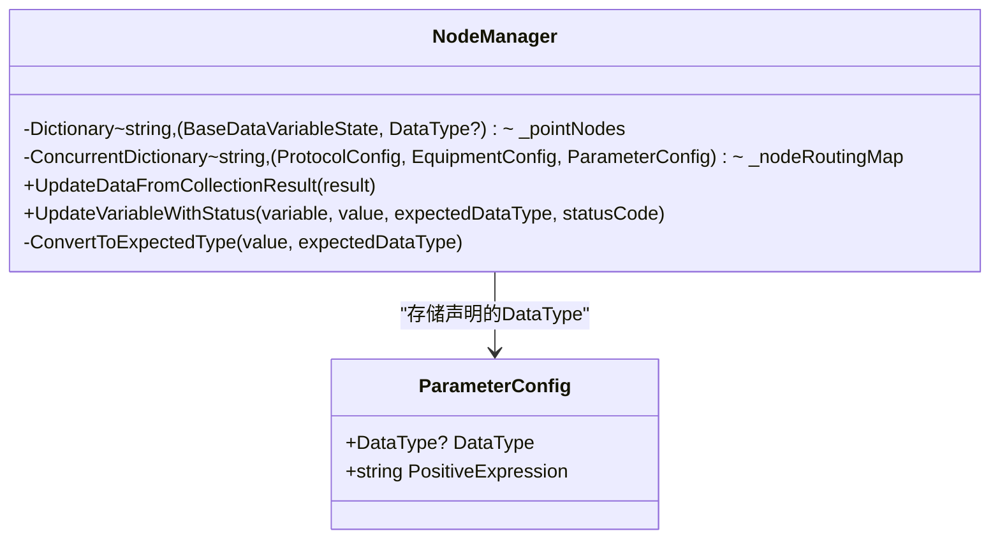

**图表来源**
- [NodeManager.cs:15-23](file://IndustrialDataSolution/IndustrialDataProcessor.Infrastructure/OpcUa/NodeManager.cs#L15-L23)
- [ParameterConfig.cs:1-84](file://IndustrialDataSolution/IndustrialDataProcessor.Domain/Workstation/Configs/ParameterConfig.cs#L1-L84)

### 自动类型转换算法
ConvertToExpectedType方法实现了严格的类型转换算法，确保表达式计算后的值与OPC UA节点声明的数据类型保持一致：

- **类型安全转换**：使用System.Convert.ToXXX系列方法进行类型转换
- **异常容错**：转换失败时返回原值进行兜底，避免系统崩溃
- **精度保持**：数值类型转换时保持适当的精度和舍入规则

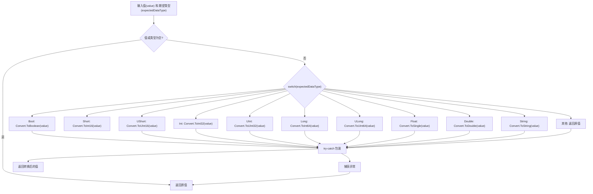

**图表来源**
- [NodeManager.cs:392-422](file://IndustrialDataSolution/IndustrialDataProcessor.Infrastructure/OpcUa/NodeManager.cs#L392-L422)

### 类型转换在数据更新流程中的应用
类型转换功能在数据更新流程中发挥关键作用：

- **采集数据更新**：UpdateDataFromCollectionResult调用UpdateVariableWithStatus进行类型转换
- **写入数据处理**：OnWriteVariable调用ConvertToExpectedType确保写入值符合配置类型
- **状态码管理**：转换成功时设置Good状态，失败时保持原有状态

**章节来源**
- [NodeManager.cs:164-190](file://IndustrialDataSolution/IndustrialDataProcessor.Infrastructure/OpcUa/NodeManager.cs#L164-L190)
- [NodeManager.cs:392-422](file://IndustrialDataSolution/IndustrialDataProcessor.Infrastructure/OpcUa/NodeManager.cs#L392-L422)

## 表达式计算与类型转换集成

### 表达式转换器的角色
PointExpressionConverter负责处理表达式计算，但需要与NodeManager的类型转换机制协同工作：

- **正向转换**：将底层采集的原始值转换为显示值
- **逆向转换**：将客户端写入的值转换为底层驱动需要的物理值
- **类型兼容性**：确保表达式计算结果与OPC UA节点声明的数据类型兼容

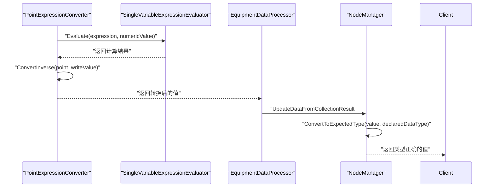

**图表来源**
- [PointExpressionConverter.cs:16-35](file://IndustrialDataSolution/IndustrialDataProcessor.Infrastructure/EquipmentCollectionDataProcessing/PointExpressionConverter.cs#L16-L35)
- [SingleVariableExpressionEvaluator.cs:16-34](file://IndustrialDataSolution/IndustrialDataProcessor.Infrastructure/EquipmentCollectionDataProcessing/SingleVariableExpressionEvaluator.cs#L16-L34)
- [EquipmentDataProcessor.cs:64-77](file://IndustrialDataSolution/IndustrialDataProcessor.Infrastructure/EquipmentCollectionDataProcessing/EquipmentDataProcessor.cs#L64-L77)

### 类型转换的协作机制
表达式转换与OPC UA类型转换的协作确保了系统的完整性：

- **数据流完整性**：从底层采集到OPC UA暴露的全程类型一致性
- **错误处理**：表达式计算失败时的降级处理和类型转换的异常容错
- **性能优化**：避免重复的类型转换和不必要的数据拷贝

**章节来源**
- [PointExpressionConverter.cs:1-110](file://IndustrialDataSolution/IndustrialDataProcessor.Infrastructure/EquipmentCollectionDataProcessing/PointExpressionConverter.cs#L1-L110)
- [EquipmentDataProcessor.cs:60-112](file://IndustrialDataSolution/IndustrialDataProcessor.Infrastructure/EquipmentCollectionDataProcessing/EquipmentDataProcessor.cs#L60-L112)

## IEC 60870-5-104协议支持

### IEC104Client：31字节帧头长度增强
IEC104Client类实现了IEC 60870-5-104协议的客户端支持，特别增强了31字节帧头长度的兼容性：

- **协议支持**：基于lib60870.CS101和lib60870.CS104库实现完整的IEC 60870-5-104协议栈
- **帧头长度**：支持31字节标准帧头格式，符合IEC 60870-5-104标准要求
- **连接管理**：提供IP地址和端口配置，支持连接建立和资源释放
- **数据缓存**：使用ConcurrentDictionary实现线程安全的数据缓存机制

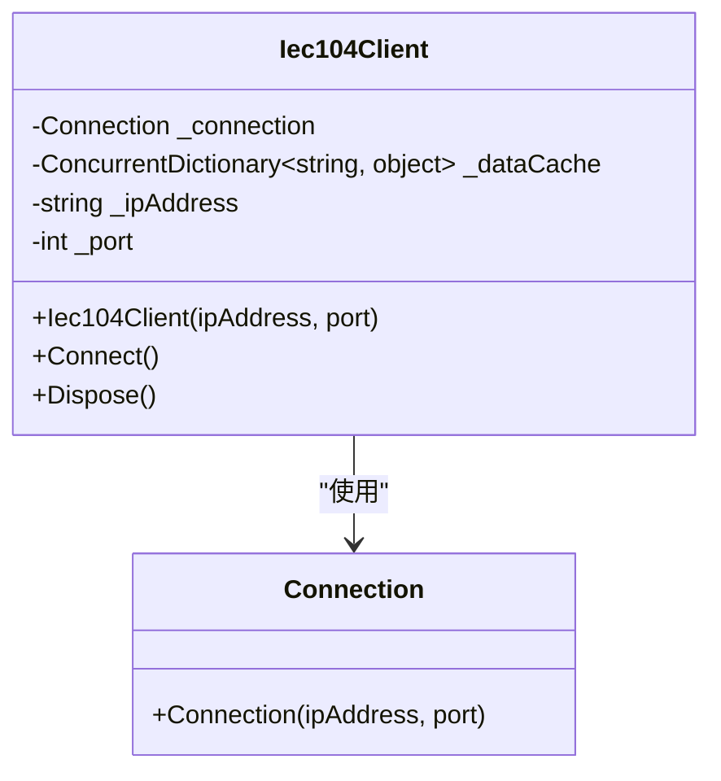

**图表来源**
- [IEC104Client.cs:10-43](file://IndustrialDataSolution/IndustrialDataProcessor.Infrastructure/Communication/Drivers/TcpSpecial/IEC104Client.cs#L10-L43)

### 协议驱动集成
IEC104Driver作为IEC 60870-5-104协议的驱动程序，与连接管理器协同工作：

- **协议类型识别**：在ProtocolType枚举中定义IEC104协议类型
- **连接创建**：通过ConnectionManager创建IEC104Client实例
- **协议验证**：支持LAN接口类型的IEC 60870-5-104协议配置

### 连接管理集成
ConnectionManager负责IEC104协议的连接生命周期管理：

- **协议分支**：在switch语句中处理IEC104协议类型
- **客户端实例化**：创建Iec104Client并建立连接
- **连接句柄管理**：通过DefaultConnectionHandle包装IEC104Client

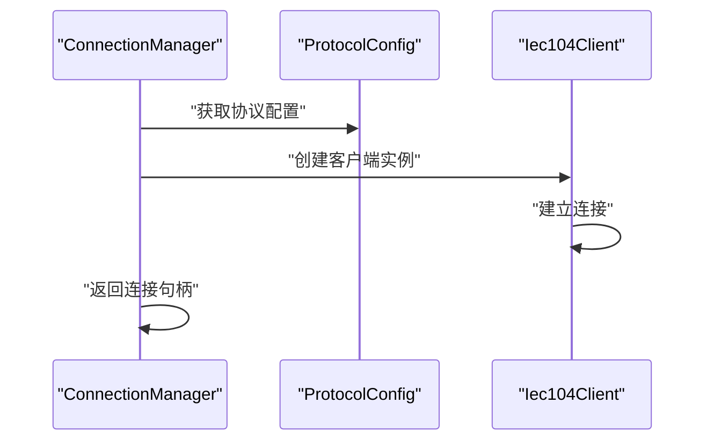

**图表来源**
- [ConnectionManager.cs:334-339](file://IndustrialDataSolution/IndustrialDataProcessor.Infrastructure/Communication/Connection/ConnectionManager.cs#L334-L339)
- [IEC104Client.cs:20-33](file://IndustrialDataSolution/IndustrialDataProcessor.Infrastructure/Communication/Drivers/TcpSpecial/IEC104Client.cs#L20-L33)

**章节来源**
- [IEC104Client.cs:1-44](file://IndustrialDataSolution/IndustrialDataProcessor.Infrastructure/Communication/Drivers/TcpSpecial/IEC104Client.cs#L1-L44)
- [IEC104Driver.cs:1-6](file://IndustrialDataSolution/IndustrialDataProcessor.Infrastructure/Communication/Drivers/TcpSpecial/IEC104Driver.cs#L1-L6)
- [ConnectionManager.cs:334-339](file://IndustrialDataSolution/IndustrialDataProcessor.Infrastructure/Communication/Connection/ConnectionManager.cs#L334-L339)
- [ProtocolType.cs:116-122](file://IndustrialDataSolution/IndustrialDataProcessor.Domain/Enums/ProtocolType.cs#L116-L122)

## 依赖关系分析
- **依赖注入**：基础设施层将OpcUaHostingService注册为单例并实现IDataPublishServerManager接口，应用层注册DataCollectionChannel与MediatR；API入口Program.cs注册基础设施与应用层服务。**新增** 通过IOptions<OpcUaOptions>实现配置的自动注入。
- 组件耦合：OpcUaHostingService依赖IProtocolDriver集合、IConnectionManager、IEquipmentDataProcessor、PointExpressionConverter与DataCollectionChannel；NodeManager依赖WorkstationConfig与数据类型映射。
- **IEC104集成**：IEC104Client通过ConnectionManager与OPC UA系统集成，支持31字节帧头长度的IEC 60870-5-104协议通信。
- **类型转换集成**：NodeManager与PointExpressionConverter协同工作，确保表达式计算结果与OPC UA节点类型的一致性。
- 外部依赖：OPC UA SDK（StandardServer、MasterNodeManager、CustomNodeManager2等）；IEC 60870库（CS101、CS104）。

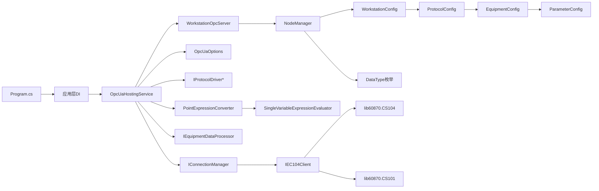

**图表来源**
- [Program.cs:18-30](file://IndustrialDataSolution/IndustrialDataProcessor.Api/Program.cs#L18-L30)
- [DependencyInjection.cs（基础设施层）:26-27](file://IndustrialDataSolution/IndustrialDataProcessor.Infrastructure/DependencyInjection.cs#L26-L27)
- [DependencyInjection.cs（应用层）:25-29](file://IndustrialDataSolution/IndustrialDataProcessor.Application/DependencyInjection.cs#L25-L29)
- [OpcUaHostingService.cs:29-44](file://IndustrialDataSolution/IndustrialDataProcessor.Infrastructure/BackgroundServices/OpcUaHostingService.cs#L29-L44)
- [NodeManager.cs:10-34](file://IndustrialDataSolution/IndustrialDataProcessor.Infrastructure/OpcUa/NodeManager.cs#L10-L34)
- [IEC104Client.cs:1-44](file://IndustrialDataSolution/IndustrialDataProcessor.Infrastructure/Communication/Drivers/TcpSpecial/IEC104Client.cs#L1-L44)
- [PointExpressionConverter.cs:1-110](file://IndustrialDataSolution/IndustrialDataProcessor.Infrastructure/EquipmentCollectionDataProcessing/PointExpressionConverter.cs#L1-L110)

**章节来源**
- [DependencyInjection.cs（基础设施层）:1-299](file://IndustrialDataSolution/IndustrialDataProcessor.Infrastructure/DependencyInjection.cs#L1-L299)
- [DependencyInjection.cs（应用层）:1-42](file://IndustrialDataSolution/IndustrialDataProcessor.Application/DependencyInjection.cs#L1-L42)

## 性能考量
- 线程安全：节点更新使用锁保护，避免并发写入竞争。
- 事件与回调：写入回调为同步阻塞等待，建议在应用层异步处理写入任务并尽快返回结果。
- 通道消费：后台服务使用异步枚举读取通道，避免阻塞主线程。
- 类型转换：在更新前进行类型转换与默认值填充，降低OPC UA异常概率。
- **配置管理性能**：通过IOptions<T>实现配置的延迟加载和缓存，避免频繁的配置解析开销。
- 证书与网络：合理设置操作超时与传输配额，避免长时间阻塞影响吞吐。
- **IEC104性能**：IEC104Client使用ConcurrentDictionary实现线程安全缓存，支持高并发数据访问；31字节帧头长度优化了协议处理效率。
- **类型转换性能**：ConvertToExpectedType方法使用高效的System.Convert系列方法，异常处理采用try-catch包装，确保性能与稳定性平衡。

**更新** 新增配置管理性能考量，包括IOptions<T>的延迟加载和缓存机制，以及配置绑定的性能优化。

**章节来源**
- [NodeManager.cs:167-183](file://IndustrialDataSolution/IndustrialDataProcessor.Infrastructure/OpcUa/NodeManager.cs#L167-L183)
- [OpcUaHostingService.cs:174-187](file://IndustrialDataSolution/IndustrialDataProcessor.Infrastructure/BackgroundServices/OpcUaHostingService.cs#L174-L187)
- [OpcUaOptions.cs:10-10](file://IndustrialDataSolution/IndustrialDataProcessor.Infrastructure/OpcUa/OpcUaOptions.cs#L10-L10)
- [IEC104Client.cs:12-13](file://IndustrialDataSolution/IndustrialDataProcessor.Infrastructure/Communication/Drivers/TcpSpecial/IEC104Client.cs#L12-L13)

## 故障排除指南
- 启动失败：检查HslCommunication授权码配置，确保appsettings.json中存在且有效。
- **配置问题**：检查appsettings.json中的OpcUa节是否存在，确认Endpoint配置格式正确，验证IOptions<OpcUaOptions>是否正确注册。
- 证书问题：确认pki目录结构与证书存储路径正确，必要时手动导入受信任证书。
- 写入失败：检查OnOpcClientWriteRequestedAsync是否被订阅，确认协议驱动与连接管理器可用，查看日志输出。
- 节点值为空：首次启动时节点初始值为"等待初始数据"，等待采集结果到达后自动更新。
- 服务器重启：使用IDataPublishServerManager.StartOrRestartServerAsync触发安全重启，避免端口占用冲突。
- **类型转换错误**：检查参数配置中的DataType设置是否正确，确认表达式转换器的正向和逆向转换逻辑，查看ConvertToExpectedType的异常日志。
- **表达式计算异常**：检查表达式语法是否正确，确认SingleVariableExpressionEvaluator的计算结果与目标数据类型兼容。
- **IEC104连接失败**：检查IEC104Client的IP地址和端口配置，确认目标设备支持IEC 60870-5-104协议，验证31字节帧头格式兼容性。

**更新** 新增配置相关故障排除指南，包括OpcUaOptions配置检查、IOptions<T>注册验证和配置文件格式校验。

**章节来源**
- [appsettings.json:16-21](file://IndustrialDataSolution/IndustrialDataProcessor.Api/appsettings.json#L16-L21)
- [OpcUaOptions.cs:5-10](file://IndustrialDataSolution/IndustrialDataProcessor.Infrastructure/OpcUa/OpcUaOptions.cs#L5-L10)
- [DependencyInjection.cs（基础设施层）:26-27](file://IndustrialDataSolution/IndustrialDataProcessor.Infrastructure/DependencyInjection.cs#L26-L27)
- [OpcUaHostingService.cs:63-99](file://IndustrialDataSolution/IndustrialDataProcessor.Infrastructure/BackgroundServices/OpcUaHostingService.cs#L63-L99)
- [NodeManager.cs:72-76](file://IndustrialDataSolution/IndustrialDataProcessor.Infrastructure/OpcUa/NodeManager.cs#L72-L76)
- [PointExpressionConverter.cs:30-35](file://IndustrialDataSolution/IndustrialDataProcessor.Infrastructure/EquipmentCollectionDataProcessing/PointExpressionConverter.cs#L30-L35)
- [IEC104Client.cs:14-15](file://IndustrialDataSolution/IndustrialDataProcessor.Infrastructure/Communication/Drivers/TcpSpecial/IEC104Client.cs#L14-L15)

## 结论
本方案通过WorkstationOpcServer与NodeManager实现了面向工业数据采集的OPC UA服务器，结合后台托管服务与数据通道，完成了从采集到发布的闭环。节点管理器提供了灵活的地址空间建模、类型映射与写入回调机制，满足多协议、多设备的工业互操作需求。

**更新** 新增集中式OPC UA配置管理，通过OpcUaOptions类和IOptions<T>实现配置的自动绑定和管理，显著简化了配置流程并提高了可维护性。建议在生产环境中完善历史数据服务、增强安全策略与监控告警体系，持续优化写入与订阅性能，并考虑扩展IEC104协议的完整实现以支持更丰富的工业通信场景。

## 附录
- 配置文件位置与关键项
  - appsettings.json：数据库连接字符串、HslCommunication授权码、**新增** OPC UA端点配置
  - appsettings.Development.json：开发环境日志级别
- **集中式配置管理**
  - OpcUaOptions类：提供强类型配置选项
  - SectionName："OpcUa" - 配置节名称
  - Endpoint：服务器监听端点地址，默认值为opc.tcp://0.0.0.0:14840/WorkstationServer
  - IOptions<T>注入：通过依赖注入自动绑定配置
- 服务器配置关键点
  - 证书存储：pki/own、pki/trusted、pki/issuers、pki/rejected
  - 基地址：从配置选项获取，支持自定义端点
  - 用户策略：匿名用户令牌
- **IEC104协议配置**
  - 协议类型：IEC104（ProtocolType.IEC104）
  - 帧头长度：31字节（符合IEC 60870-5-104标准）
  - 连接参数：IP地址和端口配置
  - 数据格式：支持多种数据类型和编码格式
- **类型转换配置**
  - DataType枚举：支持Bool、UShort、Short、UInt、Int、ULong、Long、Float、Double、String
  - 转换算法：使用System.Convert系列方法进行类型转换
  - 异常处理：转换失败时返回原值进行兜底
  - 性能优化：使用锁保护线程安全，异常处理采用try-catch包装

**章节来源**
- [appsettings.json:1-23](file://IndustrialDataSolution/IndustrialDataProcessor.Api/appsettings.json#L1-L23)
- [appsettings.Development.json:1-13](file://IndustrialDataSolution/IndustrialDataProcessor.Api/appsettings.Development.json#L1-L13)
- [OpcUaOptions.cs:1-13](file://IndustrialDataSolution/IndustrialDataProcessor.Infrastructure/OpcUa/OpcUaOptions.cs#L1-L13)
- [DependencyInjection.cs（基础设施层）:26-27](file://IndustrialDataSolution/IndustrialDataProcessor.Infrastructure/DependencyInjection.cs#L26-L27)
- [OpcUaHostingService.cs:199-227](file://IndustrialDataSolution/IndustrialDataProcessor.Infrastructure/BackgroundServices/OpcUaHostingService.cs#L199-L227)
- [ProtocolType.cs:116-122](file://IndustrialDataSolution/IndustrialDataProcessor.Domain/Enums/ProtocolType.cs#L116-L122)
- [IEC104Client.cs:1-44](file://IndustrialDataSolution/IndustrialDataProcessor.Infrastructure/Communication/Drivers/TcpSpecial/IEC104Client.cs#L1-L44)
- [DataType.cs:1-69](file://IndustrialDataSolution/IndustrialDataProcessor.Domain/Enums/DataType.cs#L1-L69)
- [NodeManager.cs:392-422](file://IndustrialDataSolution/IndustrialDataProcessor.Infrastructure/OpcUa/NodeManager.cs#L392-L422)