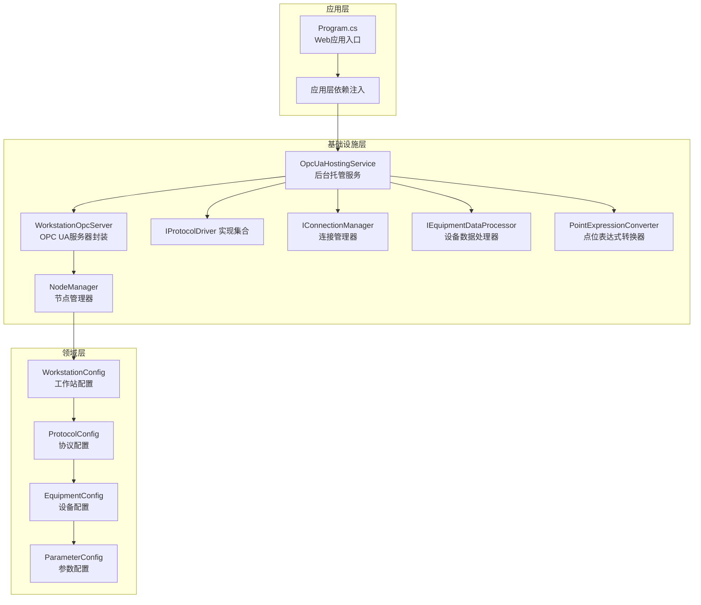
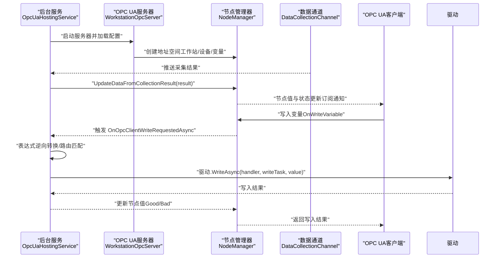
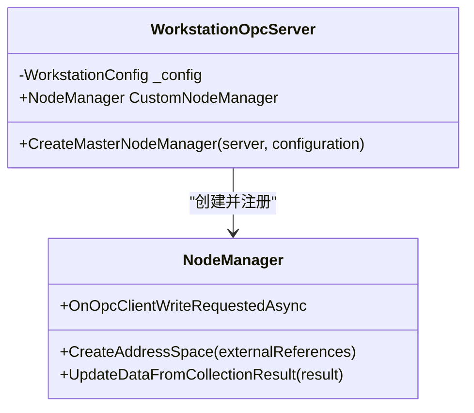
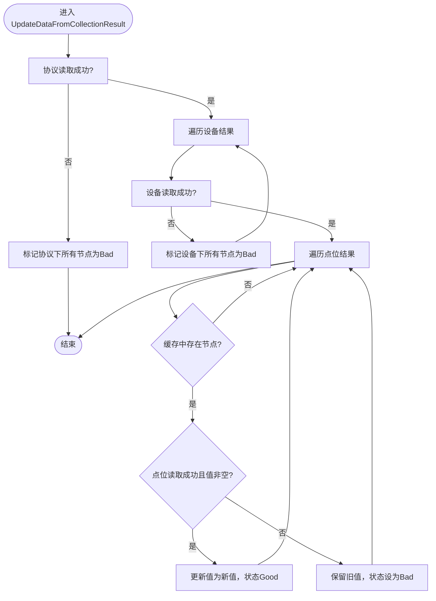
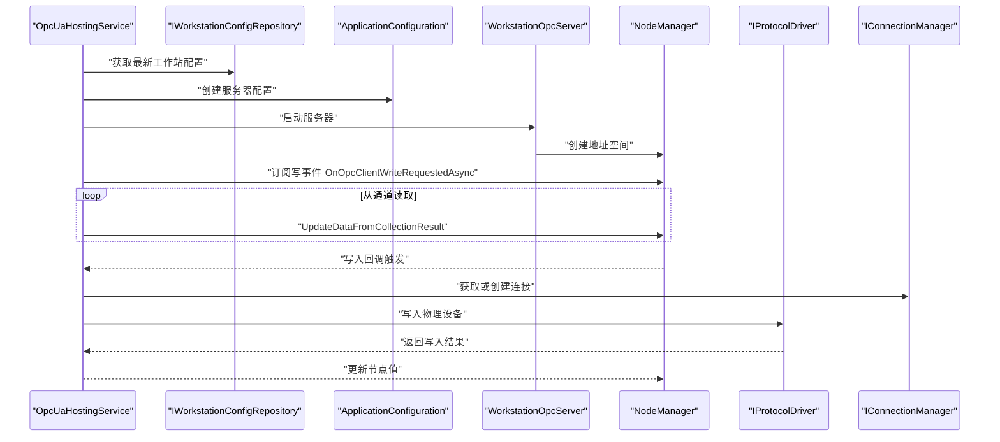
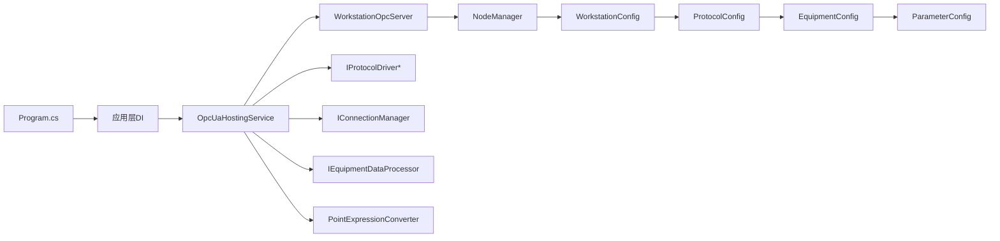

# OPC UA集成

<cite>
**本文引用的文件**
- [WorkstationOpcServer.cs](file://IndustrialDataSolution/IndustrialDataProcessor.Infrastructure/OpcUa/WorkstationOpcServer.cs)
- [NodeManager.cs](file://IndustrialDataSolution/IndustrialDataProcessor.Infrastructure/OpcUa/NodeManager.cs)
- [OpcUaHostingService.cs](file://IndustrialDataSolution/IndustrialDataProcessor.Infrastructure/BackgroundServices/OpcUaHostingService.cs)
- [IOpcUaServer.cs](file://IndustrialDataSolution/IndustrialDataProcessor.Application/OpcUa/IOpcUaServer.cs)
- [Program.cs](file://IndustrialDataSolution/IndustrialDataProcessor.Api/Program.cs)
- [DependencyInjection.cs（基础设施层）](file://IndustrialDataSolution/IndustrialDataProcessor.Infrastructure/DependencyInjection.cs)
- [DependencyInjection.cs（应用层）](file://IndustrialDataSolution/IndustrialDataProcessor.Application/DependencyInjection.cs)
- [WorkstationConfig.cs](file://IndustrialDataSolution/IndustrialDataProcessor.Domain/Workstation/Configs/WorkstationConfig.cs)
- [ProtocolConfig.cs](file://IndustrialDataSolution/IndustrialDataProcessor.Domain/Workstation/Configs/ProtocolConfig.cs)
- [EquipmentConfig.cs](file://IndustrialDataSolution/IndustrialDataProcessor.Domain/Workstation/Configs/EquipmentConfig.cs)
- [ParameterConfig.cs](file://IndustrialDataSolution/IndustrialDataProcessor.Domain/Workstation/Configs/ParameterConfig.cs)
- [IDataPublishServerManager.cs](file://IndustrialDataSolution/IndustrialDataProcessor.Domain/Repositories/IDataPublishServerManager.cs)
- [appsettings.json](file://IndustrialDataSolution/IndustrialDataProcessor.Api/appsettings.json)
- [appsettings.Development.json](file://IndustrialDataSolution/IndustrialDataProcessor.Api/appsettings.Development.json)
</cite>

## 目录
1. [简介](#简介)
2. [项目结构](#项目结构)
3. [核心组件](#核心组件)
4. [架构总览](#架构总览)
5. [组件详解](#组件详解)
6. [依赖关系分析](#依赖关系分析)
7. [性能考量](#性能考量)
8. [故障排除指南](#故障排除指南)
9. [结论](#结论)
10. [附录](#附录)

## 简介
本文件面向DDD工业数据处理解决方案中的OPC UA集成，系统性阐述OPC UA服务器实现架构、节点管理机制、客户端连接与会话管理、安全认证与数据订阅、实时与历史数据发布、事件通知、配置与部署、客户端集成最佳实践、OPC UA标准与工业互操作性，以及故障排除与性能监控要点。内容基于仓库现有代码实现，聚焦于WorkstationOpcServer设计、NodeManager功能与实现、后台托管服务的生命周期与数据通道集成。

## 项目结构
OPC UA相关能力主要分布在基础设施层与应用层：
- 基础设施层提供OPC UA服务器封装、节点管理器、后台托管服务与协议驱动集成；
- 应用层提供依赖注入装配、API入口与配置；
- 领域层提供工作站配置模型与协议/设备/参数配置结构。

图表来源
- [Program.cs](file://IndustrialDataSolution/IndustrialDataProcessor.Api/Program.cs#L1-L54)
- [OpcUaHostingService.cs](file://IndustrialDataSolution/IndustrialDataProcessor.Infrastructure/BackgroundServices/OpcUaHostingService.cs#L1-L228)
- [WorkstationOpcServer.cs](file://IndustrialDataSolution/IndustrialDataProcessor.Infrastructure/OpcUa/WorkstationOpcServer.cs#L1-L36)
- [NodeManager.cs](file://IndustrialDataSolution/IndustrialDataProcessor.Infrastructure/OpcUa/NodeManager.cs#L1-L417)
- [WorkstationConfig.cs](file://IndustrialDataSolution/IndustrialDataProcessor.Domain/Workstation/Configs/WorkstationConfig.cs#L1-L27)
- [ProtocolConfig.cs](file://IndustrialDataSolution/IndustrialDataProcessor.Domain/Workstation/Configs/ProtocolConfig.cs#L1-L64)
- [EquipmentConfig.cs](file://IndustrialDataSolution/IndustrialDataProcessor.Domain/Workstation/Configs/EquipmentConfig.cs#L1-L34)
- [ParameterConfig.cs](file://IndustrialDataSolution/IndustrialDataProcessor.Domain/Workstation/Configs/ParameterConfig.cs#L1-L84)

章节来源
- [Program.cs](file://IndustrialDataSolution/IndustrialDataProcessor.Api/Program.cs#L1-L54)
- [DependencyInjection.cs（基础设施层）](file://IndustrialDataSolution/IndustrialDataProcessor.Infrastructure/DependencyInjection.cs#L1-L82)
- [DependencyInjection.cs（应用层）](file://IndustrialDataSolution/IndustrialDataProcessor.Application/DependencyInjection.cs#L1-L40)

## 核心组件
- WorkstationOpcServer：继承标准OPC UA服务器，负责注册自定义节点管理器，暴露CustomNodeManager供外部推送数据。
- NodeManager：继承CustomNodeManager2，负责按配置创建地址空间（工作站/设备/变量）、维护节点字典、更新节点值与状态、处理客户端写入回调、建立节点到协议/设备/参数的路由映射。
- OpcUaHostingService：后台托管服务，负责启动/重启OPC UA服务器、订阅数据通道、接收采集结果并更新节点、响应客户端写请求并转发至协议驱动。
- 依赖注入：基础设施层注册OpcUaHostingService为单例并作为IDataPublishServerManager；应用层注册数据通道与MediatR等。

章节来源
- [WorkstationOpcServer.cs](file://IndustrialDataSolution/IndustrialDataProcessor.Infrastructure/OpcUa/WorkstationOpcServer.cs#L1-L36)
- [NodeManager.cs](file://IndustrialDataSolution/IndustrialDataProcessor.Infrastructure/OpcUa/NodeManager.cs#L1-L417)
- [OpcUaHostingService.cs](file://IndustrialDataSolution/IndustrialDataProcessor.Infrastructure/BackgroundServices/OpcUaHostingService.cs#L1-L228)
- [DependencyInjection.cs（基础设施层）](file://IndustrialDataSolution/IndustrialDataProcessor.Infrastructure/DependencyInjection.cs#L37-L46)
- [DependencyInjection.cs（应用层）](file://IndustrialDataSolution/IndustrialDataProcessor.Application/DependencyInjection.cs#L25-L26)

## 架构总览
OPC UA服务器通过后台服务启动，依据工作站配置动态构建地址空间，采集线程将数据写入节点，客户端可读取实时值与订阅变化；当客户端发起写操作时，服务器通过事件回调将写请求反向推送到应用层，经协议驱动与连接管理器下发至设备。

图表来源
- [OpcUaHostingService.cs](file://IndustrialDataSolution/IndustrialDataProcessor.Infrastructure/BackgroundServices/OpcUaHostingService.cs#L101-L184)
- [NodeManager.cs](file://IndustrialDataSolution/IndustrialDataProcessor.Infrastructure/OpcUa/NodeManager.cs#L334-L383)
- [WorkstationOpcServer.cs](file://IndustrialDataSolution/IndustrialDataProcessor.Infrastructure/OpcUa/WorkstationOpcServer.cs#L21-L34)

## 组件详解

### WorkstationOpcServer：服务器封装与节点管理器注册
- 继承StandardServer，重写CreateMasterNodeManager，注入自定义NodeManager并交由MasterNodeManager统一调度。
- 暴露CustomNodeManager属性，供外部（如事件处理器）推送最新采集数据。

图表来源
- [WorkstationOpcServer.cs](file://IndustrialDataSolution/IndustrialDataProcessor.Infrastructure/OpcUa/WorkstationOpcServer.cs#L11-L34)
- [NodeManager.cs](file://IndustrialDataSolution/IndustrialDataProcessor.Infrastructure/OpcUa/NodeManager.cs#L36-L79)

章节来源
- [WorkstationOpcServer.cs](file://IndustrialDataSolution/IndustrialDataProcessor.Infrastructure/OpcUa/WorkstationOpcServer.cs#L1-L36)

### NodeManager：地址空间构建、节点维护与写入回调
- 地址空间构建：按WorkstationConfig创建工作站文件夹、设备文件夹与变量节点，变量节点采用设备ID+标签的唯一标识，避免冲突。
- 节点缓存与路由：以“设备ID_标签”为键缓存变量节点；同时建立“节点ID→协议/设备/参数”的路由映射，支持写入回调时定位物理点位。
- 数据更新策略：UpdateDataFromCollectionResult按协议/设备/点位逐级判断，失败时设置对应状态码（如通信错误、未连接），成功时更新值与时间戳并触发订阅通知。
- 写入回调：OnWriteVariable根据节点ID查找路由，触发OnOpcClientWriteRequestedAsync事件，等待应用层完成协议写入后更新节点值。
- 类型与默认值：提供数据类型映射与默认值生成，避免OPC UA变体构建异常。

图表来源
- [NodeManager.cs](file://IndustrialDataSolution/IndustrialDataProcessor.Infrastructure/OpcUa/NodeManager.cs#L81-L127)

章节来源
- [NodeManager.cs](file://IndustrialDataSolution/IndustrialDataProcessor.Infrastructure/OpcUa/NodeManager.cs#L1-L417)

### 后台托管服务：生命周期、配置与数据通道
- 生命周期：继承BackgroundService，ExecuteAsync保活；StartOrRestartServerAsync支持安全重启，内部使用CancellationTokenSource协调。
- 服务器启动：RunServerLoopAsync获取最新工作站配置，创建ApplicationConfiguration并启动WorkstationOpcServer；挂载写事件回调。
- 数据通道：从DataCollectionChannel读取采集结果，调用NodeManager.UpdateDataFromCollectionResult更新节点。
- 安全配置：ApplicationConfiguration包含证书存储路径、信任列表、匿名用户策略与TCP基地址。
- 写入处理：回调中通过IProtocolDriver与IConnectionManager将业务值逆向转换为物理值并下发。

图表来源
- [OpcUaHostingService.cs](file://IndustrialDataSolution/IndustrialDataProcessor.Infrastructure/BackgroundServices/OpcUaHostingService.cs#L45-L184)

章节来源
- [OpcUaHostingService.cs](file://IndustrialDataSolution/IndustrialDataProcessor.Infrastructure/BackgroundServices/OpcUaHostingService.cs#L1-L228)

### 客户端连接、会话与订阅
- 会话与用户策略：服务器配置启用匿名用户令牌策略，允许匿名会话。
- 订阅通知：NodeManager在更新变量值时清除变更掩码并触发订阅通知，客户端可订阅节点变化。
- 写入流程：客户端写入变量触发OnWriteVariable，回调中通过事件委托将写请求传递给应用层，应用层再通过协议驱动下发至设备。

章节来源
- [OpcUaHostingService.cs](file://IndustrialDataSolution/IndustrialDataProcessor.Infrastructure/BackgroundServices/OpcUaHostingService.cs#L204-L209)
- [NodeManager.cs](file://IndustrialDataSolution/IndustrialDataProcessor.Infrastructure/OpcUa/NodeManager.cs#L334-L383)

### 数据发布机制：实时、历史与事件
- 实时数据：采集线程通过DataCollectionChannel推送结果，后台服务调用NodeManager更新节点值与状态，客户端可即时读取。
- 历史数据：当前实现未见历史数据节点配置或历史服务注册，若需历史访问，可在ApplicationConfiguration中扩展历史服务或引入第三方历史库。
- 事件通知：订阅变更时触发通知；写入失败时返回Bad状态码，客户端可据此处理。

章节来源
- [NodeManager.cs](file://IndustrialDataSolution/IndustrialDataProcessor.Infrastructure/OpcUa/NodeManager.cs#L160-L183)
- [OpcUaHostingService.cs](file://IndustrialDataSolution/IndustrialDataProcessor.Infrastructure/BackgroundServices/OpcUaHostingService.cs#L160-L174)

### 配置与部署：证书、网络与性能
- 证书管理：ApplicationConfiguration配置pki目录下的own/trusted/issuers/rejected证书存储路径，支持自动接受不受信证书与自动导入信任存储。
- 网络配置：服务器基地址为opc.tcp://0.0.0.0:4840/WorkstationServer，匿名用户策略启用。
- 性能调优：TransportQuotas设置操作超时；后台服务使用SemaphoreSlim限制并发重启；节点更新加锁保证线程安全；表达式逆向转换减少类型不匹配风险。

章节来源
- [OpcUaHostingService.cs](file://IndustrialDataSolution/IndustrialDataProcessor.Infrastructure/BackgroundServices/OpcUaHostingService.cs#L186-L214)

### 客户端集成最佳实践
- 连接与发现：使用OPC UA客户端连接opc.tcp://<服务器IP>:4840/WorkstationServer，匿名登录即可。
- 地址空间浏览：按工作站→设备→变量层级浏览，变量节点ID采用“设备ID_标签”，便于脚本化访问。
- 订阅与轮询：对关键点位使用订阅获取实时变化；对非关键点位可采用周期性轮询。
- 写入流程：写入前确认节点路由映射（协议/设备/参数），写入值需符合参数配置的数据类型，必要时进行表达式逆向转换。

章节来源
- [NodeManager.cs](file://IndustrialDataSolution/IndustrialDataProcessor.Infrastructure/OpcUa/NodeManager.cs#L65-L69)
- [OpcUaHostingService.cs](file://IndustrialDataSolution/IndustrialDataProcessor.Infrastructure/BackgroundServices/OpcUaHostingService.cs#L136-L158)

### OPC UA标准与工业互操作性
- 地址空间建模：按工作站/设备/变量分层组织，符合OPC UA信息模型规范。
- 数据类型映射：将领域数据类型映射到OPC UA标准数据类型，避免类型不匹配。
- 写入一致性：写入回调中通过事件委托与协议驱动解耦，提升跨协议互操作性。

章节来源
- [NodeManager.cs](file://IndustrialDataSolution/IndustrialDataProcessor.Infrastructure/OpcUa/NodeManager.cs#L188-L208)
- [WorkstationConfig.cs](file://IndustrialDataSolution/IndustrialDataProcessor.Domain/Workstation/Configs/WorkstationConfig.cs#L1-L27)
- [ProtocolConfig.cs](file://IndustrialDataSolution/IndustrialDataProcessor.Domain/Workstation/Configs/ProtocolConfig.cs#L1-L64)
- [EquipmentConfig.cs](file://IndustrialDataSolution/IndustrialDataProcessor.Domain/Workstation/Configs/EquipmentConfig.cs#L1-L34)
- [ParameterConfig.cs](file://IndustrialDataSolution/IndustrialDataProcessor.Domain/Workstation/Configs/ParameterConfig.cs#L1-L84)

## 依赖关系分析
- 依赖注入：基础设施层将OpcUaHostingService注册为单例并实现IDataPublishServerManager接口，应用层注册DataCollectionChannel与MediatR；API入口Program.cs注册基础设施与应用层服务。
- 组件耦合：OpcUaHostingService依赖IProtocolDriver集合、IConnectionManager、IEquipmentDataProcessor、PointExpressionConverter与DataCollectionChannel；NodeManager依赖WorkstationConfig与数据类型映射。
- 外部依赖：OPC UA SDK（StandardServer、MasterNodeManager、CustomNodeManager2等）。

图表来源
- [Program.cs](file://IndustrialDataSolution/IndustrialDataProcessor.Api/Program.cs#L18-L30)
- [DependencyInjection.cs（基础设施层）](file://IndustrialDataSolution/IndustrialDataProcessor.Infrastructure/DependencyInjection.cs#L37-L62)
- [DependencyInjection.cs（应用层）](file://IndustrialDataSolution/IndustrialDataProcessor.Application/DependencyInjection.cs#L25-L29)
- [OpcUaHostingService.cs](file://IndustrialDataSolution/IndustrialDataProcessor.Infrastructure/BackgroundServices/OpcUaHostingService.cs#L20-L40)
- [NodeManager.cs](file://IndustrialDataSolution/IndustrialDataProcessor.Infrastructure/OpcUa/NodeManager.cs#L10-L34)

章节来源
- [DependencyInjection.cs（基础设施层）](file://IndustrialDataSolution/IndustrialDataProcessor.Infrastructure/DependencyInjection.cs#L1-L82)
- [DependencyInjection.cs（应用层）](file://IndustrialDataSolution/IndustrialDataProcessor.Application/DependencyInjection.cs#L1-L40)

## 性能考量
- 线程安全：节点更新使用锁保护，避免并发写入竞争。
- 事件与回调：写入回调为同步阻塞等待，建议在应用层异步处理写入任务并尽快返回结果。
- 通道消费：后台服务使用异步枚举读取通道，避免阻塞主线程。
- 类型转换：在更新前进行类型转换与默认值填充，降低OPC UA异常概率。
- 证书与网络：合理设置操作超时与传输配额，避免长时间阻塞影响吞吐。

章节来源
- [NodeManager.cs](file://IndustrialDataSolution/IndustrialDataProcessor.Infrastructure/OpcUa/NodeManager.cs#L167-L183)
- [OpcUaHostingService.cs](file://IndustrialDataSolution/IndustrialDataProcessor.Infrastructure/BackgroundServices/OpcUaHostingService.cs#L160-L174)

## 故障排除指南
- 启动失败：检查HslCommunication授权码配置，确保appsettings.json中存在且有效。
- 证书问题：确认pki目录结构与证书存储路径正确，必要时手动导入受信任证书。
- 写入失败：检查OnOpcClientWriteRequestedAsync是否被订阅，确认协议驱动与连接管理器可用，查看日志输出。
- 节点值为空：首次启动时节点初始值为“等待初始数据”，等待采集结果到达后自动更新。
- 服务器重启：使用IDataPublishServerManager.StartOrRestartServerAsync触发安全重启，避免端口占用冲突。

章节来源
- [appsettings.json](file://IndustrialDataSolution/IndustrialDataProcessor.Api/appsettings.json#L10-L16)
- [OpcUaHostingService.cs](file://IndustrialDataSolution/IndustrialDataProcessor.Infrastructure/BackgroundServices/OpcUaHostingService.cs#L63-L99)
- [NodeManager.cs](file://IndustrialDataSolution/IndustrialDataProcessor.Infrastructure/OpcUa/NodeManager.cs#L72-L76)

## 结论
本方案通过WorkstationOpcServer与NodeManager实现了面向工业数据采集的OPC UA服务器，结合后台托管服务与数据通道，完成了从采集到发布的闭环。节点管理器提供了灵活的地址空间建模、类型映射与写入回调机制，满足多协议、多设备的工业互操作需求。建议在生产环境中完善历史数据服务、增强安全策略与监控告警体系，持续优化写入与订阅性能。

## 附录
- 配置文件位置与关键项
  - appsettings.json：数据库连接字符串、HslCommunication授权码
  - appsettings.Development.json：开发环境日志级别
- 服务器配置关键点
  - 证书存储：pki/own、pki/trusted、pki/issuers、pki/rejected
  - 基地址：opc.tcp://0.0.0.0:4840/WorkstationServer
  - 用户策略：匿名用户令牌

章节来源
- [appsettings.json](file://IndustrialDataSolution/IndustrialDataProcessor.Api/appsettings.json#L1-L17)
- [appsettings.Development.json](file://IndustrialDataSolution/IndustrialDataProcessor.Api/appsettings.Development.json#L1-L9)
- [OpcUaHostingService.cs](file://IndustrialDataSolution/IndustrialDataProcessor.Infrastructure/BackgroundServices/OpcUaHostingService.cs#L186-L214)