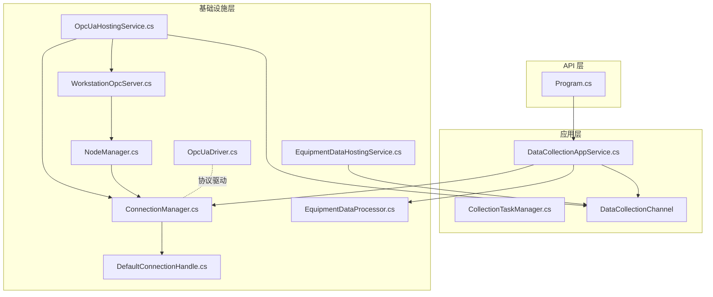
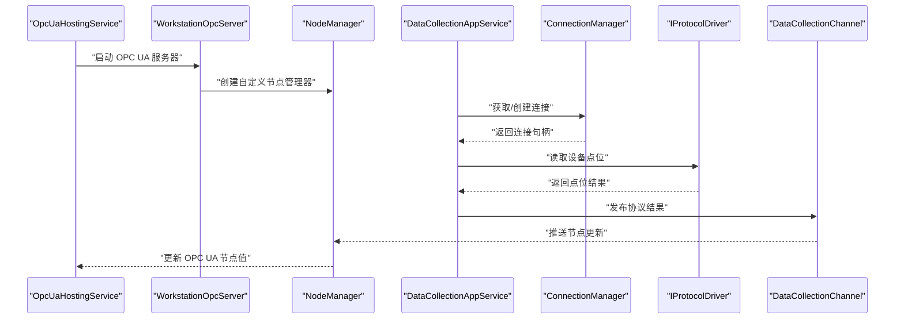
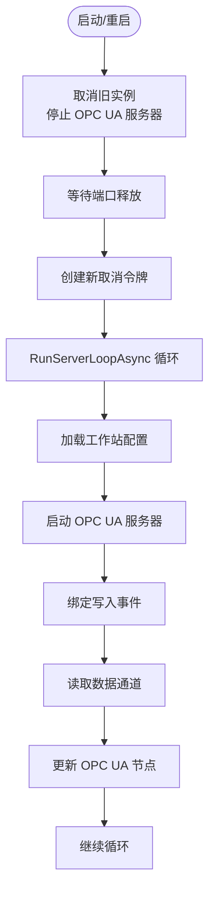
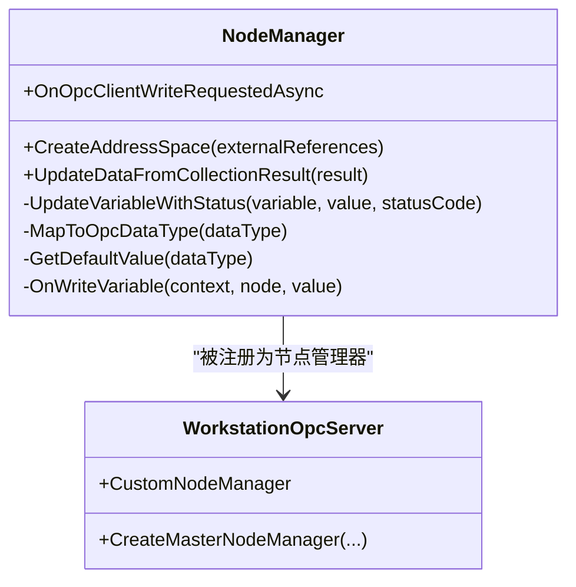
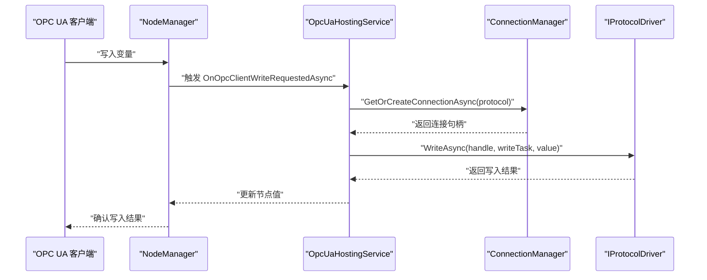
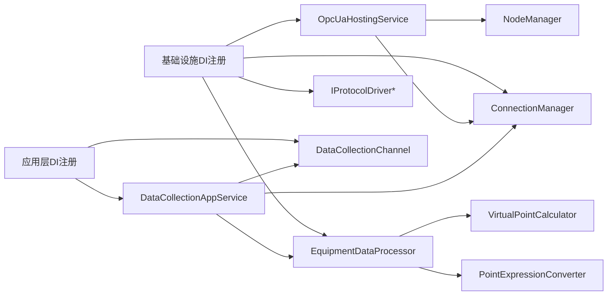

# 客户端连接处理

<cite>
**本文档引用的文件**
- [OpcUaHostingService.cs](file://IndustrialDataSolution/IndustrialDataProcessor.Infrastructure/BackgroundServices/OpcUaHostingService.cs)
- [WorkstationOpcServer.cs](file://IndustrialDataSolution/IndustrialDataProcessor.Infrastructure/OpcUa/WorkstationOpcServer.cs)
- [NodeManager.cs](file://IndustrialDataSolution/IndustrialDataProcessor.Infrastructure/OpcUa/NodeManager.cs)
- [ConnectionManager.cs](file://IndustrialDataSolution/IndustrialDataProcessor.Infrastructure/Communication/Connection/ConnectionManager.cs)
- [DefaultConnectionHandle.cs](file://IndustrialDataSolution/IndustrialDataProcessor.Infrastructure/Communication/Connection/DefaultConnectionHandle.cs)
- [OpcUaDriver.cs](file://IndustrialDataSolution/IndustrialDataProcessor.Infrastructure/Communication/Drivers/TcpSpecial/OpcUaDriver.cs)
- [DataCollectionAppService.cs](file://IndustrialDataSolution/IndustrialDataProcessor.Application/Services/DataCollectionAppService.cs)
- [EquipmentDataHostingService.cs](file://IndustrialDataSolution/IndustrialDataProcessor.Infrastructure/BackgroundServices/EquipmentDataHostingService.cs)
- [EquipmentDataProcessor.cs](file://IndustrialDataSolution/IndustrialDataProcessor.Infrastructure/EquipmentCollectionDataProcessing/EquipmentDataProcessor.cs)
- [IConnectionManager.cs](file://IndustrialDataSolution/IndustrialDataProcessor.Domain/Communication/IConnection/IConnectionManager.cs)
- [WorkstationConfig.cs](file://IndustrialDataSolution/IndustrialDataProcessor.Domain/Workstation/Configs/WorkstationConfig.cs)
- [DependencyInjection.cs（基础设施）](file://IndustrialDataSolution/IndustrialDataProcessor.Infrastructure/DependencyInjection.cs)
- [DependencyInjection.cs（应用层）](file://IndustrialDataSolution/IndustrialDataProcessor.Application/DependencyInjection.cs)
- [Program.cs](file://IndustrialDataSolution/IndustrialDataProcessor.Api/Program.cs)
- [appsettings.json](file://IndustrialDataSolution/IndustrialDataProcessor.Api/appsettings.json)
</cite>

## 目录
1. [简介](#简介)
2. [项目结构](#项目结构)
3. [核心组件](#核心组件)
4. [架构总览](#架构总览)
5. [详细组件分析](#详细组件分析)
6. [依赖关系分析](#依赖关系分析)
7. [性能考量](#性能考量)
8. [故障排查指南](#故障排查指南)
9. [结论](#结论)
10. [附录](#附录)

## 简介
本文件围绕客户端连接处理与 OPC UA 服务器托管服务展开，重点解释以下内容：
- OpcUaHostingService 的设计与实现，包括 OPC UA 服务器的托管、启动/重启流程与生命周期管理。
- 客户端会话管理：会话建立、维护与超时处理（基于 OPC UA 客户端会话配置）。
- 安全认证机制：匿名认证与用户名/密码认证的配置路径；证书管理与自动接受不受信任证书的策略。
- 客户端连接生命周期：连接建立、状态监控与异常处理。
- 客户端连接配置：连接参数、超时设置与重连策略。
- 监控与日志：OPC UA 服务器与采集链路的日志记录与错误上报。
- 与数据采集系统的集成：数据通道、节点管理器更新与写入回调的联动。

## 项目结构
本项目采用分层架构，客户端连接处理主要分布在基础设施层（Infrastructure）与应用层（Application）：
- 基础设施层负责 OPC UA 服务器托管、连接管理、协议驱动与数据处理。
- 应用层负责采集任务调度、结果聚合与通道发布。
- API 层负责启动与中间件装配。

**图表来源**
- [Program.cs](file://IndustrialDataSolution/IndustrialDataProcessor.Api/Program.cs#L1-L54)
- [DataCollectionAppService.cs](file://IndustrialDataSolution/IndustrialDataProcessor.Application/Services/DataCollectionAppService.cs#L1-L216)
- [OpcUaHostingService.cs](file://IndustrialDataSolution/IndustrialDataProcessor.Infrastructure/BackgroundServices/OpcUaHostingService.cs#L1-L228)
- [WorkstationOpcServer.cs](file://IndustrialDataSolution/IndustrialDataProcessor.Infrastructure/OpcUa/WorkstationOpcServer.cs#L1-L36)
- [NodeManager.cs](file://IndustrialDataSolution/IndustrialDataProcessor.Infrastructure/OpcUa/NodeManager.cs#L1-L417)
- [ConnectionManager.cs](file://IndustrialDataSolution/IndustrialDataProcessor.Infrastructure/Communication/Connection/ConnectionManager.cs#L1-L396)
- [DefaultConnectionHandle.cs](file://IndustrialDataSolution/IndustrialDataProcessor.Infrastructure/Communication/Connection/DefaultConnectionHandle.cs#L1-L50)
- [EquipmentDataProcessor.cs](file://IndustrialDataSolution/IndustrialDataProcessor.Infrastructure/EquipmentCollectionDataProcessing/EquipmentDataProcessor.cs#L1-L157)
- [EquipmentDataHostingService.cs](file://IndustrialDataSolution/IndustrialDataProcessor.Infrastructure/BackgroundServices/EquipmentDataHostingService.cs#L1-L43)
- [OpcUaDriver.cs](file://IndustrialDataSolution/IndustrialDataProcessor.Infrastructure/Communication/Drivers/TcpSpecial/OpcUaDriver.cs#L1-L21)

**章节来源**
- [Program.cs](file://IndustrialDataSolution/IndustrialDataProcessor.Api/Program.cs#L1-L54)
- [DependencyInjection.cs（基础设施）](file://IndustrialDataSolution/IndustrialDataProcessor.Infrastructure/DependencyInjection.cs#L1-L82)
- [DependencyInjection.cs（应用层）](file://IndustrialDataSolution/IndustrialDataProcessor.Application/DependencyInjection.cs#L1-L40)

## 核心组件
- OpcUaHostingService：后台托管服务，负责 OPC UA 服务器的启动、重启与数据推送循环。
- WorkstationOpcServer：OPC UA 标准服务器的封装，注册自定义节点管理器。
- NodeManager：自定义节点管理器，负责地址空间创建、节点状态更新与写入回调。
- ConnectionManager：连接管理器，按协议配置创建/复用连接句柄，支持 LAN/COM 与 OPC UA 客户端。
- DefaultConnectionHandle：连接句柄包装，提供并发安全与底层连接释放。
- DataCollectionAppService：采集服务，按协议独立循环采集，聚合结果并通过通道发布。
- EquipmentDataProcessor：设备数据处理器，完成公式转换、虚拟点计算与最终状态聚合。
- EquipmentDataHostingService：数据库持久化后台服务，消费通道中的设备数据并保存。

**章节来源**
- [OpcUaHostingService.cs](file://IndustrialDataSolution/IndustrialDataProcessor.Infrastructure/BackgroundServices/OpcUaHostingService.cs#L1-L228)
- [WorkstationOpcServer.cs](file://IndustrialDataSolution/IndustrialDataProcessor.Infrastructure/OpcUa/WorkstationOpcServer.cs#L1-L36)
- [NodeManager.cs](file://IndustrialDataSolution/IndustrialDataProcessor.Infrastructure/OpcUa/NodeManager.cs#L1-L417)
- [ConnectionManager.cs](file://IndustrialDataSolution/IndustrialDataProcessor.Infrastructure/Communication/Connection/ConnectionManager.cs#L1-L396)
- [DefaultConnectionHandle.cs](file://IndustrialDataSolution/IndustrialDataProcessor.Infrastructure/Communication/Connection/DefaultConnectionHandle.cs#L1-L50)
- [DataCollectionAppService.cs](file://IndustrialDataSolution/IndustrialDataProcessor.Application/Services/DataCollectionAppService.cs#L1-L216)
- [EquipmentDataProcessor.cs](file://IndustrialDataSolution/IndustrialDataProcessor.Infrastructure/EquipmentCollectionDataProcessing/EquipmentDataProcessor.cs#L1-L157)
- [EquipmentDataHostingService.cs](file://IndustrialDataSolution/IndustrialDataProcessor.Infrastructure/BackgroundServices/EquipmentDataHostingService.cs#L1-L43)

## 架构总览
OPC UA 服务器由托管服务启动，节点管理器创建地址空间并维护节点状态；采集服务通过连接管理器获取连接，驱动协议读取数据，将结果经处理器转换后发布到通道；OPC UA 客户端可订阅节点并写入变量，写入回调触发底层驱动写入，形成闭环。

**图表来源**
- [OpcUaHostingService.cs](file://IndustrialDataSolution/IndustrialDataProcessor.Infrastructure/BackgroundServices/OpcUaHostingService.cs#L101-L184)
- [WorkstationOpcServer.cs](file://IndustrialDataSolution/IndustrialDataProcessor.Infrastructure/OpcUa/WorkstationOpcServer.cs#L21-L34)
- [NodeManager.cs](file://IndustrialDataSolution/IndustrialDataProcessor.Infrastructure/OpcUa/NodeManager.cs#L81-L127)
- [DataCollectionAppService.cs](file://IndustrialDataSolution/IndustrialDataProcessor.Application/Services/DataCollectionAppService.cs#L79-L198)
- [ConnectionManager.cs](file://IndustrialDataSolution/IndustrialDataProcessor.Infrastructure/Communication/Connection/ConnectionManager.cs#L25-L36)

## 详细组件分析

### OpcUaHostingService：OPC UA 服务器托管与生命周期
- 后台服务入口：ExecuteAsync 挂起直至宿主取消；首次启动调用 StartOrRestartServerAsync。
- 重启控制：使用信号量保护并发重启；旧实例取消、停止并释放资源后，创建新的链接取消令牌并启动 RunServerLoopAsync。
- 服务器配置：创建 ApplicationConfiguration，设置证书存储、传输配额、服务器基地址、安全策略与用户令牌策略（匿名）。
- 事件绑定：订阅 NodeManager.OnOpcClientWriteRequestedAsync，将 OPC 客户端写入请求反推为底层协议写入。
- 数据推送：从数据通道读取采集结果，调用 NodeManager.UpdateDataFromCollectionResult 更新节点值与状态。

**图表来源**
- [OpcUaHostingService.cs](file://IndustrialDataSolution/IndustrialDataProcessor.Infrastructure/BackgroundServices/OpcUaHostingService.cs#L63-L184)

**章节来源**
- [OpcUaHostingService.cs](file://IndustrialDataSolution/IndustrialDataProcessor.Infrastructure/BackgroundServices/OpcUaHostingService.cs#L45-L99)
- [OpcUaHostingService.cs](file://IndustrialDataSolution/IndustrialDataProcessor.Infrastructure/BackgroundServices/OpcUaHostingService.cs#L186-L214)

### WorkstationOpcServer：服务器封装与节点管理器注册
- 继承标准 OPC UA 服务器，重写 CreateMasterNodeManager，注入自定义 NodeManager 并交由 MasterNodeManager 统一调度。
- 暴露 CustomNodeManager 供外部使用（如托管服务绑定事件）。

**章节来源**
- [WorkstationOpcServer.cs](file://IndustrialDataSolution/IndustrialDataProcessor.Infrastructure/OpcUa/WorkstationOpcServer.cs#L11-L35)

### NodeManager：地址空间、节点状态与写入回调
- 地址空间创建：按工作站、协议、设备、点位层级创建文件夹与变量节点，缓存节点映射以便快速更新。
- 节点更新：UpdateDataFromCollectionResult 根据协议/设备/点位结果更新值与状态码，支持批量标记离线状态。
- 写入回调：OnWriteVariable 根据节点 ID 查找物理路由，触发应用层 OnOpcClientWriteRequestedAsync 事件，成功后更新 OPC UA 节点值。
- 类型转换：将计算后的值转换为目标数据类型，避免类型不匹配错误。

**图表来源**
- [NodeManager.cs](file://IndustrialDataSolution/IndustrialDataProcessor.Infrastructure/OpcUa/NodeManager.cs#L10-L383)
- [WorkstationOpcServer.cs](file://IndustrialDataSolution/IndustrialDataProcessor.Infrastructure/OpcUa/WorkstationOpcServer.cs#L21-L34)

**章节来源**
- [NodeManager.cs](file://IndustrialDataSolution/IndustrialDataProcessor.Infrastructure/OpcUa/NodeManager.cs#L36-L127)
- [NodeManager.cs](file://IndustrialDataSolution/IndustrialDataProcessor.Infrastructure/OpcUa/NodeManager.cs#L334-L383)

### 连接管理与客户端会话管理
- 连接复用：GetOrCreateConnectionAsync 以协议配置 Id 为键缓存连接句柄，避免重复创建。
- LAN 连接：根据协议类型创建不同底层连接（Modbus、Siemens S7、Omron、IEC104 等），设置连接/接收超时。
- OPC UA 客户端：创建 ApplicationConfiguration，检查证书，选择 Endpoint，构造 UserIdentity（匿名或用户名/密码），创建会话。
- 会话超时：ClientConfiguration 中设置默认会话超时；底层 OPC UA 客户端会话维持心跳与超时控制。
- 并发安全：DefaultConnectionHandle 使用信号量保护底层连接的并发访问。

**图表来源**
- [NodeManager.cs](file://IndustrialDataSolution/IndustrialDataProcessor.Infrastructure/OpcUa/NodeManager.cs#L334-L383)
- [OpcUaHostingService.cs](file://IndustrialDataSolution/IndustrialDataProcessor.Infrastructure/BackgroundServices/OpcUaHostingService.cs#L136-L158)
- [ConnectionManager.cs](file://IndustrialDataSolution/IndustrialDataProcessor.Infrastructure/Communication/Connection/ConnectionManager.cs#L252-L331)
- [DefaultConnectionHandle.cs](file://IndustrialDataSolution/IndustrialDataProcessor.Infrastructure/Communication/Connection/DefaultConnectionHandle.cs#L15-L34)

**章节来源**
- [ConnectionManager.cs](file://IndustrialDataSolution/IndustrialDataProcessor.Infrastructure/Communication/Connection/ConnectionManager.cs#L25-L36)
- [ConnectionManager.cs](file://IndustrialDataSolution/IndustrialDataProcessor.Infrastructure/Communication/Connection/ConnectionManager.cs#L252-L331)
- [DefaultConnectionHandle.cs](file://IndustrialDataSolution/IndustrialDataProcessor.Infrastructure/Communication/Connection/DefaultConnectionHandle.cs#L6-L34)

### 安全认证机制
- 匿名认证：服务器配置中 UserTokenPolicy 为 Anonymous，允许匿名客户端连接。
- 用户名/密码认证：当配置中提供账户与密码时，构造 UserIdentity 并传递给会话创建；若为空则使用匿名。
- 证书管理：服务器与客户端分别配置证书存储路径与自动接受不受信任证书策略；在客户端启用证书验证事件自动接受不受信任证书。
- 传输安全：当前服务器安全策略配置为 None（明文），生产环境建议启用加密与签名策略。

**章节来源**
- [OpcUaHostingService.cs](file://IndustrialDataSolution/IndustrialDataProcessor.Infrastructure/BackgroundServices/OpcUaHostingService.cs#L204-L209)
- [ConnectionManager.cs](file://IndustrialDataSolution/IndustrialDataProcessor.Infrastructure/Communication/Connection/ConnectionManager.cs#L316-L324)
- [ConnectionManager.cs](file://IndustrialDataSolution/IndustrialDataProcessor.Infrastructure/Communication/Connection/ConnectionManager.cs#L295-L299)

### 客户端连接生命周期与异常处理
- 生命周期：托管服务在 ExecuteAsync 中挂起，StopAsync 主动取消当前运行循环并停止服务器。
- 异常处理：RunServerLoopAsync 捕获取消与致命错误，记录日志并优雅退出；采集循环中对协议级异常进行隔离与降级处理。
- 连接清理：ClearAllConnectionsAsync 与 IAsyncDisposable 实现确保连接资源释放。

**章节来源**
- [OpcUaHostingService.cs](file://IndustrialDataSolution/IndustrialDataProcessor.Infrastructure/BackgroundServices/OpcUaHostingService.cs#L216-L227)
- [DataCollectionAppService.cs](file://IndustrialDataSolution/IndustrialDataProcessor.Application/Services/DataCollectionAppService.cs#L154-L171)
- [ConnectionManager.cs](file://IndustrialDataSolution/IndustrialDataProcessor.Infrastructure/Communication/Connection/ConnectionManager.cs#L372-L394)

### 客户端连接配置与重连策略
- 连接参数：LAN 协议连接设置 ConnectTimeOut、ReceiveTimeOut；OPC UA 客户端设置 OperationTimeout 与会话超时。
- 重连策略：ConnectionManager 提供连接复用；采集循环中对异常进行捕获与重试，协议级失败时记录错误并继续下一轮循环。
- 配置来源：通过 IWorkstationConfigRepository 获取最新工作站配置，动态生效。

**章节来源**
- [ConnectionManager.cs](file://IndustrialDataSolution/IndustrialDataProcessor.Infrastructure/Communication/Connection/ConnectionManager.cs#L68-L76)
- [DataCollectionAppService.cs](file://IndustrialDataSolution/IndustrialDataProcessor.Application/Services/DataCollectionAppService.cs#L22-L41)

### 监控与日志记录
- OPC UA 服务器：启动/停止、重启、致命错误与更新失败均记录日志。
- 采集链路：采集服务记录协议级异常、点位读取耗时与最终聚合状态；持久化服务记录保存异常。
- 日志配置：API 层 appsettings.json 提供基础日志级别配置。

**章节来源**
- [OpcUaHostingService.cs](file://IndustrialDataSolution/IndustrialDataProcessor.Infrastructure/BackgroundServices/OpcUaHostingService.cs#L68-L93)
- [OpcUaHostingService.cs](file://IndustrialDataSolution/IndustrialDataProcessor.Infrastructure/BackgroundServices/OpcUaHostingService.cs#L170-L183)
- [DataCollectionAppService.cs](file://IndustrialDataSolution/IndustrialDataProcessor.Application/Services/DataCollectionAppService.cs#L160-L171)
- [EquipmentDataHostingService.cs](file://IndustrialDataSolution/IndustrialDataProcessor.Infrastructure/BackgroundServices/EquipmentDataHostingService.cs#L23-L34)
- [appsettings.json](file://IndustrialDataSolution/IndustrialDataProcessor.Api/appsettings.json#L2-L7)

### 与数据采集系统的集成与数据推送
- 数据通道：DataCollectionAppService 将协议结果与设备 JSON 映射发布到通道；EquipmentDataHostingService 消费通道并持久化。
- 节点更新：OpcUaHostingService 从通道读取结果，调用 NodeManager.UpdateDataFromCollectionResult 更新 OPC UA 节点。
- 公式与虚拟点：EquipmentDataProcessor 完成公式转换、虚拟点计算与最终状态聚合，确保 OPC UA 节点值与业务一致。

**章节来源**
- [DataCollectionAppService.cs](file://IndustrialDataSolution/IndustrialDataProcessor.Application/Services/DataCollectionAppService.cs#L185-L198)
- [EquipmentDataHostingService.cs](file://IndustrialDataSolution/IndustrialDataProcessor.Infrastructure/BackgroundServices/EquipmentDataHostingService.cs#L21-L35)
- [EquipmentDataProcessor.cs](file://IndustrialDataSolution/IndustrialDataProcessor.Infrastructure/EquipmentCollectionDataProcessing/EquipmentDataProcessor.cs#L21-L48)
- [OpcUaHostingService.cs](file://IndustrialDataSolution/IndustrialDataProcessor.Infrastructure/BackgroundServices/OpcUaHostingService.cs#L160-L174)

## 依赖关系分析
- 依赖注入：基础设施层注册 ConnectionManager、OpcUaHostingService、IEquipmentDataProcessor、IProtocolDriver 等；应用层注册 DataCollectionAppService、DataCollectionChannel。
- 组件耦合：OpcUaHostingService 依赖 NodeManager 与 ConnectionManager；DataCollectionAppService 依赖 ConnectionManager 与通道；EquipmentDataProcessor 依赖表达式转换器与虚拟点计算器。
- 外部依赖：OPC UA SDK、HslCommunication、PostgreSQL 持久化。

**图表来源**
- [DependencyInjection.cs（基础设施）](file://IndustrialDataSolution/IndustrialDataProcessor.Infrastructure/DependencyInjection.cs#L33-L62)
- [DependencyInjection.cs（应用层）](file://IndustrialDataSolution/IndustrialDataProcessor.Application/DependencyInjection.cs#L23-L26)

**章节来源**
- [DependencyInjection.cs（基础设施）](file://IndustrialDataSolution/IndustrialDataProcessor.Infrastructure/DependencyInjection.cs#L17-L82)
- [DependencyInjection.cs（应用层）](file://IndustrialDataSolution/IndustrialDataProcessor.Application/DependencyInjection.cs#L16-L39)

## 性能考量
- 连接复用：ConnectionManager 以协议 Id 为键缓存连接句柄，减少重复创建开销。
- 并发控制：DefaultConnectionHandle 使用信号量保护底层连接并发访问，避免竞争。
- 通道扇分：DataCollectionAppService 在发布前完成设备数据处理与聚合，降低下游处理压力。
- 节点更新：NodeManager 使用缓存字典与状态码快速更新，避免频繁重建节点。
- 超时设置：合理设置连接/接收超时与会话超时，平衡响应速度与稳定性。

## 故障排查指南
- OPC UA 服务器启动失败：检查证书存储路径与权限、端口占用与安全策略配置。
- 节点更新失败：查看日志中的更新异常信息，确认协议/设备/点位映射是否正确。
- 采集异常：关注协议级异常日志，确认底层连接可用性与协议驱动支持情况。
- 写入失败：检查 OPC UA 客户端写入回调是否触发、应用层事件是否订阅以及底层驱动写入结果。
- 持久化异常：确认数据库连接字符串与表结构，查看保存异常日志。

**章节来源**
- [OpcUaHostingService.cs](file://IndustrialDataSolution/IndustrialDataProcessor.Infrastructure/BackgroundServices/OpcUaHostingService.cs#L170-L183)
- [DataCollectionAppService.cs](file://IndustrialDataSolution/IndustrialDataProcessor.Application/Services/DataCollectionAppService.cs#L160-L171)
- [EquipmentDataHostingService.cs](file://IndustrialDataSolution/IndustrialDataProcessor.Infrastructure/BackgroundServices/EquipmentDataHostingService.cs#L31-L34)

## 结论
本实现通过 OpcUaHostingService 将 OPC UA 服务器托管于后台服务，结合 ConnectionManager 的连接复用与协议驱动，实现了稳定的数据采集与节点更新。NodeManager 提供了完整的地址空间与写入回调机制，支持 OPC UA 客户端的读写操作。通过 DataCollectionAppService 与 EquipmentDataProcessor 的协同，系统完成了从采集、转换、聚合到持久化的完整链路。在安全与性能方面，系统提供了匿名与用户名/密码认证、证书管理与超时控制，并通过连接复用与并发控制提升整体稳定性。

## 附录
- 配置文件示例路径：[appsettings.json](file://IndustrialDataSolution/IndustrialDataProcessor.Api/appsettings.json#L10-L16)
- 启动入口：[Program.cs](file://IndustrialDataSolution/IndustrialDataProcessor.Api/Program.cs#L10-L54)
- 工作站配置模型：[WorkstationConfig.cs](file://IndustrialDataSolution/IndustrialDataProcessor.Domain/Workstation/Configs/WorkstationConfig.cs#L6-L27)
- 连接管理接口：[IConnectionManager.cs](file://IndustrialDataSolution/IndustrialDataProcessor.Domain/Communication/IConnection/IConnectionManager.cs#L5-L18)