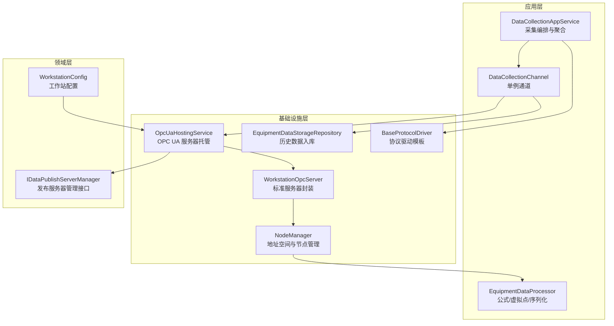
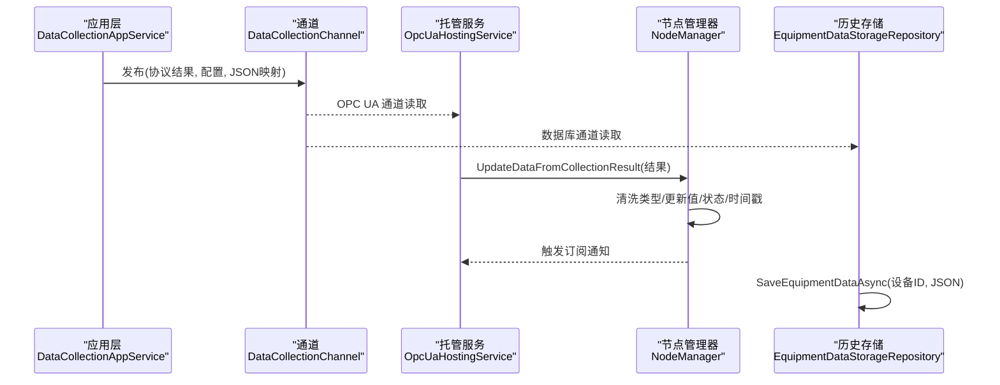
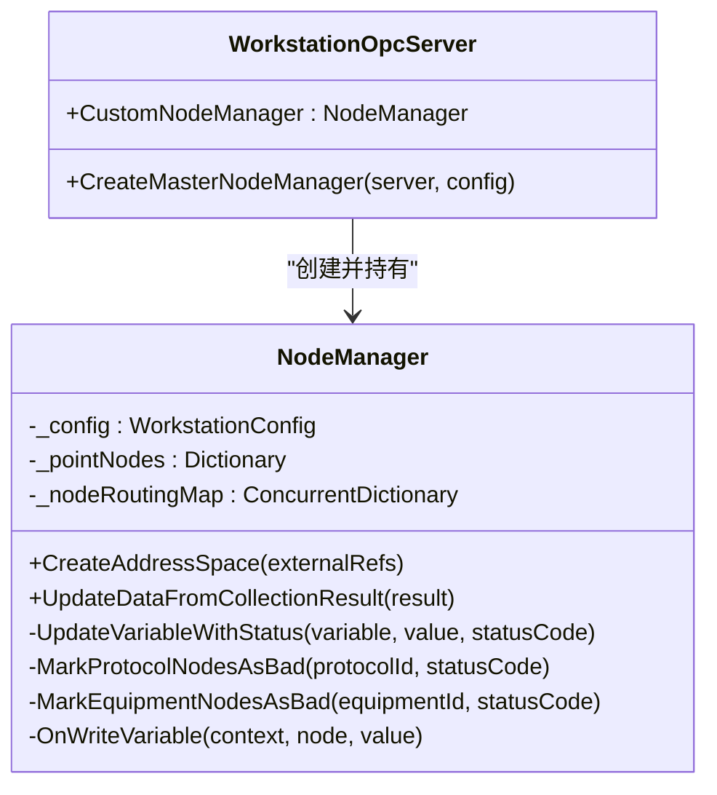
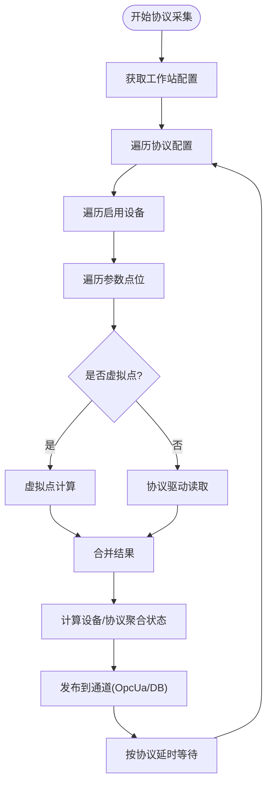
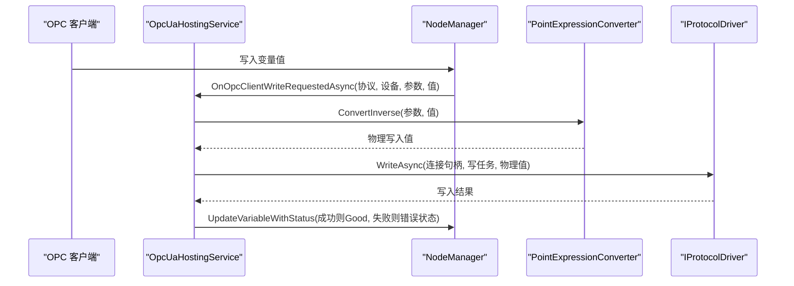
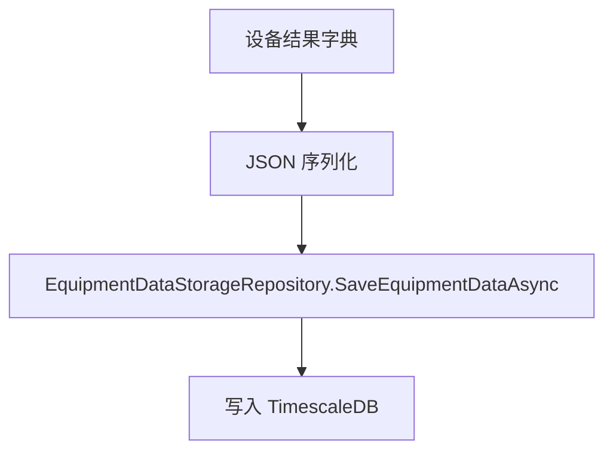
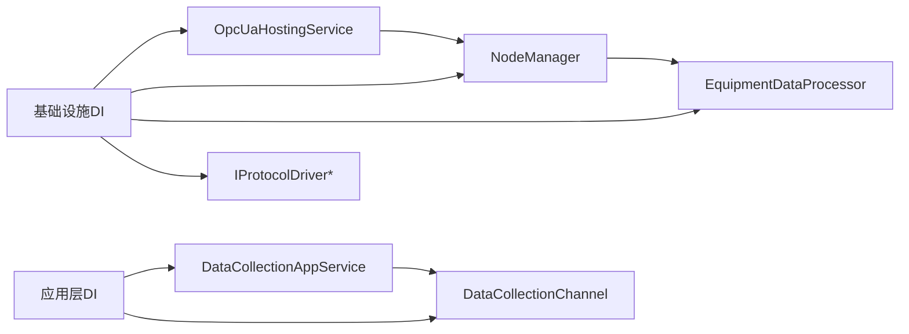

# 数据发布策略

<cite>
**本文引用的文件**
- [WorkstationOpcServer.cs](file://IndustrialDataSolution/IndustrialDataProcessor.Infrastructure/OpcUa/WorkstationOpcServer.cs)
- [NodeManager.cs](file://IndustrialDataSolution/IndustrialDataProcessor.Infrastructure/OpcUa/NodeManager.cs)
- [OpcUaHostingService.cs](file://IndustrialDataSolution/IndustrialDataProcessor.Infrastructure/BackgroundServices/OpcUaHostingService.cs)
- [DataCollectionAppService.cs](file://IndustrialDataSolution/IndustrialDataProcessor.Application/Services/DataCollectionAppService.cs)
- [DataCollectionChannel.cs](file://IndustrialDataSolution/IndustrialDataProcessor.Domain/Workstation/Results/DataCollectionChannel.cs)
- [EquipmentDataProcessor.cs](file://IndustrialDataSolution/IndustrialDataProcessor.Infrastructure/EquipmentCollectionDataProcessing/EquipmentDataProcessor.cs)
- [EquipmentDataStorageRepository.cs](file://IndustrialDataSolution/IndustrialDataProcessor.Infrastructure.Persistence.SqlSugar/Repositories/EquipmentDataStorageRepository.cs)
- [BaseProtocolDriver.cs](file://IndustrialDataSolution/IndustrialDataProcessor.Infrastructure/Communication/Drivers/TcpCommon/BaseProtocolDriver.cs)
- [DependencyInjection.cs（基础设施层）](file://IndustrialDataSolution/IndustrialDataProcessor.Infrastructure/DependencyInjection.cs)
- [DependencyInjection.cs（应用层）](file://IndustrialDataSolution/IndustrialDataProcessor.Application/DependencyInjection.cs)
- [WorkstationConfig.cs](file://IndustrialDataSolution/IndustrialDataProcessor.Domain/Workstation/Configs/WorkstationConfig.cs)
- [IOpcUaServer.cs](file://IndustrialDataSolution/IndustrialDataProcessor.Application/OpcUa/IOpcUaServer.cs)
- [IDataPublishServerManager.cs](file://IndustrialDataSolution/IndustrialDataProcessor.Domain/Repositories/IDataPublishServerManager.cs)
</cite>

## 目录
1. [简介](#简介)
2. [项目结构](#项目结构)
3. [核心组件](#核心组件)
4. [架构总览](#架构总览)
5. [详细组件分析](#详细组件分析)
6. [依赖关系分析](#依赖关系分析)
7. [性能考量](#性能考量)
8. [故障排查指南](#故障排查指南)
9. [结论](#结论)
10. [附录](#附录)

## 简介
本文件围绕工业数据处理系统中的 OPC UA 数据发布策略展开，系统通过后台服务驱动协议采集，将实时数据写入 OPC UA 地址空间，同时将历史数据写入 TimescaleDB。本文重点阐述：
- 实时数据更新与历史数据访问路径
- 数据变化通知与事件传播机制
- 数据订阅与发布模式（单播/事件驱动）
- 数据格式标准化与序列化处理
- 性能优化策略（批量更新、类型清洗、缓存）
- 配置项（刷新频率、数据质量标记、错误处理）
- 监控与调试工具使用
- 与设备数据处理系统的集成与数据同步策略

## 项目结构
系统采用分层架构，核心涉及应用层、基础设施层与领域层：
- 应用层：负责采集任务编排、通道发布与业务聚合
- 基础设施层：负责 OPC UA 服务器托管、协议驱动、连接管理与数据持久化
- 领域层：定义配置、结果模型与通道

图表来源
- [DataCollectionAppService.cs](file://IndustrialDataSolution/IndustrialDataProcessor.Application/Services/DataCollectionAppService.cs#L1-L216)
- [DataCollectionChannel.cs](file://IndustrialDataSolution/IndustrialDataProcessor.Domain/Workstation/Results/DataCollectionChannel.cs#L1-L37)
- [EquipmentDataProcessor.cs](file://IndustrialDataSolution/IndustrialDataProcessor.Infrastructure/EquipmentCollectionDataProcessing/EquipmentDataProcessor.cs#L1-L157)
- [OpcUaHostingService.cs](file://IndustrialDataSolution/IndustrialDataProcessor.Infrastructure/BackgroundServices/OpcUaHostingService.cs#L1-L228)
- [WorkstationOpcServer.cs](file://IndustrialDataSolution/IndustrialDataProcessor.Infrastructure/OpcUa/WorkstationOpcServer.cs#L1-L36)
- [NodeManager.cs](file://IndustrialDataSolution/IndustrialDataProcessor.Infrastructure/OpcUa/NodeManager.cs#L1-L417)
- [EquipmentDataStorageRepository.cs](file://IndustrialDataSolution/IndustrialDataProcessor.Infrastructure.Persistence.SqlSugar/Repositories/EquipmentDataStorageRepository.cs#L1-L74)
- [BaseProtocolDriver.cs](file://IndustrialDataSolution/IndustrialDataProcessor.Infrastructure/Communication/Drivers/TcpCommon/BaseProtocolDriver.cs#L1-L108)
- [WorkstationConfig.cs](file://IndustrialDataSolution/IndustrialDataProcessor.Domain/Workstation/Configs/WorkstationConfig.cs#L1-L27)
- [IDataPublishServerManager.cs](file://IndustrialDataSolution/IndustrialDataProcessor.Domain/Repositories/IDataPublishServerManager.cs#L1-L9)

章节来源
- [DependencyInjection.cs（应用层）](file://IndustrialDataSolution/IndustrialDataProcessor.Application/DependencyInjection.cs#L1-L40)
- [DependencyInjection.cs（基础设施层）](file://IndustrialDataSolution/IndustrialDataProcessor.Infrastructure/DependencyInjection.cs#L1-L82)

## 核心组件
- OPC UA 服务器托管服务：负责启动/重启 OPC UA 服务器、订阅通道数据并更新节点、转发写请求至协议驱动
- 地址空间与节点管理：动态创建工作站/设备/参数变量节点，维护路由映射，按配置更新值与状态
- 采集编排服务：按协议独立循环采集，聚合设备/点位结果，计算最终状态
- 数据通道：单例通道，将采集结果同时投递至 OPC UA 与数据库通道
- 设备数据处理器：公式转换、虚拟点计算、序列化与最终聚合状态计算
- 协议驱动模板：统一读写流程、并发锁与异常包装
- 历史数据存储：将设备级 JSON 序列化数据写入 TimescaleDB

章节来源
- [OpcUaHostingService.cs](file://IndustrialDataSolution/IndustrialDataProcessor.Infrastructure/BackgroundServices/OpcUaHostingService.cs#L1-L228)
- [NodeManager.cs](file://IndustrialDataSolution/IndustrialDataProcessor.Infrastructure/OpcUa/NodeManager.cs#L1-L417)
- [DataCollectionAppService.cs](file://IndustrialDataSolution/IndustrialDataProcessor.Application/Services/DataCollectionAppService.cs#L1-L216)
- [DataCollectionChannel.cs](file://IndustrialDataSolution/IndustrialDataProcessor.Domain/Workstation/Results/DataCollectionChannel.cs#L1-L37)
- [EquipmentDataProcessor.cs](file://IndustrialDataSolution/IndustrialDataProcessor.Infrastructure/EquipmentCollectionDataProcessing/EquipmentDataProcessor.cs#L1-L157)
- [BaseProtocolDriver.cs](file://IndustrialDataSolution/IndustrialDataProcessor.Infrastructure/Communication/Drivers/TcpCommon/BaseProtocolDriver.cs#L1-L108)
- [EquipmentDataStorageRepository.cs](file://IndustrialDataSolution/IndustrialDataProcessor.Infrastructure.Persistence.SqlSugar/Repositories/EquipmentDataStorageRepository.cs#L1-L74)

## 架构总览
系统通过“采集-处理-发布”的流水线实现数据发布：
- 采集：应用层按协议独立循环采集，产出协议/设备/点位结果
- 处理：设备数据处理器进行公式/虚拟点计算与序列化，计算最终聚合状态
- 发布：通道将结果投递至 OPC UA 与数据库通道；OPC UA 侧由托管服务更新节点；数据库侧写入历史

图表来源
- [DataCollectionAppService.cs](file://IndustrialDataSolution/IndustrialDataProcessor.Application/Services/DataCollectionAppService.cs#L180-L198)
- [DataCollectionChannel.cs](file://IndustrialDataSolution/IndustrialDataProcessor.Domain/Workstation/Results/DataCollectionChannel.cs#L26-L35)
- [OpcUaHostingService.cs](file://IndustrialDataSolution/IndustrialDataProcessor.Infrastructure/BackgroundServices/OpcUaHostingService.cs#L160-L174)
- [NodeManager.cs](file://IndustrialDataSolution/IndustrialDataProcessor.Infrastructure/OpcUa/NodeManager.cs#L81-L127)
- [EquipmentDataStorageRepository.cs](file://IndustrialDataSolution/IndustrialDataProcessor.Infrastructure.Persistence.SqlSugar/Repositories/EquipmentDataStorageRepository.cs#L38-L72)

## 详细组件分析

### OPC UA 服务器与节点管理
- 服务器封装：通过标准服务器派生类封装，重写节点管理器创建逻辑，注入自定义节点管理器
- 地址空间创建：按工作站/协议/设备/参数层级创建文件夹与变量节点，建立节点 ID 到配置的路由映射
- 实时更新：接收采集结果，按协议/设备/点位逐点更新值与状态，统一清洗数据类型，触发订阅通知
- 写入回调：客户端写入变量时，通过路由映射定位协议/设备/参数，触发应用层写请求，成功后更新 OPC UA 节点值

图表来源
- [WorkstationOpcServer.cs](file://IndustrialDataSolution/IndustrialDataProcessor.Infrastructure/OpcUa/WorkstationOpcServer.cs#L11-L35)
- [NodeManager.cs](file://IndustrialDataSolution/IndustrialDataProcessor.Infrastructure/OpcUa/NodeManager.cs#L10-L34)

章节来源
- [WorkstationOpcServer.cs](file://IndustrialDataSolution/IndustrialDataProcessor.Infrastructure/OpcUa/WorkstationOpcServer.cs#L1-L36)
- [NodeManager.cs](file://IndustrialDataSolution/IndustrialDataProcessor.Infrastructure/OpcUa/NodeManager.cs#L36-L127)
- [NodeManager.cs](file://IndustrialDataSolution/IndustrialDataProcessor.Infrastructure/OpcUa/NodeManager.cs#L341-L383)

### 采集编排与通道发布
- 独立协议循环：为每个协议创建独立后台任务，按协议配置的延时进行轮询
- 结果聚合：逐设备/点位采集，异常捕获与状态记录，最终计算设备/协议聚合状态
- 通道发布：将协议结果与设备 JSON 映射同时投递至 OPC UA 与数据库通道

图表来源
- [DataCollectionAppService.cs](file://IndustrialDataSolution/IndustrialDataProcessor.Application/Services/DataCollectionAppService.cs#L46-L214)
- [EquipmentDataProcessor.cs](file://IndustrialDataSolution/IndustrialDataProcessor.Infrastructure/EquipmentCollectionDataProcessing/EquipmentDataProcessor.cs#L21-L48)
- [DataCollectionChannel.cs](file://IndustrialDataSolution/IndustrialDataProcessor.Domain/Workstation/Results/DataCollectionChannel.cs#L26-L35)

章节来源
- [DataCollectionAppService.cs](file://IndustrialDataSolution/IndustrialDataProcessor.Application/Services/DataCollectionAppService.cs#L22-L214)
- [EquipmentDataProcessor.cs](file://IndustrialDataSolution/IndustrialDataProcessor.Infrastructure/EquipmentCollectionDataProcessing/EquipmentDataProcessor.cs#L21-L157)
- [DataCollectionChannel.cs](file://IndustrialDataSolution/IndustrialDataProcessor.Domain/Workstation/Results/DataCollectionChannel.cs#L10-L37)

### 协议驱动与写入反向转换
- 读写流程：驱动模板统一获取通道锁、执行核心读写、异常包装
- 写入反向转换：托管服务在收到 OPC 客户端写入请求时，使用表达式转换器将业务值反推为物理写入值，再通过驱动下发

图表来源
- [OpcUaHostingService.cs](file://IndustrialDataSolution/IndustrialDataProcessor.Infrastructure/BackgroundServices/OpcUaHostingService.cs#L135-L158)
- [NodeManager.cs](file://IndustrialDataSolution/IndustrialDataProcessor.Infrastructure/OpcUa/NodeManager.cs#L341-L383)
- [BaseProtocolDriver.cs](file://IndustrialDataSolution/IndustrialDataProcessor.Infrastructure/Communication/Drivers/TcpCommon/BaseProtocolDriver.cs#L43-L72)

章节来源
- [BaseProtocolDriver.cs](file://IndustrialDataSolution/IndustrialDataProcessor.Infrastructure/Communication/Drivers/TcpCommon/BaseProtocolDriver.cs#L24-L84)
- [OpcUaHostingService.cs](file://IndustrialDataSolution/IndustrialDataProcessor.Infrastructure/BackgroundServices/OpcUaHostingService.cs#L135-L158)

### 历史数据存储与序列化
- 设备级序列化：设备数据处理器将转换与计算后的点位字典序列化为 JSON，键为设备 ID
- 历史入库：存储仓库接收设备 ID 与 JSON 字符串，写入 TimescaleDB

图表来源
- [EquipmentDataProcessor.cs](file://IndustrialDataSolution/IndustrialDataProcessor.Infrastructure/EquipmentCollectionDataProcessing/EquipmentDataProcessor.cs#L83-L112)
- [EquipmentDataStorageRepository.cs](file://IndustrialDataSolution/IndustrialDataProcessor.Infrastructure.Persistence.SqlSugar/Repositories/EquipmentDataStorageRepository.cs#L38-L72)

章节来源
- [EquipmentDataProcessor.cs](file://IndustrialDataSolution/IndustrialDataProcessor.Infrastructure/EquipmentCollectionDataProcessing/EquipmentDataProcessor.cs#L21-L157)
- [EquipmentDataStorageRepository.cs](file://IndustrialDataSolution/IndustrialDataProcessor.Infrastructure.Persistence.SqlSugar/Repositories/EquipmentDataStorageRepository.cs#L1-L74)

## 依赖关系分析
- 依赖注入：基础设施层注册 OPC UA 托管服务与节点管理器，应用层注册采集服务与通道；驱动自动扫描注册
- 服务生命周期：托管服务与处理器注册为单例，连接管理器为单例，通道为单例
- 接口契约：应用层通过 IDataPublishServerManager 管理 OPC UA 服务器生命周期

图表来源
- [DependencyInjection.cs（基础设施层）](file://IndustrialDataSolution/IndustrialDataProcessor.Infrastructure/DependencyInjection.cs#L15-L82)
- [DependencyInjection.cs（应用层）](file://IndustrialDataSolution/IndustrialDataProcessor.Application/DependencyInjection.cs#L11-L40)

章节来源
- [DependencyInjection.cs（基础设施层）](file://IndustrialDataSolution/IndustrialDataProcessor.Infrastructure/DependencyInjection.cs#L15-L82)
- [DependencyInjection.cs（应用层）](file://IndustrialDataSolution/IndustrialDataProcessor.Application/DependencyInjection.cs#L11-L40)
- [IDataPublishServerManager.cs](file://IndustrialDataSolution/IndustrialDataProcessor.Domain/Repositories/IDataPublishServerManager.cs#L1-L9)

## 性能考量
- 批量更新与类型清洗
  - 节点更新时统一清洗数据类型，避免类型不匹配导致的异常，减少 OPC UA 层面的类型转换开销
  - 通过字典缓存变量节点，按设备+标签键快速定位，降低查找成本
- 并发与锁
  - 节点更新使用锁保护，确保 OPC UA 内存模型一致性
  - 协议驱动读写均获取通道锁，避免串口/TCP通道并发冲突
- 通道扇出
  - 通道采用异步写入并行投递，提升吞吐
- 延时与隔离
  - 协议独立循环与各自延时，避免相互阻塞
- 历史数据写入
  - 设备级 JSON 序列化后一次性入库，减少多次往返

章节来源
- [NodeManager.cs](file://IndustrialDataSolution/IndustrialDataProcessor.Infrastructure/OpcUa/NodeManager.cs#L81-L127)
- [NodeManager.cs](file://IndustrialDataSolution/IndustrialDataProcessor.Infrastructure/OpcUa/NodeManager.cs#L167-L183)
- [BaseProtocolDriver.cs](file://IndustrialDataSolution/IndustrialDataProcessor.Infrastructure/Communication/Drivers/TcpCommon/BaseProtocolDriver.cs#L26-L72)
- [DataCollectionChannel.cs](file://IndustrialDataSolution/IndustrialDataProcessor.Domain/Workstation/Results/DataCollectionChannel.cs#L26-L35)
- [DataCollectionAppService.cs](file://IndustrialDataSolution/IndustrialDataProcessor.Application/Services/DataCollectionAppService.cs#L204-L211)

## 故障排查指南
- OPC UA 写入失败
  - 检查节点路由映射是否存在，确认协议/设备/参数配置一致
  - 查看托管服务写入回调返回的状态码与错误信息
- 节点值为空或类型不匹配
  - 确认初始值设置与类型映射逻辑
  - 检查设备数据处理器的类型转换与序列化
- 采集异常
  - 查看采集服务的日志与异常包装信息
  - 检查协议驱动是否支持整包读取或单点读取
- 历史数据入库失败
  - 检查数据库连接与 TimescaleDB 表结构
  - 关注存储仓库的异常日志与参数校验

章节来源
- [NodeManager.cs](file://IndustrialDataSolution/IndustrialDataProcessor.Infrastructure/OpcUa/NodeManager.cs#L341-L383)
- [OpcUaHostingService.cs](file://IndustrialDataSolution/IndustrialDataProcessor.Infrastructure/BackgroundServices/OpcUaHostingService.cs#L170-L174)
- [EquipmentDataStorageRepository.cs](file://IndustrialDataSolution/IndustrialDataProcessor.Infrastructure.Persistence.SqlSugar/Repositories/EquipmentDataStorageRepository.cs#L55-L72)
- [DataCollectionAppService.cs](file://IndustrialDataSolution/IndustrialDataProcessor.Application/Services/DataCollectionAppService.cs#L159-L171)

## 结论
本系统通过“采集-处理-发布”的清晰分层，实现了 OPC UA 实时数据发布与历史数据入库的协同工作。节点管理器负责地址空间与实时更新，采集编排与通道确保数据高效流转，协议驱动与写入反向转换保障双向交互的可靠性。通过类型清洗、并发锁与通道扇出等策略，系统在复杂工业场景下具备良好的稳定性与扩展性。

## 附录

### 数据发布配置说明
- 刷新频率
  - 协议级延时：通过协议配置的通信延时控制采集周期
  - 参考路径：[DataCollectionAppService.cs](file://IndustrialDataSolution/IndustrialDataProcessor.Application/Services/DataCollectionAppService.cs#L204-L211)
- 数据质量标记
  - 节点状态码：协议失败、设备离线、点位失败分别设置不同状态码
  - 参考路径：[NodeManager.cs](file://IndustrialDataSolution/IndustrialDataProcessor.Infrastructure/OpcUa/NodeManager.cs#L88-L126)
- 错误处理
  - 协议级异常捕获与状态回填
  - 参考路径：[DataCollectionAppService.cs](file://IndustrialDataSolution/IndustrialDataProcessor.Application/Services/DataCollectionAppService.cs#L159-L171)
- OPC UA 服务器配置
  - 证书与安全策略、基地址与安全策略
  - 参考路径：[OpcUaHostingService.cs](file://IndustrialDataSolution/IndustrialDataProcessor.Infrastructure/BackgroundServices/OpcUaHostingService.cs#L186-L214)

### 数据格式标准化与序列化
- OPC UA 节点类型映射：根据领域数据类型映射到 OPC UA 标准类型
- 值清洗：在更新前将值转换为目标类型，避免类型不匹配
- 设备级 JSON 序列化：设备结果字典序列化后入库
- 参考路径：
  - [NodeManager.cs](file://IndustrialDataSolution/IndustrialDataProcessor.Infrastructure/OpcUa/NodeManager.cs#L190-L232)
  - [EquipmentDataProcessor.cs](file://IndustrialDataSolution/IndustrialDataProcessor.Infrastructure/EquipmentCollectionDataProcessing/EquipmentDataProcessor.cs#L83-L112)

### 数据发布监控与调试
- 日志记录：采集、通道发布、OPC UA 更新、存储入库均有日志输出
- 参考路径：
  - [OpcUaHostingService.cs](file://IndustrialDataSolution/IndustrialDataProcessor.Infrastructure/BackgroundServices/OpcUaHostingService.cs#L170-L174)
  - [EquipmentDataStorageRepository.cs](file://IndustrialDataSolution/IndustrialDataProcessor.Infrastructure.Persistence.SqlSugar/Repositories/EquipmentDataStorageRepository.cs#L55-L72)

### 实际代码示例（路径指引）
- 启动/重启 OPC UA 服务器
  - [OpcUaHostingService.cs](file://IndustrialDataSolution/IndustrialDataProcessor.Infrastructure/BackgroundServices/OpcUaHostingService.cs#L63-L99)
- 动态创建 OPC UA 节点与路由映射
  - [NodeManager.cs](file://IndustrialDataSolution/IndustrialDataProcessor.Infrastructure/OpcUa/NodeManager.cs#L36-L79)
- 实时更新节点值与状态
  - [NodeManager.cs](file://IndustrialDataSolution/IndustrialDataProcessor.Infrastructure/OpcUa/NodeManager.cs#L81-L127)
- 采集与通道发布
  - [DataCollectionAppService.cs](file://IndustrialDataSolution/IndustrialDataProcessor.Application/Services/DataCollectionAppService.cs#L180-L198)
  - [DataCollectionChannel.cs](file://IndustrialDataSolution/IndustrialDataProcessor.Domain/Workstation/Results/DataCollectionChannel.cs#L26-L35)
- 协议写入与反向转换
  - [OpcUaHostingService.cs](file://IndustrialDataSolution/IndustrialDataProcessor.Infrastructure/BackgroundServices/OpcUaHostingService.cs#L135-L158)
  - [BaseProtocolDriver.cs](file://IndustrialDataSolution/IndustrialDataProcessor.Infrastructure/Communication/Drivers/TcpCommon/BaseProtocolDriver.cs#L43-L72)
- 历史数据入库
  - [EquipmentDataStorageRepository.cs](file://IndustrialDataSolution/IndustrialDataProcessor.Infrastructure.Persistence.SqlSugar/Repositories/EquipmentDataStorageRepository.cs#L38-L72)