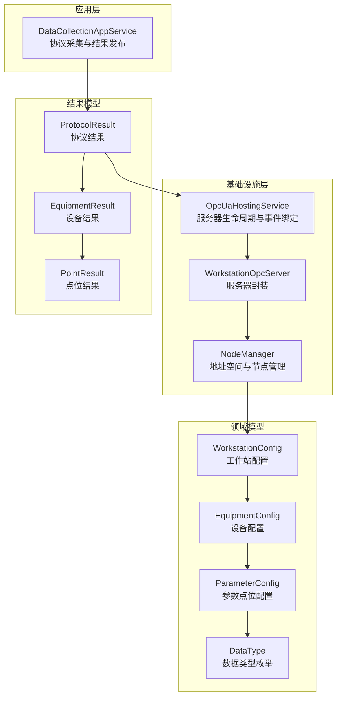
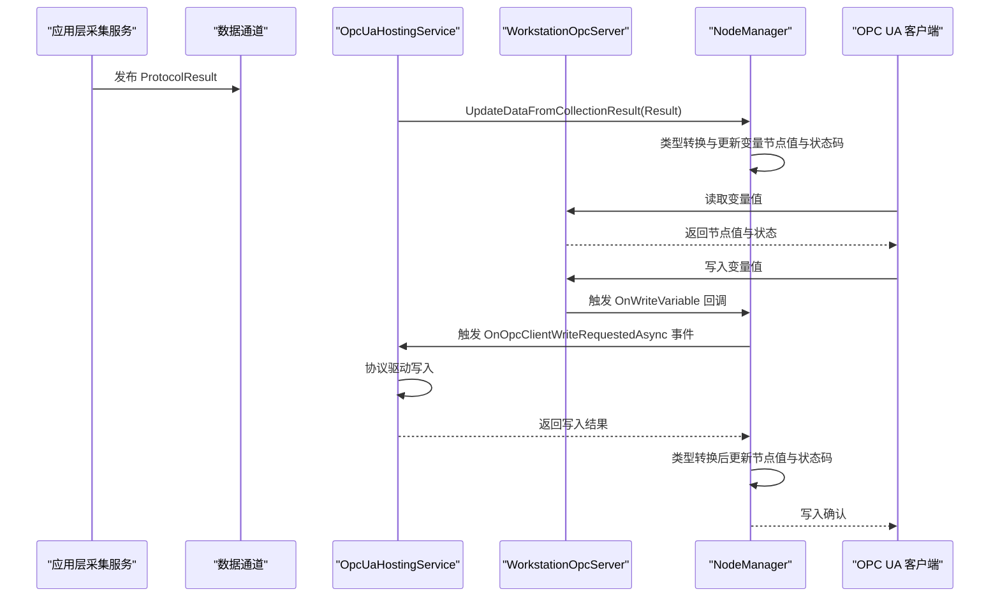
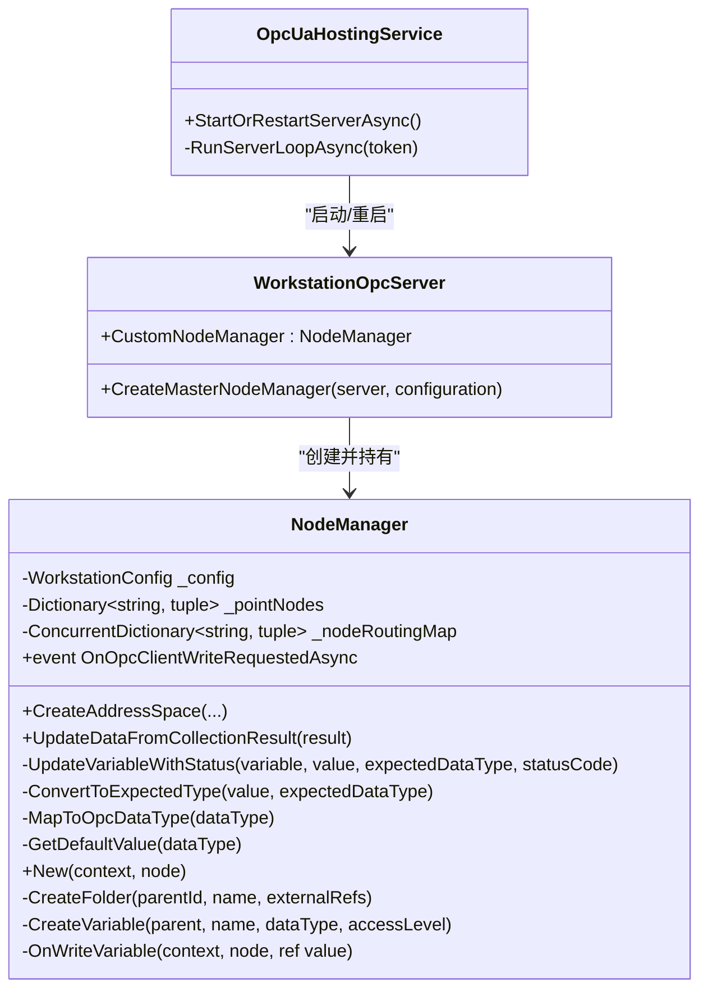
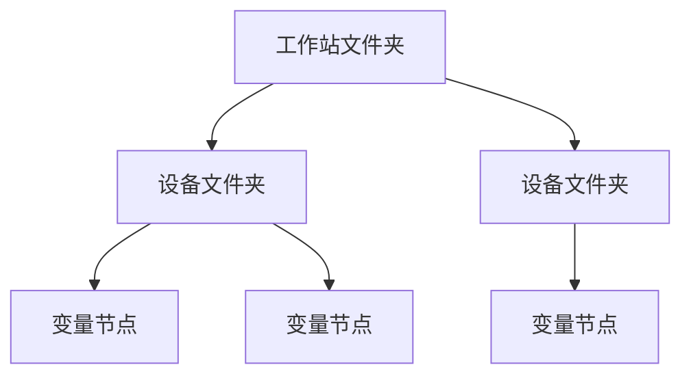
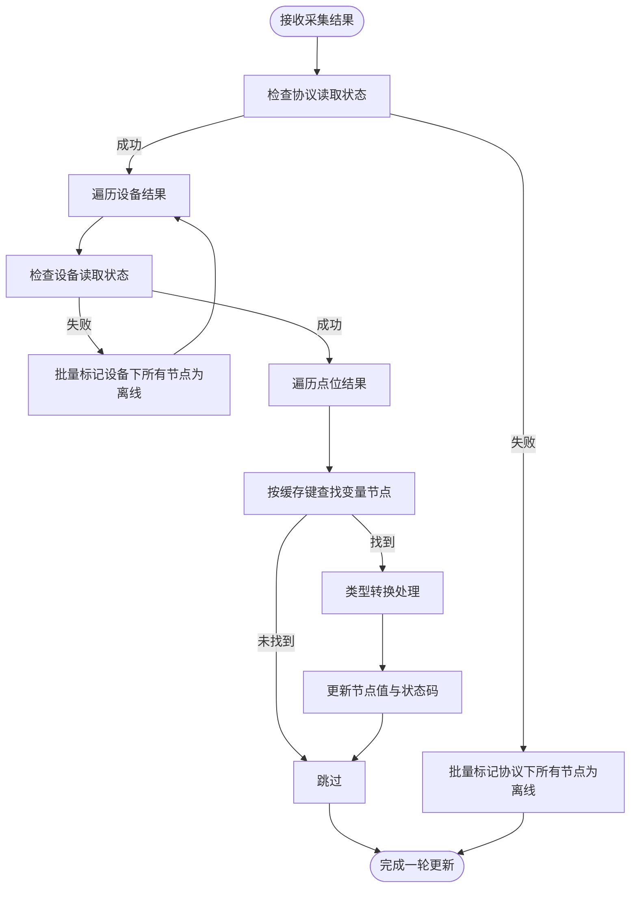
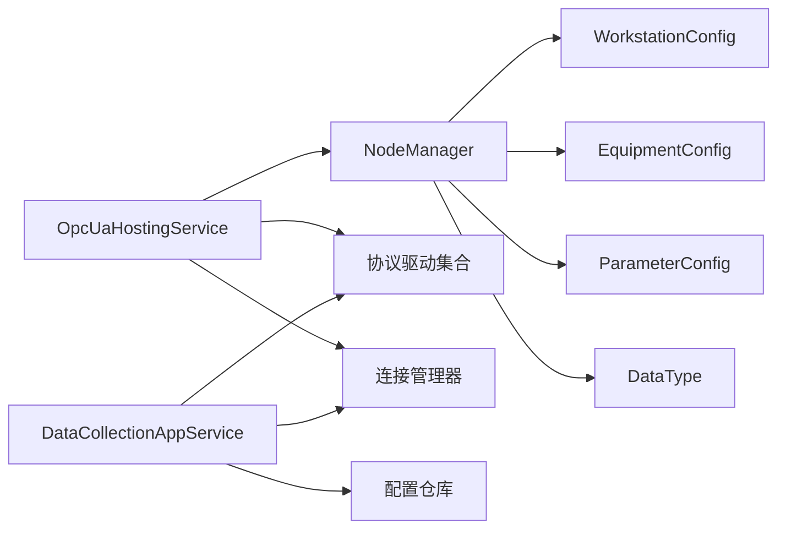

# 节点管理机制

<cite>
**本文引用的文件**
- [NodeManager.cs](file://IndustrialDataSolution/IndustrialDataProcessor.Infrastructure/OpcUa/NodeManager.cs)
- [WorkstationOpcServer.cs](file://IndustrialDataSolution/IndustrialDataProcessor.Infrastructure/OpcUa/WorkstationOpcServer.cs)
- [OpcUaHostingService.cs](file://IndustrialDataSolution/IndustrialDataProcessor.Infrastructure/BackgroundServices/OpcUaHostingService.cs)
- [DataCollectionAppService.cs](file://IndustrialDataSolution/IndustrialDataProcessor.Application/Services/DataCollectionAppService.cs)
- [WorkstationConfig.cs](file://IndustrialDataSolution/IndustrialDataProcessor.Domain/Workstation/Configs/WorkstationConfig.cs)
- [EquipmentConfig.cs](file://IndustrialDataSolution/IndustrialDataProcessor.Domain/Workstation/Configs/EquipmentConfig.cs)
- [ParameterConfig.cs](file://IndustrialDataSolution/IndustrialDataProcessor.Domain/Workstation/Configs/ParameterConfig.cs)
- [ProtocolResult.cs](file://IndustrialDataSolution/IndustrialDataProcessor.Domain/Workstation/Results/ProtocolResult.cs)
- [EquipmentResult.cs](file://IndustrialDataSolution/IndustrialDataProcessor.Domain/Workstation/Results/EquipmentResult.cs)
- [PointResult.cs](file://IndustrialDataSolution/IndustrialDataProcessor.Domain/Workstation/Results/PointResult.cs)
- [DataType.cs](file://IndustrialDataSolution/IndustrialDataProcessor.Domain/Enums/DataType.cs)
</cite>

## 更新摘要
**变更内容**
- 增强节点缓存存储机制，包含声明数据类型信息
- UpdateVariableWithStatus方法支持预期数据类型参数
- 新增ConvertToExpectedType方法提供类型转换能力
- 增强路由映射机制，支持节点ID到配置的快速查找
- 改进类型转换逻辑，防止OPC UA类型不匹配异常

## 目录
1. [简介](#简介)
2. [项目结构](#项目结构)
3. [核心组件](#核心组件)
4. [架构总览](#架构总览)
5. [详细组件分析](#详细组件分析)
6. [依赖关系分析](#依赖关系分析)
7. [性能考量](#性能考量)
8. [故障排查指南](#故障排查指南)
9. [结论](#结论)
10. [附录](#附录)

## 简介
本文件围绕工业数据处理系统中的 OPC UA 节点管理机制展开，重点剖析 NodeManager 类的设计理念与核心功能，涵盖以下方面：
- 数据节点的创建、维护与销毁流程
- 节点树结构组织（对象节点、变量节点、方法节点的管理思路）
- 节点访问控制与权限管理（读写权限、访问限制与安全策略）
- 节点数据的绑定与更新机制（实时数据推送与历史数据存储策略）
- 节点索引与查询优化（节点查找算法与性能考虑）
- **类型转换增强机制**（声明数据类型支持与类型转换能力）
- 最佳实践（命名规范、层次结构设计、错误处理）
- 具体代码示例路径（以源码路径标注代替具体代码）

## 项目结构
本项目采用分层架构，OPC UA 节点管理位于基础设施层，与应用层采集服务协同工作，形成"采集—通道—发布—OPC UA"的闭环。

**图表来源**
- [OpcUaHostingService.cs](file://IndustrialDataSolution/IndustrialDataProcessor.Infrastructure/BackgroundServices/OpcUaHostingService.cs#L101-L184)
- [WorkstationOpcServer.cs](file://IndustrialDataSolution/IndustrialDataProcessor.Infrastructure/OpcUa/WorkstationOpcServer.cs#L21-L34)
- [NodeManager.cs](file://IndustrialDataSolution/IndustrialDataProcessor.Infrastructure/OpcUa/NodeManager.cs#L36-L79)
- [WorkstationConfig.cs](file://IndustrialDataSolution/IndustrialDataProcessor.Domain/Workstation/Configs/WorkstationConfig.cs#L6-L27)
- [EquipmentConfig.cs](file://IndustrialDataSolution/IndustrialDataProcessor.Domain/Workstation/Configs/EquipmentConfig.cs#L7-L34)
- [ParameterConfig.cs](file://IndustrialDataSolution/IndustrialDataProcessor.Domain/Workstation/Configs/ParameterConfig.cs#L7-L84)
- [ProtocolResult.cs](file://IndustrialDataSolution/IndustrialDataProcessor.Domain/Workstation/Results/ProtocolResult.cs#L5-L26)
- [EquipmentResult.cs](file://IndustrialDataSolution/IndustrialDataProcessor.Domain/Workstation/Results/EquipmentResult.cs#L3-L18)
- [PointResult.cs](file://IndustrialDataSolution/IndustrialDataProcessor.Domain/Workstation/Results/PointResult.cs#L5-L15)

**章节来源**
- [OpcUaHostingService.cs](file://IndustrialDataSolution/IndustrialDataProcessor.Infrastructure/BackgroundServices/OpcUaHostingService.cs#L101-L184)
- [WorkstationOpcServer.cs](file://IndustrialDataSolution/IndustrialDataProcessor.Infrastructure/OpcUa/WorkstationOpcServer.cs#L21-L34)
- [NodeManager.cs](file://IndustrialDataSolution/IndustrialDataProcessor.Infrastructure/OpcUa/NodeManager.cs#L36-L79)

## 核心组件
- **NodeManager**：继承自 OPC UA 自定义节点管理器基类，负责创建工作站/设备/点位三层地址空间，维护变量节点缓存与路由映射，处理写入回调并将请求转发至应用层。**新增**：支持声明数据类型缓存和类型转换机制。
- **WorkstationOpcServer**：服务器封装，重写创建主节点管理器的方法，注入自定义 NodeManager。
- **OpcUaHostingService**：后台服务，负责启动/重启 OPC UA 服务器、订阅采集通道、绑定写入事件、将采集结果推送至 NodeManager。
- **DataCollectionAppService**：应用层采集服务，按协议/设备/点位循环采集，产出协议/设备/点位结果并通过通道发布。
- **配置与结果模型**：WorkstationConfig、EquipmentConfig、ParameterConfig、ProtocolResult、EquipmentResult、PointResult、DataType，构成节点树与数据流的基础。

**章节来源**
- [NodeManager.cs](file://IndustrialDataSolution/IndustrialDataProcessor.Infrastructure/OpcUa/NodeManager.cs#L10-L34)
- [WorkstationOpcServer.cs](file://IndustrialDataSolution/IndustrialDataProcessor.Infrastructure/OpcUa/WorkstationOpcServer.cs#L11-L35)
- [OpcUaHostingService.cs](file://IndustrialDataSolution/IndustrialDataProcessor.Infrastructure/BackgroundServices/OpcUaHostingService.cs#L20-L99)
- [DataCollectionAppService.cs](file://IndustrialDataSolution/IndustrialDataProcessor.Application/Services/DataCollectionAppService.cs#L22-L41)
- [WorkstationConfig.cs](file://IndustrialDataSolution/IndustrialDataProcessor.Domain/Workstation/Configs/WorkstationConfig.cs#L6-L27)
- [EquipmentConfig.cs](file://IndustrialDataSolution/IndustrialDataProcessor.Domain/Workstation/Configs/EquipmentConfig.cs#L7-L34)
- [ParameterConfig.cs](file://IndustrialDataSolution/IndustrialDataProcessor.Domain/Workstation/Configs/ParameterConfig.cs#L7-L84)
- [ProtocolResult.cs](file://IndustrialDataSolution/IndustrialDataProcessor.Domain/Workstation/Results/ProtocolResult.cs#L5-L26)
- [EquipmentResult.cs](file://IndustrialDataSolution/IndustrialDataProcessor.Domain/Workstation/Results/EquipmentResult.cs#L3-L18)
- [PointResult.cs](file://IndustrialDataSolution/IndustrialDataProcessor.Domain/Workstation/Results/PointResult.cs#L5-L15)
- [DataType.cs](file://IndustrialDataSolution/IndustrialDataProcessor.Domain/Enums/DataType.cs#L8-L69)

## 架构总览
OPC UA 节点管理遵循"配置驱动、事件驱动"的模式：
- **配置驱动**：NodeManager 根据 WorkstationConfig/EquipmentConfig/ParameterConfig 构建地址空间树。
- **事件驱动**：采集结果通过通道进入 OpcUaHostingService，由 NodeManager 更新变量节点状态；客户端写入触发回调，经 OpcUaHostingService 转发到协议驱动完成实际写入。

**图表来源**
- [OpcUaHostingService.cs](file://IndustrialDataSolution/IndustrialDataProcessor.Infrastructure/BackgroundServices/OpcUaHostingService.cs#L136-L158)
- [NodeManager.cs](file://IndustrialDataSolution/IndustrialDataProcessor.Infrastructure/OpcUa/NodeManager.cs#L341-L383)
- [NodeManager.cs](file://IndustrialDataSolution/IndustrialDataProcessor.Infrastructure/OpcUa/NodeManager.cs#L81-L127)

**章节来源**
- [OpcUaHostingService.cs](file://IndustrialDataSolution/IndustrialDataProcessor.Infrastructure/BackgroundServices/OpcUaHostingService.cs#L136-L158)
- [NodeManager.cs](file://IndustrialDataSolution/IndustrialDataProcessor.Infrastructure/OpcUa/NodeManager.cs#L341-L383)
- [NodeManager.cs](file://IndustrialDataSolution/IndustrialDataProcessor.Infrastructure/OpcUa/NodeManager.cs#L81-L127)

## 详细组件分析

### NodeManager 设计与实现
- **地址空间创建**
  - 以工作站为根文件夹，逐层创建设备文件夹，最后为每个参数点创建变量节点。
  - **增强**：使用缓存字典按"设备ID_标签"键快速定位变量节点，**新增**存储节点声明的 DataType 信息，用于类型转换。
  - 维护反向映射字典，将节点 NodeId 映射到协议/设备/参数配置，支撑写入回调路由。
- **变量节点属性**
  - 数据类型映射：根据领域 DataType 枚举映射到 OPC UA 数据类型。
  - 访问级别：设置为可读写，结合 OPC UA 的访问控制策略。
  - 历史记录：关闭历史记录，避免不必要的开销。
- **数据更新**
  - UpdateDataFromCollectionResult：按协议/设备/点位逐级更新，失败时保留旧值仅更新状态码。
  - MarkProtocolNodesAsBad/MarkEquipmentNodesAsBad：批量标记离线状态。
  - **增强**：UpdateVariableWithStatus：统一设置值、状态码、时间戳并触发订阅通知，**新增**支持预期数据类型参数进行类型转换。
- **写入回调**
  - OnWriteVariable：通过节点 NodeId 查找路由，触发应用层事件，等待异步处理结果，成功则更新节点值与状态。
- **节点 ID 生成**
  - 重写 New 方法，若未显式指定 NodeId，则使用浏览名称作为标识；同时 CreateVariable 中生成全局唯一 NodeId，避免同名冲突。
- **类型转换机制**
  - **新增**：ConvertToExpectedType 方法，专门处理值到声明数据类型的转换，防止 OPC UA 类型不匹配异常。

**图表来源**
- [NodeManager.cs](file://IndustrialDataSolution/IndustrialDataProcessor.Infrastructure/OpcUa/NodeManager.cs#L10-L34)
- [NodeManager.cs](file://IndustrialDataSolution/IndustrialDataProcessor.Infrastructure/OpcUa/NodeManager.cs#L16-L23)
- [NodeManager.cs](file://IndustrialDataSolution/IndustrialDataProcessor.Infrastructure/OpcUa/NodeManager.cs#L167-L190)
- [NodeManager.cs](file://IndustrialDataSolution/IndustrialDataProcessor.Infrastructure/OpcUa/NodeManager.cs#L395-L422)
- [WorkstationOpcServer.cs](file://IndustrialDataSolution/IndustrialDataProcessor.Infrastructure/OpcUa/WorkstationOpcServer.cs#L11-L35)
- [OpcUaHostingService.cs](file://IndustrialDataSolution/IndustrialDataProcessor.Infrastructure/BackgroundServices/OpcUaHostingService.cs#L20-L99)

**章节来源**
- [NodeManager.cs](file://IndustrialDataSolution/IndustrialDataProcessor.Infrastructure/OpcUa/NodeManager.cs#L36-L79)
- [NodeManager.cs](file://IndustrialDataSolution/IndustrialDataProcessor.Infrastructure/OpcUa/NodeManager.cs#L81-L127)
- [NodeManager.cs](file://IndustrialDataSolution/IndustrialDataProcessor.Infrastructure/OpcUa/NodeManager.cs#L16-L23)
- [NodeManager.cs](file://IndustrialDataSolution/IndustrialDataProcessor.Infrastructure/OpcUa/NodeManager.cs#L167-L190)
- [NodeManager.cs](file://IndustrialDataSolution/IndustrialDataProcessor.Infrastructure/OpcUa/NodeManager.cs#L395-L422)
- [NodeManager.cs](file://IndustrialDataSolution/IndustrialDataProcessor.Infrastructure/OpcUa/NodeManager.cs#L341-L383)
- [WorkstationOpcServer.cs](file://IndustrialDataSolution/IndustrialDataProcessor.Infrastructure/OpcUa/WorkstationOpcServer.cs#L11-L35)
- [OpcUaHostingService.cs](file://IndustrialDataSolution/IndustrialDataProcessor.Infrastructure/BackgroundServices/OpcUaHostingService.cs#L20-L99)

### 节点树结构组织
- **层级关系**
  - 根节点：工作站文件夹（名称取自 WorkstationConfig.Id）
  - 第二层：设备文件夹（名称取自 EquipmentConfig.Id）
  - 第三层：变量节点（名称取自 ParameterConfig.Label）
- **节点类型**
  - 对象节点：文件夹节点用于组织层级关系
  - 变量节点：承载实时数据，具备数据类型、访问级别、状态码等属性
  - 方法节点：当前实现未涉及，可在扩展时按需添加

**图表来源**
- [NodeManager.cs](file://IndustrialDataSolution/IndustrialDataProcessor.Infrastructure/OpcUa/NodeManager.cs#L39-L78)
- [WorkstationConfig.cs](file://IndustrialDataSolution/IndustrialDataProcessor.Domain/Workstation/Configs/WorkstationConfig.cs#L11)
- [EquipmentConfig.cs](file://IndustrialDataSolution/IndustrialDataProcessor.Domain/Workstation/Configs/EquipmentConfig.cs#L12)
- [ParameterConfig.cs](file://IndustrialDataSolution/IndustrialDataProcessor.Domain/Workstation/Configs/ParameterConfig.cs#L12)

**章节来源**
- [NodeManager.cs](file://IndustrialDataSolution/IndustrialDataProcessor.Infrastructure/OpcUa/NodeManager.cs#L39-L78)
- [WorkstationConfig.cs](file://IndustrialDataSolution/IndustrialDataProcessor.Domain/Workstation/Configs/WorkstationConfig.cs#L11)
- [EquipmentConfig.cs](file://IndustrialDataSolution/IndustrialDataProcessor.Domain/Workstation/Configs/EquipmentConfig.cs#L12)
- [ParameterConfig.cs](file://IndustrialDataSolution/IndustrialDataProcessor.Domain/Workstation/Configs/ParameterConfig.cs#L12)

### 节点访问控制与权限管理
- **访问级别**
  - 变量节点的 AccessLevel/UserAccessLevel 设置为可读写，满足 OPC UA 客户端读写需求
- **写入权限**
  - 通过 OnWriteVariable 回调进行统一拦截，结合路由映射与应用层事件实现权限校验与协议下发
- **安全策略**
  - 服务器配置中启用了证书信任与自动接受未受信任证书，便于开发测试；生产环境应收紧安全策略

**章节来源**
- [NodeManager.cs](file://IndustrialDataSolution/IndustrialDataProcessor.Infrastructure/OpcUa/NodeManager.cs#L315-L323)
- [NodeManager.cs](file://IndustrialDataSolution/IndustrialDataProcessor.Infrastructure/OpcUa/NodeManager.cs#L341-L383)
- [OpcUaHostingService.cs](file://IndustrialDataSolution/IndustrialDataProcessor.Infrastructure/BackgroundServices/OpcUaHostingService.cs#L186-L214)

### 节点数据绑定与更新机制
- **绑定机制**
  - **增强**：缓存字典：按"设备ID_标签"键缓存变量节点和声明数据类型，O(1) 快速定位
  - 路由映射：按节点 NodeId 缓存协议/设备/参数配置，写入回调时快速反查
- **更新机制**
  - UpdateDataFromCollectionResult：按协议/设备/点位逐级更新，失败保留旧值仅更新状态码
  - **增强**：UpdateVariableWithStatus：统一设置值、状态码、时间戳并触发订阅通知，**新增**支持预期数据类型参数进行类型转换
  - **新增**：ConvertToExpectedType：专门处理值到声明数据类型的转换，防止 OPC UA 类型不匹配异常
- **实时推送与历史存储**
  - 实时推送：通过通道与 NodeManager 的 UpdateDataFromCollectionResult 实现
  - 历史存储：当前实现关闭历史记录，如需历史数据可扩展历史节点或接入外部存储

**图表来源**
- [NodeManager.cs](file://IndustrialDataSolution/IndustrialDataProcessor.Infrastructure/OpcUa/NodeManager.cs#L81-L127)
- [NodeManager.cs](file://IndustrialDataSolution/IndustrialDataProcessor.Infrastructure/OpcUa/NodeManager.cs#L132-L158)
- [NodeManager.cs](file://IndustrialDataSolution/IndustrialDataProcessor.Infrastructure/OpcUa/NodeManager.cs#L167-L190)
- [NodeManager.cs](file://IndustrialDataSolution/IndustrialDataProcessor.Infrastructure/OpcUa/NodeManager.cs#L395-L422)

**章节来源**
- [NodeManager.cs](file://IndustrialDataSolution/IndustrialDataProcessor.Infrastructure/OpcUa/NodeManager.cs#L81-L127)
- [NodeManager.cs](file://IndustrialDataSolution/IndustrialDataProcessor.Infrastructure/OpcUa/NodeManager.cs#L132-L158)
- [NodeManager.cs](file://IndustrialDataSolution/IndustrialDataProcessor.Infrastructure/OpcUa/NodeManager.cs#L167-L190)
- [NodeManager.cs](file://IndustrialDataSolution/IndustrialDataProcessor.Infrastructure/OpcUa/NodeManager.cs#L395-L422)

### 节点索引与查询优化
- **索引策略**
  - **增强**：字典缓存：按"设备ID_标签"键缓存变量节点和声明数据类型，O(1) 查找
  - 路由映射：按节点 NodeId 缓存协议/设备/参数配置，写入回调时 O(1) 反查
- **查询优化**
  - 通过缓存与映射避免重复遍历配置树
  - 锁保护：在更新节点时加锁，保证线程安全
  - 状态码传播：协议/设备级失败时批量标记，减少重复计算

**章节来源**
- [NodeManager.cs](file://IndustrialDataSolution/IndustrialDataProcessor.Infrastructure/OpcUa/NodeManager.cs#L16-L23)
- [NodeManager.cs](file://IndustrialDataSolution/IndustrialDataProcessor.Infrastructure/OpcUa/NodeManager.cs#L22)
- [NodeManager.cs](file://IndustrialDataSolution/IndustrialDataProcessor.Infrastructure/OpcUa/NodeManager.cs#L85-L85)
- [NodeManager.cs](file://IndustrialDataSolution/IndustrialDataProcessor.Infrastructure/OpcUa/NodeManager.cs#L134-L140)
- [NodeManager.cs](file://IndustrialDataSolution/IndustrialDataProcessor.Infrastructure/OpcUa/NodeManager.cs#L148-L157)

### 类型转换增强机制
- **声明数据类型缓存**
  - 节点缓存现在存储 `(BaseDataVariableState Node, DataType? DeclaredDataType)` 元组，包含变量节点和其声明的数据类型
  - 在节点创建时同时存储声明数据类型，用于后续值更新时的类型转换
- **UpdateVariableWithStatus 增强**
  - 新增 `expectedDataType` 参数，支持传入参数配置中期望的原始数据类型
  - 在更新前调用 `ConvertToExpectedType` 方法进行类型转换
- **ConvertToExpectedType 实现**
  - 专门处理值到声明数据类型的转换，防止 OPC UA 类型不匹配异常
  - 支持所有 DataType 枚举值的转换，包括 Bool、Short、UShort、Int、UInt、Long、ULong、Float、Double、String
  - 转换失败时返回原值进行兜底，确保系统稳定性
- **类型转换应用场景**
  - 采集结果更新：将计算后的值转换为声明的数据类型
  - 客户端写入：将客户端输入值转换为声明的数据类型
  - 初始值设置：为节点设置符合声明类型的默认值

**章节来源**
- [NodeManager.cs](file://IndustrialDataSolution/IndustrialDataProcessor.Infrastructure/OpcUa/NodeManager.cs#L16-L17)
- [NodeManager.cs](file://IndustrialDataSolution/IndustrialDataProcessor.Infrastructure/OpcUa/NodeManager.cs#L64-L65)
- [NodeManager.cs](file://IndustrialDataSolution/IndustrialDataProcessor.Infrastructure/OpcUa/NodeManager.cs#L167-L190)
- [NodeManager.cs](file://IndustrialDataSolution/IndustrialDataProcessor.Infrastructure/OpcUa/NodeManager.cs#L395-L422)

### 最佳实践
- **命名规范**
  - 节点 ID：建议使用"设备ID_标签"格式，确保全局唯一
  - 浏览名称：使用 ParameterConfig.Label，保持与配置一致
- **层次结构设计**
  - 严格按工作站→设备→点位三层组织，便于导航与管理
  - 仅在必要时引入方法节点，避免过度复杂化
- **错误处理**
  - 写入失败时保留旧值，仅更新状态码，保证客户端显示稳定
  - 协议/设备级失败时批量标记，减少无效计算
  - **新增**：类型转换失败时返回原值，确保系统稳定性
- **性能与安全**
  - 使用缓存与映射提升查找性能
  - **新增**：类型转换缓存声明数据类型，避免重复转换
  - 生产环境收紧 OPC UA 安全策略，启用证书验证与用户认证

**章节来源**
- [NodeManager.cs](file://IndustrialDataSolution/IndustrialDataProcessor.Infrastructure/OpcUa/NodeManager.cs#L297-L300)
- [NodeManager.cs](file://IndustrialDataSolution/IndustrialDataProcessor.Infrastructure/OpcUa/NodeManager.cs#L315-L323)
- [NodeManager.cs](file://IndustrialDataSolution/IndustrialDataProcessor.Infrastructure/OpcUa/NodeManager.cs#L118-L122)
- [NodeManager.cs](file://IndustrialDataSolution/IndustrialDataProcessor.Infrastructure/OpcUa/NodeManager.cs#L89-L93)
- [NodeManager.cs](file://IndustrialDataSolution/IndustrialDataProcessor.Infrastructure/OpcUa/NodeManager.cs#L100-L103)
- [NodeManager.cs](file://IndustrialDataSolution/IndustrialDataProcessor.Infrastructure/OpcUa/NodeManager.cs#L395-L422)
- [OpcUaHostingService.cs](file://IndustrialDataSolution/IndustrialDataProcessor.Infrastructure/BackgroundServices/OpcUaHostingService.cs#L186-L214)

### 代码示例（路径）
- 创建工作站/设备/点位地址空间
  - [NodeManager.cs](file://IndustrialDataSolution/IndustrialDataProcessor.Infrastructure/OpcUa/NodeManager.cs#L36-L79)
- 更新节点值与状态码
  - [NodeManager.cs](file://IndustrialDataSolution/IndustrialDataProcessor.Infrastructure/OpcUa/NodeManager.cs#L167-L190)
- **类型转换处理**
  - [NodeManager.cs](file://IndustrialDataSolution/IndustrialDataProcessor.Infrastructure/OpcUa/NodeManager.cs#L395-L422)
- 写入回调与事件转发
  - [NodeManager.cs](file://IndustrialDataSolution/IndustrialDataProcessor.Infrastructure/OpcUa/NodeManager.cs#L341-L383)
  - [OpcUaHostingService.cs](file://IndustrialDataSolution/IndustrialDataProcessor.Infrastructure/BackgroundServices/OpcUaHostingService.cs#L136-L158)
- 服务器启动与节点管理器注入
  - [WorkstationOpcServer.cs](file://IndustrialDataSolution/IndustrialDataProcessor.Infrastructure/OpcUa/WorkstationOpcServer.cs#L21-L34)
- 采集结果发布与通道消费
  - [DataCollectionAppService.cs](file://IndustrialDataSolution/IndustrialDataProcessor.Application/Services/DataCollectionAppService.cs#L185-L198)
  - [OpcUaHostingService.cs](file://IndustrialDataSolution/IndustrialDataProcessor.Infrastructure/BackgroundServices/OpcUaHostingService.cs#L161-L174)

## 依赖关系分析
- **组件耦合**
  - NodeManager 依赖 WorkstationConfig/EquipmentConfig/ParameterConfig/DataType
  - OpcUaHostingService 依赖 NodeManager 与协议驱动集合
  - DataCollectionAppService 依赖配置仓库与驱动集合
- **外部依赖**
  - OPC UA SDK：节点管理、服务器配置与事件处理
  - 应用容器：依赖注入与后台服务生命周期管理

**图表来源**
- [NodeManager.cs](file://IndustrialDataSolution/IndustrialDataProcessor.Infrastructure/OpcUa/NodeManager.cs#L13-L13)
- [WorkstationConfig.cs](file://IndustrialDataSolution/IndustrialDataProcessor.Domain/Workstation/Configs/WorkstationConfig.cs#L6-L27)
- [EquipmentConfig.cs](file://IndustrialDataSolution/IndustrialDataProcessor.Domain/Workstation/Configs/EquipmentConfig.cs#L7-L34)
- [ParameterConfig.cs](file://IndustrialDataSolution/IndustrialDataProcessor.Domain/Workstation/Configs/ParameterConfig.cs#L7-L84)
- [DataType.cs](file://IndustrialDataSolution/IndustrialDataProcessor.Domain/Enums/DataType.cs#L8-L69)
- [OpcUaHostingService.cs](file://IndustrialDataSolution/IndustrialDataProcessor.Infrastructure/BackgroundServices/OpcUaHostingService.cs#L20-L40)
- [DataCollectionAppService.cs](file://IndustrialDataSolution/IndustrialDataProcessor.Application/Services/DataCollectionAppService.cs#L10-L18)

**章节来源**
- [NodeManager.cs](file://IndustrialDataSolution/IndustrialDataProcessor.Infrastructure/OpcUa/NodeManager.cs#L13-L13)
- [WorkstationConfig.cs](file://IndustrialDataSolution/IndustrialDataProcessor.Domain/Workstation/Configs/WorkstationConfig.cs#L6-L27)
- [EquipmentConfig.cs](file://IndustrialDataSolution/IndustrialDataProcessor.Domain/Workstation/Configs/EquipmentConfig.cs#L7-L34)
- [ParameterConfig.cs](file://IndustrialDataSolution/IndustrialDataProcessor.Domain/Workstation/Configs/ParameterConfig.cs#L7-L84)
- [DataType.cs](file://IndustrialDataSolution/IndustrialDataProcessor.Domain/Enums/DataType.cs#L8-L69)
- [OpcUaHostingService.cs](file://IndustrialDataSolution/IndustrialDataProcessor.Infrastructure/BackgroundServices/OpcUaHostingService.cs#L20-L40)
- [DataCollectionAppService.cs](file://IndustrialDataSolution/IndustrialDataProcessor.Application/Services/DataCollectionAppService.cs#L10-L18)

## 性能考量
- **查找性能**
  - 使用字典缓存与并发字典映射，实现 O(1) 查找
  - **新增**：声明数据类型缓存避免重复转换
- **更新性能**
  - 批量标记离线状态，减少重复计算
  - 锁粒度控制在节点更新范围内，避免长时间阻塞
  - **新增**：类型转换优化，仅在必要时进行转换
- **内存占用**
  - 仅缓存变量节点、声明数据类型与路由映射，避免冗余对象
  - **新增**：类型转换结果缓存
- **线程安全**
  - 在更新节点时加锁，确保多线程环境下一致性
  - **新增**：类型转换过程中的异常处理

## 故障排查指南
- **写入失败**
  - 检查 OnWriteVariable 回调是否正确触发事件
  - 确认应用层事件处理是否返回成功状态
  - 查看状态码与错误信息，定位底层写入问题
- **节点值为空**
  - 确认初始值设置与数据类型映射
  - 检查 UpdateDataFromCollectionResult 是否被调用
- **类型转换异常**
  - **新增**：检查参数配置中的 DataType 设置是否正确
  - **新增**：确认 ConvertToExpectedType 方法的转换逻辑
  - **新增**：验证声明数据类型与实际值的兼容性
- **服务器启动异常**
  - 检查证书配置与安全策略
  - 确认端口占用与网络可达性

**章节来源**
- [NodeManager.cs](file://IndustrialDataSolution/IndustrialDataProcessor.Infrastructure/OpcUa/NodeManager.cs#L341-L383)
- [NodeManager.cs](file://IndustrialDataSolution/IndustrialDataProcessor.Infrastructure/OpcUa/NodeManager.cs#L73-L75)
- [NodeManager.cs](file://IndustrialDataSolution/IndustrialDataProcessor.Infrastructure/OpcUa/NodeManager.cs#L395-L422)
- [OpcUaHostingService.cs](file://IndustrialDataSolution/IndustrialDataProcessor.Infrastructure/BackgroundServices/OpcUaHostingService.cs#L186-L214)

## 结论
NodeManager 通过配置驱动的地址空间创建、高效的节点缓存与路由映射、严格的写入回调与状态管理，实现了工业场景下 OPC UA 节点的可靠管理。**本次更新增强了类型转换机制**，通过声明数据类型缓存和 ConvertToExpectedType 方法，提供了更好的类型转换能力，防止 OPC UA 类型不匹配异常。结合应用层采集服务与后台托管，形成了从采集到发布的完整链路。建议在生产环境中进一步强化安全策略与错误恢复能力，并根据业务需求扩展历史数据存储与方法节点支持。

## 附录
- 相关结果模型用于理解数据流向与状态传播
  - [ProtocolResult.cs](file://IndustrialDataSolution/IndustrialDataProcessor.Domain/Workstation/Results/ProtocolResult.cs#L5-L26)
  - [EquipmentResult.cs](file://IndustrialDataSolution/IndustrialDataProcessor.Domain/Workstation/Results/EquipmentResult.cs#L3-L18)
  - [PointResult.cs](file://IndustrialDataSolution/IndustrialDataProcessor.Domain/Workstation/Results/PointResult.cs#L5-L15)