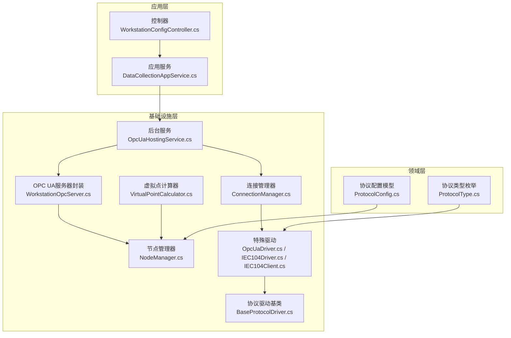
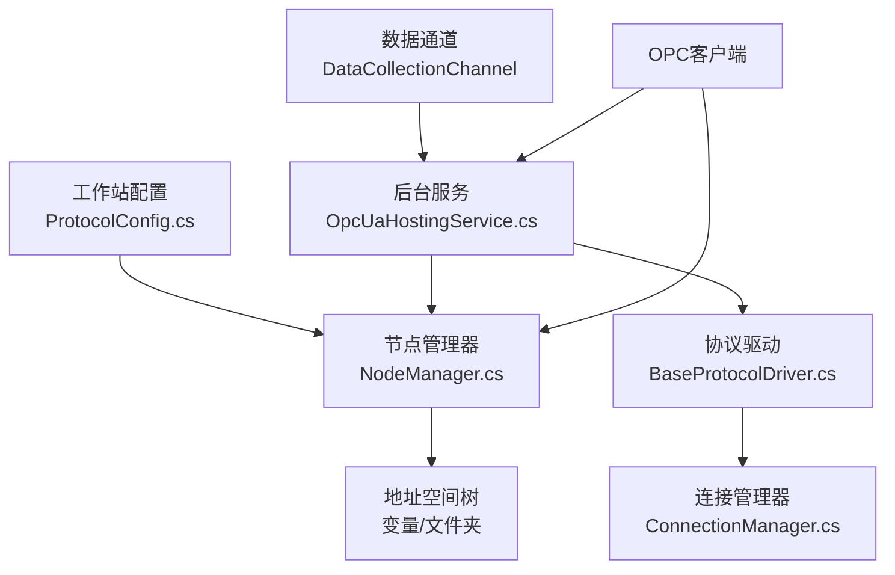
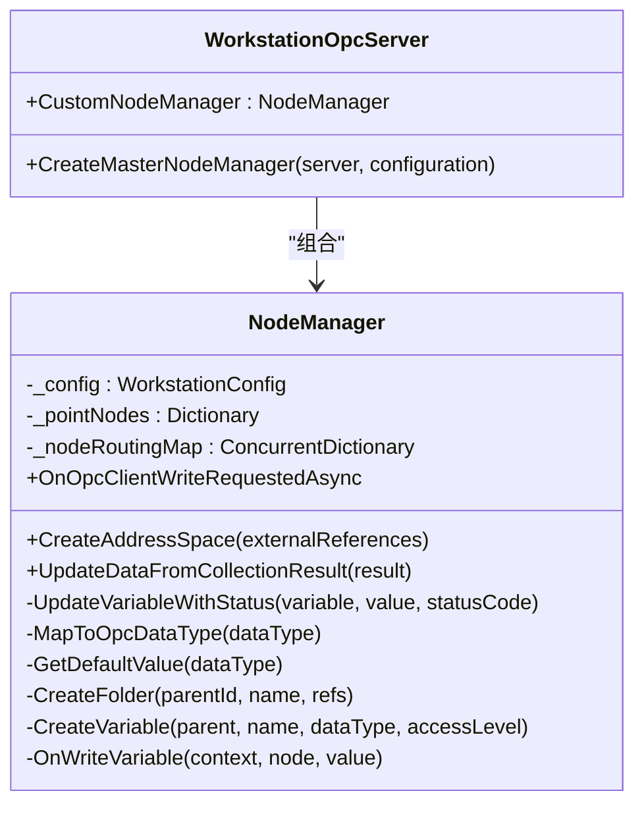
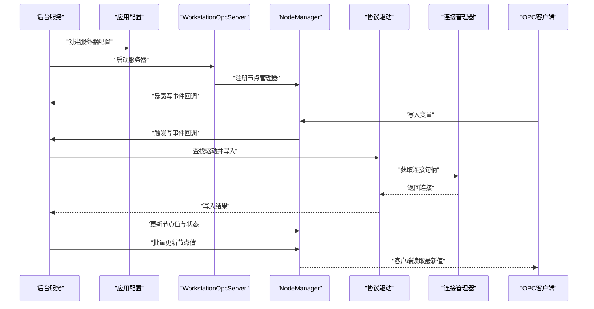
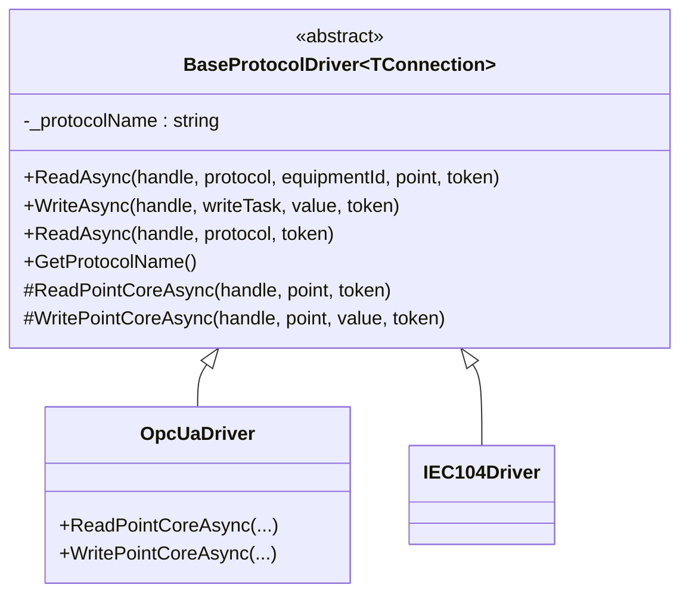
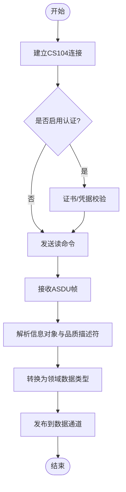
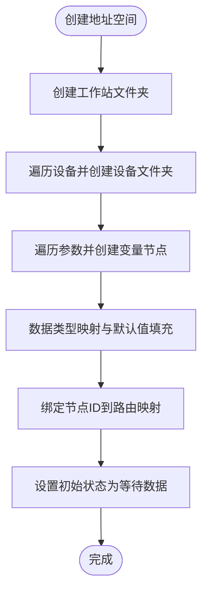
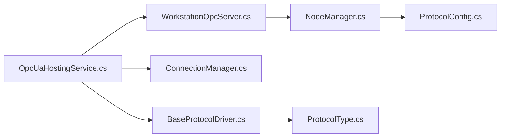

# OPC UA特殊协议

<cite>
**本文档引用的文件**
- [OpcUaDriver.cs](file://IndustrialDataSolution/IndustrialDataProcessor.Infrastructure/Communication/Drivers/TcpSpecial/OpcUaDriver.cs)
- [NodeManager.cs](file://IndustrialDataSolution/IndustrialDataProcessor.Infrastructure/OpcUa/NodeManager.cs)
- [WorkstationOpcServer.cs](file://IndustrialDataSolution/IndustrialDataProcessor.Infrastructure/OpcUa/WorkstationOpcServer.cs)
- [OpcUaHostingService.cs](file://IndustrialDataSolution/IndustrialDataProcessor.Infrastructure/BackgroundServices/OpcUaHostingService.cs)
- [BaseProtocolDriver.cs](file://IndustrialDataSolution/IndustrialDataProcessor.Infrastructure/Communication/Drivers/TcpCommon/BaseProtocolDriver.cs)
- [ProtocolType.cs](file://IndustrialDataSolution/IndustrialDataProcessor.Domain/Enums/ProtocolType.cs)
- [ProtocolConfig.cs](file://IndustrialDataSolution/IndustrialDataProcessor.Domain/Workstation/Configs/ProtocolConfig.cs)
- [IEC104Client.cs](file://IndustrialDataSolution/IndustrialDataProcessor.Infrastructure/Communication/Drivers/TcpSpecial/IEC104Client.cs)
- [IEC104Driver.cs](file://IndustrialDataSolution/IndustrialDataProcessor.Infrastructure/Communication/Drivers/TcpSpecial/IEC104Driver.cs)
- [VirtualPointCalculator.cs](file://IndustrialDataSolution/IndustrialDataProcessor.Infrastructure/EquipmentCollectionDataProcessing/VirtualPointCalculator.cs)
- [ConnectionManager.cs](file://IndustrialDataSolution/IndustrialDataProcessor.Infrastructure/Communication/Connection/ConnectionManager.cs)
- [IOpcUaServer.cs](file://IndustrialDataSolution/IndustrialDataProcessor.Application/OpcUa/IOpcUaServer.cs)
</cite>

## 目录
1. [简介](#简介)
2. [项目结构](#项目结构)
3. [核心组件](#核心组件)
4. [架构总览](#架构总览)
5. [详细组件分析](#详细组件分析)
6. [依赖关系分析](#依赖关系分析)
7. [性能考虑](#性能考虑)
8. [故障排查指南](#故障排查指南)
9. [结论](#结论)
10. [附录](#附录)

## 简介
本文件面向OPC UA特殊协议的实现与扩展，系统性阐述以下内容：
- 工业标准OPC UA的节点模型、地址空间与安全机制在本项目中的落地方式
- IEC 104协议的实现现状与扩展路径（含规约格式、通信流程与数据编码）
- 特殊协议驱动的设计模式与扩展机制（基于抽象基类与接口契约）
- 协议与标准OPC UA服务器的集成方式（服务器封装、节点管理、写事件回调）
- 协议配置与调试的实用指南
- 性能调优与故障诊断方法

## 项目结构
本项目采用分层与领域驱动设计，围绕“工作站配置—协议驱动—连接管理—数据采集—OPC UA服务器”的链路组织代码。与OPC UA特殊协议相关的核心目录如下：
- 工业数据处理应用层：控制器、行为、DTO、命令与事件等
- 工业数据处理基础设施层：后台服务、通信驱动、OPC UA节点管理、数据处理与序列化
- 工业数据处理领域层：实体、枚举、配置模型、异常与工具
- 工业数据处理共享层：异常与公共能力

**图表来源**
- [OpcUaHostingService.cs](file://IndustrialDataSolution/IndustrialDataProcessor.Infrastructure/BackgroundServices/OpcUaHostingService.cs#L1-L228)
- [WorkstationOpcServer.cs](file://IndustrialDataSolution/IndustrialDataProcessor.Infrastructure/OpcUa/WorkstationOpcServer.cs#L1-L36)
- [NodeManager.cs](file://IndustrialDataSolution/IndustrialDataProcessor.Infrastructure/OpcUa/NodeManager.cs#L1-L417)
- [BaseProtocolDriver.cs](file://IndustrialDataSolution/IndustrialDataProcessor.Infrastructure/Communication/Drivers/TcpCommon/BaseProtocolDriver.cs#L1-L108)
- [OpcUaDriver.cs](file://IndustrialDataSolution/IndustrialDataProcessor.Infrastructure/Communication/Drivers/TcpSpecial/OpcUaDriver.cs#L1-L21)
- [IEC104Driver.cs](file://IndustrialDataSolution/IndustrialDataProcessor.Infrastructure/Communication/Drivers/TcpSpecial/IEC104Driver.cs#L1-L6)
- [IEC104Client.cs](file://IndustrialDataSolution/IndustrialDataProcessor.Infrastructure/Communication/Drivers/TcpSpecial/IEC104Client.cs#L1-L16)
- [ConnectionManager.cs](file://IndustrialDataSolution/IndustrialDataProcessor.Infrastructure/Communication/Connection/ConnectionManager.cs#L262-L308)
- [VirtualPointCalculator.cs](file://IndustrialDataSolution/IndustrialDataProcessor.Infrastructure/EquipmentCollectionDataProcessing/VirtualPointCalculator.cs#L1-L50)
- [ProtocolType.cs](file://IndustrialDataSolution/IndustrialDataProcessor.Domain/Enums/ProtocolType.cs#L1-L231)
- [ProtocolConfig.cs](file://IndustrialDataSolution/IndustrialDataProcessor.Domain/Workstation/Configs/ProtocolConfig.cs#L1-L64)

**章节来源**
- [OpcUaHostingService.cs](file://IndustrialDataSolution/IndustrialDataProcessor.Infrastructure/BackgroundServices/OpcUaHostingService.cs#L1-L228)
- [WorkstationOpcServer.cs](file://IndustrialDataSolution/IndustrialDataProcessor.Infrastructure/OpcUa/WorkstationOpcServer.cs#L1-L36)
- [NodeManager.cs](file://IndustrialDataSolution/IndustrialDataProcessor.Infrastructure/OpcUa/NodeManager.cs#L1-L417)
- [BaseProtocolDriver.cs](file://IndustrialDataSolution/IndustrialDataProcessor.Infrastructure/Communication/Drivers/TcpCommon/BaseProtocolDriver.cs#L1-L108)
- [OpcUaDriver.cs](file://IndustrialDataSolution/IndustrialDataProcessor.Infrastructure/Communication/Drivers/TcpSpecial/OpcUaDriver.cs#L1-L21)
- [IEC104Driver.cs](file://IndustrialDataSolution/IndustrialDataProcessor.Infrastructure/Communication/Drivers/TcpSpecial/IEC104Driver.cs#L1-L6)
- [IEC104Client.cs](file://IndustrialDataSolution/IndustrialDataProcessor.Infrastructure/Communication/Drivers/TcpSpecial/IEC104Client.cs#L1-L16)
- [ConnectionManager.cs](file://IndustrialDataSolution/IndustrialDataProcessor.Infrastructure/Communication/Connection/ConnectionManager.cs#L262-L308)
- [VirtualPointCalculator.cs](file://IndustrialDataSolution/IndustrialDataProcessor.Infrastructure/EquipmentCollectionDataProcessing/VirtualPointCalculator.cs#L1-L50)
- [ProtocolType.cs](file://IndustrialDataSolution/IndustrialDataProcessor.Domain/Enums/ProtocolType.cs#L1-L231)
- [ProtocolConfig.cs](file://IndustrialDataSolution/IndustrialDataProcessor.Domain/Workstation/Configs/ProtocolConfig.cs#L1-L64)

## 核心组件
- OPC UA服务器封装：负责创建与启动标准服务器实例，注入自定义节点管理器，统一管理地址空间与安全策略。
- 节点管理器：根据工作站配置动态创建地址空间树，维护变量节点、状态码与路由映射；支持写事件回调与批量数据更新。
- 后台服务：启动/重启OPC UA服务器，订阅数据通道，将采集结果更新至OPC UA节点；同时响应OPC客户端写请求，反推业务值并下发到设备。
- 协议驱动基类：提供统一的读写流程编排、并发锁与异常包装，子类聚焦具体协议的读写实现。
- 特殊协议驱动：包含IEC 104与OPC UA专用驱动占位，为未来扩展提供清晰的接口与命名约定。

**章节来源**
- [WorkstationOpcServer.cs](file://IndustrialDataSolution/IndustrialDataProcessor.Infrastructure/OpcUa/WorkstationOpcServer.cs#L1-L36)
- [NodeManager.cs](file://IndustrialDataSolution/IndustrialDataProcessor.Infrastructure/OpcUa/NodeManager.cs#L1-L417)
- [OpcUaHostingService.cs](file://IndustrialDataSolution/IndustrialDataProcessor.Infrastructure/BackgroundServices/OpcUaHostingService.cs#L1-L228)
- [BaseProtocolDriver.cs](file://IndustrialDataSolution/IndustrialDataProcessor.Infrastructure/Communication/Drivers/TcpCommon/BaseProtocolDriver.cs#L1-L108)
- [OpcUaDriver.cs](file://IndustrialDataSolution/IndustrialDataProcessor.Infrastructure/Communication/Drivers/TcpSpecial/OpcUaDriver.cs#L1-L21)
- [IEC104Driver.cs](file://IndustrialDataSolution/IndustrialDataProcessor.Infrastructure/Communication/Drivers/TcpSpecial/IEC104Driver.cs#L1-L6)

## 架构总览
OPC UA特殊协议的实现遵循“配置驱动—地址空间生成—数据采集—OPC UA发布—客户端交互”的闭环。系统通过后台服务拉起服务器，节点管理器依据配置生成地址空间，采集线程将结果写入节点，OPC客户端可读写节点，写事件通过驱动链路下发到设备。

**图表来源**
- [ProtocolConfig.cs](file://IndustrialDataSolution/IndustrialDataProcessor.Domain/Workstation/Configs/ProtocolConfig.cs#L1-L64)
- [NodeManager.cs](file://IndustrialDataSolution/IndustrialDataProcessor.Infrastructure/OpcUa/NodeManager.cs#L1-L417)
- [OpcUaHostingService.cs](file://IndustrialDataSolution/IndustrialDataProcessor.Infrastructure/BackgroundServices/OpcUaHostingService.cs#L1-L228)
- [BaseProtocolDriver.cs](file://IndustrialDataSolution/IndustrialDataProcessor.Infrastructure/Communication/Drivers/TcpCommon/BaseProtocolDriver.cs#L1-L108)
- [ConnectionManager.cs](file://IndustrialDataSolution/IndustrialDataProcessor.Infrastructure/Communication/Connection/ConnectionManager.cs#L262-L308)

## 详细组件分析

### OPC UA服务器与节点管理
- 服务器封装：继承标准服务器，重写节点管理器创建流程，注入自定义节点管理器，统一调度多节点管理器。
- 节点管理器：
  - 动态创建工作站/设备/参数三层地址空间，变量节点具备访问级别与数据类型映射。
  - 维护“节点ID→协议/设备/参数”的路由映射，写事件回调中通过该映射定位业务点位。
  - 提供批量更新方法，按协议/设备/点位粒度更新值与状态码，支持初始值与等待状态。
  - 数据类型转换与默认值填充，避免OPC UA变体构建异常。

**图表来源**
- [WorkstationOpcServer.cs](file://IndustrialDataSolution/IndustrialDataProcessor.Infrastructure/OpcUa/WorkstationOpcServer.cs#L1-L36)
- [NodeManager.cs](file://IndustrialDataSolution/IndustrialDataProcessor.Infrastructure/OpcUa/NodeManager.cs#L1-L417)

**章节来源**
- [WorkstationOpcServer.cs](file://IndustrialDataSolution/IndustrialDataProcessor.Infrastructure/OpcUa/WorkstationOpcServer.cs#L1-L36)
- [NodeManager.cs](file://IndustrialDataSolution/IndustrialDataProcessor.Infrastructure/OpcUa/NodeManager.cs#L1-L417)

### 后台服务与数据流
- 启动/重启：后台服务负责加载最新工作站配置，创建应用配置与证书，启动服务器；支持并发重启互斥。
- 写事件处理：订阅节点写事件，查找对应协议驱动，获取连接句柄，反推业务值后调用驱动写入。
- 数据更新：从数据通道读取采集结果，调用节点管理器批量更新节点值与状态码。

**图表来源**
- [OpcUaHostingService.cs](file://IndustrialDataSolution/IndustrialDataProcessor.Infrastructure/BackgroundServices/OpcUaHostingService.cs#L1-L228)
- [NodeManager.cs](file://IndustrialDataSolution/IndustrialDataProcessor.Infrastructure/OpcUa/NodeManager.cs#L1-L417)

**章节来源**
- [OpcUaHostingService.cs](file://IndustrialDataSolution/IndustrialDataProcessor.Infrastructure/BackgroundServices/OpcUaHostingService.cs#L1-L228)
- [NodeManager.cs](file://IndustrialDataSolution/IndustrialDataProcessor.Infrastructure/OpcUa/NodeManager.cs#L1-L417)

### 协议驱动基类与扩展机制
- 抽象基类提供统一的读写流程：获取通道锁、异常包装、默认不支持整包读取等。
- 子类需实现单点读写核心逻辑；对于特殊协议（如IEC 104、OPC UA专用），通过占位类预留扩展点。
- 协议类型枚举定义了协议分类与接口类型约束，确保协议与接口匹配。

**图表来源**
- [BaseProtocolDriver.cs](file://IndustrialDataSolution/IndustrialDataProcessor.Infrastructure/Communication/Drivers/TcpCommon/BaseProtocolDriver.cs#L1-L108)
- [OpcUaDriver.cs](file://IndustrialDataSolution/IndustrialDataProcessor.Infrastructure/Communication/Drivers/TcpSpecial/OpcUaDriver.cs#L1-L21)
- [IEC104Driver.cs](file://IndustrialDataSolution/IndustrialDataProcessor.Infrastructure/Communication/Drivers/TcpSpecial/IEC104Driver.cs#L1-L6)

**章节来源**
- [BaseProtocolDriver.cs](file://IndustrialDataSolution/IndustrialDataProcessor.Infrastructure/Communication/Drivers/TcpCommon/BaseProtocolDriver.cs#L1-L108)
- [OpcUaDriver.cs](file://IndustrialDataSolution/IndustrialDataProcessor.Infrastructure/Communication/Drivers/TcpSpecial/OpcUaDriver.cs#L1-L21)
- [IEC104Driver.cs](file://IndustrialDataSolution/IndustrialDataProcessor.Infrastructure/Communication/Drivers/TcpSpecial/IEC104Driver.cs#L1-L6)
- [ProtocolType.cs](file://IndustrialDataSolution/IndustrialDataProcessor.Domain/Enums/ProtocolType.cs#L1-L231)

### IEC 104协议实现现状与扩展路径
- 现状：IEC 104驱动与客户端类处于占位状态，尚未实现具体读写逻辑。
- 扩展建议：
  - 客户端：基于CS104库建立连接、处理ASDU、实现读写序列控制与确认机制。
  - 驱动：实现读写核心方法，完成地址映射、数据类型转换与异常处理。
  - 规约格式：遵循IEC 60870-5-101/104的应用服务数据单元（ASDU）规范，定义信息对象地址与限定词。
  - 通信流程：建立连接→身份认证（若启用）→读取遥测/遥信→写命令（选择/激活/取消）→确认与状态反馈。
  - 数据编码：遥测量采用归一化值/短浮点，品质描述符承载状态信息；遥信采用双点遥信或单点遥信。

**图表来源**
- [IEC104Client.cs](file://IndustrialDataSolution/IndustrialDataProcessor.Infrastructure/Communication/Drivers/TcpSpecial/IEC104Client.cs#L1-L16)
- [IEC104Driver.cs](file://IndustrialDataSolution/IndustrialDataProcessor.Infrastructure/Communication/Drivers/TcpSpecial/IEC104Driver.cs#L1-L6)

**章节来源**
- [IEC104Client.cs](file://IndustrialDataSolution/IndustrialDataProcessor.Infrastructure/Communication/Drivers/TcpSpecial/IEC104Client.cs#L1-L16)
- [IEC104Driver.cs](file://IndustrialDataSolution/IndustrialDataProcessor.Infrastructure/Communication/Drivers/TcpSpecial/IEC104Driver.cs#L1-L6)
- [ProtocolType.cs](file://IndustrialDataSolution/IndustrialDataProcessor.Domain/Enums/ProtocolType.cs#L117-L122)

### 地址空间与节点模型
- 结构层次：工作站文件夹 → 设备文件夹 → 参数变量（叶子节点）
- 节点标识：使用全局唯一标识（设备ID+参数标签）避免同名冲突
- 数据类型映射：将领域数据类型映射到OPC UA标准数据类型
- 初始值与状态：首次加载时设置默认值与等待初始数据状态，失败时设置相应状态码
- 写事件：通过路由映射定位业务点位，触发应用层写入并回写节点值

**图表来源**
- [NodeManager.cs](file://IndustrialDataSolution/IndustrialDataProcessor.Infrastructure/OpcUa/NodeManager.cs#L36-L79)

**章节来源**
- [NodeManager.cs](file://IndustrialDataSolution/IndustrialDataProcessor.Infrastructure/OpcUa/NodeManager.cs#L36-L79)

### 安全机制与证书配置
- 服务器证书：应用证书、受信任对等方与发行者证书存储于本地目录
- 安全策略：示例配置中使用无加密安全模式，匿名用户令牌策略
- 客户端证书：连接管理器提供证书验证与自动接受不受信任证书的选项
- 建议：生产环境启用TLS与用户身份认证，限制证书存储路径权限

**章节来源**
- [OpcUaHostingService.cs](file://IndustrialDataSolution/IndustrialDataProcessor.Infrastructure/BackgroundServices/OpcUaHostingService.cs#L186-L214)
- [ConnectionManager.cs](file://IndustrialDataSolution/IndustrialDataProcessor.Infrastructure/Communication/Connection/ConnectionManager.cs#L262-L308)

### 协议与标准OPC UA服务器的集成
- 服务器启动：后台服务加载配置并启动WorkstationOpcServer
- 节点管理：NodeManager根据工作站配置生成地址空间
- 写事件：OPC客户端写入触发回调，应用层通过驱动下发到设备
- 数据发布：采集线程将结果写入节点，客户端订阅获取最新值

**章节来源**
- [OpcUaHostingService.cs](file://IndustrialDataSolution/IndustrialDataProcessor.Infrastructure/BackgroundServices/OpcUaHostingService.cs#L101-L184)
- [NodeManager.cs](file://IndustrialDataSolution/IndustrialDataProcessor.Infrastructure/OpcUa/NodeManager.cs#L334-L383)

## 依赖关系分析
- 组件耦合：
  - 后台服务依赖节点管理器与连接管理器，耦合度适中
  - 节点管理器依赖工作站配置与数据类型映射，职责清晰
  - 协议驱动依赖连接句柄与写任务，遵循接口契约
- 外部依赖：
  - OPC UA SDK（标准服务器与节点管理器）
  - IEC 104客户端库（待实现）
  - 证书存储与验证

**图表来源**
- [OpcUaHostingService.cs](file://IndustrialDataSolution/IndustrialDataProcessor.Infrastructure/BackgroundServices/OpcUaHostingService.cs#L1-L228)
- [WorkstationOpcServer.cs](file://IndustrialDataSolution/IndustrialDataProcessor.Infrastructure/OpcUa/WorkstationOpcServer.cs#L1-L36)
- [NodeManager.cs](file://IndustrialDataSolution/IndustrialDataProcessor.Infrastructure/OpcUa/NodeManager.cs#L1-L417)
- [ConnectionManager.cs](file://IndustrialDataSolution/IndustrialDataProcessor.Infrastructure/Communication/Connection/ConnectionManager.cs#L262-L308)
- [BaseProtocolDriver.cs](file://IndustrialDataSolution/IndustrialDataProcessor.Infrastructure/Communication/Drivers/TcpCommon/BaseProtocolDriver.cs#L1-L108)
- [ProtocolConfig.cs](file://IndustrialDataSolution/IndustrialDataProcessor.Domain/Workstation/Configs/ProtocolConfig.cs#L1-L64)
- [ProtocolType.cs](file://IndustrialDataSolution/IndustrialDataProcessor.Domain/Enums/ProtocolType.cs#L1-L231)

**章节来源**
- [OpcUaHostingService.cs](file://IndustrialDataSolution/IndustrialDataProcessor.Infrastructure/BackgroundServices/OpcUaHostingService.cs#L1-L228)
- [NodeManager.cs](file://IndustrialDataSolution/IndustrialDataProcessor.Infrastructure/OpcUa/NodeManager.cs#L1-L417)
- [BaseProtocolDriver.cs](file://IndustrialDataSolution/IndustrialDataProcessor.Infrastructure/Communication/Drivers/TcpCommon/BaseProtocolDriver.cs#L1-L108)
- [ProtocolConfig.cs](file://IndustrialDataSolution/IndustrialDataProcessor.Domain/Workstation/Configs/ProtocolConfig.cs#L1-L64)
- [ProtocolType.cs](file://IndustrialDataSolution/IndustrialDataProcessor.Domain/Enums/ProtocolType.cs#L1-L231)

## 性能考虑
- 并发与锁：协议驱动在读写前获取通道锁，避免同一通道并发冲突；节点更新加锁保证线程安全。
- 批量更新：后台服务按采集批次批量更新节点，减少频繁触发订阅通知。
- 数据类型转换：在节点更新前进行类型转换与默认值填充，降低客户端读取异常概率。
- 超时与重试：协议配置提供连接/接收/通信延迟参数，结合异常处理提升稳定性。
- 虚拟点计算：表达式计算与变量解析分离，避免重复解析开销。

**章节来源**
- [BaseProtocolDriver.cs](file://IndustrialDataSolution/IndustrialDataProcessor.Infrastructure/Communication/Drivers/TcpCommon/BaseProtocolDriver.cs#L26-L72)
- [NodeManager.cs](file://IndustrialDataSolution/IndustrialDataProcessor.Infrastructure/OpcUa/NodeManager.cs#L81-L127)
- [VirtualPointCalculator.cs](file://IndustrialDataSolution/IndustrialDataProcessor.Infrastructure/EquipmentCollectionDataProcessing/VirtualPointCalculator.cs#L16-L34)

## 故障排查指南
- 证书问题：
  - 症状：启动失败或握手异常
  - 排查：检查证书存储路径、应用证书是否存在、受信任证书链是否完整
- 写事件失败：
  - 症状：客户端写入无响应或返回错误
  - 排查：确认路由映射是否存在、驱动是否可用、底层写入是否成功
- 节点值为空或类型不匹配：
  - 症状：客户端读取为空或类型转换异常
  - 排查：检查默认值填充、数据类型映射、表达式计算结果
- 通信超时：
  - 症状：读写超时或连接失败
  - 排查：调整连接/接收超时参数、检查网络连通性与防火墙策略
- 日志定位：
  - 后台服务与节点管理器均提供错误日志记录，优先查看最近错误堆栈

**章节来源**
- [OpcUaHostingService.cs](file://IndustrialDataSolution/IndustrialDataProcessor.Infrastructure/BackgroundServices/OpcUaHostingService.cs#L170-L183)
- [NodeManager.cs](file://IndustrialDataSolution/IndustrialDataProcessor.Infrastructure/OpcUa/NodeManager.cs#L379-L383)

## 结论
本项目以清晰的分层与接口契约实现了OPC UA服务器与地址空间管理，并通过协议驱动基类提供了良好的扩展性。IEC 104协议目前处于占位阶段，建议按照CS104标准实现客户端与驱动，完善读写流程与数据编码。通过批量更新、类型转换与并发锁等机制，系统在性能与稳定性方面具备良好基础。建议在生产环境中启用TLS与身份认证，并持续优化表达式计算与异常处理。

## 附录
- 协议配置要点：
  - 协议类型与接口类型匹配（参见协议枚举）
  - 设备与参数的采集开关、数据类型与地址配置
  - 通信超时与延时参数根据现场条件调整
- 调试建议：
  - 开启详细日志，关注写事件回调与节点更新
  - 使用OPC UA客户端工具验证地址空间与读写行为
  - 对比表达式计算结果与预期值，逐步定位问题

**章节来源**
- [ProtocolType.cs](file://IndustrialDataSolution/IndustrialDataProcessor.Domain/Enums/ProtocolType.cs#L1-L231)
- [ProtocolConfig.cs](file://IndustrialDataSolution/IndustrialDataProcessor.Domain/Workstation/Configs/ProtocolConfig.cs#L1-L64)
- [VirtualPointCalculator.cs](file://IndustrialDataSolution/IndustrialDataProcessor.Infrastructure/EquipmentCollectionDataProcessing/VirtualPointCalculator.cs#L1-L50)