# TCP通用协议

<cite>
**本文引用的文件**
- [BaseProtocolDriver.cs](file://IndustrialDataProcessor.Infrastructure/Communication/Drivers/TcpCommon/BaseProtocolDriver.cs)
- [ModbusRtuOverTcpDriver.cs](file://IndustrialDataProcessor.Infrastructure/Communication/Drivers/TcpCommon/ModbusRtuOverTcpDriver.cs)
- [ModbusTcpNetDriver.cs](file://IndustrialDataProcessor.Infrastructure/Communication/Drivers/TcpCommon/ModbusTcpNetDriver.cs)
- [DLT6452007OverTcp.cs](file://IndustrialDataProcessor.Infrastructure/Communication/Drivers/TcpCommon/DLT6452007OverTcp.cs)
- [CJT1882004OverTcpDriver.cs](file://IndustrialDataProcessor.Infrastructure/Communication/Drivers/TcpCommon/CJT1882004OverTcpDriver.cs)
- [SiemensS7NetDriver.cs](file://IndustrialDataProcessor.Infrastructure/Communication/Drivers/TcpCommon/SiemensS7NetDriver.cs)
- [OmronCipNetDriver.cs](file://IndustrialDataProcessor.Infrastructure/Communication/Drivers/TcpCommon/OmronCipNetDriver.cs)
- [OmronFinsTcpDriver.cs](file://IndustrialDataProcessor.Infrastructure/Communication/Drivers/TcpCommon/OmronFinsTcpDriver.cs)
- [ProtocolConfig.cs](file://IndustrialDataProcessor.Domain/Workstation/Configs/ProtocolConfig.cs)
- [ParameterConfig.cs](file://IndustrialDataProcessor.Domain/Workstation/Configs/ParameterConfig.cs)
- [DataType.cs](file://IndustrialDataProcessor.Domain/Enums/DataType.cs)
- [DomainDataFormat.cs](file://IndustrialDataProcessor.Domain/Enums/DomainDataFormat.cs)
- [InstrumentType.cs](file://IndustrialDataProcessor.Domain/Enums/InstrumentType.cs)
- [appsettings.json](file://IndustrialDataProcessor.Api/appsettings.json)
- [launchSettings.json](file://IndustrialDataProcessor.Api/Properties/launchSettings.json)
</cite>

## 更新摘要
**所做更改**
- 更新了HTTP服务器端口配置：从5170更改为8899
- 更新了数据库连接字符串：使用生产环境密码'keda'
- 更新了HslCommunication授权码为正式值
- 新增了配置文件变更对系统部署的影响说明

## 目录
1. [引言](#引言)
2. [项目结构](#项目结构)
3. [核心组件](#核心组件)
4. [架构总览](#架构总览)
5. [详细组件分析](#详细组件分析)
6. [配置文件变更影响](#配置文件变更影响)
7. [依赖关系分析](#依赖关系分析)
8. [性能考虑](#性能考虑)
9. [故障排查指南](#故障排查指南)
10. [结论](#结论)
11. [附录](#附录)

## 引言
本文件面向工业数据采集系统中的TCP通用协议实现，重点围绕以下目标展开：
- 深入解析BaseProtocolDriver基类的设计思想与通用能力：连接管理、并发控制、读写流程编排、异常处理。
- 全面梳理多种Modbus协议变体（Modbus RTU Over TCP、Modbus TCP）以及DL/T645-2007、CJT/188-2004等协议在TCP上的实现要点。
- 阐述西门子S7与欧姆龙协议（CIP、FINS）在该框架下的特殊处理逻辑与适配方式。
- 解释协议参数配置与数据格式转换的实现路径，并给出每种协议的使用示例与配置参数说明。
- 提供协议性能优化与并发处理的最佳实践建议。

**更新** 本次更新反映了配置文件的关键变更，包括HTTP服务器端口调整、数据库连接字符串优化以及HslCommunication授权码的正式化。

## 项目结构
本项目采用分层+按功能域划分的组织方式，TCP通用协议位于基础设施层的"通信驱动"模块中，通过统一的基类与接口，屏蔽不同协议的差异，向上提供一致的读写入口。

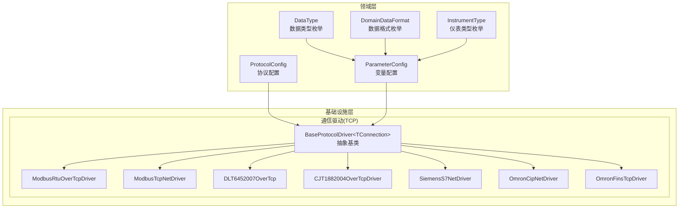

图表来源
- [BaseProtocolDriver.cs:1-108](file://IndustrialDataProcessor.Infrastructure/Communication/Drivers/TcpCommon/BaseProtocolDriver.cs#L1-L108)
- [ModbusRtuOverTcpDriver.cs:1-41](file://IndustrialDataProcessor.Infrastructure/Communication/Drivers/TcpCommon/ModbusRtuOverTcpDriver.cs#L1-L41)
- [ModbusTcpNetDriver.cs:1-41](file://IndustrialDataProcessor.Infrastructure/Communication/Drivers/TcpCommon/ModbusTcpNetDriver.cs#L1-L41)
- [DLT6452007OverTcp.cs:1-25](file://IndustrialDataProcessor.Infrastructure/Communication/Drivers/TcpCommon/DLT6452007OverTcp.cs#L1-L25)
- [CJT1882004OverTcpDriver.cs:1-33](file://IndustrialDataProcessor.Infrastructure/Communication/Drivers/TcpCommon/CJT1882004OverTcpDriver.cs#L1-L33)
- [SiemensS7NetDriver.cs:1-24](file://IndustrialDataProcessor.Infrastructure/Communication/Drivers/TcpCommon/SiemensS7NetDriver.cs#L1-L24)
- [OmronCipNetDriver.cs:1-29](file://IndustrialDataProcessor.Infrastructure/Communication/Drivers/TcpCommon/OmronCipNetDriver.cs#L1-L29)
- [OmronFinsTcpDriver.cs:1-23](file://IndustrialDataProcessor.Infrastructure/Communication/Drivers/TcpCommon/OmronFinsTcpDriver.cs#L1-L23)
- [ProtocolConfig.cs:1-64](file://IndustrialDataProcessor.Domain/Workstation/Configs/ProtocolConfig.cs#L1-L64)
- [ParameterConfig.cs:1-84](file://IndustrialDataProcessor.Domain/Workstation/Configs/ParameterConfig.cs#L1-L84)
- [DataType.cs:1-69](file://IndustrialDataProcessor.Domain/Enums/DataType.cs#L1-L69)
- [DomainDataFormat.cs:1-9](file://IndustrialDataProcessor.Domain/Enums/DomainDataFormat.cs#L1-L9)
- [InstrumentType.cs:1-58](file://IndustrialDataProcessor.Domain/Enums/InstrumentType.cs#L1-L58)

章节来源
- [BaseProtocolDriver.cs:1-108](file://IndustrialDataProcessor.Infrastructure/Communication/Drivers/TcpCommon/BaseProtocolDriver.cs#L1-L108)
- [ProtocolConfig.cs:1-64](file://IndustrialDataProcessor.Domain/Workstation/Configs/ProtocolConfig.cs#L1-L64)
- [ParameterConfig.cs:1-84](file://IndustrialDataProcessor.Domain/Workstation/Configs/ParameterConfig.cs#L1-L84)

## 核心组件
- BaseProtocolDriver<TConnection>：抽象基类，提供统一的协议读写流程编排、并发控制（通道锁）、异常包装与协议名称推导。子类仅需实现点位级读写的核心逻辑，即可获得一致的生命周期与错误处理体验。
- 各协议驱动：基于基类扩展，完成对具体HSL连接对象的参数映射与点位读写调用。

关键特性
- 并发控制：在ReadAsync/WriteAsync中通过IConnectionHandle.AcquireLockAsync获取通道锁，避免同一通道并发冲突。
- 异常处理：统一捕获并包装异常，便于上层识别协议来源与错误上下文。
- 虚拟点位：写入阶段对"VirtualPoint"地址进行拦截，模拟写入成功，避免不必要的网络交互。
- 可扩展性：通过泛型约束TConnection，使不同协议共享相同编排骨架。

章节来源
- [BaseProtocolDriver.cs:24-108](file://IndustrialDataProcessor.Infrastructure/Communication/Drivers/TcpCommon/BaseProtocolDriver.cs#L24-L108)

## 架构总览
下图展示了TCP通用协议的运行时交互：应用通过IProtocolDriver接口发起读写请求，基类负责并发与异常编排，具体驱动根据点位配置调用底层HSL连接对象执行实际通信。

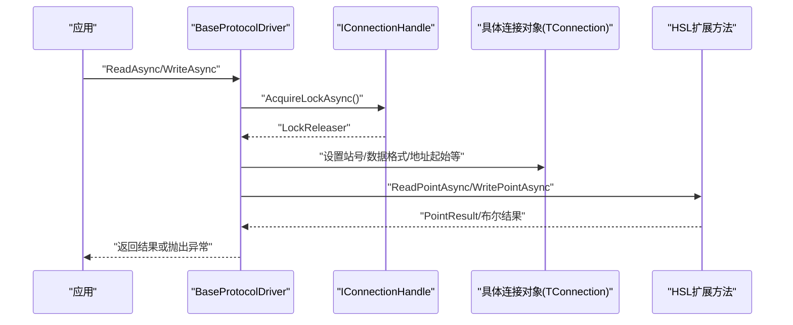

图表来源
- [BaseProtocolDriver.cs:26-72](file://IndustrialDataProcessor.Infrastructure/Communication/Drivers/TcpCommon/BaseProtocolDriver.cs#L26-L72)
- [ModbusRtuOverTcpDriver.cs:13-39](file://IndustrialDataProcessor.Infrastructure/Communication/Drivers/TcpCommon/ModbusRtuOverTcpDriver.cs#L13-L39)
- [ModbusTcpNetDriver.cs:13-39](file://IndustrialDataProcessor.Infrastructure/Communication/Drivers/TcpCommon/ModbusTcpNetDriver.cs#L13-L39)
- [DLT6452007OverTcp.cs:11-23](file://IndustrialDataProcessor.Infrastructure/Communication/Drivers/TcpCommon/DLT6452007OverTcp.cs#L11-L23)
- [CJT1882004OverTcpDriver.cs:15-31](file://IndustrialDataProcessor.Infrastructure/Communication/Drivers/TcpCommon/CJT1882004OverTcpDriver.cs#L15-L31)
- [SiemensS7NetDriver.cs:11-21](file://IndustrialDataProcessor.Infrastructure/Communication/Drivers/TcpCommon/SiemensS7NetDriver.cs#L11-L21)
- [OmronCipNetDriver.cs:12-28](file://IndustrialDataProcessor.Infrastructure/Communication/Drivers/TcpCommon/OmronCipNetDriver.cs#L12-L28)
- [OmronFinsTcpDriver.cs:11-21](file://IndustrialDataProcessor.Infrastructure/Communication/Drivers/TcpCommon/OmronFinsTcpDriver.cs#L11-L21)

## 详细组件分析

### 基类：BaseProtocolDriver
- 角色定位：协议读写流程的"模板方法"，负责并发、异常与协议名称推导；子类仅关注点位级读写。
- 关键流程
  - 读取：获取通道锁 → 子类ReadPointCoreAsync → 统一异常包装。
  - 写入：拦截虚拟点 → 获取通道锁 → 子类WritePointCoreAsync → 统一异常包装。
  - 整包读取：默认不支持，子类可按需重写。
- 错误处理：捕获子类异常并追加协议名与点位信息，便于定位问题。

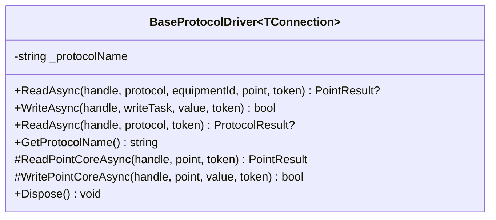

图表来源
- [BaseProtocolDriver.cs:12-108](file://IndustrialDataProcessor.Infrastructure/Communication/Drivers/TcpCommon/BaseProtocolDriver.cs#L12-L108)

章节来源
- [BaseProtocolDriver.cs:12-108](file://IndustrialDataProcessor.Infrastructure/Communication/Drivers/TcpCommon/BaseProtocolDriver.cs#L12-L108)

### Modbus RTU Over TCP 驱动
- 配置映射
  - 站号：从点位配置解析为字节。
  - 数据格式：映射到HSL数据格式。
  - 地址起始：是否从0开始。
- 特殊点
  - 与Modbus TCP类似，但封装为RTU帧格式，适合部分设备以TCP承载RTU帧的场景。
- 使用示例
  - 在点位配置中设置站号、数据格式、地址起始与数据类型，驱动自动完成参数映射与读写调用。

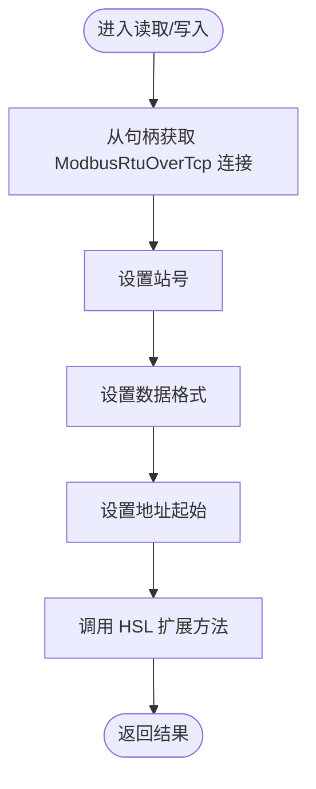

图表来源
- [ModbusRtuOverTcpDriver.cs:13-39](file://IndustrialDataProcessor.Infrastructure/Communication/Drivers/TcpCommon/ModbusRtuOverTcpDriver.cs#L13-L39)

章节来源
- [ModbusRtuOverTcpDriver.cs:1-41](file://IndustrialDataProcessor.Infrastructure/Communication/Drivers/TcpCommon/ModbusRtuOverTcpDriver.cs#L1-L41)

### Modbus TCP 驱动
- 配置映射
  - 站号、数据格式、地址起始与Modbus RTU版本一致。
- 使用示例
  - 适用于标准Modbus TCP设备，配置与上述一致。

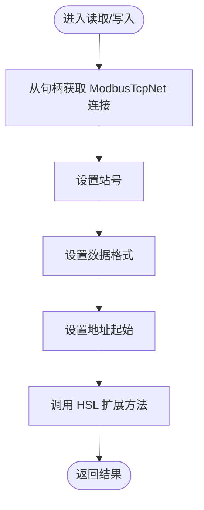

图表来源
- [ModbusTcpNetDriver.cs:13-39](file://IndustrialDataProcessor.Infrastructure/Communication/Drivers/TcpCommon/ModbusTcpNetDriver.cs#L13-L39)

章节来源
- [ModbusTcpNetDriver.cs:1-41](file://IndustrialDataProcessor.Infrastructure/Communication/Drivers/TcpCommon/ModbusTcpNetDriver.cs#L1-L41)

### DL/T645-2007 驱动
- 配置映射
  - 站号：直接使用字符串形式的站号。
- 特殊点
  - 专用于电表/水表/热量表等计量类设备，地址与数据格式遵循DL/T645规范。
- 使用示例
  - 在点位配置中设置站号与数据类型，驱动自动完成参数映射与读写调用。

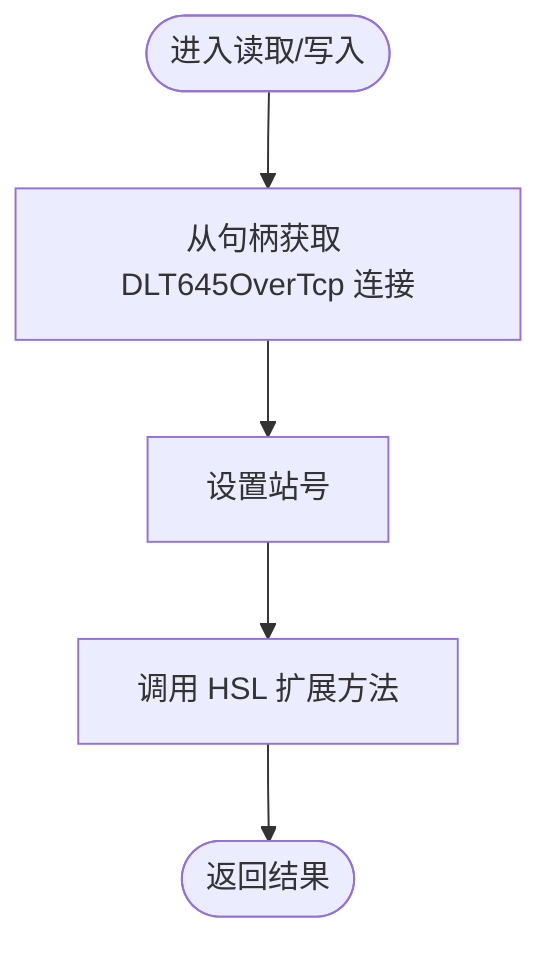

图表来源
- [DLT6452007OverTcp.cs:11-23](file://IndustrialDataProcessor.Infrastructure/Communication/Drivers/TcpCommon/DLT6452007OverTcp.cs#L11-L23)

章节来源
- [DLT6452007OverTcp.cs:1-25](file://IndustrialDataProcessor.Infrastructure/Communication/Drivers/TcpCommon/DLT6452007OverTcp.cs#L1-L25)

### CJT/188-2004 驱动
- 配置映射
  - 站号：字符串站号。
  - 仪表类型：从枚举映射为字节，用于区分水表/热量表/燃气表等。
- 特殊点
  - 专用于CJT188系列通信协议，支持多类仪表类型。
- 使用示例
  - 在点位配置中设置站号、仪表类型与数据类型，驱动自动完成参数映射与读写调用。

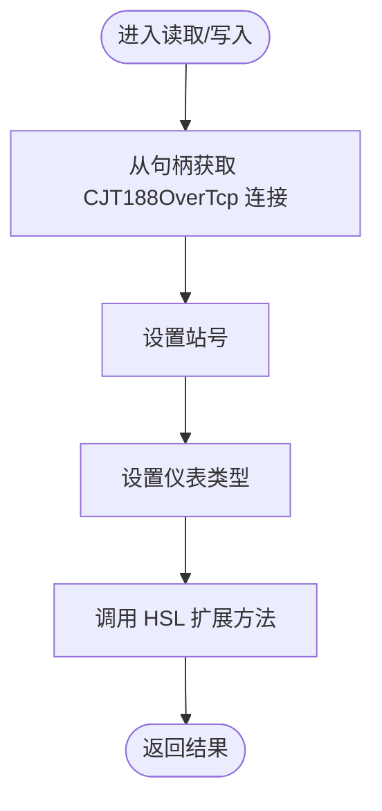

图表来源
- [CJT1882004OverTcpDriver.cs:15-31](file://IndustrialDataProcessor.Infrastructure/Communication/Drivers/TcpCommon/CJT1882004OverTcpDriver.cs#L15-L31)

章节来源
- [CJT1882004OverTcpDriver.cs:1-33](file://IndustrialDataProcessor.Infrastructure/Communication/Drivers/TcpCommon/CJT1882004OverTcpDriver.cs#L1-L33)

### 西门子S7 驱动
- 配置映射
  - 无需额外参数映射，直接使用HSL扩展方法。
- 特殊点
  - 适配西门子PLC的S7协议族，地址与数据类型由点位配置决定。
- 使用示例
  - 在点位配置中设置地址与数据类型，驱动自动完成读写调用。

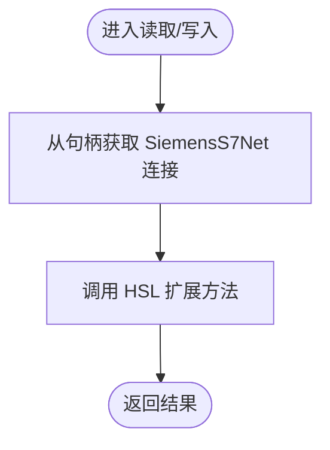

图表来源
- [SiemensS7NetDriver.cs:11-21](file://IndustrialDataProcessor.Infrastructure/Communication/Drivers/TcpCommon/SiemensS7NetDriver.cs#L11-L21)

章节来源
- [SiemensS7NetDriver.cs:1-24](file://IndustrialDataProcessor.Infrastructure/Communication/Drivers/TcpCommon/SiemensS7NetDriver.cs#L1-L24)

### 欧姆龙协议
- CIP 驱动
  - 无需额外参数映射，直接使用HSL扩展方法。
- FINS 驱动
  - 无需额外参数映射，直接使用HSL扩展方法。
- 使用示例
  - 在点位配置中设置地址与数据类型，驱动自动完成读写调用。

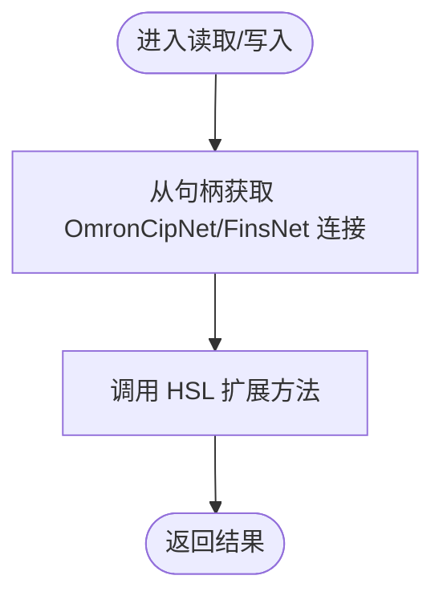

图表来源
- [OmronCipNetDriver.cs:12-28](file://IndustrialDataProcessor.Infrastructure/Communication/Drivers/TcpCommon/OmronCipNetDriver.cs#L12-L28)
- [OmronFinsTcpDriver.cs:11-21](file://IndustrialDataProcessor.Infrastructure/Communication/Drivers/TcpCommon/OmronFinsTcpDriver.cs#L11-L21)

章节来源
- [OmronCipNetDriver.cs:1-29](file://IndustrialDataProcessor.Infrastructure/Communication/Drivers/TcpCommon/OmronCipNetDriver.cs#L1-L29)
- [OmronFinsTcpDriver.cs:1-23](file://IndustrialDataProcessor.Infrastructure/Communication/Drivers/TcpCommon/OmronFinsTcpDriver.cs#L1-L23)

## 配置文件变更影响

### HTTP服务器端口变更
**更新** HTTP服务器端口已从开发环境的5170更改为生产环境的标准端口8899。

- **生产环境配置**：`"Urls": "http://0.0.0.0:8899"`
- **开发环境配置**：`"applicationUrl": "http://localhost:5170"`
- **影响范围**：API服务的访问端口，影响客户端连接配置和防火墙规则设置

### 数据库连接字符串优化
**更新** 数据库连接字符串已更新为使用生产环境密码'keda'，提升了安全性。

- **连接字符串**：`"Host=localhost;Port=5432;Database=iot;Username=postgres;Password=keda;Pooling=true;Minimum Pool Size=1;Maximum Pool Size=20;Connection Lifetime=0;Command Timeout=30;"`
- **安全改进**：使用生产环境专用密码，增强了数据库访问安全性
- **连接池优化**：配置了合理的连接池参数，支持最大20个连接

### HslCommunication授权码正式化
**更新** HslCommunication授权码已更新为正式的生产环境值。

- **授权码**：`"AuthorizationCode": "12a99167-05ff-4c89-936f-93d42033f882"`
- **合规性**：使用正式授权码确保HSL库的合法使用
- **稳定性**：正式授权码提供更好的技术支持和更新保障

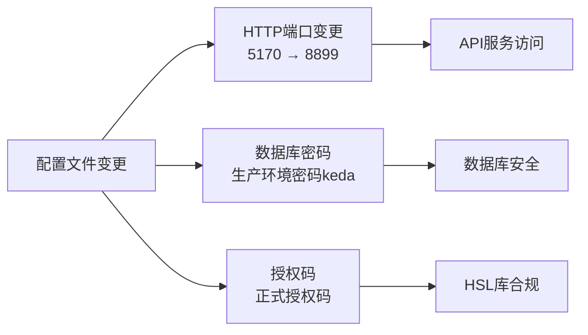

图表来源
- [appsettings.json:2-18](file://IndustrialDataProcessor.Api/appsettings.json#L2-L18)
- [launchSettings.json](file://IndustrialDataProcessor.Api/Properties/launchSettings.json#L17)

章节来源
- [appsettings.json:1-23](file://IndustrialDataProcessor.Api/appsettings.json#L1-L23)
- [launchSettings.json:1-32](file://IndustrialDataProcessor.Api/Properties/launchSettings.json#L1-L32)

## 依赖关系分析
- 领域模型
  - 协议配置：包含接口类型、协议类型、超时与账号密码等通用参数。
  - 变量配置：包含点位地址、站号、数据格式、地址起始、仪表类型、数据类型、长度等。
  - 枚举：数据类型、数据格式、仪表类型等。
- 驱动与连接
  - 各驱动均继承自BaseProtocolDriver，通过IConnectionHandle获取具体连接对象（如ModbusRtuOverTcp、ModbusTcpNet、DLT645OverTcp、CJT188OverTcp、SiemensS7Net、OmronCipNet、OmronFinsNet），并在点位级调用HSL扩展方法完成读写。
- 依赖耦合
  - 驱动与HSL库耦合，但通过扩展方法抽象了具体实现细节，便于替换与升级。
  - 基类与具体驱动低耦合，高内聚，便于扩展新的协议变体。
- **新增** 配置文件依赖
  - 应用程序配置文件依赖于数据库连接字符串和HSL授权码
  - 开发环境配置文件提供本地开发的端口设置

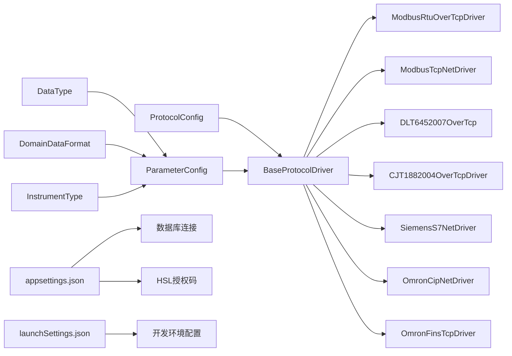

图表来源
- [ProtocolConfig.cs:8-64](file://IndustrialDataProcessor.Domain/Workstation/Configs/ProtocolConfig.cs#L8-L64)
- [ParameterConfig.cs:7-84](file://IndustrialDataProcessor.Domain/Workstation/Configs/ParameterConfig.cs#L7-L84)
- [DataType.cs:8-69](file://IndustrialDataProcessor.Domain/Enums/DataType.cs#L8-L69)
- [DomainDataFormat.cs:3-9](file://IndustrialDataProcessor.Domain/Enums/DomainDataFormat.cs#L3-L9)
- [InstrumentType.cs:8-58](file://IndustrialDataProcessor.Domain/Enums/InstrumentType.cs#L8-L58)
- [BaseProtocolDriver.cs:12-108](file://IndustrialDataProcessor.Infrastructure/Communication/Drivers/TcpCommon/BaseProtocolDriver.cs#L12-L108)
- [appsettings.json:13-18](file://IndustrialDataProcessor.Api/appsettings.json#L13-L18)
- [launchSettings.json:11-31](file://IndustrialDataProcessor.Api/Properties/launchSettings.json#L11-L31)

章节来源
- [ProtocolConfig.cs:1-64](file://IndustrialDataProcessor.Domain/Workstation/Configs/ProtocolConfig.cs#L1-L64)
- [ParameterConfig.cs:1-84](file://IndustrialDataProcessor.Domain/Workstation/Configs/ParameterConfig.cs#L1-L84)
- [appsettings.json:1-23](file://IndustrialDataProcessor.Api/appsettings.json#L1-L23)
- [launchSettings.json:1-32](file://IndustrialDataProcessor.Api/Properties/launchSettings.json#L1-L32)

## 性能考虑
- 并发控制
  - 基类在每次读写前获取通道锁，避免同一通道并发冲突，提高稳定性；对于高并发场景，建议合理拆分通道与设备，减少锁竞争。
- 超时与重试
  - 协议配置提供通信延时、接收超时与连接超时参数，应结合设备响应特性进行调优；必要时在上层增加有限重试策略。
- 虚拟点位
  - 写入阶段对虚拟点位进行拦截，避免无效网络开销，提升吞吐。
- 数据格式
  - 合理设置数据格式与地址起始，减少数据转换成本；批量读取场景优先选择支持整包读取的协议或驱动。
- 连接复用
  - 尽可能复用底层连接，减少频繁建立/断开连接带来的开销；在连接异常时及时清理与重建。
- **新增** 配置优化
  - HTTP服务器端口变更不影响性能，但需要确保网络配置正确
  - 生产环境密码提升了数据库访问的安全性，建议定期轮换
  - 正式授权码确保HSL库的稳定性和技术支持

## 故障排查指南
- 常见异常
  - 读写失败：基类会统一包装异常，包含协议名与点位信息，便于快速定位。
  - 不支持整包读取：若调用默认实现，将抛出未实现异常，需在子类中按需重写。
  - 虚拟点位写入：拦截后返回特定布尔值，确认是否符合预期。
- 排查步骤
  - 检查点位配置：站号、数据格式、地址起始、仪表类型等是否正确。
  - 检查协议配置：超时参数是否合理，账号密码是否正确。
  - 检查通道锁：是否存在长时间占用导致的阻塞。
  - 检查底层连接：确认连接对象是否有效，网络连通性是否正常。
- **新增** 配置相关排查
  - HTTP端口访问：确认8899端口已开放且无冲突
  - 数据库连接：验证生产环境密码正确性和连接字符串格式
  - HSL授权：确认授权码有效且未过期

章节来源
- [BaseProtocolDriver.cs:26-81](file://IndustrialDataProcessor.Infrastructure/Communication/Drivers/TcpCommon/BaseProtocolDriver.cs#L26-L81)
- [appsettings.json:13-18](file://IndustrialDataProcessor.Api/appsettings.json#L13-L18)

## 结论
本实现通过BaseProtocolDriver抽象出TCP通用协议的读写骨架，配合各协议驱动完成参数映射与点位读写，既保证了跨协议的一致性，又保留了对具体协议细节的灵活适配。结合合理的超时与重试、并发控制与连接复用策略，可在工业环境中稳定高效地采集各类设备数据。

**更新** 最新配置变更进一步提升了系统的安全性、稳定性和合规性，包括生产环境端口标准化、数据库密码优化以及正式授权码的使用，为系统的长期稳定运行提供了更好的基础。

## 附录

### 协议参数配置与数据格式转换
- 协议配置（ProtocolConfig）
  - 必填字段：协议Id、接口类型、协议类型、设备列表。
  - 可选字段：通信延时、接收超时、连接超时、账号、密码、备注、附加选项。
- 变量配置（ParameterConfig）
  - 必填字段：标签、地址（虚拟点地址为固定值）、是否监控、设备列表。
  - 可选字段：站号、数据格式、地址起始、仪表类型、数据类型、长度、默认值、采集周期、正表达式、最小值、最大值、写入值。
- 数据类型（DataType）
  - 支持布尔、短整型、长整型、无符号整型、浮点、双精度、字符串等。
- 数据格式（DomainDataFormat）
  - 支持ABCD、BADC、CDAB、DCBA等字节序组合。
- 仪表类型（InstrumentType）
  - 支持冷水水表、生活热水水表、直饮水水表、中水水表、热量表、冷量表、燃气表、电度表等。

章节来源
- [ProtocolConfig.cs:8-64](file://IndustrialDataProcessor.Domain/Workstation/Configs/ProtocolConfig.cs#L8-L64)
- [ParameterConfig.cs:7-84](file://IndustrialDataProcessor.Domain/Workstation/Configs/ParameterConfig.cs#L7-L84)
- [DataType.cs:8-69](file://IndustrialDataProcessor.Domain/Enums/DataType.cs#L8-L69)
- [DomainDataFormat.cs:3-9](file://IndustrialDataProcessor.Domain/Enums/DomainDataFormat.cs#L3-L9)
- [InstrumentType.cs:8-58](file://IndustrialDataProcessor.Domain/Enums/InstrumentType.cs#L8-L58)

### 使用示例与配置参数说明（示例性描述）
- Modbus RTU Over TCP
  - 配置要点：设置站号、数据格式、地址起始、数据类型；驱动自动映射并调用HSL扩展方法。
- Modbus TCP
  - 配置要点：与RTU版本一致，适用于标准Modbus TCP设备。
- DL/T645-2007
  - 配置要点：设置站号与数据类型；驱动自动映射并调用HSL扩展方法。
- CJT/188-2004
  - 配置要点：设置站号、仪表类型与数据类型；驱动自动映射并调用HSL扩展方法。
- 西门子S7
  - 配置要点：设置地址与数据类型；驱动直接调用HSL扩展方法。
- 欧姆龙协议
  - CIP/FINS：配置要点同上，驱动直接调用HSL扩展方法。

### 配置文件参考
- **生产环境配置**：HTTP端口8899，生产环境数据库密码，正式授权码
- **开发环境配置**：HTTP端口5170，本地开发配置
- **数据库连接**：PostgreSQL连接字符串，包含连接池参数
- **HSL授权**：正式授权码，确保库的合法使用

章节来源
- [ModbusRtuOverTcpDriver.cs:13-39](file://IndustrialDataProcessor.Infrastructure/Communication/Drivers/TcpCommon/ModbusRtuOverTcpDriver.cs#L13-L39)
- [ModbusTcpNetDriver.cs:13-39](file://IndustrialDataProcessor.Infrastructure/Communication/Drivers/TcpCommon/ModbusTcpNetDriver.cs#L13-L39)
- [DLT6452007OverTcp.cs:11-23](file://IndustrialDataProcessor.Infrastructure/Communication/Drivers/TcpCommon/DLT6452007OverTcp.cs#L11-L23)
- [CJT1882004OverTcpDriver.cs:15-31](file://IndustrialDataProcessor.Infrastructure/Communication/Drivers/TcpCommon/CJT1882004OverTcpDriver.cs#L15-L31)
- [SiemensS7NetDriver.cs:11-21](file://IndustrialDataProcessor.Infrastructure/Communication/Drivers/TcpCommon/SiemensS7NetDriver.cs#L11-L21)
- [OmronCipNetDriver.cs:12-28](file://IndustrialDataProcessor.Infrastructure/Communication/Drivers/TcpCommon/OmronCipNetDriver.cs#L12-L28)
- [OmronFinsTcpDriver.cs:11-21](file://IndustrialDataProcessor.Infrastructure/Communication/Drivers/TcpCommon/OmronFinsTcpDriver.cs#L11-L21)
- [appsettings.json:1-23](file://IndustrialDataProcessor.Api/appsettings.json#L1-L23)
- [launchSettings.json:1-32](file://IndustrialDataProcessor.Api/Properties/launchSettings.json#L1-L32)