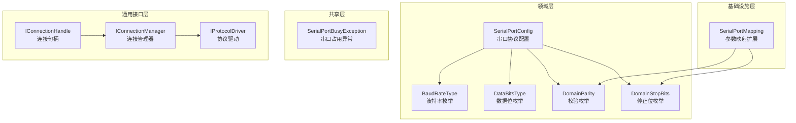
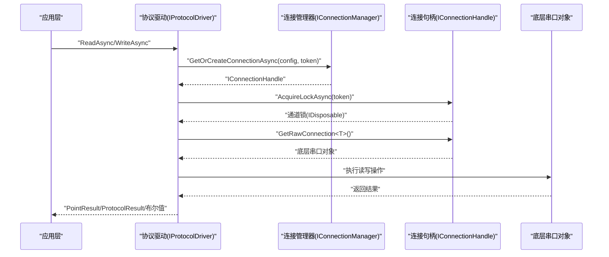
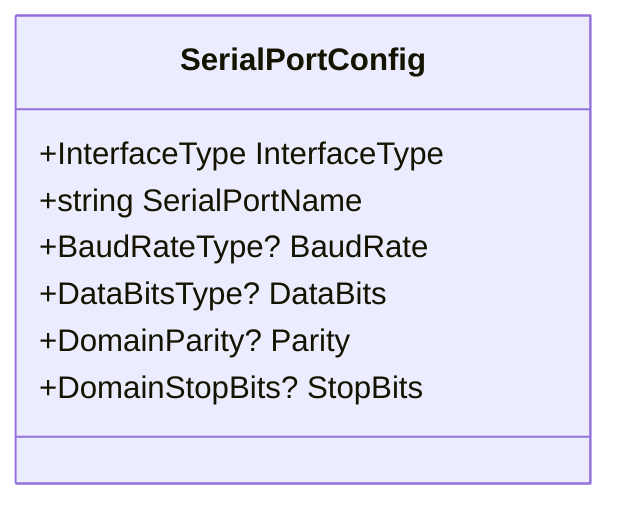
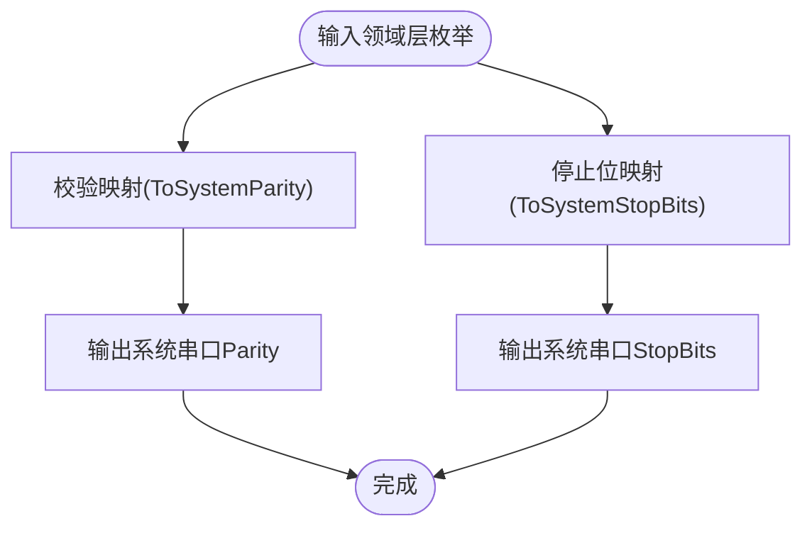
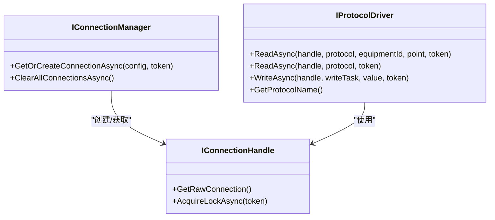
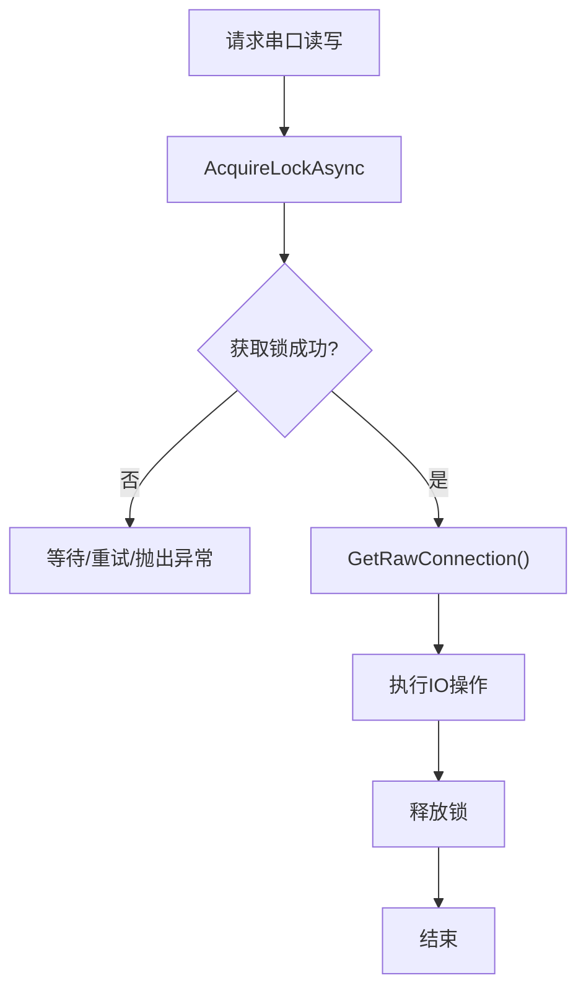
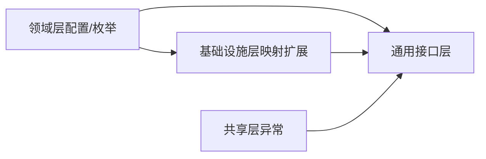

# 串口通信协议

<cite>
**本文引用的文件**
- [SerialPortConfig.cs](file://IndustrialDataProcessor.Domain/Workstation/Configs/ProtocolSub/SerialPortConfig.cs)
- [BaudRateType.cs](file://IndustrialDataProcessor.Domain/Enums/BaudRateType.cs)
- [DataBitsType.cs](file://IndustrialDataProcessor.Domain/Enums/DataBitsType.cs)
- [DomainParity.cs](file://IndustrialDataProcessor.Domain/Enums/DomainParity.cs)
- [DomainStopBits.cs](file://IndustrialDataProcessor.Domain/Enums/DomainStopBits.cs)
- [IConnectionHandle.cs](file://IndustrialDataProcessor.Domain/Communication/IConnection/IConnectionHandle.cs)
- [IConnectionManager.cs](file://IndustrialDataProcessor.Domain/Communication/IConnection/IConnectionManager.cs)
- [IProtocolDriver.cs](file://IndustrialDataProcessor.Domain/Communication/IConnection/IProtocolDriver.cs)
- [SerialPortMapping.cs](file://IndustrialDataProcessor.Infrastructure/Extensions/SerialPortMapping.cs)
- [SerialPortBusyException.cs](file://IndustrialDataProcessor.Share/Exceptions/Communication/SerialPortBusyException.cs)
</cite>

## 目录
1. [引言](#引言)
2. [项目结构](#项目结构)
3. [核心组件](#核心组件)
4. [架构总览](#架构总览)
5. [详细组件分析](#详细组件分析)
6. [依赖关系分析](#依赖关系分析)
7. [性能考虑](#性能考虑)
8. [故障排查指南](#故障排查指南)
9. [结论](#结论)
10. [附录](#附录)

## 引言
本文件面向工业数据采集系统中的串口通信协议实现，围绕基础配置参数（波特率、数据位、停止位、校验方式）、读写流程、连接管理与资源释放、与TCP协议的差异与适用场景、配置示例与调试方法、以及性能优化与稳定性保障进行系统化说明。内容基于仓库中领域层配置模型、基础设施层映射扩展与共享层异常定义，帮助开发者在不直接阅读具体第三方串口库代码的前提下，理解整体设计思路与落地要点。

## 项目结构
串口通信相关能力分布在以下层次：
- 领域层：定义串口协议配置模型与参数枚举，确保跨协议的一致性与可验证性
- 基础设施层：提供参数到系统串口类型的映射扩展，便于对接具体串口实现
- 共享层：定义串口占用等通信异常类型，支撑上层错误处理策略
- 通用接口层：定义连接句柄、连接管理器与协议驱动接口，统一不同传输介质的调用方式

**图表来源**
- [SerialPortConfig.cs](file://IndustrialDataProcessor.Domain/Workstation/Configs/ProtocolSub/SerialPortConfig.cs#L1-L38)
- [BaudRateType.cs](file://IndustrialDataProcessor.Domain/Enums/BaudRateType.cs#L1-L99)
- [DataBitsType.cs](file://IndustrialDataProcessor.Domain/Enums/DataBitsType.cs#L1-L21)
- [DomainParity.cs](file://IndustrialDataProcessor.Domain/Enums/DomainParity.cs#L1-L13)
- [DomainStopBits.cs](file://IndustrialDataProcessor.Domain/Enums/DomainStopBits.cs#L1-L13)
- [SerialPortMapping.cs](file://IndustrialDataProcessor.Infrastructure/Extensions/SerialPortMapping.cs#L1-L33)
- [SerialPortBusyException.cs](file://IndustrialDataProcessor.Share/Exceptions/Communication/SerialPortBusyException.cs#L1-L6)
- [IConnectionHandle.cs](file://IndustrialDataProcessor.Domain/Communication/IConnection/IConnectionHandle.cs#L1-L19)
- [IConnectionManager.cs](file://IndustrialDataProcessor.Domain/Communication/IConnection/IConnectionManager.cs#L1-L19)
- [IProtocolDriver.cs](file://IndustrialDataProcessor.Domain/Communication/IConnection/IProtocolDriver.cs#L1-L14)

**章节来源**
- [SerialPortConfig.cs](file://IndustrialDataProcessor.Domain/Workstation/Configs/ProtocolSub/SerialPortConfig.cs#L1-L38)
- [SerialPortMapping.cs](file://IndustrialDataProcessor.Infrastructure/Extensions/SerialPortMapping.cs#L1-L33)
- [IConnectionHandle.cs](file://IndustrialDataProcessor.Domain/Communication/IConnection/IConnectionHandle.cs#L1-L19)
- [IConnectionManager.cs](file://IndustrialDataProcessor.Domain/Communication/IConnection/IConnectionManager.cs#L1-L19)
- [IProtocolDriver.cs](file://IndustrialDataProcessor.Domain/Communication/IConnection/IProtocolDriver.cs#L1-L14)

## 核心组件
- 串口协议配置模型：封装串口名称、波特率、数据位、校验、停止位等关键参数，明确接口类型为COM
- 参数枚举体系：统一抽象波特率、数据位、校验方式、停止位，避免实现细节泄漏到业务层
- 参数映射扩展：将领域层枚举转换为系统串口库的对应类型，保证配置与实现解耦
- 连接与驱动接口：通过统一接口屏蔽底层传输差异，支持自动重连、并发控制与资源释放

**章节来源**
- [SerialPortConfig.cs](file://IndustrialDataProcessor.Domain/Workstation/Configs/ProtocolSub/SerialPortConfig.cs#L1-L38)
- [BaudRateType.cs](file://IndustrialDataProcessor.Domain/Enums/BaudRateType.cs#L1-L99)
- [DataBitsType.cs](file://IndustrialDataProcessor.Domain/Enums/DataBitsType.cs#L1-L21)
- [DomainParity.cs](file://IndustrialDataProcessor.Domain/Enums/DomainParity.cs#L1-L13)
- [DomainStopBits.cs](file://IndustrialDataProcessor.Domain/Enums/DomainStopBits.cs#L1-L13)
- [SerialPortMapping.cs](file://IndustrialDataProcessor.Infrastructure/Extensions/SerialPortMapping.cs#L1-L33)
- [IConnectionHandle.cs](file://IndustrialDataProcessor.Domain/Communication/IConnection/IConnectionHandle.cs#L1-L19)
- [IConnectionManager.cs](file://IndustrialDataProcessor.Domain/Communication/IConnection/IConnectionManager.cs#L1-L19)
- [IProtocolDriver.cs](file://IndustrialDataProcessor.Domain/Communication/IConnection/IProtocolDriver.cs#L1-L14)

## 架构总览
下图展示了串口协议在系统中的调用路径：应用层通过协议驱动发起读写请求，驱动通过连接句柄获取底层通信对象并执行操作；连接管理器负责连接的获取与自动重连；参数映射扩展确保配置正确传递至系统串口库。

**图表来源**
- [IProtocolDriver.cs](file://IndustrialDataProcessor.Domain/Communication/IConnection/IProtocolDriver.cs#L1-L14)
- [IConnectionManager.cs](file://IndustrialDataProcessor.Domain/Communication/IConnection/IConnectionManager.cs#L1-L19)
- [IConnectionHandle.cs](file://IndustrialDataProcessor.Domain/Communication/IConnection/IConnectionHandle.cs#L1-L19)

## 详细组件分析

### 串口协议配置模型
- 字段职责
  - 接口类型：固定为COM
  - 串口名称：设备标识，必填
  - 波特率：必填，使用领域枚举
  - 数据位：必填，支持7/8
  - 校验：必填，支持None/Odd/Even/Mark/Space
  - 停止位：必填，支持None/One/Two/OnePointFive
- 设计要点
  - 使用可空枚举承载参数，便于验证与默认值处理
  - 通过继承协议配置基类，与其他接口类型保持一致的抽象

**图表来源**
- [SerialPortConfig.cs](file://IndustrialDataProcessor.Domain/Workstation/Configs/ProtocolSub/SerialPortConfig.cs#L1-L38)

**章节来源**
- [SerialPortConfig.cs](file://IndustrialDataProcessor.Domain/Workstation/Configs/ProtocolSub/SerialPortConfig.cs#L1-L38)

### 参数枚举与映射
- 枚举覆盖范围
  - 波特率：涵盖常见工业速率
  - 数据位：7/8位常用组合
  - 校验：None/Odd/Even/Mark/Space
  - 停止位：None/One/Two/OnePointFive
- 映射扩展
  - 将领域层校验与停止位枚举映射到系统串口库类型，确保配置与实现解耦
  - 提供默认回退策略，保证未知枚举值的安全处理

**图表来源**
- [SerialPortMapping.cs](file://IndustrialDataProcessor.Infrastructure/Extensions/SerialPortMapping.cs#L1-L33)
- [DomainParity.cs](file://IndustrialDataProcessor.Domain/Enums/DomainParity.cs#L1-L13)
- [DomainStopBits.cs](file://IndustrialDataProcessor.Domain/Enums/DomainStopBits.cs#L1-L13)

**章节来源**
- [SerialPortMapping.cs](file://IndustrialDataProcessor.Infrastructure/Extensions/SerialPortMapping.cs#L1-L33)
- [DomainParity.cs](file://IndustrialDataProcessor.Domain/Enums/DomainParity.cs#L1-L13)
- [DomainStopBits.cs](file://IndustrialDataProcessor.Domain/Enums/DomainStopBits.cs#L1-L13)

### 连接与驱动接口
- 连接句柄
  - 提供底层通信对象访问能力
  - 提供通道锁以确保串口读写串行化，避免并发冲突
- 连接管理器
  - 负责根据配置获取或创建连接句柄
  - 提供自动重连与清理能力
- 协议驱动
  - 定义统一的读写接口，屏蔽底层差异
  - 返回标准化结果类型，便于上层处理

**图表来源**
- [IConnectionHandle.cs](file://IndustrialDataProcessor.Domain/Communication/IConnection/IConnectionHandle.cs#L1-L19)
- [IConnectionManager.cs](file://IndustrialDataProcessor.Domain/Communication/IConnection/IConnectionManager.cs#L1-L19)
- [IProtocolDriver.cs](file://IndustrialDataProcessor.Domain/Communication/IConnection/IProtocolDriver.cs#L1-L14)

**章节来源**
- [IConnectionHandle.cs](file://IndustrialDataProcessor.Domain/Communication/IConnection/IConnectionHandle.cs#L1-L19)
- [IConnectionManager.cs](file://IndustrialDataProcessor.Domain/Communication/IConnection/IConnectionManager.cs#L1-L19)
- [IProtocolDriver.cs](file://IndustrialDataProcessor.Domain/Communication/IConnection/IProtocolDriver.cs#L1-L14)

### 串口连接管理与资源释放
- 并发控制
  - 通过通道锁确保同一物理串口的读写串行化，避免竞争条件
- 自动重连
  - 连接管理器负责连接生命周期与自动恢复
- 资源释放
  - 连接句柄实现异步释放接口，确保底层串口资源及时回收
- 异常处理
  - 串口占用异常类型为上层策略提供依据，便于区分瞬时故障与永久性占用

**图表来源**
- [IConnectionHandle.cs](file://IndustrialDataProcessor.Domain/Communication/IConnection/IConnectionHandle.cs#L1-L19)
- [SerialPortBusyException.cs](file://IndustrialDataProcessor.Share/Exceptions/Communication/SerialPortBusyException.cs#L1-L6)

**章节来源**
- [IConnectionHandle.cs](file://IndustrialDataProcessor.Domain/Communication/IConnection/IConnectionHandle.cs#L1-L19)
- [SerialPortBusyException.cs](file://IndustrialDataProcessor.Share/Exceptions/Communication/SerialPortBusyException.cs#L1-L6)

## 依赖关系分析
- 领域层配置依赖枚举，形成稳定的参数契约
- 基础设施层映射扩展依赖领域层枚举，实现配置到系统类型的转换
- 通用接口层依赖领域层配置与基础设施层映射，形成可插拔的驱动架构
- 共享层异常为上层策略提供差异化处理依据

**图表来源**
- [SerialPortConfig.cs](file://IndustrialDataProcessor.Domain/Workstation/Configs/ProtocolSub/SerialPortConfig.cs#L1-L38)
- [SerialPortMapping.cs](file://IndustrialDataProcessor.Infrastructure/Extensions/SerialPortMapping.cs#L1-L33)
- [IConnectionHandle.cs](file://IndustrialDataProcessor.Domain/Communication/IConnection/IConnectionHandle.cs#L1-L19)
- [IConnectionManager.cs](file://IndustrialDataProcessor.Domain/Communication/IConnection/IConnectionManager.cs#L1-L19)
- [IProtocolDriver.cs](file://IndustrialDataProcessor.Domain/Communication/IConnection/IProtocolDriver.cs#L1-L14)
- [SerialPortBusyException.cs](file://IndustrialDataProcessor.Share/Exceptions/Communication/SerialPortBusyException.cs#L1-L6)

**章节来源**
- [SerialPortConfig.cs](file://IndustrialDataProcessor.Domain/Workstation/Configs/ProtocolSub/SerialPortConfig.cs#L1-L38)
- [SerialPortMapping.cs](file://IndustrialDataProcessor.Infrastructure/Extensions/SerialPortMapping.cs#L1-L33)
- [IConnectionHandle.cs](file://IndustrialDataProcessor.Domain/Communication/IConnection/IConnectionHandle.cs#L1-L19)
- [IConnectionManager.cs](file://IndustrialDataProcessor.Domain/Communication/IConnection/IConnectionManager.cs#L1-L19)
- [IProtocolDriver.cs](file://IndustrialDataProcessor.Domain/Communication/IConnection/IProtocolDriver.cs#L1-L14)
- [SerialPortBusyException.cs](file://IndustrialDataProcessor.Share/Exceptions/Communication/SerialPortBusyException.cs#L1-L6)

## 性能考虑
- 串行化读写
  - 利用通道锁避免并发写入导致的数据帧交错
- 批量与合并
  - 在驱动层对连续读写请求进行合并，减少串口开销
- 超时与重试
  - 为串口读写设置合理超时，结合指数退避策略进行有限重试
- 缓存与预热
  - 对频繁使用的串口连接进行预热与缓存，降低首次连接延迟
- 资源复用
  - 复用连接句柄与底层串口对象，避免频繁打开/关闭带来的抖动

## 故障排查指南
- 串口占用
  - 现象：尝试打开串口失败
  - 排查：确认是否存在其他进程占用；检查串口是否已被释放
  - 参考异常类型：串口占用异常
- 参数不匹配
  - 现象：设备无响应或数据错误
  - 排查：核对波特率、数据位、校验、停止位是否与设备一致
  - 参考映射扩展：校验与停止位映射
- 并发冲突
  - 现象：读写乱序或数据帧损坏
  - 排查：确认是否正确获取通道锁；避免多线程同时写入
- 连接中断
  - 现象：读写超时或连接断开
  - 排查：检查连接管理器的自动重连策略与心跳机制

**章节来源**
- [SerialPortBusyException.cs](file://IndustrialDataProcessor.Share/Exceptions/Communication/SerialPortBusyException.cs#L1-L6)
- [SerialPortMapping.cs](file://IndustrialDataProcessor.Infrastructure/Extensions/SerialPortMapping.cs#L1-L33)
- [IConnectionHandle.cs](file://IndustrialDataProcessor.Domain/Communication/IConnection/IConnectionHandle.cs#L1-L19)

## 结论
该串口通信方案通过领域层配置与枚举、基础设施层映射扩展、以及通用接口层的驱动与连接管理，实现了配置与实现解耦、并发安全与资源可控。结合合理的超时与重试策略、批量合并与连接复用，可在工业场景中获得稳定且高性能的串口通信能力。

## 附录

### 串口协议与TCP协议的区别与适用场景
- 工业现场布线与成本
  - 串口：点对点直连，布线简单，成本低，适合短距离、设备直连
  - TCP：网络互通，适合远程集中式采集与集中控制
- 实时性与确定性
  - 串口：延迟低、无网络抖动，适合实时性强的设备
  - TCP：受网络质量影响，需考虑队头阻塞与丢包重传
- 可靠性与维护
  - 串口：物理链路简单，故障点少，但易受环境干扰
  - TCP：具备完善的拥塞控制与重传机制，适合复杂网络环境
- 适用场景建议
  - 串口：传感器/仪表直连、本地控制器、小规模设备群
  - TCP：跨网段远距离采集、集中监控平台、云边协同

### 配置示例与调试方法
- 配置示例（字段说明）
  - 串口名称：设备端口号或名称
  - 波特率：与设备一致的速率
  - 数据位：通常为8
  - 校验：None/Even/Odd视设备而定
  - 停止位：通常为1
- 调试方法
  - 使用串口调试助手验证设备端参数一致性
  - 启用日志记录读写帧与耗时，定位异常
  - 在驱动层增加CRC校验与帧边界检测，提升鲁棒性