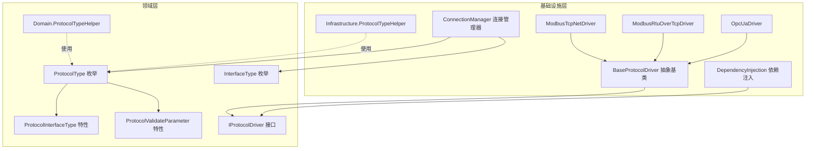
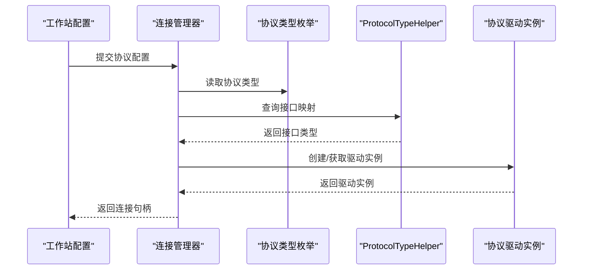
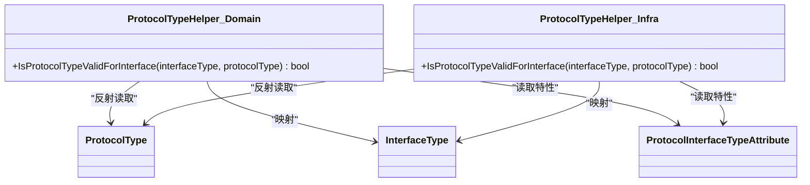
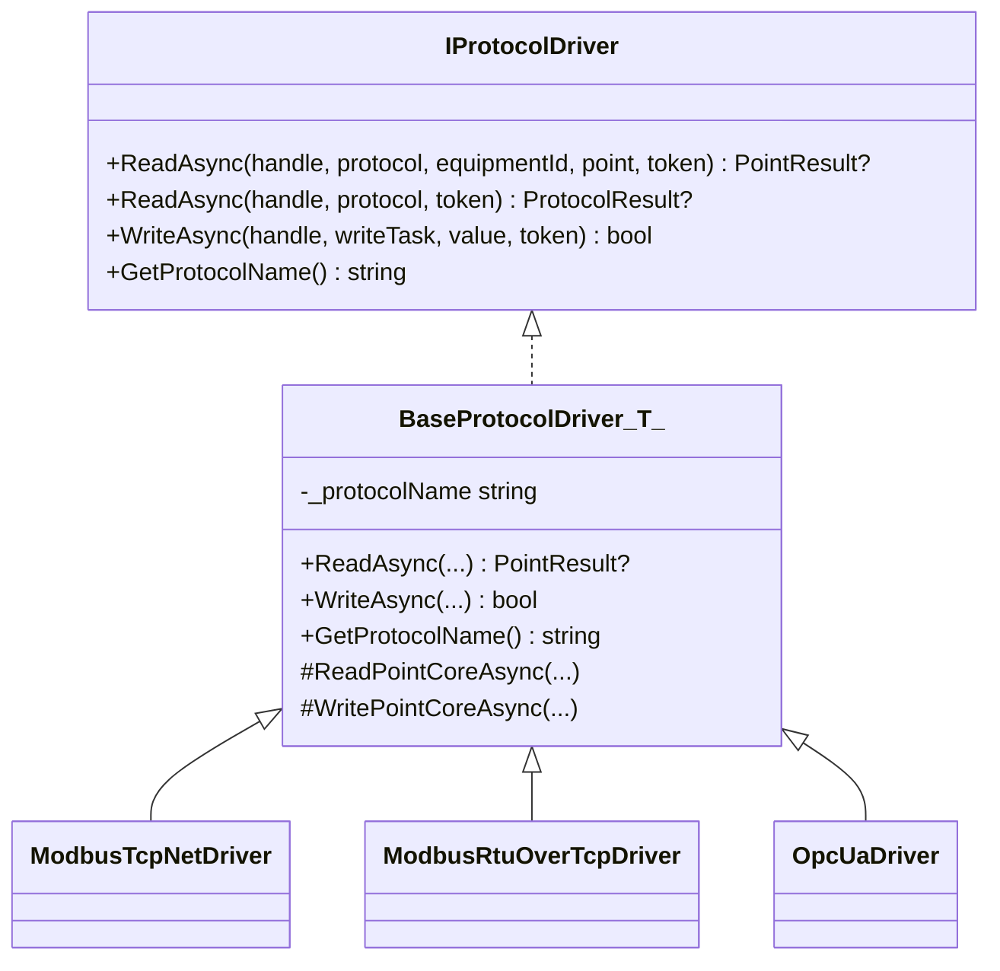
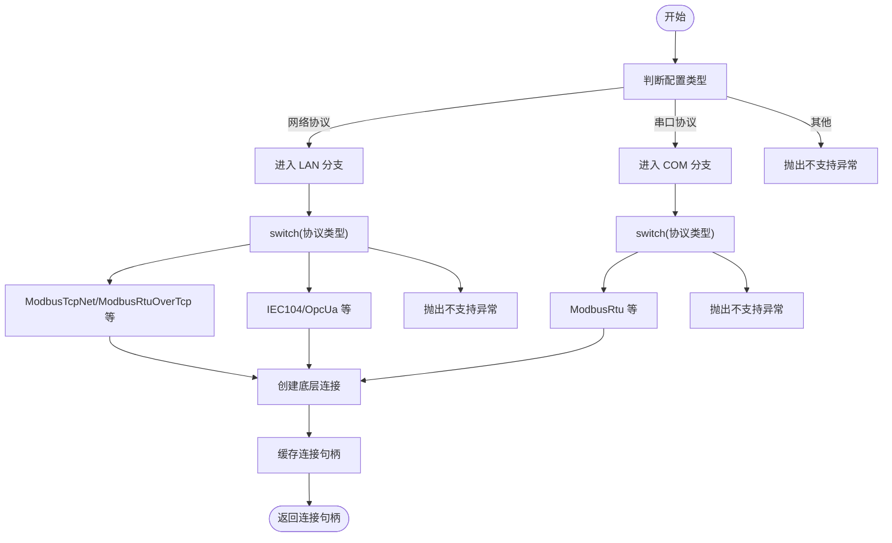
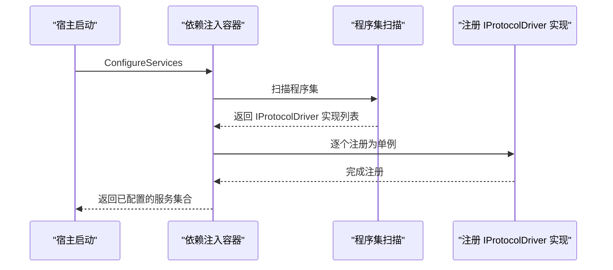
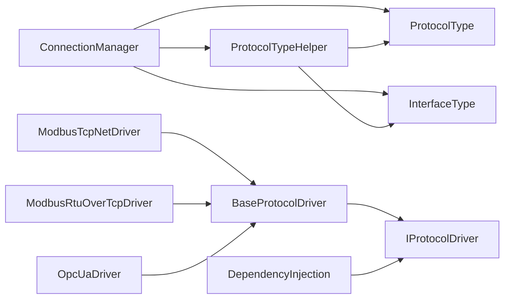

# 协议工厂模式

<cite>
**本文引用的文件**
- [ProtocolTypeHelper.cs](file://IndustrialDataSolution/IndustrialDataProcessor.Domain/Helpers/ProtocolTypeHelper.cs)
- [ProtocolTypeHelper.cs](file://IndustrialDataSolution/IndustrialDataProcessor.Infrastructure/Helpers/ProtocolTypeHelper.cs)
- [ProtocolType.cs](file://IndustrialDataSolution/IndustrialDataProcessor.Domain/Enums/ProtocolType.cs)
- [InterfaceType.cs](file://IndustrialDataSolution/IndustrialDataProcessor.Domain/Enums/InterfaceType.cs)
- [ProtocolInterfaceTypeAttribute.cs](file://IndustrialDataSolution/IndustrialDataProcessor.Domain/Attributes/ProtocolInterfaceTypeAttribute.cs)
- [ProtocolValidateParameterAttribute.cs](file://IndustrialDataSolution/IndustrialDataProcessor.Domain/Attributes/ProtocolValidateParameterAttribute.cs)
- [IProtocolDriver.cs](file://IndustrialDataSolution/IndustrialDataProcessor.Domain/Communication/IConnection/IProtocolDriver.cs)
- [BaseProtocolDriver.cs](file://IndustrialDataSolution/IndustrialDataProcessor.Infrastructure/Communication/Drivers/TcpCommon/BaseProtocolDriver.cs)
- [ModbusTcpNetDriver.cs](file://IndustrialDataSolution/IndustrialDataProcessor.Infrastructure/Communication/Drivers/TcpCommon/ModbusTcpNetDriver.cs)
- [ModbusRtuOverTcpDriver.cs](file://IndustrialDataSolution/IndustrialDataProcessor.Infrastructure/Communication/Drivers/TcpCommon/ModbusRtuOverTcpDriver.cs)
- [OpcUaDriver.cs](file://IndustrialDataSolution/IndustrialDataProcessor.Infrastructure/Communication/Drivers/TcpSpecial/OpcUaDriver.cs)
- [ConnectionManager.cs](file://IndustrialDataSolution/IndustrialDataProcessor.Infrastructure/Communication/Connection/ConnectionManager.cs)
- [DependencyInjection.cs](file://IndustrialDataSolution/IndustrialDataProcessor.Infrastructure/DependencyInjection.cs)
</cite>

## 目录
1. [引言](#引言)
2. [项目结构](#项目结构)
3. [核心组件](#核心组件)
4. [架构总览](#架构总览)
5. [详细组件分析](#详细组件分析)
6. [依赖分析](#依赖分析)
7. [性能考虑](#性能考虑)
8. [故障排查指南](#故障排查指南)
9. [结论](#结论)
10. [附录](#附录)

## 引言
本文件围绕工业数据处理系统中的“协议工厂模式”展开，系统性阐述协议类型识别、实例创建与生命周期管理，重点解析 ProtocolTypeHelper 类在协议枚举与驱动类之间的映射关系，以及动态协议选择与配置验证的实现逻辑。文档还说明协议工厂在系统中的角色、与连接管理器与依赖注入的协作方式，并给出扩展开发指南、性能优化与错误处理策略。

## 项目结构
协议工厂模式涉及的关键模块分布于领域层与基础设施层：
- 领域层：协议类型枚举、接口类型枚举、协议接口与辅助工具
- 基础设施层：协议驱动实现、连接管理器、依赖注入注册

图表来源
- [ProtocolType.cs](file://IndustrialDataSolution/IndustrialDataProcessor.Domain/Enums/ProtocolType.cs#L1-L231)
- [InterfaceType.cs](file://IndustrialDataSolution/IndustrialDataProcessor.Domain/Enums/InterfaceType.cs#L1-L32)
- [ProtocolInterfaceTypeAttribute.cs](file://IndustrialDataSolution/IndustrialDataProcessor.Domain/Attributes/ProtocolInterfaceTypeAttribute.cs#L1-L19)
- [ProtocolValidateParameterAttribute.cs](file://IndustrialDataSolution/IndustrialDataProcessor.Domain/Attributes/ProtocolValidateParameterAttribute.cs#L1-L28)
- [IProtocolDriver.cs](file://IndustrialDataSolution/IndustrialDataProcessor.Domain/Communication/IConnection/IProtocolDriver.cs#L1-L14)
- [BaseProtocolDriver.cs](file://IndustrialDataSolution/IndustrialDataProcessor.Infrastructure/Communication/Drivers/TcpCommon/BaseProtocolDriver.cs#L1-L30)
- [ModbusTcpNetDriver.cs](file://IndustrialDataSolution/IndustrialDataProcessor.Infrastructure/Communication/Drivers/TcpCommon/ModbusTcpNetDriver.cs#L1-L41)
- [ModbusRtuOverTcpDriver.cs](file://IndustrialDataSolution/IndustrialDataProcessor.Infrastructure/Communication/Drivers/TcpCommon/ModbusRtuOverTcpDriver.cs#L1-L41)
- [OpcUaDriver.cs](file://IndustrialDataSolution/IndustrialDataProcessor.Infrastructure/Communication/Drivers/TcpSpecial/OpcUaDriver.cs#L1-L21)
- [ConnectionManager.cs](file://IndustrialDataSolution/IndustrialDataProcessor.Infrastructure/Communication/Connection/ConnectionManager.cs#L34-L358)
- [DependencyInjection.cs](file://IndustrialDataSolution/IndustrialDataProcessor.Infrastructure/DependencyInjection.cs#L46-L81)

章节来源
- [ProtocolType.cs](file://IndustrialDataSolution/IndustrialDataProcessor.Domain/Enums/ProtocolType.cs#L1-L231)
- [InterfaceType.cs](file://IndustrialDataSolution/IndustrialDataProcessor.Domain/Enums/InterfaceType.cs#L1-L32)
- [ProtocolInterfaceTypeAttribute.cs](file://IndustrialDataSolution/IndustrialDataProcessor.Domain/Attributes/ProtocolInterfaceTypeAttribute.cs#L1-L19)
- [ProtocolValidateParameterAttribute.cs](file://IndustrialDataSolution/IndustrialDataProcessor.Domain/Attributes/ProtocolValidateParameterAttribute.cs#L1-L28)
- [IProtocolDriver.cs](file://IndustrialDataSolution/IndustrialDataProcessor.Domain/Communication/IConnection/IProtocolDriver.cs#L1-L14)
- [BaseProtocolDriver.cs](file://IndustrialDataSolution/IndustrialDataProcessor.Infrastructure/Communication/Drivers/TcpCommon/BaseProtocolDriver.cs#L1-L30)
- [ModbusTcpNetDriver.cs](file://IndustrialDataSolution/IndustrialDataProcessor.Infrastructure/Communication/Drivers/TcpCommon/ModbusTcpNetDriver.cs#L1-L41)
- [ModbusRtuOverTcpDriver.cs](file://IndustrialDataSolution/IndustrialDataProcessor.Infrastructure/Communication/Drivers/TcpCommon/ModbusRtuOverTcpDriver.cs#L1-L41)
- [OpcUaDriver.cs](file://IndustrialDataSolution/IndustrialDataProcessor.Infrastructure/Communication/Drivers/TcpSpecial/OpcUaDriver.cs#L1-L21)
- [ConnectionManager.cs](file://IndustrialDataSolution/IndustrialDataProcessor.Infrastructure/Communication/Connection/ConnectionManager.cs#L34-L358)
- [DependencyInjection.cs](file://IndustrialDataSolution/IndustrialDataProcessor.Infrastructure/DependencyInjection.cs#L46-L81)

## 核心组件
- 协议类型与接口类型
  - 协议类型枚举定义了所有可用协议，并通过特性标注其所属接口类型与参数校验要求。
  - 接口类型枚举统一抽象网络、串口、API、数据库等物理接口类别。
- 协议驱动接口
  - 定义统一的读写契约，屏蔽不同协议实现细节。
- 抽象驱动基类
  - 提供统一的读写流程编排、异常捕获与并发控制（通道锁）。
- 连接管理器
  - 根据配置动态选择协议与连接，负责连接实例的创建与复用。
- 协议类型帮助器
  - 通过反射建立协议类型到接口类型的映射，用于动态选择与配置校验。

章节来源
- [ProtocolType.cs](file://IndustrialDataSolution/IndustrialDataProcessor.Domain/Enums/ProtocolType.cs#L1-L231)
- [InterfaceType.cs](file://IndustrialDataSolution/IndustrialDataProcessor.Domain/Enums/InterfaceType.cs#L1-L32)
- [IProtocolDriver.cs](file://IndustrialDataSolution/IndustrialDataProcessor.Domain/Communication/IConnection/IProtocolDriver.cs#L1-L14)
- [BaseProtocolDriver.cs](file://IndustrialDataSolution/IndustrialDataProcessor.Infrastructure/Communication/Drivers/TcpCommon/BaseProtocolDriver.cs#L1-L30)
- [ConnectionManager.cs](file://IndustrialDataSolution/IndustrialDataProcessor.Infrastructure/Communication/Connection/ConnectionManager.cs#L34-L358)
- [ProtocolTypeHelper.cs](file://IndustrialDataSolution/IndustrialDataProcessor.Domain/Helpers/ProtocolTypeHelper.cs#L1-L35)
- [ProtocolTypeHelper.cs](file://IndustrialDataSolution/IndustrialDataProcessor.Infrastructure/Helpers/ProtocolTypeHelper.cs#L1-L35)

## 架构总览
协议工厂模式在系统中的职责：
- 协议类型识别：基于协议枚举与特性，确定协议可运行的接口类型。
- 动态协议选择：根据配置（如网络协议、串口协议）选择具体驱动实现。
- 生命周期管理：连接管理器负责连接的创建、缓存与释放；驱动负责读写与资源回收。
- 配置验证：结合协议参数校验特性与接口映射，提前拒绝不合法配置。

图表来源
- [ConnectionManager.cs](file://IndustrialDataSolution/IndustrialDataProcessor.Infrastructure/Communication/Connection/ConnectionManager.cs#L34-L358)
- [ProtocolType.cs](file://IndustrialDataSolution/IndustrialDataProcessor.Domain/Enums/ProtocolType.cs#L1-L231)
- [ProtocolTypeHelper.cs](file://IndustrialDataSolution/IndustrialDataProcessor.Domain/Helpers/ProtocolTypeHelper.cs#L1-L35)
- [ProtocolTypeHelper.cs](file://IndustrialDataSolution/IndustrialDataProcessor.Infrastructure/Helpers/ProtocolTypeHelper.cs#L1-L35)

## 详细组件分析

### ProtocolTypeHelper：协议类型与接口映射
- 设计理念
  - 通过特性标注协议类型与其接口类型的关系，运行时构建“接口类型 → 协议集合”的映射表，避免硬编码分支。
- 实现机制
  - 在静态构造函数中遍历协议枚举的所有公共静态字段，读取接口类型特性，填充字典。
  - 提供查询方法判断某协议是否适用于指定接口类型。
- 使用场景
  - 连接管理器在创建连接前进行合法性检查。
  - 配置层在保存或更新配置时进行接口与协议的匹配校验。
- 复杂度
  - 初始化阶段为 O(N)（N 为协议枚举项数），查询为 O(1)。

图表来源
- [ProtocolTypeHelper.cs](file://IndustrialDataSolution/IndustrialDataProcessor.Domain/Helpers/ProtocolTypeHelper.cs#L1-L35)
- [ProtocolTypeHelper.cs](file://IndustrialDataSolution/IndustrialDataProcessor.Infrastructure/Helpers/ProtocolTypeHelper.cs#L1-L35)
- [ProtocolType.cs](file://IndustrialDataSolution/IndustrialDataProcessor.Domain/Enums/ProtocolType.cs#L1-L231)
- [InterfaceType.cs](file://IndustrialDataSolution/IndustrialDataProcessor.Domain/Enums/InterfaceType.cs#L1-L32)
- [ProtocolInterfaceTypeAttribute.cs](file://IndustrialDataSolution/IndustrialDataProcessor.Domain/Attributes/ProtocolInterfaceTypeAttribute.cs#L1-L19)

章节来源
- [ProtocolTypeHelper.cs](file://IndustrialDataSolution/IndustrialDataProcessor.Domain/Helpers/ProtocolTypeHelper.cs#L1-L35)
- [ProtocolTypeHelper.cs](file://IndustrialDataSolution/IndustrialDataProcessor.Infrastructure/Helpers/ProtocolTypeHelper.cs#L1-L35)
- [ProtocolType.cs](file://IndustrialDataSolution/IndustrialDataProcessor.Domain/Enums/ProtocolType.cs#L1-L231)
- [InterfaceType.cs](file://IndustrialDataSolution/IndustrialDataProcessor.Domain/Enums/InterfaceType.cs#L1-L32)
- [ProtocolInterfaceTypeAttribute.cs](file://IndustrialDataSolution/IndustrialDataProcessor.Domain/Attributes/ProtocolInterfaceTypeAttribute.cs#L1-L19)

### 协议驱动接口与抽象基类
- IProtocolDriver
  - 定义统一的读写接口与协议名称获取方法，便于上层调用与日志输出。
- BaseProtocolDriver<TConnection>
  - 模板方法模式：封装读写流程、异常捕获与并发控制（通道锁），子类仅实现核心读写逻辑。
  - 自动推断协议名称，减少重复代码。

图表来源
- [IProtocolDriver.cs](file://IndustrialDataSolution/IndustrialDataProcessor.Domain/Communication/IConnection/IProtocolDriver.cs#L1-L14)
- [BaseProtocolDriver.cs](file://IndustrialDataSolution/IndustrialDataProcessor.Infrastructure/Communication/Drivers/TcpCommon/BaseProtocolDriver.cs#L1-L30)
- [ModbusTcpNetDriver.cs](file://IndustrialDataSolution/IndustrialDataProcessor.Infrastructure/Communication/Drivers/TcpCommon/ModbusTcpNetDriver.cs#L1-L41)
- [ModbusRtuOverTcpDriver.cs](file://IndustrialDataSolution/IndustrialDataProcessor.Infrastructure/Communication/Drivers/TcpCommon/ModbusRtuOverTcpDriver.cs#L1-L41)
- [OpcUaDriver.cs](file://IndustrialDataSolution/IndustrialDataProcessor.Infrastructure/Communication/Drivers/TcpSpecial/OpcUaDriver.cs#L1-L21)

章节来源
- [IProtocolDriver.cs](file://IndustrialDataSolution/IndustrialDataProcessor.Domain/Communication/IConnection/IProtocolDriver.cs#L1-L14)
- [BaseProtocolDriver.cs](file://IndustrialDataSolution/IndustrialDataProcessor.Infrastructure/Communication/Drivers/TcpCommon/BaseProtocolDriver.cs#L1-L30)
- [ModbusTcpNetDriver.cs](file://IndustrialDataSolution/IndustrialDataProcessor.Infrastructure/Communication/Drivers/TcpCommon/ModbusTcpNetDriver.cs#L1-L41)
- [ModbusRtuOverTcpDriver.cs](file://IndustrialDataSolution/IndustrialDataProcessor.Infrastructure/Communication/Drivers/TcpCommon/ModbusRtuOverTcpDriver.cs#L1-L41)
- [OpcUaDriver.cs](file://IndustrialDataSolution/IndustrialDataProcessor.Infrastructure/Communication/Drivers/TcpSpecial/OpcUaDriver.cs#L1-L21)

### 连接管理器：动态协议选择与生命周期管理
- 动态协议选择
  - 根据配置类型（网络/串口等）进入相应分支，再根据协议类型进行具体驱动选择。
  - 对于 LAN 协议，按协议类型进行分支处理；对于 COM 协议，同样按协议类型分支。
- 生命周期管理
  - 通过通道键（channelKey）缓存连接句柄，避免重复创建。
  - 创建新句柄后加入缓存，后续直接复用。
- 错误处理
  - 不支持的接口配置类型与不支持的协议类型均抛出明确异常，便于定位问题。

图表来源
- [ConnectionManager.cs](file://IndustrialDataSolution/IndustrialDataProcessor.Infrastructure/Communication/Connection/ConnectionManager.cs#L34-L358)

章节来源
- [ConnectionManager.cs](file://IndustrialDataSolution/IndustrialDataProcessor.Infrastructure/Communication/Connection/ConnectionManager.cs#L34-L358)

### 依赖注入：驱动注册与工厂化
- 自动发现与注册
  - 通过扫描程序集，自动发现所有实现 IProtocolDriver 的非抽象类，并注册为单例，形成“驱动工厂”。
- 工厂化优势
  - 无需手动维护驱动清单，新增驱动只需实现接口即可被系统识别。
  - 与连接管理器配合，实现按协议类型选择驱动实例。

图表来源
- [DependencyInjection.cs](file://IndustrialDataSolution/IndustrialDataProcessor.Infrastructure/DependencyInjection.cs#L46-L81)

章节来源
- [DependencyInjection.cs](file://IndustrialDataSolution/IndustrialDataProcessor.Infrastructure/DependencyInjection.cs#L46-L81)

## 依赖分析
- 组件耦合
  - ConnectionManager 依赖协议类型枚举与接口类型，通过 ProtocolTypeHelper 进行合法性检查。
  - 驱动实现依赖抽象基类与 IProtocolDriver 接口，遵循开闭原则，易于扩展。
- 外部依赖
  - 驱动实现依赖第三方通信库（如 HslCommunication），抽象基类提供统一的异常与并发控制。
- 循环依赖
  - 当前设计未见循环依赖迹象；若新增跨层依赖，应通过接口隔离与适配器模式规避。

图表来源
- [ConnectionManager.cs](file://IndustrialDataSolution/IndustrialDataProcessor.Infrastructure/Communication/Connection/ConnectionManager.cs#L34-L358)
- [ProtocolType.cs](file://IndustrialDataSolution/IndustrialDataProcessor.Domain/Enums/ProtocolType.cs#L1-L231)
- [InterfaceType.cs](file://IndustrialDataSolution/IndustrialDataProcessor.Domain/Enums/InterfaceType.cs#L1-L32)
- [ProtocolTypeHelper.cs](file://IndustrialDataSolution/IndustrialDataProcessor.Domain/Helpers/ProtocolTypeHelper.cs#L1-L35)
- [IProtocolDriver.cs](file://IndustrialDataSolution/IndustrialDataProcessor.Domain/Communication/IConnection/IProtocolDriver.cs#L1-L14)
- [BaseProtocolDriver.cs](file://IndustrialDataSolution/IndustrialDataProcessor.Infrastructure/Communication/Drivers/TcpCommon/BaseProtocolDriver.cs#L1-L30)
- [ModbusTcpNetDriver.cs](file://IndustrialDataSolution/IndustrialDataProcessor.Infrastructure/Communication/Drivers/TcpCommon/ModbusTcpNetDriver.cs#L1-L41)
- [ModbusRtuOverTcpDriver.cs](file://IndustrialDataSolution/IndustrialDataProcessor.Infrastructure/Communication/Drivers/TcpCommon/ModbusRtuOverTcpDriver.cs#L1-L41)
- [OpcUaDriver.cs](file://IndustrialDataSolution/IndustrialDataProcessor.Infrastructure/Communication/Drivers/TcpSpecial/OpcUaDriver.cs#L1-L21)
- [DependencyInjection.cs](file://IndustrialDataSolution/IndustrialDataProcessor.Infrastructure/DependencyInjection.cs#L46-L81)

章节来源
- [ConnectionManager.cs](file://IndustrialDataSolution/IndustrialDataProcessor.Infrastructure/Communication/Connection/ConnectionManager.cs#L34-L358)
- [ProtocolType.cs](file://IndustrialDataSolution/IndustrialDataProcessor.Domain/Enums/ProtocolType.cs#L1-L231)
- [InterfaceType.cs](file://IndustrialDataSolution/IndustrialDataProcessor.Domain/Enums/InterfaceType.cs#L1-L32)
- [ProtocolTypeHelper.cs](file://IndustrialDataSolution/IndustrialDataProcessor.Domain/Helpers/ProtocolTypeHelper.cs#L1-L35)
- [IProtocolDriver.cs](file://IndustrialDataSolution/IndustrialDataProcessor.Domain/Communication/IConnection/IProtocolDriver.cs#L1-L14)
- [BaseProtocolDriver.cs](file://IndustrialDataSolution/IndustrialDataProcessor.Infrastructure/Communication/Drivers/TcpCommon/BaseProtocolDriver.cs#L1-L30)
- [ModbusTcpNetDriver.cs](file://IndustrialDataSolution/IndustrialDataProcessor.Infrastructure/Communication/Drivers/TcpCommon/ModbusTcpNetDriver.cs#L1-L41)
- [ModbusRtuOverTcpDriver.cs](file://IndustrialDataSolution/IndustrialDataProcessor.Infrastructure/Communication/Drivers/TcpCommon/ModbusRtuOverTcpDriver.cs#L1-L41)
- [OpcUaDriver.cs](file://IndustrialDataSolution/IndustrialDataProcessor.Infrastructure/Communication/Drivers/TcpSpecial/OpcUaDriver.cs#L1-L21)
- [DependencyInjection.cs](file://IndustrialDataSolution/IndustrialDataProcessor.Infrastructure/DependencyInjection.cs#L46-L81)

## 性能考虑
- 映射缓存
  - ProtocolTypeHelper 在静态构造函数中完成一次反射构建，后续查询为 O(1)，避免频繁反射带来的性能损耗。
- 连接复用
  - ConnectionManager 通过通道键缓存连接句柄，减少重复创建与握手成本。
- 并发控制
  - 抽象驱动基类在读写流程中引入通道锁，避免同一通道并发冲突，提升稳定性与正确性。
- 依赖注入
  - 驱动注册为单例，降低对象创建与 GC 压力；自动扫描减少手工维护成本。

## 故障排查指南
- 不支持的接口配置类型
  - 现象：创建连接时报“暂不支持的接口配置类型”。
  - 排查：确认配置类型是否为网络或串口协议，其他类型需扩展分支。
  - 参考路径：[ConnectionManager.cs](file://IndustrialDataSolution/IndustrialDataProcessor.Infrastructure/Communication/Connection/ConnectionManager.cs#L52-L55)
- 不支持的协议类型
  - 现象：LAN/COM 分支下抛出“不支持的协议类型”异常。
  - 排查：确认协议类型是否已在对应分支中处理；若新增协议，需在此分支补充 case。
  - 参考路径：[ConnectionManager.cs](file://IndustrialDataSolution/IndustrialDataProcessor.Infrastructure/Communication/Connection/ConnectionManager.cs#L344-L346)
- 协议与接口不匹配
  - 现象：配置保存或更新时被拒绝。
  - 排查：使用 ProtocolTypeHelper 的接口映射方法核对协议与接口的匹配关系。
  - 参考路径：[ProtocolTypeHelper.cs](file://IndustrialDataSolution/IndustrialDataProcessor.Domain/Helpers/ProtocolTypeHelper.cs#L29-L32)
- 参数校验失败
  - 现象：读写失败或返回错误结果。
  - 排查：依据协议参数校验特性检查配置字段（站号、数据格式、数据类型、地址起始等）是否满足要求。
  - 参考路径：[ProtocolValidateParameterAttribute.cs](file://IndustrialDataSolution/IndustrialDataProcessor.Domain/Attributes/ProtocolValidateParameterAttribute.cs#L1-L28)

章节来源
- [ConnectionManager.cs](file://IndustrialDataSolution/IndustrialDataProcessor.Infrastructure/Communication/Connection/ConnectionManager.cs#L52-L55)
- [ConnectionManager.cs](file://IndustrialDataSolution/IndustrialDataProcessor.Infrastructure/Communication/Connection/ConnectionManager.cs#L344-L346)
- [ProtocolTypeHelper.cs](file://IndustrialDataSolution/IndustrialDataProcessor.Domain/Helpers/ProtocolTypeHelper.cs#L29-L32)
- [ProtocolValidateParameterAttribute.cs](file://IndustrialDataSolution/IndustrialDataProcessor.Domain/Attributes/ProtocolValidateParameterAttribute.cs#L1-L28)

## 结论
协议工厂模式在本系统中通过“协议类型 + 特性 + 帮助器 + 抽象基类 + 连接管理器 + 依赖注入”的组合，实现了协议类型识别、动态选择与生命周期管理的解耦与可扩展。ProtocolTypeHelper 提供了稳定的映射与校验能力，抽象驱动基类统一了读写流程与并发控制，连接管理器负责动态选择与连接复用，依赖注入则实现了工厂化的驱动注册。整体设计兼顾性能、可维护性与可扩展性。

## 附录
- 开发指南与最佳实践
  - 新增协议步骤
    - 在协议枚举中添加新协议项，并标注接口类型与参数校验特性。
    - 在基础设施层实现对应的驱动类，继承抽象基类并实现核心读写逻辑。
    - 若需特殊连接创建逻辑，在连接管理器对应分支中补充 case。
    - 启动时依赖注入会自动注册新驱动。
  - 最佳实践
    - 保持驱动实现无状态或最小状态，便于注册为单例。
    - 在抽象基类中集中处理异常与并发，避免在驱动中重复实现。
    - 使用 ProtocolTypeHelper 进行配置校验，提前发现不合法组合。
    - 为新协议编写单元测试与集成测试，覆盖典型读写场景与并发场景。