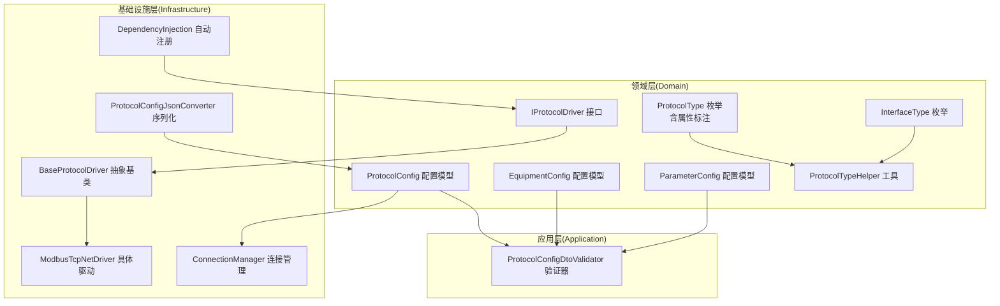
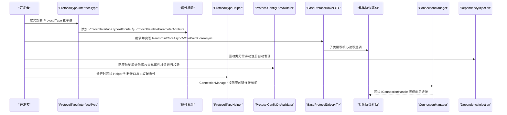
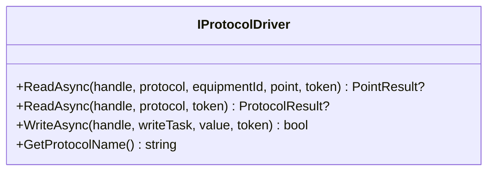
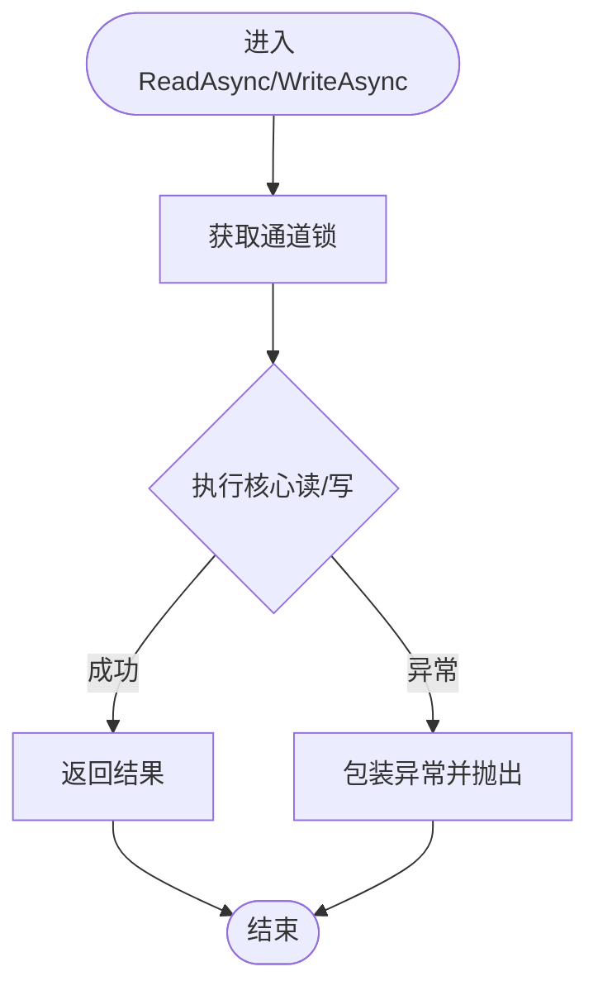
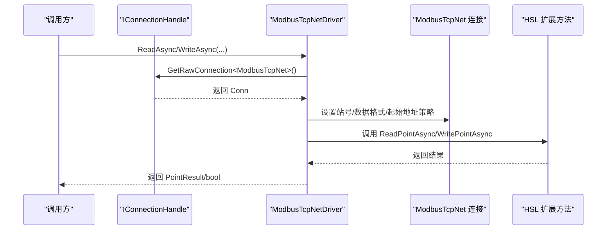
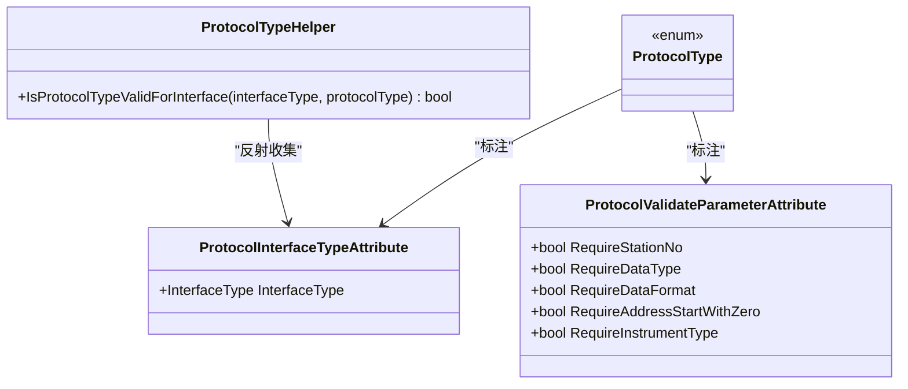
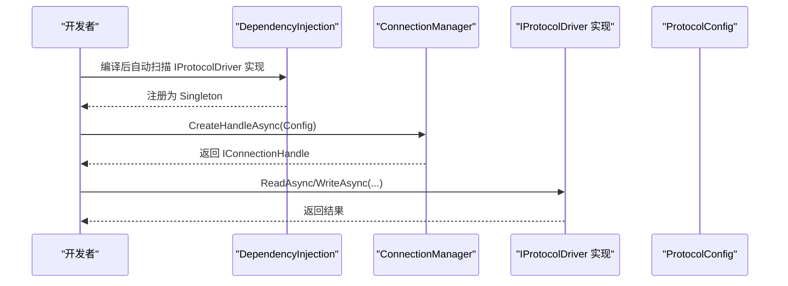
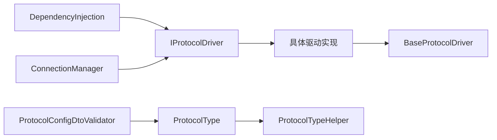

# 协议扩展开发

<cite>
**本文引用的文件**
- [IProtocolDriver.cs](file://IndustrialDataSolution/IndustrialDataProcessor.Domain/Communication/IConnection/IProtocolDriver.cs)
- [BaseProtocolDriver.cs](file://IndustrialDataSolution/IndustrialDataProcessor.Infrastructure/Communication/Drivers/TcpCommon/BaseProtocolDriver.cs)
- [ModbusTcpNetDriver.cs](file://IndustrialDataSolution/IndustrialDataProcessor.Infrastructure/Communication/Drivers/TcpCommon/ModbusTcpNetDriver.cs)
- [ProtocolInterfaceTypeAttribute.cs](file://IndustrialDataSolution/IndustrialDataProcessor.Domain/Attributes/ProtocolInterfaceTypeAttribute.cs)
- [ProtocolValidateParameterAttribute.cs](file://IndustrialDataSolution/IndustrialDataProcessor.Domain/Attributes/ProtocolValidateParameterAttribute.cs)
- [ProtocolTypeHelper.cs](file://IndustrialDataSolution/IndustrialDataProcessor.Domain/Helpers/ProtocolTypeHelper.cs)
- [ProtocolType.cs](file://IndustrialDataSolution/IndustrialDataProcessor.Domain/Enums/ProtocolType.cs)
- [InterfaceType.cs](file://IndustrialDataSolution/IndustrialDataProcessor.Domain/Enums/InterfaceType.cs)
- [ProtocolConfig.cs](file://IndustrialDataSolution/IndustrialDataProcessor.Domain/Workstation/Configs/ProtocolConfig.cs)
- [EquipmentConfig.cs](file://IndustrialDataSolution/IndustrialDataProcessor.Domain/Workstation/Configs/EquipmentConfig.cs)
- [ParameterConfig.cs](file://IndustrialDataSolution/IndustrialDataProcessor.Domain/Workstation/Configs/ParameterConfig.cs)
- [ProtocolConfigDtoValidator.cs](file://IndustrialDataSolution/IndustrialDataProcessor.Application/Validators/ProtocolConfigDtoValidator.cs)
- [ConnectionManager.cs](file://IndustrialDataSolution/IndustrialDataProcessor.Infrastructure/Communication/Connection/ConnectionManager.cs)
- [DependencyInjection.cs](file://IndustrialDataSolution/IndustrialDataProcessor.Infrastructure/DependencyInjection.cs)
- [ProtocolConfigJsonConverter.cs](file://IndustrialDataSolution/IndustrialDataProcessor.Infrastructure/Serialization/Converters/ProtocolConfigJsonConverter.cs)
- [ModbusTcpDriverIntegrationTests.cs](file://IndustrialDataSolution/IndustrialDataProcessor.Infrastructure.Tests/Integration/ModbusTcpDriverIntegrationTests.cs)
</cite>

## 目录
1. [简介](#简介)
2. [项目结构](#项目结构)
3. [核心组件](#核心组件)
4. [架构总览](#架构总览)
5. [详细组件分析](#详细组件分析)
6. [依赖分析](#依赖分析)
7. [性能考虑](#性能考虑)
8. [故障排查指南](#故障排查指南)
9. [结论](#结论)
10. [附录](#附录)

## 简介
本指南面向希望为系统添加新协议驱动程序的开发者，目标是提供从接口实现、属性标注、参数校验、注册集成到测试调试的完整开发流程。文档基于现有代码库中的领域模型、驱动基类、属性标注、配置模型与验证器，帮助你快速、安全地扩展新的协议类型。

## 项目结构
围绕协议扩展开发的关键目录与文件如下：
- 领域层（Domain）
  - 通信接口与驱动契约：IProtocolDriver
  - 属性标注：ProtocolInterfaceTypeAttribute、ProtocolValidateParameterAttribute
  - 协议与接口枚举：ProtocolType、InterfaceType
  - 配置模型：ProtocolConfig、EquipmentConfig、ParameterConfig
  - 辅助工具：ProtocolTypeHelper
- 基础设施层（Infrastructure）
  - 驱动基类：BaseProtocolDriver<TConnection>
  - 具体驱动示例：ModbusTcpNetDriver
  - 连接管理：ConnectionManager
  - 依赖注入：DependencyInjection（自动注册IProtocolDriver）
  - 序列化转换器：ProtocolConfigJsonConverter
- 应用层（Application）
  - 配置验证器：ProtocolConfigDtoValidator

图表来源
- [IProtocolDriver.cs](file://IndustrialDataSolution/IndustrialDataProcessor.Domain/Communication/IConnection/IProtocolDriver.cs#L1-L14)
- [BaseProtocolDriver.cs](file://IndustrialDataSolution/IndustrialDataProcessor.Infrastructure/Communication/Drivers/TcpCommon/BaseProtocolDriver.cs#L1-L108)
- [ModbusTcpNetDriver.cs](file://IndustrialDataSolution/IndustrialDataProcessor.Infrastructure/Communication/Drivers/TcpCommon/ModbusTcpNetDriver.cs#L1-L41)
- [ProtocolType.cs](file://IndustrialDataSolution/IndustrialDataProcessor.Domain/Enums/ProtocolType.cs#L1-L231)
- [InterfaceType.cs](file://IndustrialDataSolution/IndustrialDataProcessor.Domain/Enums/InterfaceType.cs#L1-L32)
- [ProtocolConfig.cs](file://IndustrialDataSolution/IndustrialDataProcessor.Domain/Workstation/Configs/ProtocolConfig.cs#L1-L64)
- [EquipmentConfig.cs](file://IndustrialDataSolution/IndustrialDataProcessor.Domain/Workstation/Configs/EquipmentConfig.cs#L1-L34)
- [ParameterConfig.cs](file://IndustrialDataSolution/IndustrialDataProcessor.Domain/Workstation/Configs/ParameterConfig.cs#L1-L84)
- [ProtocolTypeHelper.cs](file://IndustrialDataSolution/IndustrialDataProcessor.Domain/Helpers/ProtocolTypeHelper.cs#L1-L35)
- [ConnectionManager.cs](file://IndustrialDataSolution/IndustrialDataProcessor.Infrastructure/Communication/Connection/ConnectionManager.cs#L34-L67)
- [DependencyInjection.cs](file://IndustrialDataSolution/IndustrialDataProcessor.Infrastructure/DependencyInjection.cs#L46-L81)
- [ProtocolConfigJsonConverter.cs](file://IndustrialDataSolution/IndustrialDataProcessor.Infrastructure/Serialization/Converters/ProtocolConfigJsonConverter.cs)

章节来源
- [IProtocolDriver.cs](file://IndustrialDataSolution/IndustrialDataProcessor.Domain/Communication/IConnection/IProtocolDriver.cs#L1-L14)
- [ProtocolType.cs](file://IndustrialDataSolution/IndustrialDataProcessor.Domain/Enums/ProtocolType.cs#L1-L231)
- [InterfaceType.cs](file://IndustrialDataSolution/IndustrialDataProcessor.Domain/Enums/InterfaceType.cs#L1-L32)
- [ProtocolConfig.cs](file://IndustrialDataSolution/IndustrialDataProcessor.Domain/Workstation/Configs/ProtocolConfig.cs#L1-L64)
- [EquipmentConfig.cs](file://IndustrialDataSolution/IndustrialDataProcessor.Domain/Workstation/Configs/EquipmentConfig.cs#L1-L34)
- [ParameterConfig.cs](file://IndustrialDataSolution/IndustrialDataProcessor.Domain/Workstation/Configs/ParameterConfig.cs#L1-L84)
- [ProtocolTypeHelper.cs](file://IndustrialDataSolution/IndustrialDataProcessor.Domain/Helpers/ProtocolTypeHelper.cs#L1-L35)
- [BaseProtocolDriver.cs](file://IndustrialDataSolution/IndustrialDataProcessor.Infrastructure/Communication/Drivers/TcpCommon/BaseProtocolDriver.cs#L1-L108)
- [ModbusTcpNetDriver.cs](file://IndustrialDataSolution/IndustrialDataProcessor.Infrastructure/Communication/Drivers/TcpCommon/ModbusTcpNetDriver.cs#L1-L41)
- [ConnectionManager.cs](file://IndustrialDataSolution/IndustrialDataProcessor.Infrastructure/Communication/Connection/ConnectionManager.cs#L34-L67)
- [DependencyInjection.cs](file://IndustrialDataSolution/IndustrialDataProcessor.Infrastructure/DependencyInjection.cs#L46-L81)
- [ProtocolConfigDtoValidator.cs](file://IndustrialDataSolution/IndustrialDataProcessor.Application/Validators/ProtocolConfigDtoValidator.cs#L1-L164)

## 核心组件
- IProtocolDriver：协议驱动的统一契约，定义读写与协议名查询能力。
- BaseProtocolDriver<TConnection>：协议驱动的抽象基类，封装通用流程（并发锁、异常包装、读写编排），子类仅需实现核心读写逻辑。
- ProtocolType 与 InterfaceType：协议类型与接口类型的枚举，配合属性标注进行约束与校验。
- ProtocolTypeHelper：运行时根据属性标注构建接口类型到协议类型的映射，用于接口与协议的兼容性校验。
- 配置模型：ProtocolConfig、EquipmentConfig、ParameterConfig 描述协议、设备与变量的配置项。
- 验证器：ProtocolConfigDtoValidator 对配置进行跨字段、接口类型与协议类型兼容性校验。
- 连接管理：ConnectionManager 根据配置类型与协议类型创建对应连接句柄。
- 依赖注入：自动扫描并注册所有 IProtocolDriver 实现，简化集成。

章节来源
- [IProtocolDriver.cs](file://IndustrialDataSolution/IndustrialDataProcessor.Domain/Communication/IConnection/IProtocolDriver.cs#L1-L14)
- [BaseProtocolDriver.cs](file://IndustrialDataSolution/IndustrialDataProcessor.Infrastructure/Communication/Drivers/TcpCommon/BaseProtocolDriver.cs#L1-L108)
- [ProtocolType.cs](file://IndustrialDataSolution/IndustrialDataProcessor.Domain/Enums/ProtocolType.cs#L1-L231)
- [InterfaceType.cs](file://IndustrialDataSolution/IndustrialDataProcessor.Domain/Enums/InterfaceType.cs#L1-L32)
- [ProtocolTypeHelper.cs](file://IndustrialDataSolution/IndustrialDataProcessor.Domain/Helpers/ProtocolTypeHelper.cs#L1-L35)
- [ProtocolConfig.cs](file://IndustrialDataSolution/IndustrialDataProcessor.Domain/Workstation/Configs/ProtocolConfig.cs#L1-L64)
- [EquipmentConfig.cs](file://IndustrialDataSolution/IndustrialDataProcessor.Domain/Workstation/Configs/EquipmentConfig.cs#L1-L34)
- [ParameterConfig.cs](file://IndustrialDataSolution/IndustrialDataProcessor.Domain/Workstation/Configs/ParameterConfig.cs#L1-L84)
- [ProtocolConfigDtoValidator.cs](file://IndustrialDataSolution/IndustrialDataProcessor.Application/Validators/ProtocolConfigDtoValidator.cs#L1-L164)
- [ConnectionManager.cs](file://IndustrialDataSolution/IndustrialDataProcessor.Infrastructure/Communication/Connection/ConnectionManager.cs#L34-L67)
- [DependencyInjection.cs](file://IndustrialDataSolution/IndustrialDataProcessor.Infrastructure/DependencyInjection.cs#L46-L81)

## 架构总览
下图展示了协议扩展开发的端到端流程：从配置模型、验证器、接口与协议枚举的属性标注，到驱动基类与具体驱动实现，再到连接管理与依赖注入注册。

图表来源
- [ProtocolType.cs](file://IndustrialDataSolution/IndustrialDataProcessor.Domain/Enums/ProtocolType.cs#L1-L231)
- [ProtocolInterfaceTypeAttribute.cs](file://IndustrialDataSolution/IndustrialDataProcessor.Domain/Attributes/ProtocolInterfaceTypeAttribute.cs#L1-L19)
- [ProtocolValidateParameterAttribute.cs](file://IndustrialDataSolution/IndustrialDataProcessor.Domain/Attributes/ProtocolValidateParameterAttribute.cs#L1-L28)
- [ProtocolTypeHelper.cs](file://IndustrialDataSolution/IndustrialDataProcessor.Domain/Helpers/ProtocolTypeHelper.cs#L1-L35)
- [ProtocolConfigDtoValidator.cs](file://IndustrialDataSolution/IndustrialDataProcessor.Application/Validators/ProtocolConfigDtoValidator.cs#L1-L164)
- [BaseProtocolDriver.cs](file://IndustrialDataSolution/IndustrialDataProcessor.Infrastructure/Communication/Drivers/TcpCommon/BaseProtocolDriver.cs#L1-L108)
- [ConnectionManager.cs](file://IndustrialDataSolution/IndustrialDataProcessor.Infrastructure/Communication/Connection/ConnectionManager.cs#L34-L67)
- [DependencyInjection.cs](file://IndustrialDataSolution/IndustrialDataProcessor.Infrastructure/DependencyInjection.cs#L46-L81)

## 详细组件分析

### IProtocolDriver 接口与实现模式
- 角色定位：定义协议驱动的最小能力集合，包括点位读取、批量读取（部分协议支持）、点位写入与协议名查询。
- 设计要点：方法签名明确输入输出与异常传播；协议名用于日志与错误提示。

图表来源
- [IProtocolDriver.cs](file://IndustrialDataSolution/IndustrialDataProcessor.Domain/Communication/IConnection/IProtocolDriver.cs#L1-L14)

章节来源
- [IProtocolDriver.cs](file://IndustrialDataSolution/IndustrialDataProcessor.Domain/Communication/IConnection/IProtocolDriver.cs#L1-L14)

### BaseProtocolDriver<TConnection> 抽象基类
- 模板方法：封装读写流程，包括通道锁获取、异常包装与默认不支持整包读取的约定。
- 并发控制：通过 IConnectionHandle.AcquireLockAsync 保证同一通道的串行化访问。
- 可扩展点：子类仅需实现 ReadPointCoreAsync 与 WritePointCoreAsync。
- 虚拟点写入：对包含特定关键字的地址进行特殊处理，避免真实网络写入。

图表来源
- [BaseProtocolDriver.cs](file://IndustrialDataSolution/IndustrialDataProcessor.Infrastructure/Communication/Drivers/TcpCommon/BaseProtocolDriver.cs#L24-L85)

章节来源
- [BaseProtocolDriver.cs](file://IndustrialDataSolution/IndustrialDataProcessor.Infrastructure/Communication/Drivers/TcpCommon/BaseProtocolDriver.cs#L1-L108)

### 具体驱动实现示例：ModbusTcpNetDriver
- 读取流程：从连接句柄获取底层连接实例，设置站号、数据格式与起始地址策略，再调用扩展方法读取点位。
- 写入流程：同理设置参数后调用扩展方法写入。
- 与 HSL 扩展方法协作：通过扩展方法实现与第三方库的解耦。

图表来源
- [ModbusTcpNetDriver.cs](file://IndustrialDataSolution/IndustrialDataProcessor.Infrastructure/Communication/Drivers/TcpCommon/ModbusTcpNetDriver.cs#L1-L41)

章节来源
- [ModbusTcpNetDriver.cs](file://IndustrialDataSolution/IndustrialDataProcessor.Infrastructure/Communication/Drivers/TcpCommon/ModbusTcpNetDriver.cs#L1-L41)

### 协议属性配置与参数验证
- 属性标注
  - ProtocolInterfaceTypeAttribute：为 ProtocolType 的每个枚举值标注其所属接口类型（LAN/COM/API/DATABASE）。
  - ProtocolValidateParameterAttribute：为 ProtocolType 的每个枚举值标注参数校验要求（如是否必须站号、数据格式、数据类型、起始地址是否从0开始、是否需要仪表类型等）。
- 运行时映射：ProtocolTypeHelper 在静态构造函数中反射枚举字段，收集属性标注，建立 InterfaceType 到 ProtocolType 的集合映射。
- 验证器：ProtocolConfigDtoValidator 基于枚举与 Helper 的映射，校验接口类型与协议类型的兼容性；并对各接口类型下的字段进行格式与范围校验。

图表来源
- [ProtocolType.cs](file://IndustrialDataSolution/IndustrialDataProcessor.Domain/Enums/ProtocolType.cs#L1-L231)
- [ProtocolInterfaceTypeAttribute.cs](file://IndustrialDataSolution/IndustrialDataProcessor.Domain/Attributes/ProtocolInterfaceTypeAttribute.cs#L1-L19)
- [ProtocolValidateParameterAttribute.cs](file://IndustrialDataSolution/IndustrialDataProcessor.Domain/Attributes/ProtocolValidateParameterAttribute.cs#L1-L28)
- [ProtocolTypeHelper.cs](file://IndustrialDataSolution/IndustrialDataProcessor.Domain/Helpers/ProtocolTypeHelper.cs#L1-L35)

章节来源
- [ProtocolType.cs](file://IndustrialDataSolution/IndustrialDataProcessor.Domain/Enums/ProtocolType.cs#L1-L231)
- [ProtocolInterfaceTypeAttribute.cs](file://IndustrialDataSolution/IndustrialDataProcessor.Domain/Attributes/ProtocolInterfaceTypeAttribute.cs#L1-L19)
- [ProtocolValidateParameterAttribute.cs](file://IndustrialDataSolution/IndustrialDataProcessor.Domain/Attributes/ProtocolValidateParameterAttribute.cs#L1-L28)
- [ProtocolTypeHelper.cs](file://IndustrialDataSolution/IndustrialDataProcessor.Domain/Helpers/ProtocolTypeHelper.cs#L1-L35)
- [ProtocolConfigDtoValidator.cs](file://IndustrialDataSolution/IndustrialDataProcessor.Application/Validators/ProtocolConfigDtoValidator.cs#L1-L164)

### 协议配置参数设计原则与验证机制
- 设计原则
  - 必填与可选分离：明确 Id、ProtocolType、InterfaceType、Equipments 等必填项；其余为可选。
  - 默认值合理：如通信延时、接收超时、连接超时提供默认值，便于快速接入。
  - 可扩展参数：AdditionalOptions 支持协议厂商或现场定制参数。
  - 设备与变量层次清晰：EquipmentConfig 包含设备基本信息与变量列表，ParameterConfig 描述变量的地址、数据类型、表达式等。
- 验证机制
  - 类型校验：枚举值合法性检查。
  - 兼容性校验：接口类型与协议类型映射校验。
  - 字段范围校验：超时、端口、波特率等数值范围校验。
  - 条件校验：不同接口类型（LAN/COM/API/DATABASE）下的条件字段校验。
  - 互斥与必选：数据库连接方式（连接字符串或分离字段）至少提供一种。

章节来源
- [ProtocolConfig.cs](file://IndustrialDataSolution/IndustrialDataProcessor.Domain/Workstation/Configs/ProtocolConfig.cs#L1-L64)
- [EquipmentConfig.cs](file://IndustrialDataSolution/IndustrialDataProcessor.Domain/Workstation/Configs/EquipmentConfig.cs#L1-L34)
- [ParameterConfig.cs](file://IndustrialDataSolution/IndustrialDataProcessor.Domain/Workstation/Configs/ParameterConfig.cs#L1-L84)
- [ProtocolConfigDtoValidator.cs](file://IndustrialDataSolution/IndustrialDataProcessor.Application/Validators/ProtocolConfigDtoValidator.cs#L1-L164)

### 新协议类型的注册与集成流程
- 定义枚举与标注
  - 在 ProtocolType 中新增枚举值，并添加 ProtocolInterfaceTypeAttribute 与 ProtocolValidateParameterAttribute。
- 实现驱动
  - 继承 BaseProtocolDriver<TConnection>，实现 ReadPointCoreAsync 与 WritePointCoreAsync。
  - 如需整包读取，可覆写 ReadAsync(IConnectionHandle, ProtocolConfig, CancellationToken)。
- 集成与注册
  - 依赖注入自动扫描并注册 IProtocolDriver 实现，无需手动注册。
- 配置与序列化
  - 使用 ProtocolConfigJsonConverter 支持协议配置的序列化与反序列化。
- 连接管理
  - ConnectionManager 根据配置类型与协议类型创建连接句柄，确保底层连接正确初始化。

图表来源
- [DependencyInjection.cs](file://IndustrialDataSolution/IndustrialDataProcessor.Infrastructure/DependencyInjection.cs#L46-L81)
- [ConnectionManager.cs](file://IndustrialDataSolution/IndustrialDataProcessor.Infrastructure/Communication/Connection/ConnectionManager.cs#L34-L67)
- [IProtocolDriver.cs](file://IndustrialDataSolution/IndustrialDataProcessor.Domain/Communication/IConnection/IProtocolDriver.cs#L1-L14)

章节来源
- [ProtocolType.cs](file://IndustrialDataSolution/IndustrialDataProcessor.Domain/Enums/ProtocolType.cs#L1-L231)
- [BaseProtocolDriver.cs](file://IndustrialDataSolution/IndustrialDataProcessor.Infrastructure/Communication/Drivers/TcpCommon/BaseProtocolDriver.cs#L1-L108)
- [DependencyInjection.cs](file://IndustrialDataSolution/IndustrialDataProcessor.Infrastructure/DependencyInjection.cs#L46-L81)
- [ConnectionManager.cs](file://IndustrialDataSolution/IndustrialDataProcessor.Infrastructure/Communication/Connection/ConnectionManager.cs#L34-L67)
- [ProtocolConfigJsonConverter.cs](file://IndustrialDataSolution/IndustrialDataProcessor.Infrastructure/Serialization/Converters/ProtocolConfigJsonConverter.cs)

### 开发示例：从接口实现到配置集成的全流程
- 第一步：在 ProtocolType 中新增枚举值并添加属性标注
  - 参考路径：[ProtocolType.cs](file://IndustrialDataSolution/IndustrialDataProcessor.Domain/Enums/ProtocolType.cs#L1-L231)
- 第二步：实现驱动类
  - 继承 BaseProtocolDriver<TConnection>，实现核心读写逻辑
  - 参考路径：[BaseProtocolDriver.cs](file://IndustrialDataSolution/IndustrialDataProcessor.Infrastructure/Communication/Drivers/TcpCommon/BaseProtocolDriver.cs#L1-L108)，[ModbusTcpNetDriver.cs](file://IndustrialDataSolution/IndustrialDataProcessor.Infrastructure/Communication/Drivers/TcpCommon/ModbusTcpNetDriver.cs#L1-L41)
- 第三步：配置验证与兼容性
  - 验证器会自动依据枚举与属性标注进行校验
  - 参考路径：[ProtocolConfigDtoValidator.cs](file://IndustrialDataSolution/IndustrialDataProcessor.Application/Validators/ProtocolConfigDtoValidator.cs#L1-L164)，[ProtocolTypeHelper.cs](file://IndustrialDataSolution/IndustrialDataProcessor.Domain/Helpers/ProtocolTypeHelper.cs#L1-L35)
- 第四步：连接与序列化
  - ConnectionManager 创建连接句柄
  - ProtocolConfigJsonConverter 支持配置序列化
  - 参考路径：[ConnectionManager.cs](file://IndustrialDataSolution/IndustrialDataProcessor.Infrastructure/Communication/Connection/ConnectionManager.cs#L34-L67)，[ProtocolConfigJsonConverter.cs](file://IndustrialDataSolution/IndustrialDataProcessor.Infrastructure/Serialization/Converters/ProtocolConfigJsonConverter.cs)
- 第五步：注册与使用
  - 依赖注入自动注册 IProtocolDriver 实现
  - 参考路径：[DependencyInjection.cs](file://IndustrialDataSolution/IndustrialDataProcessor.Infrastructure/DependencyInjection.cs#L46-L81)

章节来源
- [ProtocolType.cs](file://IndustrialDataSolution/IndustrialDataProcessor.Domain/Enums/ProtocolType.cs#L1-L231)
- [BaseProtocolDriver.cs](file://IndustrialDataSolution/IndustrialDataProcessor.Infrastructure/Communication/Drivers/TcpCommon/BaseProtocolDriver.cs#L1-L108)
- [ModbusTcpNetDriver.cs](file://IndustrialDataSolution/IndustrialDataProcessor.Infrastructure/Communication/Drivers/TcpCommon/ModbusTcpNetDriver.cs#L1-L41)
- [ProtocolConfigDtoValidator.cs](file://IndustrialDataSolution/IndustrialDataProcessor.Application/Validators/ProtocolConfigDtoValidator.cs#L1-L164)
- [ProtocolTypeHelper.cs](file://IndustrialDataSolution/IndustrialDataProcessor.Domain/Helpers/ProtocolTypeHelper.cs#L1-L35)
- [ConnectionManager.cs](file://IndustrialDataSolution/IndustrialDataProcessor.Infrastructure/Communication/Connection/ConnectionManager.cs#L34-L67)
- [ProtocolConfigJsonConverter.cs](file://IndustrialDataSolution/IndustrialDataProcessor.Infrastructure/Serialization/Converters/ProtocolConfigJsonConverter.cs)
- [DependencyInjection.cs](file://IndustrialDataSolution/IndustrialDataProcessor.Infrastructure/DependencyInjection.cs#L46-L81)

## 依赖分析
- 组件耦合
  - 驱动实现依赖 IProtocolDriver 与 BaseProtocolDriver<TConnection>，遵循开闭原则，易于扩展。
  - ConnectionManager 依赖配置模型与协议类型，负责连接创建与分发。
  - 验证器依赖枚举与 Helper，确保配置合法。
- 自动注册
  - 通过反射扫描 IProtocolDriver 实现并注册为 Singleton，降低集成成本。
- 可能的循环依赖
  - 当前结构清晰，未见直接循环依赖；若后续扩展请保持接口与实现分离。

图表来源
- [DependencyInjection.cs](file://IndustrialDataSolution/IndustrialDataProcessor.Infrastructure/DependencyInjection.cs#L46-L81)
- [IProtocolDriver.cs](file://IndustrialDataSolution/IndustrialDataProcessor.Domain/Communication/IConnection/IProtocolDriver.cs#L1-L14)
- [BaseProtocolDriver.cs](file://IndustrialDataSolution/IndustrialDataProcessor.Infrastructure/Communication/Drivers/TcpCommon/BaseProtocolDriver.cs#L1-L108)
- [ConnectionManager.cs](file://IndustrialDataSolution/IndustrialDataProcessor.Infrastructure/Communication/Connection/ConnectionManager.cs#L34-L67)
- [ProtocolConfigDtoValidator.cs](file://IndustrialDataSolution/IndustrialDataProcessor.Application/Validators/ProtocolConfigDtoValidator.cs#L1-L164)
- [ProtocolType.cs](file://IndustrialDataSolution/IndustrialDataProcessor.Domain/Enums/ProtocolType.cs#L1-L231)
- [ProtocolTypeHelper.cs](file://IndustrialDataSolution/IndustrialDataProcessor.Domain/Helpers/ProtocolTypeHelper.cs#L1-L35)

章节来源
- [DependencyInjection.cs](file://IndustrialDataSolution/IndustrialDataProcessor.Infrastructure/DependencyInjection.cs#L46-L81)
- [ConnectionManager.cs](file://IndustrialDataSolution/IndustrialDataProcessor.Infrastructure/Communication/Connection/ConnectionManager.cs#L34-L67)
- [ProtocolConfigDtoValidator.cs](file://IndustrialDataSolution/IndustrialDataProcessor.Application/Validators/ProtocolConfigDtoValidator.cs#L1-L164)
- [ProtocolTypeHelper.cs](file://IndustrialDataSolution/IndustrialDataProcessor.Domain/Helpers/ProtocolTypeHelper.cs#L1-L35)

## 性能考虑
- 并发与锁
  - 基类已通过通道锁避免同一连接的并发冲突，建议子类不要在核心逻辑中重复加锁。
- 超时与重试
  - 合理设置通信延时、接收超时与连接超时，避免阻塞与资源浪费。
- 序列化
  - 使用统一的 JsonSerializerOptions 与转换器，减少序列化开销与不一致风险。
- 虚拟点优化
  - 对虚拟点写入快速返回，避免不必要的网络交互。

## 故障排查指南
- 常见问题
  - 接口类型与协议类型不匹配：检查枚举标注与 Helper 映射。
  - 配置字段缺失或格式错误：查看验证器错误消息，逐项修正。
  - 并发读写异常：确认是否正确使用通道锁；避免在驱动内自行加锁。
  - 连接创建失败：检查 ConnectionManager 的配置分支与底层连接初始化。
- 调试建议
  - 使用单元测试与集成测试覆盖典型场景与并发场景。
  - 参考现有测试用例结构，编写针对新协议的测试。
  - 参考路径：[ModbusTcpDriverIntegrationTests.cs](file://IndustrialDataSolution/IndustrialDataProcessor.Infrastructure.Tests/Integration/ModbusTcpDriverIntegrationTests.cs#L62-L117)

章节来源
- [ProtocolConfigDtoValidator.cs](file://IndustrialDataSolution/IndustrialDataProcessor.Application/Validators/ProtocolConfigDtoValidator.cs#L1-L164)
- [BaseProtocolDriver.cs](file://IndustrialDataSolution/IndustrialDataProcessor.Infrastructure/Communication/Drivers/TcpCommon/BaseProtocolDriver.cs#L24-L85)
- [ConnectionManager.cs](file://IndustrialDataSolution/IndustrialDataProcessor.Infrastructure/Communication/Connection/ConnectionManager.cs#L34-L67)
- [ModbusTcpDriverIntegrationTests.cs](file://IndustrialDataSolution/IndustrialDataProcessor.Infrastructure.Tests/Integration/ModbusTcpDriverIntegrationTests.cs#L62-L117)

## 结论
通过属性标注、驱动基类与验证器的协同，系统提供了清晰、可扩展的协议扩展框架。开发者只需关注协议核心读写逻辑与必要的参数校验，即可快速完成新协议的实现与集成，并获得完善的配置校验与运行时兼容性保障。

## 附录
- 关键实现路径参考
  - 接口契约：[IProtocolDriver.cs](file://IndustrialDataSolution/IndustrialDataProcessor.Domain/Communication/IConnection/IProtocolDriver.cs#L1-L14)
  - 抽象基类：[BaseProtocolDriver.cs](file://IndustrialDataSolution/IndustrialDataProcessor.Infrastructure/Communication/Drivers/TcpCommon/BaseProtocolDriver.cs#L1-L108)
  - 示例驱动：[ModbusTcpNetDriver.cs](file://IndustrialDataSolution/IndustrialDataProcessor.Infrastructure/Communication/Drivers/TcpCommon/ModbusTcpNetDriver.cs#L1-L41)
  - 枚举与标注：[ProtocolType.cs](file://IndustrialDataSolution/IndustrialDataProcessor.Domain/Enums/ProtocolType.cs#L1-L231)，[ProtocolInterfaceTypeAttribute.cs](file://IndustrialDataSolution/IndustrialDataProcessor.Domain/Attributes/ProtocolInterfaceTypeAttribute.cs#L1-L19)，[ProtocolValidateParameterAttribute.cs](file://IndustrialDataSolution/IndustrialDataProcessor.Domain/Attributes/ProtocolValidateParameterAttribute.cs#L1-L28)
  - 兼容性工具：[ProtocolTypeHelper.cs](file://IndustrialDataSolution/IndustrialDataProcessor.Domain/Helpers/ProtocolTypeHelper.cs#L1-L35)
  - 配置模型：[ProtocolConfig.cs](file://IndustrialDataSolution/IndustrialDataProcessor.Domain/Workstation/Configs/ProtocolConfig.cs#L1-L64)，[EquipmentConfig.cs](file://IndustrialDataSolution/IndustrialDataProcessor.Domain/Workstation/Configs/EquipmentConfig.cs#L1-L34)，[ParameterConfig.cs](file://IndustrialDataSolution/IndustrialDataProcessor.Domain/Workstation/Configs/ParameterConfig.cs#L1-L84)
  - 验证器：[ProtocolConfigDtoValidator.cs](file://IndustrialDataSolution/IndustrialDataProcessor.Application/Validators/ProtocolConfigDtoValidator.cs#L1-L164)
  - 连接管理：[ConnectionManager.cs](file://IndustrialDataSolution/IndustrialDataProcessor.Infrastructure/Communication/Connection/ConnectionManager.cs#L34-L67)
  - 依赖注入：[DependencyInjection.cs](file://IndustrialDataSolution/IndustrialDataProcessor.Infrastructure/DependencyInjection.cs#L46-L81)
  - 序列化转换器：[ProtocolConfigJsonConverter.cs](file://IndustrialDataSolution/IndustrialDataProcessor.Infrastructure/Serialization/Converters/ProtocolConfigJsonConverter.cs)
  - 测试参考：[ModbusTcpDriverIntegrationTests.cs](file://IndustrialDataSolution/IndustrialDataProcessor.Infrastructure.Tests/Integration/ModbusTcpDriverIntegrationTests.cs#L62-L117)