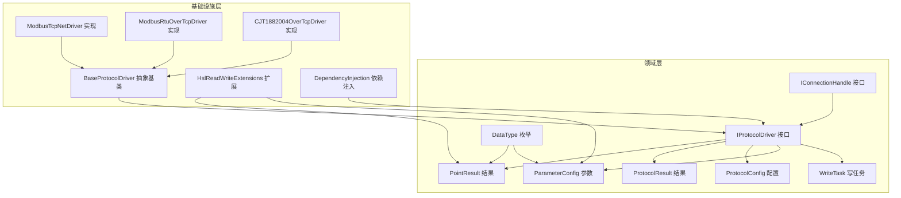
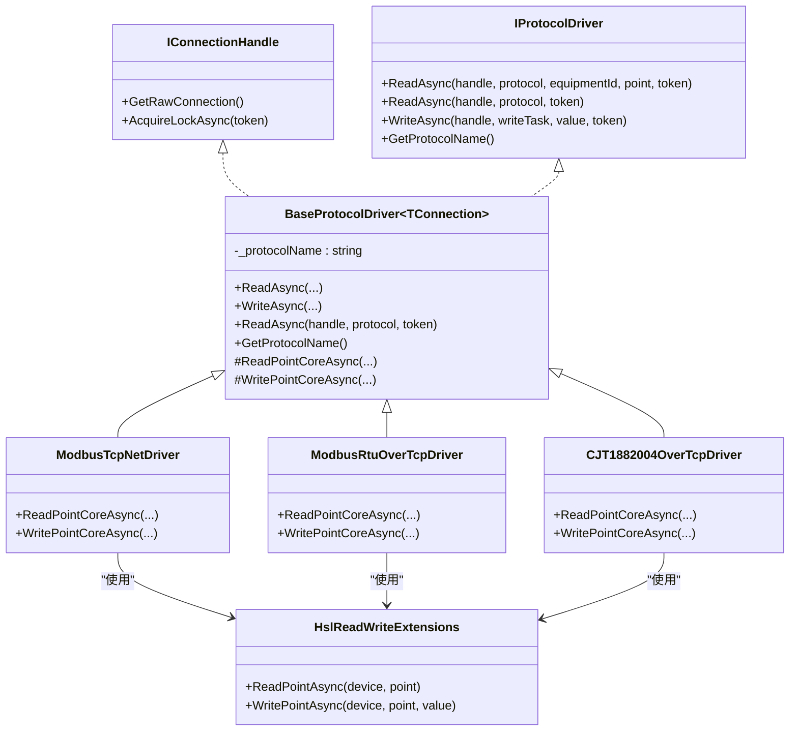
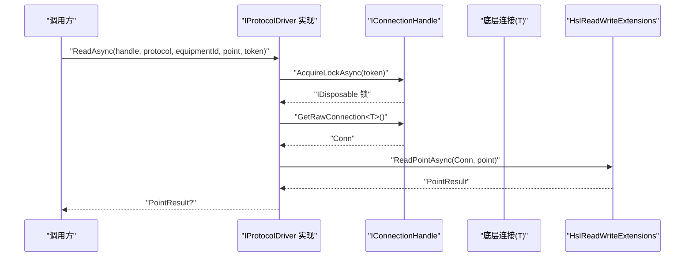
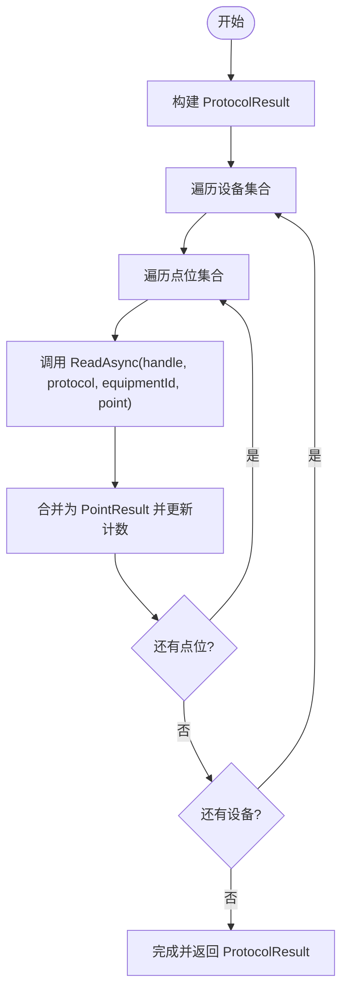
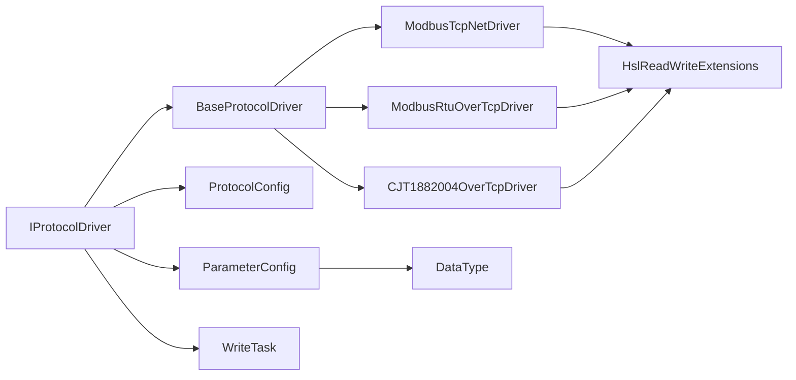

# 协议接口设计

<cite>
**本文引用的文件**
- [IProtocolDriver.cs](file://IndustrialDataSolution/IndustrialDataProcessor.Domain/Communication/IConnection/IProtocolDriver.cs)
- [PointResult.cs](file://IndustrialDataProcessor.Domain/Workstation/Results/PointResult.cs)
- [ProtocolResult.cs](file://IndustrialDataProcessor.Domain/Workstation/Results/ProtocolResult.cs)
- [BaseProtocolDriver.cs](file://IndustrialDataSolution/IndustrialDataProcessor.Infrastructure/Communication/Drivers/TcpCommon/BaseProtocolDriver.cs)
- [ModbusTcpNetDriver.cs](file://IndustrialDataSolution/IndustrialDataProcessor.Infrastructure/Communication/Drivers/TcpCommon/ModbusTcpNetDriver.cs)
- [ModbusRtuOverTcpDriver.cs](file://IndustrialDataSolution/IndustrialDataProcessor.Infrastructure/Communication/Drivers/TcpCommon/ModbusRtuOverTcpDriver.cs)
- [CJT1882004OverTcpDriver.cs](file://IndustrialDataSolution/IndustrialDataProcessor.Infrastructure/Communication/Drivers/TcpCommon/CJT1882004OverTcpDriver.cs)
- [HslReadWriteExtensions.cs](file://IndustrialDataSolution/IndustrialDataProcessor.Infrastructure/Communication/Extensions/HslReadWriteExtensions.cs)
- [IConnectionHandle.cs](file://IndustrialDataProcessor.Domain/Communication/IConnection/IConnectionHandle.cs)
- [ProtocolConfig.cs](file://IndustrialDataProcessor.Domain/Workstation/Configs/ProtocolConfig.cs)
- [ParameterConfig.cs](file://IndustrialDataProcessor.Domain/Workstation/Configs/ParameterConfig.cs)
- [WriteTask.cs](file://IndustrialDataSolution/IndustrialDataProcessor.Domain/Workstation/WriteTask.cs)
- [DataType.cs](file://IndustrialDataProcessor.Domain/Enums/DataType.cs)
- [DependencyInjection.cs](file://IndustrialDataSolution/IndustrialDataProcessor.Infrastructure/DependencyInjection.cs)
</cite>

## 更新摘要
**变更内容**
- 增强 BaseProtocolDriver 的协议名称自动提取功能，通过反射从类名中自动推导协议名称
- 减少手动配置需求，提升代码维护性
- 优化协议名称获取方法的实现机制

## 目录
1. [引言](#引言)
2. [项目结构](#项目结构)
3. [核心组件](#核心组件)
4. [架构总览](#架构总览)
5. [详细组件分析](#详细组件分析)
6. [依赖关系分析](#依赖关系分析)
7. [性能考量](#性能考量)
8. [故障排查指南](#故障排查指南)
9. [结论](#结论)
10. [附录](#附录)

## 引言
本文件围绕协议驱动架构中的 IProtocolDriver 接口进行系统化设计文档编写，重点阐释以下内容：
- IProtocolDriver 的设计理念与核心方法定义，包括 ReadAsync、WriteAsync 的参数与返回值设计
- 多态性实现机制：通过统一接口抽象不同协议的读写操作
- PointResult 与 ProtocolResult 数据结构的设计目的与使用场景
- 协议名称获取方法 GetProtocolName 的作用与命名规范
- 接口实现的最佳实践与注意事项
- 接口扩展的设计原则与向后兼容性考虑

## 项目结构
本项目采用分层与领域驱动设计（DDD）结合的组织方式，协议驱动相关代码主要分布在以下位置：
- 领域层（Domain）：定义协议接口、配置模型与结果模型
- 基础设施层（Infrastructure）：实现具体协议驱动与扩展方法
- 应用层（Application）：通过服务编排调用协议驱动
- 依赖注入（DI）：自动注册所有 IProtocolDriver 实现

**图表来源**
- [IProtocolDriver.cs:7-13](file://IndustrialDataSolution/IndustrialDataProcessor.Domain/Communication/IConnection/IProtocolDriver.cs#L7-L13)
- [BaseProtocolDriver.cs:12-109](file://IndustrialDataSolution/IndustrialDataProcessor.Infrastructure/Communication/Drivers/TcpCommon/BaseProtocolDriver.cs#L12-L109)
- [ModbusTcpNetDriver.cs:11-41](file://IndustrialDataSolution/IndustrialDataProcessor.Infrastructure/Communication/Drivers/TcpCommon/ModbusTcpNetDriver.cs#L11-L41)
- [ModbusRtuOverTcpDriver.cs:11-41](file://IndustrialDataSolution/IndustrialDataProcessor.Infrastructure/Communication/Drivers/TcpCommon/ModbusRtuOverTcpDriver.cs#L11-L41)
- [CJT1882004OverTcpDriver.cs:13-33](file://IndustrialDataSolution/IndustrialDataProcessor.Infrastructure/Communication/Drivers/TcpCommon/CJT1882004OverTcpDriver.cs#L13-L33)
- [HslReadWriteExtensions.cs:9-97](file://IndustrialDataSolution/IndustrialDataProcessor.Infrastructure/Communication/Extensions/HslReadWriteExtensions.cs#L9-L97)
- [DependencyInjection.cs:55-62](file://IndustrialDataSolution/IndustrialDataProcessor.Infrastructure/DependencyInjection.cs#L55-L62)

**章节来源**
- [IProtocolDriver.cs:1-14](file://IndustrialDataSolution/IndustrialDataProcessor.Domain/Communication/IConnection/IProtocolDriver.cs#L1-L14)
- [DependencyInjection.cs:55-62](file://IndustrialDataSolution/IndustrialDataProcessor.Infrastructure/DependencyInjection.cs#L55-L62)

## 核心组件
本节聚焦 IProtocolDriver 接口与关键数据结构，阐明其职责边界与协作关系。

- IProtocolDriver 接口
  - 定义了统一的协议读写能力：支持按点位读取、按协议批量读取、写入操作，以及协议名称查询
  - 通过异步方法与 CancellationToken 支持高并发与可取消的读写流程
  - 通过 IConnectionHandle 提供底层连接访问与通道锁，避免并发冲突

- PointResult 数据结构
  - 表示单点读取的结果，包含数据类型、标签、地址、值、是否成功、错误信息、耗时与元数据
  - 用于细粒度读取反馈，便于上层逐点处理与统计

- ProtocolResult 数据结构
  - 表示一次协议级批量读取的汇总结果，包含唯一标识、时间戳、协议信息、设备结果集合、成功/失败计数、耗时与元数据
  - 用于批量读取场景的聚合统计与审计

**章节来源**
- [IProtocolDriver.cs:7-13](file://IndustrialDataSolution/IndustrialDataProcessor.Domain/Communication/IConnection/IProtocolDriver.cs#L7-L13)
- [PointResult.cs:5-15](file://IndustrialDataSolution/IndustrialDataProcessor.Domain/Workstation/Results/PointResult.cs#L5-L15)
- [ProtocolResult.cs:5-26](file://IndustrialDataSolution/IndustrialDataProcessor.Domain/Workstation/Results/ProtocolResult.cs#L5-L26)

## 架构总览
IProtocolDriver 作为协议驱动的统一抽象，配合 BaseProtocolDriver 抽象基类实现模板方法模式，屏蔽并发控制、异常包装与流程编排细节，具体协议驱动仅需实现核心读写逻辑。HslReadWriteExtensions 则将底层 IReadWriteNet 的读写能力统一封装为 PointResult/写入结果，降低协议实现复杂度。

**图表来源**
- [IProtocolDriver.cs:7-13](file://IndustrialDataSolution/IndustrialDataProcessor.Domain/Communication/IConnection/IProtocolDriver.cs#L7-L13)
- [BaseProtocolDriver.cs:12-98](file://IndustrialDataSolution/IndustrialDataProcessor.Infrastructure/Communication/Drivers/TcpCommon/BaseProtocolDriver.cs#L12-L98)
- [ModbusTcpNetDriver.cs:11-41](file://IndustrialDataSolution/IndustrialDataProcessor.Infrastructure/Communication/Drivers/TcpCommon/ModbusTcpNetDriver.cs#L11-L41)
- [ModbusRtuOverTcpDriver.cs:11-41](file://IndustrialDataSolution/IndustrialDataProcessor.Infrastructure/Communication/Drivers/TcpCommon/ModbusRtuOverTcpDriver.cs#L11-L41)
- [CJT1882004OverTcpDriver.cs:13-33](file://IndustrialDataSolution/IndustrialDataProcessor.Infrastructure/Communication/Drivers/TcpCommon/CJT1882004OverTcpDriver.cs#L13-L33)
- [HslReadWriteExtensions.cs:9-97](file://IndustrialDataSolution/IndustrialDataProcessor.Infrastructure/Communication/Extensions/HslReadWriteExtensions.cs#L9-L97)

## 详细组件分析

### IProtocolDriver 接口设计
- 方法一：按点位读取
  - 输入：连接句柄、协议配置、设备标识、参数点位、取消令牌
  - 返回：单点读取结果（PointResult 或空）
  - 设计要点：参数点位携带地址、数据类型、站号、字节序等协议细节；返回值包含成功标志与错误信息，便于上层快速判断
- 方法二：按协议批量读取
  - 输入：连接句柄、协议配置、取消令牌
  - 返回：协议级读取结果（ProtocolResult 或空）
  - 设计要点：默认不支持，具体协议可选择性实现；用于需要整体统计与聚合的场景
- 方法三：写入操作
  - 输入：连接句柄、写任务（含目标点位）、写入值、取消令牌
  - 返回：布尔成功标志
  - 设计要点：支持虚拟点识别与特殊处理；并发安全通过通道锁保障
- 方法四：协议名称获取
  - 返回：字符串协议名称
  - 设计要点：命名规范要求类名以 Driver 结结尾，基类自动截断"Driver"得到协议名；便于日志、诊断与注册映射

**章节来源**
- [IProtocolDriver.cs:7-13](file://IndustrialDataSolution/IndustrialDataProcessor.Domain/Communication/IConnection/IProtocolDriver.cs#L7-L13)
- [BaseProtocolDriver.cs:16-22](file://IndustrialDataSolution/IndustrialDataProcessor.Infrastructure/Communication/Drivers/TcpCommon/BaseProtocolDriver.cs#L16-L22)
- [BaseProtocolDriver.cs:84-84](file://IndustrialDataSolution/IndustrialDataProcessor.Infrastructure/Communication/Drivers/TcpCommon/BaseProtocolDriver.cs#L84-L84)

### 多态性与流程编排
- 抽象基类 BaseProtocolDriver
  - 并发控制：在读写前通过 IConnectionHandle.AcquireLockAsync 获取通道锁，避免串口/TCP通道并发冲突
  - 异常包装：捕获底层异常并统一包装为带协议名的错误消息，便于定位问题
  - 模板方法：将读写流程标准化，子类仅实现 ReadPointCoreAsync/WritePointCoreAsync
  - 协议名：从类名自动推导协议名，减少重复配置
- 具体驱动实现
  - ModbusTcpNetDriver、ModbusRtuOverTcpDriver 和 CJT1882004OverTcpDriver 通过 HslReadWriteExtensions 将底层 IReadWriteNet 的读写封装为 PointResult/写入结果
  - 驱动之间通过相同接口实现替换，满足开闭原则

**图表来源**
- [BaseProtocolDriver.cs:27-42](file://IndustrialDataSolution/IndustrialDataProcessor.Infrastructure/Communication/Drivers/TcpCommon/BaseProtocolDriver.cs#L27-L42)
- [HslReadWriteExtensions.cs:11-43](file://IndustrialDataSolution/IndustrialDataProcessor.Infrastructure/Communication/Extensions/HslReadWriteExtensions.cs#L11-L43)
- [IConnectionHandle.cs:10-17](file://IndustrialDataSolution/IndustrialDataProcessor.Domain/Communication/IConnection/IConnectionHandle.cs#L10-L17)

**章节来源**
- [BaseProtocolDriver.cs:27-84](file://IndustrialDataSolution/IndustrialDataProcessor.Infrastructure/Communication/Drivers/TcpCommon/BaseProtocolDriver.cs#L27-L84)
- [HslReadWriteExtensions.cs:11-97](file://IndustrialDataSolution/IndustrialDataProcessor.Infrastructure/Communication/Extensions/HslReadWriteExtensions.cs#L11-L97)

### 数据结构设计与使用场景
- PointResult
  - 设计目的：承载单点读取的完整上下文（类型、地址、标签、值、耗时、错误信息、元数据）
  - 使用场景：逐点读取、实时监控、单点诊断与统计
- ProtocolResult
  - 设计目的：承载一次协议批量读取的聚合信息（设备结果集合、成功/失败计数、起止时间、耗时、元数据）
  - 使用场景：定时采集、批量统计、审计与报表

**图表来源**
- [ProtocolResult.cs:5-26](file://IndustrialDataSolution/IndustrialDataProcessor.Domain/Workstation/Results/ProtocolResult.cs#L5-L26)
- [IProtocolDriver.cs:9-11](file://IndustrialDataSolution/IndustrialDataProcessor.Domain/Communication/IConnection/IProtocolDriver.cs#L9-L11)

**章节来源**
- [PointResult.cs:5-15](file://IndustrialDataSolution/IndustrialDataProcessor.Domain/Workstation/Results/PointResult.cs#L5-L15)
- [ProtocolResult.cs:5-26](file://IndustrialDataSolution/IndustrialDataProcessor.Domain/Workstation/Results/ProtocolResult.cs#L5-L26)

### 协议名称获取与命名规范
- GetProtocolName 的作用
  - 用于日志输出、异常消息、注册映射与可视化展示，便于区分不同协议实现
- 命名规范
  - 类名以 Driver 结尾（如 ModbusTcpDriver），基类自动截断"Driver"得到协议名
  - 若类名不含"Driver"，则直接使用类名作为协议名
- 依赖注入中的应用
  - 通过反射扫描所有 IProtocolDriver 实现并注册为单例，无需手工维护映射表

**更新** 增强的协议名称自动提取功能通过反射机制从类名中自动推导协议名称，减少了手动配置需求，提升了代码维护性。

**章节来源**
- [BaseProtocolDriver.cs:16-23](file://IndustrialDataSolution/IndustrialDataProcessor.Infrastructure/Communication/Drivers/TcpCommon/BaseProtocolDriver.cs#L16-L23)
- [DependencyInjection.cs:134-141](file://IndustrialDataSolution/IndustrialDataProcessor.Infrastructure/DependencyInjection.cs#L134-L141)

### 接口实现最佳实践与注意事项
- 并发安全
  - 必须在读写前获取通道锁，避免底层设备并发冲突
  - 对于不支持并发的设备（如串口），务必严格串行化访问
- 异常处理
  - 捕获底层异常并统一包装，保留原始异常以便追踪
  - 对取消请求（CancellationToken）应正常传播
- 虚拟点处理
  - 对虚拟点（如包含特定关键字）可选择跳过网络写入并返回成功/失败，视业务需求而定
- 数据类型与地址
  - 严格校验 ParameterConfig 的数据类型与地址格式，避免运行时转换异常
- 扩展与复用
  - 优先使用 HslReadWriteExtensions 统一读写入口，减少重复代码
- 可观测性
  - 在 PointResult/ProtocolResult 中记录耗时与元数据，便于性能分析与问题定位

**章节来源**
- [BaseProtocolDriver.cs:44-73](file://IndustrialDataSolution/IndustrialDataProcessor.Infrastructure/Communication/Drivers/TcpCommon/BaseProtocolDriver.cs#L44-L73)
- [HslReadWriteExtensions.cs:45-90](file://IndustrialDataSolution/IndustrialDataProcessor.Infrastructure/Communication/Extensions/HslReadWriteExtensions.cs#L45-L90)

### 接口扩展与向后兼容
- 设计原则
  - 保持接口稳定：新增功能尽量通过可选实现或扩展方法提供
  - 向后兼容：默认行为（如不支持整包读取）可通过虚方法允许子类覆盖
  - 明确契约：方法签名与返回值语义清晰，避免歧义
- 实现策略
  - 新增协议：继承 BaseProtocolDriver，实现核心读写抽象方法
  - 新增能力：在抽象基类中提供虚方法，子类按需重写
  - 配置扩展：通过 ProtocolConfig/ParameterConfig 的可选字段扩展协议细节

**章节来源**
- [BaseProtocolDriver.cs:78-84](file://IndustrialDataSolution/IndustrialDataProcessor.Infrastructure/Communication/Drivers/TcpCommon/BaseProtocolDriver.cs#L78-L84)
- [ProtocolConfig.cs:8-64](file://IndustrialDataSolution/IndustrialDataProcessor.Domain/Workstation/Configs/ProtocolConfig.cs#L8-L64)
- [ParameterConfig.cs:7-84](file://IndustrialDataSolution/IndustrialDataProcessor.Domain/Workstation/Configs/ParameterConfig.cs#L7-L84)

## 依赖关系分析
- 接口到实现
  - IProtocolDriver 由多个具体驱动实现（如 ModbusTcpNetDriver、ModbusRtuOverTcpDriver、CJT1882004OverTcpDriver）
  - 基类 BaseProtocolDriver 提供通用流程与并发控制
- 扩展与工具
  - HslReadWriteExtensions 将底层 IReadWriteNet 的读写统一封装
- 配置与模型
  - ProtocolConfig/ParameterConfig/WriteTask 为读写提供参数与配置
  - DataType 枚举约束数据类型一致性
- 依赖注入
  - 自动扫描并注册所有 IProtocolDriver 实现，简化扩展与维护

**图表来源**
- [IProtocolDriver.cs:7-13](file://IndustrialDataSolution/IndustrialDataProcessor.Domain/Communication/IConnection/IProtocolDriver.cs#L7-L13)
- [BaseProtocolDriver.cs:12-98](file://IndustrialDataSolution/IndustrialDataProcessor.Infrastructure/Communication/Drivers/TcpCommon/BaseProtocolDriver.cs#L12-L98)
- [ModbusTcpNetDriver.cs:11-41](file://IndustrialDataSolution/IndustrialDataProcessor.Infrastructure/Communication/Drivers/TcpCommon/ModbusTcpNetDriver.cs#L11-L41)
- [ModbusRtuOverTcpDriver.cs:11-41](file://IndustrialDataSolution/IndustrialDataProcessor.Infrastructure/Communication/Drivers/TcpCommon/ModbusRtuOverTcpDriver.cs#L11-L41)
- [CJT1882004OverTcpDriver.cs:13-33](file://IndustrialDataSolution/IndustrialDataProcessor.Infrastructure/Communication/Drivers/TcpCommon/CJT1882004OverTcpDriver.cs#L13-L33)
- [HslReadWriteExtensions.cs:9-97](file://IndustrialDataSolution/IndustrialDataProcessor.Infrastructure/Communication/Extensions/HslReadWriteExtensions.cs#L9-L97)
- [ProtocolConfig.cs:8-64](file://IndustrialDataSolution/IndustrialDataProcessor.Domain/Workstation/Configs/ProtocolConfig.cs#L8-L64)
- [ParameterConfig.cs:7-84](file://IndustrialDataSolution/IndustrialDataProcessor.Domain/Workstation/Configs/ParameterConfig.cs#L7-L84)
- [WriteTask.cs:5-11](file://IndustrialDataSolution/IndustrialDataProcessor.Domain/Workstation/WriteTask.cs#L5-L11)
- [DataType.cs:8-69](file://IndustrialDataSolution/IndustrialDataProcessor.Domain/Enums/DataType.cs#L8-L69)

**章节来源**
- [DependencyInjection.cs:134-141](file://IndustrialDataSolution/IndustrialDataProcessor.Infrastructure/DependencyInjection.cs#L134-L141)

## 性能考量
- 并发控制
  - 通过通道锁避免底层设备并发冲突，但可能引入排队延迟；建议合理设置超时与取消策略
- 批量读取
  - ProtocolResult 适合批量统计与聚合，减少上层多次调用的开销
- 数据类型处理
  - 统一在扩展方法中进行类型分发与转换，避免在驱动中重复实现
- 资源管理
  - 驱动为无状态对象，无需持有底层连接，降低资源占用与泄漏风险

## 故障排查指南
- 常见问题
  - 读取失败：检查 PointResult.ErrorMsg 与 ProtocolResult.ErrorMsg，确认地址、数据类型与站号配置
  - 并发冲突：确认是否正确获取通道锁；避免手动绕过基类流程
  - 写入异常：检查写入值类型转换与范围限制；关注虚拟点特殊处理
  - 超时与取消：根据配置调整通信超时与取消令牌，避免误判
- 定位手段
  - 使用 GetProtocolName 输出协议名辅助日志定位
  - 通过 ProtocolResult 的起止时间与耗时评估性能瓶颈

**章节来源**
- [BaseProtocolDriver.cs:36-73](file://IndustrialDataSolution/IndustrialDataProcessor.Infrastructure/Communication/Drivers/TcpCommon/BaseProtocolDriver.cs#L36-L73)
- [HslReadWriteExtensions.cs:73-84](file://IndustrialDataSolution/IndustrialDataProcessor.Infrastructure/Communication/Extensions/HslReadWriteExtensions.cs#L73-L84)

## 结论
IProtocolDriver 通过统一接口与抽象基类，有效屏蔽了不同协议与底层设备的差异，实现了高内聚、低耦合的协议驱动架构。PointResult 与 ProtocolResult 分别服务于细粒度与聚合场景，配合严格的并发控制与异常包装，提升了系统的可靠性与可观测性。遵循命名规范与扩展原则，可平滑演进新协议与能力，同时保持向后兼容。

## 附录
- 关键配置与模型
  - 协议配置：Id、InterfaceType、ProtocolType、超时与账号密码等
  - 参数配置：Label、Address、DataType、StationNo、DataFormat、Length 等
  - 写任务：UUID、WritePoint（ParameterConfig）
- 数据类型枚举：Bool、UShort、Short、UInt、Int、ULong、Long、Float、Double、String

**章节来源**
- [ProtocolConfig.cs:8-64](file://IndustrialDataSolution/IndustrialDataProcessor.Domain/Workstation/Configs/ProtocolConfig.cs#L8-L64)
- [ParameterConfig.cs:7-84](file://IndustrialDataSolution/IndustrialDataProcessor.Domain/Workstation/Configs/ParameterConfig.cs#L7-L84)
- [WriteTask.cs:5-11](file://IndustrialDataSolution/IndustrialDataProcessor.Domain/Workstation/WriteTask.cs#L5-L11)
- [DataType.cs:8-69](file://IndustrialDataSolution/IndustrialDataProcessor.Domain/Enums/DataType.cs#L8-L69)