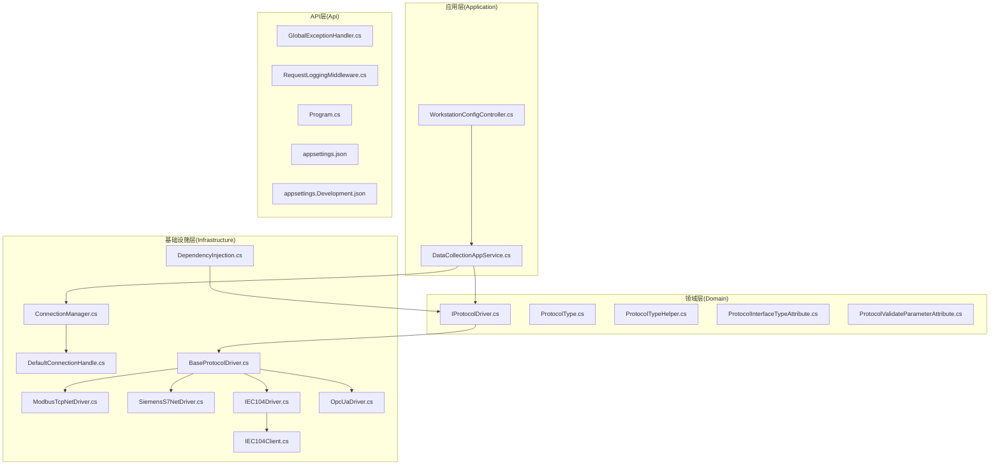
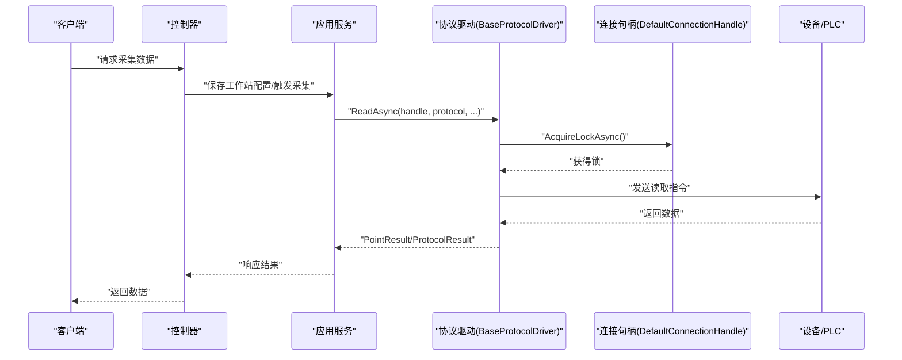
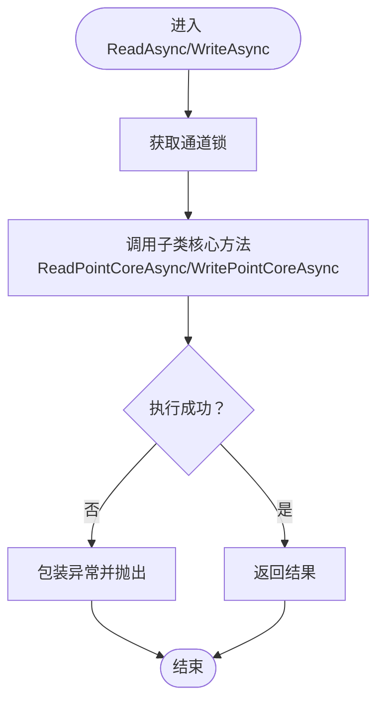
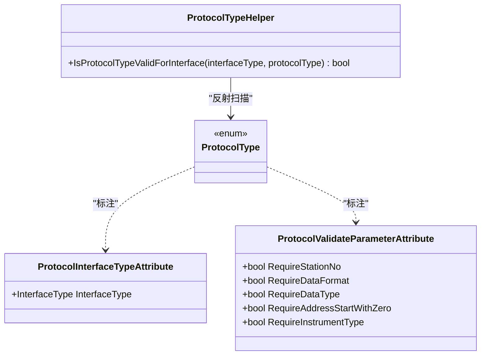
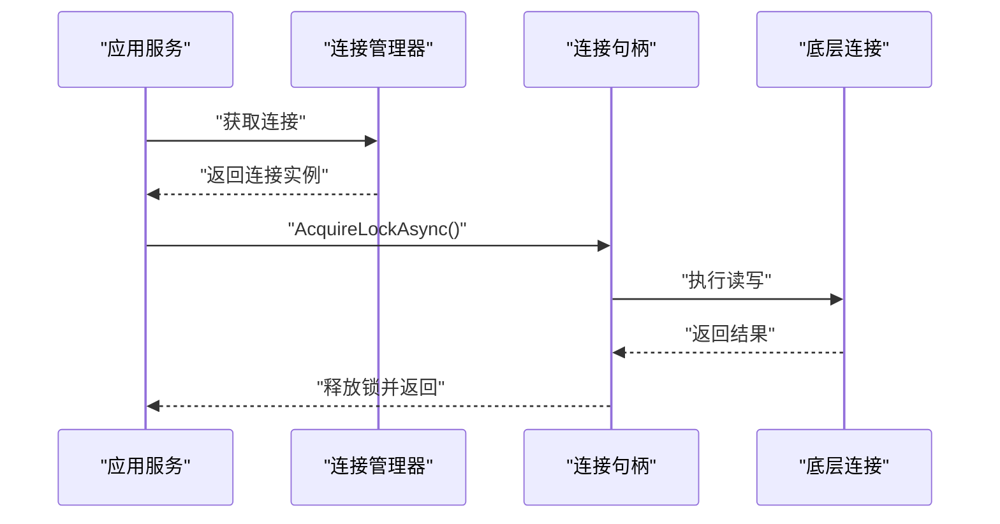
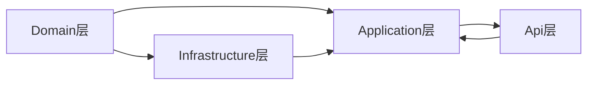

# 协议驱动架构

<cite>
**本文引用的文件**
- [IProtocolDriver.cs](file://IndustrialDataSolution/IndustrialDataProcessor.Domain/Communication/IConnection/IProtocolDriver.cs)
- [ProtocolType.cs](file://IndustrialDataSolution/IndustrialDataProcessor.Domain/Enums/ProtocolType.cs)
- [ProtocolTypeHelper.cs](file://IndustrialDataSolution/IndustrialDataProcessor.Domain/Helpers/ProtocolTypeHelper.cs)
- [ProtocolInterfaceTypeAttribute.cs](file://IndustrialDataSolution/IndustrialDataProcessor.Domain/Attributes/ProtocolInterfaceTypeAttribute.cs)
- [ProtocolValidateParameterAttribute.cs](file://IndustrialDataSolution/IndustrialDataProcessor.Domain/Attributes/ProtocolValidateParameterAttribute.cs)
- [BaseProtocolDriver.cs](file://IndustrialDataSolution/IndustrialDataProcessor.Infrastructure/Communication/Drivers/TcpCommon/BaseProtocolDriver.cs)
- [ModbusTcpNetDriver.cs](file://IndustrialDataSolution/IndustrialDataProcessor.Infrastructure/Communication/Drivers/TcpCommon/ModbusTcpNetDriver.cs)
- [OpcUaDriver.cs](file://IndustrialDataSolution/IndustrialDataProcessor.Infrastructure/Communication/Drivers/TcpSpecial/OpcUaDriver.cs)
- [IEC104Driver.cs](file://IndustrialDataSolution/IndustrialDataProcessor.Infrastructure/Communication/Drivers/TcpSpecial/IEC104Driver.cs)
- [IEC104Client.cs](file://IndustrialDataSolution/IndustrialDataProcessor.Infrastructure/Communication/Drivers/TcpSpecial/IEC104Client.cs)
- [SiemensS7NetDriver.cs](file://IndustrialDataSolution/IndustrialDataProcessor.Infrastructure/Communication/Drivers/TcpCommon/SiemensS7NetDriver.cs)
- [ModbusRtuOverTcpDriver.cs](file://IndustrialDataSolution/IndustrialDataProcessor.Infrastructure/Communication/Drivers/TcpCommon/ModbusRtuOverTcpDriver.cs)
- [ConnectionManager.cs](file://IndustrialDataSolution/IndustrialDataProcessor.Infrastructure/Communication/Connection/ConnectionManager.cs)
- [DefaultConnectionHandle.cs](file://IndustrialDataSolution/IndustrialDataProcessor.Infrastructure/Communication/Connection/DefaultConnectionHandle.cs)
- [DataCollectionAppService.cs](file://IndustrialDataSolution/IndustrialDataProcessor.Application/Services/DataCollectionAppService.cs)
- [WorkstationConfigController.cs](file://IndustrialDataSolution/IndustrialDataProcessor.Api/Controllers/WorkstationConfigController.cs)
- [GlobalExceptionHandler.cs](file://IndustrialDataSolution/IndustrialDataProcessor.Api/Middleware/GlobalExceptionHandler.cs)
- [RequestLoggingMiddleware.cs](file://IndustrialDataSolution/IndustrialDataProcessor.Api/Middleware/RequestLoggingMiddleware.cs)
- [appsettings.json](file://IndustrialDataSolution/IndustrialDataProcessor.Api/appsettings.json)
- [appsettings.Development.json](file://IndustrialDataSolution/IndustrialDataProcessor.Api/appsettings.Development.json)
- [Program.cs](file://IndustrialDataSolution/IndustrialDataProcessor.Api/Program.cs)
- [DependencyInjection.cs](file://IndustrialDataSolution/IndustrialDataProcessor.Infrastructure/DependencyInjection.cs)
</cite>

## 目录
1. [引言](#引言)
2. [项目结构](#项目结构)
3. [核心组件](#核心组件)
4. [架构总览](#架构总览)
5. [详细组件分析](#详细组件分析)
6. [依赖关系分析](#依赖关系分析)
7. [性能考虑](#性能考虑)
8. [故障排除指南](#故障排除指南)
9. [结论](#结论)
10. [附录](#附录)

## 引言
本文件系统化梳理DDD工业数据处理解决方案中的“协议驱动架构”。重点阐释协议驱动设计的核心理念：通过统一的IProtocolDriver接口抽象不同工业通信协议，利用多态性实现对Modbus RTU/ASCII/TCP、OPC UA、IEC 104、西门子S7等协议的统一接入；并通过协议类型枚举与特性标注实现协议参数验证与配置管理；借助连接句柄与通道锁实现并发控制与异常封装；最后提供新协议扩展的开发指南、性能优化与并发策略、以及使用示例与故障排除建议。

## 项目结构
该仓库采用分层+领域驱动设计（DDD）组织，协议驱动相关代码主要分布在以下层次：
- Domain层：定义协议接口、协议类型枚举、参数校验特性、辅助工具类
- Infrastructure层：实现具体协议驱动（TCP通用/特殊协议）、连接管理与句柄、OPC UA服务端与节点管理
- Application层：应用服务，负责业务编排与参数校验
- Api层：控制器、中间件与启动配置，提供对外接口与全局异常处理

图表来源
- [IProtocolDriver.cs](file://IndustrialDataSolution/IndustrialDataProcessor.Domain/Communication/IConnection/IProtocolDriver.cs#L7-L13)
- [ProtocolType.cs](file://IndustrialDataSolution/IndustrialDataProcessor.Domain/Enums/ProtocolType.cs#L9-L231)
- [BaseProtocolDriver.cs](file://IndustrialDataSolution/IndustrialDataProcessor.Infrastructure/Communication/Drivers/TcpCommon/BaseProtocolDriver.cs#L12-L108)
- [ModbusTcpNetDriver.cs](file://IndustrialDataSolution/IndustrialDataSolution/IndustrialDataProcessor.Infrastructure/Communication/Drivers/TcpCommon/ModbusTcpNetDriver.cs#L11-L41)
- [OpcUaDriver.cs](file://IndustrialDataSolution/IndustrialDataProcessor.Infrastructure/Communication/Drivers/TcpSpecial/OpcUaDriver.cs#L9-L21)
- [IEC104Driver.cs](file://IndustrialDataSolution/IndustrialDataProcessor.Infrastructure/Communication/Drivers/TcpSpecial/IEC104Driver.cs#L3-L6)
- [IEC104Client.cs](file://IndustrialDataSolution/IndustrialDataProcessor.Infrastructure/Communication/Drivers/TcpSpecial/IEC104Client.cs)
- [ConnectionManager.cs](file://IndustrialDataSolution/IndustrialDataProcessor.Infrastructure/Communication/Connection/ConnectionManager.cs)
- [DefaultConnectionHandle.cs](file://IndustrialDataSolution/IndustrialDataProcessor.Infrastructure/Communication/Connection/DefaultConnectionHandle.cs)
- [WorkstationConfigController.cs](file://IndustrialDataSolution/IndustrialDataProcessor.Api/Controllers/WorkstationConfigController.cs)
- [GlobalExceptionHandler.cs](file://IndustrialDataSolution/IndustrialDataProcessor.Api/Middleware/GlobalExceptionHandler.cs)
- [RequestLoggingMiddleware.cs](file://IndustrialDataSolution/IndustrialDataProcessor.Api/Middleware/RequestLoggingMiddleware.cs)
- [Program.cs](file://IndustrialDataSolution/IndustrialDataProcessor.Api/Program.cs)
- [appsettings.json](file://IndustrialDataSolution/IndustrialDataProcessor.Api/appsettings.json)
- [appsettings.Development.json](file://IndustrialDataSolution/IndustrialDataProcessor.Api/appsettings.Development.json)

章节来源
- [Program.cs](file://IndustrialDataSolution/IndustrialDataProcessor.Api/Program.cs)
- [appsettings.json](file://IndustrialDataSolution/IndustrialDataProcessor.Api/appsettings.json)
- [appsettings.Development.json](file://IndustrialDataSolution/IndustrialDataProcessor.Api/appsettings.Development.json)

## 核心组件
- IProtocolDriver接口：定义协议驱动的统一能力，包括按点位读取、批量读取、按点位写入与协议名称查询，支撑多态性与可替换性。
- 基类BaseProtocolDriver：实现模板方法模式，统一处理并发锁获取、异常包装、读写流程编排，并暴露抽象方法供子类实现核心读写逻辑。
- 协议类型体系：ProtocolType枚举结合ProtocolInterfaceTypeAttribute与ProtocolValidateParameterAttribute，实现协议接口类型约束与参数校验规则声明。支持Modbus系列、西门子S7系列、欧姆龙FINS/CIP、IEC104、OPC UA等多种协议。
- 连接与句柄：ConnectionManager与DefaultConnectionHandle负责连接生命周期与并发通道锁，保障同一通道的串行化访问。
- 应用服务与控制器：DataCollectionAppService与控制器负责业务编排、参数校验与异常处理，向上提供统一的数据采集入口。

章节来源
- [IProtocolDriver.cs](file://IndustrialDataSolution/IndustrialDataProcessor.Domain/Communication/IConnection/IProtocolDriver.cs#L7-L13)
- [BaseProtocolDriver.cs](file://IndustrialDataSolution/IndustrialDataProcessor.Infrastructure/Communication/Drivers/TcpCommon/BaseProtocolDriver.cs#L12-L108)
- [ProtocolType.cs](file://IndustrialDataSolution/IndustrialDataProcessor.Domain/Enums/ProtocolType.cs#L9-L231)
- [ProtocolInterfaceTypeAttribute.cs](file://IndustrialDataSolution/IndustrialDataProcessor.Domain/Attributes/ProtocolInterfaceTypeAttribute.cs#L10-L18)
- [ProtocolValidateParameterAttribute.cs](file://IndustrialDataSolution/IndustrialDataProcessor.Domain/Attributes/ProtocolValidateParameterAttribute.cs#L6-L27)
- [ConnectionManager.cs](file://IndustrialDataSolution/IndustrialDataProcessor.Infrastructure/Communication/Connection/ConnectionManager.cs)
- [DependencyInjection.cs](file://IndustrialDataSolution/IndustrialDataProcessor.Infrastructure/DependencyInjection.cs#L130-L142)
- [DefaultConnectionHandle.cs](file://IndustrialDataSolution/IndustrialDataProcessor.Infrastructure/Communication/Connection/DefaultConnectionHandle.cs)
- [DataCollectionAppService.cs](file://IndustrialDataSolution/IndustrialDataProcessor.Application/Services/DataCollectionAppService.cs)
- [WorkstationConfigController.cs](file://IndustrialDataSolution/IndustrialDataProcessor.Api/Controllers/WorkstationConfigController.cs)

## 架构总览
协议驱动架构以“接口抽象 + 基类模板 + 特性标注 + 连接锁 + 应用编排”的方式实现协议解耦与扩展。下图展示了从API到应用服务、再到协议驱动与连接句柄的整体交互：

图表来源
- [WorkstationConfigController.cs](file://IndustrialDataSolution/IndustrialDataProcessor.Api/Controllers/WorkstationConfigController.cs)
- [DataCollectionAppService.cs](file://IndustrialDataSolution/IndustrialDataProcessor.Application/Services/DataCollectionAppService.cs)
- [IProtocolDriver.cs](file://IndustrialDataSolution/IndustrialDataProcessor.Domain/Communication/IConnection/IProtocolDriver.cs#L9-L12)
- [BaseProtocolDriver.cs](file://IndustrialDataSolution/IndustrialDataProcessor.Infrastructure/Communication/Drivers/TcpCommon/BaseProtocolDriver.cs#L26-L81)
- [DefaultConnectionHandle.cs](file://IndustrialDataSolution/IndustrialDataProcessor.Infrastructure/Communication/Connection/DefaultConnectionHandle.cs)

## 详细组件分析

### IProtocolDriver接口与多态性
- 设计目标：统一协议读写能力，屏蔽底层差异，便于替换与扩展。
- 关键方法：
  - 按点位读取：返回单点结果
  - 批量读取：返回整包结果（部分协议默认不支持）
  - 按点位写入：返回写入成功与否
  - 获取协议名称：用于日志与异常信息标识
- 多态性体现：不同协议驱动继承基类并实现核心读写逻辑，调用方仅依赖接口。

章节来源
- [IProtocolDriver.cs](file://IndustrialDataSolution/IndustrialDataProcessor.Domain/Communication/IConnection/IProtocolDriver.cs#L7-L13)

### BaseProtocolDriver基类与模板方法
- 并发控制：在读写前通过句柄获取通道锁，避免同一通道并发冲突。
- 异常处理：统一捕获子类异常并包装为带协议名的友好错误信息，便于定位问题。
- 流程编排：将“获取锁 → 调用核心方法 → 返回结果”固化为模板方法，减少重复代码。
- 可扩展点：子类仅需实现读写核心方法，其他流程自动复用。

图表来源
- [BaseProtocolDriver.cs](file://IndustrialDataSolution/IndustrialDataProcessor.Infrastructure/Communication/Drivers/TcpCommon/BaseProtocolDriver.cs#L26-L81)

章节来源
- [BaseProtocolDriver.cs](file://IndustrialDataSolution/IndustrialDataProcessor.Infrastructure/Communication/Drivers/TcpCommon/BaseProtocolDriver.cs#L12-L108)

### 协议类型体系与参数校验
- 协议类型枚举：集中定义所有支持的协议类型，覆盖LAN/COM/API/DATABASE等接口类型。
- 接口类型标注：通过ProtocolInterfaceTypeAttribute将协议与接口类型关联，限制配置合法性。
- 参数校验标注：通过ProtocolValidateParameterAttribute声明每个协议在参数校验时所需的关键字段（如站号、数据格式、数据类型、地址起始位、仪表类型等）。
- 辅助工具：ProtocolTypeHelper在静态初始化时构建接口类型到协议集合的映射，提供快速校验能力。

图表来源
- [ProtocolType.cs](file://IndustrialDataSolution/IndustrialDataProcessor.Domain/Enums/ProtocolType.cs#L9-L231)
- [ProtocolInterfaceTypeAttribute.cs](file://IndustrialDataSolution/IndustrialDataProcessor.Domain/Attributes/ProtocolInterfaceTypeAttribute.cs#L10-L18)
- [ProtocolValidateParameterAttribute.cs](file://IndustrialDataSolution/IndustrialDataProcessor.Domain/Attributes/ProtocolValidateParameterAttribute.cs#L6-L27)
- [ProtocolTypeHelper.cs](file://IndustrialDataSolution/IndustrialDataProcessor.Domain/Helpers/ProtocolTypeHelper.cs#L5-L35)

章节来源
- [ProtocolType.cs](file://IndustrialDataSolution/IndustrialDataProcessor.Domain/Enums/ProtocolType.cs#L9-L231)
- [ProtocolInterfaceTypeAttribute.cs](file://IndustrialDataSolution/IndustrialDataProcessor.Domain/Attributes/ProtocolInterfaceTypeAttribute.cs#L10-L18)
- [ProtocolValidateParameterAttribute.cs](file://IndustrialDataSolution/IndustrialDataProcessor.Domain/Attributes/ProtocolValidateParameterAttribute.cs#L6-L27)
- [ProtocolTypeHelper.cs](file://IndustrialDataSolution/IndustrialDataProcessor.Domain/Helpers/ProtocolTypeHelper.cs#L5-L35)

### 具体协议实现示例

#### ModbusTcpNet驱动
- 继承关系：ModbusTcpNetDriver继承BaseProtocolDriver<ModbusTcpNet>
- 核心逻辑：从连接句柄获取底层ModbusTcpNet实例，设置站号、数据格式、地址起始位后调用扩展方法完成读写。
- 适用场景：Modbus TCP网络协议，常见于工业自动化设备。

章节来源
- [ModbusTcpNetDriver.cs](file://IndustrialDataSolution/IndustrialDataProcessor.Infrastructure/Communication/Drivers/TcpCommon/ModbusTcpNetDriver.cs#L11-L41)

#### 西门子S7驱动
- 继承关系：SiemensS7NetDriver继承BaseProtocolDriver<S7Connection>
- 适用场景：西门子S7系列PLC的以太网通信协议族。

章节来源
- [SiemensS7NetDriver.cs](file://IndustrialDataSolution/IndustrialDataProcessor.Infrastructure/Communication/Drivers/TcpCommon/SiemensS7NetDriver.cs)

#### OPC UA驱动
- 继承关系：OpcUaDriver继承BaseProtocolDriver<Session>
- 当前状态：未实现核心读写方法，处于占位状态，后续可基于会话进行节点读写。

章节来源
- [OpcUaDriver.cs](file://IndustrialDataSolution/IndustrialDataProcessor.Infrastructure/Communication/Drivers/TcpSpecial/OpcUaDriver.cs#L9-L21)

#### IEC 104驱动
- 继承关系：IEC104Driver为空类，IEC104Client为客户端实现
- 当前状态：驱动类占位，客户端类存在，后续可完善驱动与协议栈对接。

章节来源
- [IEC104Driver.cs](file://IndustrialDataSolution/IndustrialDataProcessor.Infrastructure/Communication/Drivers/TcpSpecial/IEC104Driver.cs#L3-L6)
- [IEC104Client.cs](file://IndustrialDataSolution/IndustrialDataProcessor.Infrastructure/Communication/Drivers/TcpSpecial/IEC104Client.cs)

#### Modbus RTU Over TCP驱动
- 继承关系：ModbusRtuOverTcpDriver继承BaseProtocolDriver<ModbusRtuOverTcp>
- 适用场景：通过TCP承载Modbus RTU帧，适配不具备原生Modbus TCP的设备。

章节来源
- [ModbusRtuOverTcpDriver.cs](file://IndustrialDataSolution/IndustrialDataProcessor.Infrastructure/Communication/Drivers/TcpCommon/ModbusRtuOverTcpDriver.cs)

### 连接管理与并发控制
- 连接管理器：ConnectionManager负责建立、维护与回收底层连接，向驱动提供强类型连接实例。
- 连接句柄：DefaultConnectionHandle封装底层连接与通道锁，提供AcquireLockAsync用于并发控制。
- 并发策略：同一通道（串口/TCP）内串行化访问，避免竞态与数据交错。

图表来源
- [ConnectionManager.cs](file://IndustrialDataSolution/IndustrialDataProcessor.Infrastructure/Communication/Connection/ConnectionManager.cs)
- [DefaultConnectionHandle.cs](file://IndustrialDataSolution/IndustrialDataProcessor.Infrastructure/Communication/Connection/DefaultConnectionHandle.cs)

章节来源
- [ConnectionManager.cs](file://IndustrialDataSolution/IndustrialDataProcessor.Infrastructure/Communication/Connection/ConnectionManager.cs)
- [DefaultConnectionHandle.cs](file://IndustrialDataSolution/IndustrialDataProcessor.Infrastructure/Communication/Connection/DefaultConnectionHandle.cs)

### 应用编排与控制器
- 控制器：WorkstationConfigController接收外部请求，触发配置保存与采集任务。
- 应用服务：DataCollectionAppService负责业务编排、参数校验与异常处理，协调驱动与连接。
- 命令处理器：SaveWorkstationConfigCommandHandler处理配置变更事件，更新缓存与订阅。

章节来源
- [WorkstationConfigController.cs](file://IndustrialDataSolution/IndustrialDataProcessor.Api/Controllers/WorkstationConfigController.cs)
- [DataCollectionAppService.cs](file://IndustrialDataSolution/IndustrialDataProcessor.Application/Services/DataCollectionAppService.cs)
- [SaveWorkstationConfigCommandHandler.cs](file://IndustrialDataSolution/IndustrialDataProcessor.Application/CommandHandlers/SaveWorkstationConfigCommandHandler.cs)

## 依赖关系分析
- 领域层依赖：IProtocolDriver与协议类型体系构成协议抽象与约束基础。
- 基础设施层依赖：具体驱动依赖HSL通信库与扩展方法，连接管理器提供底层连接。
- 应用层依赖：应用服务依赖驱动接口与连接句柄，控制器依赖应用服务。
- API层依赖：控制器与中间件依赖应用层，全局异常处理与请求日志贯穿各层。

图表来源
- [IProtocolDriver.cs](file://IndustrialDataSolution/IndustrialDataProcessor.Domain/Communication/IConnection/IProtocolDriver.cs#L7-L13)
- [ModbusTcpNetDriver.cs](file://IndustrialDataSolution/IndustrialDataProcessor.Infrastructure/Communication/Drivers/TcpCommon/ModbusTcpNetDriver.cs#L11-L41)
- [DataCollectionAppService.cs](file://IndustrialDataSolution/IndustrialDataProcessor.Application/Services/DataCollectionAppService.cs)
- [WorkstationConfigController.cs](file://IndustrialDataSolution/IndustrialDataProcessor.Api/Controllers/WorkstationConfigController.cs)

章节来源
- [IProtocolDriver.cs](file://IndustrialDataSolution/IndustrialDataProcessor.Domain/Communication/IConnection/IProtocolDriver.cs#L7-L13)
- [ModbusTcpNetDriver.cs](file://IndustrialDataSolution/IndustrialDataProcessor.Infrastructure/Communication/Drivers/TcpCommon/ModbusTcpNetDriver.cs#L11-L41)
- [DataCollectionAppService.cs](file://IndustrialDataSolution/IndustrialDataProcessor.Application/Services/DataCollectionAppService.cs)
- [WorkstationConfigController.cs](file://IndustrialDataSolution/IndustrialDataProcessor.Api/Controllers/WorkstationConfigController.cs)

## 性能考虑
- 并发控制：通过通道锁避免同一连接的并发竞争，降低错误率与重试成本。
- 读写分离：优先使用按点位读写，减少不必要的整包读取开销；仅在特定协议支持时启用批量读取。
- 连接复用：连接管理器应尽量复用底层连接，减少频繁建立/断开带来的延迟。
- 数据格式与地址起始位：合理设置数据格式与地址起始位，减少转换与计算开销。
- 超时与取消：在读写过程中传递CancellationToken，支持超时与取消，避免阻塞。
- 缓存与批处理：对高频点位可引入本地缓存与批处理策略，降低网络压力。

[本节为通用性能建议，无需列出章节来源]

## 故障排除指南
- 异常处理：基类统一包装异常，包含协议名与原始错误信息，便于定位问题。
- 全局异常：GlobalExceptionHandler集中处理未捕获异常，输出结构化错误信息。
- 请求日志：RequestLoggingMiddleware记录请求上下文，辅助排查链路问题。
- 参数校验：ProtocolValidateParameterAttribute声明的必需字段缺失会导致配置不合法，需在前端或应用层提前校验。
- 连接问题：若出现设备不可达或连接超时，检查连接句柄是否正确获取锁、连接是否存活、网络连通性与防火墙策略。

章节来源
- [BaseProtocolDriver.cs](file://IndustrialDataSolution/IndustrialDataProcessor.Infrastructure/Communication/Drivers/TcpCommon/BaseProtocolDriver.cs#L36-L71)
- [GlobalExceptionHandler.cs](file://IndustrialDataSolution/IndustrialDataProcessor.Api/Middleware/GlobalExceptionHandler.cs)
- [RequestLoggingMiddleware.cs](file://IndustrialDataSolution/IndustrialDataProcessor.Api/Middleware/RequestLoggingMiddleware.cs)
- [ProtocolValidateParameterAttribute.cs](file://IndustrialDataSolution/IndustrialDataProcessor.Domain/Attributes/ProtocolValidateParameterAttribute.cs#L6-L27)

## 结论
该协议驱动架构通过接口抽象、基类模板、特性标注与连接锁机制，实现了对多种工业协议的统一接入与扩展。协议类型体系确保配置合法与参数一致，应用层与API层提供清晰的边界与可观测性。未来可在OPC UA与IEC 104等占位驱动上完善实现，并持续优化并发与性能策略。

[本节为总结性内容，无需列出章节来源]

## 附录

### 新协议扩展开发指南
- 实现步骤
  - 定义协议类型：在ProtocolType中新增枚举项，并标注接口类型与参数校验规则。
  - 创建驱动类：继承BaseProtocolDriver<TConnection>，实现读写核心方法。
  - 注册连接：在连接管理器中提供对应底层连接的创建与获取逻辑。
  - 配置校验：利用ProtocolValidateParameterAttribute声明的规则在应用层进行前置校验。
  - 集成测试：编写单元与集成测试，覆盖正常路径、异常路径与并发场景。
- 最佳实践
  - 明确接口类型与参数要求，避免跨接口配置导致的运行时错误。
  - 在驱动中保持幂等与可重试策略，结合超时与取消机制提升鲁棒性。
  - 使用通道锁保证同一连接的串行化访问，避免竞态。
  - 记录详细的日志与指标，便于问题定位与性能分析。

章节来源
- [ProtocolType.cs](file://IndustrialDataSolution/IndustrialDataProcessor.Domain/Enums/ProtocolType.cs#L9-L231)
- [ProtocolValidateParameterAttribute.cs](file://IndustrialDataSolution/IndustrialDataProcessor.Domain/Attributes/ProtocolValidateParameterAttribute.cs#L6-L27)
- [BaseProtocolDriver.cs](file://IndustrialDataSolution/IndustrialDataProcessor.Infrastructure/Communication/Drivers/TcpCommon/BaseProtocolDriver.cs#L12-L108)
- [ConnectionManager.cs](file://IndustrialDataSolution/IndustrialDataProcessor.Infrastructure/Communication/Connection/ConnectionManager.cs)

### 协议使用示例与故障排除
- 使用示例
  - 通过控制器提交工作站配置，应用服务触发采集任务，驱动按点位读取并返回结果。
  - 对于Modbus协议，设置站号、数据格式与地址起始位后进行读写。
- 故障排除
  - 若出现“协议不支持整包读取”，请改用按点位读取或在驱动中实现批量读取。
  - 若出现并发冲突或数据错乱，请确认连接句柄已正确获取锁。
  - 若出现参数缺失导致的配置不合法，请根据参数校验规则补齐必填字段。

章节来源
- [WorkstationConfigController.cs](file://IndustrialDataSolution/IndustrialDataProcessor.Api/Controllers/WorkstationConfigController.cs)
- [DataCollectionAppService.cs](file://IndustrialDataSolution/IndustrialDataProcessor.Application/Services/DataCollectionAppService.cs)
- [BaseProtocolDriver.cs](file://IndustrialDataSolution/IndustrialDataProcessor.Infrastructure/Communication/Drivers/TcpCommon/BaseProtocolDriver.cs#L77-L81)
- [ProtocolValidateParameterAttribute.cs](file://IndustrialDataSolution/IndustrialDataProcessor.Domain/Attributes/ProtocolValidateParameterAttribute.cs#L6-L27)