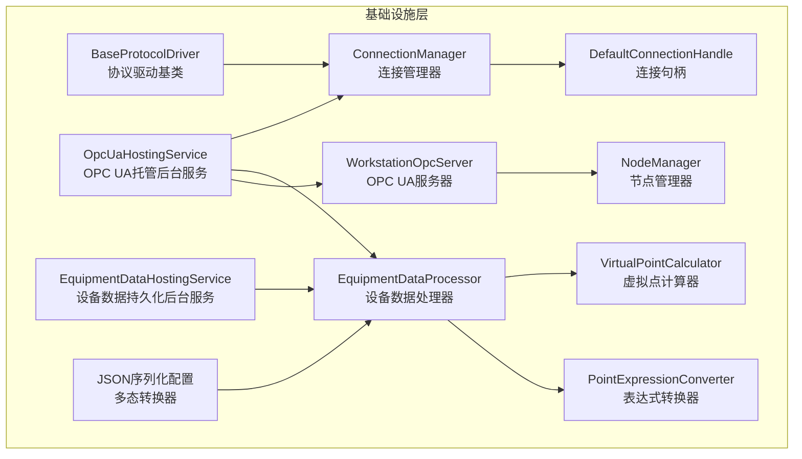
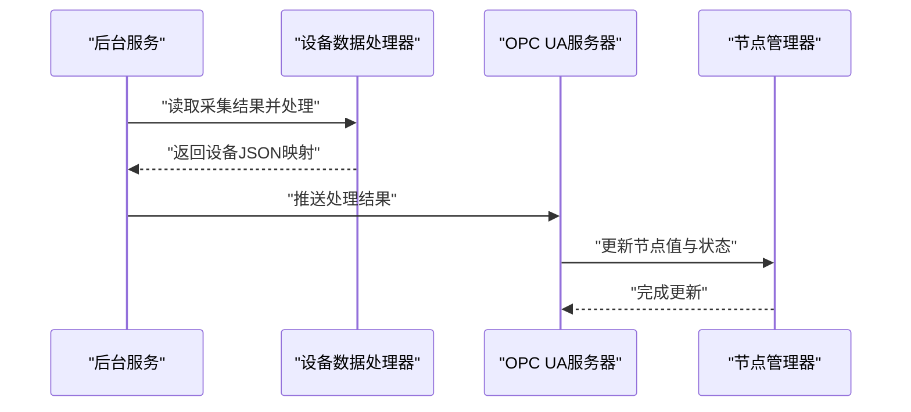
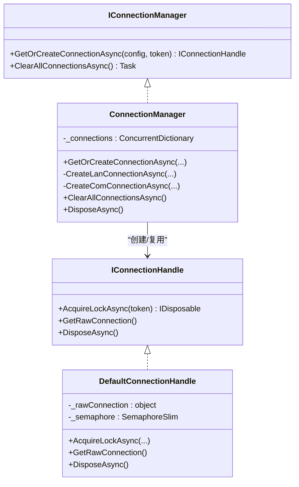
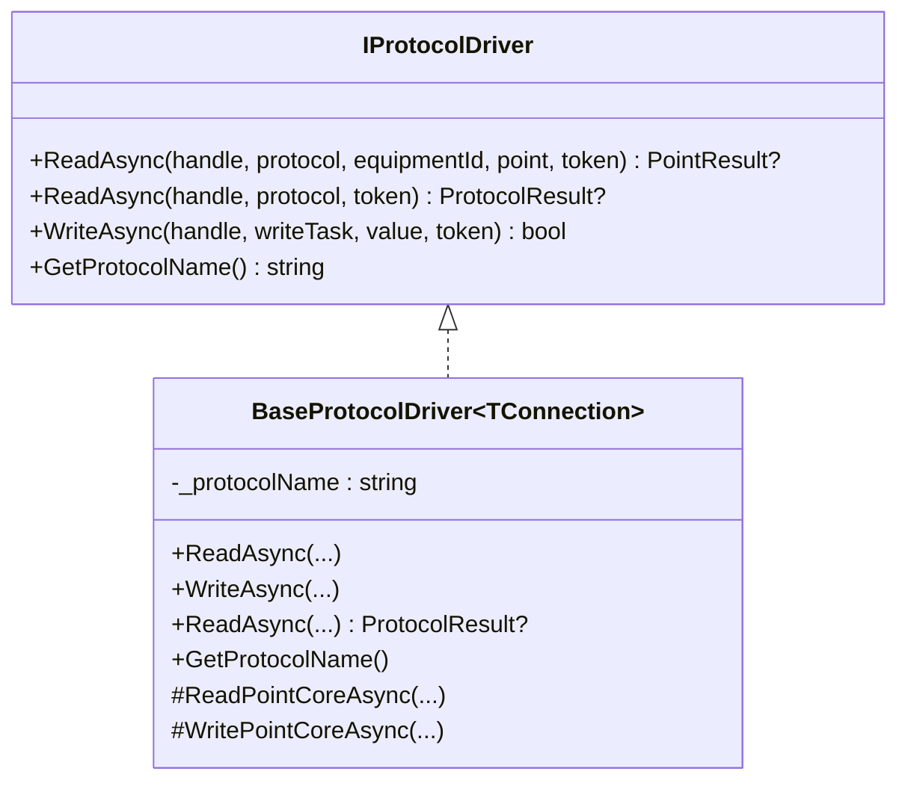
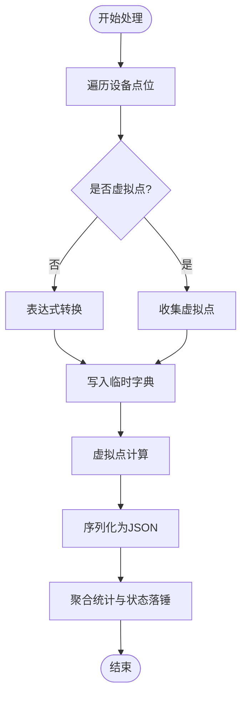
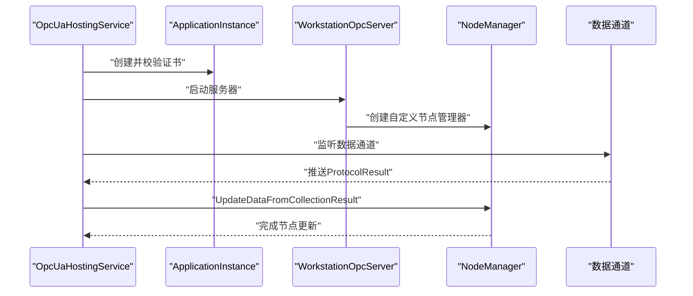
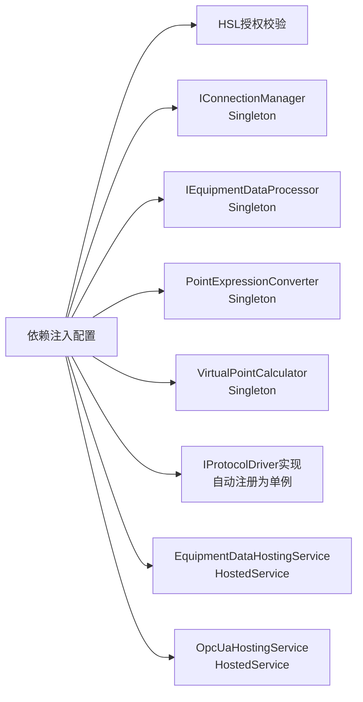
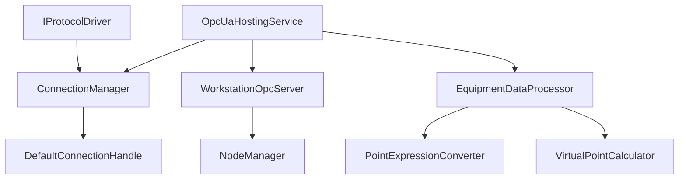

# 基础设施层

<cite>
**本文档引用的文件**
- [Infrastructure/DependencyInjection.cs](file://IndustrialDataSolution/IndustrialDataProcessor.Infrastructure/DependencyInjection.cs)
- [BackgroundServices/EquipmentDataHostingService.cs](file://IndustrialDataSolution/IndustrialDataProcessor.Infrastructure/BackgroundServices/EquipmentDataHostingService.cs)
- [BackgroundServices/OpcUaHostingService.cs](file://IndustrialDataSolution/IndustrialDataProcessor.Infrastructure/BackgroundServices/OpcUaHostingService.cs)
- [Communication/Connection/ConnectionManager.cs](file://IndustrialDataSolution/IndustrialDataProcessor.Infrastructure/Communication/Connection/ConnectionManager.cs)
- [Communication/Connection/DefaultConnectionHandle.cs](file://IndustrialDataSolution/IndustrialDataProcessor.Infrastructure/Communication/Connection/DefaultConnectionHandle.cs)
- [EquipmentCollectionDataProcessing/EquipmentDataProcessor.cs](file://IndustrialDataSolution/IndustrialDataProcessor.Infrastructure/EquipmentCollectionDataProcessing/EquipmentDataProcessor.cs)
- [EquipmentCollectionDataProcessing/PointExpressionConverter.cs](file://IndustrialDataSolution/IndustrialDataProcessor.Infrastructure/EquipmentCollectionDataProcessing/PointExpressionConverter.cs)
- [EquipmentCollectionDataProcessing/VirtualPointCalculator.cs](file://IndustrialDataSolution/IndustrialDataProcessor.Infrastructure/EquipmentCollectionDataProcessing/VirtualPointCalculator.cs)
- [OpcUa/NodeManager.cs](file://IndustrialDataSolution/IndustrialDataProcessor.Infrastructure/OpcUa/NodeManager.cs)
- [OpcUa/WorkstationOpcServer.cs](file://IndustrialDataSolution/IndustrialDataProcessor.Infrastructure/OpcUa/WorkstationOpcServer.cs)
- [Domain/Communication/IConnection/IConnectionManager.cs](file://IndustrialDataSolution/IndustrialDataProcessor.Domain/Communication/IConnection/IConnectionManager.cs)
- [Domain/Communication/IConnection/IProtocolDriver.cs](file://IndustrialDataSolution/IndustrialDataProcessor.Domain/Communication/IConnection/IProtocolDriver.cs)
- [Application/DependencyInjection.cs](file://IndustrialDataSolution/IndustrialDataProcessor.Application/DependencyInjection.cs)
- [Program.cs](file://IndustrialDataSolution/IndustrialDataProcessor.Api/Program.cs)
</cite>

## 更新摘要
**变更内容**
- 移除 SqlSugar 持久化基础设施：完全移除数据库连接、实体仓储、领域仓储和设备数据存储仓储组件
- 简化基础设施层架构：仅保留通信、数据处理、OPC UA 集成和后台服务等核心功能
- 重新设计依赖注入配置：移除仓储相关注册，专注于连接管理、协议驱动和数据处理组件
- 调整后台服务职责：设备数据持久化后台服务直接依赖设备数据存储仓储接口

## 目录
1. [简介](#简介)
2. [项目结构](#项目结构)
3. [核心组件](#核心组件)
4. [架构总览](#架构总览)
5. [组件详解](#组件详解)
6. [依赖关系分析](#依赖关系分析)
7. [性能考量](#性能考量)
8. [故障排查指南](#故障排查指南)
9. [结论](#结论)
10. [附录](#附录)

## 简介
本文件面向DDD工业数据处理解决方案的基础设施层，系统性阐述以下主题：
- 工业通信协议抽象与实现：涵盖TCP/IP族协议与串口协议的抽象设计与驱动实现
- 连接管理器：连接池管理、设备连接生命周期与故障恢复
- 设备数据处理引擎：数据转换、表达式计算、虚拟点位处理
- OPC UA服务器集成：节点管理、客户端连接与数据发布
- 依赖注入配置与生命周期管理
- 协议驱动扩展开发指南
- 性能优化与资源管理最佳实践
- 异常处理与监控告警

## 项目结构
基础设施层主要由以下模块构成：
- **通信与连接**：连接管理器、连接句柄、协议驱动（Modbus、西门子、欧姆龙、IEC 60870-5-104、OPC UA等）
- **数据处理**：表达式转换、虚拟点计算、设备数据处理器
- **OPC UA**：服务器封装、节点管理器
- **后台服务**：设备数据持久化、OPC UA服务器托管
- **序列化**：JSON转换器与多态序列化配置
- **依赖注入**：集中注册与生命周期管理

**图表来源**
- [Infrastructure/DependencyInjection.cs](file://IndustrialDataSolution/IndustrialDataProcessor.Infrastructure/DependencyInjection.cs#L33-L46)
- [Communication/Connection/ConnectionManager.cs](file://IndustrialDataSolution/IndustrialDataProcessor.Infrastructure/Communication/Connection/ConnectionManager.cs#L22-L397)
- [EquipmentCollectionDataProcessing/EquipmentDataProcessor.cs](file://IndustrialDataSolution/IndustrialDataProcessor.Infrastructure/EquipmentCollectionDataProcessing/EquipmentDataProcessor.cs#L122-L127)

**章节来源**
- [Infrastructure/DependencyInjection.cs](file://IndustrialDataSolution/IndustrialDataProcessor.Infrastructure/DependencyInjection.cs#L22-L49)

## 核心组件
- **连接管理器**：负责LAN/串口协议的连接创建、复用与清理，提供连接句柄的并发互斥能力
- **协议驱动**：基于模板方法模式的抽象基类，统一读写流程与异常处理，子类实现具体协议细节
- **设备数据处理器**：完成点位表达式转换、虚拟点计算、聚合统计与序列化
- **OPC UA服务器**：封装标准服务器，注入自定义节点管理器，支持客户端读写与状态发布
- **后台服务**：设备数据持久化与OPC UA服务器生命周期管理
- **依赖注入**：集中注册HSL授权、连接管理器、后台服务、协议驱动、处理器与JSON选项

**章节来源**
- [Infrastructure/DependencyInjection.cs](file://IndustrialDataSolution/IndustrialDataProcessor.Infrastructure/DependencyInjection.cs#L33-L46)
- [Communication/Connection/ConnectionManager.cs](file://IndustrialDataSolution/IndustrialDataProcessor.Infrastructure/Communication/Connection/ConnectionManager.cs#L22-L397)
- [EquipmentCollectionDataProcessing/EquipmentDataProcessor.cs](file://IndustrialDataSolution/IndustrialDataProcessor.Infrastructure/EquipmentCollectionDataProcessing/EquipmentDataProcessor.cs#L122-L127)

## 架构总览
基础设施层通过依赖注入装配各组件，形成"采集-处理-发布"的完整闭环：
- **采集**：后台服务从数据通道读取采集结果，驱动协议驱动进行读写
- **处理**：设备数据处理器对点位值进行表达式转换与虚拟点计算，产出JSON映射
- **发布**：OPC UA服务器节点管理器接收处理结果，更新节点值与状态码

**图表来源**
- [BackgroundServices/EquipmentDataHostingService.cs](file://IndustrialDataSolution/IndustrialDataProcessor.Infrastructure/BackgroundServices/EquipmentDataHostingService.cs#L16-L41)
- [EquipmentCollectionDataProcessing/EquipmentDataProcessor.cs](file://IndustrialDataSolution/IndustrialDataProcessor.Infrastructure/EquipmentCollectionDataProcessing/EquipmentDataProcessor.cs#L21-L48)
- [OpcUa/NodeManager.cs](file://IndustrialDataSolution/IndustrialDataProcessor.Infrastructure/OpcUa/NodeManager.cs#L81-L127)

## 组件详解

### 连接管理器与连接句柄
- **连接管理器**：按接口类型（LAN/串口）与协议类型分派，创建底层连接并维护连接字典，支持复用与清理
- **连接句柄**：提供基于信号量的并发互斥，确保同一通道的读写不冲突
- **支持协议**：Modbus、西门子S7、欧姆龙FINS、DLT645/CJT188、IEC 60870-5-104、OPC UA等

**图表来源**
- [Communication/Connection/ConnectionManager.cs](file://IndustrialDataSolution/IndustrialDataProcessor.Infrastructure/Communication/Connection/ConnectionManager.cs#L22-L397)
- [Communication/Connection/DefaultConnectionHandle.cs](file://IndustrialDataSolution/IndustrialDataProcessor.Infrastructure/Communication/Connection/DefaultConnectionHandle.cs#L6-L50)
- [Domain/Communication/IConnection/IConnectionManager.cs](file://IndustrialDataSolution/IndustrialDataProcessor.Domain/Communication/IConnection/IConnectionManager.cs#L5-L19)

**章节来源**
- [Communication/Connection/ConnectionManager.cs](file://IndustrialDataSolution/IndustrialDataProcessor.Infrastructure/Communication/Connection/ConnectionManager.cs#L25-L397)
- [Communication/Connection/DefaultConnectionHandle.cs](file://IndustrialDataSolution/IndustrialDataProcessor.Infrastructure/Communication/Connection/DefaultConnectionHandle.cs#L15-L42)

### 协议驱动抽象与实现
- **抽象基类**：提供统一的读写流程：获取通道锁、调用子类核心方法、异常包装
- **驱动注册**：通过反射扫描自动注册所有IProtocolDriver实现类为单例
- **支持协议**：Modbus RTU over TCP、Modbus TCP Net、西门子S7、欧姆龙FINS等

**图表来源**
- [Domain/Communication/IConnection/IProtocolDriver.cs](file://IndustrialDataSolution/IndustrialDataProcessor.Domain/Communication/IConnection/IProtocolDriver.cs#L7-L14)
- [Communication/Drivers/TcpCommon/BaseProtocolDriver.cs](file://IndustrialDataSolution/IndustrialDataProcessor.Infrastructure/Communication/Drivers/TcpCommon/BaseProtocolDriver.cs#L12-L108)

**章节来源**
- [Communication/Drivers/TcpCommon/BaseProtocolDriver.cs](file://IndustrialDataSolution/IndustrialDataProcessor.Infrastructure/Communication/Drivers/TcpCommon/BaseProtocolDriver.cs#L26-L84)
- [Infrastructure/DependencyInjection.cs](file://IndustrialDataSolution/IndustrialDataProcessor.Infrastructure/DependencyInjection.cs#L132-L141)

### 设备数据处理引擎
- **表达式转换器**：支持常见进制转换与一元表达式计算，提供逆向转换能力（写入时反推）
- **虚拟点计算器**：基于DynamicExpresso解析表达式，从设备数据字典中取值参与计算
- **设备数据处理器**：遍历设备点位，完成表达式转换、虚拟点计算、序列化与聚合统计

**图表来源**
- [EquipmentCollectionDataProcessing/EquipmentDataProcessor.cs](file://IndustrialDataSolution/IndustrialDataProcessor.Infrastructure/EquipmentCollectionDataProcessing/EquipmentDataProcessor.cs#L21-L157)
- [EquipmentCollectionDataProcessing/PointExpressionConverter.cs](file://IndustrialDataSolution/IndustrialDataProcessor.Infrastructure/EquipmentCollectionDataProcessing/PointExpressionConverter.cs#L16-L82)
- [EquipmentCollectionDataProcessing/VirtualPointCalculator.cs](file://IndustrialDataSolution/IndustrialDataProcessor.Infrastructure/EquipmentCollectionDataProcessing/VirtualPointCalculator.cs#L16-L48)

**章节来源**
- [EquipmentCollectionDataProcessing/EquipmentDataProcessor.cs](file://IndustrialDataSolution/IndustrialDataProcessor.Infrastructure/EquipmentCollectionDataProcessing/EquipmentDataProcessor.cs#L21-L157)
- [EquipmentCollectionDataProcessing/PointExpressionConverter.cs](file://IndustrialDataSolution/IndustrialDataProcessor.Infrastructure/EquipmentCollectionDataProcessing/PointExpressionConverter.cs#L16-L110)
- [EquipmentCollectionDataProcessing/VirtualPointCalculator.cs](file://IndustrialDataSolution/IndustrialDataProcessor.Infrastructure/EquipmentCollectionDataProcessing/VirtualPointCalculator.cs#L16-L50)

### OPC UA服务器集成
- **服务器封装**：重写节点管理器创建，注入自定义节点管理器
- **节点管理器**：按配置创建工作站/设备/点位树，支持初始值与状态码设置，写入回调触发应用层写入
- **托管服务**：启动/重启服务器、监听数据通道、更新节点、处理异常与停止

**图表来源**
- [BackgroundServices/OpcUaHostingService.cs](file://IndustrialDataSolution/IndustrialDataProcessor.Infrastructure/BackgroundServices/OpcUaHostingService.cs#L101-L184)
- [OpcUa/WorkstationOpcServer.cs](file://IndustrialDataSolution/IndustrialDataProcessor.Infrastructure/OpcUa/WorkstationOpcServer.cs#L21-L34)
- [OpcUa/NodeManager.cs](file://IndustrialDataSolution/IndustrialDataProcessor.Infrastructure/OpcUa/NodeManager.cs#L36-L127)

**章节来源**
- [OpcUa/WorkstationOpcServer.cs](file://IndustrialDataSolution/IndustrialDataProcessor.Infrastructure/OpcUa/WorkstationOpcServer.cs#L11-L36)
- [OpcUa/NodeManager.cs](file://IndustrialDataSolution/IndustrialDataProcessor.Infrastructure/OpcUa/NodeManager.cs#L10-L417)
- [BackgroundServices/OpcUaHostingService.cs](file://IndustrialDataSolution/IndustrialDataProcessor.Infrastructure/BackgroundServices/OpcUaHostingService.cs#L45-L228)

### 依赖注入与生命周期
- **HSL授权**：启动阶段校验授权码，缺失或无效直接抛出异常
- **连接管理器**：注册为Singleton，连接复用与清理由其负责
- **后台服务**：设备数据持久化与OPC UA托管服务均注册为HostedService
- **协议驱动**：扫描实现类并注册为单例，便于按协议名称选择
- **JSON选项**：注册多态转换器与命名策略

**图表来源**
- [Infrastructure/DependencyInjection.cs](file://IndustrialDataSolution/IndustrialDataProcessor.Infrastructure/DependencyInjection.cs#L27-L46)
- [Application/DependencyInjection.cs](file://IndustrialDataSolution/IndustrialDataProcessor.Application/DependencyInjection.cs#L16-L39)

**章节来源**
- [Infrastructure/DependencyInjection.cs](file://IndustrialDataSolution/IndustrialDataProcessor.Infrastructure/DependencyInjection.cs#L27-L46)
- [Application/DependencyInjection.cs](file://IndustrialDataSolution/IndustrialDataProcessor.Application/DependencyInjection.cs#L16-L39)

## 依赖关系分析
- **组件耦合**
  - 连接管理器与协议驱动：通过IConnectionHandle解耦，驱动不持有底层连接
  - 设备数据处理器与表达式/虚拟点：通过独立组件解耦，便于测试与扩展
  - OPC UA托管服务与节点管理器：通过事件回调解耦，写入逻辑下沉至驱动
- **外部依赖**
  - HSL通信库：提供Modbus、西门子、欧姆龙等协议实现
  - OPC UA SDK：提供服务器与节点管理器能力
  - DynamicExpresso：表达式解析与计算

**图表来源**
- [Infrastructure/DependencyInjection.cs](file://IndustrialDataSolution/IndustrialDataProcessor.Infrastructure/DependencyInjection.cs#L33-L46)
- [Communication/Connection/ConnectionManager.cs](file://IndustrialDataSolution/IndustrialDataProcessor.Infrastructure/Communication/Connection/ConnectionManager.cs#L22-L397)

## 性能考量
- **连接复用与并发控制**
  - 连接管理器使用ConcurrentDictionary按通道键复用连接，避免重复创建
  - 连接句柄使用SemaphoreSlim确保同一通道的读写互斥，降低冲突
- **协议驱动模板方法**
  - 统一的读写流程减少重复代码，提升稳定性与可维护性
- **数据处理优化**
  - 设备数据处理器使用并发字典与集合，避免锁竞争
  - 表达式转换与虚拟点计算尽量在内存中完成，减少IO
- **OPC UA节点更新**
  - 节点管理器批量更新并设置状态码，避免频繁分配
- **后台服务**
  - 设备数据持久化后台服务使用异步迭代与取消令牌，优雅退出

**章节来源**
- [Communication/Connection/ConnectionManager.cs](file://IndustrialDataSolution/IndustrialDataProcessor.Infrastructure/Communication/Connection/ConnectionManager.cs#L23-L36)
- [Communication/Connection/DefaultConnectionHandle.cs](file://IndustrialDataSolution/IndustrialDataProcessor.Infrastructure/Communication/Connection/DefaultConnectionHandle.cs#L9-L19)
- [EquipmentCollectionDataProcessing/EquipmentDataProcessor.cs](file://IndustrialDataSolution/IndustrialDataProcessor.Infrastructure/EquipmentCollectionDataProcessing/EquipmentDataProcessor.cs#L21-L48)
- [OpcUa/NodeManager.cs](file://IndustrialDataSolution/IndustrialDataProcessor.Infrastructure/OpcUa/NodeManager.cs#L167-L183)
- [BackgroundServices/EquipmentDataHostingService.cs](file://IndustrialDataSolution/IndustrialDataProcessor.Infrastructure/BackgroundServices/EquipmentDataHostingService.cs#L16-L41)

## 故障排查指南
- **启动失败（HSL授权）**
  - 现象：启动时报错提示未找到授权码或授权失败
  - 处理：检查配置文件中授权码节点是否存在且有效
- **连接失败**
  - 现象：LAN/串口连接创建失败或异常
  - 处理：查看连接管理器对应协议分支的日志，确认IP/端口、账号密码、协议类型配置
- **协议驱动异常**
  - 现象：读写异常被包装为协议驱动异常
  - 处理：根据异常消息定位具体点位与协议，检查表达式与地址配置
- **OPC UA写入失败**
  - 现象：客户端写入返回错误
  - 处理：检查节点路由映射、驱动写入返回值与日志
- **数据持久化异常**
  - 现象：单条数据保存失败
  - 处理：关注后台服务日志，定位异常点位与设备

**章节来源**
- [Infrastructure/DependencyInjection.cs](file://IndustrialDataSolution/IndustrialDataProcessor.Infrastructure/DependencyInjection.cs#L79-L88)
- [Communication/Connection/ConnectionManager.cs](file://IndustrialDataSolution/IndustrialDataProcessor.Infrastructure/Communication/Connection/ConnectionManager.cs#L61-L347)
- [Communication/Drivers/TcpCommon/BaseProtocolDriver.cs](file://IndustrialDataSolution/IndustrialDataProcessor.Infrastructure/Communication/Drivers/TcpCommon/BaseProtocolDriver.cs#L36-L72)
- [BackgroundServices/OpcUaHostingService.cs](file://IndustrialDataSolution/IndustrialDataProcessor.Infrastructure/BackgroundServices/OpcUaHostingService.cs#L136-L158)
- [BackgroundServices/EquipmentDataHostingService.cs](file://IndustrialDataSolution/IndustrialDataProcessor.Infrastructure/BackgroundServices/EquipmentDataHostingService.cs#L30-L34)

## 结论
基础设施层通过清晰的抽象与模块化设计，实现了工业通信协议的可插拔扩展、稳定的连接管理、高效的数据处理与可靠的OPC UA发布。**移除SqlSugar持久化基础设施后**，基础设施层现在提供了简化的服务架构，专注于核心通信与数据处理功能。移除了实体仓储、领域仓储和设备数据存储仓储等组件，使得架构更加轻量化，同时保持了良好的可维护性与可扩展性。

## 附录

### 协议驱动扩展开发指南
- **新增协议驱动步骤**
  - 新建类实现IProtocolDriver或继承BaseProtocolDriver<TConnection>
  - 在构造函数中设置协议名称（或使用基类自动推断）
  - 实现ReadPointCoreAsync与WritePointCoreAsync
  - 在依赖注入中注册为单例（框架会自动扫描并注册）
- **配置与连接**
  - 在连接管理器中增加对应协议类型的创建分支
  - 确认底层库支持与参数映射
- **测试与验证**
  - 编写单元测试覆盖读写流程
  - 使用模拟句柄验证并发控制与异常处理

**章节来源**
- [Communication/Drivers/TcpCommon/BaseProtocolDriver.cs](file://IndustrialDataSolution/IndustrialDataProcessor.Infrastructure/Communication/Drivers/TcpCommon/BaseProtocolDriver.cs#L12-L108)
- [Infrastructure/DependencyInjection.cs](file://IndustrialDataSolution/IndustrialDataProcessor.Infrastructure/DependencyInjection.cs#L132-L141)

### 仓储服务使用指南
- **说明**：基础设施层已移除所有仓储组件，包括实体仓储、领域仓储和设备数据存储仓储
- **替代方案**：如需数据持久化功能，可在应用层或API层实现相应的数据访问逻辑

**章节来源**
- [Infrastructure/DependencyInjection.cs](file://IndustrialDataSolution/IndustrialDataProcessor.Infrastructure/DependencyInjection.cs#L93-L103)