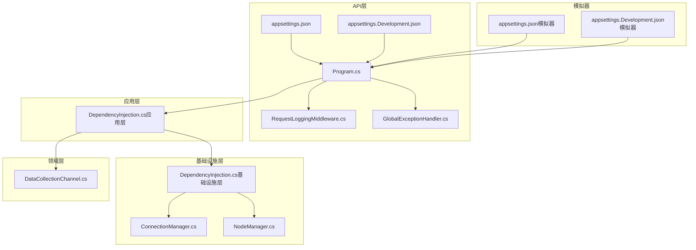
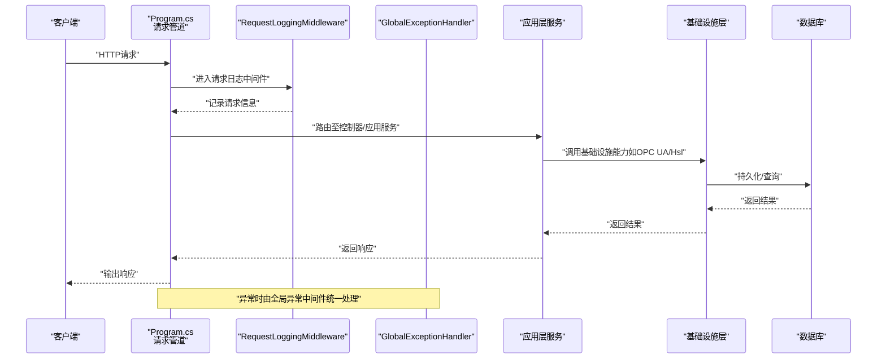
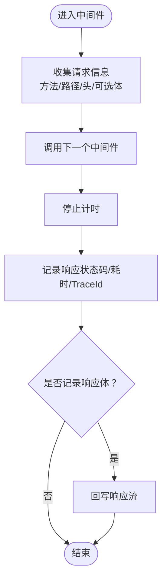
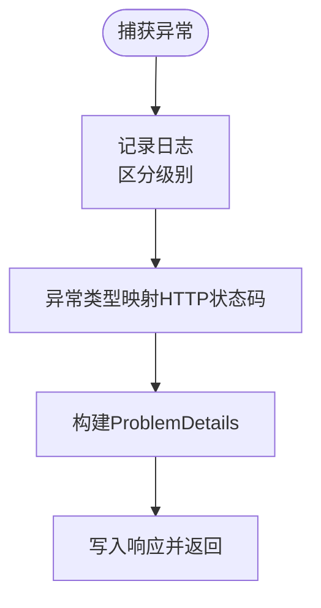
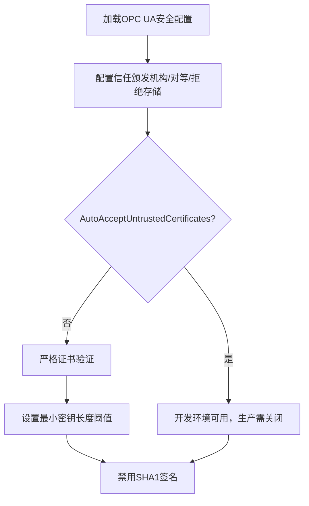
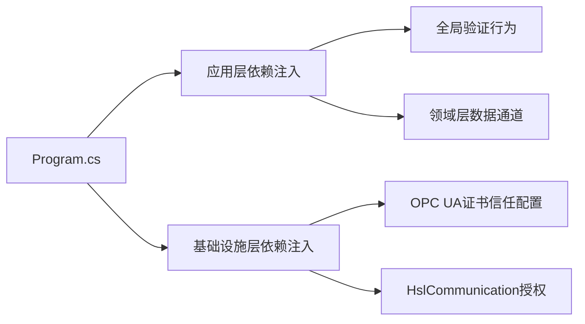

# 安全与权限

<cite>
**本文引用的文件**
- [Program.cs](file://IndustrialDataSolution/IndustrialDataProcessor.Api/Program.cs)
- [appsettings.json](file://IndustrialDataSolution/IndustrialDataProcessor.Api/appsettings.json)
- [appsettings.Development.json](file://IndustrialDataSolution/IndustrialDataProcessor.Api/appsettings.Development.json)
- [GlobalExceptionHandler.cs](file://IndustrialDataSolution/IndustrialDataProcessor.Api/Middleware/GlobalExceptionHandler.cs)
- [RequestLoggingMiddleware.cs](file://IndustrialDataSolution/IndustrialDataProcessor.Api/Middleware/RequestLoggingMiddleware.cs)
- [DependencyInjection.cs（应用层）](file://IndustrialDataSolution/IndustrialDataProcessor.Application/DependencyInjection.cs)
- [DependencyInjection.cs（基础设施层）](file://IndustrialDataSolution/IndustrialDataProcessor.Infrastructure/DependencyInjection.cs)
- [ConnectionManager.cs](file://IndustrialDataSolution/IndustrialDataProcessor.Infrastructure/Communication/Connection/ConnectionManager.cs)
- [NodeManager.cs](file://IndustrialDataSolution/IndustrialDataProcessor.Infrastructure/OpcUa/NodeManager.cs)
- [DataCollectionChannel.cs](file://IndustrialDataSolution/IndustrialDataProcessor.Domain/Workstation/Results/DataCollectionChannel.cs)
- [appsettings.json（模拟器）](file://IndustrialDataSolution/IndustrialDataProcessor.Simulator/appsettings.json)
- [appsettings.Development.json（模拟器）](file://IndustrialDataSolution/IndustrialDataProcessor.Simulator/appsettings.Development.json)
</cite>

## 目录
1. [简介](#简介)
2. [项目结构](#项目结构)
3. [核心组件](#核心组件)
4. [架构总览](#架构总览)
5. [详细组件分析](#详细组件分析)
6. [依赖关系分析](#依赖关系分析)
7. [性能考虑](#性能考虑)
8. [故障排查指南](#故障排查指南)
9. [结论](#结论)
10. [附录](#附录)

## 简介
本文件面向DDD工业数据处理解决方案中的“安全与权限”主题，系统梳理并说明以下内容：
- PKI证书体系的配置与管理现状与改进建议（含自签名证书生成、信任链与轮换策略）
- HTTPS通信安全配置要点（协议版本、加密套件、证书验证）
- API认证授权机制现状与落地建议（JWT生成、验证、刷新）
- 访问控制列表（ACL）设计与实现思路（角色权限与资源访问控制）
- 数据加密与传输安全（敏感数据加密、通信加密、存储加密）
- 安全审计与合规（操作日志、安全事件追踪）
- 安全漏洞防护与渗透测试指导
- 安全配置最佳实践与常见风险防范

说明：当前仓库中未发现显式的HTTPS与JWT安全配置代码；PKI证书目录存在但未见实际证书文件；API控制器与认证授权尚未实现。本文在现有代码基础上，结合工业场景安全需求，给出可落地的架构与实施建议。

## 项目结构
该解决方案采用多层架构（API、应用、领域、基础设施、共享与模拟器）。与安全相关的关键位置如下：
- API层：请求管道、中间件（日志、异常）、配置与入口
- 应用层：依赖注入注册、全局验证行为
- 基础设施层：OPC UA连接与证书信任配置、HslCommunication授权
- 领域层：数据通道（进程内消息总线）
- 模拟器：开发环境配置

**图表来源**
- [Program.cs](file://IndustrialDataSolution/IndustrialDataProcessor.Api/Program.cs#L1-L54)
- [RequestLoggingMiddleware.cs](file://IndustrialDataSolution/IndustrialDataProcessor.Api/Middleware/RequestLoggingMiddleware.cs#L1-L141)
- [GlobalExceptionHandler.cs](file://IndustrialDataSolution/IndustrialDataProcessor.Api/Middleware/GlobalExceptionHandler.cs#L1-L94)
- [DependencyInjection.cs（应用层）](file://IndustrialDataSolution/IndustrialDataProcessor.Application/DependencyInjection.cs#L1-L40)
- [DependencyInjection.cs（基础设施层）](file://IndustrialDataSolution/IndustrialDataProcessor.Infrastructure/DependencyInjection.cs#L1-L82)
- [ConnectionManager.cs](file://IndustrialDataSolution/IndustrialDataProcessor.Infrastructure/Communication/Connection/ConnectionManager.cs#L262-L308)
- [NodeManager.cs](file://IndustrialDataSolution/IndustrialDataProcessor.Infrastructure/OpcUa/NodeManager.cs#L26-L260)
- [DataCollectionChannel.cs](file://IndustrialDataSolution/IndustrialDataProcessor.Domain/Workstation/Results/DataCollectionChannel.cs#L1-L26)
- [appsettings.json](file://IndustrialDataSolution/IndustrialDataProcessor.Api/appsettings.json#L1-L17)
- [appsettings.Development.json](file://IndustrialDataSolution/IndustrialDataProcessor.Api/appsettings.Development.json#L1-L9)
- [appsettings.json（模拟器）](file://IndustrialDataSolution/IndustrialDataProcessor.Simulator/appsettings.json#L1-L8)
- [appsettings.Development.json（模拟器）](file://IndustrialDataSolution/IndustrialDataProcessor.Simulator/appsettings.Development.json#L1-L8)

**章节来源**
- [Program.cs](file://IndustrialDataSolution/IndustrialDataProcessor.Api/Program.cs#L1-L54)
- [DependencyInjection.cs（应用层）](file://IndustrialDataSolution/IndustrialDataProcessor.Application/DependencyInjection.cs#L1-L40)
- [DependencyInjection.cs（基础设施层）](file://IndustrialDataSolution/IndustrialDataProcessor.Infrastructure/DependencyInjection.cs#L1-L82)

## 核心组件
- 请求日志中间件：记录请求/响应元数据、耗时与TraceId，支持可选请求/响应体记录，便于审计与排障
- 全局异常处理中间件：统一输出RFC 7807风格ProblemDetails，按异常类型映射HTTP状态码，增强可观测性
- 依赖注入与启动流程：注册应用层、基础设施层、健康检查、Swagger等；当前未启用HTTPS与JWT
- OPC UA证书信任配置：演示了证书存储路径、信任链与自动接受不受信任证书的策略（开发环境建议关闭）
- HslCommunication授权：通过配置节点校验授权码，防止未授权使用

**章节来源**
- [RequestLoggingMiddleware.cs](file://IndustrialDataSolution/IndustrialDataProcessor.Api/Middleware/RequestLoggingMiddleware.cs#L1-L141)
- [GlobalExceptionHandler.cs](file://IndustrialDataSolution/IndustrialDataProcessor.Api/Middleware/GlobalExceptionHandler.cs#L1-L94)
- [DependencyInjection.cs（基础设施层）](file://IndustrialDataSolution/IndustrialDataProcessor.Infrastructure/DependencyInjection.cs#L17-L46)
- [ConnectionManager.cs](file://IndustrialDataSolution/IndustrialDataProcessor.Infrastructure/Communication/Connection/ConnectionManager.cs#L262-L308)
- [appsettings.json](file://IndustrialDataSolution/IndustrialDataProcessor.Api/appsettings.json#L10-L15)

## 架构总览
下图展示API层请求进入后的处理流程，以及与应用/基础设施层的交互关系。当前未包含HTTPS与JWT处理步骤，后续可在此基础上扩展。

**图表来源**
- [Program.cs](file://IndustrialDataSolution/IndustrialDataProcessor.Api/Program.cs#L36-L51)
- [RequestLoggingMiddleware.cs](file://IndustrialDataSolution/IndustrialDataProcessor.Api/Middleware/RequestLoggingMiddleware.cs#L16-L84)
- [GlobalExceptionHandler.cs](file://IndustrialDataSolution/IndustrialDataProcessor.Api/Middleware/GlobalExceptionHandler.cs#L12-L47)
- [DependencyInjection.cs（应用层）](file://IndustrialDataSolution/IndustrialDataProcessor.Application/DependencyInjection.cs#L16-L39)
- [DependencyInjection.cs（基础设施层）](file://IndustrialDataSolution/IndustrialDataProcessor.Infrastructure/DependencyInjection.cs#L17-L46)

## 详细组件分析

### 请求日志中间件（审计与排障）
- 功能要点
  - 记录请求方法、路径、TraceId与耗时
  - 可选记录请求/响应体（POST/PUT/PATCH且JSON）
  - 拦截响应流并回写，保证下游中间件正常工作
- 审计价值
  - 提供端到端请求轨迹，便于问题复现与合规审计
- 性能提示
  - 请求/响应体记录会带来IO开销，建议仅在调试环境开启

**图表来源**
- [RequestLoggingMiddleware.cs](file://IndustrialDataSolution/IndustrialDataProcessor.Api/Middleware/RequestLoggingMiddleware.cs#L16-L84)

**章节来源**
- [RequestLoggingMiddleware.cs](file://IndustrialDataSolution/IndustrialDataProcessor.Api/Middleware/RequestLoggingMiddleware.cs#L16-L141)

### 全局异常处理中间件（安全可观测性）
- 功能要点
  - 统一输出ProblemDetails，区分验证、参数、业务、基础设施与未知错误
  - 将FluentValidation错误映射为标准errors字典
  - 记录警告/错误日志，包含路径、方法、消息
- 安全意义
  - 避免泄露内部堆栈细节，降低信息泄露风险
  - 为安全事件追踪提供一致的错误载体

**图表来源**
- [GlobalExceptionHandler.cs](file://IndustrialDataSolution/IndustrialDataProcessor.Api/Middleware/GlobalExceptionHandler.cs#L12-L47)

**章节来源**
- [GlobalExceptionHandler.cs](file://IndustrialDataSolution/IndustrialDataProcessor.Api/Middleware/GlobalExceptionHandler.cs#L1-L94)

### OPC UA证书信任配置（开发环境建议调整）
- 现状
  - 配置了证书存储目录、信任颁发机构、对等信任与拒绝证书存储
  - 启用了自动接受不受信任证书与较低密钥长度容忍
- 安全建议
  - 生产环境应关闭自动接受不受信任证书，严格校验证书链
  - 提升最小证书密钥长度阈值，禁用SHA1签名
  - 使用受信CA签发的证书，建立完整的信任链

**图表来源**
- [ConnectionManager.cs](file://IndustrialDataSolution/IndustrialDataProcessor.Infrastructure/Communication/Connection/ConnectionManager.cs#L262-L308)

**章节来源**
- [ConnectionManager.cs](file://IndustrialDataSolution/IndustrialDataProcessor.Infrastructure/Communication/Connection/ConnectionManager.cs#L262-L308)

### HslCommunication授权（供应链与合规）
- 现状
  - 从配置读取授权码并在启动阶段校验，未通过则直接终止
- 合规意义
  - 防止未授权使用第三方组件，满足合规与供应链安全要求

**章节来源**
- [DependencyInjection.cs（基础设施层）](file://IndustrialDataSolution/IndustrialDataProcessor.Infrastructure/DependencyInjection.cs#L19-L28)
- [appsettings.json](file://IndustrialDataSolution/IndustrialDataProcessor.Api/appsettings.json#L13-L15)

### API认证授权机制（当前状态与实施建议）
- 当前状态
  - 未发现JWT相关配置或控制器
  - 未启用身份认证中间件
- 实施建议（概念性）
  - HTTPS/TLS：强制HTTPS，禁用过时协议，选择现代加密套件
  - JWT：基于对称/非对称密钥签发，短有效期+刷新令牌，支持黑名单
  - 授权：基于角色/资源的ACL，细粒度权限控制
  - 审计：记录登录/登出、关键操作、失败尝试

[本节为概念性说明，不直接分析具体文件，故无“章节来源”]

### 访问控制列表（ACL）设计与实现（概念性）
- 角色与权限
  - 管理员、运维、读写、只读等角色
  - 资源维度：工作站、设备、协议、参数、配置
- 实施要点
  - 基于策略的授权（如ABAC）
  - 控制器/服务层前置校验
  - 权限变更审计与最小权限原则

[本节为概念性说明，不直接分析具体文件，故无“章节来源”]

### 数据加密与传输安全（概念性）
- 传输加密
  - HTTPS/TLS：禁用SSLv2/3、TLS1.0/1.1；优先TLS1.3；选择前向保密套件
  - OPC UA：启用加密通道与证书绑定
- 存储加密
  - 敏感配置与证书采用密钥管理服务（KMS）保护
  - 数据库凭据与密钥分离存储
- 进程内数据
  - 使用安全容器与最小暴露面

[本节为概念性说明，不直接分析具体文件，故无“章节来源”]

### 安全审计与合规（基于现有中间件）
- 日志记录
  - 请求日志中间件记录TraceId、状态码、耗时
  - 全局异常中间件统一ProblemDetails输出
- 合规建议
  - 结构化日志输出，支持集中化收集与检索
  - 关键操作与异常事件分级告警

**章节来源**
- [RequestLoggingMiddleware.cs](file://IndustrialDataSolution/IndustrialDataProcessor.Api/Middleware/RequestLoggingMiddleware.cs#L22-L78)
- [GlobalExceptionHandler.cs](file://IndustrialDataSolution/IndustrialDataProcessor.Api/Middleware/GlobalExceptionHandler.cs#L12-L47)

### 安全漏洞防护与渗透测试（概念性）
- 输入验证与参数校验
  - 借助应用层验证器与全局验证行为
- 传输安全
  - 强制HTTPS，禁用弱加密
- 权限控制
  - 基于角色的最小权限
- 渗透测试
  - 定期进行OWASP Top 10覆盖测试，重点检查认证、授权、输入与配置

[本节为概念性说明，不直接分析具体文件，故无“章节来源”]

## 依赖关系分析
- API层依赖应用层与基础设施层的服务注册
- 应用层依赖验证器与全局验证行为
- 基础设施层依赖OPC UA与HslCommunication，包含证书信任配置
- 领域层提供进程内数据通道，避免跨进程耦合

**图表来源**
- [Program.cs](file://IndustrialDataSolution/IndustrialDataProcessor.Api/Program.cs#L18-L30)
- [DependencyInjection.cs（应用层）](file://IndustrialDataSolution/IndustrialDataProcessor.Application/DependencyInjection.cs#L16-L39)
- [DependencyInjection.cs（基础设施层）](file://IndustrialDataSolution/IndustrialDataProcessor.Infrastructure/DependencyInjection.cs#L17-L46)
- [ConnectionManager.cs](file://IndustrialDataSolution/IndustrialDataProcessor.Infrastructure/Communication/Connection/ConnectionManager.cs#L262-L308)

**章节来源**
- [Program.cs](file://IndustrialDataSolution/IndustrialDataProcessor.Api/Program.cs#L18-L30)
- [DependencyInjection.cs（应用层）](file://IndustrialDataSolution/IndustrialDataProcessor.Application/DependencyInjection.cs#L16-L39)
- [DependencyInjection.cs（基础设施层）](file://IndustrialDataSolution/IndustrialDataProcessor.Infrastructure/DependencyInjection.cs#L17-L46)

## 性能考虑
- 请求日志中间件的请求/响应体记录会增加IO与内存占用，建议仅在调试环境启用
- 全局异常中间件统一输出，减少重复逻辑，提升可观测性
- OPC UA证书自动接受不受信任证书在开发环境可用，生产需关闭以避免降级风险

[本节为通用建议，不直接分析具体文件，故无“章节来源”]

## 故障排查指南
- 启动失败（HslCommunication授权）
  - 现象：启动即抛出异常
  - 排查：确认配置节点是否存在且授权通过
- OPC UA连接异常
  - 现象：证书链校验失败或连接超时
  - 排查：检查证书存储路径、信任链与自动接受不受信任证书开关
- API异常响应
  - 现象：统一ProblemDetails输出
  - 排查：查看日志中的路径、方法与消息，定位具体异常类型

**章节来源**
- [DependencyInjection.cs（基础设施层）](file://IndustrialDataSolution/IndustrialDataProcessor.Infrastructure/DependencyInjection.cs#L22-L28)
- [ConnectionManager.cs](file://IndustrialDataSolution/IndustrialDataProcessor.Infrastructure/Communication/Connection/ConnectionManager.cs#L295-L308)
- [GlobalExceptionHandler.cs](file://IndustrialDataSolution/IndustrialDataProcessor.Api/Middleware/GlobalExceptionHandler.cs#L12-L47)

## 结论
- 当前代码库已具备良好的安全可观测性基础（请求日志与异常处理），但缺少HTTPS与JWT等核心安全机制
- OPC UA证书信任配置在开发环境较为宽松，生产需收紧策略
- 建议尽快补齐HTTPS/TLS、JWT认证授权与ACL控制，并完善数据加密与安全审计
- 通过持续的渗透测试与合规检查，确保系统在工业场景下的安全性与稳定性

[本节为总结性内容，不直接分析具体文件，故无“章节来源”]

## 附录
- 配置文件位置
  - API层配置：[appsettings.json](file://IndustrialDataSolution/IndustrialDataProcessor.Api/appsettings.json#L1-L17)、[appsettings.Development.json](file://IndustrialDataSolution/IndustrialDataProcessor.Api/appsettings.Development.json#L1-L9)
  - 模拟器配置：[appsettings.json（模拟器）](file://IndustrialDataSolution/IndustrialDataProcessor.Simulator/appsettings.json#L1-L8)、[appsettings.Development.json（模拟器）](file://IndustrialDataSolution/IndustrialDataProcessor.Simulator/appsettings.Development.json#L1-L8)
- 进程内数据通道
  - [DataCollectionChannel.cs](file://IndustrialDataSolution/IndustrialDataProcessor.Domain/Workstation/Results/DataCollectionChannel.cs#L1-L26)