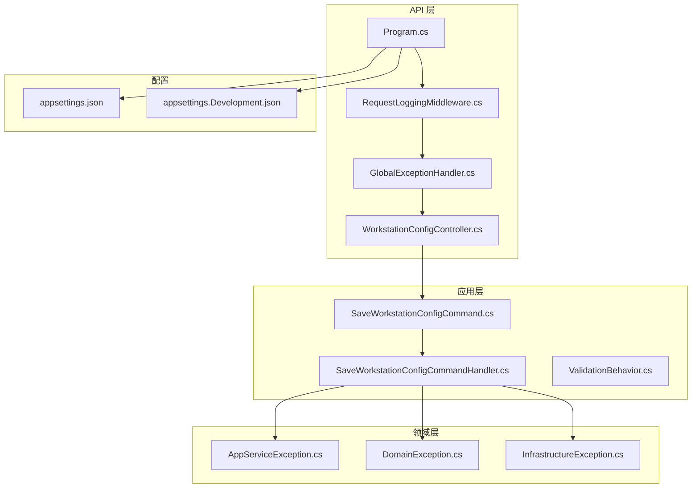
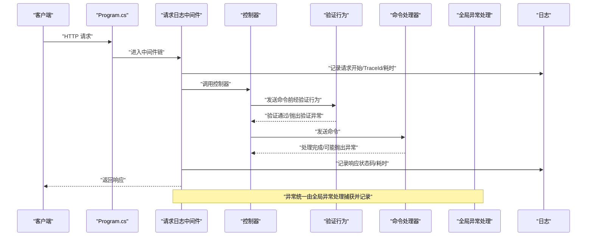
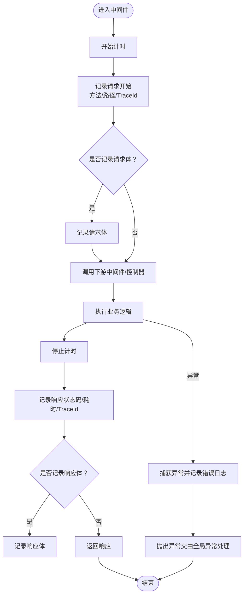
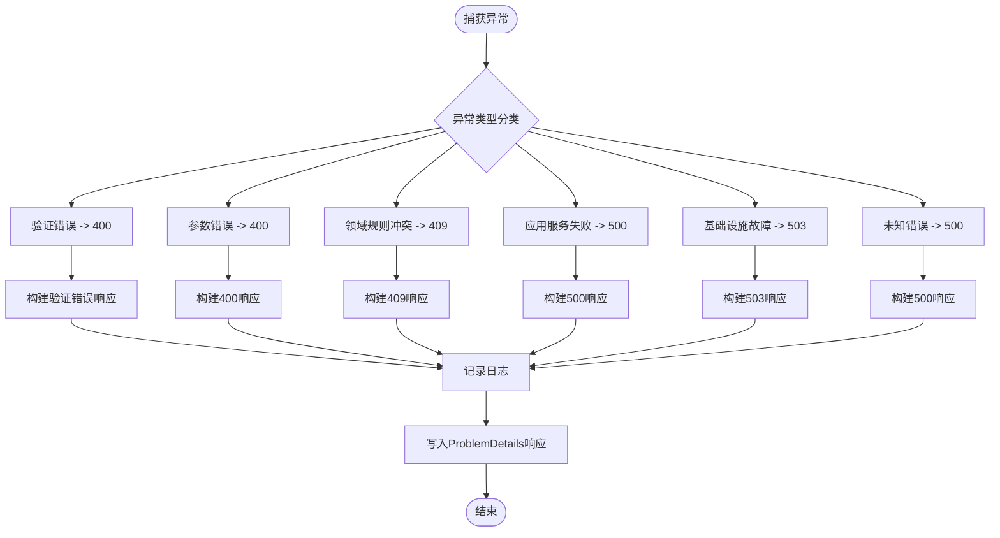
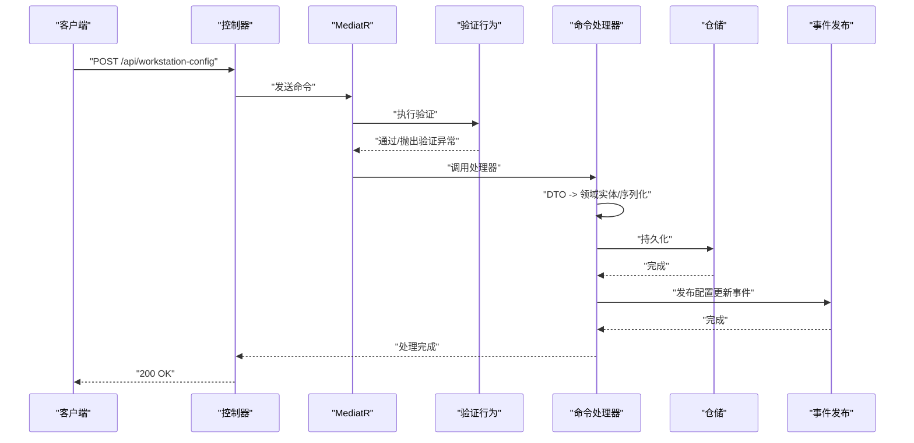
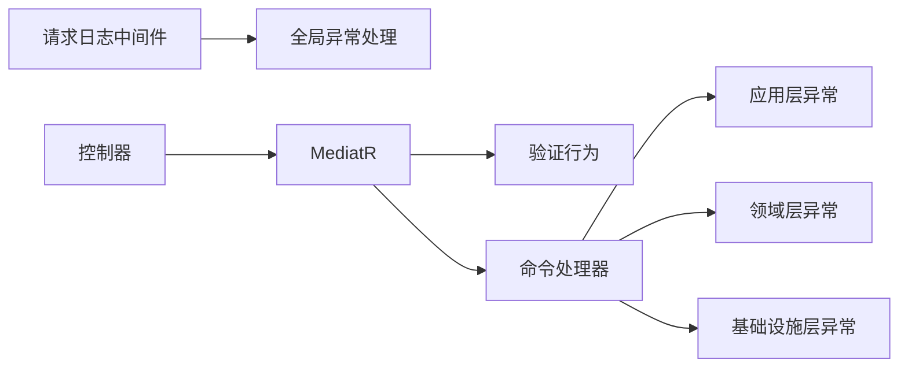

# 安全审计与合规

<cite>
**本文引用的文件**
- [Program.cs](file://IndustrialDataSolution/IndustrialDataProcessor.Api/Program.cs)
- [RequestLoggingMiddleware.cs](file://IndustrialDataSolution/IndustrialDataProcessor.Api/Middleware/RequestLoggingMiddleware.cs)
- [GlobalExceptionHandler.cs](file://IndustrialDataSolution/IndustrialDataProcessor.Api/Middleware/GlobalExceptionHandler.cs)
- [WorkstationConfigController.cs](file://IndustrialDataSolution/IndustrialDataProcessor.Api/Controllers/WorkstationConfigController.cs)
- [SaveWorkstationConfigCommand.cs](file://IndustrialDataSolution/IndustrialDataProcessor.Application/Commands/SaveWorkstationConfigCommand.cs)
- [SaveWorkstationConfigCommandHandler.cs](file://IndustrialDataSolution/IndustrialDataProcessor.Application/CommandHandlers/SaveWorkstationConfigCommandHandler.cs)
- [ValidationBehavior.cs](file://IndustrialDataSolution/IndustrialDataProcessor.Application/Behaviors/ValidationBehavior.cs)
- [AppServiceException.cs](file://IndustrialDataSolution/IndustrialDataProcessor.Domain/Exceptions/AppServiceException.cs)
- [DomainException.cs](file://IndustrialDataSolution/IndustrialDataProcessor.Domain/Exceptions/DomainException.cs)
- [InfrastructureException.cs](file://IndustrialDataSolution/IndustrialDataProcessor.Domain/Exceptions/InfrastructureException.cs)
- [appsettings.json](file://IndustrialDataSolution/IndustrialDataProcessor.Api/appsettings.json)
- [appsettings.Development.json](file://IndustrialDataSolution/IndustrialDataProcessor.Api/appsettings.Development.json)
</cite>

## 目录
1. [引言](#引言)
2. [项目结构](#项目结构)
3. [核心组件](#核心组件)
4. [架构总览](#架构总览)
5. [详细组件分析](#详细组件分析)
6. [依赖关系分析](#依赖关系分析)
7. [性能考量](#性能考量)
8. [故障排查指南](#故障排查指南)
9. [结论](#结论)
10. [附录](#附录)

## 引言
本文件面向DDD工业数据处理解决方案，聚焦“安全审计与合规”主题，系统梳理并解释以下内容：
- 安全事件的监控与记录机制：请求日志的结构化记录、错误事件的捕获、异常行为的检测策略
- 操作审计日志设计与实现：用户操作追踪、数据变更记录、系统访问监控
- 合规性满足方案：工业控制系统安全标准、数据保护法规与行业最佳实践
- 安全告警与事件响应：异常检测算法思路、告警阈值设置、应急响应流程
- 安全评估与渗透测试：扫描工具使用、漏洞评估与修复建议
- 安全文档维护与审计报告生成：持续改进的安全管理流程

## 项目结构
本项目采用分层架构（API、应用、领域、基础设施、持久化），安全相关能力主要分布在API层的中间件与控制器，应用层的管道行为与命令处理器，以及领域层的异常体系。

图表来源
- [Program.cs](file://IndustrialDataSolution/IndustrialDataProcessor.Api/Program.cs#L36-L51)
- [RequestLoggingMiddleware.cs](file://IndustrialDataSolution/IndustrialDataProcessor.Api/Middleware/RequestLoggingMiddleware.cs#L16-L84)
- [GlobalExceptionHandler.cs](file://IndustrialDataSolution/IndustrialDataProcessor.Api/Middleware/GlobalExceptionHandler.cs#L12-L47)
- [WorkstationConfigController.cs](file://IndustrialDataSolution/IndustrialDataProcessor.Api/Controllers/WorkstationConfigController.cs#L14-L21)
- [SaveWorkstationConfigCommand.cs](file://IndustrialDataSolution/IndustrialDataProcessor.Application/Commands/SaveWorkstationConfigCommand.cs#L7-L7)
- [SaveWorkstationConfigCommandHandler.cs](file://IndustrialDataSolution/IndustrialDataProcessor.Application/CommandHandlers/SaveWorkstationConfigCommandHandler.cs#L18-L30)
- [ValidationBehavior.cs](file://IndustrialDataSolution/IndustrialDataProcessor.Application/Behaviors/ValidationBehavior.cs#L12-L29)
- [AppServiceException.cs](file://IndustrialDataSolution/IndustrialDataProcessor.Domain/Exceptions/AppServiceException.cs#L5-L8)
- [DomainException.cs](file://IndustrialDataSolution/IndustrialDataProcessor.Domain/Exceptions/DomainException.cs#L4-L6)
- [InfrastructureException.cs](file://IndustrialDataSolution/IndustrialDataProcessor.Domain/Exceptions/InfrastructureException.cs#L5-L9)
- [appsettings.json](file://IndustrialDataSolution/IndustrialDataProcessor.Api/appsettings.json#L1-L17)
- [appsettings.Development.json](file://IndustrialDataSolution/IndustrialDataProcessor.Api/appsettings.Development.json#L1-L9)

章节来源
- [Program.cs](file://IndustrialDataSolution/IndustrialDataProcessor.Api/Program.cs#L10-L51)
- [appsettings.json](file://IndustrialDataSolution/IndustrialDataProcessor.Api/appsettings.json#L1-L17)
- [appsettings.Development.json](file://IndustrialDataSolution/IndustrialDataProcessor.Api/appsettings.Development.json#L1-L9)

## 核心组件
- 请求日志中间件：在请求进入与完成时记录方法、路径、TraceId、耗时、状态码，并可选记录请求/响应体，便于审计与问题定位
- 全局异常处理中间件：统一捕获未处理异常，按异常类型映射为标准化ProblemDetails响应，同时记录日志，避免敏感信息泄露
- 控制器与命令处理：控制器接收HTTP请求，转换为命令并通过MediatR传递至应用层处理器；处理器负责序列化领域对象、持久化与发布事件
- 验证行为：在应用层管道中集中执行FluentValidation验证，失败时统一抛出ValidationException，确保输入质量
- 异常体系：分层定义异常类型（应用层、领域层、基础设施层），便于区分错误来源与处理策略

章节来源
- [RequestLoggingMiddleware.cs](file://IndustrialDataSolution/IndustrialDataProcessor.Api/Middleware/RequestLoggingMiddleware.cs#L16-L84)
- [GlobalExceptionHandler.cs](file://IndustrialDataSolution/IndustrialDataProcessor.Api/Middleware/GlobalExceptionHandler.cs#L12-L47)
- [WorkstationConfigController.cs](file://IndustrialDataSolution/IndustrialDataProcessor.Api/Controllers/WorkstationConfigController.cs#L14-L21)
- [SaveWorkstationConfigCommandHandler.cs](file://IndustrialDataSolution/IndustrialDataProcessor.Application/CommandHandlers/SaveWorkstationConfigCommandHandler.cs#L18-L30)
- [ValidationBehavior.cs](file://IndustrialDataSolution/IndustrialDataProcessor.Application/Behaviors/ValidationBehavior.cs#L12-L29)
- [AppServiceException.cs](file://IndustrialDataSolution/IndustrialDataProcessor.Domain/Exceptions/AppServiceException.cs#L5-L8)
- [DomainException.cs](file://IndustrialDataSolution/IndustrialDataProcessor.Domain/Exceptions/DomainException.cs#L4-L6)
- [InfrastructureException.cs](file://IndustrialDataSolution/IndustrialDataProcessor.Domain/Exceptions/InfrastructureException.cs#L5-L9)

## 架构总览
下图展示从HTTP请求到响应的关键路径，以及安全相关组件的介入点：

图表来源
- [Program.cs](file://IndustrialDataSolution/IndustrialDataProcessor.Api/Program.cs#L38-L49)
- [RequestLoggingMiddleware.cs](file://IndustrialDataSolution/IndustrialDataProcessor.Api/Middleware/RequestLoggingMiddleware.cs#L16-L84)
- [GlobalExceptionHandler.cs](file://IndustrialDataSolution/IndustrialDataProcessor.Api/Middleware/GlobalExceptionHandler.cs#L12-L47)
- [WorkstationConfigController.cs](file://IndustrialDataSolution/IndustrialDataProcessor.Api/Controllers/WorkstationConfigController.cs#L14-L21)
- [SaveWorkstationConfigCommandHandler.cs](file://IndustrialDataSolution/IndustrialDataProcessor.Application/CommandHandlers/SaveWorkstationConfigCommandHandler.cs#L18-L30)
- [ValidationBehavior.cs](file://IndustrialDataSolution/IndustrialDataProcessor.Application/Behaviors/ValidationBehavior.cs#L12-L29)

## 详细组件分析

### 请求日志中间件（结构化记录与异常捕获）
- 结构化记录字段：HTTP方法、路径、查询字符串、请求头、TraceId、耗时、状态码、可选请求体与响应体
- 性能控制：仅对POST/PUT/PATCH且JSON的请求记录请求体；仅对2xx的成功响应记录响应体
- 异常捕获：在中间件内捕获异常并记录错误日志，随后交由全局异常处理中间件统一响应
- 审计价值：可追溯用户行为、接口调用轨迹、异常发生时间线

图表来源
- [RequestLoggingMiddleware.cs](file://IndustrialDataSolution/IndustrialDataProcessor.Api/Middleware/RequestLoggingMiddleware.cs#L16-L84)

章节来源
- [RequestLoggingMiddleware.cs](file://IndustrialDataSolution/IndustrialDataProcessor.Api/Middleware/RequestLoggingMiddleware.cs#L16-L84)

### 全局异常处理（错误事件捕获与标准化响应）
- 分类映射：根据异常类型映射为400（参数/验证）、409（业务规则）、500（应用服务）、503（基础设施）等状态码
- 标准化输出：统一使用ProblemDetails，包含状态码、标题、详情、实例路径等
- 日志记录：区分警告与错误级别，记录异常堆栈与上下文信息
- 审计价值：统一错误视图，便于统计分析与合规报告

图表来源
- [GlobalExceptionHandler.cs](file://IndustrialDataSolution/IndustrialDataProcessor.Api/Middleware/GlobalExceptionHandler.cs#L22-L47)

章节来源
- [GlobalExceptionHandler.cs](file://IndustrialDataSolution/IndustrialDataProcessor.Api/Middleware/GlobalExceptionHandler.cs#L12-L47)

### 控制器与命令处理（操作审计与数据变更）
- 控制器职责：接收HTTP请求，封装为命令，通过MediatR发送
- 命令处理职责：将DTO映射为领域实体，序列化后持久化，发布领域事件以触发后续流程
- 审计要点：可在命令处理前后扩展审计钩子，记录操作人、操作类型、变更前/后快照、时间戳、TraceId

图表来源
- [WorkstationConfigController.cs](file://IndustrialDataSolution/IndustrialDataProcessor.Api/Controllers/WorkstationConfigController.cs#L14-L21)
- [SaveWorkstationConfigCommand.cs](file://IndustrialDataSolution/IndustrialDataProcessor.Application/Commands/SaveWorkstationConfigCommand.cs#L7-L7)
- [SaveWorkstationConfigCommandHandler.cs](file://IndustrialDataSolution/IndustrialDataProcessor.Application/CommandHandlers/SaveWorkstationConfigCommandHandler.cs#L18-L30)
- [ValidationBehavior.cs](file://IndustrialDataSolution/IndustrialDataProcessor.Application/Behaviors/ValidationBehavior.cs#L12-L29)

章节来源
- [WorkstationConfigController.cs](file://IndustrialDataSolution/IndustrialDataProcessor.Api/Controllers/WorkstationConfigController.cs#L14-L21)
- [SaveWorkstationConfigCommandHandler.cs](file://IndustrialDataSolution/IndustrialDataProcessor.Application/CommandHandlers/SaveWorkstationConfigCommandHandler.cs#L18-L30)

### 验证行为（输入质量与异常行为检测）
- 集中验证：在应用层管道中统一执行FluentValidation，减少重复校验逻辑
- 失败处理：聚合所有验证失败项，统一抛出ValidationException，便于前端与审计系统一致处理
- 异常行为检测思路：可在此基础上扩展自定义规则（如参数范围、组合约束、业务规则校验）

章节来源
- [ValidationBehavior.cs](file://IndustrialDataSolution/IndustrialDataProcessor.Application/Behaviors/ValidationBehavior.cs#L12-L29)

### 异常体系（分层错误语义与合规映射）
- 应用层异常：用于业务用例执行失败、并发冲突等场景
- 领域层异常：用于违反业务规则、聚合状态无效等场景
- 基础设施层异常：用于数据库/外部服务不可用等场景
- 合规价值：清晰的错误分层有助于审计归因、责任界定与风险评估

章节来源
- [AppServiceException.cs](file://IndustrialDataSolution/IndustrialDataProcessor.Domain/Exceptions/AppServiceException.cs#L5-L8)
- [DomainException.cs](file://IndustrialDataSolution/IndustrialDataProcessor.Domain/Exceptions/DomainException.cs#L4-L6)
- [InfrastructureException.cs](file://IndustrialDataSolution/IndustrialDataProcessor.Domain/Exceptions/InfrastructureException.cs#L5-L9)

## 依赖关系分析
- 中间件顺序：请求日志中间件先于全局异常处理中间件，确保异常也能被记录
- 控制器依赖MediatR：通过命令模式解耦请求处理与业务逻辑
- 应用层依赖验证行为：在命令到达处理器前进行输入校验
- 异常处理依赖领域异常类型：根据异常类型映射不同HTTP状态码

图表来源
- [Program.cs](file://IndustrialDataSolution/IndustrialDataProcessor.Api/Program.cs#L38-L49)
- [WorkstationConfigController.cs](file://IndustrialDataSolution/IndustrialDataProcessor.Api/Controllers/WorkstationConfigController.cs#L14-L21)
- [ValidationBehavior.cs](file://IndustrialDataSolution/IndustrialDataProcessor.Application/Behaviors/ValidationBehavior.cs#L12-L29)
- [SaveWorkstationConfigCommandHandler.cs](file://IndustrialDataSolution/IndustrialDataProcessor.Application/CommandHandlers/SaveWorkstationConfigCommandHandler.cs#L18-L30)
- [AppServiceException.cs](file://IndustrialDataSolution/IndustrialDataProcessor.Domain/Exceptions/AppServiceException.cs#L5-L8)
- [DomainException.cs](file://IndustrialDataSolution/IndustrialDataProcessor.Domain/Exceptions/DomainException.cs#L4-L6)
- [InfrastructureException.cs](file://IndustrialDataSolution/IndustrialDataProcessor.Domain/Exceptions/InfrastructureException.cs#L5-L9)

章节来源
- [Program.cs](file://IndustrialDataSolution/IndustrialDataProcessor.Api/Program.cs#L36-L51)

## 性能考量
- 请求/响应体记录的性能影响：仅对特定方法与JSON类型记录，避免对大体积请求/响应造成显著开销
- 日志级别控制：Debug级别的请求/响应体记录需谨慎开启，防止生产环境日志风暴
- 异步与内存流：中间件使用内存流拦截响应，注意在高并发场景下的内存占用与GC压力
- 建议：结合采样策略与异步日志写入，平衡审计完整性与系统性能

## 故障排查指南
- 快速定位：利用TraceId串联请求生命周期，结合请求日志与异常日志快速定位问题
- 错误分类：依据全局异常处理的分类映射，判断是输入验证、业务规则、应用服务还是基础设施问题
- 验证失败：关注400错误中的验证错误集合，逐项核对字段与规则
- 基础设施故障：关注503错误，检查数据库连接池、外部服务可用性与健康检查端点
- 配置核对：确认连接字符串、授权码与日志级别配置

章节来源
- [GlobalExceptionHandler.cs](file://IndustrialDataSolution/IndustrialDataProcessor.Api/Middleware/GlobalExceptionHandler.cs#L22-L47)
- [RequestLoggingMiddleware.cs](file://IndustrialDataSolution/IndustrialDataProcessor.Api/Middleware/RequestLoggingMiddleware.cs#L72-L78)
- [appsettings.json](file://IndustrialDataSolution/IndustrialDataProcessor.Api/appsettings.json#L10-L15)

## 结论
本方案通过“请求日志中间件+全局异常处理+应用层验证+分层异常体系”的组合，实现了对工业数据处理流程的可观测性与可审计性。建议在现有基础上扩展：
- 操作审计日志：在命令处理器前后增加审计钩子，记录操作人、变更前后快照、TraceId
- 合规映射：将异常分类与状态码映射到具体合规条款，形成可追溯的合规证据链
- 安全告警：基于日志统计与阈值规则（如错误率、响应时间、异常类型分布）建立告警
- 渗透测试：定期进行安全扫描与渗透测试，结合异常日志与审计日志评估修复效果

## 附录

### 合规性要求满足方案
- 工业控制系统安全标准：遵循IEC 62443、NIST SP 800-82等，强化边界防护、最小权限与变更管理
- 数据保护法规：遵循GDPR、网络安全法等，确保日志中不包含个人敏感数据，提供数据主体权利支持
- 行业最佳实践：实施纵深防御、零信任网络、最小暴露面与持续监控

### 安全告警与事件响应
- 异常检测算法思路：基于历史基线计算错误率、响应时间分布、异常类型占比，设定动态阈值
- 告警阈值设置：按SLA与业务影响分级（严重/一般），结合日志采样与去噪策略
- 应急响应流程：事件分级、通知机制、处置步骤、复盘与改进

### 安全评估与渗透测试
- 扫描工具：OWASP ZAP、Burp Suite、Nessus等，结合自动化与手工测试
- 漏洞评估：识别注入、认证缺陷、授权绕过、敏感信息泄露、日志滥用等风险
- 修复建议：补丁管理、配置加固、访问控制强化、日志脱敏与保留策略

### 安全文档维护与审计报告
- 文档维护：版本化记录安全策略、配置变更、漏洞修复与演练结果
- 审计报告：按合规条款生成月度/季度报告，包含指标趋势、事件统计、改进建议与验证结果
- 持续改进：基于日志分析与渗透测试结果迭代安全策略与流程