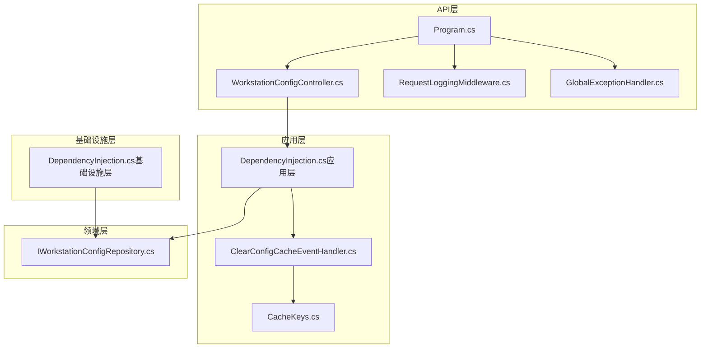
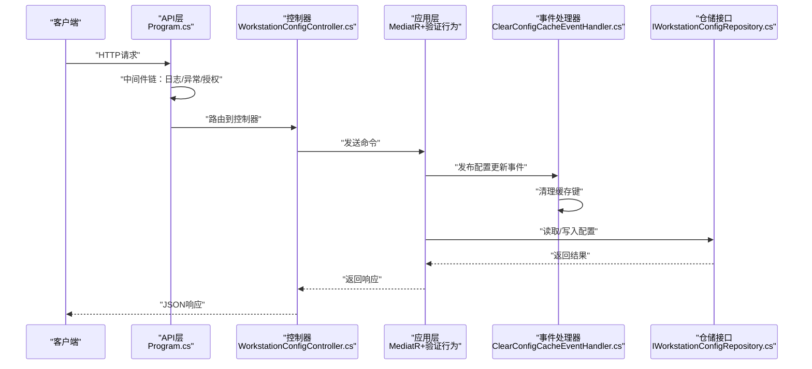
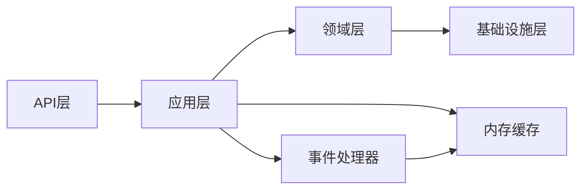

# 授权控制

<cite>
**本文引用的文件**
- [Program.cs](file://IndustrialDataSolution/IndustrialDataProcessor.Api/Program.cs)
- [WorkstationConfigController.cs](file://IndustrialDataSolution/IndustrialDataProcessor.Api/Controllers/WorkstationConfigController.cs)
- [GlobalExceptionHandler.cs](file://IndustrialDataSolution/IndustrialDataProcessor.Api/Middleware/GlobalExceptionHandler.cs)
- [RequestLoggingMiddleware.cs](file://IndustrialDataSolution/IndustrialDataProcessor.Api/Middleware/RequestLoggingMiddleware.cs)
- [DependencyInjection.cs（应用层）](file://IndustrialDataSolution/IndustrialDataProcessor.Application/DependencyInjection.cs)
- [DependencyInjection.cs（基础设施层）](file://IndustrialDataSolution/IndustrialDataProcessor.Infrastructure/DependencyInjection.cs)
- [CacheKeys.cs](file://IndustrialDataSolution/IndustrialDataProcessor.Application/Constants/CacheKeys.cs)
- [ClearConfigCacheEventHandler.cs](file://IndustrialDataSolution/IndustrialDataProcessor.Application/EventHandlers/ClearConfigCacheEventHandler.cs)
- [IWorkstationConfigRepository.cs](file://IndustrialDataSolution/IndustrialDataProcessor.Domain/Repositories/IWorkstationConfigRepository.cs)
- [appsettings.json](file://IndustrialDataSolution/IndustrialDataProcessor.Api/appsettings.json)
- [appsettings.Development.json](file://IndustrialDataSolution/IndustrialDataProcessor.Api/appsettings.Development.json)
</cite>

## 目录
1. [引言](#引言)
2. [项目结构](#项目结构)
3. [核心组件](#核心组件)
4. [架构总览](#架构总览)
5. [详细组件分析](#详细组件分析)
6. [依赖关系分析](#依赖关系分析)
7. [性能考虑](#性能考虑)
8. [故障排查指南](#故障排查指南)
9. [结论](#结论)
10. [附录](#附录)

## 引言
本文件面向DDD工业数据处理解决方案的授权控制，系统性梳理基于角色的访问控制（RBAC）模型在该代码库中的设计与实现现状，覆盖角色定义、权限分配与访问决策逻辑；API端点授权策略（控制器级、方法级、参数级）；资源访问控制（行级、字段级、操作级）；授权中间件工作原理（权限检查、缓存策略、性能优化）；以及授权配置最佳实践与失败处理及审计日志要求。  
说明：当前仓库未发现显式的RBAC角色与权限模型实现（如角色表、权限表、授权中间件、策略授权等）。本文在“现状”基础上提供“建议与最佳实践”，帮助在不破坏现有架构的前提下平滑引入授权能力。

## 项目结构
- API层：负责HTTP入口、中间件链路、控制器与MediatR编排。
- 应用层：负责用例编排、验证拦截、事件发布与缓存键常量。
- 领域层：负责领域实体、仓储接口与业务规则异常。
- 基础设施层：负责通信授权初始化、后台服务与驱动注册。

图表来源
- [Program.cs](file://IndustrialDataSolution/IndustrialDataProcessor.Api/Program.cs#L36-L51)
- [WorkstationConfigController.cs](file://IndustrialDataSolution/IndustrialDataProcessor.Api/Controllers/WorkstationConfigController.cs#L10-L22)
- [RequestLoggingMiddleware.cs](file://IndustrialDataSolution/IndustrialDataProcessor.Api/Middleware/RequestLoggingMiddleware.cs#L16-L84)
- [GlobalExceptionHandler.cs](file://IndustrialDataSolution/IndustrialDataProcessor.Api/Middleware/GlobalExceptionHandler.cs#L12-L47)
- [DependencyInjection.cs（应用层）](file://IndustrialDataSolution/IndustrialDataProcessor.Application/DependencyInjection.cs#L16-L39)
- [ClearConfigCacheEventHandler.cs](file://IndustrialDataSolution/IndustrialDataProcessor.Application/EventHandlers/ClearConfigCacheEventHandler.cs#L11-L24)
- [CacheKeys.cs](file://IndustrialDataSolution/IndustrialDataProcessor.Application/Constants/CacheKeys.cs#L3-L6)
- [IWorkstationConfigRepository.cs](file://IndustrialDataSolution/IndustrialDataProcessor.Domain/Repositories/IWorkstationConfigRepository.cs#L5-L11)
- [DependencyInjection.cs（基础设施层）](file://IndustrialDataSolution/IndustrialDataProcessor.Infrastructure/DependencyInjection.cs#L17-L79)

章节来源
- [Program.cs](file://IndustrialDataSolution/IndustrialDataProcessor.Api/Program.cs#L10-L51)
- [DependencyInjection.cs（应用层）](file://IndustrialDataSolution/IndustrialDataProcessor.Application/DependencyInjection.cs#L16-L39)
- [DependencyInjection.cs（基础设施层）](file://IndustrialDataSolution/IndustrialDataProcessor.Infrastructure/DependencyInjection.cs#L17-L79)

## 核心组件
- 授权中间件链路
  - 请求日志中间件：最先执行，记录请求/响应与耗时，便于审计与问题定位。
  - 异常处理中间件：捕获未处理异常，统一输出ProblemDetails，避免敏感信息泄露。
  - 授权中间件：调用UseAuthorization，为后续策略授权做准备。
- 控制器与MediatR
  - 控制器接收HTTP请求，封装为命令并通过MediatR分发至应用层处理。
- 应用层行为与缓存
  - 全局验证行为：在命令进入处理前统一校验。
  - 内存缓存键常量：用于配置变更后的缓存清理。
  - 配置更新事件处理器：监听配置更新事件并清理缓存。
- 基础设施层
  - 通信授权初始化：启动阶段对第三方库进行授权校验，失败即终止启动。
  - 后台服务与驱动注册：为数据采集提供运行时基础。

章节来源
- [Program.cs](file://IndustrialDataSolution/IndustrialDataProcessor.Api/Program.cs#L38-L49)
- [WorkstationConfigController.cs](file://IndustrialDataSolution/IndustrialDataProcessor.Api/Controllers/WorkstationConfigController.cs#L14-L21)
- [DependencyInjection.cs（应用层）](file://IndustrialDataSolution/IndustrialDataProcessor.Application/DependencyInjection.cs#L29-L36)
- [CacheKeys.cs](file://IndustrialDataSolution/IndustrialDataProcessor.Application/Constants/CacheKeys.cs#L3-L6)
- [ClearConfigCacheEventHandler.cs](file://IndustrialDataSolution/IndustrialDataProcessor.Application/EventHandlers/ClearConfigCacheEventHandler.cs#L11-L24)
- [DependencyInjection.cs（基础设施层）](file://IndustrialDataSolution/IndustrialDataProcessor.Infrastructure/DependencyInjection.cs#L19-L28)

## 架构总览
下图展示从HTTP请求到应用层处理再到仓储的典型授权与数据流路径。当前仓库未内置策略授权中间件，因此授权检查点主要体现在异常处理与缓存一致性保障上。

图表来源
- [Program.cs](file://IndustrialDataSolution/IndustrialDataProcessor.Api/Program.cs#L38-L49)
- [WorkstationConfigController.cs](file://IndustrialDataSolution/IndustrialDataProcessor.Api/Controllers/WorkstationConfigController.cs#L14-L21)
- [DependencyInjection.cs（应用层）](file://IndustrialDataSolution/IndustrialDataProcessor.Application/DependencyInjection.cs#L29-L36)
- [ClearConfigCacheEventHandler.cs](file://IndustrialDataSolution/IndustrialDataProcessor.Application/EventHandlers/ClearConfigCacheEventHandler.cs#L11-L24)
- [IWorkstationConfigRepository.cs](file://IndustrialDataSolution/IndustrialDataProcessor.Domain/Repositories/IWorkstationConfigRepository.cs#L5-L11)

## 详细组件分析

### RBAC模型现状与建议
- 现状
  - 代码库未发现显式的角色、权限模型与授权中间件。当前授权控制主要通过异常处理与缓存一致性保障实现间接约束。
- 建议
  - 引入基于策略的授权中间件（如ASP.NET Core Authorization Policy），在UseAuthorization之后按需注册策略与需求声明。
  - 在控制器/方法级别标注授权特性，结合策略与需求声明实现细粒度授权。
  - 对于参数级数据过滤，可在应用层命令处理前增加“数据上下文”与“可见性过滤”逻辑，避免越权读取。

章节来源
- [Program.cs](file://IndustrialDataSolution/IndustrialDataProcessor.Api/Program.cs#L48-L48)

### API端点授权策略
- 控制器级
  - 当前控制器未标注任何授权特性，意味着默认策略可能允许匿名访问（取决于全局配置）。建议在控制器上标注策略或角色特性，限定访问主体。
- 方法级
  - 控制器方法未标注授权特性，建议在关键写操作（如保存配置）上增加策略授权，确保仅具备相应权限的用户可执行。
- 参数级
  - 参数级过滤可通过应用层命令处理前的“数据上下文”注入与“可见性规则”实现，避免越权读取/写入。

章节来源
- [WorkstationConfigController.cs](file://IndustrialDataSolution/IndustrialDataProcessor.Api/Controllers/WorkstationConfigController.cs#L8-L21)

### 资源访问控制机制
- 行级安全
  - 通过“数据上下文”在应用层注入当前用户所属组织/站点/产线等标识，在查询仓储时自动附加过滤条件，实现行级隔离。
- 字段级权限
  - 在DTO映射与序列化阶段，根据用户角色裁剪敏感字段；或在应用层返回前进行字段级脱敏。
- 操作级限制
  - 对写操作（新增/修改/删除）统一通过策略授权；对读操作采用“最小可见原则”，仅返回授权范围内的数据。

章节来源
- [IWorkstationConfigRepository.cs](file://IndustrialDataSolution/IndustrialDataProcessor.Domain/Repositories/IWorkstationConfigRepository.cs#L5-L11)

### 授权中间件工作原理
- 当前中间件链
  - 日志中间件：记录请求/响应与TraceId，便于审计与追踪。
  - 异常处理中间件：统一捕获异常并输出标准化ProblemDetails，避免敏感信息泄露。
  - 授权中间件：调用UseAuthorization，为后续策略授权做准备。
- 建议
  - 在UseAuthorization之后注册策略授权中间件，结合需求声明实现细粒度授权。
  - 对高并发场景，建议在授权前缓存策略结果，降低重复计算成本。

章节来源
- [Program.cs](file://IndustrialDataSolution/IndustrialDataProcessor.Api/Program.cs#L38-L49)
- [RequestLoggingMiddleware.cs](file://IndustrialDataSolution/IndustrialDataProcessor.Api/Middleware/RequestLoggingMiddleware.cs#L16-L84)
- [GlobalExceptionHandler.cs](file://IndustrialDataSolution/IndustrialDataProcessor.Api/Middleware/GlobalExceptionHandler.cs#L12-L47)

### 授权配置最佳实践
- 权限粒度设计
  - 采用“最小权限原则”，将权限拆分为“读取/写入/管理”等细粒度操作，避免超级权限。
- 角色继承
  - 通过策略组合与角色继承模型，减少权限维护成本；例如“管理员”继承“普通用户”的读取权限。
- 权限最小化
  - 严格限制用户可见数据范围，避免跨组织/跨产线访问。
- 配置与密钥
  - 通信授权码在启动阶段校验，失败即终止启动，确保系统安全基线。

章节来源
- [DependencyInjection.cs（基础设施层）](file://IndustrialDataSolution/IndustrialDataProcessor.Infrastructure/DependencyInjection.cs#L19-L28)
- [appsettings.json](file://IndustrialDataSolution/IndustrialDataProcessor.Api/appsettings.json#L13-L15)

### 授权失败处理与审计日志
- 失败处理
  - 异常处理中间件统一输出ProblemDetails，避免敏感信息泄露；对不同异常类型返回对应状态码。
- 审计日志
  - 请求日志中间件记录请求/响应与TraceId，建议扩展在授权失败时记录失败原因与用户标识，便于事后审计。

章节来源
- [GlobalExceptionHandler.cs](file://IndustrialDataSolution/IndustrialDataProcessor.Api/Middleware/GlobalExceptionHandler.cs#L12-L47)
- [RequestLoggingMiddleware.cs](file://IndustrialDataSolution/IndustrialDataProcessor.Api/Middleware/RequestLoggingMiddleware.cs#L16-L84)

## 依赖关系分析
- 组件耦合
  - API层依赖应用层的MediatR与验证行为；应用层依赖领域仓储接口；基础设施层负责通信授权与后台服务。
- 外部依赖
  - 启动阶段对第三方库授权码进行校验，失败即终止启动，体现强一致的安全基线。
- 缓存与事件
  - 配置更新事件触发缓存清理，保证数据一致性与授权生效的及时性。

图表来源
- [Program.cs](file://IndustrialDataSolution/IndustrialDataProcessor.Api/Program.cs#L18-L22)
- [DependencyInjection.cs（应用层）](file://IndustrialDataSolution/IndustrialDataProcessor.Application/DependencyInjection.cs#L16-L39)
- [ClearConfigCacheEventHandler.cs](file://IndustrialDataSolution/IndustrialDataProcessor.Application/EventHandlers/ClearConfigCacheEventHandler.cs#L11-L24)

章节来源
- [Program.cs](file://IndustrialDataSolution/IndustrialDataProcessor.Api/Program.cs#L18-L22)
- [DependencyInjection.cs（应用层）](file://IndustrialDataSolution/IndustrialDataProcessor.Application/DependencyInjection.cs#L16-L39)
- [ClearConfigCacheEventHandler.cs](file://IndustrialDataSolution/IndustrialDataProcessor.Application/EventHandlers/ClearConfigCacheEventHandler.cs#L11-L24)

## 性能考虑
- 中间件顺序
  - 日志中间件置于最前，避免后续中间件异常导致日志缺失；异常处理中间件紧随其后，确保快速失败与统一响应。
- 缓存策略
  - 使用内存缓存存储热点配置，事件驱动的缓存清理确保授权生效与一致性。
- 启动阶段校验
  - 在启动阶段完成第三方库授权校验，避免运行期失败带来的性能与稳定性风险。

章节来源
- [Program.cs](file://IndustrialDataSolution/IndustrialDataProcessor.Api/Program.cs#L38-L49)
- [DependencyInjection.cs（应用层）](file://IndustrialDataSolution/IndustrialDataProcessor.Application/DependencyInjection.cs#L24-L26)
- [ClearConfigCacheEventHandler.cs](file://IndustrialDataSolution/IndustrialDataProcessor.Application/EventHandlers/ClearConfigCacheEventHandler.cs#L16-L21)
- [DependencyInjection.cs（基础设施层）](file://IndustrialDataSolution/IndustrialDataProcessor.Infrastructure/DependencyInjection.cs#L19-L28)

## 故障排查指南
- 启动失败
  - 若通信授权码缺失或校验失败，系统将抛出异常并终止启动。请检查配置文件中的授权码节点。
- 运行期异常
  - 异常处理中间件会统一输出ProblemDetails，包含状态码、标题与详情；请结合日志与TraceId定位问题。
- 缓存不一致
  - 配置更新后事件处理器会清理缓存键；若出现读取旧值，检查事件发布与处理流程。

章节来源
- [DependencyInjection.cs（基础设施层）](file://IndustrialDataSolution/IndustrialDataProcessor.Infrastructure/DependencyInjection.cs#L19-L28)
- [GlobalExceptionHandler.cs](file://IndustrialDataSolution/IndustrialDataProcessor.Api/Middleware/GlobalExceptionHandler.cs#L12-L47)
- [ClearConfigCacheEventHandler.cs](file://IndustrialDataSolution/IndustrialDataProcessor.Application/EventHandlers/ClearConfigCacheEventHandler.cs#L16-L21)

## 结论
当前代码库未内置RBAC模型与授权中间件，授权控制主要通过异常处理与缓存一致性保障实现间接约束。建议在保持现有中间件链路与异常处理机制的基础上，引入基于策略的授权中间件与“数据上下文+可见性过滤”的应用层授权模式，以实现控制器级、方法级与参数级的精细化授权，并配套完善的审计日志与缓存策略，确保系统在安全与性能之间取得平衡。

## 附录
- 配置文件要点
  - 通信授权码：启动阶段必须校验通过。
  - 日志级别：开发环境默认信息级别，便于调试与审计。

章节来源
- [appsettings.json](file://IndustrialDataSolution/IndustrialDataProcessor.Api/appsettings.json#L13-L15)
- [appsettings.Development.json](file://IndustrialDataSolution/IndustrialDataProcessor.Api/appsettings.Development.json#L2-L7)