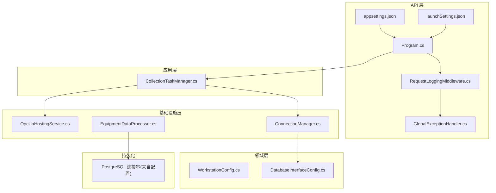
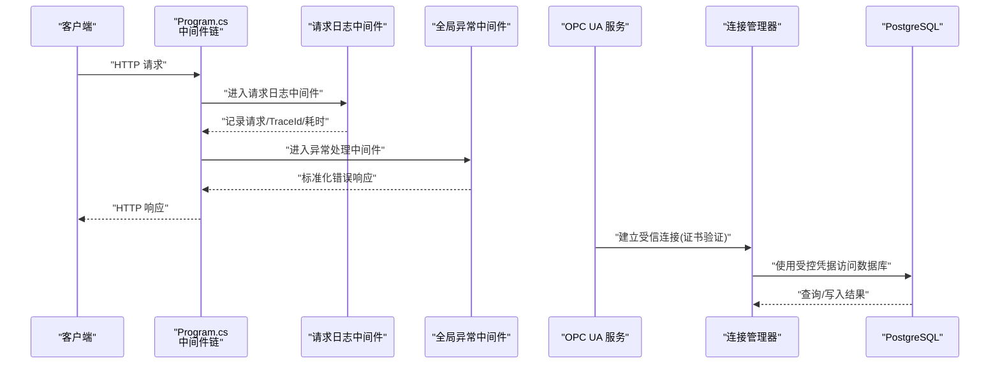
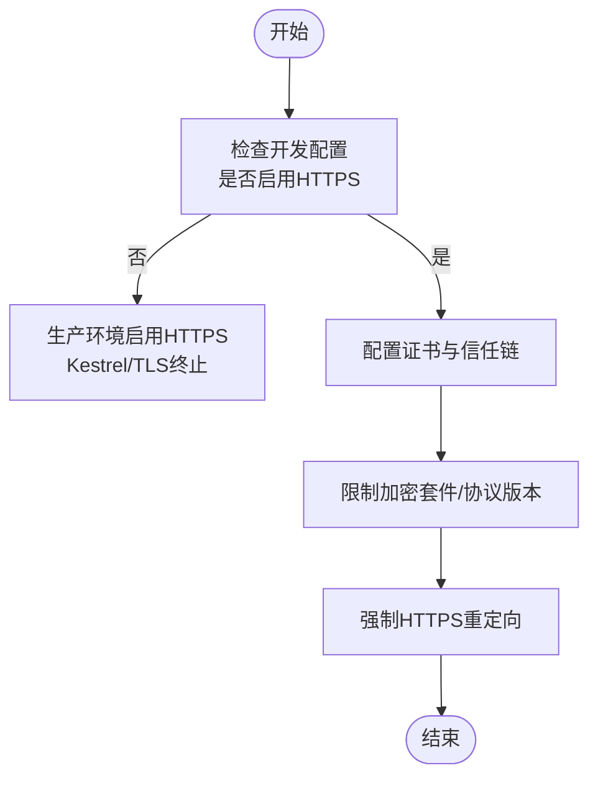
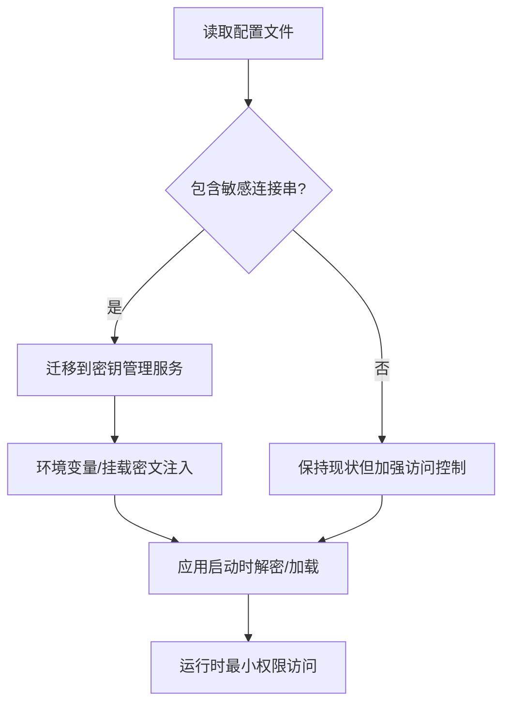
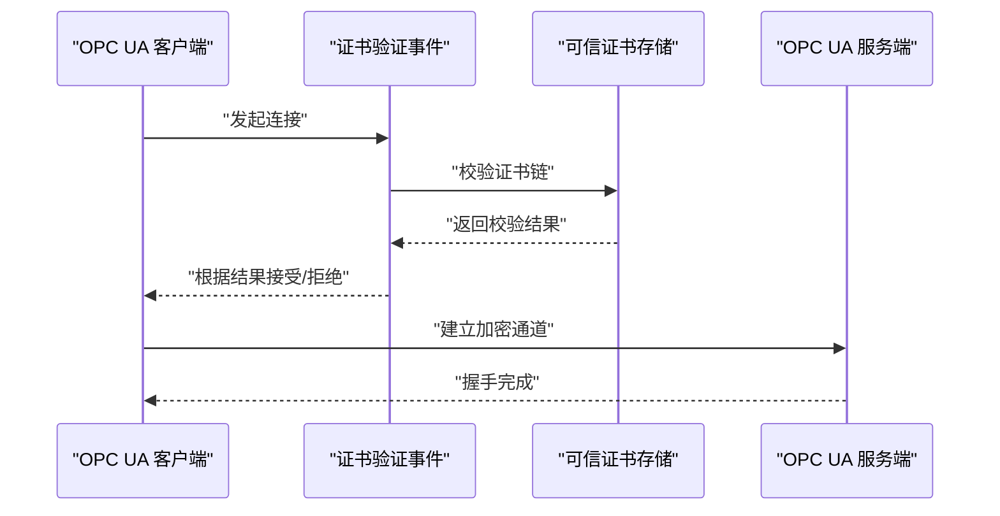
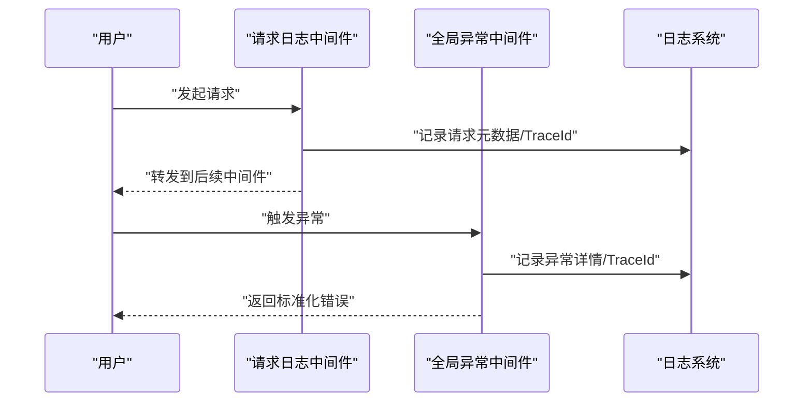
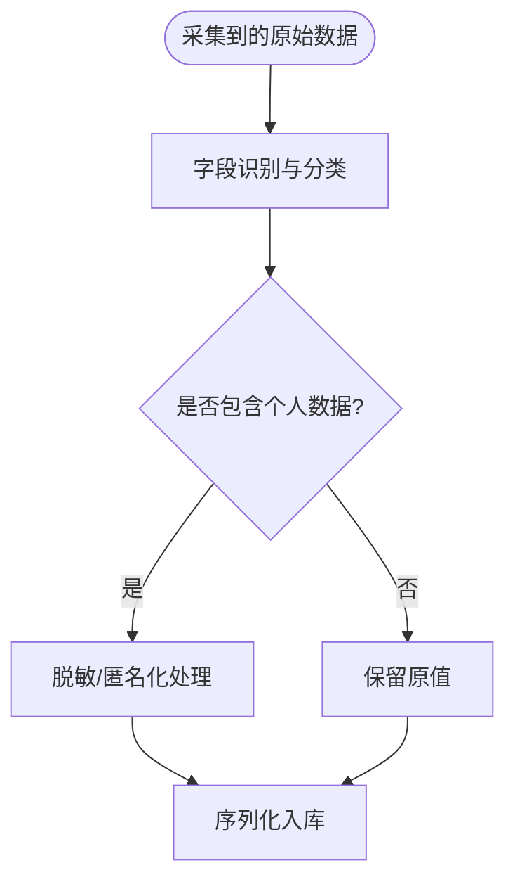
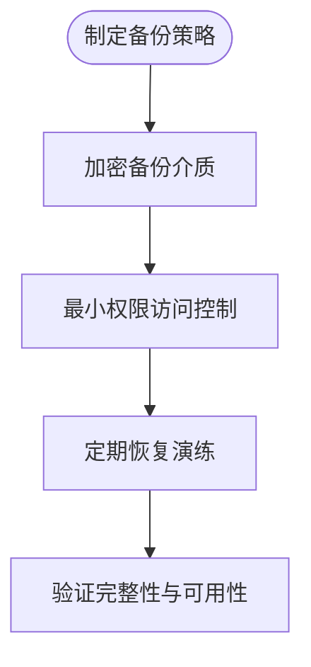
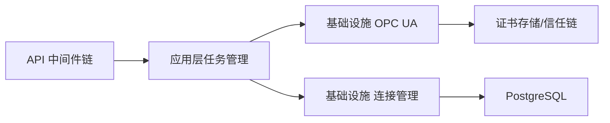

# 数据安全

<cite>
**本文引用的文件**
- [Program.cs](file://IndustrialDataSolution/IndustrialDataProcessor.Api/Program.cs)
- [appsettings.json](file://IndustrialDataSolution/IndustrialDataProcessor.Api/appsettings.json)
- [appsettings.Development.json](file://IndustrialDataSolution/IndustrialDataProcessor.Api/appsettings.Development.json)
- [launchSettings.json](file://IndustrialDataSolution/IndustrialDataProcessor.Api/Properties/launchSettings.json)
- [RequestLoggingMiddleware.cs](file://IndustrialDataSolution/IndustrialDataProcessor.Api/Middleware/RequestLoggingMiddleware.cs)
- [GlobalExceptionHandler.cs](file://IndustrialDataSolution/IndustrialDataProcessor.Api/Middleware/GlobalExceptionHandler.cs)
- [OpcUaHostingService.cs](file://IndustrialDataSolution/IndustrialDataProcessor.Infrastructure/BackgroundServices/OpcUaHostingService.cs)
- [ConnectionManager.cs](file://IndustrialDataSolution/IndustrialDataProcessor.Infrastructure/Communication/Connection/ConnectionManager.cs)
- [DatabaseInterfaceConfig.cs](file://IndustrialDataSolution/IndustrialDataProcessor.Domain/Workstation/Configs/ProtocolSub/DatabaseInterfaceConfig.cs)
- [EquipmentDataProcessor.cs](file://IndustrialDataSolution/IndustrialDataProcessor.Infrastructure/EquipmentCollectionDataProcessing/EquipmentDataProcessor.cs)
- [WorkstationConfig.cs](file://IndustrialDataSolution/IndustrialDataProcessor.Domain/Workstation/Configs/WorkstationConfig.cs)
- [CollectionTaskManager.cs](file://IndustrialDataSolution/IndustrialDataProcessor.Application/Services/CollectionTaskManager.cs)
- [.gitignore](file://IndustrialDataSolution/.gitignore)
</cite>

## 目录
1. [引言](#引言)
2. [项目结构](#项目结构)
3. [核心组件](#核心组件)
4. [架构总览](#架构总览)
5. [详细组件分析](#详细组件分析)
6. [依赖关系分析](#依赖关系分析)
7. [性能考量](#性能考量)
8. [故障排查指南](#故障排查指南)
9. [结论](#结论)
10. [附录](#附录)

## 引言
本文件面向DDD工业数据处理解决方案，聚焦数据安全的全栈实践，涵盖传输层安全（TLS/SSL）、静态数据保护、传输中数据保护、访问审计、数据脱敏与隐私、备份与灾难恢复等主题。文档基于仓库现有实现进行分析与建议，帮助读者在不改变既有架构的前提下，系统性提升数据安全性。

## 项目结构
项目采用多层架构（API、应用、领域、基础设施、共享），围绕“工作站配置—协议采集—数据处理—持久化”的主链路组织。API层负责HTTP入口与中间件；应用层编排采集任务；基础设施层承载通信驱动与OPC UA服务；领域层定义模型与规则；共享层提供通用异常与工具。

图表来源
- [Program.cs](file://IndustrialDataSolution/IndustrialDataProcessor.Api/Program.cs#L1-L54)
- [RequestLoggingMiddleware.cs](file://IndustrialDataSolution/IndustrialDataProcessor.Api/Middleware/RequestLoggingMiddleware.cs#L1-L141)
- [GlobalExceptionHandler.cs](file://IndustrialDataSolution/IndustrialDataProcessor.Api/Middleware/GlobalExceptionHandler.cs#L1-L94)
- [appsettings.json](file://IndustrialDataSolution/IndustrialDataProcessor.Api/appsettings.json#L1-L17)
- [launchSettings.json](file://IndustrialDataSolution/IndustrialDataProcessor.Api/Properties/launchSettings.json#L1-L32)
- [CollectionTaskManager.cs](file://IndustrialDataSolution/IndustrialDataProcessor.Application/Services/CollectionTaskManager.cs#L32-L60)
- [OpcUaHostingService.cs](file://IndustrialDataSolution/IndustrialDataProcessor.Infrastructure/BackgroundServices/OpcUaHostingService.cs#L186-L206)
- [ConnectionManager.cs](file://IndustrialDataSolution/IndustrialDataProcessor.Infrastructure/Communication/Connection/ConnectionManager.cs#L262-L308)
- [EquipmentDataProcessor.cs](file://IndustrialDataSolution/IndustrialDataProcessor.Infrastructure/EquipmentCollectionDataProcessing/EquipmentDataProcessor.cs#L1-L157)
- [WorkstationConfig.cs](file://IndustrialDataSolution/IndustrialDataProcessor.Domain/Workstation/Configs/WorkstationConfig.cs#L1-L27)
- [DatabaseInterfaceConfig.cs](file://IndustrialDataSolution/IndustrialDataProcessor.Domain/Workstation/Configs/ProtocolSub/DatabaseInterfaceConfig.cs#L1-L44)

章节来源
- [Program.cs](file://IndustrialDataSolution/IndustrialDataProcessor.Api/Program.cs#L1-L54)
- [appsettings.json](file://IndustrialDataSolution/IndustrialDataProcessor.Api/appsettings.json#L1-L17)
- [appsettings.Development.json](file://IndustrialDataSolution/IndustrialDataProcessor.Api/appsettings.Development.json#L1-L9)
- [launchSettings.json](file://IndustrialDataSolution/IndustrialDataProcessor.Api/Properties/launchSettings.json#L1-L32)

## 核心组件
- 传输层与运行时安全
  - API中间件链：请求日志中间件优先于异常处理中间件，统一记录请求路径、TraceId、耗时与状态码；异常按类型映射为RFC 7807问题详情。
  - HTTPS与证书：OPC UA服务端配置了证书存储路径与信任链；客户端连接管理器配置了证书验证策略与信任存储。
  - 开发环境：launchSettings.json显示默认使用HTTP，未启用HTTPS。
- 静态数据保护
  - 数据库连接串明文存储于appsettings.json；建议迁移至密钥管理服务或环境变量。
  - .gitignore包含强签名文件等敏感项，有助于避免误提交。
- 传输中数据保护
  - OPC UA服务端/客户端均通过证书存储与信任链进行相互认证；可结合最小权限与网络隔离降低风险。
  - API层未显式启用HTTPS，需在生产部署中增加TLS终止与证书管理。
- 审计与可观测性
  - 请求日志中间件记录请求/响应元数据与TraceId；异常中间件输出标准化错误响应。
- 数据处理与隐私
  - 设备数据在采集后进行表达式转换与序列化，建议在入库前对个人数据进行脱敏或匿名化处理。
- 备份与恢复
  - 项目未包含备份脚本或策略；建议在部署层引入定期备份与恢复演练。

章节来源
- [RequestLoggingMiddleware.cs](file://IndustrialDataSolution/IndustrialDataProcessor.Api/Middleware/RequestLoggingMiddleware.cs#L1-L141)
- [GlobalExceptionHandler.cs](file://IndustrialDataSolution/IndustrialDataProcessor.Api/Middleware/GlobalExceptionHandler.cs#L1-L94)
- [OpcUaHostingService.cs](file://IndustrialDataSolution/IndustrialDataProcessor.Infrastructure/BackgroundServices/OpcUaHostingService.cs#L186-L206)
- [ConnectionManager.cs](file://IndustrialDataSolution/IndustrialDataProcessor.Infrastructure/Communication/Connection/ConnectionManager.cs#L262-L308)
- [appsettings.json](file://IndustrialDataSolution/IndustrialDataProcessor.Api/appsettings.json#L10-L12)
- [.gitignore](file://IndustrialDataSolution/.gitignore#L240-L250)
- [EquipmentDataProcessor.cs](file://IndustrialDataSolution/IndustrialDataProcessor.Infrastructure/EquipmentCollectionDataProcessing/EquipmentDataProcessor.cs#L109-L111)

## 架构总览
下图展示API层中间件链、异常处理、OPC UA证书配置与数据库连接串的关系，体现数据从入口到持久化的安全路径。

图表来源
- [Program.cs](file://IndustrialDataSolution/IndustrialDataProcessor.Api/Program.cs#L36-L51)
- [RequestLoggingMiddleware.cs](file://IndustrialDataSolution/IndustrialDataProcessor.Api/Middleware/RequestLoggingMiddleware.cs#L16-L84)
- [GlobalExceptionHandler.cs](file://IndustrialDataSolution/IndustrialDataProcessor.Api/Middleware/GlobalExceptionHandler.cs#L12-L47)
- [OpcUaHostingService.cs](file://IndustrialDataSolution/IndustrialDataProcessor.Infrastructure/BackgroundServices/OpcUaHostingService.cs#L186-L206)
- [ConnectionManager.cs](file://IndustrialDataSolution/IndustrialDataProcessor.Infrastructure/Communication/Connection/ConnectionManager.cs#L262-L308)
- [appsettings.json](file://IndustrialDataSolution/IndustrialDataProcessor.Api/appsettings.json#L10-L12)

## 详细组件分析

### 传输层安全（TLS/SSL）与HTTPS
- 现状
  - API层未显式启用HTTPS；开发配置仅使用HTTP。
  - OPC UA服务端/客户端具备证书存储与信任链配置，支持TLS握手与相互认证。
- 建议
  - 生产环境启用HTTPS：在反向代理或Kestrel上配置TLS终止与证书管理；限制加密套件与协议版本。
  - 对外暴露的API应强制HTTPS重定向与安全头设置。
  - OPC UA场景建议使用自签证书的受信链管理，避免自动接受不受信证书。

图表来源
- [launchSettings.json](file://IndustrialDataSolution/IndustrialDataProcessor.Api/Properties/launchSettings.json#L11-L30)
- [OpcUaHostingService.cs](file://IndustrialDataSolution/IndustrialDataProcessor.Infrastructure/BackgroundServices/OpcUaHostingService.cs#L193-L200)
- [ConnectionManager.cs](file://IndustrialDataSolution/IndustrialDataProcessor.Infrastructure/Communication/Connection/ConnectionManager.cs#L267-L285)

章节来源
- [launchSettings.json](file://IndustrialDataSolution/IndustrialDataProcessor.Api/Properties/launchSettings.json#L11-L30)
- [OpcUaHostingService.cs](file://IndustrialDataSolution/IndustrialDataProcessor.Infrastructure/BackgroundServices/OpcUaHostingService.cs#L186-L206)
- [ConnectionManager.cs](file://IndustrialDataSolution/IndustrialDataProcessor.Infrastructure/Communication/Connection/ConnectionManager.cs#L262-L308)

### 静态数据保护（连接串、配置与文件系统）
- 现状
  - 数据库连接串以明文形式存储在配置文件中。
  - .gitignore包含强签名文件等敏感项，减少误提交风险。
- 建议
  - 将连接串迁移到密钥管理服务（如Azure Key Vault、HashiCorp Vault）或容器/平台提供的机密管理。
  - 使用环境变量或挂载密文文件的方式注入敏感配置。
  - 对配置文件与证书目录设置最小权限访问控制（ACL/SELinux）。

图表来源
- [appsettings.json](file://IndustrialDataSolution/IndustrialDataProcessor.Api/appsettings.json#L10-L12)
- [.gitignore](file://IndustrialDataSolution/.gitignore#L240-L250)

章节来源
- [appsettings.json](file://IndustrialDataSolution/IndustrialDataProcessor.Api/appsettings.json#L10-L12)
- [.gitignore](file://IndustrialDataSolution/.gitignore#L240-L250)

### 传输中数据保护（网络通信、API调用与第三方集成）
- 现状
  - OPC UA服务端/客户端具备证书存储与信任链配置，支持相互认证。
  - API层未显式启用HTTPS，存在明文传输风险。
- 建议
  - 对外API启用TLS；内部服务间通信同样建议mTLS或服务网格侧边车。
  - 第三方集成（如数据库驱动）应使用受信证书与最小权限账户。
  - 对高价值数据（如连接串、令牌）在传输中进行额外加密包装。

图表来源
- [ConnectionManager.cs](file://IndustrialDataSolution/IndustrialDataProcessor.Infrastructure/Communication/Connection/ConnectionManager.cs#L295-L299)
- [OpcUaHostingService.cs](file://IndustrialDataSolution/IndustrialDataProcessor.Infrastructure/BackgroundServices/OpcUaHostingService.cs#L193-L200)

章节来源
- [ConnectionManager.cs](file://IndustrialDataSolution/IndustrialDataProcessor.Infrastructure/Communication/Connection/ConnectionManager.cs#L262-L308)
- [OpcUaHostingService.cs](file://IndustrialDataSolution/IndustrialDataProcessor.Infrastructure/BackgroundServices/OpcUaHostingService.cs#L186-L206)

### 数据访问审计（日志、追踪与异常）
- 现状
  - 请求日志中间件记录请求/响应元数据、TraceId与耗时；异常中间件输出标准化错误响应。
- 建议
  - 结合分布式追踪（如OpenTelemetry）与结构化日志（含TraceId/SpanId）实现端到端追踪。
  - 对敏感操作（如配置更新、删除）增加审计日志与变更记录。
  - 异常日志避免泄露堆栈细节，仅保留必要上下文。

图表来源
- [RequestLoggingMiddleware.cs](file://IndustrialDataSolution/IndustrialDataProcessor.Api/Middleware/RequestLoggingMiddleware.cs#L16-L84)
- [GlobalExceptionHandler.cs](file://IndustrialDataSolution/IndustrialDataProcessor.Api/Middleware/GlobalExceptionHandler.cs#L12-L47)

章节来源
- [RequestLoggingMiddleware.cs](file://IndustrialDataSolution/IndustrialDataProcessor.Api/Middleware/RequestLoggingMiddleware.cs#L1-L141)
- [GlobalExceptionHandler.cs](file://IndustrialDataSolution/IndustrialDataProcessor.Api/Middleware/GlobalExceptionHandler.cs#L1-L94)

### 数据脱敏与隐私保护（个人数据与工业数据）
- 现状
  - 设备数据在采集后进行表达式转换与序列化，未见显式的脱敏/匿名化逻辑。
- 建议
  - 对个人身份标识（如人员、工号）与高敏感指标（如位置、健康数据）在入库前进行脱敏或哈希。
  - 工业数据中若包含可识别自然人的信息，应遵循最小可用原则与去标识化策略。
  - 在API层对敏感字段进行屏蔽或只读输出。

图表来源
- [EquipmentDataProcessor.cs](file://IndustrialDataSolution/IndustrialDataProcessor.Infrastructure/EquipmentCollectionDataProcessing/EquipmentDataProcessor.cs#L109-L111)

章节来源
- [EquipmentDataProcessor.cs](file://IndustrialDataSolution/IndustrialDataProcessor.Infrastructure/EquipmentCollectionDataProcessing/EquipmentDataProcessor.cs#L1-L157)

### 数据备份与灾难恢复（安全策略与演练）
- 现状
  - 项目未包含备份脚本或策略。
- 建议
  - 制定备份策略：全量/增量备份、在线/离线备份、异地容灾。
  - 对备份介质与密钥进行加密与权限控制；定期进行恢复演练。
  - 将数据库连接串与证书目录纳入备份范围，确保可完整恢复。

图表来源
- [appsettings.json](file://IndustrialDataSolution/IndustrialDataProcessor.Api/appsettings.json#L10-L12)
- [OpcUaHostingService.cs](file://IndustrialDataSolution/IndustrialDataProcessor.Infrastructure/BackgroundServices/OpcUaHostingService.cs#L193-L200)

章节来源
- [appsettings.json](file://IndustrialDataSolution/IndustrialDataProcessor.Api/appsettings.json#L10-L12)
- [OpcUaHostingService.cs](file://IndustrialDataSolution/IndustrialDataProcessor.Infrastructure/BackgroundServices/OpcUaHostingService.cs#L186-L206)

## 依赖关系分析
- 组件耦合
  - API层中间件链与异常处理形成清晰的横切关注点，便于扩展与维护。
  - 应用层通过任务管理器调度后台采集任务，与基础设施层的OPC UA与连接管理器耦合。
  - 领域层的协议配置与数据库接口模型为基础设施层驱动选择提供依据。
- 外部依赖
  - PostgreSQL连接串作为外部依赖，应通过密钥管理与最小权限账户降低风险。
  - OPC UA证书存储与信任链依赖操作系统或容器文件系统权限。

图表来源
- [Program.cs](file://IndustrialDataSolution/IndustrialDataProcessor.Api/Program.cs#L36-L51)
- [CollectionTaskManager.cs](file://IndustrialDataSolution/IndustrialDataProcessor.Application/Services/CollectionTaskManager.cs#L32-L60)
- [OpcUaHostingService.cs](file://IndustrialDataSolution/IndustrialDataProcessor.Infrastructure/BackgroundServices/OpcUaHostingService.cs#L186-L206)
- [ConnectionManager.cs](file://IndustrialDataSolution/IndustrialDataProcessor.Infrastructure/Communication/Connection/ConnectionManager.cs#L262-L308)
- [appsettings.json](file://IndustrialDataSolution/IndustrialDataProcessor.Api/appsettings.json#L10-L12)

章节来源
- [Program.cs](file://IndustrialDataSolution/IndustrialDataProcessor.Api/Program.cs#L1-L54)
- [CollectionTaskManager.cs](file://IndustrialDataSolution/IndustrialDataProcessor.Application/Services/CollectionTaskManager.cs#L32-L60)
- [ConnectionManager.cs](file://IndustrialDataSolution/IndustrialDataProcessor.Infrastructure/Communication/Connection/ConnectionManager.cs#L262-L308)
- [OpcUaHostingService.cs](file://IndustrialDataSolution/IndustrialDataProcessor.Infrastructure/BackgroundServices/OpcUaHostingService.cs#L186-L206)
- [appsettings.json](file://IndustrialDataSolution/IndustrialDataProcessor.Api/appsettings.json#L10-L12)

## 性能考量
- 日志开销
  - 请求日志中间件在Debug级别记录请求/响应体可能带来IO与CPU开销，建议在生产关闭或限制采样。
- 异常处理
  - 异常中间件统一输出标准化错误，避免重复日志与冗余信息，有利于运维与审计。
- 证书验证
  - OPC UA证书验证事件与信任链检查会增加握手时间，建议优化证书链长度与缓存策略。

## 故障排查指南
- 证书相关
  - 若出现证书不受信或握手失败，检查证书存储路径与信任链配置，确认受信证书与颁发者链完整。
- 数据库连接
  - 若出现连接失败，核对连接串中的主机、端口、数据库名与凭据；确认防火墙与网络策略。
- 日志与追踪
  - 使用TraceId关联请求日志与异常日志，定位具体请求与耗时瓶颈。

章节来源
- [ConnectionManager.cs](file://IndustrialDataSolution/IndustrialDataProcessor.Infrastructure/Communication/Connection/ConnectionManager.cs#L262-L308)
- [OpcUaHostingService.cs](file://IndustrialDataSolution/IndustrialDataProcessor.Infrastructure/BackgroundServices/OpcUaHostingService.cs#L186-L206)
- [RequestLoggingMiddleware.cs](file://IndustrialDataSolution/IndustrialDataProcessor.Api/Middleware/RequestLoggingMiddleware.cs#L16-L84)
- [GlobalExceptionHandler.cs](file://IndustrialDataSolution/IndustrialDataProcessor.Api/Middleware/GlobalExceptionHandler.cs#L12-L47)

## 结论
本方案在传输层具备OPC UA证书体系，在API层具备请求与异常处理的可观测性基础。建议在生产环境中补齐HTTPS、密钥管理、最小权限与脱敏策略，并完善备份与演练流程，以满足工业数据处理场景下的数据安全要求。

## 附录
- 关键配置与文件
  - 连接串与授权码：参见配置文件路径与行号。
  - OPC UA证书存储：参见服务端与客户端配置路径。
  - 开发环境HTTP：参见启动配置文件。

章节来源
- [appsettings.json](file://IndustrialDataSolution/IndustrialDataProcessor.Api/appsettings.json#L10-L15)
- [OpcUaHostingService.cs](file://IndustrialDataSolution/IndustrialDataProcessor.Infrastructure/BackgroundServices/OpcUaHostingService.cs#L193-L200)
- [ConnectionManager.cs](file://IndustrialDataSolution/IndustrialDataProcessor.Infrastructure/Communication/Connection/ConnectionManager.cs#L267-L285)
- [launchSettings.json](file://IndustrialDataSolution/IndustrialDataProcessor.Api/Properties/launchSettings.json#L11-L30)