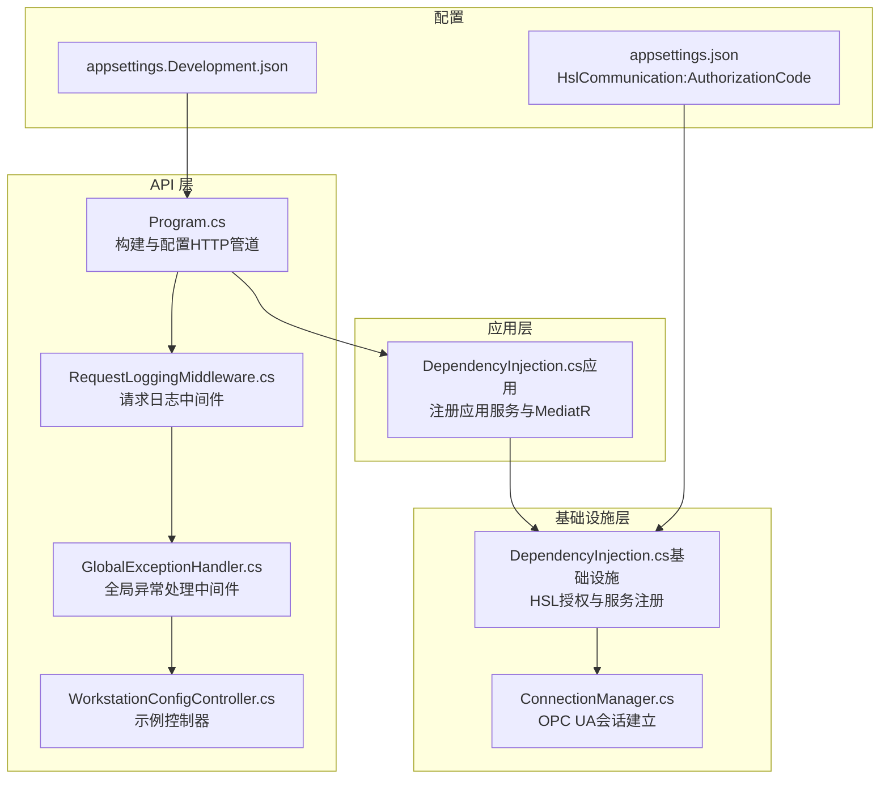
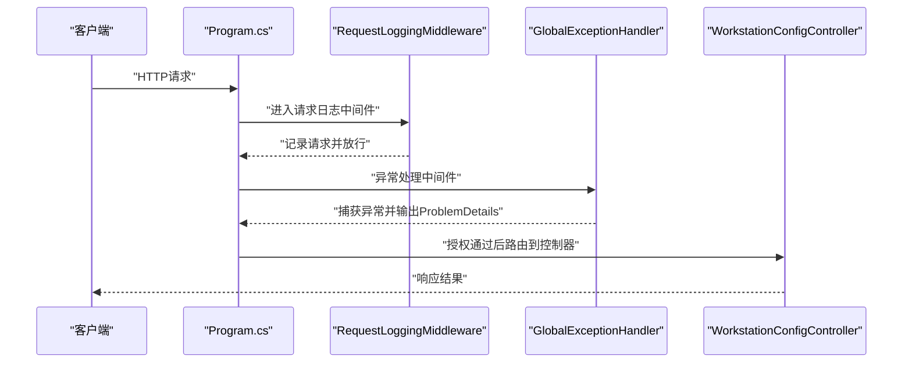
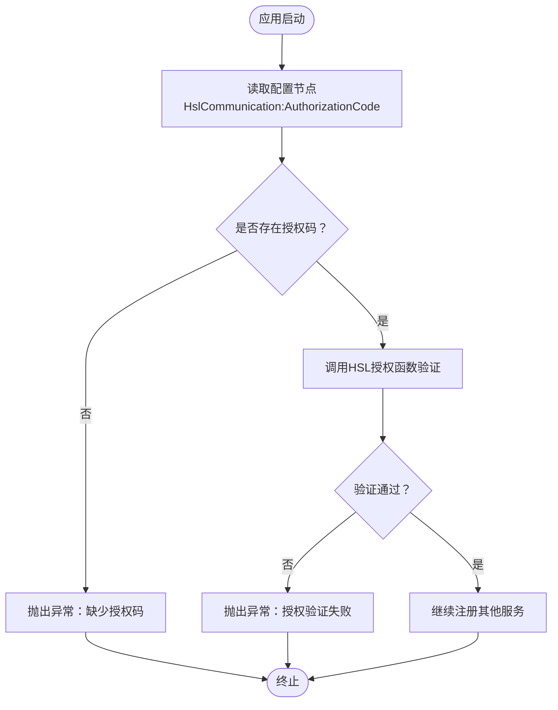
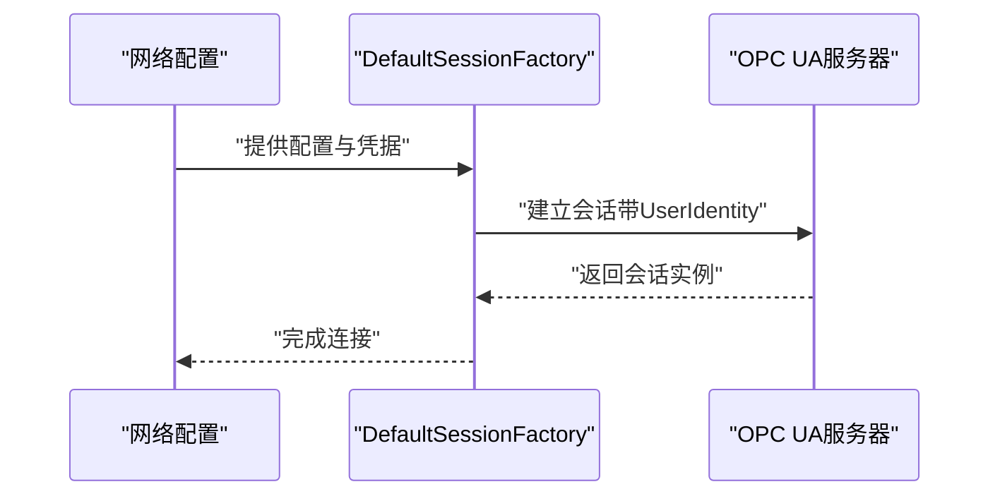
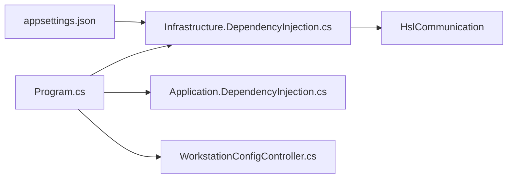

# 认证机制

<cite>
**本文引用的文件**
- [Program.cs](file://IndustrialDataSolution/IndustrialDataProcessor.Api/Program.cs)
- [appsettings.json](file://IndustrialDataSolution/IndustrialDataProcessor.Api/appsettings.json)
- [appsettings.Development.json](file://IndustrialDataSolution/IndustrialDataProcessor.Api/appsettings.Development.json)
- [DependencyInjection.cs（基础设施）](file://IndustrialDataSolution/IndustrialDataProcessor.Infrastructure/DependencyInjection.cs)
- [GlobalExceptionHandler.cs](file://IndustrialDataSolution/IndustrialDataProcessor.Api/Middleware/GlobalExceptionHandler.cs)
- [RequestLoggingMiddleware.cs](file://IndustrialDataSolution/IndustrialDataProcessor.Api/Middleware/RequestLoggingMiddleware.cs)
- [WorkstationConfigController.cs](file://IndustrialDataSolution/IndustrialDataProcessor.Api/Controllers/WorkstationConfigController.cs)
- [DependencyInjection.cs（应用）](file://IndustrialDataSolution/IndustrialDataProcessor.Application/DependencyInjection.cs)
- [ConnectionManager.cs](file://IndustrialDataSolution/IndustrialDataProcessor.Infrastructure/Communication/Connection/ConnectionManager.cs)
- [IndustrialDataProcessor.Share.csproj](file://IndustrialDataSolution/IndustrialDataProcessor.Share/IndustrialDataProcessor.Share.csproj)
- [IndustrialDataProcessor.Simulator.csproj](file://IndustrialDataSolution/IndustrialDataProcessor.Simulator/IndustrialDataProcessor.Simulator.csproj)
</cite>

## 目录
1. [简介](#简介)
2. [项目结构](#项目结构)
3. [核心组件](#核心组件)
4. [架构总览](#架构总览)
5. [详细组件分析](#详细组件分析)
6. [依赖关系分析](#依赖关系分析)
7. [性能考虑](#性能考虑)
8. [故障排查指南](#故障排查指南)
9. [结论](#结论)

## 简介
本文件面向DDD工业数据处理解决方案中的认证与授权主题，聚焦以下方面：
- HSL通信库授权码的配置与验证机制（AuthorizationCode的生成、存储与验证流程）
- API接口的认证策略现状与扩展建议（基本认证、摘要认证、Bearer Token认证）
- JWT令牌的生成与验证机制（令牌结构、签名算法、过期时间管理）
- 会话管理与状态保持（Cookie配置、Session存储、并发控制）
- 认证中间件的配置与使用（认证管道构建、自定义认证处理器）
- 认证失败处理策略与安全审计日志记录

说明：当前仓库未实现基于ASP.NET Core的身份认证与授权（如Cookie、Session、JWT等）。本文在不虚构现有实现的前提下，对现状进行准确描述，并提供可落地的安全增强建议与最佳实践。

## 项目结构
本项目采用多层架构（API层、应用层、基础设施层、领域层），认证相关的关键位置如下：
- API层：请求管道、中间件、控制器
- 应用层：依赖注入注册、全局行为（如验证）
- 基础设施层：第三方库初始化（HSL通信授权）、OPC UA会话建立
- 安全相关配置：appsettings.json中的HSL授权码

**图表来源**
- [Program.cs](file://IndustrialDataSolution/IndustrialDataProcessor.Api/Program.cs#L36-L51)
- [RequestLoggingMiddleware.cs](file://IndustrialDataSolution/IndustrialDataProcessor.Api/Middleware/RequestLoggingMiddleware.cs#L16-L84)
- [GlobalExceptionHandler.cs](file://IndustrialDataSolution/IndustrialDataProcessor.Api/Middleware/GlobalExceptionHandler.cs#L12-L47)
- [WorkstationConfigController.cs](file://IndustrialDataSolution/IndustrialDataProcessor.Api/Controllers/WorkstationConfigController.cs#L14-L21)
- [DependencyInjection.cs（应用）](file://IndustrialDataSolution/IndustrialDataProcessor.Application/DependencyInjection.cs#L16-L39)
- [DependencyInjection.cs（基础设施）](file://IndustrialDataSolution/IndustrialDataProcessor.Infrastructure/DependencyInjection.cs#L17-L46)
- [ConnectionManager.cs](file://IndustrialDataSolution/IndustrialDataProcessor.Infrastructure/Communication/Connection/ConnectionManager.cs#L306-L328)
- [appsettings.json](file://IndustrialDataSolution/IndustrialDataProcessor.Api/appsettings.json#L13-L15)
- [appsettings.Development.json](file://IndustrialDataSolution/IndustrialDataProcessor.Api/appsettings.Development.json#L1-L9)

**章节来源**
- [Program.cs](file://IndustrialDataSolution/IndustrialDataProcessor.Api/Program.cs#L36-L51)
- [appsettings.json](file://IndustrialDataSolution/IndustrialDataProcessor.Api/appsettings.json#L13-L15)

## 核心组件
- HSL通信授权码配置与验证
  - 在基础设施层依赖注入中读取配置节点并调用HSL授权函数进行验证，若未配置或验证失败则直接抛出异常终止启动。
- API请求管道与中间件
  - 请求日志中间件优先于异常处理中间件执行，随后启用授权与控制器映射。
- 全局异常处理
  - 对不同类型的异常进行分类处理并输出标准化ProblemDetails响应。
- 控制器示例
  - 提供受授权保护的API端点，用于保存工作站配置。

**章节来源**
- [DependencyInjection.cs（基础设施）](file://IndustrialDataSolution/IndustrialDataProcessor.Infrastructure/DependencyInjection.cs#L19-L28)
- [Program.cs](file://IndustrialDataSolution/IndustrialDataProcessor.Api/Program.cs#L38-L49)
- [GlobalExceptionHandler.cs](file://IndustrialDataSolution/IndustrialDataProcessor.Api/Middleware/GlobalExceptionHandler.cs#L12-L47)
- [WorkstationConfigController.cs](file://IndustrialDataSolution/IndustrialDataProcessor.Api/Controllers/WorkstationConfigController.cs#L14-L21)

## 架构总览
下图展示了认证与授权在请求管道中的位置以及与各层的关系：

**图表来源**
- [Program.cs](file://IndustrialDataSolution/IndustrialDataProcessor.Api/Program.cs#L38-L49)
- [RequestLoggingMiddleware.cs](file://IndustrialDataSolution/IndustrialDataProcessor.Api/Middleware/RequestLoggingMiddleware.cs#L16-L84)
- [GlobalExceptionHandler.cs](file://IndustrialDataSolution/IndustrialDataProcessor.Api/Middleware/GlobalExceptionHandler.cs#L12-L47)
- [WorkstationConfigController.cs](file://IndustrialDataSolution/IndustrialDataProcessor.Api/Controllers/WorkstationConfigController.cs#L14-L21)

## 详细组件分析

### HSL通信库授权码机制
- 配置来源
  - 在配置文件中设置HSL授权码节点，用于后续授权验证。
- 启动阶段验证
  - 在基础设施层依赖注入中读取配置并调用HSL授权函数；若未配置或验证失败，立即抛出异常终止应用启动。
- 影响范围
  - 该机制确保在启动阶段即完成第三方库的授权校验，避免运行时因授权问题导致的通信失败。

**图表来源**
- [DependencyInjection.cs（基础设施）](file://IndustrialDataSolution/IndustrialDataProcessor.Infrastructure/DependencyInjection.cs#L19-L28)
- [appsettings.json](file://IndustrialDataSolution/IndustrialDataProcessor.Api/appsettings.json#L13-L15)

**章节来源**
- [DependencyInjection.cs（基础设施）](file://IndustrialDataSolution/IndustrialDataProcessor.Infrastructure/DependencyInjection.cs#L19-L28)
- [appsettings.json](file://IndustrialDataSolution/IndustrialDataProcessor.Api/appsettings.json#L13-L15)

### API接口认证策略现状与扩展建议
- 现状
  - 当前请求管道中仅启用了授权中间件，但未配置具体的身份认证方案（如Cookie、Session、Bearer Token等）。因此，所有受保护的端点默认均需通过授权中间件，但无实际凭据校验。
- 扩展建议
  - 基本认证/摘要认证：可在授权中间件之前插入对应的身份认证中间件，解析Authorization头并构造ClaimsPrincipal。
  - Bearer Token（JWT）：引入JWT认证中间件，验证签名与有效期，签发含角色/权限的令牌。
  - Cookie + Session：启用Session中间件，结合Cookie选项（HttpOnly、SameSite、Secure）进行状态保持与并发控制。
- 注意事项
  - 认证中间件顺序至关重要：身份认证应在授权之前执行。
  - 对敏感端点增加授权策略（如基于角色/策略的授权）。

[本节为概念性说明，不直接分析具体文件，故不附“章节来源”]

### JWT令牌生成与验证机制
- 令牌结构
  - 建议使用标准JWT结构（Header.Payload.Signature），Payload中包含sub、roles、exp等声明。
- 签名算法
  - 建议使用强密钥与安全算法（如RS256或HS256），密钥应妥善保管并定期轮换。
- 过期时间管理
  - 设置合理的过期时间（如15-60分钟），支持刷新令牌（Refresh Token）延长会话。
- 存储与传输
  - 访问令牌通过HttpOnly Cookie或Bearer头传输；刷新令牌仅通过安全通道传输并短期存储。

[本节为概念性说明，不直接分析具体文件，故不附“章节来源”]

### 会话管理与状态保持
- Cookie配置
  - 建议启用HttpOnly、Secure、SameSite=Lax或Strict；根据部署环境调整SameSite策略。
- Session存储
  - 生产环境建议使用分布式缓存（Redis）存储Session，避免进程内状态丢失。
- 并发控制
  - 通过令牌撤销列表（RTLT）或黑名单机制实现并发登录限制与强制登出。

[本节为概念性说明，不直接分析具体文件，故不附“章节来源”]

### 认证中间件配置与使用
- 认证管道构建
  - 在Program.cs中按序插入中间件：日志 -> 异常处理 -> 身份认证 -> 授权 -> 控制器。
- 自定义认证处理器
  - 实现IAuthenticationHandler接口，解析凭据、验证有效性并生成ClaimsPrincipal。
- 与OPC UA会话集成
  - 若系统需要访问OPC UA设备，可在认证通过后根据用户上下文建立带凭据的会话（参考基础设施层会话建立逻辑）。

[本节为概念性说明，不直接分析具体文件，故不附“章节来源”]

### OPC UA会话建立与用户身份
- 会话建立流程
  - 从配置中读取账户与密码，构造UserIdentity，创建会话工厂并建立连接。
- 安全建议
  - 密码以字节数组形式传递，避免明文泄露；证书信任链配置需完善。

**图表来源**
- [ConnectionManager.cs](file://IndustrialDataSolution/IndustrialDataProcessor.Infrastructure/Communication/Connection/ConnectionManager.cs#L306-L328)

**章节来源**
- [ConnectionManager.cs](file://IndustrialDataSolution/IndustrialDataProcessor.Infrastructure/Communication/Connection/ConnectionManager.cs#L306-L328)

## 依赖关系分析
- HSL授权依赖
  - 基础设施层依赖HslCommunication包，启动时必须完成授权验证。
- 项目引用
  - Share与Simulator项目同样引用HslCommunication，需遵循相同的授权配置要求。

**图表来源**
- [DependencyInjection.cs（基础设施）](file://IndustrialDataSolution/IndustrialDataProcessor.Infrastructure/DependencyInjection.cs#L1-L11)
- [Program.cs](file://IndustrialDataSolution/IndustrialDataProcessor.Api/Program.cs#L1-L6)
- [DependencyInjection.cs（应用）](file://IndustrialDataSolution/IndustrialDataProcessor.Application/DependencyInjection.cs#L1-L7)
- [WorkstationConfigController.cs](file://IndustrialDataSolution/IndustrialDataProcessor.Api/Controllers/WorkstationConfigController.cs#L1-L4)
- [appsettings.json](file://IndustrialDataSolution/IndustrialDataProcessor.Api/appsettings.json#L13-L15)

**章节来源**
- [IndustrialDataProcessor.Share.csproj](file://IndustrialDataSolution/IndustrialDataProcessor.Share/IndustrialDataProcessor.Share.csproj#L9-L11)
- [IndustrialDataProcessor.Simulator.csproj](file://IndustrialDataSolution/IndustrialDataProcessor.Simulator/IndustrialDataProcessor.Simulator.csproj#L10-L13)

## 性能考虑
- 中间件顺序与开销
  - 日志中间件开启请求/响应体记录会带来额外IO与内存占用，建议在生产关闭或限制记录条件。
- 异常处理
  - 全局异常处理统一输出ProblemDetails，减少重复逻辑，提升一致性与可维护性。
- HSL授权
  - 授权仅在启动阶段执行一次，不影响运行时性能。

[本节为通用建议，不直接分析具体文件，故不附“章节来源”]

## 故障排查指南
- 启动失败：HSL授权未通过
  - 现象：应用启动即抛出异常，提示未找到有效授权码或授权验证失败。
  - 排查：确认配置文件中HSL授权码节点存在且值正确；检查第三方库版本兼容性。
- 请求被拒绝或未认证
  - 现象：受保护端点返回401/403。
  - 排查：确认已配置身份认证中间件并正确解析凭据；检查授权策略与用户角色。
- 异常响应格式
  - 全局异常处理会输出标准化ProblemDetails，便于前端统一处理。
- 审计日志
  - 请求日志中间件记录请求与响应的基本信息；建议在认证与授权处补充关键事件日志（如登录成功/失败、令牌签发/撤销）。

**章节来源**
- [DependencyInjection.cs（基础设施）](file://IndustrialDataSolution/IndustrialDataProcessor.Infrastructure/DependencyInjection.cs#L23-L28)
- [GlobalExceptionHandler.cs](file://IndustrialDataSolution/IndustrialDataProcessor.Api/Middleware/GlobalExceptionHandler.cs#L12-L47)
- [RequestLoggingMiddleware.cs](file://IndustrialDataSolution/IndustrialDataProcessor.Api/Middleware/RequestLoggingMiddleware.cs#L21-L78)

## 结论
- 当前项目在启动阶段完成了HSL通信库的授权验证，确保第三方库可用性。
- API层已启用授权中间件，但尚未实现具体的身份认证方案（如Cookie、Session、JWT）。
- 建议在现有基础上引入身份认证与授权中间件，完善令牌签发与验证、会话管理与并发控制，并加强安全审计日志记录，以满足工业数据处理场景下的安全需求。