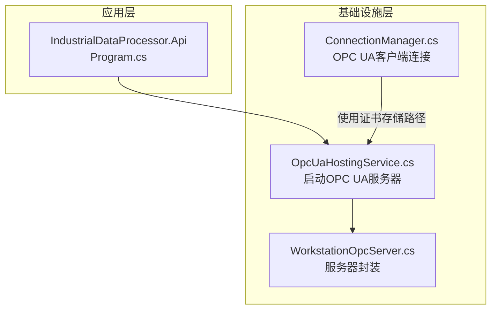
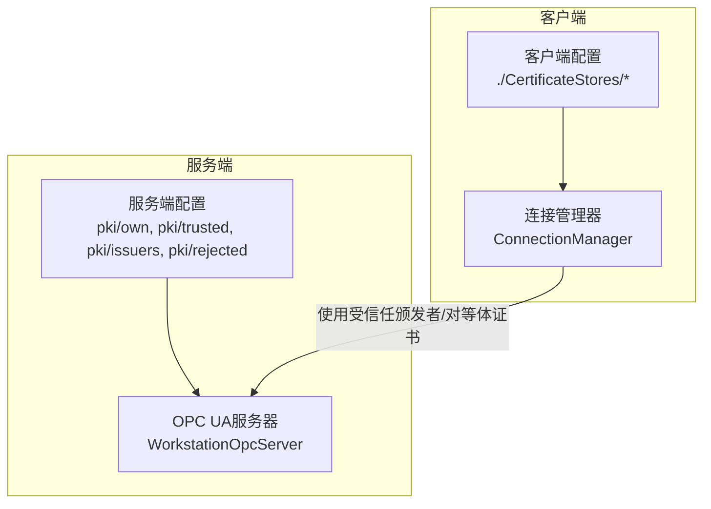
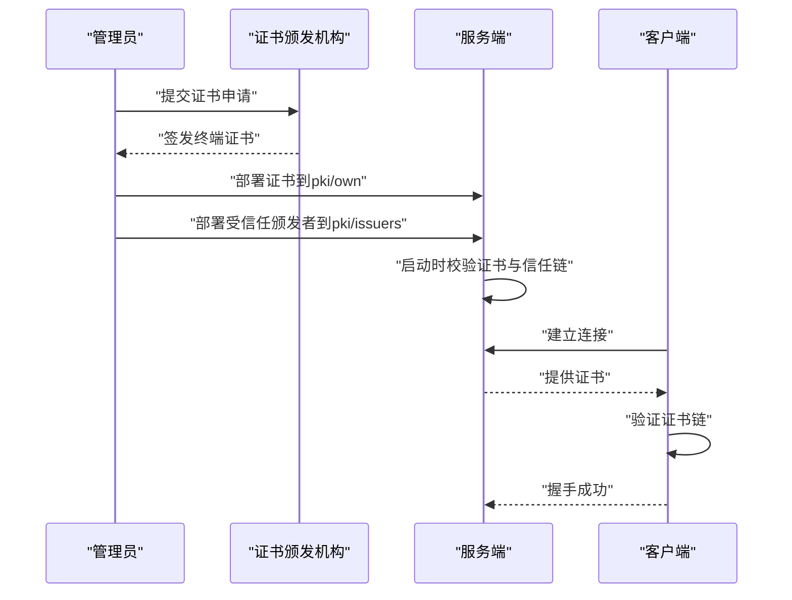
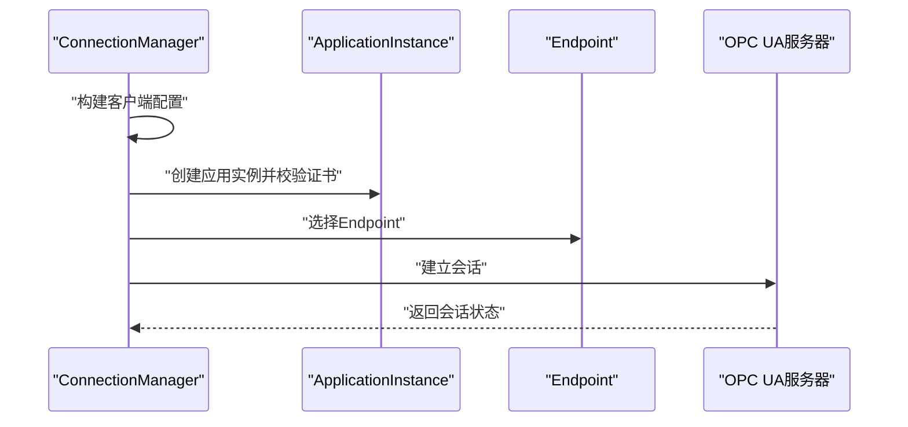
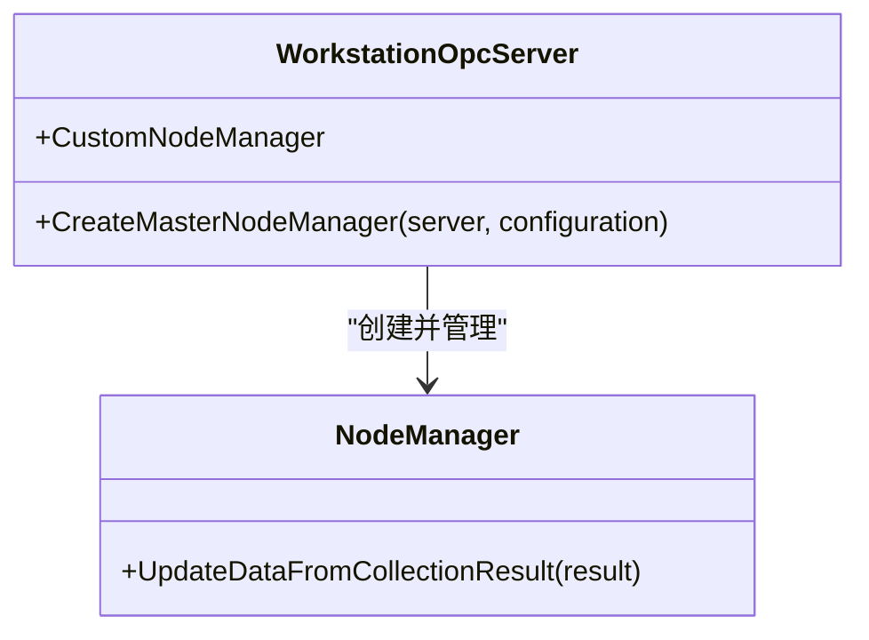
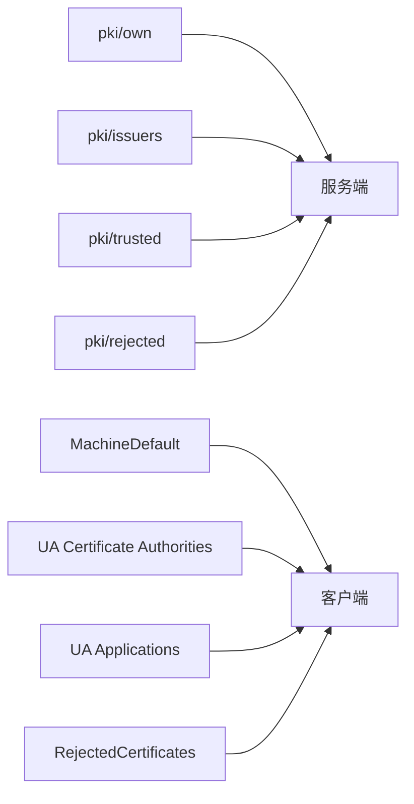

# 证书管理体系

<cite>
**本文引用的文件**
- [Program.cs](file://IndustrialDataSolution/IndustrialDataProcessor.Api/Program.cs)
- [appsettings.json](file://IndustrialDataSolution/IndustrialDataProcessor.Api/appsettings.json)
- [ConnectionManager.cs](file://IndustrialDataSolution/IndustrialDataProcessor.Infrastructure/Communication/Connection/ConnectionManager.cs)
- [OpcUaHostingService.cs](file://IndustrialDataSolution/IndustrialDataProcessor.Infrastructure/BackgroundServices/OpcUaHostingService.cs)
- [WorkstationOpcServer.cs](file://IndustrialDataSolution/IndustrialDataProcessor.Infrastructure/OpcUa/WorkstationOpcServer.cs)
</cite>

## 目录
1. [引言](#引言)
2. [项目结构](#项目结构)
3. [核心组件](#核心组件)
4. [架构总览](#架构总览)
5. [详细组件分析](#详细组件分析)
6. [依赖关系分析](#依赖关系分析)
7. [性能考虑](#性能考虑)
8. [故障排查指南](#故障排查指南)
9. [结论](#结论)
10. [附录](#附录)

## 引言
本文件面向DDD工业数据处理解决方案中的证书管理体系，系统性阐述基于PKI（公钥基础设施）的证书架构与实践。结合代码库中对OPC UA证书存储路径与信任策略的配置，本文将：
- 解释pki目录结构中own、trusted、issuers、rejected等子目录的职责与作用
- 描述证书生命周期管理（申请、签发、验证、更新、吊销）
- 讲解信任链建立（根证书、中间证书、终端证书）与验证策略
- 提供密钥长度、算法与有效期等最佳实践
- 给出证书导入导出、备份恢复与故障转移的操作步骤

## 项目结构
本项目采用分层架构，证书相关配置主要集中在基础设施层的OPC UA服务与客户端连接管理中。核心涉及以下文件：
- 工业数据处理API入口：负责应用启动与中间件注册
- OPC UA服务端后台服务：负责启动OPC UA服务器并配置证书存储路径
- OPC UA客户端连接管理：负责OPC UA客户端侧证书存储与信任策略
- OPC UA服务器封装：负责服务器生命周期与节点管理

**图表来源**
- [Program.cs](file://IndustrialDataSolution/IndustrialDataProcessor.Api/Program.cs#L10-L52)
- [OpcUaHostingService.cs](file://IndustrialDataSolution/IndustrialDataProcessor.Infrastructure/BackgroundServices/OpcUaHostingService.cs#L186-L214)
- [ConnectionManager.cs](file://IndustrialDataSolution/IndustrialDataProcessor.Infrastructure/Communication/Connection/ConnectionManager.cs#L252-L331)
- [WorkstationOpcServer.cs](file://IndustrialDataSolution/IndustrialDataProcessor.Infrastructure/OpcUa/WorkstationOpcServer.cs#L11-L35)

**章节来源**
- [Program.cs](file://IndustrialDataSolution/IndustrialDataProcessor.Api/Program.cs#L10-L52)
- [OpcUaHostingService.cs](file://IndustrialDataSolution/IndustrialDataProcessor.Infrastructure/BackgroundServices/OpcUaHostingService.cs#L186-L214)
- [ConnectionManager.cs](file://IndustrialDataSolution/IndustrialDataProcessor.Infrastructure/Communication/Connection/ConnectionManager.cs#L252-L331)
- [WorkstationOpcServer.cs](file://IndustrialDataSolution/IndustrialDataProcessor.Infrastructure/OpcUa/WorkstationOpcServer.cs#L11-L35)

## 核心组件
- OPC UA服务端证书配置
  - 应用证书存储：pki/own
  - 受信任对等体证书存储：pki/trusted
  - 受信任颁发者证书存储：pki/issuers
  - 拒绝证书存储：pki/rejected
  - 自动接受不受信任证书：启用
  - 添加应用证书到受信任存储：启用
- OPC UA客户端证书配置
  - 应用证书存储：./CertificateStores/MachineDefault
  - 受信任颁发者证书存储：./CertificateStores/UA Certificate Authorities
  - 受信任对等体证书存储：./CertificateStores/UA Applications
  - 拒绝证书存储：./CertificateStores/RejectedCertificates
  - 自动接受不受信任证书：启用
  - 最小证书密钥长度：1024位
- 服务器基础配置
  - 监听地址：opc.tcp://0.0.0.0:4840/WorkstationServer
  - 安全策略：None（明文）
  - 用户令牌策略：Anonymous（匿名）

**章节来源**
- [OpcUaHostingService.cs](file://IndustrialDataSolution/IndustrialDataProcessor.Infrastructure/BackgroundServices/OpcUaHostingService.cs#L186-L214)
- [ConnectionManager.cs](file://IndustrialDataSolution/IndustrialDataProcessor.Infrastructure/Communication/Connection/ConnectionManager.cs#L252-L331)

## 架构总览
下图展示了证书在系统中的角色与交互关系：服务端与客户端分别维护各自的证书存储；客户端通过受信任颁发者与对等体证书进行连接；服务端将应用证书加入受信任存储以便后续互信。

**图表来源**
- [OpcUaHostingService.cs](file://IndustrialDataSolution/IndustrialDataProcessor.Infrastructure/BackgroundServices/OpcUaHostingService.cs#L186-L214)
- [ConnectionManager.cs](file://IndustrialDataSolution/IndustrialDataProcessor.Infrastructure/Communication/Connection/ConnectionManager.cs#L252-L331)

## 详细组件分析

### 服务端证书配置与生命周期
- 证书存储路径
  - own：存放服务端应用证书
  - trusted：存放受信任对等体证书
  - issuers：存放受信任颁发者证书
  - rejected：存放被拒绝的证书
- 生命周期管理
  - 申请：通过证书管理工具生成私钥与证书请求
  - 签发：由受信任颁发者签发，生成终端证书
  - 验证：启动时校验应用证书与信任链
  - 更新：替换pki/own下的证书文件并重启服务
  - 吊销：将证书移入pki/rejected并更新信任策略
- 信任链建立
  - 根证书：作为信任锚点
  - 中间证书：由根证书签发，用于签发终端证书
  - 终端证书：服务端与客户端使用的证书
- 最佳实践
  - 密钥长度：建议2048位以上
  - 算法：优先RSA或ECC，避免SHA-1
  - 有效期：建议不超过1年，提前轮换
  - 存储：own与private目录严格权限控制，仅允许服务账户访问

**图表来源**
- [OpcUaHostingService.cs](file://IndustrialDataSolution/IndustrialDataProcessor.Infrastructure/BackgroundServices/OpcUaHostingService.cs#L186-L214)
- [ConnectionManager.cs](file://IndustrialDataSolution/IndustrialDataProcessor.Infrastructure/Communication/Connection/ConnectionManager.cs#L252-L331)

**章节来源**
- [OpcUaHostingService.cs](file://IndustrialDataSolution/IndustrialDataProcessor.Infrastructure/BackgroundServices/OpcUaHostingService.cs#L186-L214)

### 客户端证书配置与连接流程
- 证书存储路径
  - MachineDefault：客户端应用证书
  - UA Certificate Authorities：受信任颁发者
  - UA Applications：受信任对等体
  - RejectedCertificates：拒绝证书
- 连接流程
  - 初始化客户端配置，设置证书存储与信任策略
  - 校验应用实例证书
  - 选择目标服务器Endpoint
  - 建立会话并进行身份认证（此处为匿名）
- 安全策略
  - 自动接受不受信任证书：便于开发与测试
  - 最小证书密钥长度：1024位
  - 拒绝SHA-1签名证书：关闭（测试环境）

**图表来源**
- [ConnectionManager.cs](file://IndustrialDataSolution/IndustrialDataProcessor.Infrastructure/Communication/Connection/ConnectionManager.cs#L252-L331)

**章节来源**
- [ConnectionManager.cs](file://IndustrialDataSolution/IndustrialDataProcessor.Infrastructure/Communication/Connection/ConnectionManager.cs#L252-L331)

### 服务器封装与节点管理
- 服务器封装负责创建自定义节点管理器并统一调度节点
- 该模块不直接处理证书，但依赖于上层配置的证书存储路径

**图表来源**
- [WorkstationOpcServer.cs](file://IndustrialDataSolution/IndustrialDataProcessor.Infrastructure/OpcUa/WorkstationOpcServer.cs#L11-L35)

**章节来源**
- [WorkstationOpcServer.cs](file://IndustrialDataSolution/IndustrialDataProcessor.Infrastructure/OpcUa/WorkstationOpcServer.cs#L11-L35)

## 依赖关系分析
- 服务端依赖
  - pki/own：应用证书
  - pki/issuers：受信任颁发者
  - pki/trusted：受信任对等体
  - pki/rejected：拒绝证书
- 客户端依赖
  - ./CertificateStores/MachineDefault：应用证书
  - ./CertificateStores/UA Certificate Authorities：受信任颁发者
  - ./CertificateStores/UA Applications：受信任对等体
  - ./CertificateStores/RejectedCertificates：拒绝证书
- 信任策略耦合
  - 服务端与客户端均启用“自动接受不受信任证书”，便于快速集成测试
  - 生产环境建议关闭该策略，严格验证证书链

**图表来源**
- [OpcUaHostingService.cs](file://IndustrialDataSolution/IndustrialDataProcessor.Infrastructure/BackgroundServices/OpcUaHostingService.cs#L186-L214)
- [ConnectionManager.cs](file://IndustrialDataSolution/IndustrialDataProcessor.Infrastructure/Communication/Connection/ConnectionManager.cs#L252-L331)

**章节来源**
- [OpcUaHostingService.cs](file://IndustrialDataSolution/IndustrialDataProcessor.Infrastructure/BackgroundServices/OpcUaHostingService.cs#L186-L214)
- [ConnectionManager.cs](file://IndustrialDataSolution/IndustrialDataProcessor.Infrastructure/Communication/Connection/ConnectionManager.cs#L252-L331)

## 性能考虑
- 证书存储路径为文件系统目录，读取开销低
- 自动接受不受信任证书简化了握手流程，但会带来安全风险
- 建议在生产环境关闭自动接受策略，以减少无效握手与潜在攻击面

## 故障排查指南
- 证书验证失败
  - 检查pki/own与pki/issuers是否正确部署
  - 确认证书链完整且未过期
- 连接被拒绝
  - 查看pki/rejected中是否存在被拒绝证书
  - 检查客户端受信任颁发者与对等体配置
- 开发环境快速验证
  - 确认AutoAcceptUntrustedCertificates为true
  - 确认MinimumCertificateKeySize满足要求

**章节来源**
- [OpcUaHostingService.cs](file://IndustrialDataSolution/IndustrialDataProcessor.Infrastructure/BackgroundServices/OpcUaHostingService.cs#L186-L214)
- [ConnectionManager.cs](file://IndustrialDataSolution/IndustrialDataProcessor.Infrastructure/Communication/Connection/ConnectionManager.cs#L252-L331)

## 结论
本方案通过清晰的pki目录结构与明确的信任策略配置，实现了OPC UA场景下的证书管理闭环。建议在生产环境中收紧信任策略、提升密钥强度与缩短证书有效期，并完善证书备份与故障转移机制，以保障工业数据传输的机密性、完整性与可用性。

## 附录

### pki目录结构与职责
- own：存放服务端应用证书
- trusted：存放受信任对等体证书
- issuers：存放受信任颁发者证书
- rejected：存放被拒绝的证书

**章节来源**
- [OpcUaHostingService.cs](file://IndustrialDataSolution/IndustrialDataProcessor.Infrastructure/BackgroundServices/OpcUaHostingService.cs#L186-L214)

### 证书生命周期管理流程
- 申请：生成私钥与证书请求
- 签发：由受信任颁发者签发终端证书
- 验证：启动时校验证书与信任链
- 更新：替换证书文件并重启服务
- 吊销：移入rejected并调整信任策略

**章节来源**
- [OpcUaHostingService.cs](file://IndustrialDataSolution/IndustrialDataProcessor.Infrastructure/BackgroundServices/OpcUaHostingService.cs#L186-L214)
- [ConnectionManager.cs](file://IndustrialDataSolution/IndustrialDataProcessor.Infrastructure/Communication/Connection/ConnectionManager.cs#L252-L331)

### 信任链建立机制
- 根证书：信任锚点
- 中间证书：签发终端证书
- 终端证书：服务端与客户端使用

**章节来源**
- [OpcUaHostingService.cs](file://IndustrialDataSolution/IndustrialDataProcessor.Infrastructure/BackgroundServices/OpcUaHostingService.cs#L186-L214)
- [ConnectionManager.cs](file://IndustrialDataSolution/IndustrialDataProcessor.Infrastructure/Communication/Connection/ConnectionManager.cs#L252-L331)

### 证书配置最佳实践
- 密钥长度：建议2048位以上
- 算法：优先RSA或ECC，避免SHA-1
- 有效期：建议不超过1年，提前轮换
- 权限控制：own与private目录严格权限控制

**章节来源**
- [ConnectionManager.cs](file://IndustrialDataSolution/IndustrialDataProcessor.Infrastructure/Communication/Connection/ConnectionManager.cs#L252-L331)

### 证书导入导出、备份恢复与故障转移
- 导入导出
  - 使用标准PKI工具导入/导出证书与私钥
  - 导出格式建议为PEM或DER
- 备份恢复
  - 备份pki/own与私钥目录
  - 恢复时保持权限一致
- 故障转移
  - 准备备用证书与私钥
  - 切换后验证信任链与连接

**章节来源**
- [OpcUaHostingService.cs](file://IndustrialDataSolution/IndustrialDataProcessor.Infrastructure/BackgroundServices/OpcUaHostingService.cs#L186-L214)
- [ConnectionManager.cs](file://IndustrialDataSolution/IndustrialDataProcessor.Infrastructure/Communication/Connection/ConnectionManager.cs#L252-L331)