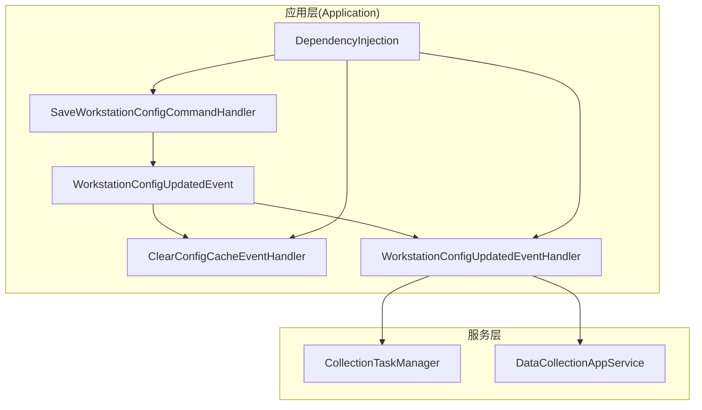
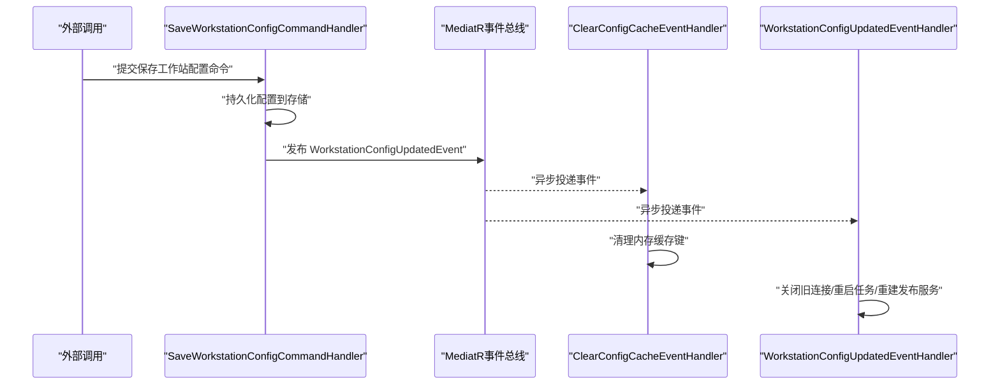
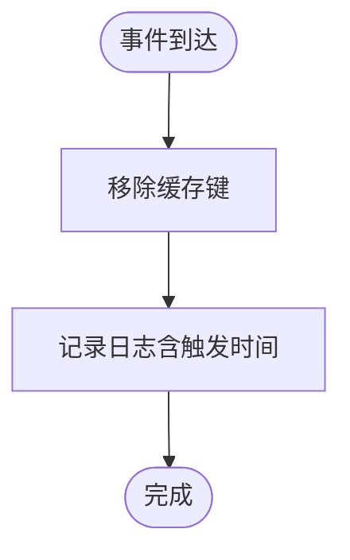
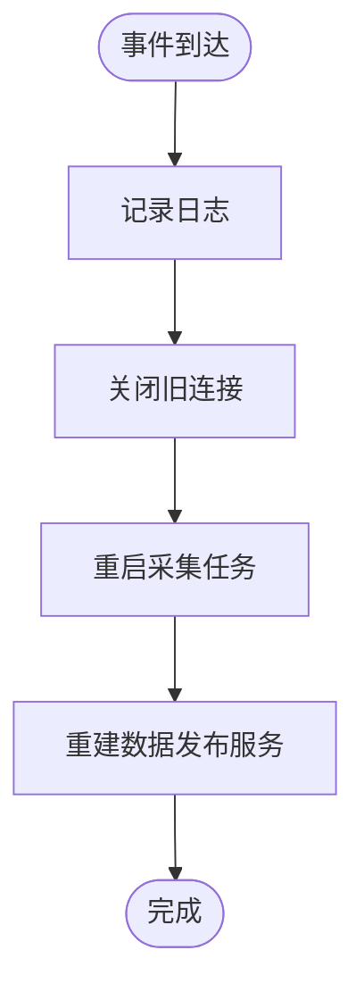
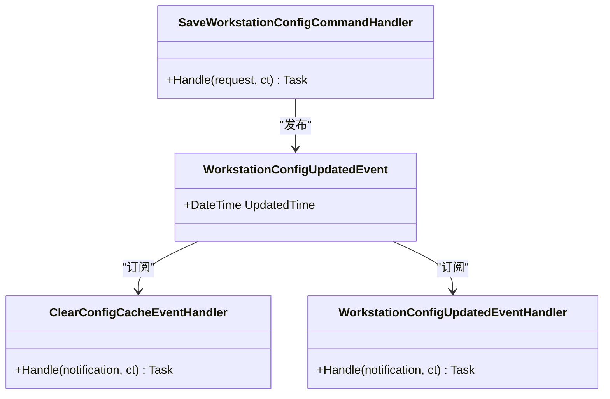
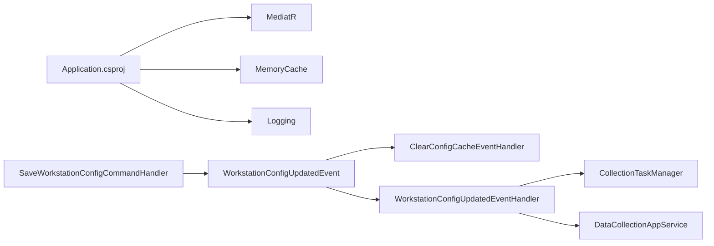

# 事件处理系统

<cite>
**本文引用的文件**
- [WorkstationConfigUpdatedEvent.cs](file://IndustrialDataSolution/IndustrialDataProcessor.Application/Events/WorkstationConfigUpdatedEvent.cs)
- [ClearConfigCacheEventHandler.cs](file://IndustrialDataSolution/IndustrialDataProcessor.Application/EventHandlers/ClearConfigCacheEventHandler.cs)
- [WorkstationConfigUpdatedEventHandler.cs](file://IndustrialDataSolution/IndustrialDataProcessor.Application/EventHandlers/WorkstationConfigUpdatedEventHandler.cs)
- [SaveWorkstationConfigCommandHandler.cs](file://IndustrialDataSolution/IndustrialDataProcessor.Application/CommandHandlers/SaveWorkstationConfigCommandHandler.cs)
- [DependencyInjection.cs](file://IndustrialDataSolution/IndustrialDataProcessor.Application/DependencyInjection.cs)
- [CacheKeys.cs](file://IndustrialDataSolution/IndustrialDataProcessor.Application/Constants/CacheKeys.cs)
- [CollectionTaskManager.cs](file://IndustrialDataSolution/IndustrialDataProcessor.Application/Services/CollectionTaskManager.cs)
- [DataCollectionAppService.cs](file://IndustrialDataSolution/IndustrialDataProcessor.Application/Services/DataCollectionAppService.cs)
- [IWorkstationConfigRepository.cs](file://IndustrialDataSolution/IndustrialDataProcessor.Domain/Repositories/IWorkstationConfigRepository.cs)
- [IndustrialDataProcessor.Application.csproj](file://IndustrialDataSolution/IndustrialDataProcessor.Application/IndustrialDataProcessor.Application.csproj)
</cite>

## 目录
1. [简介](#简介)
2. [项目结构](#项目结构)
3. [核心组件](#核心组件)
4. [架构总览](#架构总览)
5. [详细组件分析](#详细组件分析)
6. [依赖关系分析](#依赖关系分析)
7. [性能考量](#性能考量)
8. [故障排查指南](#故障排查指南)
9. [结论](#结论)
10. [附录](#附录)

## 简介
本文件面向DDD工业数据处理解决方案中的事件处理系统，聚焦领域事件与事件处理器的设计与实现，重点说明以下内容：
- WorkstationConfigUpdatedEvent事件的结构与触发条件
- 事件处理器实现模式：ClearConfigCacheEventHandler与WorkstationConfigUpdatedEventHandler
- 事件发布与订阅机制：MediatR事件总线的配置与事件路由
- 事件驱动架构优势：解耦、可扩展性与异步处理能力
- 事件处理最佳实践：幂等性、错误处理与重试机制
- 性能与监控策略

## 项目结构
事件处理系统位于应用层（Application），围绕MediatR实现“命令-事件-处理器”的解耦架构：
- 命令处理器在持久化完成后发布领域事件
- 事件处理器作为异步副作用执行（如缓存清理、连接重置、任务重启、服务重建）

图表来源
- [SaveWorkstationConfigCommandHandler.cs](file://IndustrialDataSolution/IndustrialDataProcessor.Application/CommandHandlers/SaveWorkstationConfigCommandHandler.cs#L18-L30)
- [WorkstationConfigUpdatedEvent.cs](file://IndustrialDataSolution/IndustrialDataProcessor.Application/Events/WorkstationConfigUpdatedEvent.cs#L7-L10)
- [ClearConfigCacheEventHandler.cs](file://IndustrialDataSolution/IndustrialDataProcessor.Application/EventHandlers/ClearConfigCacheEventHandler.cs#L11-L24)
- [WorkstationConfigUpdatedEventHandler.cs](file://IndustrialDataSolution/IndustrialDataProcessor.Application/EventHandlers/WorkstationConfigUpdatedEventHandler.cs#L13-L38)
- [DependencyInjection.cs](file://IndustrialDataSolution/IndustrialDataProcessor.Application/DependencyInjection.cs#L29-L36)

章节来源
- [DependencyInjection.cs](file://IndustrialDataSolution/IndustrialDataProcessor.Application/DependencyInjection.cs#L16-L39)
- [IndustrialDataProcessor.Application.csproj](file://IndustrialDataSolution/IndustrialDataProcessor.Application/IndustrialDataProcessor.Application.csproj#L9-L22)

## 核心组件
- 领域事件：WorkstationConfigUpdatedEvent
  - 实现INotification接口，承载事件元信息（如触发时间）
  - 由命令处理器在持久化成功后发布
- 事件处理器：
  - ClearConfigCacheEventHandler：清理内存缓存键
  - WorkstationConfigUpdatedEventHandler：关闭旧连接、重启采集任务、重建数据发布服务
- 事件总线：通过MediatR在应用层注册与扫描，自动发现事件处理器

章节来源
- [WorkstationConfigUpdatedEvent.cs](file://IndustrialDataSolution/IndustrialDataProcessor.Application/Events/WorkstationConfigUpdatedEvent.cs#L7-L10)
- [ClearConfigCacheEventHandler.cs](file://IndustrialDataSolution/IndustrialDataProcessor.Application/EventHandlers/ClearConfigCacheEventHandler.cs#L11-L24)
- [WorkstationConfigUpdatedEventHandler.cs](file://IndustrialDataSolution/IndustrialDataProcessor.Application/EventHandlers/WorkstationConfigUpdatedEventHandler.cs#L13-L38)
- [DependencyInjection.cs](file://IndustrialDataSolution/IndustrialDataProcessor.Application/DependencyInjection.cs#L29-L36)

## 架构总览
事件驱动流程以命令处理器为核心触发点，命令持久化成功后发布领域事件，事件总线将通知分发给所有订阅者（处理器）。处理器彼此独立，互不阻塞，实现业务副作用的解耦。

图表来源
- [SaveWorkstationConfigCommandHandler.cs](file://IndustrialDataSolution/IndustrialDataProcessor.Application/CommandHandlers/SaveWorkstationConfigCommandHandler.cs#L18-L30)
- [WorkstationConfigUpdatedEvent.cs](file://IndustrialDataSolution/IndustrialDataProcessor.Application/Events/WorkstationConfigUpdatedEvent.cs#L7-L10)
- [ClearConfigCacheEventHandler.cs](file://IndustrialDataSolution/IndustrialDataProcessor.Application/EventHandlers/ClearConfigCacheEventHandler.cs#L16-L24)
- [WorkstationConfigUpdatedEventHandler.cs](file://IndustrialDataSolution/IndustrialDataProcessor.Application/EventHandlers/WorkstationConfigUpdatedEventHandler.cs#L24-L38)

## 详细组件分析

### WorkstationConfigUpdatedEvent事件
- 角色：领域事件，表示工作站配置已更新
- 结构要点：
  - 继承INotification，符合MediatR通知契约
  - 包含UpdatedTime字段，便于审计与调试
- 触发条件：命令处理器在持久化成功后发布该事件

章节来源
- [WorkstationConfigUpdatedEvent.cs](file://IndustrialDataSolution/IndustrialDataProcessor.Application/Events/WorkstationConfigUpdatedEvent.cs#L7-L10)
- [SaveWorkstationConfigCommandHandler.cs](file://IndustrialDataSolution/IndustrialDataProcessor.Application/CommandHandlers/SaveWorkstationConfigCommandHandler.cs#L28-L30)

### ClearConfigCacheEventHandler处理器
- 职责：响应配置更新事件，清理内存缓存中对应键
- 处理逻辑：
  - 从内存缓存中移除指定键
  - 记录日志，包含事件触发时间
- 设计特点：轻量、幂等、无副作用

图表来源
- [ClearConfigCacheEventHandler.cs](file://IndustrialDataSolution/IndustrialDataProcessor.Application/EventHandlers/ClearConfigCacheEventHandler.cs#L16-L24)
- [CacheKeys.cs](file://IndustrialDataSolution/IndustrialDataProcessor.Application/Constants/CacheKeys.cs#L5)

章节来源
- [ClearConfigCacheEventHandler.cs](file://IndustrialDataSolution/IndustrialDataProcessor.Application/EventHandlers/ClearConfigCacheEventHandler.cs#L11-L24)
- [CacheKeys.cs](file://IndustrialDataSolution/IndustrialDataProcessor.Application/Constants/CacheKeys.cs#L3-L6)

### WorkstationConfigUpdatedEventHandler处理器
- 职责：响应配置更新事件，执行系统范围的重连与重启
- 处理逻辑：
  - 关闭旧的物理连接（避免端口/地址冲突）
  - 重启采集任务（取消旧任务、拉取最新配置、启动新任务）
  - 重建数据发布服务（基于最新配置）
- 设计特点：异步、幂等、具备资源回收与重建能力

图表来源
- [WorkstationConfigUpdatedEventHandler.cs](file://IndustrialDataSolution/IndustrialDataProcessor.Application/EventHandlers/WorkstationConfigUpdatedEventHandler.cs#L24-L38)
- [CollectionTaskManager.cs](file://IndustrialDataSolution/IndustrialDataProcessor.Application/Services/CollectionTaskManager.cs#L19-L59)

章节来源
- [WorkstationConfigUpdatedEventHandler.cs](file://IndustrialDataSolution/IndustrialDataProcessor.Application/EventHandlers/WorkstationConfigUpdatedEventHandler.cs#L13-L38)
- [CollectionTaskManager.cs](file://IndustrialDataSolution/IndustrialDataProcessor.Application/Services/CollectionTaskManager.cs#L6-L61)

### 事件发布与订阅机制
- 发布：命令处理器在持久化成功后调用IMediator.Publish发布领域事件
- 订阅：通过依赖注入注册MediatR，扫描包含事件处理器的程序集，自动发现处理器
- 路由：MediatR按事件类型将通知分发给所有实现INotificationHandler<T>的处理器

图表来源
- [SaveWorkstationConfigCommandHandler.cs](file://IndustrialDataSolution/IndustrialDataProcessor.Application/CommandHandlers/SaveWorkstationConfigCommandHandler.cs#L28-L30)
- [WorkstationConfigUpdatedEvent.cs](file://IndustrialDataSolution/IndustrialDataProcessor.Application/Events/WorkstationConfigUpdatedEvent.cs#L7-L10)
- [ClearConfigCacheEventHandler.cs](file://IndustrialDataSolution/IndustrialDataProcessor.Application/EventHandlers/ClearConfigCacheEventHandler.cs#L11)
- [WorkstationConfigUpdatedEventHandler.cs](file://IndustrialDataSolution/IndustrialDataProcessor.Application/EventHandlers/WorkstationConfigUpdatedEventHandler.cs#L17)

章节来源
- [SaveWorkstationConfigCommandHandler.cs](file://IndustrialDataSolution/IndustrialDataProcessor.Application/CommandHandlers/SaveWorkstationConfigCommandHandler.cs#L11-L31)
- [DependencyInjection.cs](file://IndustrialDataSolution/IndustrialDataProcessor.Application/DependencyInjection.cs#L29-L36)

### 事件驱动架构优势
- 解耦：命令与处理器分离，事件作为松耦合的通信方式
- 可扩展性：新增处理器无需修改现有处理器或命令
- 异步处理：处理器异步执行，避免阻塞主业务流程

## 依赖关系分析
- 应用层项目引用MediatR与Microsoft.Extensions.*，用于事件总线与日志缓存
- 事件处理器依赖领域接口（连接管理、任务管理、数据发布管理）
- 命令处理器依赖仓储与事件总线，完成持久化与事件发布

图表来源
- [IndustrialDataProcessor.Application.csproj](file://IndustrialDataSolution/IndustrialDataProcessor.Application/IndustrialDataProcessor.Application.csproj#L9-L22)
- [SaveWorkstationConfigCommandHandler.cs](file://IndustrialDataSolution/IndustrialDataProcessor.Application/CommandHandlers/SaveWorkstationConfigCommandHandler.cs#L11-L16)
- [WorkstationConfigUpdatedEventHandler.cs](file://IndustrialDataSolution/IndustrialDataProcessor.Application/EventHandlers/WorkstationConfigUpdatedEventHandler.cs#L13-L22)

章节来源
- [IndustrialDataProcessor.Application.csproj](file://IndustrialDataSolution/IndustrialDataProcessor.Application/IndustrialDataProcessor.Application.csproj#L9-L22)
- [DependencyInjection.cs](file://IndustrialDataSolution/IndustrialDataProcessor.Application/DependencyInjection.cs#L29-L36)

## 性能考量
- 异步与非阻塞：事件处理器异步执行；采集任务通过后台线程独立运行，避免相互阻塞
- 资源回收：重启任务前显式取消旧任务并释放资源，降低资源泄漏风险
- 缓存一致性：事件触发后立即清理缓存键，避免脏读
- 日志与可观测性：处理器记录关键事件与耗时，便于定位问题

章节来源
- [WorkstationConfigUpdatedEventHandler.cs](file://IndustrialDataSolution/IndustrialDataProcessor.Application/EventHandlers/WorkstationConfigUpdatedEventHandler.cs#L24-L38)
- [CollectionTaskManager.cs](file://IndustrialDataSolution/IndustrialDataProcessor.Application/Services/CollectionTaskManager.cs#L19-L59)
- [ClearConfigCacheEventHandler.cs](file://IndustrialDataSolution/IndustrialDataProcessor.Application/EventHandlers/ClearConfigCacheEventHandler.cs#L16-L24)

## 故障排查指南
- 事件未触发
  - 检查命令处理器是否在持久化成功后再发布事件
  - 确认MediatR已正确注册并扫描到事件处理器
- 处理器未执行
  - 查看日志中是否存在事件到达与处理完成记录
  - 确认处理器实现INotificationHandler<T>并被DI容器注册
- 缓存未清理
  - 核对缓存键是否与定义一致
  - 检查内存缓存实例是否可用
- 连接/任务未重启
  - 关注旧任务取消与新任务启动的日志
  - 确认任务管理器的取消令牌与作用域工厂配置正确
- 数据发布服务未重建
  - 检查服务启动/重启接口调用链路与异常日志

章节来源
- [SaveWorkstationConfigCommandHandler.cs](file://IndustrialDataSolution/IndustrialDataProcessor.Application/CommandHandlers/SaveWorkstationConfigCommandHandler.cs#L28-L30)
- [DependencyInjection.cs](file://IndustrialDataSolution/IndustrialDataProcessor.Application/DependencyInjection.cs#L29-L36)
- [ClearConfigCacheEventHandler.cs](file://IndustrialDataSolution/IndustrialDataProcessor.Application/EventHandlers/ClearConfigCacheEventHandler.cs#L16-L24)
- [WorkstationConfigUpdatedEventHandler.cs](file://IndustrialDataSolution/IndustrialDataProcessor.Application/EventHandlers/WorkstationConfigUpdatedEventHandler.cs#L24-L38)
- [CollectionTaskManager.cs](file://IndustrialDataSolution/IndustrialDataProcessor.Application/Services/CollectionTaskManager.cs#L19-L59)

## 结论
该事件处理系统以MediatR为核心，实现了命令与副作用的解耦，通过领域事件驱动缓存清理、连接重置与任务/服务重建，具备良好的扩展性与异步处理能力。建议在生产环境中结合日志与指标监控，持续优化事件幂等性与重试策略，确保系统稳定性与一致性。

## 附录
- 事件与处理器清单
  - WorkstationConfigUpdatedEvent：领域事件
  - ClearConfigCacheEventHandler：清理缓存处理器
  - WorkstationConfigUpdatedEventHandler：重连/重启/重建处理器
- 相关接口与服务
  - IWorkstationConfigRepository：获取最新配置
  - CollectionTaskManager：任务生命周期管理
  - DataCollectionAppService：采集任务启动与数据通道发布

章节来源
- [IWorkstationConfigRepository.cs](file://IndustrialDataSolution/IndustrialDataProcessor.Domain/Repositories/IWorkstationConfigRepository.cs#L5-L11)
- [CollectionTaskManager.cs](file://IndustrialDataSolution/IndustrialDataProcessor.Application/Services/CollectionTaskManager.cs#L6-L61)
- [DataCollectionAppService.cs](file://IndustrialDataSolution/IndustrialDataProcessor.Application/Services/DataCollectionAppService.cs#L22-L41)