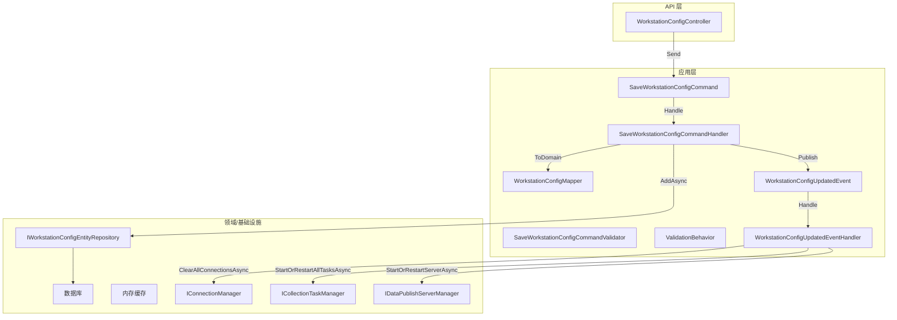
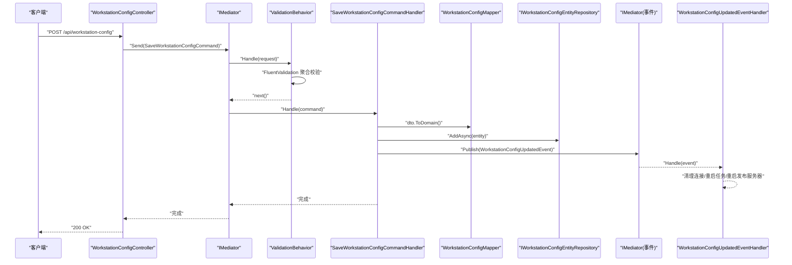
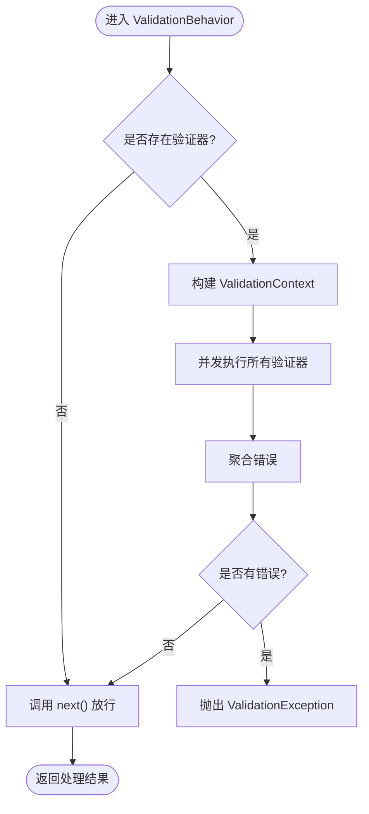
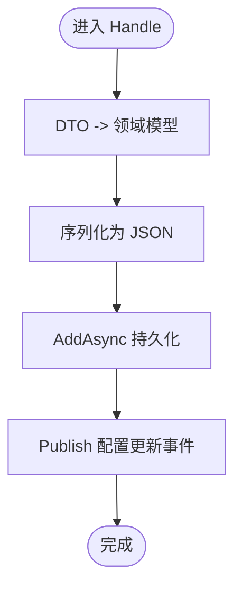
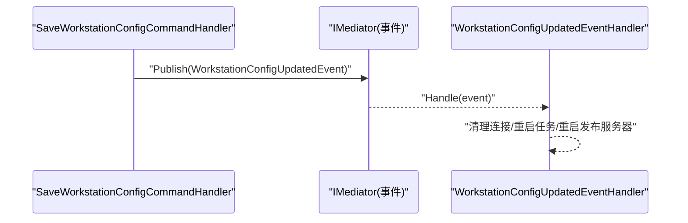
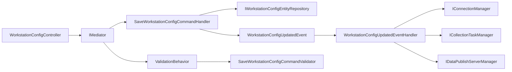

# 命令处理机制

<cite>
**本文档引用的文件**
- [SaveWorkstationConfigCommand.cs](file://IndustrialDataSolution/IndustrialDataProcessor.Application/Features/SaveWorkstationConfigCommand.cs)
- [SaveWorkstationConfigCommandHandler.cs](file://IndustrialDataSolution/IndustrialDataProcessor.Application/Features/SaveWorkstationConfigCommandHandler.cs)
- [SaveWorkstationConfigCommandValidator.cs](file://IndustrialDataSolution/IndustrialDataProcessor.Application/Validators/SaveWorkstationConfigCommandValidator.cs)
- [ValidationBehavior.cs](file://IndustrialDataSolution/IndustrialDataProcessor.Application/Behaviors/ValidationBehavior.cs)
- [DependencyInjection.cs](file://IndustrialDataSolution/IndustrialDataProcessor.Application/DependencyInjection.cs)
- [WorkstationConfigDto.cs](file://IndustrialDataSolution/IndustrialDataProcessor.Application/Dtos/WorkstationDto/WorkstationConfigDto.cs)
- [WorkstationConfigMapper.cs](file://IndustrialDataSolution/IndustrialDataProcessor.Application/Mappers/WorkstationConfigMapper.cs)
- [WorkstationConfigUpdatedEvent.cs](file://IndustrialDataSolution/IndustrialDataProcessor.Application/Features/WorkstationConfigUpdatedEvent.cs)
- [WorkstationConfigUpdatedEventHandler.cs](file://IndustrialDataSolution/IndustrialDataProcessor.Application/Features/WorkstationConfigUpdatedEventHandler.cs)
- [WorkstationConfigController.cs](file://IndustrialDataSolution/IndustrialDataProcessor.Api/Controllers/WorkstationConfigController.cs)
- [CacheKeys.cs](file://IndustrialDataSolution/IndustrialDataProcessor.Application/Constants/CacheKeys.cs)
- [IDataCollectionAppService.cs](file://IndustrialDataSolution/IndustrialDataProcessor.Application/Services/IDataCollectionAppService.cs)
</cite>

## 更新摘要
**所做更改**
- 更新了命令文件夹结构，从Commands迁移到Features文件夹
- 更新了验证器命名空间引用，从Features引用改为Validators命名空间
- 更新了依赖注入配置中的程序集扫描范围
- 更新了事件处理器的实现位置和命名空间
- 更新了所有相关的文件路径引用和代码示例

## 目录
1. [引言](#引言)
2. [项目结构](#项目结构)
3. [核心组件](#核心组件)
4. [架构总览](#架构总览)
5. [详细组件分析](#详细组件分析)
6. [依赖关系分析](#依赖关系分析)
7. [性能考虑](#性能考虑)
8. [故障排查指南](#故障排查指南)
9. [结论](#结论)
10. [附录](#附录)

## 引言
本文件围绕DDD工业数据处理解决方案中的命令处理机制展开，重点阐述MediatR在应用层的集成与使用方式，涵盖命令定义、处理器实现、依赖注入配置、验证行为、事件发布与处理、以及事务与异常传播等主题。文档以SaveWorkstationConfigCommand为例，系统性说明命令结构、参数验证、处理流程、异步处理与错误处理策略，并给出最佳实践与性能优化建议。

**更新** 命令文件夹已从Commands迁移到Features，验证器命名空间已更新，依赖注入配置进行了相应的调整。

## 项目结构
应用层采用分层与职责分离的设计：命令与查询通过MediatR传递；验证逻辑通过FluentValidation与Pipeline Behavior统一拦截；处理器负责业务编排；事件用于解耦后续副作用（如缓存清理、连接重置、任务重启等）。API层仅承担请求映射与命令发送职责。

**图表来源**
- [WorkstationConfigController.cs](file://IndustrialDataSolution/IndustrialDataProcessor.Api/Controllers/WorkstationConfigController.cs#L1-L22)
- [SaveWorkstationConfigCommand.cs](file://IndustrialDataSolution/IndustrialDataProcessor.Application/Features/SaveWorkstationConfigCommand.cs#L1-L42)
- [SaveWorkstationConfigCommandHandler.cs](file://IndustrialDataSolution/IndustrialDataProcessor.Application/Features/SaveWorkstationConfigCommandHandler.cs#L1-L42)
- [ValidationBehavior.cs](file://IndustrialDataSolution/IndustrialDataProcessor.Application/Behaviors/ValidationBehavior.cs#L1-L31)
- [SaveWorkstationConfigCommandValidator.cs](file://IndustrialDataSolution/IndustrialDataProcessor.Application/Validators/SaveWorkstationConfigCommandValidator.cs#L1-L13)
- [WorkstationConfigMapper.cs](file://IndustrialDataSolution/IndustrialDataProcessor.Application/Mappers/WorkstationConfigMapper.cs#L1-L106)
- [WorkstationConfigUpdatedEvent.cs](file://IndustrialDataSolution/IndustrialDataProcessor.Application/Features/WorkstationConfigUpdatedEvent.cs#L1-L77)
- [WorkstationConfigUpdatedEventHandler.cs](file://IndustrialDataSolution/IndustrialDataProcessor.Application/Features/WorkstationConfigUpdatedEventHandler.cs#L1-L77)

**章节来源**
- [WorkstationConfigController.cs](file://IndustrialDataSolution/IndustrialDataProcessor.Api/Controllers/WorkstationConfigController.cs#L1-L22)
- [DependencyInjection.cs](file://IndustrialDataSolution/IndustrialDataProcessor.Application/DependencyInjection.cs#L1-L41)

## 核心组件
- 命令定义：SaveWorkstationConfigCommand承载请求载荷（WorkstationConfigDto），作为MediatR的IRequest载体，位于Features文件夹中。
- 命令处理器：SaveWorkstationConfigCommandHandler负责将DTO映射为领域模型、序列化持久化、并发布配置更新事件。
- 验证器与行为：SaveWorkstationConfigCommandValidator组合WorkstationConfigDtoValidator；ValidationBehavior统一拦截并聚合验证结果。
- 事件与处理器：WorkstationConfigUpdatedEvent作为通知事件，WorkstationConfigUpdatedEventHandler负责连接、任务与发布服务器的重启。
- 依赖注入：通过AddApplication扩展方法注册验证器、服务、MediatR及全局验证行为。

**更新** 命令和事件处理器已迁移到Features文件夹，验证器命名空间已更新。

**章节来源**
- [SaveWorkstationConfigCommand.cs](file://IndustrialDataSolution/IndustrialDataProcessor.Application/Features/SaveWorkstationConfigCommand.cs#L1-L42)
- [SaveWorkstationConfigCommandHandler.cs](file://IndustrialDataSolution/IndustrialDataProcessor.Application/Features/SaveWorkstationConfigCommandHandler.cs#L1-L42)
- [SaveWorkstationConfigCommandValidator.cs](file://IndustrialDataSolution/IndustrialDataProcessor.Application/Validators/SaveWorkstationConfigCommandValidator.cs#L1-L13)
- [ValidationBehavior.cs](file://IndustrialDataSolution/IndustrialDataProcessor.Application/Behaviors/ValidationBehavior.cs#L1-L31)
- [WorkstationConfigUpdatedEvent.cs](file://IndustrialDataSolution/IndustrialDataProcessor.Application/Features/WorkstationConfigUpdatedEvent.cs#L1-L77)
- [WorkstationConfigUpdatedEventHandler.cs](file://IndustrialDataSolution/IndustrialDataProcessor.Application/Features/WorkstationConfigUpdatedEventHandler.cs#L1-L77)
- [DependencyInjection.cs](file://IndustrialDataSolution/IndustrialDataProcessor.Application/DependencyInjection.cs#L1-L41)

## 架构总览
命令处理遵循"请求-验证-处理-通知"的流水线模式。API控制器接收HTTP请求，封装为命令并通过MediatR发送；全局验证行为在进入处理器前统一校验；处理器完成领域转换与持久化，并发布领域事件；事件处理器响应副作用，确保系统状态一致性。

**图表来源**
- [WorkstationConfigController.cs](file://IndustrialDataSolution/IndustrialDataProcessor.Api/Controllers/WorkstationConfigController.cs#L1-L22)
- [ValidationBehavior.cs](file://IndustrialDataSolution/IndustrialDataProcessor.Application/Behaviors/ValidationBehavior.cs#L1-L31)
- [SaveWorkstationConfigCommandHandler.cs](file://IndustrialDataSolution/IndustrialDataProcessor.Application/Features/SaveWorkstationConfigCommandHandler.cs#L1-L42)
- [WorkstationConfigMapper.cs](file://IndustrialDataSolution/IndustrialDataProcessor.Application/Mappers/WorkstationConfigMapper.cs#L1-L106)
- [WorkstationConfigUpdatedEvent.cs](file://IndustrialDataSolution/IndustrialDataProcessor.Application/Features/WorkstationConfigUpdatedEvent.cs#L1-L77)
- [WorkstationConfigUpdatedEventHandler.cs](file://IndustrialDataSolution/IndustrialDataProcessor.Application/Features/WorkstationConfigUpdatedEventHandler.cs#L1-L77)

## 详细组件分析

### SaveWorkstationConfigCommand 命令设计
- 结构：命令为只读记录类型，携带WorkstationConfigDto作为唯一参数，符合值对象的不可变特性，便于跨边界传递与日志追踪。
- 设计原则：
  - 单一职责：仅表达"保存工作站配置"意图，不包含业务逻辑。
  - 可测试性：通过构造函数注入DTO，便于单元测试替换输入。
  - 明确性：命令名与领域概念一致，避免歧义。

**更新** 命令文件已从Commands文件夹迁移到Features文件夹。

**章节来源**
- [SaveWorkstationConfigCommand.cs](file://IndustrialDataSolution/IndustrialDataProcessor.Application/Features/SaveWorkstationConfigCommand.cs#L1-L42)
- [WorkstationConfigDto.cs](file://IndustrialDataSolution/IndustrialDataProcessor.Application/Dtos/WorkstationDto/WorkstationConfigDto.cs#L1-L27)

### 参数验证与前置处理
- 组合验证器：SaveWorkstationConfigCommandValidator将命令级验证委托给WorkstationConfigDtoValidator，确保DTO结构与语义约束得到覆盖。
- 全局验证行为：ValidationBehavior在进入处理器前统一执行FluentValidation，聚合多个验证器的结果，失败时抛出ValidationException，阻止后续处理。
- 复杂度与性能：验证器并发执行，避免串行阻塞；聚合错误减少多次往返。

**图表来源**
- [ValidationBehavior.cs](file://IndustrialDataSolution/IndustrialDataProcessor.Application/Behaviors/ValidationBehavior.cs#L1-L31)
- [SaveWorkstationConfigCommandValidator.cs](file://IndustrialDataSolution/IndustrialDataProcessor.Application/Validators/SaveWorkstationConfigCommandValidator.cs#L1-L13)
- [WorkstationConfigDtoValidator.cs](file://IndustrialDataSolution/IndustrialDataProcessor.Application/Validators/WorkstationConfigDtoValidator.cs#L1-L36)

**章节来源**
- [SaveWorkstationConfigCommandValidator.cs](file://IndustrialDataSolution/IndustrialDataProcessor.Application/Validators/SaveWorkstationConfigCommandValidator.cs#L1-L13)
- [ValidationBehavior.cs](file://IndustrialDataSolution/IndustrialDataProcessor.Application/Behaviors/ValidationBehavior.cs#L1-L31)
- [WorkstationConfigDtoValidator.cs](file://IndustrialDataSolution/IndustrialDataProcessor.Application/Validators/WorkstationConfigDtoValidator.cs#L1-L36)

### 命令处理器实现模式
- 异步处理：处理器方法与仓储、事件发布均采用异步模式，避免阻塞请求线程。
- 错误处理：验证阶段失败直接抛出ValidationException；处理器内部未显式try/catch，交由上层中间件或调用方处理。
- 事务管理：当前实现未显式开启事务；若需要强一致，可在仓储层或处理器中引入事务包装（例如EF事务或自定义事务上下文）。
- 处理流程：
  1) DTO映射为领域模型；
  2) 序列化为JSON持久化；
  3) 保存实体；
  4) 发布配置更新事件，触发系统重启。

**更新** 处理器文件已从CommandHandlers文件夹迁移到Features文件夹。

**图表来源**
- [SaveWorkstationConfigCommandHandler.cs](file://IndustrialDataSolution/IndustrialDataProcessor.Application/Features/SaveWorkstationConfigCommandHandler.cs#L1-L42)
- [WorkstationConfigMapper.cs](file://IndustrialDataSolution/IndustrialDataProcessor.Application/Mappers/WorkstationConfigMapper.cs#L1-L106)

**章节来源**
- [SaveWorkstationConfigCommandHandler.cs](file://IndustrialDataSolution/IndustrialDataProcessor.Application/Features/SaveWorkstationConfigCommandHandler.cs#L1-L42)

### 事件发布与后置处理
- 事件模型：WorkstationConfigUpdatedEvent携带更新时间戳，作为系统内各子系统的统一信号。
- 连接与任务重启：WorkstationConfigUpdatedEventHandler负责关闭旧连接、重启采集任务、重建数据发布服务器，保证运行时一致性。

**更新** 事件处理器已迁移到Features文件夹，移除了缓存清理功能。

**图表来源**
- [WorkstationConfigUpdatedEvent.cs](file://IndustrialDataSolution/IndustrialDataProcessor.Application/Features/WorkstationConfigUpdatedEvent.cs#L1-L77)
- [WorkstationConfigUpdatedEventHandler.cs](file://IndustrialDataSolution/IndustrialDataProcessor.Application/Features/WorkstationConfigUpdatedEventHandler.cs#L1-L77)

**章节来源**
- [WorkstationConfigUpdatedEvent.cs](file://IndustrialDataSolution/IndustrialDataProcessor.Application/Features/WorkstationConfigUpdatedEvent.cs#L1-L77)
- [WorkstationConfigUpdatedEventHandler.cs](file://IndustrialDataSolution/IndustrialDataProcessor.Application/Features/WorkstationConfigUpdatedEventHandler.cs#L1-L77)

### 依赖注入配置
- 验证器注册：自动扫描并注册所有FluentValidation验证器。
- 应用服务注册：注册数据采集应用服务、采集任务管理器、数据发布服务器管理器与进程内消息通道。
- MediatR注册：扫描包含命令的程序集，注册命令处理器；同时注册ValidationBehavior为全局行为，实现跨命令的统一验证。

**更新** 依赖注入配置已更新，程序集扫描范围明确指定为当前程序集。

**章节来源**
- [DependencyInjection.cs](file://IndustrialDataSolution/IndustrialDataProcessor.Application/DependencyInjection.cs#L1-L41)

### 使用场景与示例路径
- API入口：控制器接收DTO，封装为命令并通过MediatR发送。
- 命令定义：命令类文件路径参见[SaveWorkstationConfigCommand.cs](file://IndustrialDataSolution/IndustrialDataProcessor.Application/Features/SaveWorkstationConfigCommand.cs#L1-L42)。
- 处理器实现：处理器类文件路径参见[SaveWorkstationConfigCommandHandler.cs](file://IndustrialDataSolution/IndustrialDataProcessor.Application/Features/SaveWorkstationConfigCommandHandler.cs#L1-L42)。
- 验证器与行为：验证器与行为文件路径分别参见[SaveWorkstationConfigCommandValidator.cs](file://IndustrialDataSolution/IndustrialDataProcessor.Application/Validators/SaveWorkstationConfigCommandValidator.cs#L1-L13)、[ValidationBehavior.cs](file://IndustrialDataSolution/IndustrialDataProcessor.Application/Behaviors/ValidationBehavior.cs#L1-L31)。
- 事件与处理器：事件与处理器文件路径分别参见[WorkstationConfigUpdatedEvent.cs](file://IndustrialDataSolution/IndustrialDataProcessor.Application/Features/WorkstationConfigUpdatedEvent.cs#L1-L77)、[WorkstationConfigUpdatedEventHandler.cs](file://IndustrialDataSolution/IndustrialDataProcessor.Application/Features/WorkstationConfigUpdatedEventHandler.cs#L1-L77)。
- 依赖注入：扩展方法文件路径参见[DependencyInjection.cs](file://IndustrialDataSolution/IndustrialDataProcessor.Application/DependencyInjection.cs#L1-L41)。

**更新** 所有文件路径已更新为新的Features文件夹结构。

**章节来源**
- [WorkstationConfigController.cs](file://IndustrialDataSolution/IndustrialDataProcessor.Api/Controllers/WorkstationConfigController.cs#L1-L22)

## 依赖关系分析
- 控制器依赖MediatR进行命令发送。
- 命令处理器依赖仓储接口与事件总线，实现持久化与事件发布。
- 事件处理器依赖连接管理器、任务管理器与发布服务器管理器，实现系统级重启。
- 验证行为依赖FluentValidation，统一拦截命令处理。
- 依赖注入将上述组件按作用域注册，确保生命周期与协作关系清晰。

**更新** 依赖关系已更新，反映新的文件夹结构。

**图表来源**
- [WorkstationConfigController.cs](file://IndustrialDataSolution/IndustrialDataProcessor.Api/Controllers/WorkstationConfigController.cs#L1-L22)
- [SaveWorkstationConfigCommandHandler.cs](file://IndustrialDataSolution/IndustrialDataProcessor.Application/Features/SaveWorkstationConfigCommandHandler.cs#L1-L42)
- [WorkstationConfigUpdatedEventHandler.cs](file://IndustrialDataSolution/IndustrialDataProcessor.Application/Features/WorkstationConfigUpdatedEventHandler.cs#L1-L77)
- [ValidationBehavior.cs](file://IndustrialDataSolution/IndustrialDataProcessor.Application/Behaviors/ValidationBehavior.cs#L1-L31)
- [SaveWorkstationConfigCommandValidator.cs](file://IndustrialDataSolution/IndustrialDataProcessor.Application/Validators/SaveWorkstationConfigCommandValidator.cs#L1-L13)

**章节来源**
- [WorkstationConfigController.cs](file://IndustrialDataSolution/IndustrialDataProcessor.Api/Controllers/WorkstationConfigController.cs#L1-L22)
- [SaveWorkstationConfigCommandHandler.cs](file://IndustrialDataSolution/IndustrialDataProcessor.Application/Features/SaveWorkstationConfigCommandHandler.cs#L1-L42)
- [WorkstationConfigUpdatedEventHandler.cs](file://IndustrialDataSolution/IndustrialDataProcessor.Application/Features/WorkstationConfigUpdatedEventHandler.cs#L1-L77)
- [ValidationBehavior.cs](file://IndustrialDataSolution/IndustrialDataProcessor.Application/Behaviors/ValidationBehavior.cs#L1-L31)
- [SaveWorkstationConfigCommandValidator.cs](file://IndustrialDataSolution/IndustrialDataProcessor.Application/Validators/SaveWorkstationConfigCommandValidator.cs#L1-L13)

## 性能考虑
- 并发验证：ValidationBehavior并发执行验证器，降低延迟。
- 异步处理：处理器与事件处理均为异步，避免阻塞主线程。
- 序列化成本：JSON序列化发生在处理器内部，建议在DTO稳定且体积可控的前提下评估序列化开销。
- 事件副作用：连接清理与任务重启可能带来短暂抖动，建议在低峰时段触发或增加幂等保护。
- 缓存清理：事件处理器移除缓存键，确保后续读取命中最新配置，避免陈旧数据导致的重复计算。

**更新** 性能考虑保持不变，但事件副作用已简化为连接清理、任务重启和发布服务器重启。

## 故障排查指南
- 验证失败：检查ValidationBehavior是否抛出ValidationException，定位具体验证器与错误字段。
- 处理器异常：当前处理器未显式捕获异常，建议在上层中间件或调用方捕获并记录。
- 事件未触发：确认处理器是否成功发布WorkstationConfigUpdatedEvent，检查事件处理器注册与依赖注入。
- 缓存未清理：核对WorkstationConfigUpdatedEventHandler是否收到事件并执行缓存移除。
- 运行时重启异常：核对WorkstationConfigUpdatedEventHandler对连接管理器、任务管理器与发布服务器管理器的调用链路。

**更新** 故障排查指南已更新，移除了缓存清理相关的故障排查步骤。

**章节来源**
- [ValidationBehavior.cs](file://IndustrialDataSolution/IndustrialDataProcessor.Application/Behaviors/ValidationBehavior.cs#L1-L31)
- [SaveWorkstationConfigCommandHandler.cs](file://IndustrialDataSolution/IndustrialDataProcessor.Application/Features/SaveWorkstationConfigCommandHandler.cs#L1-L42)
- [WorkstationConfigUpdatedEvent.cs](file://IndustrialDataSolution/IndustrialDataProcessor.Application/Features/WorkstationConfigUpdatedEvent.cs#L1-L77)
- [WorkstationConfigUpdatedEventHandler.cs](file://IndustrialDataSolution/IndustrialDataProcessor.Application/Features/WorkstationConfigUpdatedEventHandler.cs#L1-L77)

## 结论
该命令处理机制以MediatR为核心，结合FluentValidation与Pipeline Behavior实现了统一的前置验证与职责分离；处理器专注于领域转换与持久化，并通过事件解耦后续副作用。整体设计清晰、可扩展性强，适合在工业数据场景中持续演进。建议在需要强一致性的环节引入事务包装，并对事件副作用进行可观测性增强与限流保护。

**更新** 结论保持不变，反映了最新的架构变化。

## 附录
- 命令设计原则
  - 命令应表达明确的业务意图，参数最小化。
  - 避免在命令中嵌入业务规则，规则应集中在处理器或验证器。
- 处理器职责分离
  - 映射：将DTO转换为领域模型。
  - 持久化：调用仓储保存实体。
  - 通知：发布领域事件以触发副作用。
- 性能优化建议
  - 合理拆分验证器，避免单个验证器承担过多逻辑。
  - 对事件处理器中的重操作进行异步化与幂等化。
  - 在高并发场景下，对序列化与数据库写入进行批量或合并策略评估。

**更新** 附录保持不变，为通用指导原则。