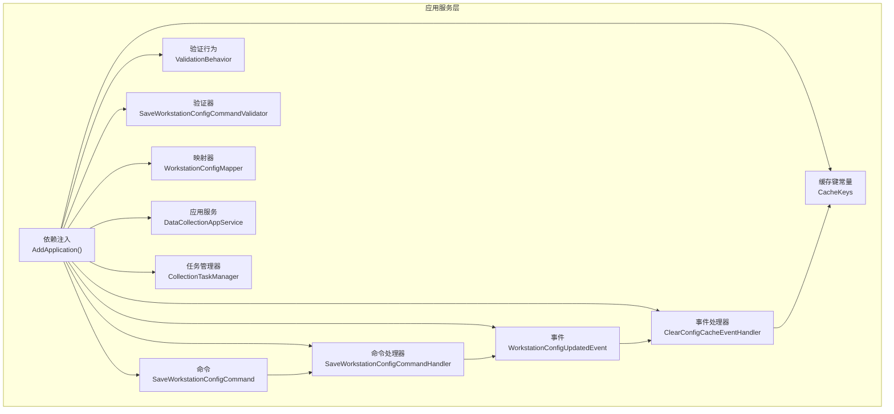
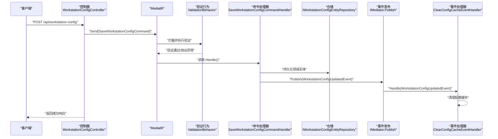
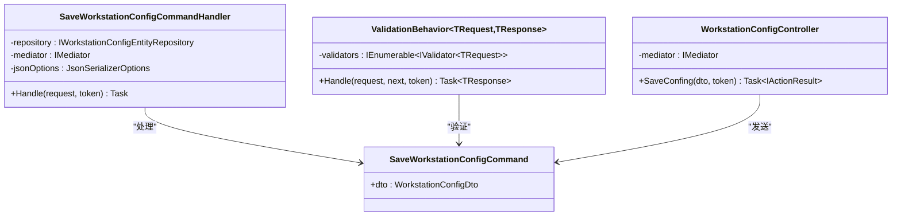
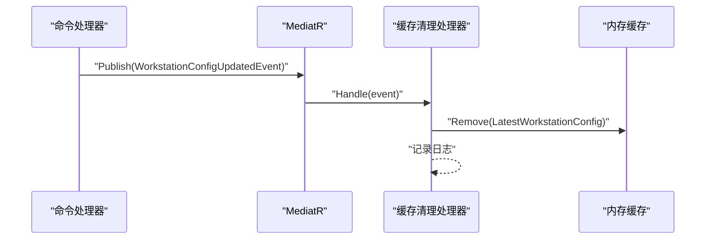
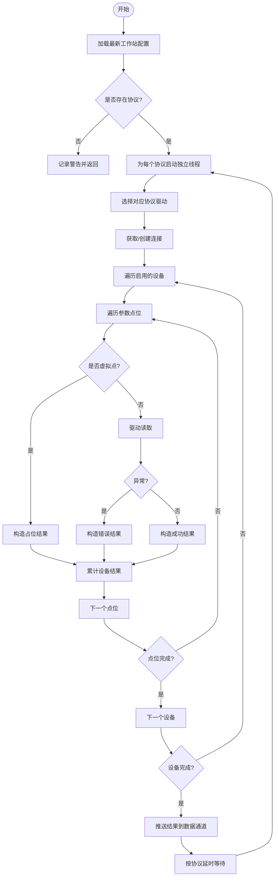
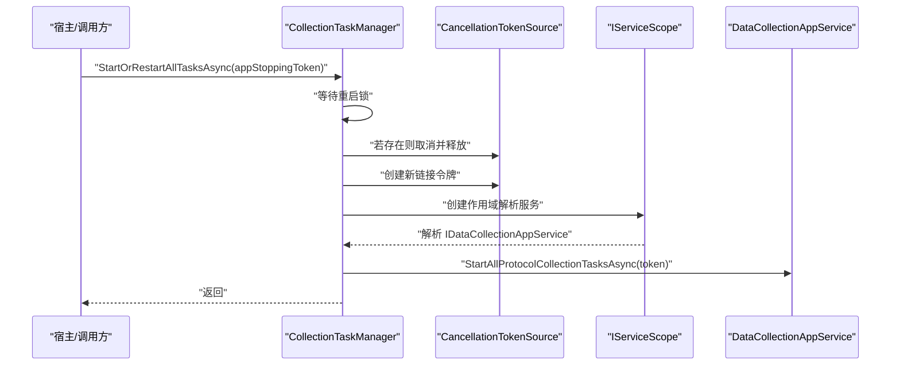
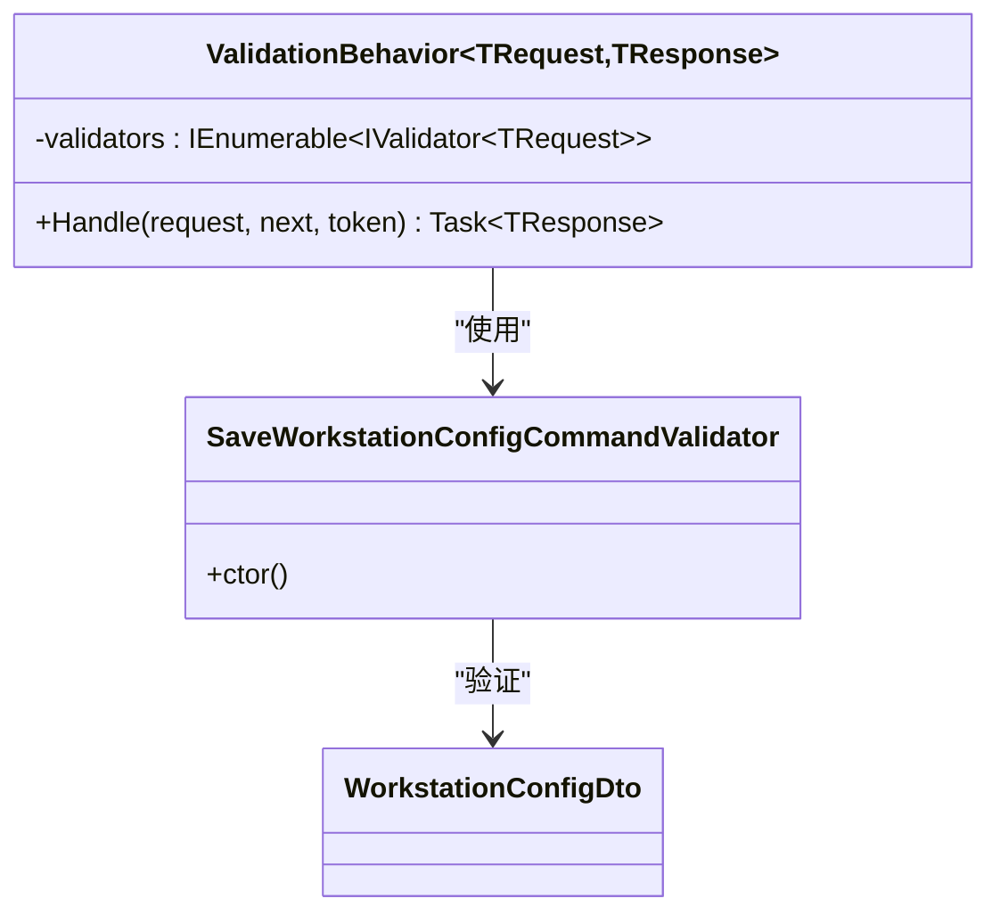
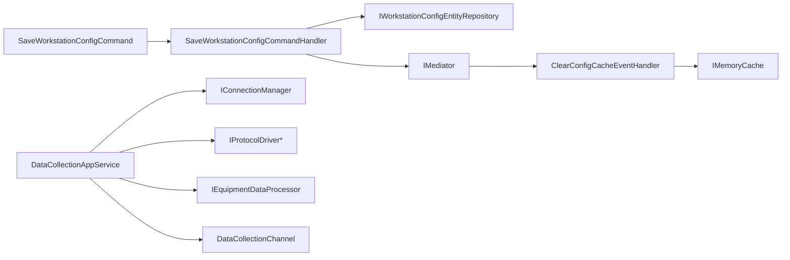

# 应用服务层

<cite>
**本文引用的文件**
- [IndustrialDataProcessor.Application/DependencyInjection.cs](file://IndustrialDataProcessor.Application/DependencyInjection.cs)
- [IndustrialDataProcessor.Application/CommandHandlers/SaveWorkstationConfigCommandHandler.cs](file://IndustrialDataProcessor.Application/CommandHandlers/SaveWorkstationConfigCommandHandler.cs)
- [IndustrialDataProcessor.Application/Commands/SaveWorkstationConfigCommand.cs](file://IndustrialDataProcessor.Application/Commands/SaveWorkstationConfigCommand.cs)
- [IndustrialDataProcessor.Application/Behaviors/ValidationBehavior.cs](file://IndustrialDataProcessor.Application/Behaviors/ValidationBehavior.cs)
- [IndustrialDataProcessor.Application/Events/WorkstationConfigUpdatedEvent.cs](file://IndustrialDataProcessor.Application/Events/WorkstationConfigUpdatedEvent.cs)
- [IndustrialDataProcessor.Application/EventHandlers/ClearConfigCacheEventHandler.cs](file://IndustrialDataProcessor.Application/EventHandlers/ClearConfigCacheEventHandler.cs)
- [IndustrialDataProcessor.Application/Constants/CacheKeys.cs](file://IndustrialDataProcessor.Application/Constants/CacheKeys.cs)
- [IndustrialDataProcessor.Application/Services/DataCollectionAppService.cs](file://IndustrialDataProcessor.Application/Services/DataCollectionAppService.cs)
- [IndustrialDataProcessor.Application/Services/CollectionTaskManager.cs](file://IndustrialDataProcessor.Application/Services/CollectionTaskManager.cs)
- [IndustrialDataProcessor.Application/Mappers/WorkstationConfigMapper.cs](file://IndustrialDataProcessor.Application/Mappers/WorkstationConfigMapper.cs)
- [IndustrialDataProcessor.Application/Validators/SaveWorkstationConfigCommandValidator.cs](file://IndustrialDataProcessor.Application/Validators/SaveWorkstationConfigCommandValidator.cs)
- [IndustrialDataProcessor.Application/Dtos/WorkstationDto/WorkstationConfigDto.cs](file://IndustrialDataProcessor.Application/Dtos/WorkstationDto/WorkstationConfigDto.cs)
- [IndustrialDataProcessor.Api/Controllers/WorkstationConfigController.cs](file://IndustrialDataProcessor.Api/Controllers/WorkstationConfigController.cs)
</cite>

## 目录
1. [引言](#引言)
2. [项目结构](#项目结构)
3. [核心组件](#核心组件)
4. [架构总览](#架构总览)
5. [组件详解](#组件详解)
6. [依赖关系分析](#依赖关系分析)
7. [性能考量](#性能考量)
8. [故障排查指南](#故障排查指南)
9. [结论](#结论)
10. [附录](#附录)

## 引言
本文件聚焦于DDD工业数据处理解决方案的应用服务层，系统性阐述以下主题：
- 命令处理机制与MediatR集成、命令处理器设计模式
- 领域事件的发布、订阅与处理流程
- 应用服务的编排逻辑：如何协调领域操作与基础设施调用
- 缓存管理策略：配置缓存与数据缓存的实现
- 验证行为：FluentValidation集成与自定义验证规则
- 数据采集应用服务：任务调度、并发控制与资源管理
- 服务接口设计原则与依赖注入配置
- 使用示例与最佳实践

## 项目结构
应用服务层位于IndustrialDataProcessor.Application，围绕命令、查询、事件、验证、映射、服务与常量组织，配合MediatR实现命令/查询的解耦与跨边界协作；通过依赖注入统一注册与作用域管理。

图表来源
- [IndustrialDataProcessor.Application/DependencyInjection.cs](file://IndustrialDataProcessor.Application/DependencyInjection.cs#L16-L39)
- [IndustrialDataProcessor.Application/CommandHandlers/SaveWorkstationConfigCommandHandler.cs](file://IndustrialDataProcessor.Application/CommandHandlers/SaveWorkstationConfigCommandHandler.cs#L11-L31)
- [IndustrialDataProcessor.Application/Behaviors/ValidationBehavior.cs](file://IndustrialDataProcessor.Application/Behaviors/ValidationBehavior.cs#L9-L30)
- [IndustrialDataProcessor.Application/Validators/SaveWorkstationConfigCommandValidator.cs](file://IndustrialDataProcessor.Application/Validators/SaveWorkstationConfigCommandValidator.cs#L6-L12)
- [IndustrialDataProcessor.Application/Mappers/WorkstationConfigMapper.cs](file://IndustrialDataProcessor.Application/Mappers/WorkstationConfigMapper.cs#L10-L19)
- [IndustrialDataProcessor.Application/Events/WorkstationConfigUpdatedEvent.cs](file://IndustrialDataProcessor.Application/Events/WorkstationConfigUpdatedEvent.cs#L7-L10)
- [IndustrialDataProcessor.Application/EventHandlers/ClearConfigCacheEventHandler.cs](file://IndustrialDataProcessor.Application/EventHandlers/ClearConfigCacheEventHandler.cs#L11-L24)
- [IndustrialDataProcessor.Application/Constants/CacheKeys.cs](file://IndustrialDataProcessor.Application/Constants/CacheKeys.cs#L3-L6)
- [IndustrialDataProcessor.Application/Services/DataCollectionAppService.cs](file://IndustrialDataProcessor.Application/Services/DataCollectionAppService.cs#L10-L215)
- [IndustrialDataProcessor.Application/Services/CollectionTaskManager.cs](file://IndustrialDataProcessor.Application/Services/CollectionTaskManager.cs#L6-L60)

章节来源
- [IndustrialDataProcessor.Application/DependencyInjection.cs](file://IndustrialDataProcessor.Application/DependencyInjection.cs#L11-L39)

## 核心组件
- 命令与处理器：以SaveWorkstationConfigCommand为核心入口，转换DTO为领域模型，持久化后发布配置更新事件。
- 验证行为：全局拦截进入MediatR的请求，统一执行FluentValidation验证。
- 事件与处理器：发布WorkstationConfigUpdatedEvent，订阅者清理配置缓存。
- 应用服务：DataCollectionAppService负责协议级长驻采集循环、并发设备读取、异常隔离与结果通道推送。
- 任务管理器：CollectionTaskManager负责任务启动/重启、取消令牌管理与并发重启控制。
- 映射器：WorkstationConfigMapper将DTO映射为领域配置对象，支持多接口类型分支。
- 缓存键：CacheKeys集中管理缓存键名，便于维护与替换。

章节来源
- [IndustrialDataProcessor.Application/CommandHandlers/SaveWorkstationConfigCommandHandler.cs](file://IndustrialDataProcessor.Application/CommandHandlers/SaveWorkstationConfigCommandHandler.cs#L11-L31)
- [IndustrialDataProcessor.Application/Behaviors/ValidationBehavior.cs](file://IndustrialDataProcessor.Application/Behaviors/ValidationBehavior.cs#L9-L30)
- [IndustrialDataProcessor.Application/Events/WorkstationConfigUpdatedEvent.cs](file://IndustrialDataProcessor.Application/Events/WorkstationConfigUpdatedEvent.cs#L7-L10)
- [IndustrialDataProcessor.Application/EventHandlers/ClearConfigCacheEventHandler.cs](file://IndustrialDataProcessor.Application/EventHandlers/ClearConfigCacheEventHandler.cs#L11-L24)
- [IndustrialDataProcessor.Application/Services/DataCollectionAppService.cs](file://IndustrialDataProcessor.Application/Services/DataCollectionAppService.cs#L10-L215)
- [IndustrialDataProcessor.Application/Services/CollectionTaskManager.cs](file://IndustrialDataProcessor.Application/Services/CollectionTaskManager.cs#L6-L60)
- [IndustrialDataProcessor.Application/Mappers/WorkstationConfigMapper.cs](file://IndustrialDataProcessor.Application/Mappers/WorkstationConfigMapper.cs#L10-L104)
- [IndustrialDataProcessor.Application/Constants/CacheKeys.cs](file://IndustrialDataProcessor.Application/Constants/CacheKeys.cs#L3-L6)

## 架构总览
应用服务层通过MediatR实现命令/查询的解耦，结合FluentValidation进行输入验证，发布领域事件以解耦副作用（如缓存清理）。数据采集应用服务采用协议级独立线程模型，确保不同协议互不影响，同时通过连接管理器与协议驱动实现稳定的数据读取与错误隔离。

图表来源
- [IndustrialDataProcessor.Api/Controllers/WorkstationConfigController.cs](file://IndustrialDataProcessor.Api/Controllers/WorkstationConfigController.cs#L10-L21)
- [IndustrialDataProcessor.Application/Commands/SaveWorkstationConfigCommand.cs](file://IndustrialDataProcessor.Application/Commands/SaveWorkstationConfigCommand.cs#L7)
- [IndustrialDataProcessor.Application/Behaviors/ValidationBehavior.cs](file://IndustrialDataProcessor.Application/Behaviors/ValidationBehavior.cs#L12-L28)
- [IndustrialDataProcessor.Application/CommandHandlers/SaveWorkstationConfigCommandHandler.cs](file://IndustrialDataProcessor.Application/CommandHandlers/SaveWorkstationConfigCommandHandler.cs#L18-L29)
- [IndustrialDataProcessor.Application/EventHandlers/ClearConfigCacheEventHandler.cs](file://IndustrialDataProcessor.Application/EventHandlers/ClearConfigCacheEventHandler.cs#L16-L23)

## 组件详解

### 命令处理机制与MediatR集成
- 命令定义：SaveWorkstationConfigCommand封装请求载荷，作为MediatR的IRequest标记类型。
- 处理器职责：SaveWorkstationConfigCommandHandler接收命令，将DTO映射为领域模型，持久化至仓储，随后发布领域事件。
- MediatR注册：在依赖注入中注册命令处理器所在程序集，自动发现并注册处理器；同时注册全局验证行为以拦截请求。
- 控制器入口：WorkstationConfigController将HTTP请求映射为命令并通过MediatR发送。

图表来源
- [IndustrialDataProcessor.Application/Commands/SaveWorkstationConfigCommand.cs](file://IndustrialDataProcessor.Application/Commands/SaveWorkstationConfigCommand.cs#L7)
- [IndustrialDataProcessor.Application/CommandHandlers/SaveWorkstationConfigCommandHandler.cs](file://IndustrialDataProcessor.Application/CommandHandlers/SaveWorkstationConfigCommandHandler.cs#L11-L31)
- [IndustrialDataProcessor.Application/Behaviors/ValidationBehavior.cs](file://IndustrialDataProcessor.Application/Behaviors/ValidationBehavior.cs#L9-L30)
- [IndustrialDataProcessor.Api/Controllers/WorkstationConfigController.cs](file://IndustrialDataProcessor.Api/Controllers/WorkstationConfigController.cs#L10-L21)

章节来源
- [IndustrialDataProcessor.Application/Commands/SaveWorkstationConfigCommand.cs](file://IndustrialDataProcessor.Application/Commands/SaveWorkstationConfigCommand.cs#L7)
- [IndustrialDataProcessor.Application/CommandHandlers/SaveWorkstationConfigCommandHandler.cs](file://IndustrialDataProcessor.Application/CommandHandlers/SaveWorkstationConfigCommandHandler.cs#L11-L31)
- [IndustrialDataProcessor.Application/Behaviors/ValidationBehavior.cs](file://IndustrialDataProcessor.Application/Behaviors/ValidationBehavior.cs#L9-L30)
- [IndustrialDataProcessor.Api/Controllers/WorkstationConfigController.cs](file://IndustrialDataProcessor.Api/Controllers/WorkstationConfigController.cs#L10-L21)

### 领域事件发布、订阅与处理
- 事件定义：WorkstationConfigUpdatedEvent表示工作站配置已更新，包含更新时间戳。
- 发布时机：命令处理器在持久化完成后发布事件，触发后续副作用。
- 订阅与处理：ClearConfigCacheEventHandler监听事件，清理内存缓存中的配置键。
- 缓存键：CacheKeys集中定义缓存键名，便于统一管理。

图表来源
- [IndustrialDataProcessor.Application/CommandHandlers/SaveWorkstationConfigCommandHandler.cs](file://IndustrialDataProcessor.Application/CommandHandlers/SaveWorkstationConfigCommandHandler.cs#L28-L29)
- [IndustrialDataProcessor.Application/Events/WorkstationConfigUpdatedEvent.cs](file://IndustrialDataProcessor.Application/Events/WorkstationConfigUpdatedEvent.cs#L7-L10)
- [IndustrialDataProcessor.Application/EventHandlers/ClearConfigCacheEventHandler.cs](file://IndustrialDataProcessor.Application/EventHandlers/ClearConfigCacheEventHandler.cs#L11-L24)
- [IndustrialDataProcessor.Application/Constants/CacheKeys.cs](file://IndustrialDataProcessor.Application/Constants/CacheKeys.cs#L5)

章节来源
- [IndustrialDataProcessor.Application/Events/WorkstationConfigUpdatedEvent.cs](file://IndustrialDataProcessor.Application/Events/WorkstationConfigUpdatedEvent.cs#L7-L10)
- [IndustrialDataProcessor.Application/EventHandlers/ClearConfigCacheEventHandler.cs](file://IndustrialDataProcessor.Application/EventHandlers/ClearConfigCacheEventHandler.cs#L11-L24)
- [IndustrialDataProcessor.Application/Constants/CacheKeys.cs](file://IndustrialDataProcessor.Application/Constants/CacheKeys.cs#L3-L6)

### 应用服务编排逻辑：数据采集
- 启动入口：StartAllProtocolCollectionTasksAsync加载最新工作站配置，为每个协议启动独立的后台循环。
- 协议循环：LongRunningProtocolCycleAsync按协议独立执行，包含连接获取、设备遍历、点位读取、异常捕获与结果聚合。
- 虚拟点处理：命中虚拟点时直接构造占位结果，避免物理驱动开销。
- 结果通道：采集完成后通过DataCollectionChannel推送协议结果与映射字典，供下游消费。
- 延迟与并发：每个协议拥有独立的Task与延时，互不阻塞；异常被捕获并隔离，保证系统稳定性。

图表来源
- [IndustrialDataProcessor.Application/Services/DataCollectionAppService.cs](file://IndustrialDataProcessor.Application/Services/DataCollectionAppService.cs#L22-L41)
- [IndustrialDataProcessor.Application/Services/DataCollectionAppService.cs](file://IndustrialDataProcessor.Application/Services/DataCollectionAppService.cs#L46-L214)

章节来源
- [IndustrialDataProcessor.Application/Services/DataCollectionAppService.cs](file://IndustrialDataProcessor.Application/Services/DataCollectionAppService.cs#L10-L215)

### 任务管理与并发控制
- 令牌管理：CollectionTaskManager持有当前批次的CancellationTokenSource，支持优雅取消与资源释放。
- 并发重启：使用SemaphoreSlim保护重启过程，防止多次并发重启造成资源竞争。
- 作用域解析：通过IServiceScopeFactory在短暂作用域内解析依赖（如Scoped仓储），避免生命周期冲突。
- 启动/重启：StartOrRestartAllTasksAsync负责取消旧任务、创建新令牌、解析应用服务并启动所有协议采集任务。

图表来源
- [IndustrialDataProcessor.Application/Services/CollectionTaskManager.cs](file://IndustrialDataProcessor.Application/Services/CollectionTaskManager.cs#L19-L59)
- [IndustrialDataProcessor.Application/Services/DataCollectionAppService.cs](file://IndustrialDataProcessor.Application/Services/DataCollectionAppService.cs#L22-L41)

章节来源
- [IndustrialDataProcessor.Application/Services/CollectionTaskManager.cs](file://IndustrialDataProcessor.Application/Services/CollectionTaskManager.cs#L6-L60)

### 缓存管理策略
- 配置缓存：在工作站配置更新后，通过ClearConfigCacheEventHandler清理内存缓存中的“最新配置”键，确保后续读取到最新配置。
- 缓存键集中管理：CacheKeys提供统一键名定义，降低硬编码风险与维护成本。
- 数据缓存：应用层未见显式数据缓存实现，数据采集结果通过DataCollectionChannel进行进程内广播，避免外部缓存依赖。

章节来源
- [IndustrialDataProcessor.Application/EventHandlers/ClearConfigCacheEventHandler.cs](file://IndustrialDataProcessor.Application/EventHandlers/ClearConfigCacheEventHandler.cs#L11-L24)
- [IndustrialDataProcessor.Application/Constants/CacheKeys.cs](file://IndustrialDataProcessor.Application/Constants/CacheKeys.cs#L3-L6)

### 验证行为与自定义规则
- 全局验证：ValidationBehavior拦截所有进入MediatR的请求，收集FluentValidation验证器并并行执行，汇总错误后统一抛出。
- 命令验证：SaveWorkstationConfigCommandValidator将命令验证委托给WorkstationConfigDtoValidator，后者对DTO字段进行约束校验。
- 依赖注入：通过AddValidatorsFromAssemblyContaining注册验证器；在MediatR配置中加入ValidationBehavior以启用全局拦截。

图表来源
- [IndustrialDataProcessor.Application/Behaviors/ValidationBehavior.cs](file://IndustrialDataProcessor.Application/Behaviors/ValidationBehavior.cs#L9-L30)
- [IndustrialDataProcessor.Application/Validators/SaveWorkstationConfigCommandValidator.cs](file://IndustrialDataProcessor.Application/Validators/SaveWorkstationConfigCommandValidator.cs#L6-L12)
- [IndustrialDataProcessor.Application/Dtos/WorkstationDto/WorkstationConfigDto.cs](file://IndustrialDataProcessor.Application/Dtos/WorkstationDto/WorkstationConfigDto.cs#L5-L26)

章节来源
- [IndustrialDataProcessor.Application/Behaviors/ValidationBehavior.cs](file://IndustrialDataProcessor.Application/Behaviors/ValidationBehavior.cs#L9-L30)
- [IndustrialDataProcessor.Application/Validators/SaveWorkstationConfigCommandValidator.cs](file://IndustrialDataProcessor.Application/Validators/SaveWorkstationConfigCommandValidator.cs#L6-L12)
- [IndustrialDataProcessor.Application/Dtos/WorkstationDto/WorkstationConfigDto.cs](file://IndustrialDataProcessor.Application/Dtos/WorkstationDto/WorkstationConfigDto.cs#L5-L26)

### 服务接口设计原则与依赖注入
- 接口分离：IDataCollectionAppService与ICollectionTaskManager明确职责边界，前者专注采集编排，后者专注任务生命周期管理。
- 作用域与生命周期：仓储与应用服务采用Scoped生命周期，通过IServiceScopeFactory在需要时创建短暂作用域，避免生命周期冲突。
- 依赖注入注册：AddApplication集中注册验证器、应用服务、任务管理器、MediatR与验证行为，确保模块化与可测试性。

章节来源
- [IndustrialDataProcessor.Application/DependencyInjection.cs](file://IndustrialDataProcessor.Application/DependencyInjection.cs#L16-L39)
- [IndustrialDataProcessor.Application/Services/DataCollectionAppService.cs](file://IndustrialDataProcessor.Application/Services/DataCollectionAppService.cs#L10)
- [IndustrialDataProcessor.Application/Services/CollectionTaskManager.cs](file://IndustrialDataProcessor.Application/Services/CollectionTaskManager.cs#L6)

## 依赖关系分析
- 命令到处理器：通过MediatR注册发现，命令处理器依赖仓储与事件发布能力。
- 验证链路：ValidationBehavior依赖FluentValidation集合，命令验证器依赖DTO验证器。
- 事件链路：处理器发布事件，事件处理器依赖内存缓存与日志。
- 采集链路：应用服务依赖仓储、连接管理器、协议驱动、设备数据处理器与数据通道。

图表来源
- [IndustrialDataProcessor.Application/CommandHandlers/SaveWorkstationConfigCommandHandler.cs](file://IndustrialDataProcessor.Application/CommandHandlers/SaveWorkstationConfigCommandHandler.cs#L14-L29)
- [IndustrialDataProcessor.Application/EventHandlers/ClearConfigCacheEventHandler.cs](file://IndustrialDataProcessor.Application/EventHandlers/ClearConfigCacheEventHandler.cs#L13-L23)
- [IndustrialDataProcessor.Application/Services/DataCollectionAppService.cs](file://IndustrialDataProcessor.Application/Services/DataCollectionAppService.cs#L12-L17)

章节来源
- [IndustrialDataProcessor.Application/CommandHandlers/SaveWorkstationConfigCommandHandler.cs](file://IndustrialDataProcessor.Application/CommandHandlers/SaveWorkstationConfigCommandHandler.cs#L14-L29)
- [IndustrialDataProcessor.Application/EventHandlers/ClearConfigCacheEventHandler.cs](file://IndustrialDataProcessor.Application/EventHandlers/ClearConfigCacheEventHandler.cs#L11-L24)
- [IndustrialDataProcessor.Application/Services/DataCollectionAppService.cs](file://IndustrialDataProcessor.Application/Services/DataCollectionAppService.cs#L10-L17)

## 性能考量
- 协议级并发：每个协议独立线程与独立延时，避免相互阻塞，提升整体吞吐。
- 异常隔离：协议级异常被捕获并记录，不影响其他协议线程，增强系统韧性。
- 虚拟点优化：对虚拟点直接构造占位结果，减少无效驱动调用。
- 连接复用：通过IConnectionManager获取/创建连接，降低频繁建立连接的开销。
- 验证并行：ValidationBehavior对多个验证器并行执行，缩短请求处理延迟。

## 故障排查指南
- 命令验证失败：检查ValidationBehavior是否正确注册，确认相关验证器是否覆盖所有必填字段。
- 事件未触发：确认命令处理器在持久化后调用了事件发布；检查事件处理器是否注册。
- 缓存未清理：确认事件处理器已注册并能访问内存缓存；核对缓存键是否一致。
- 采集线程异常：关注协议循环中的异常捕获与日志输出；检查驱动选择与连接状态。
- 任务重启冲突：确保重启流程使用了并发锁，避免重复启动造成资源竞争。

章节来源
- [IndustrialDataProcessor.Application/Behaviors/ValidationBehavior.cs](file://IndustrialDataProcessor.Application/Behaviors/ValidationBehavior.cs#L12-L28)
- [IndustrialDataProcessor.Application/CommandHandlers/SaveWorkstationConfigCommandHandler.cs](file://IndustrialDataProcessor.Application/CommandHandlers/SaveWorkstationConfigCommandHandler.cs#L28-L29)
- [IndustrialDataProcessor.Application/EventHandlers/ClearConfigCacheEventHandler.cs](file://IndustrialDataProcessor.Application/EventHandlers/ClearConfigCacheEventHandler.cs#L16-L23)
- [IndustrialDataProcessor.Application/Services/DataCollectionAppService.cs](file://IndustrialDataProcessor.Application/Services/DataCollectionAppService.cs#L154-L171)
- [IndustrialDataProcessor.Application/Services/CollectionTaskManager.cs](file://IndustrialDataProcessor.Application/Services/CollectionTaskManager.cs#L25-L57)

## 结论
应用服务层通过MediatR实现了命令/查询的清晰边界与可扩展性，结合FluentValidation提供统一输入保障；通过领域事件实现副作用解耦与缓存一致性；数据采集应用服务采用协议级并发与异常隔离策略，确保工业场景下的稳定性与性能。依赖注入配置集中、职责清晰，便于维护与扩展。

## 附录
- 使用示例（概念性）
  - 保存工作站配置：客户端向控制器发送请求，MediatR路由至命令处理器，处理器持久化后发布事件，事件处理器清理缓存。
  - 启动采集任务：宿主调用任务管理器启动/重启所有协议采集任务，应用服务为每个协议创建独立线程并按配置延时执行。
- 最佳实践
  - 命令处理器应保持职责单一，仅做编排与事件发布。
  - 验证器应覆盖所有边界条件，避免空引用与非法值进入业务流程。
  - 事件处理器应幂等、快速、可恢复，避免阻塞事件总线。
  - 采集线程应具备完善的取消与资源释放逻辑，防止资源泄漏。
  - 使用集中化的缓存键定义，统一缓存命名规范。