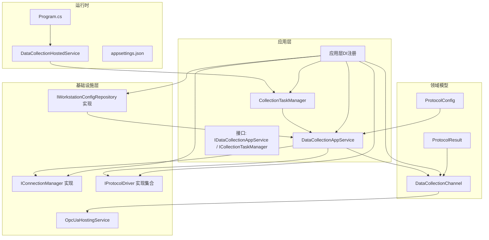
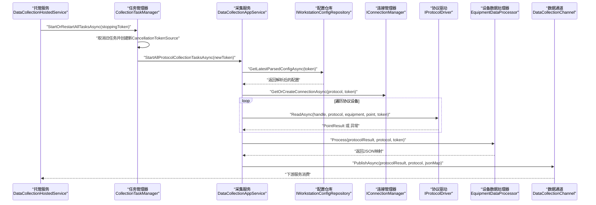
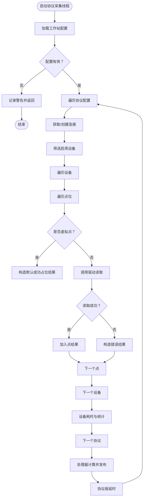
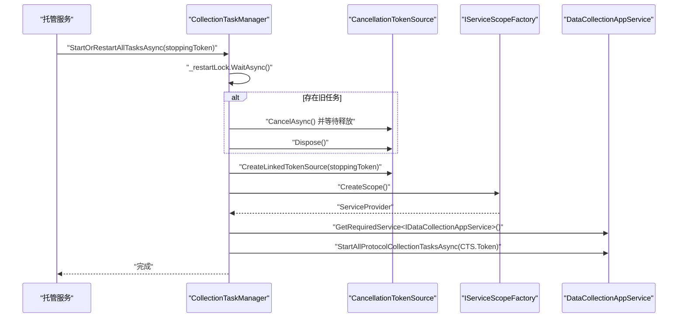
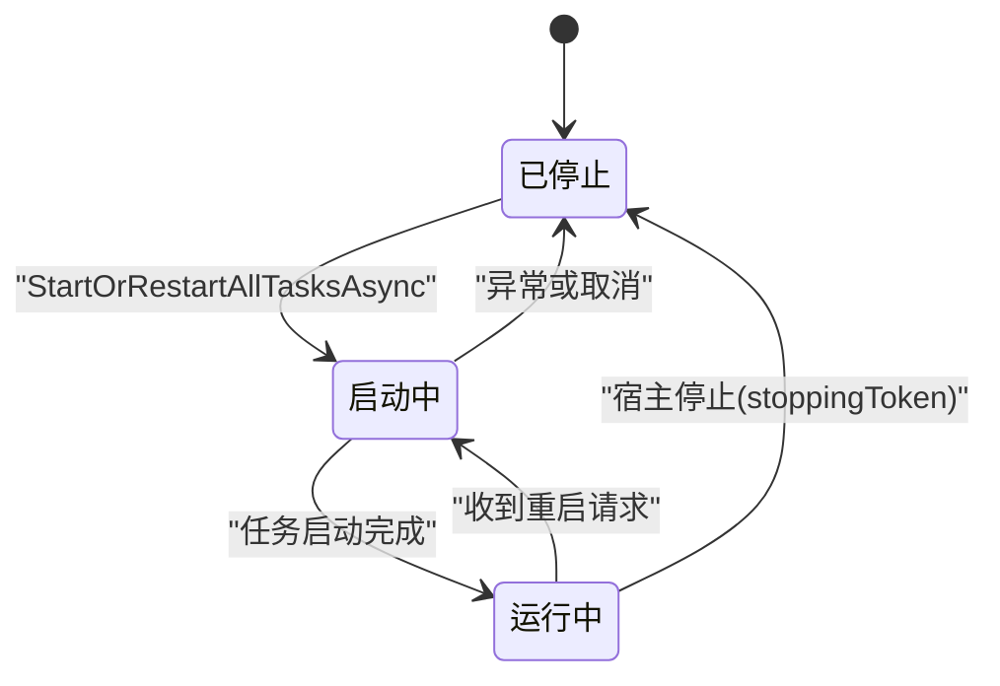
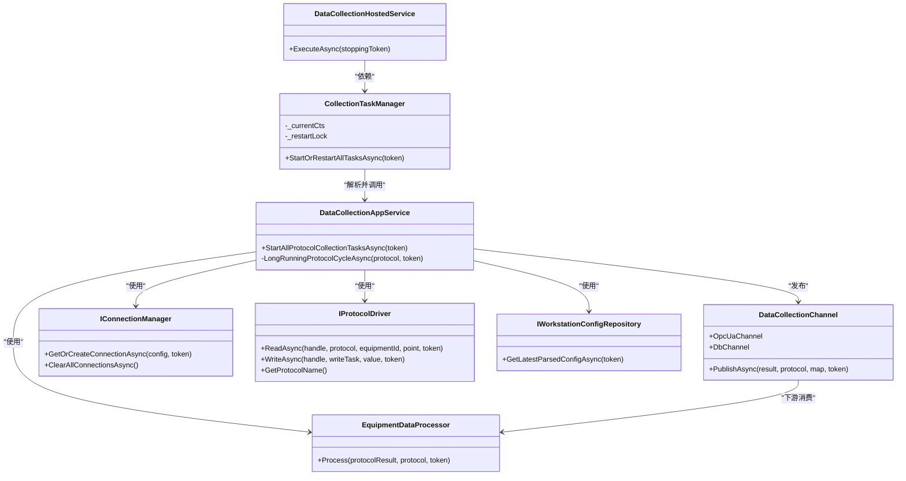

# 数据采集服务

<cite>
**本文引用的文件**
- [DataCollectionAppService.cs](file://IndustrialDataSolution/IndustrialDataProcessor.Application/Services/DataCollectionAppService.cs)
- [CollectionTaskManager.cs](file://IndustrialDataSolution/IndustrialDataProcessor.Application/Services/CollectionTaskManager.cs)
- [IDataCollectionAppService.cs](file://IndustrialDataSolution/IndustrialDataProcessor.Application/Services/IDataCollectionAppService.cs)
- [ICollectionTaskManager.cs](file://IndustrialDataSolution/IndustrialDataProcessor.Application/Services/ICollectionTaskManager.cs)
- [DependencyInjection.cs](file://IndustrialDataSolution/IndustrialDataProcessor.Application/DependencyInjection.cs)
- [ProtocolConfig.cs](file://IndustrialDataSolution/IndustrialDataProcessor.Domain/Workstation/Configs/ProtocolConfig.cs)
- [ProtocolResult.cs](file://IndustrialDataSolution/IndustrialDataProcessor.Domain/Workstation/Results/ProtocolResult.cs)
- [DataCollectionChannel.cs](file://IndustrialDataSolution/IndustrialDataProcessor.Domain/Workstation/Results/DataCollectionChannel.cs)
- [EquipmentDataProcessor.cs](file://IndustrialDataSolution/IndustrialDataProcessor.Infrastructure/EquipmentCollectionDataProcessing/EquipmentDataProcessor.cs)
- [IConnectionManager.cs](file://IndustrialDataSolution/IndustrialDataProcessor.Domain/Communication/IConnection/IConnectionManager.cs)
- [IProtocolDriver.cs](file://IndustrialDataSolution/IndustrialDataProcessor.Domain/Communication/IConnection/IProtocolDriver.cs)
- [DataCollectionHostedService.cs](file://IndustrialDataSolution/IndustrialDataProcessor.Api/BackgroundServices/DataCollectionHostedService.cs)
- [Program.cs](file://IndustrialDataSolution/IndustrialDataProcessor.Api/Program.cs)
- [appsettings.json](file://IndustrialDataSolution/IndustrialDataProcessor.Api/appsettings.json)
- [appsettings.Development.json](file://IndustrialDataSolution/IndustrialDataProcessor.Api/appsettings.Development.json)
- [OpcUaHostingService.cs](file://IndustrialDataSolution/IndustrialDataProcessor.Infrastructure/BackgroundServices/OpcUaHostingService.cs)
- [IWorkstationConfigRepository.cs](file://IndustrialDataSolution/IndustrialDataProcessor.Domain/Repositories/IWorkstationConfigRepository.cs)
- [WorkstationConfigRepository.cs](file://IndustrialDataSolution/IndustrialDataProcessor.Infrastructure/Persistence/Repositories/WorkstationConfigRepository.cs)
- [VirtualPointCalculator.cs](file://IndustrialDataSolution/IndustrialDataProcessor.Infrastructure/EquipmentCollectionDataProcessing/VirtualPointCalculator.cs)
- [PointExpressionConverter.cs](file://IndustrialDataSolution/IndustrialDataProcessor.Infrastructure/EquipmentCollectionDataProcessing/PointExpressionConverter.cs)
</cite>

## 目录
1. [简介](#简介)
2. [项目结构](#项目结构)
3. [核心组件](#核心组件)
4. [架构总览](#架构总览)
5. [详细组件分析](#详细组件分析)
6. [依赖分析](#依赖分析)
7. [性能考虑](#性能考虑)
8. [故障排查指南](#故障排查指南)
9. [结论](#结论)
10. [附录](#附录)

## 简介
本文件面向DDD工业数据处理解决方案中的"数据采集服务"，系统性阐述应用层服务DataCollectionAppService的设计与实现、任务管理器CollectionTaskManager的调度与并发控制机制、服务接口与依赖关系、采集生命周期管理（启动/停止/暂停/恢复）、配置选项与性能调优建议，并提供使用示例与集成指导，帮助开发者在应用中正确调用与扩展数据采集能力。

## 项目结构
数据采集服务位于应用层，围绕以下关键文件组织：
- 应用服务与任务管理：DataCollectionAppService、CollectionTaskManager、接口定义
- 结果通道与模型：DataCollectionChannel、ProtocolResult、ProtocolConfig
- 设备数据处理：EquipmentDataProcessor（公式转换、虚拟点计算、聚合状态）
- 通信抽象：IConnectionManager、IProtocolDriver
- 后台托管服务：DataCollectionHostedService（启动/停止生命周期）
- 依赖注入：Application层DI注册
- 运行入口：Program.cs注册后台服务
- 配置：appsettings.json

图表来源
- [Program.cs](file://IndustrialDataSolution/IndustrialDataProcessor.Api/Program.cs#L18-L25)
- [DataCollectionHostedService.cs](file://IndustrialDataSolution/IndustrialDataProcessor.Api/BackgroundServices/DataCollectionHostedService.cs#L15-L23)
- [DataCollectionAppService.cs](file://IndustrialDataSolution/IndustrialDataProcessor.Application/Services/DataCollectionAppService.cs)
- [CollectionTaskManager.cs](file://IndustrialDataSolution/IndustrialDataProcessor.Application/Services/CollectionTaskManager.cs)
- [DependencyInjection.cs](file://IndustrialDataSolution/IndustrialDataProcessor.Application/DependencyInjection.cs#L16-L26)
- [ProtocolConfig.cs](file://IndustrialDataSolution/IndustrialDataProcessor.Domain/Workstation/Configs/ProtocolConfig.cs#L8-L64)
- [ProtocolResult.cs](file://IndustrialDataSolution/IndustrialDataProcessor.Domain/Workstation/Results/ProtocolResult.cs#L5-L25)
- [DataCollectionChannel.cs](file://IndustrialDataSolution/IndustrialDataProcessor.Domain/Workstation/Results/DataCollectionChannel.cs#L10-L36)
- [OpcUaHostingService.cs](file://IndustrialDataSolution/IndustrialDataProcessor.Infrastructure/BackgroundServices/OpcUaHostingService.cs#L20-L27)
- [IWorkstationConfigRepository.cs](file://IndustrialDataSolution/IndustrialDataProcessor.Domain/Repositories/IWorkstationConfigRepository.cs#L1-L11)
- [WorkstationConfigRepository.cs](file://IndustrialDataSolution/IndustrialDataProcessor.Infrastructure/Persistence/Repositories/WorkstationConfigRepository.cs#L1-L37)

章节来源
- [Program.cs](file://IndustrialDataSolution/IndustrialDataProcessor.Api/Program.cs#L18-L25)
- [DependencyInjection.cs](file://IndustrialDataSolution/IndustrialDataProcessor.Application/DependencyInjection.cs#L16-L26)

## 核心组件
- DataCollectionAppService：应用层采集协调器，负责按协议启动独立后台循环，统一连接管理、逐点采集、异常隔离、结果聚合与通道发布。
- CollectionTaskManager：任务生命周期管理器，负责启动/重启采集任务，安全取消旧任务，生成新的CancellationTokenSource并注入子任务。
- DataCollectionChannel：进程内无界通道，实现采集结果向OPC UA与数据库后台服务的扇出（fan-out）。
- EquipmentDataProcessor：设备级数据处理，负责公式转换、虚拟点计算、最终聚合状态统计。
- IConnectionManager/IProtocolDriver：通信抽象，屏蔽不同协议驱动差异。
- DataCollectionHostedService：API层后台托管服务，作为采集生命周期的入口与守护者。
- IWorkstationConfigRepository：工作站配置存储接口，提供获取并解析最新配置的能力。

章节来源
- [DataCollectionAppService.cs](file://IndustrialDataSolution/IndustrialDataProcessor.Application/Services/DataCollectionAppService.cs)
- [CollectionTaskManager.cs](file://IndustrialDataSolution/IndustrialDataProcessor.Application/Services/CollectionTaskManager.cs)
- [DataCollectionChannel.cs](file://IndustrialDataSolution/IndustrialDataProcessor.Domain/Workstation/Results/DataCollectionChannel.cs#L10-L36)
- [EquipmentDataProcessor.cs](file://IndustrialDataSolution/IndustrialDataProcessor.Infrastructure/EquipmentCollectionDataProcessing/EquipmentDataProcessor.cs#L9-L19)
- [IConnectionManager.cs](file://IndustrialDataSolution/IndustrialDataProcessor.Domain/Communication/IConnection/IConnectionManager.cs#L5-L18)
- [IProtocolDriver.cs](file://IndustrialDataSolution/IndustrialDataProcessor.Domain/Communication/IConnection/IProtocolDriver.cs#L7-L13)
- [DataCollectionHostedService.cs](file://IndustrialDataSolution/IndustrialDataProcessor.Api/BackgroundServices/DataCollectionHostedService.cs#L8-L13)
- [IWorkstationConfigRepository.cs](file://IndustrialDataSolution/IndustrialDataProcessor.Domain/Repositories/IWorkstationConfigRepository.cs#L1-L11)

## 架构总览
数据采集采用"协议级独立线程 + 设备级顺序遍历 + 点级异步读取"的流水线式架构。每个协议拥有独立的后台循环，彼此互不阻塞；每个循环内按设备顺序读取点位，异常被捕获并隔离，最终将协议级结果与JSON映射通过通道扇出至下游消费者（如OPC UA服务）。

图表来源
- [DataCollectionHostedService.cs](file://IndustrialDataSolution/IndustrialDataProcessor.Api/BackgroundServices/DataCollectionHostedService.cs#L15-L23)
- [CollectionTaskManager.cs](file://IndustrialDataSolution/IndustrialDataProcessor.Application/Services/CollectionTaskManager.cs#L19-L51)
- [DataCollectionAppService.cs](file://IndustrialDataSolution/IndustrialDataProcessor.Application/Services/DataCollectionAppService.cs)
- [IWorkstationConfigRepository.cs](file://IndustrialDataSolution/IndustrialDataProcessor.Domain/Repositories/IWorkstationConfigRepository.cs#L8-L11)
- [IConnectionManager.cs](file://IndustrialDataSolution/IndustrialDataProcessor.Domain/Communication/IConnection/IConnectionManager.cs#L10-L12)
- [IProtocolDriver.cs](file://IndustrialDataSolution/IndustrialDataProcessor.Domain/Communication/IConnection/IProtocolDriver.cs#L9-L12)
- [EquipmentDataProcessor.cs](file://IndustrialDataSolution/IndustrialDataProcessor.Infrastructure/EquipmentCollectionDataProcessing/EquipmentDataProcessor.cs#L21-L47)
- [DataCollectionChannel.cs](file://IndustrialDataSolution/IndustrialDataProcessor.Domain/Workstation/Results/DataCollectionChannel.cs#L29-L35)

## 详细组件分析

### DataCollectionAppService 设计与实现
- 职责边界
  - 加载工作站配置并启动每个协议的独立采集线程。
  - 统一连接管理与复用，按协议延时控制循环节奏。
  - 逐点采集，隔离异常，聚合设备/协议级状态。
  - 将协议结果与JSON映射通过通道扇出。
- 关键流程
  - 启动：获取最新配置，针对每个启用的协议创建后台循环。
  - 循环：获取连接、遍历启用设备、逐点读取、异常捕获、耗时统计、结果聚合。
  - 处理：调用设备数据处理器进行公式转换与虚拟点计算，产出JSON映射。
  - 发布：将结果与映射同时发送至OPC UA与数据库通道。
  - 延迟：协议级独立延时，互不影响。
- 错误处理
  - 单点异常不传播至协议线程；协议级异常标记失败并记录日志，等待下次重试。
  - 连接异常在协议层收敛，避免影响其他协议。
- 性能要点
  - 使用线程池后台循环，互不阻塞。
  - 仅在必要处进行序列化与扇出，减少开销。
  - 协议级延时最小化为1ms，防止CPU空转。

**更新** 增强了 GetLatestParsedConfigAsync 调用的跟踪能力，通过日志记录配置获取过程的关键节点，包括配置不存在时的警告信息，提升了配置加载的可观测性。

图表来源
- [DataCollectionAppService.cs](file://IndustrialDataSolution/IndustrialDataProcessor.Application/Services/DataCollectionAppService.cs)
- [EquipmentDataProcessor.cs](file://IndustrialDataSolution/IndustrialDataProcessor.Infrastructure/EquipmentCollectionDataProcessing/EquipmentDataProcessor.cs#L21-L47)

章节来源
- [DataCollectionAppService.cs](file://IndustrialDataSolution/IndustrialDataProcessor.Application/Services/DataCollectionAppService.cs)

### CollectionTaskManager 任务管理
- 职责边界
  - 提供启动/重启采集任务的统一入口。
  - 保证重启过程的原子性与幂等性，避免并发冲突。
  - 安全取消旧任务并释放资源，再启动新任务。
- 关键机制
  - 使用信号量保护重启操作，避免并发重启。
  - 使用链接的CancellationTokenSource，将宿主停止信号与任务取消关联。
  - 通过IServiceScopeFactory解析作用域内服务，满足Scoped依赖（如仓储）。
- 生命周期
  - 启动：接收宿主停止Token，创建新CancellationTokenSource，解析AppService并启动后台线程。
  - 重启：若已有任务运行则取消并等待资源释放，再重复启动流程。
  - 停止：宿主停止时，所有任务随Token取消而优雅退出。

图表来源
- [CollectionTaskManager.cs](file://IndustrialDataSolution/IndustrialDataProcessor.Application/Services/CollectionTaskManager.cs#L19-L59)
- [DataCollectionAppService.cs](file://IndustrialDataSolution/IndustrialDataProcessor.Application/Services/DataCollectionAppService.cs)

章节来源
- [CollectionTaskManager.cs](file://IndustrialDataSolution/IndustrialDataProcessor.Application/Services/CollectionTaskManager.cs#L6-L61)

### 服务接口与实现策略
- 接口定义
  - IDataCollectionAppService：对外暴露"启动所有协议采集任务"的能力。
  - ICollectionTaskManager：对外暴露"启动/重启所有任务"的能力。
- 实现策略
  - 应用服务以协议为单位创建独立后台循环，互不阻塞。
  - 通过IConnectionManager统一管理连接，支持自动重连与复用。
  - 通过IProtocolDriver抽象不同协议驱动，实现多协议兼容。
  - 通过DataCollectionChannel实现结果的扇出，解耦下游消费者。

章节来源
- [IDataCollectionAppService.cs](file://IndustrialDataSolution/IndustrialDataProcessor.Application/Services/IDataCollectionAppService.cs#L6-L12)
- [ICollectionTaskManager.cs](file://IndustrialDataSolution/IndustrialDataProcessor.Application/Services/ICollectionTaskManager.cs#L3-L6)
- [DependencyInjection.cs](file://IndustrialDataSolution/IndustrialDataProcessor.Application/DependencyInjection.cs#L22-L26)

### 数据采集生命周期管理
- 启动
  - 程序启动时注册托管服务，ExecuteAsync中调用任务管理器启动采集。
- 停止
  - 宿主停止时，stoppingToken传播至任务管理器与应用服务，所有协议线程收到取消信号并优雅退出。
- 暂停/恢复
  - 通过取消/重启任务实现暂停与恢复；当前实现以"取消旧任务并启动新任务"方式实现"恢复"。
- 重启
  - 任务管理器内部保证重启的原子性与资源释放，避免连接泄漏。

图表来源
- [DataCollectionHostedService.cs](file://IndustrialDataSolution/IndustrialDataProcessor.Api/BackgroundServices/DataCollectionHostedService.cs#L15-L23)
- [CollectionTaskManager.cs](file://IndustrialDataSolution/IndustrialDataProcessor.Application/Services/CollectionTaskManager.cs#L19-L59)

章节来源
- [DataCollectionHostedService.cs](file://IndustrialDataSolution/IndustrialDataProcessor.Api/BackgroundServices/DataCollectionHostedService.cs#L8-L27)
- [CollectionTaskManager.cs](file://IndustrialDataSolution/IndustrialDataProcessor.Application/Services/CollectionTaskManager.cs#L19-L59)

### 数据采集的生命周期管理（启动/停止/暂停/恢复）
- 启动：托管服务在ExecuteAsync中调用任务管理器，任务管理器解析应用服务并启动所有协议的后台线程。
- 停止：宿主停止时，stoppingToken传播至任务管理器与应用服务，所有协议线程收到取消信号并退出。
- 暂停/恢复：通过取消旧任务并启动新任务实现；当前实现以"重启"达到"恢复"效果。
- 通道消费：采集结果通过DataCollectionChannel扇出至OPC UA与数据库后台服务，各自独立消费。

章节来源
- [DataCollectionHostedService.cs](file://IndustrialDataSolution/IndustrialDataProcessor.Api/BackgroundServices/DataCollectionHostedService.cs#L15-L23)
- [DataCollectionChannel.cs](file://IndustrialDataSolution/IndustrialDataProcessor.Domain/Workstation/Results/DataCollectionChannel.cs#L22-L35)
- [OpcUaHostingService.cs](file://IndustrialDataSolution/IndustrialDataProcessor.Infrastructure/BackgroundServices/OpcUaHostingService.cs#L20-L27)

### 配置选项与性能调优建议
- 协议配置
  - 通讯延时（CommunicationDelay）：默认1000ms，建议根据设备响应特性调整，最小不低于1ms以避免CPU空转。
  - 接收/连接超时（ReceiveTimeOut、ConnectTimeOut）：建议结合网络环境与设备能力设置，避免过短导致频繁失败。
- 应用层调优
  - 任务并发：协议级独立线程，互不阻塞；可根据CPU核数与设备数量平衡协议数量。
  - 连接复用：IConnectionManager应实现连接复用与自动重连，降低握手成本。
  - 异常隔离：单点异常不传播至协议线程，避免连锁反应。
- 通道与序列化
  - 通道采用无界通道，建议在下游消费者侧增加背压或限流，避免内存膨胀。
  - JSON序列化在设备级完成，建议保持字段精简，避免大对象传输。
- 运行时配置
  - appsettings.json中可配置数据库连接串与授权码，确保HSL通信授权通过。

章节来源
- [ProtocolConfig.cs](file://IndustrialDataSolution/IndustrialDataProcessor.Domain/Workstation/Configs/ProtocolConfig.cs#L25-L38)
- [DataCollectionAppService.cs](file://IndustrialDataSolution/IndustrialDataProcessor.Application/Services/DataCollectionAppService.cs)
- [appsettings.json](file://IndustrialDataSolution/IndustrialDataProcessor.Api/appsettings.json#L10-L15)
- [DependencyInjection.cs](file://IndustrialDataSolution/IndustrialDataProcessor.Infrastructure/DependencyInjection.cs#L26-L28)

### 使用示例与集成指导
- 在应用启动时注册后台托管服务与应用层服务
  - 在Program.cs中注册应用层、基础设施层与后台托管服务。
  - 程序启动后，托管服务将自动调用任务管理器启动采集。
- 在控制器或事件处理器中触发重启
  - 通过注入ICollectionTaskManager调用StartOrRestartAllTasksAsync，传入宿主停止Token，实现重启。
- 下游消费采集结果
  - OPC UA与数据库后台服务分别订阅DataCollectionChannel的Reader，实现解耦消费。
- 集成注意事项
  - 确保IConnectionManager与IProtocolDriver实现正确注册，以便应用服务解析。
  - 设备数据处理器依赖的表达式转换器与虚拟点计算器需正确初始化。

章节来源
- [Program.cs](file://IndustrialDataSolution/IndustrialDataProcessor.Api/Program.cs#L18-L25)
- [DependencyInjection.cs](file://IndustrialDataSolution/IndustrialDataProcessor.Application/DependencyInjection.cs#L22-L26)
- [DataCollectionChannel.cs](file://IndustrialDataSolution/IndustrialDataProcessor.Domain/Workstation/Results/DataCollectionChannel.cs#L22-L24)
- [OpcUaHostingService.cs](file://IndustrialDataSolution/IndustrialDataProcessor.Infrastructure/BackgroundServices/OpcUaHostingService.cs#L20-L27)

## 依赖分析
- 组件耦合
  - DataCollectionAppService依赖IConnectionManager、IProtocolDriver、IEquipmentDataProcessor、DataCollectionChannel与仓储接口。
  - CollectionTaskManager依赖IServiceScopeFactory与ILogger，通过解析作用域内的IDataCollectionAppService实现任务启动。
  - DataCollectionChannel作为共享单例，被应用服务与基础设施层消费者共同依赖。
- 外部依赖
  - IConnectionManager与IProtocolDriver为抽象接口，便于替换与扩展。
  - 设备数据处理器依赖表达式转换器与虚拟点计算器，负责公式与虚拟点的计算与聚合。

图表来源
- [DataCollectionAppService.cs](file://IndustrialDataSolution/IndustrialDataProcessor.Application/Services/DataCollectionAppService.cs)
- [CollectionTaskManager.cs](file://IndustrialDataSolution/IndustrialDataProcessor.Application/Services/CollectionTaskManager.cs#L6-L17)
- [DataCollectionChannel.cs](file://IndustrialDataSolution/IndustrialDataProcessor.Domain/Workstation/Results/DataCollectionChannel.cs#L10-L36)
- [EquipmentDataProcessor.cs](file://IndustrialDataSolution/IndustrialDataProcessor.Infrastructure/EquipmentCollectionDataProcessing/EquipmentDataProcessor.cs#L9-L19)
- [IConnectionManager.cs](file://IndustrialDataSolution/IndustrialDataProcessor.Domain/Communication/IConnection/IConnectionManager.cs#L5-L18)
- [IProtocolDriver.cs](file://IndustrialDataSolution/IndustrialDataProcessor.Domain/Communication/IConnection/IProtocolDriver.cs#L7-L13)
- [DataCollectionHostedService.cs](file://IndustrialDataSolution/IndustrialDataProcessor.Api/BackgroundServices/DataCollectionHostedService.cs#L8-L13)
- [IWorkstationConfigRepository.cs](file://IndustrialDataSolution/IndustrialDataProcessor.Domain/Repositories/IWorkstationConfigRepository.cs#L1-L11)

章节来源
- [DataCollectionAppService.cs](file://IndustrialDataSolution/IndustrialDataProcessor.Application/Services/DataCollectionAppService.cs)
- [CollectionTaskManager.cs](file://IndustrialDataSolution/IndustrialDataProcessor.Application/Services/CollectionTaskManager.cs#L6-L17)
- [DataCollectionChannel.cs](file://IndustrialDataSolution/IndustrialDataProcessor.Domain/Workstation/Results/DataCollectionChannel.cs#L10-L36)
- [EquipmentDataProcessor.cs](file://IndustrialDataSolution/IndustrialDataProcessor.Infrastructure/EquipmentCollectionDataProcessing/EquipmentDataProcessor.cs#L9-L19)
- [IConnectionManager.cs](file://IndustrialDataSolution/IndustrialDataProcessor.Domain/Communication/IConnection/IConnectionManager.cs#L5-L18)
- [IProtocolDriver.cs](file://IndustrialDataSolution/IndustrialDataProcessor.Domain/Communication/IConnection/IProtocolDriver.cs#L7-L13)
- [DataCollectionHostedService.cs](file://IndustrialDataSolution/IndustrialDataProcessor.Api/BackgroundServices/DataCollectionHostedService.cs#L8-L13)
- [IWorkstationConfigRepository.cs](file://IndustrialDataSolution/IndustrialDataProcessor.Domain/Repositories/IWorkstationConfigRepository.cs#L1-L11)

## 性能考虑
- 协议级并发：每个协议独立线程，互不影响，适合多协议并行采集。
- 连接复用：IConnectionManager应实现连接池与自动重连，减少握手与重连开销。
- 延时控制：协议级延时最小为1ms，避免CPU空转；根据设备响应时间合理设置。
- 异常隔离：单点异常不传播，协议级异常收敛，降低整体失败率。
- 通道吞吐：无界通道可能造成内存压力，建议在下游消费者侧增加背压或限流。
- 序列化优化：设备级JSON序列化，建议字段精简，避免大对象传输。

## 故障排查指南
- 未找到工作站配置
  - 现象：启动采集时记录警告并返回。
  - 排查：确认配置仓库可正确解析最新配置。
- 协议驱动缺失
  - 现象：找不到对应协议驱动，协议线程终止。
  - 排查：确认IProtocolDriver实现已注册，协议名称匹配。
- 连接异常
  - 现象：协议级异常标记失败，记录错误并等待重试。
  - 排查：检查IConnectionManager实现与网络/设备状态。
- 写入通道失败
  - 现象：发布结果时记录错误日志。
  - 排查：检查通道消费者是否正常运行，通道是否被阻塞。
- 重启冲突
  - 现象：并发重启导致资源竞争。
  - 排查：确认任务管理器的重启锁与取消逻辑正常工作。

章节来源
- [DataCollectionAppService.cs](file://IndustrialDataSolution/IndustrialDataProcessor.Application/Services/DataCollectionAppService.cs)
- [CollectionTaskManager.cs](file://IndustrialDataSolution/IndustrialDataProcessor.Application/Services/CollectionTaskManager.cs#L25-L58)

## 结论
数据采集服务通过协议级独立线程、连接复用与异常隔离，实现了高并发、低耦合、可扩展的工业数据采集能力。配合任务管理器的重启与取消机制、设备数据处理器的公式与虚拟点计算、以及通道的扇出设计，形成了完整的采集-处理-分发闭环。在生产环境中，建议结合设备特性合理配置延时与超时参数，并在下游消费者侧做好背压与限流，以获得最佳性能与稳定性。

## 附录
- 关键接口与类路径参考
  - [IDataCollectionAppService](file://IndustrialDataSolution/IndustrialDataProcessor.Application/Services/IDataCollectionAppService.cs#L6-L12)
  - [ICollectionTaskManager](file://IndustrialDataSolution/IndustrialDataProcessor.Application/Services/ICollectionTaskManager.cs#L3-L6)
  - [DataCollectionAppService](file://IndustrialDataSolution/IndustrialDataProcessor.Application/Services/DataCollectionAppService.cs)
  - [CollectionTaskManager](file://IndustrialDataSolution/IndustrialDataProcessor.Application/Services/CollectionTaskManager.cs#L6-L17)
  - [DataCollectionChannel](file://IndustrialDataSolution/IndustrialDataProcessor.Domain/Workstation/Results/DataCollectionChannel.cs#L10-L36)
  - [EquipmentDataProcessor](file://IndustrialDataSolution/IndustrialDataProcessor.Infrastructure/EquipmentCollectionDataProcessing/EquipmentDataProcessor.cs#L9-L19)
  - [IConnectionManager](file://IndustrialDataSolution/IndustrialDataProcessor.Domain/Communication/IConnection/IConnectionManager.cs#L5-L18)
  - [IProtocolDriver](file://IndustrialDataSolution/IndustrialDataProcessor.Domain/Communication/IConnection/IProtocolDriver.cs#L7-L13)
  - [DataCollectionHostedService](file://IndustrialDataSolution/IndustrialDataProcessor.Api/BackgroundServices/DataCollectionHostedService.cs#L8-L13)
  - [Program.cs](file://IndustrialDataSolution/IndustrialDataProcessor.Api/Program.cs#L18-L25)
  - [appsettings.json](file://IndustrialDataSolution/IndustrialDataProcessor.Api/appsettings.json#L10-L15)
  - [appsettings.Development.json](file://IndustrialDataSolution/IndustrialDataProcessor.Api/appsettings.Development.json#L1-L9)
  - [IWorkstationConfigRepository](file://IndustrialDataSolution/IndustrialDataProcessor.Domain/Repositories/IWorkstationConfigRepository.cs#L1-L11)
  - [WorkstationConfigRepository](file://IndustrialDataSolution/IndustrialDataProcessor.Infrastructure/Persistence/Repositories/WorkstationConfigRepository.cs#L1-L37)