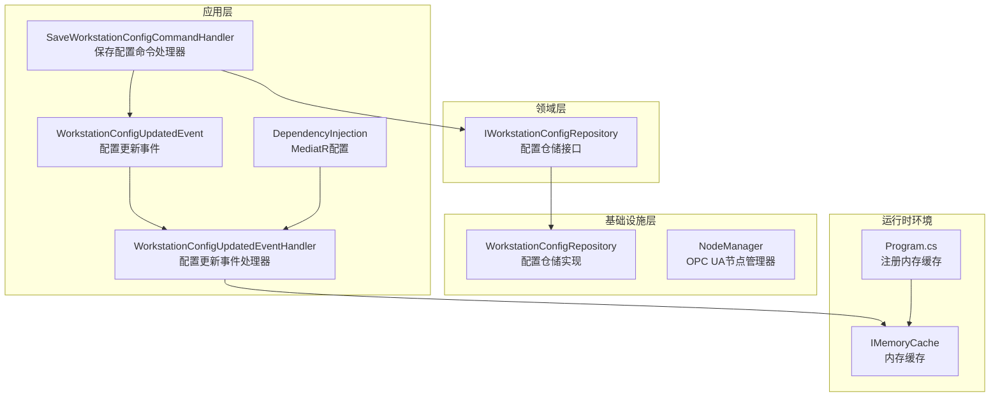
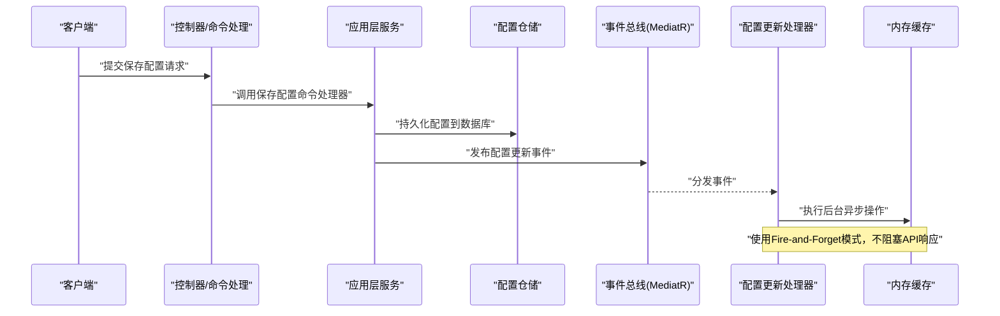
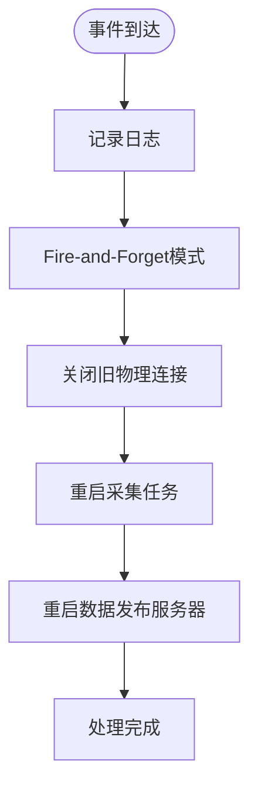
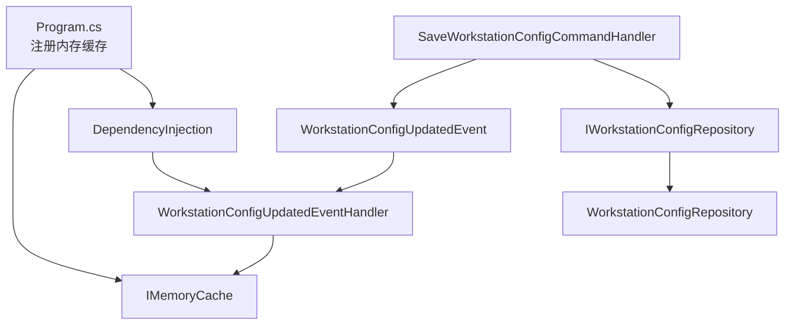

# 缓存管理

<cite>
**本文档引用的文件**
- [Program.cs](file://IndustrialDataSolution/IndustrialDataProcessor.Api/Program.cs)
- [WorkstationConfigUpdatedEvent.cs](file://IndustrialDataSolution/IndustrialDataProcessor.Application/Features/WorkstationConfigUpdatedEvent.cs)
- [SaveWorkstationConfigCommand.cs](file://IndustrialDataSolution/IndustrialDataProcessor.Application/Features/SaveWorkstationConfigCommand.cs)
- [DependencyInjection.cs](file://IndustrialDataSolution/IndustrialDataProcessor.Application/DependencyInjection.cs)
- [NodeManager.cs](file://IndustrialDataSolution/IndustrialDataProcessor.Infrastructure/OpcUa/NodeManager.cs)
- [DataCollectionHostedService.cs](file://IndustrialDataSolution/IndustrialDataProcessor.Api/BackgroundServices/DataCollectionHostedService.cs)
- [appsettings.json](file://IndustrialDataSolution/IndustrialDataProcessor.Api/appsettings.json)
</cite>

## 更新摘要
**所做更改**
- 移除了关于CacheKeys常量文件的相关内容，因为该文件已被删除
- 更新了架构概览，反映从集中式缓存键管理向事件驱动架构的转变
- 重构了缓存清理机制的描述，强调事件处理器的Fire-and-Forget模式
- 新增了OPC UA节点管理器中的缓存键使用示例
- 更新了依赖关系分析，移除了缓存键常量的依赖

## 目录
1. [简介](#简介)
2. [项目结构](#项目结构)
3. [核心组件](#核心组件)
4. [架构概览](#架构概览)
5. [详细组件分析](#详细组件分析)
6. [依赖关系分析](#依赖关系分析)
7. [性能考虑](#性能考虑)
8. [故障排除指南](#故障排除指南)
9. [结论](#结论)

## 简介
本文件针对DDD工业数据处理解决方案中的缓存管理机制进行全面技术文档化，重点覆盖以下方面：
- 缓存策略设计与实现：包括配置缓存与数据缓存的管理机制
- 事件驱动的缓存清理机制：WorkstationConfigUpdatedEvent的触发条件与清理逻辑
- 缓存生命周期管理：创建、更新、失效与销毁
- 性能优化策略：命中率提升、内存管理与并发控制
- 最佳实践与故障排除指导

**更新** 移除了对CacheKeys常量文件的依赖，反映了架构向事件驱动的转变

## 项目结构
本项目的缓存管理涉及三层职责分离：
- 应用层：定义事件处理器、命令处理器、MediatR配置
- 领域层：定义仓储接口，提供获取最新配置的能力
- 基础设施层：实现仓储，负责JSON序列化与反序列化

**图表来源**
- [Program.cs](file://IndustrialDataSolution/IndustrialDataProcessor.Api/Program.cs#L14-L15)
- [WorkstationConfigUpdatedEvent.cs](file://IndustrialDataSolution/IndustrialDataProcessor.Application/Features/WorkstationConfigUpdatedEvent.cs#L12-L15)
- [WorkstationConfigUpdatedEvent.cs](file://IndustrialDataSolution/IndustrialDataProcessor.Application/Features/WorkstationConfigUpdatedEvent.cs#L25-L77)
- [SaveWorkstationConfigCommand.cs](file://IndustrialDataSolution/IndustrialDataProcessor.Application/Features/SaveWorkstationConfigCommand.cs#L19-L41)
- [DependencyInjection.cs](file://IndustrialDataSolution/IndustrialDataProcessor.Application/DependencyInjection.cs#L28-L37)
- [NodeManager.cs](file://IndustrialDataSolution/IndustrialDataProcessor.Infrastructure/OpcUa/NodeManager.cs#L10-L35)

**章节来源**
- [Program.cs](file://IndustrialDataSolution/IndustrialDataProcessor.Api/Program.cs#L14-L15)
- [WorkstationConfigUpdatedEvent.cs](file://IndustrialDataSolution/IndustrialDataProcessor.Application/Features/WorkstationConfigUpdatedEvent.cs#L12-L15)
- [WorkstationConfigUpdatedEvent.cs](file://IndustrialDataSolution/IndustrialDataProcessor.Application/Features/WorkstationConfigUpdatedEvent.cs#L25-L77)
- [SaveWorkstationConfigCommand.cs](file://IndustrialDataSolution/IndustrialDataProcessor.Application/Features/SaveWorkstationConfigCommand.cs#L19-L41)
- [DependencyInjection.cs](file://IndustrialDataSolution/IndustrialDataProcessor.Application/DependencyInjection.cs#L28-L37)
- [NodeManager.cs](file://IndustrialDataSolution/IndustrialDataProcessor.Infrastructure/OpcUa/NodeManager.cs#L10-L35)

## 核心组件
本节聚焦于缓存管理的关键组件及其职责：
- 内存缓存注册：在应用启动时注册内存缓存服务
- 配置更新事件：发布配置变更事件以触发缓存清理
- 清理事件处理器：监听事件并执行后台异步操作，包括连接管理、任务重启和服务器管理
- 配置仓储：提供获取最新配置的能力，供业务流程使用
- OPC UA节点缓存：在NodeManager中使用字典缓存节点信息

**更新** 移除了缓存键常量的依赖，事件处理器现在采用Fire-and-Forget模式

**章节来源**
- [Program.cs](file://IndustrialDataSolution/IndustrialDataProcessor.Api/Program.cs#L14-L15)
- [WorkstationConfigUpdatedEvent.cs](file://IndustrialDataSolution/IndustrialDataProcessor.Application/Features/WorkstationConfigUpdatedEvent.cs#L12-L15)
- [WorkstationConfigUpdatedEvent.cs](file://IndustrialDataSolution/IndustrialDataProcessor.Application/Features/WorkstationConfigUpdatedEvent.cs#L25-L77)
- [IWorkstationConfigRepository.cs](file://IndustrialDataSolution/IndustrialDataProcessor.Domain/Repositories/IWorkstationConfigRepository.cs#L10)
- [NodeManager.cs](file://IndustrialDataSolution/IndustrialDataProcessor.Infrastructure/OpcUa/NodeManager.cs#L15-L17)

## 架构概览
缓存管理采用事件驱动的清理机制，结合内存缓存实现配置的快速访问与一致性保障。架构已从集中式缓存键管理转变为事件驱动的异步处理模式。

**图表来源**
- [SaveWorkstationConfigCommand.cs](file://IndustrialDataSolution/IndustrialDataProcessor.Application/Features/SaveWorkstationConfigCommand.cs#L28-L40)
- [WorkstationConfigUpdatedEvent.cs](file://IndustrialDataSolution/IndustrialDataProcessor.Application/Features/WorkstationConfigUpdatedEvent.cs#L12-L15)
- [WorkstationConfigUpdatedEvent.cs](file://IndustrialDataSolution/IndustrialDataProcessor.Application/Features/WorkstationConfigUpdatedEvent.cs#L36-L77)

## 详细组件分析

### 内存缓存注册（Program.cs）
- 注册时机：在应用启动时通过AddMemoryCache注册内存缓存服务
- 服务生命周期：默认注册为Singleton，适合进程内缓存场景
- 配置建议：生产环境可结合应用配置调整缓存行为（如过期策略），但当前代码未显式设置

**章节来源**
- [Program.cs](file://IndustrialDataSolution/IndustrialDataProcessor.Api/Program.cs#L14-L15)

### 配置更新事件（WorkstationConfigUpdatedEvent）
- 事件定义：轻量事件，包含UpdatedTime属性，用于记录事件触发时间
- 触发条件：在保存配置命令处理完成后发布，确保数据持久化后再触发事件
- 事件传播：通过MediatR进行事件分发，遵循应用层解耦原则

**章节来源**
- [WorkstationConfigUpdatedEvent.cs](file://IndustrialDataSolution/IndustrialDataProcessor.Application/Features/WorkstationConfigUpdatedEvent.cs#L12-L15)
- [SaveWorkstationConfigCommand.cs](file://IndustrialDataSolution/IndustrialDataProcessor.Application/Features/SaveWorkstationConfigCommand.cs#L38-L40)

### 配置更新事件处理器（WorkstationConfigUpdatedEventHandler）
- 触发条件：接收WorkstationConfigUpdatedEvent后执行
- 处理模式：采用Fire-and-Forget模式，立即返回不阻塞API响应
- 处理逻辑：后台异步执行耗时操作，包括连接管理、任务重启和服务器管理
- 错误处理：包含完整的异常捕获和日志记录机制
- 处理器职责：保持单一职责，专注配置更新后的系统重组

**图表来源**
- [WorkstationConfigUpdatedEvent.cs](file://IndustrialDataSolution/IndustrialDataProcessor.Application/Features/WorkstationConfigUpdatedEvent.cs#L36-L77)

**章节来源**
- [WorkstationConfigUpdatedEvent.cs](file://IndustrialDataSolution/IndustrialDataProcessor.Application/Features/WorkstationConfigUpdatedEvent.cs#L25-L77)

### MediatR配置与事件处理（DependencyInjection.cs）
- MediatR注册：明确指定只扫描Application程序集，避免重复注册
- 全局验证拦截：加入全局验证拦截器，确保事件处理前的数据验证
- 事件处理器注册：通过程序集扫描自动注册事件处理器

**章节来源**
- [DependencyInjection.cs](file://IndustrialDataSolution/IndustrialDataProcessor.Application/DependencyInjection.cs#L28-L37)

### 配置仓储与缓存交互（IWorkstationConfigRepository/WorkstationConfigRepository）
- 仓储职责：提供GetLatestParsedConfigAsync方法，返回最新配置对象
- 数据来源：从数据库实体反序列化为领域模型，包含协议配置等复杂结构
- 与缓存的关系：当前实现未直接使用内存缓存，但事件驱动机制确保后续读取获取最新配置

**章节来源**
- [IWorkstationConfigRepository.cs](file://IndustrialDataSolution/IndustrialDataProcessor.Domain/Repositories/IWorkstationConfigRepository.cs#L10)
- [WorkstationConfigRepository.cs](file://IndustrialDataSolution/IndustrialDataProcessor.Infrastructure/Repositories/WorkstationConfigRepository.cs#L23-L42)

### OPC UA节点缓存（NodeManager）
- 缓存机制：使用Dictionary缓存节点信息，键为"EquipmentId_Label"格式
- 缓存内容：存储BaseDataVariableState和DataType信息，支持快速节点查找
- 缓存用途：在数据更新时快速定位节点并更新值和状态
- 反向映射：使用ConcurrentDictionary建立节点ID到路由配置的反向映射

**更新** 新增了OPC UA节点管理器中的缓存实现示例

**章节来源**
- [NodeManager.cs](file://IndustrialDataSolution/IndustrialDataProcessor.Infrastructure/OpcUa/NodeManager.cs#L15-L17)
- [NodeManager.cs](file://IndustrialDataSolution/IndustrialDataProcessor.Infrastructure/OpcUa/NodeManager.cs#L63-L71)
- [NodeManager.cs](file://IndustrialDataSolution/IndustrialDataProcessor.Infrastructure/OpcUa/NodeManager.cs#L109-L111)
- [NodeManager.cs](file://IndustrialDataSolution/IndustrialDataProcessor.Infrastructure/OpcUa/NodeManager.cs#L156-L161)

### 数据采集服务与缓存（DataCollectionHostedService）
- 服务职责：启动并管理各协议的采集任务，按配置周期执行读取与处理
- 配置来源：通过仓储获取最新配置，若无配置则跳过启动
- 缓存关系：当前实现未直接使用内存缓存，但事件驱动机制确保配置变更后尽快生效

**章节来源**
- [DataCollectionHostedService.cs](file://IndustrialDataSolution/IndustrialDataProcessor.Api/BackgroundServices/DataCollectionHostedService.cs)

## 依赖关系分析
缓存管理的依赖关系已从集中式缓存键管理转变为事件驱动架构：

**更新** 移除了CacheKeys常量的依赖关系，事件处理器现在直接处理系统重组任务

**图表来源**
- [Program.cs](file://IndustrialDataSolution/IndustrialDataProcessor.Api/Program.cs#L14-L15)
- [SaveWorkstationConfigCommand.cs](file://IndustrialDataSolution/IndustrialDataProcessor.Application/Features/SaveWorkstationConfigCommand.cs#L28-L40)
- [WorkstationConfigUpdatedEvent.cs](file://IndustrialDataSolution/IndustrialDataProcessor.Application/Features/WorkstationConfigUpdatedEvent.cs#L12-L15)
- [WorkstationConfigUpdatedEvent.cs](file://IndustrialDataSolution/IndustrialDataProcessor.Application/Features/WorkstationConfigUpdatedEvent.cs#L25-L77)
- [DependencyInjection.cs](file://IndustrialDataSolution/IndustrialDataProcessor.Application/DependencyInjection.cs#L28-L37)

**章节来源**
- [Program.cs](file://IndustrialDataSolution/IndustrialDataProcessor.Api/Program.cs#L14-L15)
- [SaveWorkstationConfigCommand.cs](file://IndustrialDataSolution/IndustrialDataProcessor.Application/Features/SaveWorkstationConfigCommand.cs#L28-L40)
- [WorkstationConfigUpdatedEvent.cs](file://IndustrialDataSolution/IndustrialDataProcessor.Application/Features/WorkstationConfigUpdatedEvent.cs#L12-L15)
- [WorkstationConfigUpdatedEvent.cs](file://IndustrialDataSolution/IndustrialDataProcessor.Application/Features/WorkstationConfigUpdatedEvent.cs#L25-L77)
- [DependencyInjection.cs](file://IndustrialDataSolution/IndustrialDataProcessor.Application/DependencyInjection.cs#L28-L37)

## 性能考虑
基于现有实现，提出以下性能优化与最佳实践建议：
- 缓存命中率提升
  - 合理设计缓存键：使用"EquipmentId_Label"格式的复合键，确保全局唯一性
  - 缓存内容粒度：在NodeManager中使用字典缓存节点信息，减少重复查找
  - 缓存失效策略：事件驱动的异步处理确保配置变更后尽快失效旧缓存
- 内存管理
  - 控制缓存容量：结合业务规模设置最大条目数与过期策略，避免内存膨胀
  - 及时清理：使用Fire-and-Forget模式处理缓存清理，避免阻塞主线程
  - 并发安全：IMemoryCache和ConcurrentDictionary均为线程安全，无需额外同步机制
- 并发控制
  - 读写分离：读路径使用只读缓存，写路径通过事件清理，避免锁竞争
  - 异步处理：事件处理器采用Fire-and-Forget模式，提高系统响应性
- 配置优化
  - 生产配置：在appsettings中结合实际负载调整缓存行为（如过期时间、滑动过期等）

**更新** 移除了对CacheKeys常量的依赖，新增了OPC UA节点缓存的性能考虑

## 故障排除指南
- 事件未触发
  - 检查命令处理器是否正确发布WorkstationConfigUpdatedEvent
  - 检查MediatR配置是否正确扫描Application程序集
  - 检查事件处理器是否注册在DI容器中
- 事件处理器执行异常
  - 查看日志输出：检查事件处理器日志是否记录"收到配置更新事件"
  - 检查连接管理器：确认ClearAllConnectionsAsync执行是否成功
  - 检查任务管理器：确认StartOrRestartAllTasksAsync执行是否成功
- 缓存相关问题
  - OPC UA节点缓存：检查NodeManager中的_pointNodes字典是否正确初始化
  - 节点路由映射：确认_nodeRoutingMap字典是否正确建立节点ID到配置的映射
- 性能问题
  - 频繁GC：检查缓存键数量与对象大小，避免缓存过大导致内存压力
  - 事件风暴：避免短时间内多次保存配置，减少不必要的事件处理

**更新** 移除了缓存键相关的故障排除内容，新增了OPC UA节点缓存的故障排除指导

**章节来源**
- [SaveWorkstationConfigCommand.cs](file://IndustrialDataSolution/IndustrialDataProcessor.Application/Features/SaveWorkstationConfigCommand.cs#L38-L40)
- [WorkstationConfigUpdatedEvent.cs](file://IndustrialDataSolution/IndustrialDataProcessor.Application/Features/WorkstationConfigUpdatedEvent.cs#L36-L77)
- [NodeManager.cs](file://IndustrialDataSolution/IndustrialDataProcessor.Infrastructure/OpcUa/NodeManager.cs#L63-L71)
- [NodeManager.cs](file://IndustrialDataSolution/IndustrialDataProcessor.Infrastructure/OpcUa/NodeManager.cs#L109-L111)

## 结论
本项目的缓存管理已从传统的集中式缓存键管理架构转变为事件驱动的异步处理模式。通过WorkstationConfigUpdatedEvent和WorkstationConfigUpdatedEventHandler的组合，实现了配置变更后的系统级重组，包括连接管理、任务重启和服务器管理。这种架构设计提高了系统的响应性和可靠性，同时保持了良好的可维护性。建议在现有基础上继续优化事件处理的并发控制和错误恢复机制，进一步提升系统的稳定性和性能。