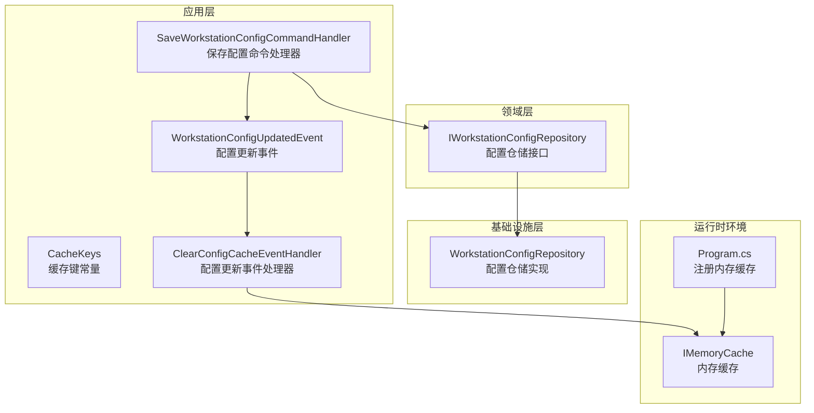
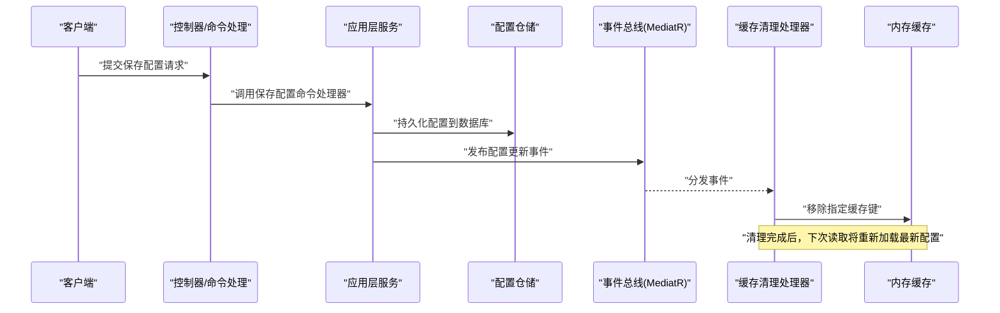
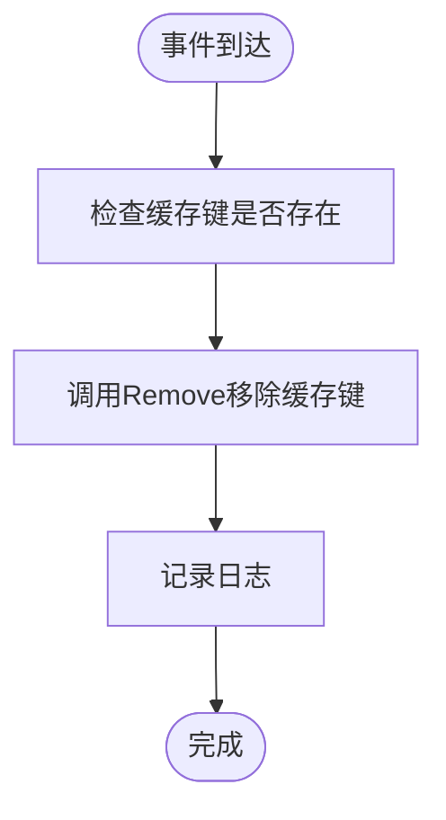
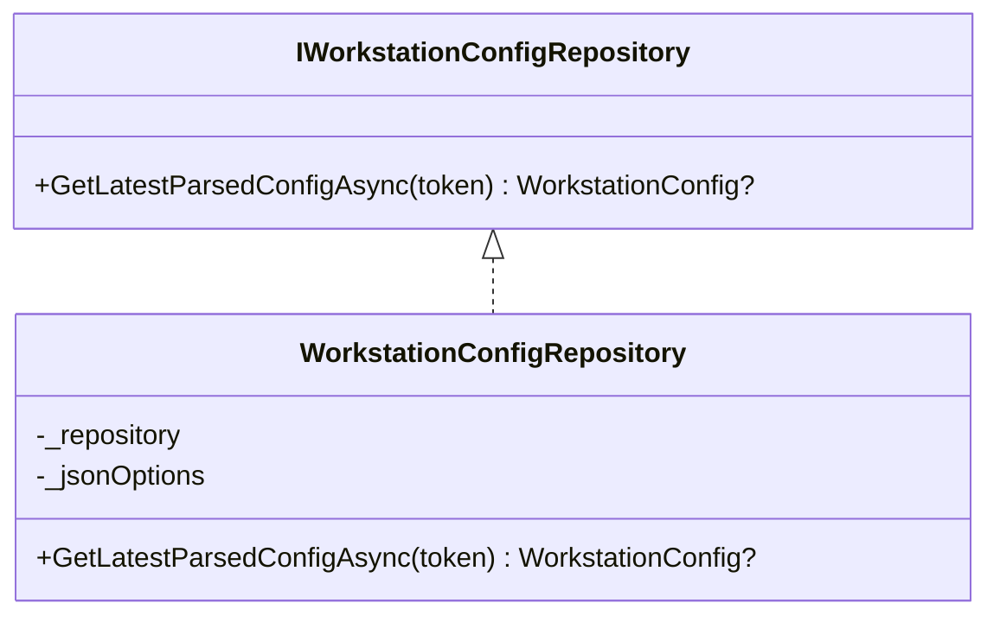
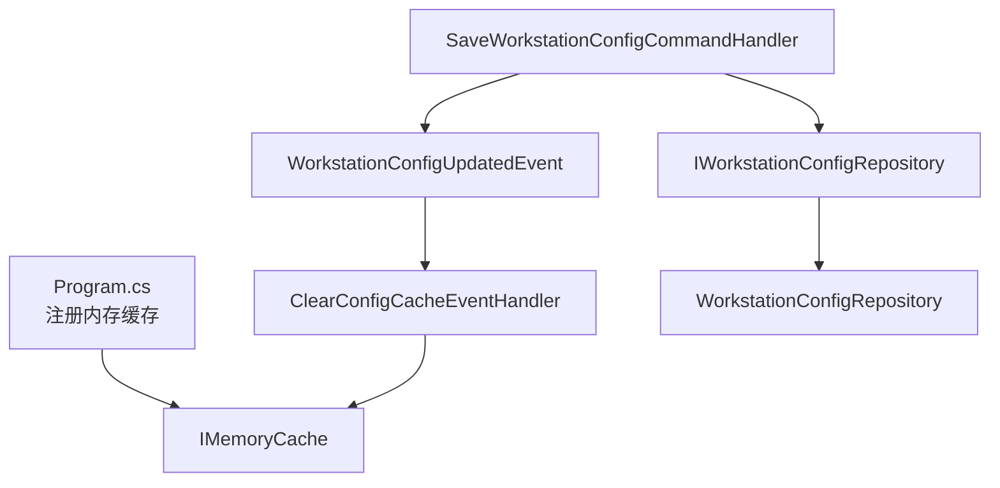

# 缓存管理

<cite>
**本文档引用的文件**
- [Program.cs](file://IndustrialDataSolution/IndustrialDataProcessor.Api/Program.cs)
- [CacheKeys.cs](file://IndustrialDataSolution/IndustrialDataProcessor.Application/Constants/CacheKeys.cs)
- [ClearConfigCacheEventHandler.cs](file://IndustrialDataSolution/IndustrialDataProcessor.Application/EventHandlers/ClearConfigCacheEventHandler.cs)
- [WorkstationConfigUpdatedEvent.cs](file://IndustrialDataSolution/IndustrialDataProcessor.Application/Events/WorkstationConfigUpdatedEvent.cs)
- [SaveWorkstationConfigCommandHandler.cs](file://IndustrialDataSolution/IndustrialDataProcessor.Application/CommandHandlers/SaveWorkstationConfigCommandHandler.cs)
- [IWorkstationConfigRepository.cs](file://IndustrialDataSolution/IndustrialDataProcessor.Domain/Repositories/IWorkstationConfigRepository.cs)
- [WorkstationConfigRepository.cs](file://IndustrialDataSolution/IndustrialDataProcessor.Infrastructure/Repositories/WorkstationConfigRepository.cs)
- [DataCollectionAppService.cs](file://IndustrialDataSolution/IndustrialDataProcessor.Application/Services/DataCollectionAppService.cs)
- [appsettings.json](file://IndustrialDataSolution/IndustrialDataProcessor.Api/appsettings.json)
</cite>

## 目录
1. [简介](#简介)
2. [项目结构](#项目结构)
3. [核心组件](#核心组件)
4. [架构概览](#架构概览)
5. [详细组件分析](#详细组件分析)
6. [依赖关系分析](#依赖关系分析)
7. [性能考虑](#性能考虑)
8. [故障排除指南](#故障排除指南)
9. [结论](#结论)

## 简介
本文件针对DDD工业数据处理解决方案中的缓存管理机制进行全面技术文档化，重点覆盖以下方面：
- 缓存策略设计与实现：包括配置缓存与数据缓存的管理机制
- CacheKeys常量设计原则：缓存键命名规范与作用域管理
- 缓存清理机制：ClearConfigCacheEventHandler的触发条件与清理逻辑
- 缓存生命周期管理：创建、更新、失效与销毁
- 性能优化策略：命中率提升、内存管理与并发控制
- 最佳实践与故障排除指导

## 项目结构
本项目的缓存管理涉及三层职责分离：
- 应用层：定义缓存键常量、事件处理器、命令处理器
- 领域层：定义仓储接口，提供获取最新配置的能力
- 基础设施层：实现仓储，负责JSON序列化与反序列化

**图表来源**
- [Program.cs](file://IndustrialDataSolution/IndustrialDataProcessor.Api/Program.cs#L14-L15)
- [CacheKeys.cs](file://IndustrialDataSolution/IndustrialDataProcessor.Application/Constants/CacheKeys.cs#L5)
- [ClearConfigCacheEventHandler.cs](file://IndustrialDataSolution/IndustrialDataProcessor.Application/EventHandlers/ClearConfigCacheEventHandler.cs#L11-L19)
- [WorkstationConfigUpdatedEvent.cs](file://IndustrialDataSolution/IndustrialDataProcessor.Application/Events/WorkstationConfigUpdatedEvent.cs#L7-L9)
- [SaveWorkstationConfigCommandHandler.cs](file://IndustrialDataSolution/IndustrialDataProcessor.Application/CommandHandlers/SaveWorkstationConfigCommandHandler.cs#L28-L29)
- [IWorkstationConfigRepository.cs](file://IndustrialDataSolution/IndustrialDataProcessor.Domain/Repositories/IWorkstationConfigRepository.cs#L10)
- [WorkstationConfigRepository.cs](file://IndustrialDataSolution/IndustrialDataProcessor.Infrastructure/Repositories/WorkstationConfigRepository.cs#L23-L42)

**章节来源**
- [Program.cs](file://IndustrialDataSolution/IndustrialDataProcessor.Api/Program.cs#L14-L15)
- [CacheKeys.cs](file://IndustrialDataSolution/IndustrialDataProcessor.Application/Constants/CacheKeys.cs#L5)
- [ClearConfigCacheEventHandler.cs](file://IndustrialDataSolution/IndustrialDataProcessor.Application/EventHandlers/ClearConfigCacheEventHandler.cs#L11-L19)
- [WorkstationConfigUpdatedEvent.cs](file://IndustrialDataSolution/IndustrialDataProcessor.Application/Events/WorkstationConfigUpdatedEvent.cs#L7-L9)
- [SaveWorkstationConfigCommandHandler.cs](file://IndustrialDataSolution/IndustrialDataProcessor.Application/CommandHandlers/SaveWorkstationConfigCommandHandler.cs#L28-L29)
- [IWorkstationConfigRepository.cs](file://IndustrialDataSolution/IndustrialDataProcessor.Domain/Repositories/IWorkstationConfigRepository.cs#L10)
- [WorkstationConfigRepository.cs](file://IndustrialDataSolution/IndustrialDataProcessor.Infrastructure/Repositories/WorkstationConfigRepository.cs#L23-L42)

## 核心组件
本节聚焦于缓存管理的关键组件及其职责：
- 缓存键常量：统一管理缓存键，确保键名一致性与可维护性
- 内存缓存注册：在应用启动时注册内存缓存服务
- 配置更新事件：发布配置变更事件以触发缓存清理
- 清理事件处理器：监听事件并移除对应缓存键
- 配置仓储：提供获取最新配置的能力，供业务流程使用

**章节来源**
- [CacheKeys.cs](file://IndustrialDataSolution/IndustrialDataProcessor.Application/Constants/CacheKeys.cs#L5)
- [Program.cs](file://IndustrialDataSolution/IndustrialDataProcessor.Api/Program.cs#L14-L15)
- [WorkstationConfigUpdatedEvent.cs](file://IndustrialDataSolution/IndustrialDataProcessor.Application/Events/WorkstationConfigUpdatedEvent.cs#L7-L9)
- [ClearConfigCacheEventHandler.cs](file://IndustrialDataSolution/IndustrialDataProcessor.Application/EventHandlers/ClearConfigCacheEventHandler.cs#L11-L19)
- [IWorkstationConfigRepository.cs](file://IndustrialDataSolution/IndustrialDataProcessor.Domain/Repositories/IWorkstationConfigRepository.cs#L10)

## 架构概览
缓存管理采用事件驱动的清理机制，结合内存缓存实现配置的快速访问与一致性保障。

**图表来源**
- [SaveWorkstationConfigCommandHandler.cs](file://IndustrialDataSolution/IndustrialDataProcessor.Application/CommandHandlers/SaveWorkstationConfigCommandHandler.cs#L28-L29)
- [WorkstationConfigUpdatedEvent.cs](file://IndustrialDataSolution/IndustrialDataProcessor.Application/Events/WorkstationConfigUpdatedEvent.cs#L7-L9)
- [ClearConfigCacheEventHandler.cs](file://IndustrialDataSolution/IndustrialDataProcessor.Application/EventHandlers/ClearConfigCacheEventHandler.cs#L11-L19)
- [CacheKeys.cs](file://IndustrialDataSolution/IndustrialDataProcessor.Application/Constants/CacheKeys.cs#L5)

## 详细组件分析

### 缓存键常量设计（CacheKeys）
- 设计原则
  - 常量集中管理：将所有缓存键统一定义在静态类中，便于维护与查找
  - 命名规范：采用语义明确的英文标识，如LatestWorkstationConfig，体现键的作用域与用途
  - 作用域管理：键名限定在应用层，避免跨模块污染；仅暴露必要常量，降低耦合
- 实现要点
  - 使用const字段保证编译期常量替换，减少运行时开销
  - 键名与业务实体强关联，确保缓存内容与业务上下文一致

**章节来源**
- [CacheKeys.cs](file://IndustrialDataSolution/IndustrialDataProcessor.Application/Constants/CacheKeys.cs#L5)

### 内存缓存注册（Program.cs）
- 注册时机：在应用启动时通过AddMemoryCache注册内存缓存服务
- 服务生命周期：默认注册为Singleton，适合进程内缓存场景
- 配置建议：生产环境可结合应用配置调整缓存行为（如过期策略），但当前代码未显式设置

**章节来源**
- [Program.cs](file://IndustrialDataSolution/IndustrialDataProcessor.Api/Program.cs#L14-L15)

### 配置更新事件（WorkstationConfigUpdatedEvent）
- 事件定义：轻量事件，包含UpdatedTime属性，用于记录事件触发时间
- 触发条件：在保存配置命令处理完成后发布，确保数据持久化后再清理缓存
- 事件传播：通过MediatR进行事件分发，遵循应用层解耦原则

**章节来源**
- [WorkstationConfigUpdatedEvent.cs](file://IndustrialDataSolution/IndustrialDataProcessor.Application/Events/WorkstationConfigUpdatedEvent.cs#L7-L9)
- [SaveWorkstationConfigCommandHandler.cs](file://IndustrialDataSolution/IndustrialDataProcessor.Application/CommandHandlers/SaveWorkstationConfigCommandHandler.cs#L28-L29)

### 缓存清理处理器（ClearConfigCacheEventHandler）
- 触发条件：接收WorkstationConfigUpdatedEvent后执行
- 清理逻辑：调用IMemoryCache.Remove移除LatestWorkstationConfig键
- 日志记录：记录事件处理信息，便于监控与排障
- 处理器职责：保持单一职责，专注缓存清理，避免引入其他业务逻辑

**图表来源**
- [ClearConfigCacheEventHandler.cs](file://IndustrialDataSolution/IndustrialDataProcessor.Application/EventHandlers/ClearConfigCacheEventHandler.cs#L11-L19)
- [CacheKeys.cs](file://IndustrialDataSolution/IndustrialDataProcessor.Application/Constants/CacheKeys.cs#L5)

**章节来源**
- [ClearConfigCacheEventHandler.cs](file://IndustrialDataSolution/IndustrialDataProcessor.Application/EventHandlers/ClearConfigCacheEventHandler.cs#L11-L19)

### 配置仓储与缓存交互（IWorkstationConfigRepository/WorkstationConfigRepository）
- 仓储职责：提供GetLatestParsedConfigAsync方法，返回最新配置对象
- 数据来源：从数据库实体反序列化为领域模型，包含协议配置等复杂结构
- 与缓存的关系：当前实现未直接使用内存缓存，但清理机制确保后续读取获取最新配置

**图表来源**
- [IWorkstationConfigRepository.cs](file://IndustrialDataSolution/IndustrialDataProcessor.Domain/Repositories/IWorkstationConfigRepository.cs#L10)
- [WorkstationConfigRepository.cs](file://IndustrialDataSolution/IndustrialDataProcessor.Infrastructure/Repositories/WorkstationConfigRepository.cs#L8-L42)

**章节来源**
- [IWorkstationConfigRepository.cs](file://IndustrialDataSolution/IndustrialDataProcessor.Domain/Repositories/IWorkstationConfigRepository.cs#L10)
- [WorkstationConfigRepository.cs](file://IndustrialDataSolution/IndustrialDataProcessor.Infrastructure/Repositories/WorkstationConfigRepository.cs#L23-L42)

### 数据采集服务与缓存（DataCollectionAppService）
- 服务职责：启动并管理各协议的采集任务，按配置周期执行读取与处理
- 配置来源：通过仓储获取最新配置，若无配置则跳过启动
- 缓存关系：当前实现未直接使用内存缓存，但清理机制确保配置变更后尽快生效

**章节来源**
- [DataCollectionAppService.cs](file://IndustrialDataSolution/IndustrialDataProcessor.Application/Services/DataCollectionAppService.cs#L22-L31)

## 依赖关系分析
缓存管理的依赖关系清晰，遵循分层与关注点分离原则：

**图表来源**
- [Program.cs](file://IndustrialDataSolution/IndustrialDataProcessor.Api/Program.cs#L14-L15)
- [SaveWorkstationConfigCommandHandler.cs](file://IndustrialDataSolution/IndustrialDataProcessor.Application/CommandHandlers/SaveWorkstationConfigCommandHandler.cs#L28-L29)
- [WorkstationConfigUpdatedEvent.cs](file://IndustrialDataSolution/IndustrialDataProcessor.Application/Events/WorkstationConfigUpdatedEvent.cs#L7-L9)
- [ClearConfigCacheEventHandler.cs](file://IndustrialDataSolution/IndustrialDataProcessor.Application/EventHandlers/ClearConfigCacheEventHandler.cs#L11-L19)
- [IWorkstationConfigRepository.cs](file://IndustrialDataSolution/IndustrialDataProcessor.Domain/Repositories/IWorkstationConfigRepository.cs#L10)
- [WorkstationConfigRepository.cs](file://IndustrialDataSolution/IndustrialDataProcessor.Infrastructure/Repositories/WorkstationConfigRepository.cs#L23-L42)

**章节来源**
- [Program.cs](file://IndustrialDataSolution/IndustrialDataProcessor.Api/Program.cs#L14-L15)
- [SaveWorkstationConfigCommandHandler.cs](file://IndustrialDataSolution/IndustrialDataProcessor.Application/CommandHandlers/SaveWorkstationConfigCommandHandler.cs#L28-L29)
- [WorkstationConfigUpdatedEvent.cs](file://IndustrialDataSolution/IndustrialDataProcessor.Application/Events/WorkstationConfigUpdatedEvent.cs#L7-L9)
- [ClearConfigCacheEventHandler.cs](file://IndustrialDataSolution/IndustrialDataProcessor.Application/EventHandlers/ClearConfigCacheEventHandler.cs#L11-L19)
- [IWorkstationConfigRepository.cs](file://IndustrialDataSolution/IndustrialDataProcessor.Domain/Repositories/IWorkstationConfigRepository.cs#L10)
- [WorkstationConfigRepository.cs](file://IndustrialDataSolution/IndustrialDataProcessor.Infrastructure/Repositories/WorkstationConfigRepository.cs#L23-L42)

## 性能考虑
基于现有实现，提出以下性能优化与最佳实践建议：
- 缓存命中率提升
  - 合理设计缓存键：使用CacheKeys统一管理键名，避免硬编码导致的重复与冲突
  - 缓存内容粒度：当前仅缓存最新配置，建议在读取路径增加缓存包装，减少重复反序列化
- 内存管理
  - 控制缓存容量：结合业务规模设置最大条目数与过期策略，避免内存膨胀
  - 及时清理：利用事件驱动清理机制，确保配置变更后尽快失效旧缓存
- 并发控制
  - 读写分离：读路径使用只读缓存，写路径通过事件清理，避免锁竞争
  - 并发安全：IMemoryCache为线程安全，无需额外同步机制
- 配置优化
  - 生产配置：在appsettings中结合实际负载调整缓存行为（如过期时间、滑动过期等）

[本节为通用性能建议，不直接分析具体文件]

## 故障排除指南
- 缓存未清理
  - 检查事件是否正确发布：确认保存配置命令处理器已发布WorkstationConfigUpdatedEvent
  - 检查处理器是否注册：确认ClearConfigCacheEventHandler已在DI容器中注册
  - 检查日志输出：查看处理器日志是否记录“已清除工作站配置缓存”
- 配置读取异常
  - JSON反序列化失败：检查WorkstationConfigRepository的JSON选项与多态转换器配置
  - 数据库无配置：确认数据库中存在有效配置实体
- 性能问题
  - 频繁GC：检查缓存键数量与对象大小，避免缓存过大导致内存压力
  - 事件风暴：避免短时间内多次保存配置，减少不必要的缓存清理

**章节来源**
- [SaveWorkstationConfigCommandHandler.cs](file://IndustrialDataSolution/IndustrialDataProcessor.Application/CommandHandlers/SaveWorkstationConfigCommandHandler.cs#L28-L29)
- [ClearConfigCacheEventHandler.cs](file://IndustrialDataSolution/IndustrialDataProcessor.Application/EventHandlers/ClearConfigCacheEventHandler.cs#L21)
- [WorkstationConfigRepository.cs](file://IndustrialDataSolution/IndustrialDataProcessor.Infrastructure/Repositories/WorkstationConfigRepository.cs#L37-L41)

## 结论
本项目的缓存管理采用简洁而有效的事件驱动清理机制，通过统一的缓存键常量与内存缓存服务，实现了配置变更后的快速一致性保障。建议在现有基础上扩展缓存包装与过期策略，进一步提升性能与稳定性。同时，完善日志与监控，有助于及时发现与解决缓存相关问题。