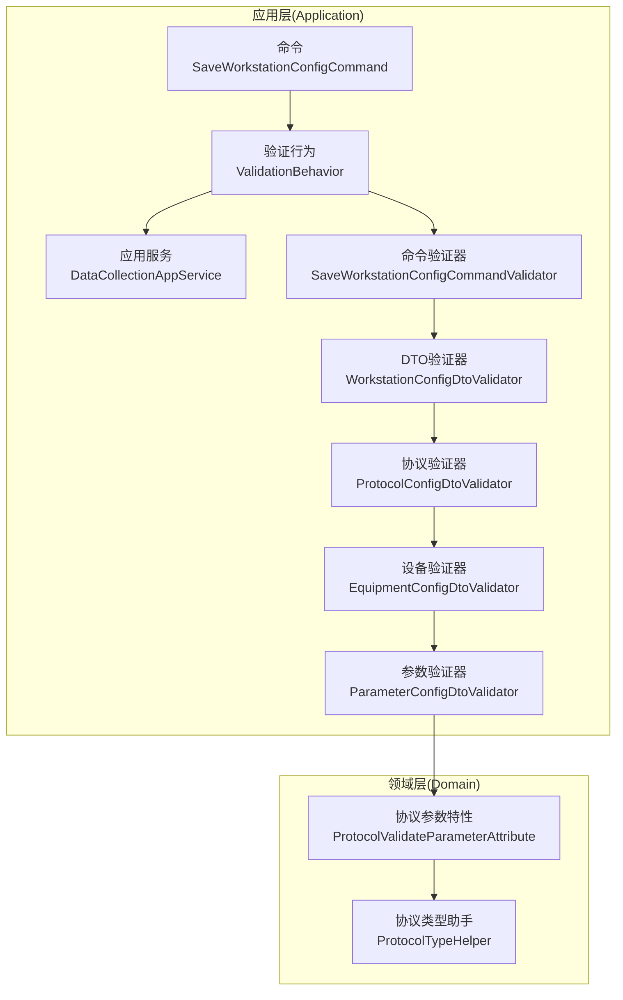
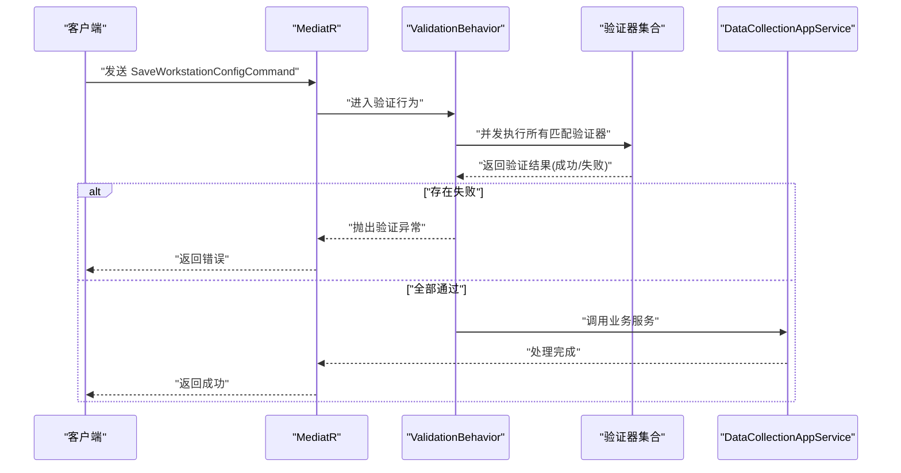
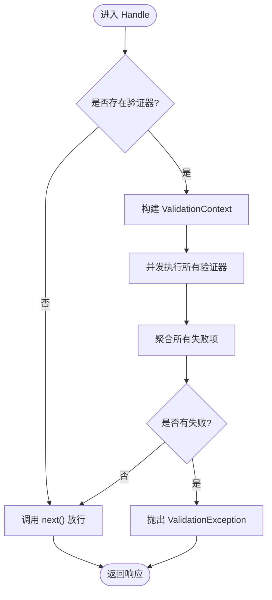
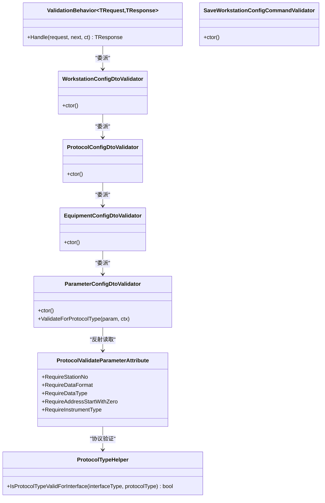

# 验证行为

<cite>
**本文档引用的文件**
- [IndustrialDataProcessor.Application/Behaviors/ValidationBehavior.cs](file://IndustrialDataProcessor.Application/Behaviors/ValidationBehavior.cs)
- [IndustrialDataProcessor.Application/DependencyInjection.cs](file://IndustrialDataProcessor.Application/DependencyInjection.cs)
- [IndustrialDataProcessor.Application/Features/SaveWorkstationConfigCommand.cs](file://IndustrialDataProcessor.Application/Features/SaveWorkstationConfigCommand.cs)
- [IndustrialDataProcessor.Application/Services/DataCollectionAppService.cs](file://IndustrialDataProcessor.Application/Services/DataCollectionAppService.cs)
- [IndustrialDataProcessor.Application/Validators/SaveWorkstationConfigCommandValidator.cs](file://IndustrialDataProcessor.Application/Validators/SaveWorkstationConfigCommandValidator.cs)
- [IndustrialDataProcessor.Application/Validators/WorkstationConfigDtoValidator.cs](file://IndustrialDataProcessor.Application/Validators/WorkstationConfigDtoValidator.cs)
- [IndustrialDataProcessor.Application/Validators/ProtocolConfigDtoValidator.cs](file://IndustrialDataProcessor.Application/Validators/ProtocolConfigDtoValidator.cs)
- [IndustrialDataProcessor.Application/Validators/EquipmentConfigDtoValidator.cs](file://IndustrialDataProcessor.Application/Validators/EquipmentConfigDtoValidator.cs)
- [IndustrialDataProcessor.Application/Validators/ParameterConfigDtoValidator.cs](file://IndustrialDataProcessor.Application/Validators/ParameterConfigDtoValidator.cs)
- [IndustrialDataProcessor.Application/Dtos/WorkstationDto/WorkstationConfigDto.cs](file://IndustrialDataProcessor.Application/Dtos/WorkstationDto/WorkstationConfigDto.cs)
- [IndustrialDataProcessor.Application/Dtos/WorkstationDto/ProtocolConfigDto.cs](file://IndustrialDataProcessor.Application/Dtos/WorkstationDto/ProtocolConfigDto.cs)
- [IndustrialDataProcessor.Application/Dtos/WorkstationDto/EquipmentConfigDto.cs](file://IndustrialDataProcessor.Application/Dtos/WorkstationDto/EquipmentConfigDto.cs)
- [IndustrialDataProcessor.Application/Dtos/WorkstationDto/ParameterConfigDto.cs](file://IndustrialDataProcessor.Application/Dtos/WorkstationDto/ParameterConfigDto.cs)
- [IndustrialDataProcessor.Domain/Attributes/ProtocolValidateParameterAttribute.cs](file://IndustrialDataProcessor.Domain/Attributes/ProtocolValidateParameterAttribute.cs)
- [IndustrialDataProcessor.Domain/Helpers/ProtocolTypeHelper.cs](file://IndustrialDataProcessor.Domain/Helpers/ProtocolTypeHelper.cs)
- [IndustrialDataProcessor.Application.Test/Validators/WorkstationConfigDtoValidatorTests.cs](file://IndustrialDataProcessor.Application.Test/Validators/WorkstationConfigDtoValidatorTests.cs)
- [IndustrialDataProcessor.Application.Test/Validators/EquipmentConfigDtoValidatorTests.cs](file://IndustrialDataProcessor.Application.Test/Validators/EquipmentConfigDtoValidatorTests.cs)
</cite>

## 更新摘要
**所做更改**
- 更新参数验证器章节，反映协议类型驱动验证机制的实现
- 更新设备验证器章节，反映验证器简化的改进
- 更新协议验证器章节，反映增强的接口类型验证功能
- 新增协议参数特性章节，说明协议特定验证的实现原理
- 更新依赖关系分析，反映新的验证架构

## 目录
1. [引言](#引言)
2. [项目结构](#项目结构)
3. [核心组件](#核心组件)
4. [架构总览](#架构总览)
5. [组件详解](#组件详解)
6. [依赖关系分析](#依赖关系分析)
7. [性能考量](#性能考量)
8. [故障排查指南](#故障排查指南)
9. [结论](#结论)
10. [附录](#附录)

## 引言
本文件系统性阐述DDD工业数据处理解决方案中"验证行为"的设计与实现，重点覆盖以下方面：
- ValidationBehavior拦截机制与FluentValidation集成
- 验证管道工作流：前置验证、错误收集与异常抛出
- 各类验证器的设计与规则实现：SaveWorkstationConfigCommandValidator、WorkstationConfigDtoValidator等
- 验证行为的配置与注册：依赖注入、行为链构建
- 规则设计原则与最佳实践：规则组合、自定义验证器、本地化支持
- 调试技巧与性能优化建议

**更新** 本次更新重点关注验证系统的重大改进，包括参数验证器的协议类型驱动验证、设备验证器简化、协议验证器增强等核心变更。

## 项目结构
本项目采用分层与领域驱动设计（DDD）组织代码，验证相关能力主要分布在应用层（Application）：
- 行为层（Behaviors）：统一的验证拦截器
- 验证器层（Validators）：面向DTO与命令的规则集
- 命令与处理器（Features）：MediatR命令与处理流程
- DTO层（Dtos/WorkstationDto）：数据传输对象
- 领域层（Domain）：协议参数特性等业务约束

**图表来源**
- [IndustrialDataProcessor.Application/Behaviors/ValidationBehavior.cs:1-31](file://IndustrialDataProcessor.Application/Behaviors/ValidationBehavior.cs#L1-L31)
- [IndustrialDataProcessor.Application/Features/SaveWorkstationConfigCommand.cs:1-9](file://IndustrialDataProcessor.Application/Features/SaveWorkstationConfigCommand.cs#L1-L9)
- [IndustrialDataProcessor.Application/Services/DataCollectionAppService.cs:1-32](file://IndustrialDataProcessor.Application/Services/DataCollectionAppService.cs#L1-L32)
- [IndustrialDataProcessor.Application/Validators/SaveWorkstationConfigCommandValidator.cs:1-13](file://IndustrialDataProcessor.Application/Validators/SaveWorkstationConfigCommandValidator.cs#L1-L13)
- [IndustrialDataProcessor.Application/Validators/WorkstationConfigDtoValidator.cs:1-36](file://IndustrialDataProcessor.Application/Validators/WorkstationConfigDtoValidator.cs#L1-L36)
- [IndustrialDataProcessor.Application/Validators/ProtocolConfigDtoValidator.cs:1-275](file://IndustrialDataProcessor.Application/Validators/ProtocolConfigDtoValidator.cs#L1-L275)
- [IndustrialDataProcessor.Application/Validators/EquipmentConfigDtoValidator.cs:1-48](file://IndustrialDataProcessor.Application/Validators/EquipmentConfigDtoValidator.cs#L1-L48)
- [IndustrialDataProcessor.Application/Validators/ParameterConfigDtoValidator.cs:1-141](file://IndustrialDataProcessor.Application/Validators/ParameterConfigDtoValidator.cs#L1-L141)
- [IndustrialDataProcessor.Domain/Attributes/ProtocolValidateParameterAttribute.cs:1-28](file://IndustrialDataProcessor.Domain/Attributes/ProtocolValidateParameterAttribute.cs#L1-L28)
- [IndustrialDataProcessor.Domain/Helpers/ProtocolTypeHelper.cs](file://IndustrialDataProcessor.Domain/Helpers/ProtocolTypeHelper.cs)

**章节来源**
- [IndustrialDataProcessor.Application/Behaviors/ValidationBehavior.cs:1-31](file://IndustrialDataProcessor.Application/Behaviors/ValidationBehavior.cs#L1-L31)
- [IndustrialDataProcessor.Application/DependencyInjection.cs:1-40](file://IndustrialDataProcessor.Application/DependencyInjection.cs#L1-L40)

## 核心组件
- ValidationBehavior：基于MediatR的IPipelineBehavior实现，负责对所有进入的请求进行前置验证；当存在验证器时，异步并发执行所有验证器，聚合失败后抛出统一验证异常。
- 验证器族：围绕WorkstationConfigDto及其嵌套的ProtocolConfigDto、EquipmentConfigDto、ParameterConfigDto构建，覆盖基础必填、格式校验、枚举合法性、字段间关系、协议特定参数要求等。
- 命令与处理器：SaveWorkstationConfigCommand作为入口，经验证后交由DataCollectionAppService执行业务逻辑。
- 协议参数特性：通过ProtocolValidateParameterAttribute实现协议类型驱动的动态验证机制。

**更新** 新增协议参数特性的核心作用，它为参数验证提供了灵活的协议特定验证能力。

**章节来源**
- [IndustrialDataProcessor.Application/Behaviors/ValidationBehavior.cs:1-31](file://IndustrialDataProcessor.Application/Behaviors/ValidationBehavior.cs#L1-L31)
- [IndustrialDataProcessor.Application/Validators/SaveWorkstationConfigCommandValidator.cs:1-13](file://IndustrialDataProcessor.Application/Validators/SaveWorkstationConfigCommandValidator.cs#L1-L13)
- [IndustrialDataProcessor.Application/Validators/WorkstationConfigDtoValidator.cs:1-36](file://IndustrialDataProcessor.Application/Validators/WorkstationConfigDtoValidator.cs#L1-L36)
- [IndustrialDataProcessor.Application/Features/SaveWorkstationConfigCommand.cs:1-9](file://IndustrialDataProcessor.Application/Features/SaveWorkstationConfigCommand.cs#L1-L9)
- [IndustrialDataProcessor.Application/Services/DataCollectionAppService.cs:1-32](file://IndustrialDataProcessor.Application/Services/DataCollectionAppService.cs#L1-L32)
- [IndustrialDataProcessor.Domain/Attributes/ProtocolValidateParameterAttribute.cs:1-28](file://IndustrialDataProcessor.Domain/Attributes/ProtocolValidateParameterAttribute.cs#L1-L28)

## 架构总览
验证行为以"横切关注点"的形式介入MediatR请求生命周期，在命令/查询到达具体处理器前统一执行验证，保证输入数据质量与一致性。

**图表来源**
- [IndustrialDataProcessor.Application/Behaviors/ValidationBehavior.cs:12-29](file://IndustrialDataProcessor.Application/Behaviors/ValidationBehavior.cs#L12-L29)
- [IndustrialDataProcessor.Application/DependencyInjection.cs:30-36](file://IndustrialDataProcessor.Application/DependencyInjection.cs#L30-L36)
- [IndustrialDataProcessor.Application/Services/DataCollectionAppService.cs:18-30](file://IndustrialDataProcessor.Application/Services/DataCollectionAppService.cs#L18-L30)

## 组件详解

### ValidationBehavior：拦截与验证管道
- 拦截范围：所有进入MediatR的请求（命令/查询），通过泛型约束与IValidator集合匹配。
- 并发执行：使用Task.WhenAll并发触发所有匹配验证器，提升吞吐。
- 错误聚合：将所有验证失败合并为统一列表，若存在失败即抛出ValidationException，中断后续处理。
- 放行逻辑：验证通过后调用next委托，进入目标处理器。

**图表来源**
- [IndustrialDataProcessor.Application/Behaviors/ValidationBehavior.cs:12-29](file://IndustrialDataProcessor.Application/Behaviors/ValidationBehavior.cs#L12-L29)

**章节来源**
- [IndustrialDataProcessor.Application/Behaviors/ValidationBehavior.cs:1-31](file://IndustrialDataProcessor.Application/Behaviors/ValidationBehavior.cs#L1-L31)

### SaveWorkstationConfigCommandValidator：命令级验证
- 将命令dto字段委派给WorkstationConfigDtoValidator执行，形成"命令-DTO"两级验证。
- 优点：职责清晰，命令只关心入口参数，具体业务数据由DTO验证器负责。

**章节来源**
- [IndustrialDataProcessor.Application/Validators/SaveWorkstationConfigCommandValidator.cs:1-13](file://IndustrialDataProcessor.Application/Validators/SaveWorkstationConfigCommandValidator.cs#L1-L13)

### WorkstationConfigDtoValidator：工作站配置DTO验证
- 校验字段：Id、IpAddress、Protocols。
- 规则要点：
  - Id非空校验与本地化提示。
  - IpAddress非空与IPv4格式校验。
  - Protocols非空，并对每个协议配置递归委派至ProtocolConfigDtoValidator。
- 嵌套验证：通过ForEach与SetValidator实现深度校验。

**章节来源**
- [IndustrialDataProcessor.Application/Validators/WorkstationConfigDtoValidator.cs:1-36](file://IndustrialDataProcessor.Application/Validators/WorkstationConfigDtoValidator.cs#L1-L36)
- [IndustrialDataProcessor.Application/Dtos/WorkstationDto/WorkstationConfigDto.cs:1-27](file://IndustrialDataProcessor.Application/Dtos/WorkstationDto/WorkstationConfigDto.cs#L1-L27)

### ProtocolConfigDtoValidator：协议配置验证（增强版）
- 通用必填：Id、ProtocolType、InterfaceType、Equipments。
- 协议与接口兼容性：通过ProtocolTypeHelper判断接口类型是否支持该协议类型。
- 可选项业务规则：通信延时、接收/连接超时的数值范围校验。
- 接口类型分支验证：
  - COM串口：串口名、波特率、数据位、校验位、停止位的非空与枚举有效性。
  - LAN网口：IP地址格式与端口范围。
  - DATABASE：连接字符串与IP/端口/库名二选一的复杂验证逻辑。
  - API：请求方法与访问API语句。
- 子项向下传递：在RuleForEach中将父级ProtocolType传递给Equipment，保证子级验证上下文一致。

**更新** 协议验证器经过重大增强，特别是DATABASE接口类型的验证逻辑更加完善，支持连接字符串解析和必要键验证。

**章节来源**
- [IndustrialDataProcessor.Application/Validators/ProtocolConfigDtoValidator.cs:1-275](file://IndustrialDataProcessor.Application/Validators/ProtocolConfigDtoValidator.cs#L1-L275)
- [IndustrialDataProcessor.Application/Dtos/WorkstationDto/ProtocolConfigDto.cs:1-92](file://IndustrialDataProcessor.Application/Dtos/WorkstationDto/ProtocolConfigDto.cs#L1-L92)

### EquipmentConfigDtoValidator：设备配置验证（简化版）
- 基础必填：Id、EquipmentType。
- 枚举合法性：EquipmentType、ProtocolType。
- 参数列表：Parameters可为空，为空则默认为空集合。
- 子项验证与上下文传递：通过RuleForEach将ProtocolType与Equipment.Id传递给Parameter，随后委派ParameterConfigDtoValidator。
- 条件验证：仅当Parameters存在时才执行参数验证。

**更新** 设备验证器经过简化，移除了不必要的验证逻辑，专注于核心字段的验证，提高了验证效率。

**章节来源**
- [IndustrialDataProcessor.Application/Validators/EquipmentConfigDtoValidator.cs:1-48](file://IndustrialDataProcessor.Application/Validators/EquipmentConfigDtoValidator.cs#L1-L48)
- [IndustrialDataProcessor.Application/Dtos/WorkstationDto/EquipmentConfigDto.cs:1-39](file://IndustrialDataProcessor.Application/Dtos/WorkstationDto/EquipmentConfigDto.cs#L1-L39)

### ParameterConfigDtoValidator：参数配置验证（协议类型驱动）
- 基础必填：Label、Address。
- 协议特性驱动的动态验证：通过反射读取ProtocolValidateParameterAttribute，按协议类型强制要求站号、数据格式、数据类型、地址起始等字段。
- 枚举合法性：DataType、DataFormat、InstrumentType（按需启用）。
- 数值范围：Length、Cycle非负。
- 逻辑校验：MinValue与MaxValue的大小关系。
- 自定义规则：ValidateForProtocolType动态检查协议参数必需字段。

**更新** 参数验证器实现了协议类型驱动的验证机制，这是本次验证系统改进的核心创新。通过ProtocolValidateParameterAttribute特性，实现了灵活的协议特定验证。

**章节来源**
- [IndustrialDataProcessor.Application/Validators/ParameterConfigDtoValidator.cs:1-141](file://IndustrialDataProcessor.Application/Validators/ParameterConfigDtoValidator.cs#L1-L141)
- [IndustrialDataProcessor.Domain/Attributes/ProtocolValidateParameterAttribute.cs:1-28](file://IndustrialDataProcessor.Domain/Attributes/ProtocolValidateParameterAttribute.cs#L1-L28)

### ProtocolValidateParameterAttribute：协议参数特性
- 功能描述：为协议类型字段添加标签，标记协议在参数校验时需要的字段。
- 属性定义：RequireStationNo、RequireDataType、RequireDataFormat、RequireAddressStartWithZero、RequireInstrumentType。
- 扩展性：支持未来添加更多协议特定验证需求。
- 实现原理：通过反射机制在运行时动态获取协议特性的验证要求。

**新增** 这是本次验证系统改进的关键组件，为协议类型驱动验证提供了基础支撑。

**章节来源**
- [IndustrialDataProcessor.Domain/Attributes/ProtocolValidateParameterAttribute.cs:1-28](file://IndustrialDataProcessor.Domain/Attributes/ProtocolValidateParameterAttribute.cs#L1-L28)

### 配置与注册：依赖注入与行为链
- FluentValidation自动扫描：AddValidatorsFromAssemblyContaining注册所有验证器。
- MediatR注册：RegisterServicesFromAssemblyContaining扫描命令/处理器。
- 全局验证行为：AddOpenBehavior(typeof(ValidationBehavior<,>))将验证行为注入为开放泛型行为，作用于所有请求类型。
- 生命周期：验证行为与验证器均以服务形式注册，遵循标准DI生命周期。

**章节来源**
- [IndustrialDataProcessor.Application/DependencyInjection.cs:21-36](file://IndustrialDataProcessor.Application/DependencyInjection.cs#L21-L36)

### 处理流程：命令到处理器
- SaveWorkstationConfigCommand作为入口，携带WorkstationConfigDto。
- 验证通过后，DataCollectionAppService将DTO映射为领域实体，序列化后持久化，并发布配置更新事件。

**更新** 处理流程中的处理器从SaveWorkstationConfigCommandHandler更新为DataCollectionAppService，反映了应用层架构的调整。

**章节来源**
- [IndustrialDataProcessor.Application/Features/SaveWorkstationConfigCommand.cs:1-9](file://IndustrialDataProcessor.Application/Features/SaveWorkstationConfigCommand.cs#L1-L9)
- [IndustrialDataProcessor.Application/Services/DataCollectionAppService.cs:1-32](file://IndustrialDataProcessor.Application/Services/DataCollectionAppService.cs#L1-L32)

## 依赖关系分析
- ValidationBehavior依赖IValidator<TRequest>集合，通过构造函数注入。
- SaveWorkstationConfigCommandValidator依赖WorkstationConfigDtoValidator。
- WorkstationConfigDtoValidator依赖ProtocolConfigDtoValidator。
- ProtocolConfigDtoValidator依赖EquipmentConfigDtoValidator。
- EquipmentConfigDtoValidator依赖ParameterConfigDtoValidator。
- ParameterConfigDtoValidator依赖ProtocolValidateParameterAttribute进行协议特定参数校验。
- ProtocolValidateParameterAttribute依赖ProtocolTypeHelper进行协议类型验证。

**更新** 新增了ProtocolValidateParameterAttribute与ProtocolTypeHelper之间的依赖关系。

**图表来源**
- [IndustrialDataProcessor.Application/Behaviors/ValidationBehavior.cs:9-11](file://IndustrialDataProcessor.Application/Behaviors/ValidationBehavior.cs#L9-L11)
- [IndustrialDataProcessor.Application/Validators/SaveWorkstationConfigCommandValidator.cs:6-11](file://IndustrialDataProcessor.Application/Validators/SaveWorkstationConfigCommandValidator.cs#L6-L11)
- [IndustrialDataProcessor.Application/Validators/WorkstationConfigDtoValidator.cs:6-24](file://IndustrialDataProcessor.Application/Validators/WorkstationConfigDtoValidator.cs#L6-L24)
- [IndustrialDataProcessor.Application/Validators/ProtocolConfigDtoValidator.cs:8-38](file://IndustrialDataProcessor.Application/Validators/ProtocolConfigDtoValidator.cs#L8-L38)
- [IndustrialDataProcessor.Application/Validators/EquipmentConfigDtoValidator.cs:6-41](file://IndustrialDataProcessor.Application/Validators/EquipmentConfigDtoValidator.cs#L6-L41)
- [IndustrialDataProcessor.Application/Validators/ParameterConfigDtoValidator.cs:9-96](file://IndustrialDataProcessor.Application/Validators/ParameterConfigDtoValidator.cs#L9-L96)
- [IndustrialDataProcessor.Domain/Attributes/ProtocolValidateParameterAttribute.cs:7-26](file://IndustrialDataProcessor.Domain/Attributes/ProtocolValidateParameterAttribute.cs#L7-L26)
- [IndustrialDataProcessor.Domain/Helpers/ProtocolTypeHelper.cs](file://IndustrialDataProcessor.Domain/Helpers/ProtocolTypeHelper.cs)

**章节来源**
- [IndustrialDataProcessor.Application/Behaviors/ValidationBehavior.cs:1-31](file://IndustrialDataProcessor.Application/Behaviors/ValidationBehavior.cs#L1-L31)
- [IndustrialDataProcessor.Application/Validators/SaveWorkstationConfigCommandValidator.cs:1-13](file://IndustrialDataProcessor.Application/Validators/SaveWorkstationConfigCommandValidator.cs#L1-L13)
- [IndustrialDataProcessor.Application/Validators/WorkstationConfigDtoValidator.cs:1-36](file://IndustrialDataProcessor.Application/Validators/WorkstationConfigDtoValidator.cs#L1-L36)
- [IndustrialDataProcessor.Application/Validators/ProtocolConfigDtoValidator.cs:1-275](file://IndustrialDataProcessor.Application/Validators/ProtocolConfigDtoValidator.cs#L1-L275)
- [IndustrialDataProcessor.Application/Validators/EquipmentConfigDtoValidator.cs:1-48](file://IndustrialDataProcessor.Application/Validators/EquipmentConfigDtoValidator.cs#L1-L48)
- [IndustrialDataProcessor.Application/Validators/ParameterConfigDtoValidator.cs:1-141](file://IndustrialDataProcessor.Application/Validators/ParameterConfigDtoValidator.cs#L1-L141)
- [IndustrialDataProcessor.Domain/Attributes/ProtocolValidateParameterAttribute.cs:1-28](file://IndustrialDataProcessor.Domain/Attributes/ProtocolValidateParameterAttribute.cs#L1-L28)

## 性能考量
- 并发验证：ValidationBehavior使用Task.WhenAll并发执行验证器，显著降低延迟，适合多验证器场景。
- 避免重复校验：通过委派链避免重复规则，减少冗余开销。
- 选择性验证：When条件验证仅在必要时执行，减少不相关字段的校验成本。
- 枚举与格式校验：尽量使用IsInEnum与Must谓词的高效实现，避免昂贵的正则或外部调用。
- 本地化与消息拼接：消息字符串拼接应避免在高频路径中重复计算，可考虑预编译或缓存策略（本项目中消息为静态字符串，影响较小）。
- 协议特性反射：ParameterConfigDtoValidator中的反射操作仅在Custom规则中执行，不会影响常规验证性能。

**更新** 新增了协议特性反射的性能考量说明。

## 故障排查指南
- 验证未生效
  - 检查是否正确注册了AddValidatorsFromAssemblyContaining与AddMediatR。
  - 确认AddOpenBehavior(typeof(ValidationBehavior<,>))已添加到MediatR配置。
- 验证异常堆栈
  - ValidationBehavior在聚合失败后抛出ValidationException，异常中包含所有失败项，便于定位问题字段。
- 嵌套验证失败
  - 逐层检查委派链：WorkstationConfigDtoValidator -> ProtocolConfigDtoValidator -> EquipmentConfigDtoValidator -> ParameterConfigDtoValidator。
- 协议特定参数缺失
  - 检查ProtocolValidateParameterAttribute标注与ParameterConfigDtoValidator中的反射逻辑。
- 协议类型验证失败
  - 检查ProtocolTypeHelper.IsProtocolTypeValidForInterface方法的实现。
- DATABASE连接字符串验证失败
  - 检查连接字符串解析和必要键验证逻辑。
- 单元测试参考
  - 使用FluentValidation.TestHelper进行断言，参考WorkstationConfigDtoValidatorTests与EquipmentConfigDtoValidatorTests，覆盖边界与组合场景。

**更新** 新增了协议类型验证失败和DATABASE连接字符串验证失败的排查指导。

**章节来源**
- [IndustrialDataProcessor.Application/DependencyInjection.cs:21-36](file://IndustrialDataProcessor.Application/DependencyInjection.cs#L21-L36)
- [IndustrialDataProcessor.Application/Behaviors/ValidationBehavior.cs:21-24](file://IndustrialDataProcessor.Application/Behaviors/ValidationBehavior.cs#L21-L24)
- [IndustrialDataProcessor.Application.Test/Validators/WorkstationConfigDtoValidatorTests.cs:1-488](file://IndustrialDataProcessor.Application.Test/Validators/WorkstationConfigDtoValidatorTests.cs#L1-L488)
- [IndustrialDataProcessor.Application.Test/Validators/EquipmentConfigDtoValidatorTests.cs:1-359](file://IndustrialDataProcessor.Application.Test/Validators/EquipmentConfigDtoValidatorTests.cs#L1-L359)

## 结论
本方案通过ValidationBehavior与FluentValidation的深度集成，实现了统一、可扩展、高性能的输入验证机制。验证器以委派链形式层层深入，覆盖基础字段、格式、枚举、字段间关系以及协议特定参数要求，满足工业数据配置场景的严格性与复杂性。

**更新** 本次验证系统重大改进包括：
- 参数验证器实现了协议类型驱动的动态验证机制，通过ProtocolValidateParameterAttribute实现灵活的协议特定验证
- 设备验证器经过简化，移除了冗余逻辑，提高了验证效率
- 协议验证器增强了DATABASE接口类型的验证能力，支持复杂的连接字符串解析和验证
- 整体验证架构更加灵活和可扩展

配合完善的单元测试与清晰的依赖注入配置，验证行为既易于维护又便于扩展。

## 附录

### 验证规则设计原则与最佳实践
- 规则组合
  - 使用RuleFor/RulesFor组合基础规则与复杂规则，保持规则粒度适中。
  - 通过ForEach/SetValidator实现嵌套对象的深度验证，避免在单一规则中过度复杂化。
- 自定义验证器
  - 对跨字段、跨层级的复杂业务规则，优先采用Custom与When组合，必要时引入独立验证器。
  - 在ParameterConfigDtoValidator中通过反射读取ProtocolValidateParameterAttribute，实现协议维度的参数约束。
- 本地化支持
  - 使用WithMessage提供明确的错误提示，建议结合资源文件实现多语言支持（本项目示例为中文提示）。
- 可测试性
  - 为每个验证器编写单元测试，覆盖正常、异常与边界场景，参考现有测试用例。
- 协议类型驱动验证
  - 利用ProtocolValidateParameterAttribute实现协议特定的验证需求，提高验证的灵活性和准确性。

**更新** 新增了协议类型驱动验证的最佳实践指导。

### 调试技巧
- 使用FluentValidation.TestHelper快速断言，定位失败字段与消息。
- 在ValidationBehavior中开启日志记录（如ILogger），输出验证耗时与失败详情。
- 分模块禁用部分验证器，逐步缩小问题范围。
- 检查协议特性反射是否正确获取到ProtocolValidateParameterAttribute。
- 验证DATABASE连接字符串解析逻辑时，使用具体的连接字符串进行测试。

**更新** 新增了协议特性反射和DATABASE连接字符串验证的调试技巧。

### 性能优化建议
- 减少反射操作：ProtocolValidateParameterAttribute的反射仅在Custom规则中执行，避免在常规验证中重复反射。
- 优化枚举验证：使用IsInEnum替代手动枚举检查，提高验证效率。
- 合理使用When条件：仅在必要时使用When条件验证，避免不必要的验证开销。
- 连接字符串验证：DATABASE接口类型的连接字符串验证逻辑已经过优化，但仍需注意大量验证时的性能影响。
- 缓存协议类型验证结果：对于频繁使用的协议类型，可考虑缓存验证结果以提高性能。

**更新** 新增了针对新验证机制的性能优化建议。