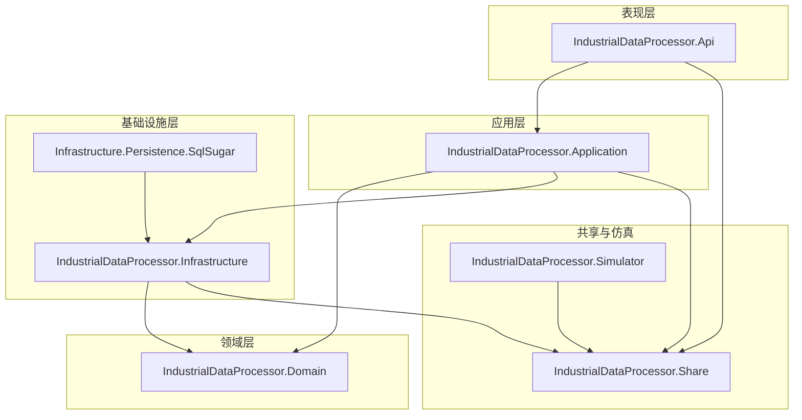
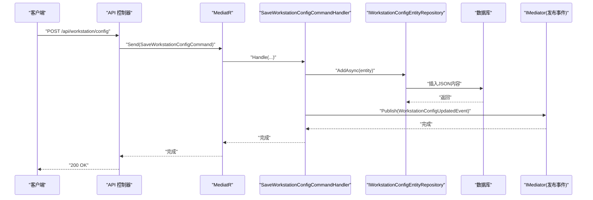
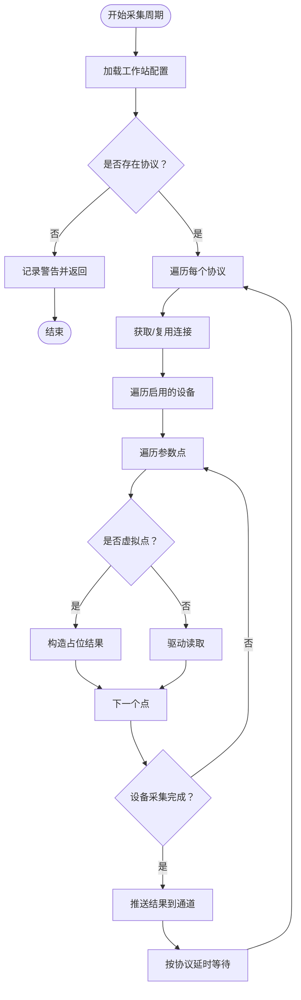
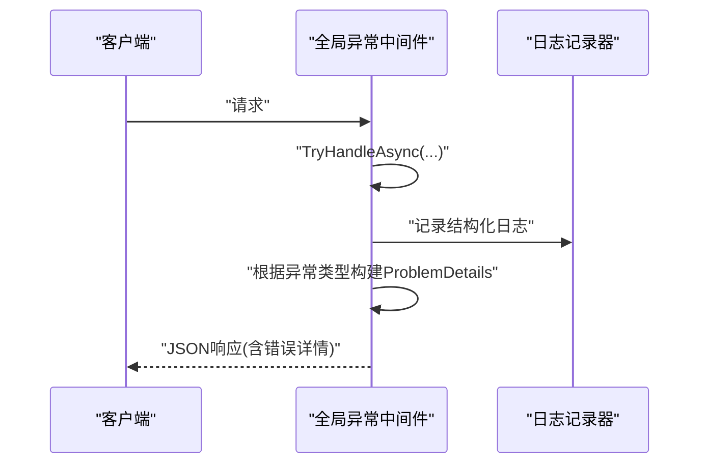
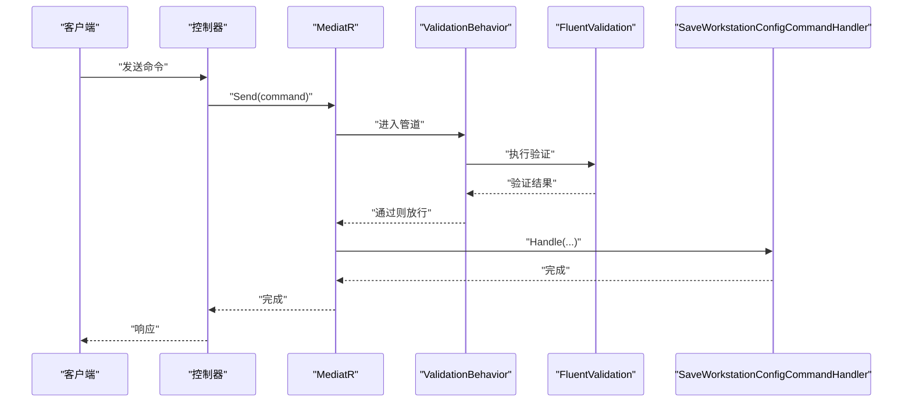
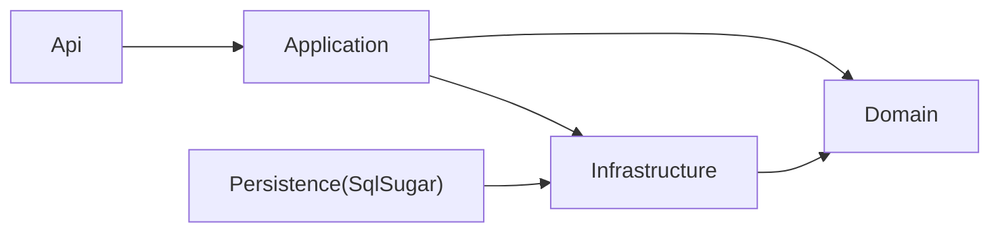

# 代码规范与最佳实践

<cite>
**本文引用的文件**
- [Program.cs](file://IndustrialDataSolution/IndustrialDataProcessor.Api/Program.cs)
- [GlobalExceptionHandler.cs](file://IndustrialDataSolution/IndustrialDataProcessor.Api/Middleware/GlobalExceptionHandler.cs)
- [RequestLoggingMiddleware.cs](file://IndustrialDataSolution/IndustrialDataProcessor.Api/Middleware/RequestLoggingMiddleware.cs)
- [DependencyInjection.cs（应用层）](file://IndustrialDataSolution/IndustrialDataProcessor.Application/DependencyInjection.cs)
- [DependencyInjection.cs（基础设施层）](file://IndustrialDataSolution/IndustrialDataProcessor.Infrastructure/DependencyInjection.cs)
- [SaveWorkstationConfigCommand.cs](file://IndustrialDataSolution/IndustrialDataProcessor.Application/Commands/SaveWorkstationConfigCommand.cs)
- [SaveWorkstationConfigCommandHandler.cs](file://IndustrialDataSolution/IndustrialDataProcessor.Application/CommandHandlers/SaveWorkstationConfigCommandHandler.cs)
- [IWorkstationConfigRepository.cs](file://IndustrialDataSolution/IndustrialDataProcessor.Domain/Repositories/IWorkstationConfigRepository.cs)
- [WorkstationConfigRepository.cs](file://IndustrialDataSolution/IndustrialDataProcessor.Infrastructure/Repositories/WorkstationConfigRepository.cs)
- [WorkstationConfigDto.cs（应用层 DTO）](file://IndustrialDataSolution/IndustrialDataProcessor.Application/Dtos/WorkstationDto/WorkstationConfigDto.cs)
- [WorkstationConfig.cs（领域模型）](file://IndustrialDataSolution/IndustrialDataProcessor.Domain/Workstation/Configs/WorkstationConfig.cs)
- [ValidationBehavior.cs](file://IndustrialDataSolution/IndustrialDataProcessor.Application/Behaviors/ValidationBehavior.cs)
- [SaveWorkstationConfigCommandValidator.cs](file://IndustrialDataSolution/IndustrialDataProcessor.Application/Validators/SaveWorkstationConfigCommandValidator.cs)
- [DataCollectionAppService.cs](file://IndustrialDataSolution/IndustrialDataProcessor.Application/Services/DataCollectionAppService.cs)
- [BaseEntity.cs](file://IndustrialDataSolution/IndustrialDataProcessor.Domain/Entities/BaseEntity.cs)
- [AppServiceException.cs](file://IndustrialDataSolution/IndustrialDataProcessor.Domain/Exceptions/AppServiceException.cs)
</cite>

## 目录
1. [引言](#引言)
2. [项目结构](#项目结构)
3. [核心组件](#核心组件)
4. [架构总览](#架构总览)
5. [详细组件分析](#详细组件分析)
6. [依赖关系分析](#依赖关系分析)
7. [性能考虑](#性能考虑)
8. [故障排查指南](#故障排查指南)
9. [结论](#结论)
10. [附录](#附录)

## 引言
本指南面向DDD工业数据处理解决方案，聚焦于C#编码规范、分层架构组织原则、设计模式落地、异常与日志、单元测试、代码审查与质量保障、性能优化与安全编码。文档以仓库现有实现为依据，提炼可复用的最佳实践，并给出可视化图示帮助理解。

## 项目结构
项目采用多项目分层组织：表现层（API）、应用层（Application）、领域层（Domain）、基础设施层（Infrastructure）、持久化扩展（Infrastructure.Persistence.SqlSugar）、共享模块（Share）及仿真器（Simulator）。各层职责清晰，依赖方向自外向内，遵循依赖倒置原则。

图表来源
- [Program.cs](file://IndustrialDataSolution/IndustrialDataProcessor.Api/Program.cs#L12-L30)
- [DependencyInjection.cs（应用层）](file://IndustrialDataSolution/IndustrialDataProcessor.Application/DependencyInjection.cs#L16-L39)
- [DependencyInjection.cs（基础设施层）](file://IndustrialDataSolution/IndustrialDataProcessor.Infrastructure/DependencyInjection.cs#L17-L79)

章节来源
- [Program.cs](file://IndustrialDataSolution/IndustrialDataProcessor.Api/Program.cs#L12-L30)
- [DependencyInjection.cs（应用层）](file://IndustrialDataSolution/IndustrialDataProcessor.Application/DependencyInjection.cs#L16-L39)
- [DependencyInjection.cs（基础设施层）](file://IndustrialDataSolution/IndustrialDataProcessor.Infrastructure/DependencyInjection.cs#L17-L79)

## 核心组件
- 表现层（API）
  - 负责HTTP请求入口、中间件链路（日志、异常处理、Swagger、健康检查）、控制器暴露端点。
  - 关键点：在构建器阶段注册应用层、基础设施层、持久化层；按顺序挂载中间件；启用Swagger与健康检查。
- 应用层（Application）
  - 职责：编排业务用例、协调仓储与领域模型、通过MediatR处理命令/查询、统一验证拦截、提供应用服务。
  - 关键点：依赖注入集中注册；验证行为作为全局拦截；应用服务以Scoped生命周期为主；进程内消息通道单例。
- 领域层（Domain）
  - 职责：承载核心业务规则、实体、枚举、异常类型、仓储接口、通信协议接口等。
  - 关键点：实体基类提供通用属性；异常分层明确；仓储接口仅暴露领域语义。
- 基础设施层（Infrastructure）
  - 职责：实现仓储、通信驱动、后台服务、OPC UA、序列化转换器、连接管理等。
  - 关键点：HslCommunication授权校验在启动阶段完成；自动扫描注册协议驱动；JSON序列化选项集中提供。
- 持久化扩展（Infrastructure.Persistence.SqlSugar）
  - 职责：基于SqlSugar实现仓储持久化，提供实体映射与仓储实现。
- 共享模块（Share）
  - 职责：跨层共享的异常与通用能力（如通信异常）。
- 仿真器（Simulator）
  - 职责：模拟设备/协议数据，辅助开发与集成测试。

章节来源
- [Program.cs](file://IndustrialDataSolution/IndustrialDataProcessor.Api/Program.cs#L12-L51)
- [DependencyInjection.cs（应用层）](file://IndustrialDataSolution/IndustrialDataProcessor.Application/DependencyInjection.cs#L16-L39)
- [DependencyInjection.cs（基础设施层）](file://IndustrialDataSolution/IndustrialDataProcessor.Infrastructure/DependencyInjection.cs#L17-L79)
- [BaseEntity.cs](file://IndustrialDataSolution/IndustrialDataProcessor.Domain/Entities/BaseEntity.cs#L3-L6)

## 架构总览
下图展示从HTTP请求到数据采集与事件发布的完整调用链，体现分层职责与依赖方向。

图表来源
- [SaveWorkstationConfigCommand.cs](file://IndustrialDataSolution/IndustrialDataProcessor.Application/Commands/SaveWorkstationConfigCommand.cs#L7-L7)
- [SaveWorkstationConfigCommandHandler.cs](file://IndustrialDataSolution/IndustrialDataProcessor.Application/CommandHandlers/SaveWorkstationConfigCommandHandler.cs#L18-L30)
- [IWorkstationConfigRepository.cs](file://IndustrialDataSolution/IndustrialDataProcessor.Domain/Repositories/IWorkstationConfigRepository.cs#L10-L11)

章节来源
- [SaveWorkstationConfigCommandHandler.cs](file://IndustrialDataSolution/IndustrialDataProcessor.Application/CommandHandlers/SaveWorkstationConfigCommandHandler.cs#L18-L30)
- [IWorkstationConfigRepository.cs](file://IndustrialDataSolution/IndustrialDataProcessor.Domain/Repositories/IWorkstationConfigRepository.cs#L10-L11)

## 详细组件分析

### 分层架构与依赖方向
- 依赖方向：表现层依赖应用层；应用层依赖领域层与基础设施层；基础设施层依赖领域层；持久化扩展依赖基础设施层。
- 职责边界：
  - 表现层：仅负责请求接入与响应输出，不包含业务逻辑。
  - 应用层：编排业务用例、统一验证、事件发布、应用服务。
  - 领域层：业务规则与不变量、实体与仓储接口。
  - 基础设施层：实现通信、驱动、后台服务、持久化、OPC UA等。
- 设计模式：
  - 依赖注入：集中注册与生命周期管理。
  - 工厂/注册表：自动扫描协议驱动并注册为单例。
  - 策略：通过接口与多实现解耦不同协议驱动。

章节来源
- [DependencyInjection.cs（应用层）](file://IndustrialDataSolution/IndustrialDataProcessor.Application/DependencyInjection.cs#L16-L39)
- [DependencyInjection.cs（基础设施层）](file://IndustrialDataSolution/IndustrialDataProcessor.Infrastructure/DependencyInjection.cs#L55-L62)

### 数据采集应用服务（并发与隔离）
- 多协议独立线程：每个协议启动独立后台循环，互不影响，提升吞吐与稳定性。
- 连接复用：通过连接管理器获取/复用连接，降低握手成本。
- 虚拟点处理：识别虚拟点直接构造占位结果，避免无效IO。
- 结果通道：采集完成后统一推送至进程内消息通道，便于下游订阅与处理。
- 错误隔离：协议级异常被捕获并记录，不影响其他协议线程。

图表来源
- [DataCollectionAppService.cs](file://IndustrialDataSolution/IndustrialDataProcessor.Application/Services/DataCollectionAppService.cs#L22-L214)

章节来源
- [DataCollectionAppService.cs](file://IndustrialDataSolution/IndustrialDataProcessor.Application/Services/DataCollectionAppService.cs#L22-L214)

### 异常处理与日志记录
- 全局异常处理：统一捕获未处理异常，按异常类型映射为RFC 7807标准的ProblemDetails响应；记录结构化日志（区分参数与业务异常）。
- 验证异常：FluentValidation错误收集为字典返回，便于前端展示。
- 业务异常：领域异常与应用异常分别映射为409与500等状态码。
- 基础设施异常：映射为503，提示外部服务不可用。

图表来源
- [GlobalExceptionHandler.cs](file://IndustrialDataSolution/IndustrialDataProcessor.Api/Middleware/GlobalExceptionHandler.cs#L12-L47)

章节来源
- [GlobalExceptionHandler.cs](file://IndustrialDataSolution/IndustrialDataProcessor.Api/Middleware/GlobalExceptionHandler.cs#L12-L47)

### 验证与命令处理（MediatR + FluentValidation）
- 命令与处理器：命令封装请求数据，处理器负责业务编排与事件发布。
- 全局验证：通过Pipeline Behavior拦截所有请求，批量执行FluentValidation验证器，统一抛出ValidationException。
- 验证器组合：命令验证器委托给DTO验证器，保持规则一致性。

图表来源
- [ValidationBehavior.cs](file://IndustrialDataSolution/IndustrialDataProcessor.Application/Behaviors/ValidationBehavior.cs#L12-L29)
- [SaveWorkstationConfigCommandValidator.cs](file://IndustrialDataSolution/IndustrialDataProcessor.Application/Validators/SaveWorkstationConfigCommandValidator.cs#L8-L11)
- [SaveWorkstationConfigCommandHandler.cs](file://IndustrialDataSolution/IndustrialDataProcessor.Application/CommandHandlers/SaveWorkstationConfigCommandHandler.cs#L18-L30)

章节来源
- [ValidationBehavior.cs](file://IndustrialDataSolution/IndustrialDataProcessor.Application/Behaviors/ValidationBehavior.cs#L12-L29)
- [SaveWorkstationConfigCommandValidator.cs](file://IndustrialDataSolution/IndustrialDataProcessor.Application/Validators/SaveWorkstationConfigCommandValidator.cs#L8-L11)
- [SaveWorkstationConfigCommandHandler.cs](file://IndustrialDataSolution/IndustrialDataProcessor.Application/CommandHandlers/SaveWorkstationConfigCommandHandler.cs#L18-L30)

### 依赖注入与生命周期
- 应用层：验证器、应用服务（Scoped）、任务管理器（Singleton）、进程内消息通道（Singleton）、MediatR注册与全局验证行为。
- 基础设施层：授权校验、仓储实现、连接管理器（Singleton）、后台服务注册、OPC UA托管服务映射、设备数据处理器（Singleton）、协议驱动自动注册、JSON序列化选项提供。

章节来源
- [DependencyInjection.cs（应用层）](file://IndustrialDataSolution/IndustrialDataProcessor.Application/DependencyInjection.cs#L16-L39)
- [DependencyInjection.cs（基础设施层）](file://IndustrialDataSolution/IndustrialDataProcessor.Infrastructure/DependencyInjection.cs#L17-L79)

### 数据序列化与领域模型转换
- 应用层：命令处理器将DTO转换为领域实体并序列化为JSON后入库。
- 基础设施层：仓储从数据库读取JSON，结合多态转换器反序列化为领域模型，异常时抛出统一错误。

章节来源
- [SaveWorkstationConfigCommandHandler.cs](file://IndustrialDataSolution/IndustrialDataProcessor.Application/CommandHandlers/SaveWorkstationConfigCommandHandler.cs#L20-L26)
- [WorkstationConfigRepository.cs](file://IndustrialDataSolution/IndustrialDataProcessor.Infrastructure/Repositories/WorkstationConfigRepository.cs#L23-L42)

## 依赖关系分析
- 组件耦合与内聚：应用层通过接口依赖领域与基础设施，降低对具体实现的耦合；基础设施层通过接口向上层暴露能力。
- 外部依赖：HslCommunication授权、MediatR、FluentValidation、System.Text.Json、Swagger、健康检查。
- 循环依赖：当前结构自外向内依赖，未见循环依赖迹象。

图表来源
- [Program.cs](file://IndustrialDataSolution/IndustrialDataProcessor.Api/Program.cs#L18-L22)
- [DependencyInjection.cs（应用层）](file://IndustrialDataSolution/IndustrialDataProcessor.Application/DependencyInjection.cs#L29-L36)
- [DependencyInjection.cs（基础设施层）](file://IndustrialDataSolution/IndustrialDataProcessor.Infrastructure/DependencyInjection.cs#L31-L46)

章节来源
- [Program.cs](file://IndustrialDataSolution/IndustrialDataProcessor.Api/Program.cs#L18-L22)
- [DependencyInjection.cs（应用层）](file://IndustrialDataSolution/IndustrialDataProcessor.Application/DependencyInjection.cs#L29-L36)
- [DependencyInjection.cs（基础设施层）](file://IndustrialDataSolution/IndustrialDataProcessor.Infrastructure/DependencyInjection.cs#L31-L46)

## 性能考虑
- 并发与隔离：协议级独立线程，避免相互阻塞；连接复用减少握手开销；最小延时避免CPU空转。
- 序列化：集中提供JSON选项，启用多态转换器；避免重复创建序列化器实例。
- 缓存：内存缓存注册，可用于热点数据缓存（需结合业务场景）。
- 日志：结构化日志记录异常上下文，避免冗余输出；采样或阈值控制高频日志。

章节来源
- [DataCollectionAppService.cs](file://IndustrialDataSolution/IndustrialDataProcessor.Application/Services/DataCollectionAppService.cs#L35-L41)
- [DataCollectionAppService.cs](file://IndustrialDataSolution/IndustrialDataProcessor.Application/Services/DataCollectionAppService.cs#L204-L210)
- [DependencyInjection.cs（基础设施层）](file://IndustrialDataSolution/IndustrialDataProcessor.Infrastructure/DependencyInjection.cs#L64-L77)
- [Program.cs](file://IndustrialDataSolution/IndustrialDataProcessor.Api/Program.cs#L14-L15)

## 故障排查指南
- 启动失败（授权码缺失或无效）：检查配置节点与授权码有效性。
- 配置解析失败：确认JSON格式与多态转换器配置；查看异常堆栈定位问题字段。
- 采集异常：关注协议级异常日志与设备耗时统计；检查驱动是否匹配协议类型。
- 业务异常：区分领域异常与应用异常，按状态码与错误信息定位原因。
- 健康检查：通过健康检查端点快速判断服务可用性。

章节来源
- [DependencyInjection.cs（基础设施层）](file://IndustrialDataSolution/IndustrialDataProcessor.Infrastructure/DependencyInjection.cs#L20-L28)
- [WorkstationConfigRepository.cs](file://IndustrialDataSolution/IndustrialDataProcessor.Infrastructure/Repositories/WorkstationConfigRepository.cs#L37-L41)
- [GlobalExceptionHandler.cs](file://IndustrialDataSolution/IndustrialDataProcessor.Api/Middleware/GlobalExceptionHandler.cs#L14-L41)
- [Program.cs](file://IndustrialDataSolution/IndustrialDataProcessor.Api/Program.cs#L47-L47)

## 结论
本项目以清晰的分层架构与依赖注入为核心，结合MediatR与FluentValidation实现职责分离与统一验证；通过协议驱动与进程内消息通道实现高并发、低耦合的数据采集；全局异常处理与结构化日志保障可观测性。建议在后续迭代中补充单元测试覆盖、完善监控指标与告警策略，并持续优化序列化与缓存策略。

## 附录

### C# 编码规范与命名约定
- 类名：采用帕斯卡命名，使用名词或名词短语，体现职责（如DataCollectionAppService）。
- 方法名：采用帕斯卡命名，使用动词或动宾短语，表达意图（如StartAllProtocolCollectionTasksAsync）。
- 变量名：采用驼峰命名，简洁明了，避免缩写（如cancellationToken）。
- 接口名：以大写字母I开头，后跟帕斯卡命名（如IWorkstationConfigRepository）。
- 命名空间：按层与功能划分（如IndustrialDataProcessor.Application.Services）。
- 文件与目录：按功能域与层组织，保持扁平清晰。

### 代码格式化与注释规范
- 格式化：统一缩进与换行，保持一致的括号风格与空行分隔。
- 注释：公共API与复杂逻辑添加XML注释；简要说明用途、参数、返回值与异常；避免显而易见的注释。

### DDD分层架构组织原则
- 表现层：只做请求/响应，不包含业务。
- 应用层：编排用例、统一验证、事件发布、应用服务。
- 领域层：业务规则与不变量、实体与仓储接口。
- 基础设施层：实现通信、驱动、后台服务、持久化。

### 设计模式应用指导
- 依赖注入：集中注册与生命周期管理，避免硬编码依赖。
- 工厂/注册表：自动扫描协议驱动并注册为单例，降低配置成本。
- 策略：通过接口与多实现解耦不同协议驱动，运行时按协议类型选择。

### 异常处理规范、日志记录与错误信息格式
- 异常处理：全局中间件统一捕获，映射为RFC 7807的ProblemDetails；区分参数、业务、应用、基础设施与未知异常。
- 日志记录：结构化日志包含路径、方法、消息与异常堆栈；高频日志需节流。
- 错误信息：包含状态码、标题、详情与实例路径；验证错误返回属性到错误数组的字典。

章节来源
- [GlobalExceptionHandler.cs](file://IndustrialDataSolution/IndustrialDataProcessor.Api/Middleware/GlobalExceptionHandler.cs#L12-L92)

### 单元测试编写规范
- 测试命名：采用“方法名_输入条件_期望结果”的结构，例如StartAllProtocolCollectionTasksAsync_无配置_记录警告。
- 断言模式：使用明确的断言描述与最小断言集合；对异步方法使用Task.Wait或超时断言。
- 测试数据准备：使用工厂或Fixture创建最小可运行的测试数据；对外部依赖使用Mock或Fake。

### 代码审查检查清单
- 分层职责：是否严格遵守自外向内依赖？
- 依赖注入：生命周期是否合理？是否遗漏注册？
- 异常处理：是否覆盖所有异常分支？日志是否充分？
- 并发与资源：是否避免共享可变状态？是否释放资源？
- 性能与可维护性：是否过度设计？是否引入不必要的复杂度？

### 性能优化最佳实践
- 并发：协议级独立线程、连接复用、最小延时。
- 序列化：集中提供选项、启用多态转换器、避免重复实例化。
- 缓存：内存缓存与热点数据缓存结合使用。
- 监控：健康检查、指标埋点与告警联动。

### 安全编码指导
- 配置安全：授权码与敏感配置通过环境变量或密钥管理服务注入。
- 输入验证：前端与后端双重验证，拒绝非法字符与越界数据。
- 权限控制：基于角色的访问控制（RBAC）与最小权限原则。
- 日志脱敏：避免记录敏感信息；对日志进行脱敏处理。