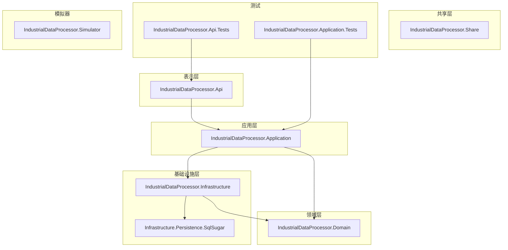
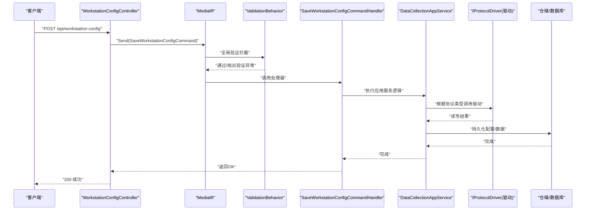
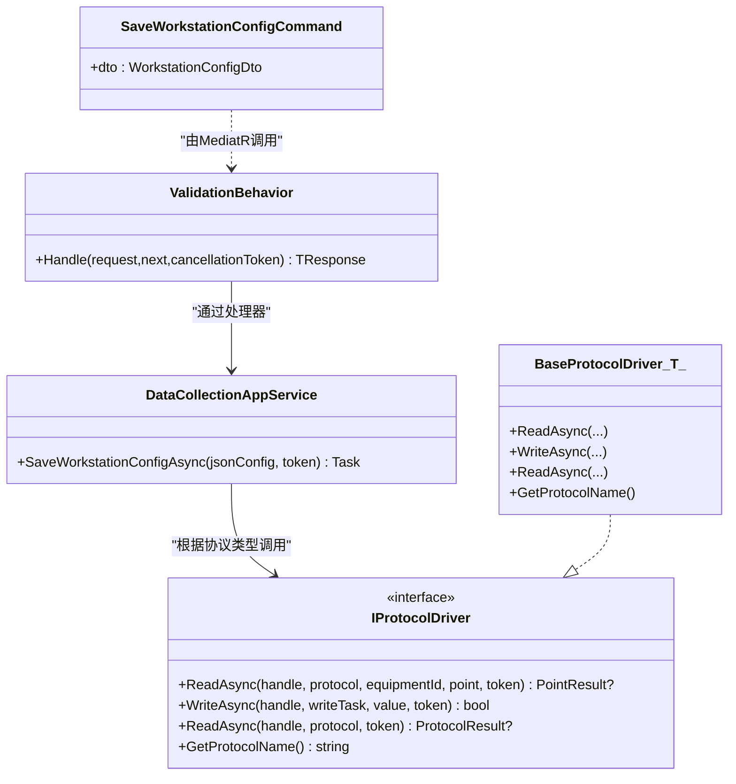
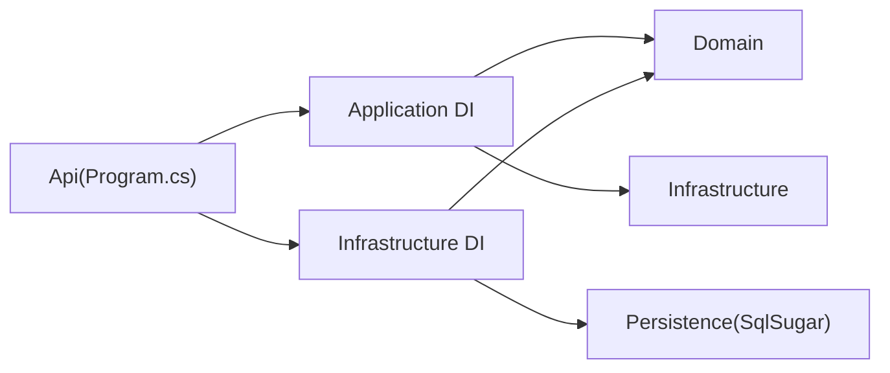

# 开发指南

<cite>
**本文引用的文件**
- [Program.cs](file://IndustrialDataSolution/IndustrialDataProcessor.Api/Program.cs)
- [WorkstationConfigController.cs](file://IndustrialDataSolution/IndustrialDataProcessor.Api/Controllers/WorkstationConfigController.cs)
- [DependencyInjection.cs（应用层）](file://IndustrialDataSolution/IndustrialDataProcessor.Application/DependencyInjection.cs)
- [DependencyInjection.cs（基础设施层）](file://IndustrialDataSolution/IndustrialDataProcessor.Infrastructure/DependencyInjection.cs)
- [BaseEntity.cs](file://IndustrialDataSolution/IndustrialDataProcessor.Domain/Entities/BaseEntity.cs)
- [ProtocolType.cs](file://IndustrialDataSolution/IndustrialDataProcessor.Domain/Enums/ProtocolType.cs)
- [SaveWorkstationConfigCommand.cs](file://IndustrialDataSolution/IndustrialDataProcessor.Application/Commands/SaveWorkstationConfigCommand.cs)
- [ValidationBehavior.cs](file://IndustrialDataSolution/IndustrialDataSolution/IndustrialDataProcessor.Application/Behaviors/ValidationBehavior.cs)
- [BaseProtocolDriver.cs](file://IndustrialDataSolution/IndustrialDataProcessor.Infrastructure/Communication/Drivers/TcpCommon/BaseProtocolDriver.cs)
- [WorkstationConfig.cs](file://IndustrialDataSolution/IndustrialDataProcessor.Domain/Workstation/Configs/WorkstationConfig.cs)
- [appsettings.json](file://IndustrialDataSolution/IndustrialDataProcessor.Api/appsettings.json)
- [WorkstationConfigApiTests.cs](file://IndustrialDataSolution/IndustrialDataProcessor.Api.Tests/Integration/WorkstationConfigApiTests.cs)
- [WorkstationConfigServiceTests.cs](file://IndustrialDataSolution/IndustrialDataProcessor.Application.Test/Services/WorkstationConfigServiceTests.cs)
</cite>

## 目录
1. [简介](#简介)
2. [项目结构](#项目结构)
3. [核心组件](#核心组件)
4. [架构总览](#架构总览)
5. [详细组件分析](#详细组件分析)
6. [依赖关系分析](#依赖关系分析)
7. [性能考虑](#性能考虑)
8. [故障排查指南](#故障排查指南)
9. [结论](#结论)
10. [附录](#附录)

## 简介
本指南面向DDD工业数据处理解决方案的开发团队，提供从环境搭建、代码规范、Git工作流、新功能开发流程、扩展开发方法、调试与问题排查、到重构与架构演进的系统性指导。文档以仓库中的实际代码为依据，结合架构分层与设计模式，帮助开发者快速上手并高质量交付。

## 项目结构
项目采用多项目解决方案，按领域驱动设计（DDD）分层组织：
- 表示层：IndustrialDataProcessor.Api（ASP.NET Core Web API）
- 应用层：IndustrialDataProcessor.Application（命令、事件、行为、服务、验证器）
- 领域层：IndustrialDataProcessor.Domain（实体、枚举、仓储接口、异常）
- 基础设施层：IndustrialDataProcessor.Infrastructure（通信驱动、后台服务、序列化转换器、仓储实现）
- 持久化层：IndustrialDataProcessor.Infrastructure.Persistence.SqlSugar（基于SqlSugar的仓储实现）
- 共享层：IndustrialDataProcessor.Share（共享异常等）
- 模拟器：IndustrialDataProcessor.Simulator（模拟设备/协议）
- 测试：Api与Application分别提供集成与单元测试项目

图表来源
- [Program.cs](file://IndustrialDataSolution/IndustrialDataProcessor.Api/Program.cs#L1-L54)
- [DependencyInjection.cs（应用层）](file://IndustrialDataSolution/IndustrialDataProcessor.Application/DependencyInjection.cs#L1-L40)
- [DependencyInjection.cs（基础设施层）](file://IndustrialDataSolution/IndustrialDataProcessor.Infrastructure/DependencyInjection.cs#L1-L82)

章节来源
- [Program.cs](file://IndustrialDataSolution/IndustrialDataProcessor.Api/Program.cs#L1-L54)
- [DependencyInjection.cs（应用层）](file://IndustrialDataSolution/IndustrialDataProcessor.Application/DependencyInjection.cs#L1-L40)
- [DependencyInjection.cs（基础设施层）](file://IndustrialDataSolution/IndustrialDataProcessor.Infrastructure/DependencyInjection.cs#L1-L82)

## 核心组件
- 表示层入口与中间件链：Program.cs负责构建WebApplicationBuilder，注册应用/基础设施/持久化服务、健康检查、Swagger、控制器、全局异常处理与请求日志中间件。
- 控制器：WorkstationConfigController接收HTTP请求，封装为命令并通过MediatR派发。
- 应用层：依赖注入注册验证器、应用服务、MediatR及全局验证行为；命令为SaveWorkstationConfigCommand。
- 领域层：WorkstationConfig实体、ProtocolType枚举、基础实体BaseEntity。
- 基础设施层：IProtocolDriver抽象驱动基类BaseProtocolDriver，自动注册所有驱动实现；连接管理器、OPC UA托管服务、设备数据处理组件等。
- 配置：appsettings.json提供连接串与HSL授权码。

章节来源
- [Program.cs](file://IndustrialDataSolution/IndustrialDataProcessor.Api/Program.cs#L10-L52)
- [WorkstationConfigController.cs](file://IndustrialDataSolution/IndustrialDataProcessor.Api/Controllers/WorkstationConfigController.cs#L1-L22)
- [DependencyInjection.cs（应用层）](file://IndustrialDataSolution/IndustrialDataProcessor.Application/DependencyInjection.cs#L16-L39)
- [DependencyInjection.cs（基础设施层）](file://IndustrialDataSolution/IndustrialDataProcessor.Infrastructure/DependencyInjection.cs#L17-L80)
- [BaseEntity.cs](file://IndustrialDataSolution/IndustrialDataProcessor.Domain/Entities/BaseEntity.cs#L1-L7)
- [ProtocolType.cs](file://IndustrialDataSolution/IndustrialDataProcessor.Domain/Enums/ProtocolType.cs#L1-L231)
- [SaveWorkstationConfigCommand.cs](file://IndustrialDataSolution/IndustrialDataProcessor.Application/Commands/SaveWorkstationConfigCommand.cs#L1-L9)
- [BaseProtocolDriver.cs](file://IndustrialDataSolution/IndustrialDataProcessor.Infrastructure/Communication/Drivers/TcpCommon/BaseProtocolDriver.cs#L1-L108)
- [WorkstationConfig.cs](file://IndustrialDataSolution/IndustrialDataProcessor.Domain/Workstation/Configs/WorkstationConfig.cs#L1-L27)
- [appsettings.json](file://IndustrialDataSolution/IndustrialDataProcessor.Api/appsettings.json#L1-L17)

## 架构总览
下图展示从HTTP请求到命令处理、验证、应用服务、仓储与协议驱动的整体流程。

图表来源
- [WorkstationConfigController.cs](file://IndustrialDataSolution/IndustrialDataProcessor.Api/Controllers/WorkstationConfigController.cs#L10-L21)
- [SaveWorkstationConfigCommand.cs](file://IndustrialDataSolution/IndustrialDataProcessor.Application/Commands/SaveWorkstationConfigCommand.cs#L7-L8)
- [ValidationBehavior.cs](file://IndustrialDataSolution/IndustrialDataProcessor.Application/Behaviors/ValidationBehavior.cs#L9-L30)
- [DependencyInjection.cs（应用层）](file://IndustrialDataSolution/IndustrialDataProcessor.Application/DependencyInjection.cs#L29-L36)
- [BaseProtocolDriver.cs](file://IndustrialDataSolution/IndustrialDataProcessor.Infrastructure/Communication/Drivers/TcpCommon/BaseProtocolDriver.cs#L26-L81)

## 详细组件分析

### 表示层与中间件链
- 中间件顺序：请求日志中间件 → 全局异常处理 → Swagger → 授权 → 控制器路由。
- 服务注册：应用层、基础设施层、持久化层、健康检查、Swagger、控制器、MediatR、全局验证行为。
- 启动安全：要求配置HSL授权码并在启动阶段校验。

章节来源
- [Program.cs](file://IndustrialDataSolution/IndustrialDataProcessor.Api/Program.cs#L14-L51)
- [appsettings.json](file://IndustrialDataSolution/IndustrialDataProcessor.Api/appsettings.json#L13-L15)

### 控制器与命令
- 控制器接收DTO，封装为命令并交由MediatR处理。
- 命令为只读记录类型，便于不可变传递。

章节来源
- [WorkstationConfigController.cs](file://IndustrialDataSolution/IndustrialDataProcessor.Api/Controllers/WorkstationConfigController.cs#L10-L21)
- [SaveWorkstationConfigCommand.cs](file://IndustrialDataSolution/IndustrialDataProcessor.Application/Commands/SaveWorkstationConfigCommand.cs#L7-L8)

### 应用层与验证
- 依赖注入：注册验证器、应用服务、MediatR、全局验证行为。
- 验证行为：对所有进入MediatR的请求执行FluentValidation验证，聚合失败后统一抛出ValidationException。

章节来源
- [DependencyInjection.cs（应用层）](file://IndustrialDataSolution/IndustrialDataProcessor.Application/DependencyInjection.cs#L21-L36)
- [ValidationBehavior.cs](file://IndustrialDataSolution/IndustrialDataProcessor.Application/Behaviors/ValidationBehavior.cs#L9-L30)

### 领域模型与协议
- WorkstationConfig实体：包含边缘标识、名称、IP、协议集合等。
- ProtocolType枚举：集中定义协议类型、接口类型、参数校验规则等元数据，用于驱动选择与参数校验。

章节来源
- [WorkstationConfig.cs](file://IndustrialDataSolution/IndustrialDataProcessor.Domain/Workstation/Configs/WorkstationConfig.cs#L6-L27)
- [ProtocolType.cs](file://IndustrialDataSolution/IndustrialDataProcessor.Domain/Enums/ProtocolType.cs#L9-L231)

### 基础设施层与协议驱动
- IProtocolDriver抽象基类：提供统一的读写流程编排、并发锁、异常包装、协议名提取等。
- 自动注册：扫描实现IProtocolDriver的非抽象类并注册为单例，便于扩展新协议驱动。
- 连接管理：IConnectionManager单例，配合通道锁避免并发冲突。

章节来源
- [BaseProtocolDriver.cs](file://IndustrialDataSolution/IndustrialDataProcessor.Infrastructure/Communication/Drivers/TcpCommon/BaseProtocolDriver.cs#L12-L108)
- [DependencyInjection.cs（基础设施层）](file://IndustrialDataSolution/IndustrialDataProcessor.Infrastructure/DependencyInjection.cs#L55-L62)

### 配置与启动约束
- appsettings.json：包含数据库连接串与HSL授权码节点，启动时进行授权校验，缺失或无效将阻止应用启动。

章节来源
- [appsettings.json](file://IndustrialDataSolution/IndustrialDataProcessor.Api/appsettings.json#L10-L15)
- [DependencyInjection.cs（基础设施层）](file://IndustrialDataSolution/IndustrialDataProcessor.Infrastructure/DependencyInjection.cs#L19-L28)

### 类关系图（应用层与基础设施层）

图表来源
- [SaveWorkstationConfigCommand.cs](file://IndustrialDataSolution/IndustrialDataProcessor.Application/Commands/SaveWorkstationConfigCommand.cs#L7-L8)
- [ValidationBehavior.cs](file://IndustrialDataSolution/IndustrialDataProcessor.Application/Behaviors/ValidationBehavior.cs#L9-L30)
- [BaseProtocolDriver.cs](file://IndustrialDataSolution/IndustrialDataProcessor.Infrastructure/Communication/Drivers/TcpCommon/BaseProtocolDriver.cs#L12-L108)

## 依赖关系分析
- 分层依赖：表示层依赖应用层；应用层依赖领域层与基础设施层；基础设施层依赖领域层与持久化层。
- 服务生命周期：应用服务为Scoped，验证器与处理器由MediatR注册；驱动与连接管理器为Singleton，提升复用与性能。
- 自动发现：基础设施层扫描IProtocolDriver实现并注册，便于扩展新协议。

图表来源
- [Program.cs](file://IndustrialDataSolution/IndustrialDataProcessor.Api/Program.cs#L19-L22)
- [DependencyInjection.cs（应用层）](file://IndustrialDataSolution/IndustrialDataProcessor.Application/DependencyInjection.cs#L16-L39)
- [DependencyInjection.cs（基础设施层）](file://IndustrialDataSolution/IndustrialDataProcessor.Infrastructure/DependencyInjection.cs#L17-L80)

章节来源
- [Program.cs](file://IndustrialDataSolution/IndustrialDataProcessor.Api/Program.cs#L19-L22)
- [DependencyInjection.cs（应用层）](file://IndustrialDataSolution/IndustrialDataProcessor.Application/DependencyInjection.cs#L16-L39)
- [DependencyInjection.cs（基础设施层）](file://IndustrialDataSolution/IndustrialDataProcessor.Infrastructure/DependencyInjection.cs#L17-L80)

## 性能考虑
- 单例驱动与连接管理：协议驱动与连接管理器注册为Singleton，减少对象创建开销。
- 并发控制：驱动读写前获取通道锁，避免同通道并发冲突。
- 序列化选项：统一Json序列化配置，包含大小写与属性命名策略，减少解析差异带来的性能损耗。
- 启动校验：HSL授权码缺失或无效即终止启动，避免运行期异常与资源浪费。

章节来源
- [DependencyInjection.cs（基础设施层）](file://IndustrialDataSolution/IndustrialDataProcessor.Infrastructure/DependencyInjection.cs#L55-L77)
- [BaseProtocolDriver.cs](file://IndustrialDataSolution/IndustrialDataProcessor.Infrastructure/Communication/Drivers/TcpCommon/BaseProtocolDriver.cs#L30-L60)
- [DependencyInjection.cs（基础设施层）](file://IndustrialDataSolution/IndustrialDataProcessor.Infrastructure/DependencyInjection.cs#L19-L28)

## 故障排查指南
- 启动失败（HSL授权）：检查appsettings.json中HslCommunication:AuthorizationCode是否存在且有效。
- API 400/415：确认请求体格式正确、媒体类型匹配；参考集成测试用例覆盖的边界场景。
- API 500：全局异常处理中间件会捕获未处理异常，查看日志定位具体异常来源。
- 验证失败：全局验证行为会收集所有验证器失败项，结合控制器返回的ProblemDetails定位字段。
- 单元测试与集成测试：参考Api与Application测试项目，验证边界条件与异常路径。

章节来源
- [appsettings.json](file://IndustrialDataSolution/IndustrialDataProcessor.Api/appsettings.json#L13-L15)
- [WorkstationConfigApiTests.cs](file://IndustrialDataSolution/IndustrialDataProcessor.Api.Tests/Integration/WorkstationConfigApiTests.cs#L227-L268)
- [WorkstationConfigServiceTests.cs](file://IndustrialDataSolution/IndustrialDataProcessor.Application.Test/Services/WorkstationConfigServiceTests.cs#L68-L138)

## 结论
本指南基于仓库现有代码，梳理了分层架构、关键组件职责、依赖关系与运行流程，并提供了开发、测试、调试与扩展的实操建议。遵循本文档可显著提升开发效率与质量，确保新功能与扩展在既有架构下稳定演进。

## 附录

### 开发环境搭建（建议）
- IDE：推荐使用Visual Studio或VS Code，启用C#扩展与装箱提示。
- SDK：安装与项目目标框架一致的.NET SDK。
- 调试工具：使用浏览器或Postman进行API调试；利用断点与日志定位问题。
- 版本控制：使用Git，遵循后续章节的分支与工作流策略。

### 代码规范与最佳实践
- 命名约定：类/接口使用帕斯卡命名；方法/属性使用帕斯卡命名；常量使用帕斯卡命名；私有字段以下划线开头（如适用）。
- 代码结构：按层划分项目，保持清晰的依赖方向；命令/查询/事件分离；验证器与处理器职责单一。
- 注释标准：公共API与关键流程添加XML注释；复杂算法与策略添加行内注释说明动机与边界。
- 设计模式应用：使用MediatR实现命令/查询解耦；使用行为管道（ValidationBehavior）统一验证；使用抽象基类（BaseProtocolDriver）统一协议读写流程。

### Git工作流程与分支管理
- 分支策略：主分支保护，功能开发在feature/*分支；修复hotfix/*分支；发布release/*分支。
- 提交规范：简短主题+详细描述；关联Issue编号；变更粒度适中，附带测试。
- 代码审查：PR需至少一名Reviewer同意；关注架构一致性、性能影响与测试覆盖。
- 合并流程：squash合并保持历史整洁；合并前确保CI通过与本地测试通过。

### 新功能开发流程（从需求到上线）
- 需求分析：明确领域边界与用户故事，识别相关实体/命令/事件。
- 设计评审：输出DTO/命令/验证器草稿；评估对协议/驱动的影响。
- 编码实现：按层实现，先写测试；遵循依赖注入与分层依赖方向。
- 测试验证：补充单元/集成测试，覆盖正常与异常路径。
- 文档更新：更新API文档与README；必要时更新架构图。
- 回归与发布：在预生产环境验证；通过后合并至主分支并打标签发布。

### 扩展开发指导
- 新协议支持：实现IProtocolDriver接口，命名遵循“协议名Driver”；在基础设施层DI中自动注册生效。
- 新功能模块：在应用层新增命令/处理器/验证器；在领域层扩展实体/枚举；在基础设施层扩展驱动或服务。
- 第三方集成：在基础设施层封装外部SDK，暴露领域接口；在DI中注册生命周期合理的服务。

### 调试技巧与问题排查
- 日志分析：开启详细日志，关注请求链路与异常堆栈；结合Swagger验证请求格式。
- 性能分析：使用性能分析器定位瓶颈；关注序列化、并发锁与数据库连接池。
- 异常定位：利用全局异常处理中间件与验证行为，快速定位失败原因。

### 代码重构与架构演进
- 重构原则：保持向后兼容；逐步替换；增加测试覆盖；保持分层清晰。
- 架构演进：引入CQRS/事件溯源（视需要）；优化协议驱动扩展点；增强监控与可观测性。