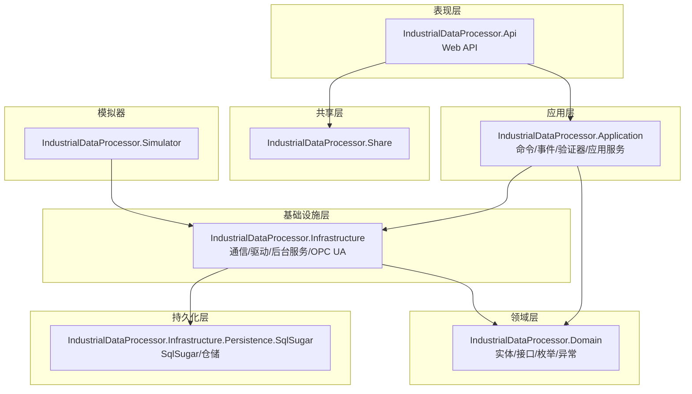
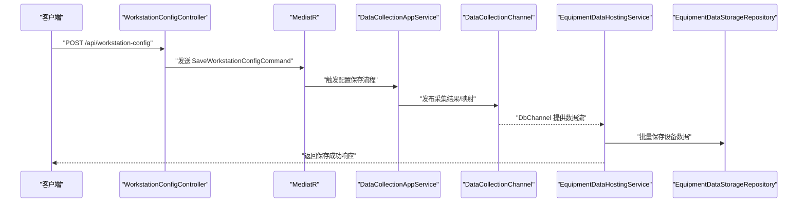
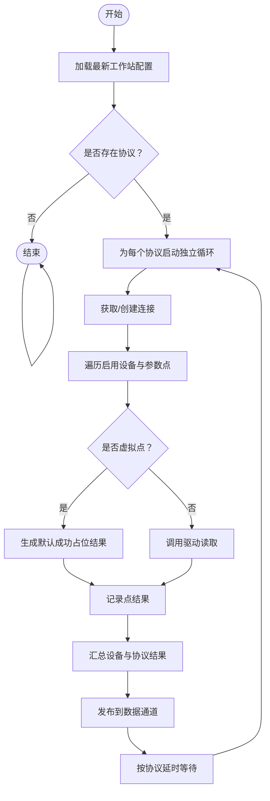
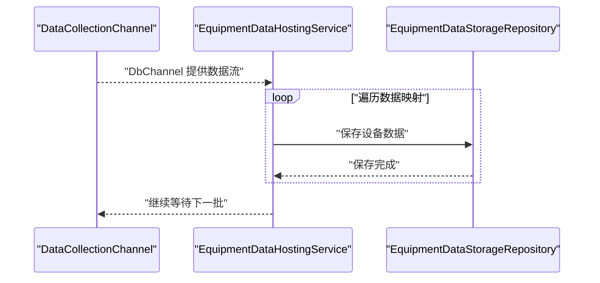
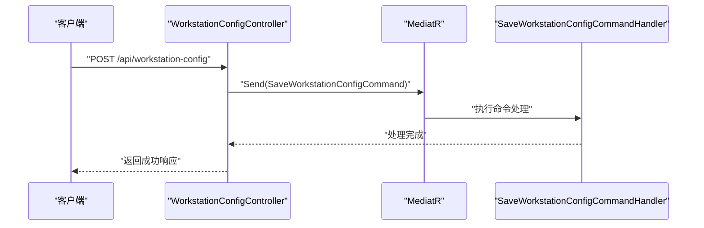
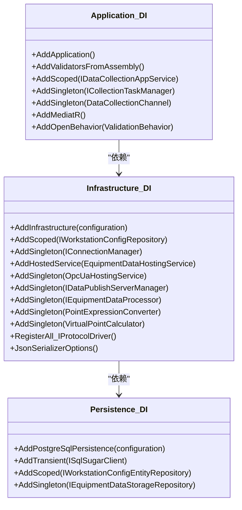
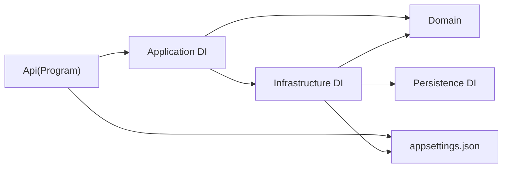

# 开发流程与工作流

<cite>
**本文引用的文件**
- [.gitignore](file://.gitignore)
- [.gitattributes](file://.gitattributes)
- [Program.cs](file://IndustrialDataSolution/IndustrialDataProcessor.Api/Program.cs)
- [appsettings.json](file://IndustrialDataSolution/IndustrialDataProcessor.Api/appsettings.json)
- [appsettings.Development.json](file://IndustrialDataSolution/IndustrialDataProcessor.Api/appsettings.Development.json)
- [launchSettings.json](file://IndustrialDataSolution/IndustrialDataProcessor.Api/Properties/launchSettings.json)
- [DependencyInjection.cs（应用层）](file://IndustrialDataSolution/IndustrialDataProcessor.Application/DependencyInjection.cs)
- [DependencyInjection.cs（基础设施层）](file://IndustrialDataSolution/IndustrialDataProcessor.Infrastructure/DependencyInjection.cs)
- [DependencyInjection.cs（持久化层）](file://IndustrialDataSolution/IndustrialDataProcessor.Infrastructure.Persistence.SqlSugar/DependencyInjection.cs)
- [DataCollectionAppService.cs](file://IndustrialDataSolution/IndustrialDataProcessor.Application/Services/DataCollectionAppService.cs)
- [EquipmentDataHostingService.cs](file://IndustrialDataSolution/IndustrialDataProcessor.Infrastructure/BackgroundServices/EquipmentDataHostingService.cs)
- [WorkstationConfigController.cs](file://IndustrialDataSolution/IndustrialDataProcessor.Api/Controllers/WorkstationConfigController.cs)
- [SaveWorkstationConfigCommand.cs](file://IndustrialDataSolution/IndustrialDataProcessor.Application/Commands/SaveWorkstationConfigCommand.cs)
- [WorkstationConfig.cs](file://IndustrialDataSolution/IndustrialDataProcessor.Domain/Workstation/Configs/WorkstationConfig.cs)
</cite>

## 目录
1. [引言](#引言)
2. [项目结构](#项目结构)
3. [核心组件](#核心组件)
4. [架构总览](#架构总览)
5. [详细组件分析](#详细组件分析)
6. [依赖关系分析](#依赖关系分析)
7. [性能考虑](#性能考虑)
8. [故障排查指南](#故障排查指南)
9. [结论](#结论)
10. [附录](#附录)

## 引言
本文件面向DDD工业数据处理解决方案的开发团队，提供一套完整的开发流程与工作流指导，覆盖Git分支与提交规范、功能开发全生命周期、代码审查流程、CI/CD实践、版本控制最佳实践、问题跟踪与任务管理以及团队协作规范。内容基于仓库现有代码结构与配置进行提炼，确保与实际工程一致。

## 项目结构
项目采用多项目解决方案组织，按领域驱动设计分层：
- 表现层：IndustrialDataProcessor.Api（ASP.NET Core Web API）
- 应用层：IndustrialDataProcessor.Application（命令、事件、验证器、应用服务、依赖注入）
- 领域层：IndustrialDataProcessor.Domain（实体、枚举、接口、异常、工作台配置模型）
- 基础设施层：IndustrialDataProcessor.Infrastructure（通信、驱动、后台服务、OPC UA、依赖注入）
- 持久化层：IndustrialDataProcessor.Infrastructure.Persistence.SqlSugar（SqlSugar集成、仓储实现）
- 共享层：IndustrialDataProcessor.Share（共享异常等）
- 模拟器：IndustrialDataProcessor.Simulator（模拟数据采集）

图表来源
- [Program.cs](file://IndustrialDataSolution/IndustrialDataProcessor.Api/Program.cs#L1-L54)
- [DependencyInjection.cs（应用层）](file://IndustrialDataSolution/IndustrialDataProcessor.Application/DependencyInjection.cs#L1-L40)
- [DependencyInjection.cs（基础设施层）](file://IndustrialDataSolution/IndustrialDataProcessor.Infrastructure/DependencyInjection.cs#L1-L82)
- [DependencyInjection.cs（持久化层）](file://IndustrialDataSolution/IndustrialDataProcessor.Infrastructure.Persistence.SqlSugar/DependencyInjection.cs#L1-L47)

章节来源
- [Program.cs](file://IndustrialDataSolution/IndustrialDataProcessor.Api/Program.cs#L1-L54)
- [DependencyInjection.cs（应用层）](file://IndustrialDataSolution/IndustrialDataProcessor.Application/DependencyInjection.cs#L1-L40)
- [DependencyInjection.cs（基础设施层）](file://IndustrialDataSolution/IndustrialDataProcessor.Infrastructure/DependencyInjection.cs#L1-L82)
- [DependencyInjection.cs（持久化层）](file://IndustrialDataSolution/IndustrialDataProcessor.Infrastructure.Persistence.SqlSugar/DependencyInjection.cs#L1-L47)

## 核心组件
- 启动与中间件管线：应用在Program中完成服务注册、健康检查、Swagger、异常处理与中间件顺序配置。
- 依赖注入：应用层注册MediatR、验证器、应用服务与全局验证行为；基础设施层注册通信驱动、连接管理器、后台服务与OPC UA发布服务；持久化层注册SqlSugar客户端与仓储。
- 数据采集与处理：应用服务负责协议级独立采集循环、驱动调用、结果聚合与通道发布；基础设施后台服务消费通道并将设备数据持久化。
- 控制器与命令：控制器接收HTTP请求，封装为命令并通过MediatR传递至应用层。

章节来源
- [Program.cs](file://IndustrialDataSolution/IndustrialDataProcessor.Api/Program.cs#L10-L51)
- [DependencyInjection.cs（应用层）](file://IndustrialDataSolution/IndustrialDataProcessor.Application/DependencyInjection.cs#L16-L39)
- [DependencyInjection.cs（基础设施层）](file://IndustrialDataSolution/IndustrialDataProcessor.Infrastructure/DependencyInjection.cs#L17-L81)
- [DependencyInjection.cs（持久化层）](file://IndustrialDataSolution/IndustrialDataProcessor.Infrastructure.Persistence.SqlSugar/DependencyInjection.cs#L11-L46)
- [DataCollectionAppService.cs](file://IndustrialDataSolution/IndustrialDataProcessor.Application/Services/DataCollectionAppService.cs#L22-L214)
- [EquipmentDataHostingService.cs](file://IndustrialDataSolution/IndustrialDataProcessor.Infrastructure/BackgroundServices/EquipmentDataHostingService.cs#L16-L41)
- [WorkstationConfigController.cs](file://IndustrialDataSolution/IndustrialDataProcessor.Api/Controllers/WorkstationConfigController.cs#L14-L21)
- [SaveWorkstationConfigCommand.cs](file://IndustrialDataSolution/IndustrialDataProcessor.Application/Commands/SaveWorkstationConfigCommand.cs#L7-L8)

## 架构总览
系统采用分层架构与事件驱动思想：
- 表现层通过控制器接收请求，使用MediatR解耦命令与处理逻辑。
- 应用层负责编排业务流程、触发事件与调用基础设施服务。
- 领域层定义实体、接口与规则，确保业务不变量。
- 基础设施层提供通信、驱动、后台服务与OPC UA发布能力。
- 持久化层通过SqlSugar访问数据库，实现设备数据存储。

图表来源
- [WorkstationConfigController.cs](file://IndustrialDataSolution/IndustrialDataProcessor.Api/Controllers/WorkstationConfigController.cs#L14-L21)
- [SaveWorkstationConfigCommand.cs](file://IndustrialDataSolution/IndustrialDataProcessor.Application/Commands/SaveWorkstationConfigCommand.cs#L7-L8)
- [DataCollectionAppService.cs](file://IndustrialDataSolution/IndustrialDataProcessor.Application/Services/DataCollectionAppService.cs#L22-L214)
- [EquipmentDataHostingService.cs](file://IndustrialDataSolution/IndustrialDataProcessor.Infrastructure/BackgroundServices/EquipmentDataHostingService.cs#L21-L35)

## 详细组件分析

### 组件A：数据采集应用服务（DataCollectionAppService）
职责与流程：
- 加载最新工作站配置，遍历协议配置，为每个协议启动独立的后台采集循环。
- 通过连接管理器获取或创建连接，逐点读取数据，区分真实点与虚拟点。
- 使用设备数据处理器对协议结果进行加工与映射，发布到进程内数据通道。
- 按协议各自延时进行下一轮采集，异常被捕获并记录，不影响其他协议线程。

图表来源
- [DataCollectionAppService.cs](file://IndustrialDataSolution/IndustrialDataProcessor.Application/Services/DataCollectionAppService.cs#L22-L214)

章节来源
- [DataCollectionAppService.cs](file://IndustrialDataSolution/IndustrialDataProcessor.Application/Services/DataCollectionAppService.cs#L10-L216)

### 组件B：设备数据持久化后台服务（EquipmentDataHostingService）
职责与流程：
- 从数据通道的数据库通道读取数据映射集合。
- 对每条映射进行存储，异常记录日志以便排查。
- 响应停止令牌优雅退出。

图表来源
- [EquipmentDataHostingService.cs](file://IndustrialDataSolution/IndustrialDataProcessor.Infrastructure/BackgroundServices/EquipmentDataHostingService.cs#L16-L41)

章节来源
- [EquipmentDataHostingService.cs](file://IndustrialDataSolution/IndustrialDataProcessor.Infrastructure/BackgroundServices/EquipmentDataHostingService.cs#L9-L42)

### 组件C：控制器与命令（WorkstationConfigController 与 SaveWorkstationConfigCommand）
职责与流程：
- 控制器接收HTTP请求，封装为命令并交由MediatR处理。
- 命令作为轻量载体，承载DTO与请求上下文。

图表来源
- [WorkstationConfigController.cs](file://IndustrialDataSolution/IndustrialDataProcessor.Api/Controllers/WorkstationConfigController.cs#L14-L21)
- [SaveWorkstationConfigCommand.cs](file://IndustrialDataSolution/IndustrialDataProcessor.Application/Commands/SaveWorkstationConfigCommand.cs#L7-L8)

章节来源
- [WorkstationConfigController.cs](file://IndustrialDataSolution/IndustrialDataProcessor.Api/Controllers/WorkstationConfigController.cs#L10-L21)
- [SaveWorkstationConfigCommand.cs](file://IndustrialDataSolution/IndustrialDataProcessor.Application/Commands/SaveWorkstationConfigCommand.cs#L7-L8)

### 组件D：依赖注入与服务注册
- 应用层：注册验证器、应用服务、全局验证行为、MediatR。
- 基础设施层：注册连接管理器、通信驱动、后台服务、OPC UA发布服务、序列化选项。
- 持久化层：注册SqlSugar客户端与仓储实现。

图表来源
- [DependencyInjection.cs（应用层）](file://IndustrialDataSolution/IndustrialDataProcessor.Application/DependencyInjection.cs#L16-L39)
- [DependencyInjection.cs（基础设施层）](file://IndustrialDataSolution/IndustrialDataProcessor.Infrastructure/DependencyInjection.cs#L17-L81)
- [DependencyInjection.cs（持久化层）](file://IndustrialDataSolution/IndustrialDataProcessor.Infrastructure.Persistence.SqlSugar/DependencyInjection.cs#L11-L46)

章节来源
- [DependencyInjection.cs（应用层）](file://IndustrialDataSolution/IndustrialDataProcessor.Application/DependencyInjection.cs#L11-L39)
- [DependencyInjection.cs（基础设施层）](file://IndustrialDataSolution/IndustrialDataProcessor.Infrastructure/DependencyInjection.cs#L15-L81)
- [DependencyInjection.cs（持久化层）](file://IndustrialDataSolution/IndustrialDataProcessor.Infrastructure.Persistence.SqlSugar/DependencyInjection.cs#L9-L46)

## 依赖关系分析
- 分层依赖：表现层依赖应用层；应用层依赖领域层与基础设施层；基础设施层依赖领域层与持久化层；持久化层依赖数据库。
- 运行时依赖：应用服务依赖连接管理器、驱动集合、数据通道与设备数据处理器；后台服务依赖数据通道与存储仓储。
- 配置依赖：应用启动读取配置文件，基础设施层校验授权码并初始化通信库。

图表来源
- [Program.cs](file://IndustrialDataSolution/IndustrialDataProcessor.Api/Program.cs#L12-L30)
- [appsettings.json](file://IndustrialDataSolution/IndustrialDataProcessor.Api/appsettings.json#L10-L15)
- [DependencyInjection.cs（基础设施层）](file://IndustrialDataSolution/IndustrialDataProcessor.Infrastructure/DependencyInjection.cs#L19-L28)

章节来源
- [Program.cs](file://IndustrialDataSolution/IndustrialDataProcessor.Api/Program.cs#L12-L30)
- [appsettings.json](file://IndustrialDataSolution/IndustrialDataProcessor.Api/appsettings.json#L1-L17)
- [DependencyInjection.cs（基础设施层）](file://IndustrialDataSolution/IndustrialDataProcessor.Infrastructure/DependencyInjection.cs#L17-L28)

## 性能考虑
- 协议级独立线程：每个协议拥有独立后台循环，互不影响，提升并发与稳定性。
- 延时控制：按协议配置延时，避免CPU占用过高。
- 连接复用：通过连接管理器统一获取/创建连接，减少重复开销。
- 序列化优化：统一Json序列化选项，避免大小写与命名策略差异带来的性能损耗。
- 存储批处理：后台服务从通道读取并批量持久化，降低IO压力。

章节来源
- [DataCollectionAppService.cs](file://IndustrialDataSolution/IndustrialDataProcessor.Application/Services/DataCollectionAppService.cs#L35-L41)
- [DataCollectionAppService.cs](file://IndustrialDataSolution/IndustrialDataProcessor.Application/Services/DataCollectionAppService.cs#L204-L211)
- [DependencyInjection.cs（基础设施层）](file://IndustrialDataSolution/IndustrialDataProcessor.Infrastructure/DependencyInjection.cs#L64-L77)
- [EquipmentDataHostingService.cs](file://IndustrialDataSolution/IndustrialDataProcessor.Infrastructure/BackgroundServices/EquipmentDataHostingService.cs#L21-L35)

## 故障排查指南
- 启动失败（授权码缺失或无效）：基础设施层在缺少或无效授权码时会抛出异常并阻止启动，需检查配置文件中的授权节点。
- 数据采集异常：协议级异常被捕获并记录，同时标记协议级失败，不影响其他协议线程；可在日志中定位具体协议与设备。
- 持久化异常：后台服务在保存过程中出现异常会记录日志，便于排查单条数据问题。
- Swagger与健康检查：启动时启用Swagger与健康检查端点，便于快速验证服务可用性。

章节来源
- [DependencyInjection.cs（基础设施层）](file://IndustrialDataSolution/IndustrialDataProcessor.Infrastructure/DependencyInjection.cs#L23-L28)
- [Program.cs](file://IndustrialDataSolution/IndustrialDataProcessor.Api/Program.cs#L45-L49)
- [EquipmentDataHostingService.cs](file://IndustrialDataSolution/IndustrialDataProcessor.Infrastructure/BackgroundServices/EquipmentDataHostingService.cs#L30-L34)

## 结论
本方案通过清晰的分层架构、事件驱动与后台服务机制，实现了工业数据采集与存储的稳定与可扩展。结合本文提供的开发流程与工作流指导，团队可高效推进功能开发、测试验证与部署上线。

## 附录

### Git工作流程与分支策略
- 主分支（main）：用于发布稳定版本，合并前需通过代码审查与自动化测试。
- 开发分支（develop）：集成日常开发成果，定期同步主分支并进行集成测试。
- 功能分支（feature/*）：每个新功能在独立分支开发，完成后合并至develop。
- 发布分支（release/*）：准备发布的版本，仅允许修复紧急缺陷。
- 热修复分支（hotfix/*）：线上紧急修复，直接合并至main与develop。

章节来源
- [.gitignore](file://.gitignore#L1-L483)
- [.gitattributes](file://.gitattributes#L1-L2)

### 提交规范
- 类型：feat、fix、docs、style、refactor、test、chore
- 格式：type(scope): subject
- 示例：feat(api): 添加工作站配置保存接口

### 合并流程
- 创建Pull Request，填写描述与关联Issue。
- 至少一名审查者批准，自动化测试通过后方可合并。
- 合并后清理功能分支。

### 功能开发全生命周期
- 需求分析：明确业务目标与验收条件。
- 设计评审：确定技术方案与接口设计。
- 编码实现：遵循分层与模块化原则。
- 测试验证：单元测试、集成测试与端到端测试。
- 部署上线：发布分支构建镜像并部署。

### 代码审查流程
- PR模板：标题、变更摘要、影响范围、测试要点、风险评估。
- 审查标准：代码风格、安全性、性能、可维护性、测试覆盖率。
- 反馈处理：及时响应评论，修改后重新审查直至通过。

### CI/CD流程
- 触发条件：push到develop/release/hotfix或创建PR。
- 步骤：安装依赖、编译、单元测试、集成测试、打包镜像、部署预发布/生产。
- 产物：容器镜像、API文档、测试报告。

### 版本控制最佳实践
- 标签管理：使用语义化版本（SemVer），主版本号.次版本号.修订号。
- 版本号规则：主版本号变更表示破坏性更新，次版本号变更表示向后兼容的功能，修订号变更表示向后兼容的问题修正。
- 发布流程：在release分支完成最终测试与文档，打标签并合并至main与develop。

### 问题跟踪与任务管理
- Issue模板：类型（缺陷、需求、任务）、优先级、负责人、截止日期、相关链接。
- 任务分配：通过标签与里程碑管理，每日站会同步进展。

### 团队协作规范与沟通机制
- 沟通渠道：即时通讯群组、每日站会、迭代回顾。
- 文档同步：README、设计文档、API文档随代码同步更新。
- 冲突解决：冲突由负责人协调，必要时升级至技术负责人。