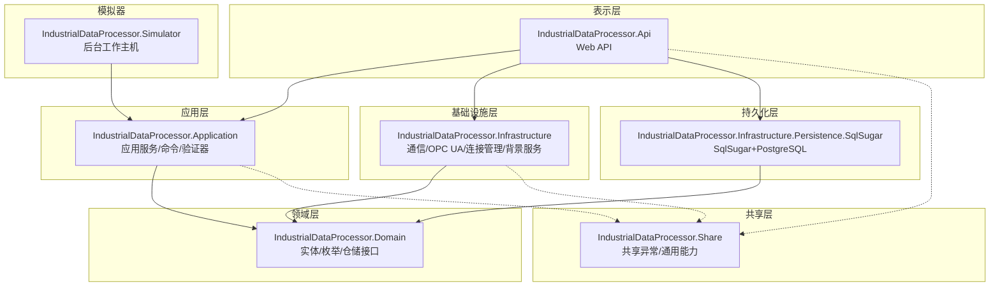
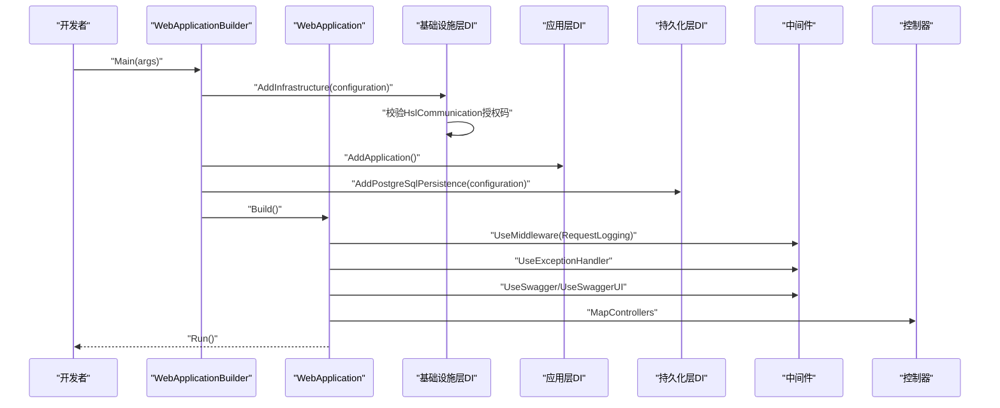
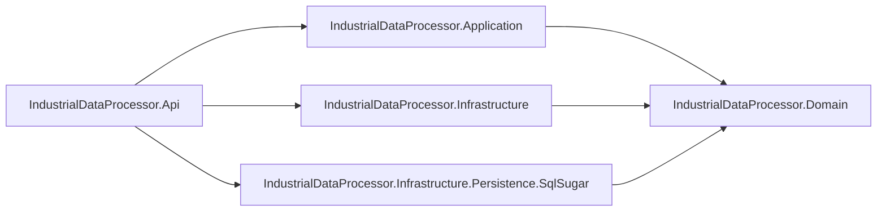

# 开发环境搭建

<cite>
**本文档引用的文件**
- [IndustrialDataProcessor.Api.csproj](file://IndustrialDataSolution/IndustrialDataProcessor.Api/IndustrialDataProcessor.Api.csproj)
- [IndustrialDataProcessor.Application.csproj](file://IndustrialDataSolution/IndustrialDataProcessor.Application/IndustrialDataProcessor.Application.csproj)
- [IndustrialDataProcessor.Infrastructure.csproj](file://IndustrialDataSolution/IndustrialDataProcessor.Infrastructure/IndustrialDataProcessor.Infrastructure.csproj)
- [IndustrialDataProcessor.Infrastructure.Persistence.SqlSugar.csproj](file://IndustrialDataSolution/IndustrialDataProcessor.Infrastructure.Persistence.SqlSugar/IndustrialDataProcessor.Infrastructure.Persistence.SqlSugar.csproj)
- [Program.cs（API）](file://IndustrialDataSolution/IndustrialDataProcessor.Api/Program.cs)
- [appsettings.json（API）](file://IndustrialDataSolution/IndustrialDataProcessor.Api/appsettings.json)
- [appsettings.Development.json（API）](file://IndustrialDataSolution/IndustrialDataProcessor.Api/appsettings.Development.json)
- [Program.cs（模拟器）](file://IndustrialDataSolution/IndustrialDataProcessor.Simulator/Program.cs)
- [appsettings.json（模拟器）](file://IndustrialDataSolution/IndustrialDataProcessor.Simulator/appsettings.json)
- [DependencyInjection.cs（应用层）](file://IndustrialDataSolution/IndustrialDataProcessor.Application/DependencyInjection.cs)
- [DependencyInjection.cs（基础设施层）](file://IndustrialDataSolution/IndustrialDataProcessor.Infrastructure/DependencyInjection.cs)
- [DependencyInjection.cs（持久化层）](file://IndustrialDataSolution/IndustrialDataProcessor.Infrastructure.Persistence.SqlSugar/DependencyInjection.cs)
- [launchSettings.json（API）](file://IndustrialDataSolution/IndustrialDataProcessor.Api/Properties/launchSettings.json)
- [launchSettings.json（模拟器）](file://IndustrialDataSolution/IndustrialDataProcessor.Simulator/Properties/launchSettings.json)
</cite>

## 目录
1. [简介](#简介)
2. [项目结构](#项目结构)
3. [核心组件](#核心组件)
4. [架构概览](#架构概览)
5. [详细组件分析](#详细组件分析)
6. [依赖分析](#依赖分析)
7. [性能考虑](#性能考虑)
8. [故障排除指南](#故障排除指南)
9. [结论](#结论)
10. [附录](#附录)

## 简介
本指南面向参与DDD工业数据处理解决方案的开发者，提供从零开始搭建开发环境的完整流程。内容涵盖.NET SDK版本要求、Visual Studio配置与必要扩展、项目依赖安装与配置（含NuGet包管理与外部依赖如HslCommunication、SqlSugar、OPC UA SDK）、数据库环境（PostgreSQL）安装与初始化脚本执行、开发工具配置（调试、启动配置文件与环境变量）、IDE设置优化（代码格式化、智能感知与断点配置），以及开发环境验证步骤，确保所有组件正确安装与配置。

## 项目结构
该解决方案采用多项目结构，遵循领域驱动设计（DDD）分层架构：
- 表示层：IndustrialDataProcessor.Api（ASP.NET Core Web API）
- 应用层：IndustrialDataProcessor.Application（应用服务、命令、验证器、事件等）
- 领域层：IndustrialDataProcessor.Domain（实体、枚举、仓储接口、领域逻辑）
- 基础设施层：IndustrialDataProcessor.Infrastructure（通信驱动、OPC UA、连接管理、背景服务等）
- 持久化层（SqlSugar）：IndustrialDataProcessor.Infrastructure.Persistence.SqlSugar（基于SqlSugar的PostgreSQL访问）
- 共享层：IndustrialDataProcessor.Share（共享异常与通用能力）
- 模拟器：IndustrialDataProcessor.Simulator（后台工作主机，用于模拟数据生成）

图表来源
- [IndustrialDataProcessor.Api.csproj](file://IndustrialDataSolution/IndustrialDataProcessor.Api/IndustrialDataProcessor.Api.csproj#L1-L21)
- [IndustrialDataProcessor.Application.csproj](file://IndustrialDataSolution/IndustrialDataProcessor.Application/IndustrialDataProcessor.Application.csproj#L1-L23)
- [IndustrialDataProcessor.Infrastructure.csproj](file://IndustrialDataSolution/IndustrialDataProcessor.Infrastructure/IndustrialDataProcessor.Infrastructure.csproj#L1-L33)
- [IndustrialDataProcessor.Infrastructure.Persistence.SqlSugar.csproj](file://IndustrialDataSolution/IndustrialDataProcessor.Infrastructure.Persistence.SqlSugar/IndustrialDataProcessor.Infrastructure.Persistence.SqlSugar.csproj#L1-L21)
- [IndustrialDataProcessor.Domain.csproj](file://IndustrialDataSolution/IndustrialDataProcessor.Domain/IndustrialDataProcessor.Domain.csproj#L1-L10)

章节来源
- [IndustrialDataProcessor.Api.csproj](file://IndustrialDataSolution/IndustrialDataProcessor.Api/IndustrialDataProcessor.Api.csproj#L1-L21)
- [IndustrialDataProcessor.Application.csproj](file://IndustrialDataSolution/IndustrialDataProcessor.Application/IndustrialDataProcessor.Application.csproj#L1-L23)
- [IndustrialDataProcessor.Infrastructure.csproj](file://IndustrialDataSolution/IndustrialDataProcessor.Infrastructure/IndustrialDataProcessor.Infrastructure.csproj#L1-L33)
- [IndustrialDataProcessor.Infrastructure.Persistence.SqlSugar.csproj](file://IndustrialDataSolution/IndustrialDataProcessor.Infrastructure.Persistence.SqlSugar/IndustrialDataProcessor.Infrastructure.Persistence.SqlSugar.csproj#L1-L21)
- [IndustrialDataProcessor.Domain.csproj](file://IndustrialDataSolution/IndustrialDataProcessor.Domain/IndustrialDataProcessor.Domain.csproj#L1-L10)

## 核心组件
- .NET目标框架：所有项目统一使用net8.0，需安装.NET 8 SDK。
- Web API入口：Program.cs中构建WebApplicationBuilder，注册应用层、基础设施层、持久化层、健康检查、控制器、Swagger等。
- 配置系统：appsettings.json与appsettings.Development.json提供连接字符串、日志级别、HslCommunication授权码等。
- 启动配置：launchSettings.json定义HTTP/IIS Express启动配置与环境变量。
- 依赖注入：各层通过静态扩展方法注册服务，基础设施层对HslCommunication进行授权校验，持久化层使用SqlSugar连接PostgreSQL。

章节来源
- [Program.cs（API）](file://IndustrialDataSolution/IndustrialDataProcessor.Api/Program.cs#L1-L54)
- [appsettings.json（API）](file://IndustrialDataSolution/IndustrialDataProcessor.Api/appsettings.json#L1-L17)
- [appsettings.Development.json（API）](file://IndustrialDataSolution/IndustrialDataProcessor.Api/appsettings.Development.json#L1-L9)
- [launchSettings.json（API）](file://IndustrialDataSolution/IndustrialDataProcessor.Api/Properties/launchSettings.json#L1-L32)

## 架构概览
下图展示API启动时的服务注册与中间件管线，以及与各层的交互关系。

图表来源
- [Program.cs（API）](file://IndustrialDataSolution/IndustrialDataProcessor.Api/Program.cs#L10-L52)
- [DependencyInjection.cs（基础设施层）](file://IndustrialDataSolution/IndustrialDataProcessor.Infrastructure/DependencyInjection.cs#L17-L80)
- [DependencyInjection.cs（应用层）](file://IndustrialDataSolution/IndustrialDataProcessor.Application/DependencyInjection.cs#L16-L39)
- [DependencyInjection.cs（持久化层）](file://IndustrialDataSolution/IndustrialDataProcessor.Infrastructure.Persistence.SqlSugar/DependencyInjection.cs#L11-L46)

## 详细组件分析

### .NET SDK与Visual Studio配置
- SDK版本要求：所有项目目标框架为net8.0，需安装.NET 8 SDK。
- IDE推荐：Visual Studio 2022（最新稳定版），启用C# IntelliSense、Live Unit Testing、即时窗口。
- 必要扩展（建议）：EditorConfig、.editorconfig支持、NuGet包管理器、Git工具集成。
- 工作负载：.NET跨平台开发、ASP.NET和Web工具、使用C#进行桌面开发。

章节来源
- [IndustrialDataProcessor.Api.csproj](file://IndustrialDataSolution/IndustrialDataProcessor.Api/IndustrialDataProcessor.Api.csproj#L3-L7)
- [IndustrialDataProcessor.Application.csproj](file://IndustrialDataSolution/IndustrialDataProcessor.Application/IndustrialDataProcessor.Application.csproj#L3-L7)
- [IndustrialDataProcessor.Infrastructure.csproj](file://IndustrialDataSolution/IndustrialDataProcessor.Infrastructure/IndustrialDataProcessor.Infrastructure.csproj#L3-L7)
- [IndustrialDataProcessor.Infrastructure.Persistence.SqlSugar.csproj](file://IndustrialDataSolution/IndustrialDataProcessor.Infrastructure.Persistence.SqlSugar/IndustrialDataProcessor.Infrastructure.Persistence.SqlSugar.csproj#L3-L7)

### NuGet包管理与外部依赖配置
- HslCommunication：用于多种工业通信协议（如Modbus、Siemens、Omron等）。需在appsettings.json中提供有效的授权码，否则启动即失败。
- SqlSugar：ORM，用于PostgreSQL访问，通过AddPostgreSqlPersistence注册ISqlSugarClient。
- OPC UA SDK：OPCFoundation.NetStandard.Opc.Ua系列包，用于OPC UA客户端/服务器与后台服务。
- 其他常用包：MediatR（CQRS）、FluentValidation（验证）、Swashbuckle.AspNetCore（Swagger）、Microsoft.Extensions.*（配置/依赖注入/日志/缓存）。

章节来源
- [DependencyInjection.cs（基础设施层）](file://IndustrialDataSolution/IndustrialDataProcessor.Infrastructure/DependencyInjection.cs#L19-L28)
- [appsettings.json（API）](file://IndustrialDataSolution/IndustrialDataProcessor.Api/appsettings.json#L13-L15)
- [DependencyInjection.cs（持久化层）](file://IndustrialDataSolution/IndustrialDataProcessor.Infrastructure.Persistence.SqlSugar/DependencyInjection.cs#L11-L46)
- [IndustrialDataProcessor.Infrastructure.csproj](file://IndustrialDataSolution/IndustrialDataProcessor.Infrastructure/IndustrialDataProcessor.Infrastructure.csproj#L11-L18)

### 数据库环境搭建（PostgreSQL）
- 安装：下载并安装PostgreSQL（建议14+），确保安装pgAdmin或psql工具。
- 创建数据库与用户：创建名为iot的数据库，用户postgres，密码keda（与连接字符串一致）。
- 初始化脚本：在项目中未发现现成的初始化脚本文件。建议在本地开发环境中手动创建基础表结构（如工作站配置、设备数据等），或在后续迭代中引入迁移脚本/初始化脚本。
- 连接字符串：默认连接字符串位于appsettings.json的ConnectionStrings.DefaultConnection，包含Host、Port、Database、Username、Password等参数。

章节来源
- [appsettings.json（API）](file://IndustrialDataSolution/IndustrialDataProcessor.Api/appsettings.json#L10-L12)
- [DependencyInjection.cs（持久化层）](file://IndustrialDataSolution/IndustrialDataProcessor.Infrastructure.Persistence.SqlSugar/DependencyInjection.cs#L13-L13)

### 开发工具配置（调试、启动配置与环境变量）
- API启动配置：launchSettings.json定义了HTTP与IIS Express两种启动配置，环境变量设置为Development。
- 模拟器启动配置：同样设置DOTNET_ENVIRONMENT为Development。
- 环境变量：Development模式下日志级别较低，便于调试；生产环境请根据需要调整。
- 调试断点：在Program.cs、依赖注入扩展方法、控制器与应用服务中均可设置断点进行调试。

章节来源
- [launchSettings.json（API）](file://IndustrialDataSolution/IndustrialDataProcessor.Api/Properties/launchSettings.json#L11-L31)
- [launchSettings.json（模拟器）](file://IndustrialDataSolution/IndustrialDataProcessor.Simulator/Properties/launchSettings.json#L3-L12)
- [Program.cs（API）](file://IndustrialDataSolution/IndustrialDataProcessor.Api/Program.cs#L36-L51)

### IDE设置优化（代码格式化、智能感知与断点）
- 代码格式化：使用.editorconfig（若项目未提供，可在解决方案根目录创建），统一缩进、行尾、命名风格。
- 智能感知：启用C# IntelliSense，确保所有NuGet包已还原，以便获得完整的类型提示与导航。
- 断点配置：在关键服务注册处（如AddInfrastructure、AddApplication、AddPostgreSqlPersistence）与业务入口（Program.cs）设置条件断点，观察配置加载与异常抛出路径。

章节来源
- [DependencyInjection.cs（基础设施层）](file://IndustrialDataSolution/IndustrialDataProcessor.Infrastructure/DependencyInjection.cs#L17-L80)
- [DependencyInjection.cs（应用层）](file://IndustrialDataSolution/IndustrialDataProcessor.Application/DependencyInjection.cs#L16-L39)
- [DependencyInjection.cs（持久化层）](file://IndustrialDataSolution/IndustrialDataProcessor.Infrastructure.Persistence.SqlSugar/DependencyInjection.cs#L11-L46)

### 开发环境验证步骤
- 还原并构建：使用dotnet restore与dotnet build验证所有项目依赖与编译无误。
- 启动API：运行dotnet run或在Visual Studio中启动API项目，确认Swagger可用（/swagger）、健康检查（/health）正常。
- 验证依赖注入：在Program.cs中逐步断点，确认AddInfrastructure、AddApplication、AddPostgreSqlPersistence按序执行且无异常。
- 验证Hsl授权：若缺少或错误的HslCommunication授权码，应立即抛出异常并终止启动。
- 验证数据库连接：在AddPostgreSqlPersistence中确认连接字符串有效，数据库可连通。
- 启动模拟器：运行模拟器项目，确认后台工作主机正常启动。

章节来源
- [Program.cs（API）](file://IndustrialDataSolution/IndustrialDataProcessor.Api/Program.cs#L10-L52)
- [DependencyInjection.cs（基础设施层）](file://IndustrialDataSolution/IndustrialDataProcessor.Infrastructure/DependencyInjection.cs#L19-L28)
- [DependencyInjection.cs（持久化层）](file://IndustrialDataSolution/IndustrialDataProcessor.Infrastructure.Persistence.SqlSugar/DependencyInjection.cs#L11-L46)

## 依赖分析
下图展示项目间的依赖关系与引用链。

图表来源
- [IndustrialDataProcessor.Api.csproj](file://IndustrialDataSolution/IndustrialDataProcessor.Api/IndustrialDataProcessor.Api.csproj#L14-L18)
- [IndustrialDataProcessor.Application.csproj](file://IndustrialDataSolution/IndustrialDataProcessor.Application/IndustrialDataProcessor.Application.csproj#L19-L20)
- [IndustrialDataProcessor.Infrastructure.csproj](file://IndustrialDataSolution/IndustrialDataProcessor.Infrastructure/IndustrialDataProcessor.Infrastructure.csproj#L22-L23)
- [IndustrialDataProcessor.Infrastructure.Persistence.SqlSugar.csproj](file://IndustrialDataSolution/IndustrialDataProcessor.Infrastructure.Persistence.SqlSugar/IndustrialDataProcessor.Infrastructure.Persistence.SqlSugar.csproj#L17-L18)

章节来源
- [IndustrialDataProcessor.Api.csproj](file://IndustrialDataSolution/IndustrialDataProcessor.Api/IndustrialDataProcessor.Api.csproj#L14-L18)
- [IndustrialDataProcessor.Application.csproj](file://IndustrialDataSolution/IndustrialDataProcessor.Application/IndustrialDataProcessor.Application.csproj#L19-L20)
- [IndustrialDataProcessor.Infrastructure.csproj](file://IndustrialDataSolution/IndustrialDataProcessor.Infrastructure/IndustrialDataProcessor.Infrastructure.csproj#L22-L23)
- [IndustrialDataProcessor.Infrastructure.Persistence.SqlSugar.csproj](file://IndustrialDataSolution/IndustrialDataProcessor.Infrastructure.Persistence.SqlSugar/IndustrialDataProcessor.Infrastructure.Persistence.SqlSugar.csproj#L17-L18)

## 性能考虑
- 连接池与超时：连接字符串中包含Pooling、Minimum/Maximum Pool Size、Connection Lifetime、Command Timeout等参数，建议根据并发与硬件资源调优。
- 缓存策略：应用层使用内存缓存（AddMemoryCache），可结合分布式缓存（Redis）提升高并发场景下的响应速度。
- 序列化：Json序列化选项在基础设施层集中配置，避免重复创建实例，减少GC压力。
- OPC UA后台服务：作为托管服务运行，注意资源释放与异常恢复，避免阻塞Host关闭流程。

章节来源
- [appsettings.json（API）](file://IndustrialDataSolution/IndustrialDataProcessor.Api/appsettings.json#L10-L12)
- [Program.cs（API）](file://IndustrialDataSolution/IndustrialDataProcessor.Api/Program.cs#L14-L15)
- [DependencyInjection.cs（基础设施层）](file://IndustrialDataSolution/IndustrialDataProcessor.Infrastructure/DependencyInjection.cs#L64-L77)

## 故障排除指南
- HslCommunication授权失败：若未配置或授权码无效，启动将抛出异常并终止。请检查appsettings.json中的HslCommunication:AuthorizationCode节点。
- PostgreSQL连接失败：检查连接字符串、数据库名称、用户名与密码，确保PostgreSQL服务已启动且允许本地连接。
- Swagger不可用：确认Program.cs中已注册并启用Swagger与SwaggerUI。
- 启动端口冲突：修改launchSettings.json中的applicationUrl或IIS Express sslPort。
- NuGet包还原失败：清理bin/obj、删除packages/.nuget缓存后重新还原，或检查网络代理与包源。

章节来源
- [DependencyInjection.cs（基础设施层）](file://IndustrialDataSolution/IndustrialDataProcessor.Infrastructure/DependencyInjection.cs#L19-L28)
- [appsettings.json（API）](file://IndustrialDataSolution/IndustrialDataProcessor.Api/appsettings.json#L10-L15)
- [Program.cs（API）](file://IndustrialDataSolution/IndustrialDataProcessor.Api/Program.cs#L45-L46)

## 结论
通过以上步骤，您可以在本地成功搭建DDD工业数据处理解决方案的开发环境。重点在于：
- 统一使用.NET 8 SDK与Visual Studio；
- 正确配置HslCommunication授权码与PostgreSQL连接字符串；
- 使用launchSettings.json与环境变量控制开发体验；
- 通过依赖注入扩展方法确保各层服务正确注册；
- 利用调试断点与健康检查快速定位问题。

## 附录
- 常用命令
  - dotnet restore：还原包
  - dotnet build：构建项目
  - dotnet run：运行API或模拟器
  - dotnet test：运行测试套件
- 建议的后续步骤
  - 引入数据库迁移脚本或初始化脚本；
  - 配置日志输出到文件或集中式日志系统；
  - 添加单元测试与集成测试覆盖关键业务逻辑。