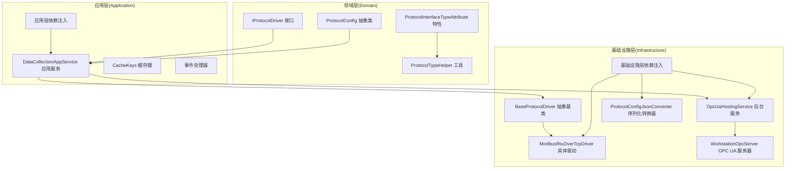
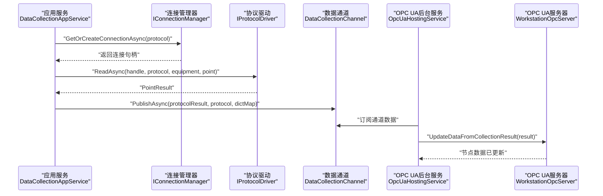
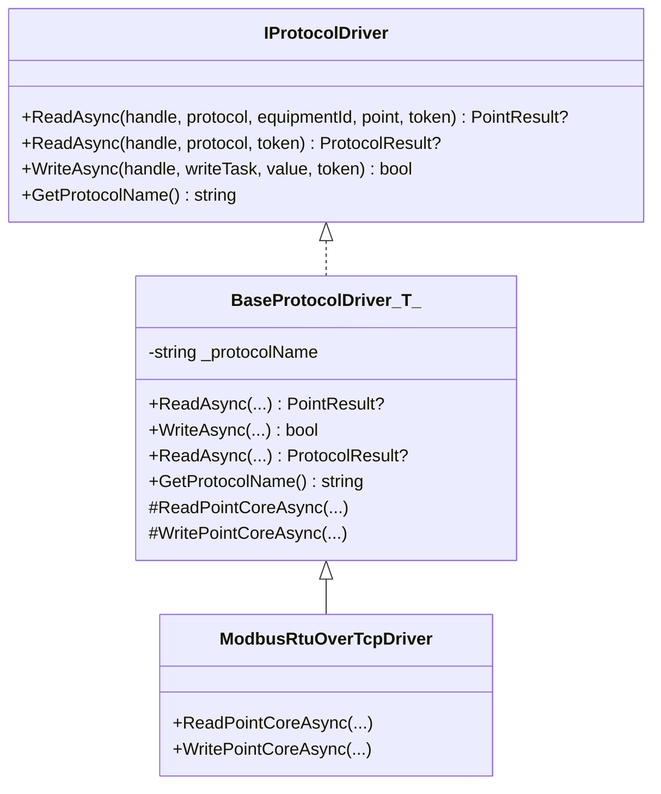
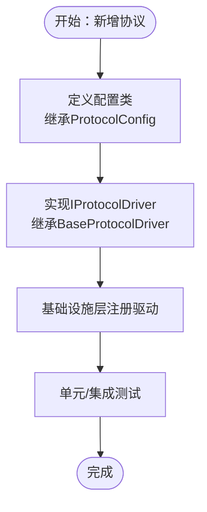
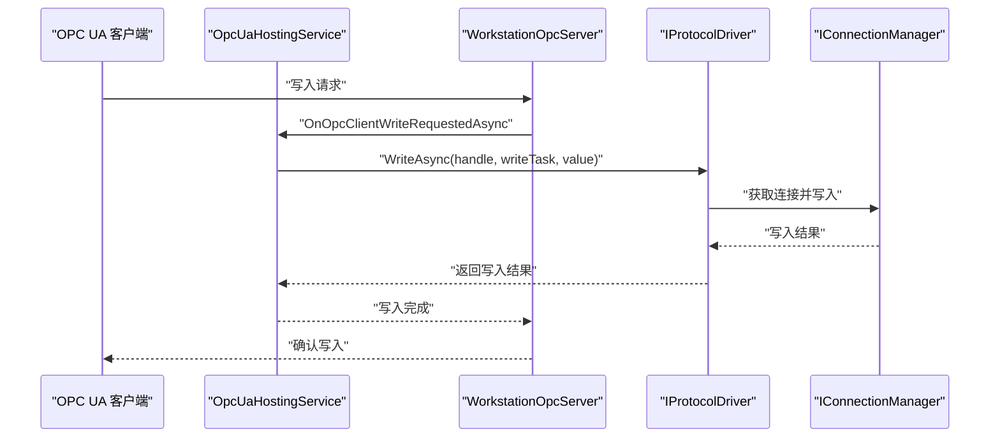
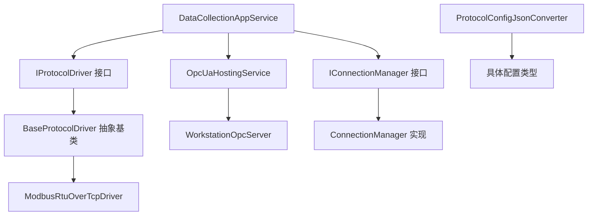

# 扩展开发指南

<cite>
**本文档引用的文件**
- [IProtocolDriver.cs](file://IndustrialDataSolution/IndustrialDataProcessor.Domain/Communication/IConnection/IProtocolDriver.cs)
- [ProtocolConfig.cs](file://IndustrialDataSolution/IndustrialDataProcessor.Domain/Workstation/Configs/ProtocolConfig.cs)
- [DataCollectionAppService.cs](file://IndustrialDataSolution/IndustrialDataProcessor.Application/Services/DataCollectionAppService.cs)
- [BaseProtocolDriver.cs](file://IndustrialDataSolution/IndustrialDataProcessor.Infrastructure/Communication/Drivers/TcpCommon/BaseProtocolDriver.cs)
- [ModbusRtuOverTcpDriver.cs](file://IndustrialDataSolution/IndustrialDataProcessor.Infrastructure/Communication/Drivers/TcpCommon/ModbusRtuOverTcpDriver.cs)
- [OpcUaDriver.cs](file://IndustrialDataSolution/IndustrialDataProcessor.Infrastructure/Communication/Drivers/TcpSpecial/OpcUaDriver.cs)
- [WorkstationOpcServer.cs](file://IndustrialDataSolution/IndustrialDataProcessor.Infrastructure/OpcUa/WorkstationOpcServer.cs)
- [OpcUaHostingService.cs](file://IndustrialDataSolution/IndustrialDataProcessor.Infrastructure/BackgroundServices/OpcUaHostingService.cs)
- [DependencyInjection.cs（应用层）](file://IndustrialDataSolution/IndustrialDataProcessor.Application/DependencyInjection.cs)
- [DependencyInjection.cs（基础设施层）](file://IndustrialDataSolution/IndustrialDataProcessor.Infrastructure/DependencyInjection.cs)
- [ProtocolInterfaceTypeAttribute.cs](file://IndustrialDataSolution/IndustrialDataProcessor.Domain/Attributes/ProtocolInterfaceTypeAttribute.cs)
- [ProtocolTypeHelper.cs（域层）](file://IndustrialDataSolution/IndustrialDataProcessor.Domain/Helpers/ProtocolTypeHelper.cs)
- [ProtocolConfigJsonConverter.cs](file://IndustrialDataSolution/IndustrialDataProcessor.Infrastructure/Serialization/Converters/ProtocolConfigJsonConverter.cs)
- [CacheKeys.cs](file://IndustrialDataSolution/IndustrialDataProcessor.Application/Constants/CacheKeys.cs)
- [ClearConfigCacheEventHandler.cs](file://IndustrialDataSolution/IndustrialDataProcessor.Application/EventHandlers/ClearConfigCacheEventHandler.cs)
- [SaveWorkstationConfigCommand.cs](file://IndustrialDataSolution/IndustrialDataProcessor.Application/Commands/SaveWorkstationConfigCommand.cs)
</cite>

## 目录
1. [简介](#简介)
2. [项目结构](#项目结构)
3. [核心组件](#核心组件)
4. [架构概览](#架构概览)
5. [详细组件分析](#详细组件分析)
6. [依赖关系分析](#依赖关系分析)
7. [性能考虑](#性能考虑)
8. [故障排除指南](#故障排除指南)
9. [结论](#结论)
10. [附录](#附录)

## 简介
本指南面向希望在DDD工业数据处理解决方案中进行扩展开发的工程师，涵盖以下主题：
- 新协议支持的开发流程：实现IProtocolDriver接口、协议配置解析与通信处理逻辑
- 新功能模块开发方法：领域模型设计、应用服务实现与基础设施适配
- 第三方集成开发：外部API调用、数据格式转换与错误处理
- OPC UA扩展开发：自定义节点类型、数据模型与访问控制
- 缓存系统扩展：自定义缓存策略与分布式缓存集成
- 插件架构开发：插件接口设计、加载机制与生命周期管理
- 扩展点识别与自定义组件开发最佳实践

## 项目结构
该项目采用分层架构与领域驱动设计（DDD）思想，分为Domain、Application、Infrastructure、Share、Simulator等子项目。核心扩展点分布在：
- 领域层（Domain）：定义协议接口IProtocolDriver、协议配置基类ProtocolConfig、接口类型与协议类型映射工具
- 应用层（Application）：应用服务DataCollectionAppService负责协议级采集任务调度与结果发布通道
- 基础设施层（Infrastructure）：实现具体协议驱动（如ModbusRtuOverTcpDriver）、OPC UA服务器与后台服务、JSON序列化转换器
- 共享层（Share）：共享异常类型与通信相关异常
- 模拟器（Simulator）：用于测试与演示

图表来源
- [IProtocolDriver.cs](file://IndustrialDataSolution/IndustrialDataProcessor.Domain/Communication/IConnection/IProtocolDriver.cs#L1-L14)
- [ProtocolConfig.cs](file://IndustrialDataSolution/IndustrialDataProcessor.Domain/Workstation/Configs/ProtocolConfig.cs#L1-L64)
- [DataCollectionAppService.cs](file://IndustrialDataSolution/IndustrialDataProcessor.Application/Services/DataCollectionAppService.cs#L1-L216)
- [BaseProtocolDriver.cs](file://IndustrialDataSolution/IndustrialDataProcessor.Infrastructure/Communication/Drivers/TcpCommon/BaseProtocolDriver.cs#L1-L108)
- [ModbusRtuOverTcpDriver.cs](file://IndustrialDataSolution/IndustrialDataProcessor.Infrastructure/Communication/Drivers/TcpCommon/ModbusRtuOverTcpDriver.cs#L1-L41)
- [WorkstationOpcServer.cs](file://IndustrialDataSolution/IndustrialDataProcessor.Infrastructure/OpcUa/WorkstationOpcServer.cs#L1-L36)
- [OpcUaHostingService.cs](file://IndustrialDataSolution/IndustrialDataProcessor.Infrastructure/BackgroundServices/OpcUaHostingService.cs#L1-L228)
- [DependencyInjection.cs（应用层）](file://IndustrialDataSolution/IndustrialDataProcessor.Application/DependencyInjection.cs#L1-L40)
- [DependencyInjection.cs（基础设施层）](file://IndustrialDataSolution/IndustrialDataProcessor.Infrastructure/DependencyInjection.cs#L1-L82)
- [ProtocolConfigJsonConverter.cs](file://IndustrialDataSolution/IndustrialDataProcessor.Infrastructure/Serialization/Converters/ProtocolConfigJsonConverter.cs#L27-L58)

章节来源
- [DependencyInjection.cs（应用层）](file://IndustrialDataSolution/IndustrialDataProcessor.Application/DependencyInjection.cs#L1-L40)
- [DependencyInjection.cs（基础设施层）](file://IndustrialDataSolution/IndustrialDataProcessor.Infrastructure/DependencyInjection.cs#L1-L82)

## 核心组件
本节聚焦扩展开发的关键组件与职责边界。

- IProtocolDriver接口
  - 定义协议驱动的标准能力：点位读取、批量读取（可选）、写入、协议名称查询
  - 作为所有协议驱动的契约，确保应用层通过统一接口调度底层通信

- ProtocolConfig抽象类
  - 统一承载协议配置字段：协议类型、接口类型、通信超时、账号密码、备注、附加选项、设备列表
  - 为不同接口类型（LAN/COM/API/DATABASE）提供统一的配置载体

- DataCollectionAppService应用服务
  - 负责启动所有协议的独立采集任务，按协议配置循环执行
  - 通过IConnectionManager获取连接句柄，委托IProtocolDriver执行读写
  - 将采集结果经设备数据处理器加工后，通过DataCollectionChannel发布

- BaseProtocolDriver抽象基类
  - 提供协议驱动的模板方法：统一的读写流程编排、通道锁获取、异常包装
  - 子类仅需实现核心读写逻辑（ReadPointCoreAsync/WritePointCoreAsync）

- WorkstationOpcServer与OpcUaHostingService
  - WorkstationOpcServer封装OPC UA服务器，注册自定义节点管理器
  - OpcUaHostingService负责启动/重启OPC UA服务器、监听采集通道并更新节点数据，处理客户端写请求

章节来源
- [IProtocolDriver.cs](file://IndustrialDataSolution/IndustrialDataProcessor.Domain/Communication/IConnection/IProtocolDriver.cs#L1-L14)
- [ProtocolConfig.cs](file://IndustrialDataSolution/IndustrialDataProcessor.Domain/Workstation/Configs/ProtocolConfig.cs#L1-L64)
- [DataCollectionAppService.cs](file://IndustrialDataSolution/IndustrialDataProcessor.Application/Services/DataCollectionAppService.cs#L1-L216)
- [BaseProtocolDriver.cs](file://IndustrialDataSolution/IndustrialDataProcessor.Infrastructure/Communication/Drivers/TcpCommon/BaseProtocolDriver.cs#L1-L108)
- [WorkstationOpcServer.cs](file://IndustrialDataSolution/IndustrialDataProcessor.Infrastructure/OpcUa/WorkstationOpcServer.cs#L1-L36)
- [OpcUaHostingService.cs](file://IndustrialDataSolution/IndustrialDataProcessor.Infrastructure/BackgroundServices/OpcUaHostingService.cs#L1-L228)

## 架构概览
下图展示了扩展开发中的关键交互路径：应用服务调度协议驱动，驱动通过连接句柄与底层通信库交互；OPC UA后台服务订阅采集通道并更新节点数据。

图表来源
- [DataCollectionAppService.cs](file://IndustrialDataSolution/IndustrialDataProcessor.Application/Services/DataCollectionAppService.cs#L1-L216)
- [OpcUaHostingService.cs](file://IndustrialDataSolution/IndustrialDataProcessor.Infrastructure/BackgroundServices/OpcUaHostingService.cs#L1-L228)
- [WorkstationOpcServer.cs](file://IndustrialDataSolution/IndustrialDataProcessor.Infrastructure/OpcUa/WorkstationOpcServer.cs#L1-L36)

## 详细组件分析

### 新协议支持开发流程
实现步骤如下：
1. 实现IProtocolDriver接口
   - 在基础设施层创建具体驱动类，继承BaseProtocolDriver<TConnection>，实现ReadPointCoreAsync与WritePointCoreAsync
   - 在GetProtocolName中返回协议名称，用于应用层匹配驱动
   - 示例参考：ModbusRtuOverTcpDriver

2. 协议配置解析
   - 使用ProtocolConfig抽象类承载配置字段
   - 通过ProtocolConfigJsonConverter根据InterfaceType动态反序列化为具体配置类型（NetworkProtocolConfig/SerialPortConfig/HttpApiInterfaceConfig/DatabaseInterfaceConfig）
   - 配置校验由JsonValidateHelper在转换器中完成

3. 通信处理逻辑
   - 应用层通过DataCollectionAppService按协议循环执行采集
   - 驱动通过IConnectionHandle获取底层连接，使用通道锁保证并发安全
   - 异常统一包装为领域/应用异常，便于上层处理

图表来源
- [IProtocolDriver.cs](file://IndustrialDataSolution/IndustrialDataProcessor.Domain/Communication/IConnection/IProtocolDriver.cs#L1-L14)
- [BaseProtocolDriver.cs](file://IndustrialDataSolution/IndustrialDataProcessor.Infrastructure/Communication/Drivers/TcpCommon/BaseProtocolDriver.cs#L1-L108)
- [ModbusRtuOverTcpDriver.cs](file://IndustrialDataSolution/IndustrialDataProcessor.Infrastructure/Communication/Drivers/TcpCommon/ModbusRtuOverTcpDriver.cs#L1-L41)

章节来源
- [IProtocolDriver.cs](file://IndustrialDataSolution/IndustrialDataProcessor.Domain/Communication/IConnection/IProtocolDriver.cs#L1-L14)
- [BaseProtocolDriver.cs](file://IndustrialDataSolution/IndustrialDataProcessor.Infrastructure/Communication/Drivers/TcpCommon/BaseProtocolDriver.cs#L1-L108)
- [ModbusRtuOverTcpDriver.cs](file://IndustrialDataSolution/IndustrialDataProcessor.Infrastructure/Communication/Drivers/TcpCommon/ModbusRtuOverTcpDriver.cs#L1-L41)
- [ProtocolConfig.cs](file://IndustrialDataSolution/IndustrialDataProcessor.Domain/Workstation/Configs/ProtocolConfig.cs#L1-L64)
- [ProtocolConfigJsonConverter.cs](file://IndustrialDataSolution/IndustrialDataProcessor.Infrastructure/Serialization/Converters/ProtocolConfigJsonConverter.cs#L27-L58)

### 新功能模块开发方法
- 领域模型设计
  - 使用ProtocolConfig及其实体承载协议配置，结合ProtocolInterfaceTypeAttribute与ProtocolTypeHelper进行接口类型约束
  - 通过枚举（如InterfaceType、ProtocolType）与特性标注，确保协议类型与接口类型的合法性

- 应用服务实现
  - DataCollectionAppService负责协议级采集循环、异常隔离与结果发布
  - 通过依赖注入注册应用服务与验证器，使用MediatR处理命令与事件

- 基础设施适配
  - 通过基础设施层依赖注入自动扫描并注册所有IProtocolDriver实现
  - 使用JsonSerializerOptions与自定义转换器处理复杂配置的序列化/反序列化

图表来源
- [DependencyInjection.cs（基础设施层）](file://IndustrialDataSolution/IndustrialDataProcessor.Infrastructure/DependencyInjection.cs#L55-L62)
- [ProtocolConfig.cs](file://IndustrialDataSolution/IndustrialDataProcessor.Domain/Workstation/Configs/ProtocolConfig.cs#L1-L64)
- [IProtocolDriver.cs](file://IndustrialDataSolution/IndustrialDataProcessor.Domain/Communication/IConnection/IProtocolDriver.cs#L1-L14)

章节来源
- [ProtocolInterfaceTypeAttribute.cs](file://IndustrialDataSolution/IndustrialDataProcessor.Domain/Attributes/ProtocolInterfaceTypeAttribute.cs#L1-L19)
- [ProtocolTypeHelper.cs（域层）](file://IndustrialDataSolution/IndustrialDataProcessor.Domain/Helpers/ProtocolTypeHelper.cs#L1-L34)
- [DependencyInjection.cs（应用层）](file://IndustrialDataSolution/IndustrialDataProcessor.Application/DependencyInjection.cs#L1-L40)
- [DependencyInjection.cs（基础设施层）](file://IndustrialDataSolution/IndustrialDataProcessor.Infrastructure/DependencyInjection.cs#L1-L82)

### 第三方集成开发指导
- 外部API调用
  - 在ProtocolConfigJsonConverter中为API接口类型增加字段校验（如AccessApiString、RequestMethod等）
  - 在应用层通过IProtocolDriver实现API读写逻辑，必要时在驱动中封装HTTP客户端

- 数据格式转换
  - 使用JsonSerializerOptions与自定义转换器统一处理配置与结果的序列化/反序列化
  - 对于API响应/请求体，建议在驱动内部进行格式转换与校验

- 错误处理
  - 驱动层统一捕获异常并包装为领域/应用异常，便于上层统一处理
  - 应用层在采集循环中隔离异常，避免影响其他协议线程

章节来源
- [ProtocolConfigJsonConverter.cs](file://IndustrialDataSolution/IndustrialDataProcessor.Infrastructure/Serialization/Converters/ProtocolConfigJsonConverter.cs#L27-L58)
- [DataCollectionAppService.cs](file://IndustrialDataSolution/IndustrialDataProcessor.Application/Services/DataCollectionAppService.cs#L1-L216)
- [BaseProtocolDriver.cs](file://IndustrialDataSolution/IndustrialDataProcessor.Infrastructure/Communication/Drivers/TcpCommon/BaseProtocolDriver.cs#L1-L108)

### OPC UA扩展开发
- 自定义节点类型
  - 通过WorkstationOpcServer重写CreateMasterNodeManager，注册自定义NodeManager
  - 在OpcUaHostingService中订阅DataCollectionChannel，将采集结果更新至节点

- 数据模型
  - 节点数据来源于采集结果（ProtocolResult/EquipmentResult/PointResult）
  - 支持客户端写请求，通过OnOpcClientWriteRequestedAsync回调触发写入流程

- 访问控制
  - 服务器配置中可设置匿名用户策略与安全策略，按需调整安全级别
  - 可扩展用户认证与授权策略（在现有配置基础上扩展）

图表来源
- [OpcUaHostingService.cs](file://IndustrialDataSolution/IndustrialDataProcessor.Infrastructure/BackgroundServices/OpcUaHostingService.cs#L135-L158)
- [WorkstationOpcServer.cs](file://IndustrialDataSolution/IndustrialDataProcessor.Infrastructure/OpcUa/WorkstationOpcServer.cs#L1-L36)
- [OpcUaDriver.cs](file://IndustrialDataSolution/IndustrialDataProcessor.Infrastructure/Communication/Drivers/TcpSpecial/OpcUaDriver.cs#L1-L21)

章节来源
- [WorkstationOpcServer.cs](file://IndustrialDataSolution/IndustrialDataProcessor.Infrastructure/OpcUa/WorkstationOpcServer.cs#L1-L36)
- [OpcUaHostingService.cs](file://IndustrialDataSolution/IndustrialDataProcessor.Infrastructure/BackgroundServices/OpcUaHostingService.cs#L1-L228)
- [OpcUaDriver.cs](file://IndustrialDataSolution/IndustrialDataProcessor.Infrastructure/Communication/Drivers/TcpSpecial/OpcUaDriver.cs#L1-L21)

### 缓存系统扩展方法
- 自定义缓存策略
  - 使用IMemoryCache与CacheKeys定义缓存键，事件处理器监听配置更新事件并清理缓存
  - 可扩展为分布式缓存（如Redis），通过替换缓存实现与序列化策略适配

- 分布式缓存集成
  - 在基础设施层注册分布式缓存实现，替换MemoryCache
  - 保持缓存键命名规范与失效策略一致

章节来源
- [CacheKeys.cs](file://IndustrialDataSolution/IndustrialDataProcessor.Application/Constants/CacheKeys.cs#L1-L7)
- [ClearConfigCacheEventHandler.cs](file://IndustrialDataSolution/IndustrialDataProcessor.Application/EventHandlers/ClearConfigCacheEventHandler.cs#L1-L25)

### 插件架构开发指导
- 插件接口设计
  - 以IProtocolDriver为核心扩展点，所有协议驱动遵循统一接口
  - 通过特性（ProtocolInterfaceTypeAttribute）与工具（ProtocolTypeHelper）约束协议与接口的匹配关系

- 加载机制
  - 基础设施层依赖注入自动扫描并注册所有IProtocolDriver实现
  - 应用层通过枚举驱动名称匹配具体驱动实例

- 生命周期管理
  - 驱动为无状态对象，无需手动释放资源
  - 通过IConnectionManager管理连接生命周期，避免资源泄漏

章节来源
- [DependencyInjection.cs（基础设施层）](file://IndustrialDataSolution/IndustrialDataProcessor.Infrastructure/DependencyInjection.cs#L55-L62)
- [DependencyInjection.cs（应用层）](file://IndustrialDataSolution/IndustrialDataProcessor.Application/DependencyInjection.cs#L22-L26)
- [ProtocolInterfaceTypeAttribute.cs](file://IndustrialDataSolution/IndustrialDataProcessor.Domain/Attributes/ProtocolInterfaceTypeAttribute.cs#L1-L19)
- [ProtocolTypeHelper.cs（域层）](file://IndustrialDataSolution/IndustrialDataProcessor.Domain/Helpers/ProtocolTypeHelper.cs#L1-L34)

## 依赖关系分析
下图展示扩展开发中的关键依赖关系：应用层依赖驱动接口与连接管理器；基础设施层实现驱动与OPC UA服务；配置转换器负责配置解析。

图表来源
- [DataCollectionAppService.cs](file://IndustrialDataSolution/IndustrialDataProcessor.Application/Services/DataCollectionAppService.cs#L1-L216)
- [BaseProtocolDriver.cs](file://IndustrialDataSolution/IndustrialDataProcessor.Infrastructure/Communication/Drivers/TcpCommon/BaseProtocolDriver.cs#L1-L108)
- [ModbusRtuOverTcpDriver.cs](file://IndustrialDataSolution/IndustrialDataProcessor.Infrastructure/Communication/Drivers/TcpCommon/ModbusRtuOverTcpDriver.cs#L1-L41)
- [OpcUaHostingService.cs](file://IndustrialDataSolution/IndustrialDataProcessor.Infrastructure/BackgroundServices/OpcUaHostingService.cs#L1-L228)
- [WorkstationOpcServer.cs](file://IndustrialDataSolution/IndustrialDataProcessor.Infrastructure/OpcUa/WorkstationOpcServer.cs#L1-L36)
- [ProtocolConfigJsonConverter.cs](file://IndustrialDataSolution/IndustrialDataProcessor.Infrastructure/Serialization/Converters/ProtocolConfigJsonConverter.cs#L27-L58)

章节来源
- [DependencyInjection.cs（应用层）](file://IndustrialDataSolution/IndustrialDataProcessor.Application/DependencyInjection.cs#L1-L40)
- [DependencyInjection.cs（基础设施层）](file://IndustrialDataSolution/IndustrialDataProcessor.Infrastructure/DependencyInjection.cs#L1-L82)

## 性能考虑
- 并发与锁
  - 驱动通过IConnectionHandle.AcquireLockAsync获取通道锁，避免同一通道并发冲突
  - 建议在驱动内部尽量减少阻塞操作，提升吞吐量

- 采集循环
  - 应用服务为每个协议维护独立的采集线程，彼此互不影响
  - 通过配置的CommunicationDelay控制采集频率，避免CPU占用过高

- 序列化与转换
  - 使用自定义JsonSerializerOptions与转换器，减少反射开销
  - 对于大体量配置，建议分页或增量加载

- OPC UA
  - 节点更新采用异步订阅方式，避免阻塞服务器主线程
  - 写入请求通过表达式转换器将业务值转换为物理值，降低错误率

## 故障排除指南
- 协议驱动未找到
  - 确认驱动类已继承BaseProtocolDriver并正确实现GetProtocolName
  - 检查基础设施层依赖注入是否注册了IProtocolDriver实现

- 配置解析失败
  - 检查ProtocolConfigJsonConverter中对相应InterfaceType的分支与字段校验
  - 使用JsonValidateHelper确保必填字段与类型正确

- OPC UA写入失败
  - 检查OpcUaHostingService中OnOpcClientWriteRequestedAsync回调链路
  - 确认驱动WriteAsync返回值与错误信息

- 缓存未生效
  - 确认事件处理器是否正确清理缓存键
  - 检查缓存实现是否替换为分布式缓存

章节来源
- [DataCollectionAppService.cs](file://IndustrialDataSolution/IndustrialDataProcessor.Application/Services/DataCollectionAppService.cs#L1-L216)
- [OpcUaHostingService.cs](file://IndustrialDataSolution/IndustrialDataProcessor.Infrastructure/BackgroundServices/OpcUaHostingService.cs#L135-L158)
- [ClearConfigCacheEventHandler.cs](file://IndustrialDataSolution/IndustrialDataProcessor.Application/EventHandlers/ClearConfigCacheEventHandler.cs#L1-L25)

## 结论
本指南提供了在DDD工业数据处理解决方案中进行扩展开发的完整路径：从协议驱动实现、配置解析与通信处理，到OPC UA扩展、缓存系统与插件架构。通过遵循统一接口、依赖注入与配置转换器等约定，开发者可以快速、安全地扩展系统能力。

## 附录
- 命令与事件
  - SaveWorkstationConfigCommand用于保存工作站配置，配合事件处理器实现配置变更后的缓存清理
- 最佳实践
  - 驱动实现应最小化状态，避免资源泄漏
  - 异常处理应统一包装，便于上层记录与恢复
  - 配置解析与校验应在转换器中集中处理，减少重复逻辑

章节来源
- [SaveWorkstationConfigCommand.cs](file://IndustrialDataSolution/IndustrialDataProcessor.Application/Commands/SaveWorkstationConfigCommand.cs#L1-L9)
- [ClearConfigCacheEventHandler.cs](file://IndustrialDataSolution/IndustrialDataProcessor.Application/EventHandlers/ClearConfigCacheEventHandler.cs#L1-L25)