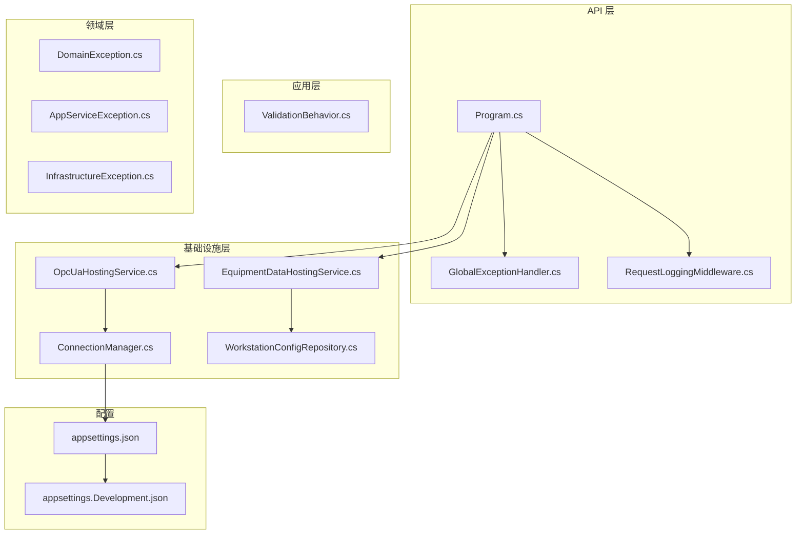
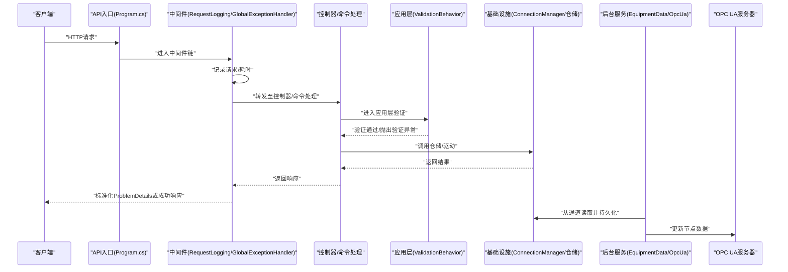
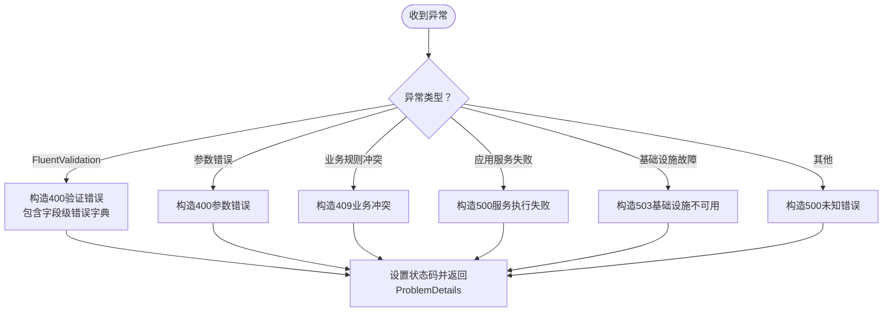
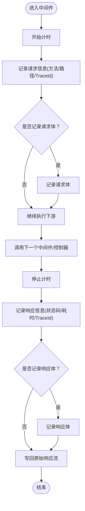
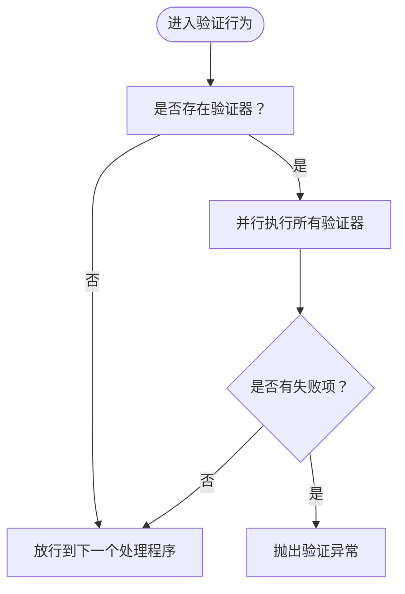
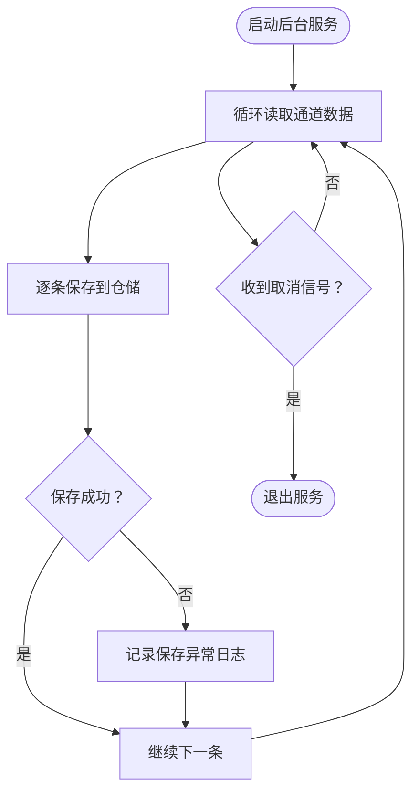
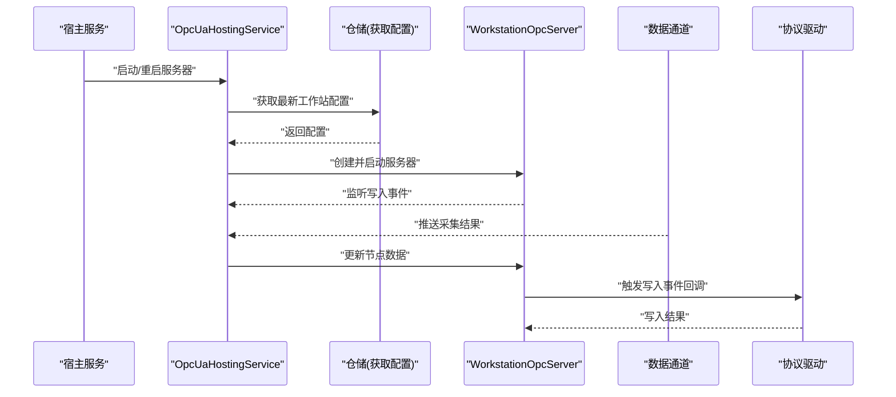
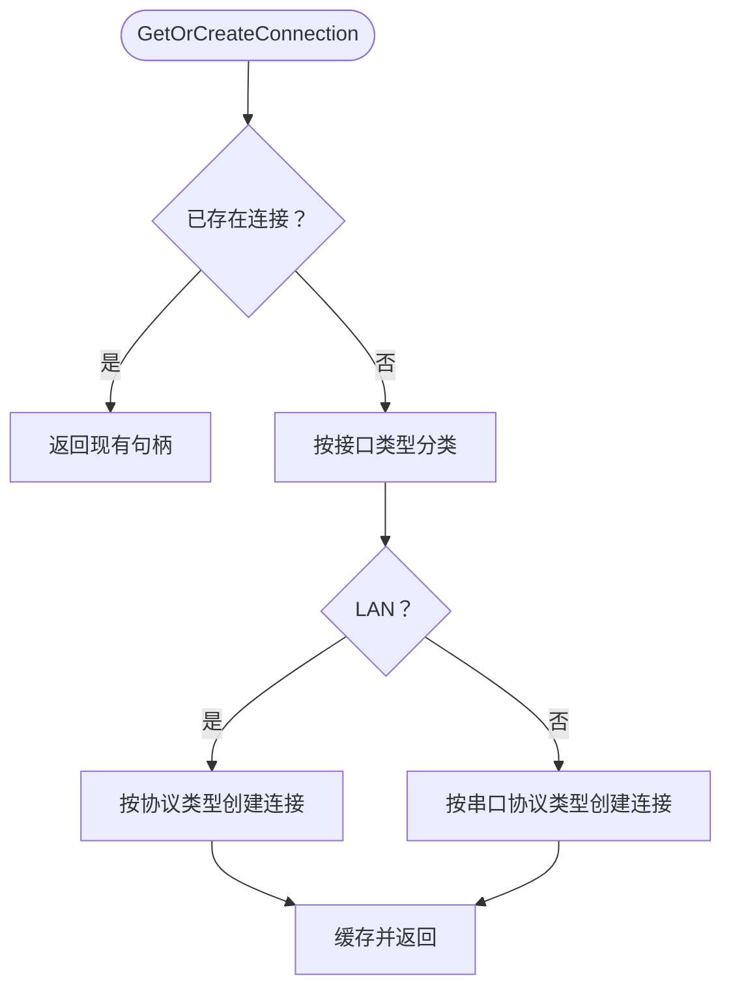
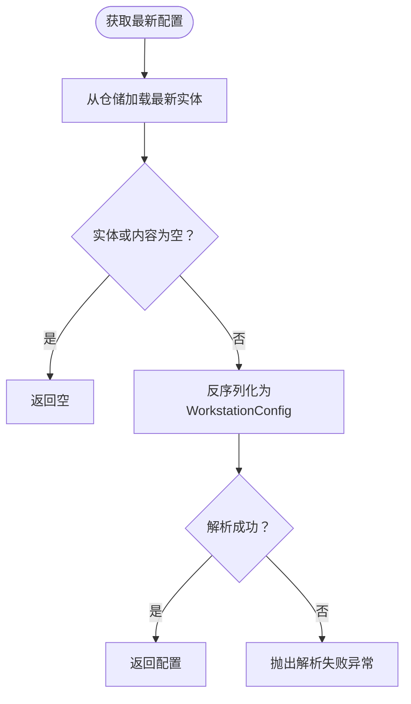
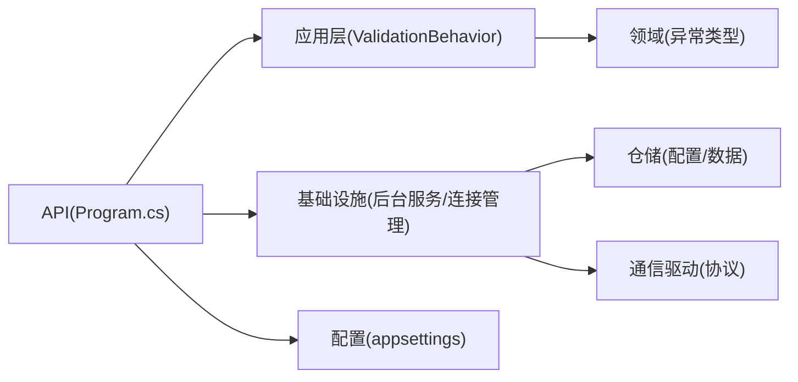

# 调试与故障排除

<cite>
**本文引用的文件**
- [Program.cs](file://IndustrialDataSolution/IndustrialDataProcessor.Api/Program.cs)
- [GlobalExceptionHandler.cs](file://IndustrialDataSolution/IndustrialDataProcessor.Api/Middleware/GlobalExceptionHandler.cs)
- [RequestLoggingMiddleware.cs](file://IndustrialDataSolution/IndustrialDataProcessor.Api/Middleware/RequestLoggingMiddleware.cs)
- [ValidationBehavior.cs](file://IndustrialDataSolution/IndustrialDataProcessor.Application/Behaviors/ValidationBehavior.cs)
- [AppServiceException.cs](file://IndustrialDataSolution/IndustrialDataProcessor.Domain/Exceptions/AppServiceException.cs)
- [DomainException.cs](file://IndustrialDataSolution/IndustrialDataProcessor.Domain/Exceptions/DomainException.cs)
- [InfrastructureException.cs](file://IndustrialDataSolution/IndustrialDataProcessor.Domain/Exceptions/InfrastructureException.cs)
- [EquipmentDataHostingService.cs](file://IndustrialDataSolution/IndustrialDataProcessor.Infrastructure/BackgroundServices/EquipmentDataHostingService.cs)
- [OpcUaHostingService.cs](file://IndustrialDataSolution/IndustrialDataProcessor.Infrastructure/BackgroundServices/OpcUaHostingService.cs)
- [ConnectionManager.cs](file://IndustrialDataSolution/IndustrialDataProcessor.Infrastructure/Communication/Connection/ConnectionManager.cs)
- [WorkstationConfigRepository.cs](file://IndustrialDataSolution/IndustrialDataProcessor.Infrastructure/Repositories/WorkstationConfigRepository.cs)
- [appsettings.json](file://IndustrialDataSolution/IndustrialDataProcessor.Api/appsettings.json)
- [appsettings.Development.json](file://IndustrialDataSolution/IndustrialDataProcessor.Api/appsettings.Development.json)
- [OpcUaDriver.cs](file://IndustrialDataSolution/IndustrialDataProcessor.Infrastructure/Communication/Drivers/TcpSpecial/OpcUaDriver.cs)
</cite>

## 目录
1. [简介](#简介)
2. [项目结构](#项目结构)
3. [核心组件](#核心组件)
4. [架构总览](#架构总览)
5. [详细组件分析](#详细组件分析)
6. [依赖关系分析](#依赖关系分析)
7. [性能考虑](#性能考虑)
8. [故障排除指南](#故障排除指南)
9. [结论](#结论)
10. [附录](#附录)

## 简介
本指南面向DDD工业数据处理解决方案的调试与故障排除场景，聚焦以下方面：
- 调试技巧与工具：Visual Studio调试器、日志分析、性能分析工具
- 异常处理与错误诊断：异常类型识别、堆栈跟踪分析、根因定位
- 网络通信问题：协议连接、超时处理、数据传输异常
- 数据库连接与查询：连接池、查询性能、事务处理
- OPC UA通信：服务器连接、节点访问、客户端认证
- 性能问题：内存泄漏检测、CPU使用率分析、并发问题排查
- 常见问题与预防措施

## 项目结构
系统采用分层架构（API、应用、领域、基础设施、共享），并围绕后台服务、中间件、异常处理、日志记录、通信驱动、OPC UA服务、配置持久化等模块组织。

图示来源
- [Program.cs](file://IndustrialDataSolution/IndustrialDataProcessor.Api/Program.cs#L1-L54)
- [GlobalExceptionHandler.cs](file://IndustrialDataSolution/IndustrialDataProcessor.Api/Middleware/GlobalExceptionHandler.cs#L1-L94)
- [RequestLoggingMiddleware.cs](file://IndustrialDataSolution/IndustrialDataProcessor.Api/Middleware/RequestLoggingMiddleware.cs#L1-L141)
- [ValidationBehavior.cs](file://IndustrialDataSolution/IndustrialDataProcessor.Application/Behaviors/ValidationBehavior.cs#L1-L31)
- [EquipmentDataHostingService.cs](file://IndustrialDataSolution/IndustrialDataProcessor.Infrastructure/BackgroundServices/EquipmentDataHostingService.cs#L1-L43)
- [OpcUaHostingService.cs](file://IndustrialDataSolution/IndustrialDataProcessor.Infrastructure/BackgroundServices/OpcUaHostingService.cs#L1-L228)
- [ConnectionManager.cs](file://IndustrialDataSolution/IndustrialDataProcessor.Infrastructure/Communication/Connection/ConnectionManager.cs#L1-L396)
- [WorkstationConfigRepository.cs](file://IndustrialDataSolution/IndustrialDataProcessor.Infrastructure/Repositories/WorkstationConfigRepository.cs#L1-L43)
- [appsettings.json](file://IndustrialDataSolution/IndustrialDataProcessor.Api/appsettings.json#L1-L17)
- [appsettings.Development.json](file://IndustrialDataSolution/IndustrialDataProcessor.Api/appsettings.Development.json#L1-L9)

章节来源
- [Program.cs](file://IndustrialDataSolution/IndustrialDataProcessor.Api/Program.cs#L1-L54)
- [appsettings.json](file://IndustrialDataSolution/IndustrialDataProcessor.Api/appsettings.json#L1-L17)
- [appsettings.Development.json](file://IndustrialDataSolution/IndustrialDataProcessor.Api/appsettings.Development.json#L1-L9)

## 核心组件
- 中间件链路：请求日志中间件优先于异常处理中间件，统一记录请求/响应与耗时，并在异常时输出标准化ProblemDetails。
- 异常处理：基于异常类型映射HTTP状态码，区分参数错误、业务规则冲突、应用服务执行失败、基础设施不可用等。
- 验证行为：在应用层通过管道前置校验，集中抛出验证异常供全局异常处理器统一处理。
- 后台服务：设备数据持久化与OPC UA服务生命周期管理，包含服务器启动/重启、通道数据更新、写入事件回调。
- 通信连接：连接管理器按接口类型与协议类型创建连接句柄，支持LAN/串口、多种工业协议及OPC UA客户端。
- 配置持久化：从数据库加载最新工作站配置，进行JSON反序列化与多态转换。

章节来源
- [RequestLoggingMiddleware.cs](file://IndustrialDataSolution/IndustrialDataProcessor.Api/Middleware/RequestLoggingMiddleware.cs#L1-L141)
- [GlobalExceptionHandler.cs](file://IndustrialDataSolution/IndustrialDataProcessor.Api/Middleware/GlobalExceptionHandler.cs#L1-L94)
- [ValidationBehavior.cs](file://IndustrialDataSolution/IndustrialDataProcessor.Application/Behaviors/ValidationBehavior.cs#L1-L31)
- [EquipmentDataHostingService.cs](file://IndustrialDataSolution/IndustrialDataProcessor.Infrastructure/BackgroundServices/EquipmentDataHostingService.cs#L1-L43)
- [OpcUaHostingService.cs](file://IndustrialDataSolution/IndustrialDataProcessor.Infrastructure/BackgroundServices/OpcUaHostingService.cs#L1-L228)
- [ConnectionManager.cs](file://IndustrialDataSolution/IndustrialDataProcessor.Infrastructure/Communication/Connection/ConnectionManager.cs#L1-L396)
- [WorkstationConfigRepository.cs](file://IndustrialDataSolution/IndustrialDataProcessor.Infrastructure/Repositories/WorkstationConfigRepository.cs#L1-L43)

## 架构总览
下图展示请求从API进入，经由中间件、控制器、应用层验证、领域与基础设施交互，再到后台服务与OPC UA服务器的流程。

图示来源
- [Program.cs](file://IndustrialDataSolution/IndustrialDataProcessor.Api/Program.cs#L36-L51)
- [RequestLoggingMiddleware.cs](file://IndustrialDataSolution/IndustrialDataProcessor.Api/Middleware/RequestLoggingMiddleware.cs#L16-L84)
- [GlobalExceptionHandler.cs](file://IndustrialDataSolution/IndustrialDataProcessor.Api/Middleware/GlobalExceptionHandler.cs#L12-L47)
- [ValidationBehavior.cs](file://IndustrialDataSolution/IndustrialDataProcessor.Application/Behaviors/ValidationBehavior.cs#L12-L29)
- [EquipmentDataHostingService.cs](file://IndustrialDataSolution/IndustrialDataProcessor.Infrastructure/BackgroundServices/EquipmentDataHostingService.cs#L16-L41)
- [OpcUaHostingService.cs](file://IndustrialDataSolution/IndustrialDataProcessor.Infrastructure/BackgroundServices/OpcUaHostingService.cs#L101-L184)

## 详细组件分析

### 异常处理与全局错误响应
- 异常类型映射：参数错误、业务规则冲突、应用服务执行失败、基础设施不可用等映射到不同HTTP状态码；验证异常输出RFC 7807格式的ProblemDetails并携带字段级错误字典。
- 日志策略：参数错误记录警告，其他异常记录错误并包含路径、方法、消息等上下文。
- 响应一致性：统一ProblemDetails结构，便于前端解析与用户提示。

图示来源
- [GlobalExceptionHandler.cs](file://IndustrialDataSolution/IndustrialDataProcessor.Api/Middleware/GlobalExceptionHandler.cs#L22-L47)

章节来源
- [GlobalExceptionHandler.cs](file://IndustrialDataSolution/IndustrialDataProcessor.Api/Middleware/GlobalExceptionHandler.cs#L1-L94)
- [AppServiceException.cs](file://IndustrialDataSolution/IndustrialDataProcessor.Domain/Exceptions/AppServiceException.cs#L1-L9)
- [DomainException.cs](file://IndustrialDataSolution/IndustrialDataProcessor.Domain/Exceptions/DomainException.cs#L1-L7)
- [InfrastructureException.cs](file://IndustrialDataSolution/IndustrialDataProcessor.Domain/Exceptions/InfrastructureException.cs#L1-L10)

### 请求日志中间件
- 计时与追踪：记录请求开始/结束、耗时、TraceId，便于跨服务串联。
- 条件记录：仅对POST/PUT/PATCH且Content-Type为JSON的请求记录请求体；仅对状态码<400且JSON响应记录响应体，避免性能开销。
- 异常兜底：捕获异常并记录，交由全局异常中间件处理。

图示来源
- [RequestLoggingMiddleware.cs](file://IndustrialDataSolution/IndustrialDataProcessor.Api/Middleware/RequestLoggingMiddleware.cs#L16-L84)

章节来源
- [RequestLoggingMiddleware.cs](file://IndustrialDataSolution/IndustrialDataProcessor.Api/Middleware/RequestLoggingMiddleware.cs#L1-L141)

### 应用层验证行为
- 统一验证：在MediatR管道前置执行FluentValidation，聚合所有验证失败并抛出统一异常。
- 放行机制：验证通过后继续执行命令处理器。

图示来源
- [ValidationBehavior.cs](file://IndustrialDataSolution/IndustrialDataProcessor.Application/Behaviors/ValidationBehavior.cs#L12-L29)

章节来源
- [ValidationBehavior.cs](file://IndustrialDataSolution/IndustrialDataProcessor.Application/Behaviors/ValidationBehavior.cs#L1-L31)

### 设备数据持久化后台服务
- 通道消费：从数据收集通道读取设备数据映射，逐条持久化到仓储。
- 错误隔离：单条数据异常单独捕获并记录日志，避免影响整体循环。
- 优雅退出：监听取消令牌，正常关闭时忽略取消异常。

图示来源
- [EquipmentDataHostingService.cs](file://IndustrialDataSolution/IndustrialDataProcessor.Infrastructure/BackgroundServices/EquipmentDataHostingService.cs#L16-L41)

章节来源
- [EquipmentDataHostingService.cs](file://IndustrialDataSolution/IndustrialDataProcessor.Infrastructure/BackgroundServices/EquipmentDataHostingService.cs#L1-L43)

### OPC UA服务后台服务
- 生命周期管理：支持启动/重启OPC UA服务器，带取消令牌与锁防止并发重启。
- 配置加载：通过DI作用域解析仓储，获取最新工作站配置并创建服务器。
- 写入事件：订阅OPC客户端写入事件，反推物理值并通过协议驱动写入设备。
- 数据更新：从通道接收采集结果，更新节点管理器数据。
- 致命错误：捕获异常并记录严重级别日志，便于快速定位。

图示来源
- [OpcUaHostingService.cs](file://IndustrialDataSolution/IndustrialDataProcessor.Infrastructure/BackgroundServices/OpcUaHostingService.cs#L63-L184)
- [ConnectionManager.cs](file://IndustrialDataSolution/IndustrialDataProcessor.Infrastructure/Communication/Connection/ConnectionManager.cs#L25-L36)

章节来源
- [OpcUaHostingService.cs](file://IndustrialDataSolution/IndustrialDataProcessor.Infrastructure/BackgroundServices/OpcUaHostingService.cs#L1-L228)
- [ConnectionManager.cs](file://IndustrialDataSolution/IndustrialDataProcessor.Infrastructure/Communication/Connection/ConnectionManager.cs#L1-L396)

### 通信连接管理
- 连接复用：以配置Id为键的并发字典缓存连接句柄，避免重复创建。
- LAN协议：支持Modbus、西门子S7、DLT/CJT、欧姆龙CIP/FINS、IEC 60870-5-104、OPC UA等，按协议类型分支创建连接。
- 串口协议：支持Modbus RTU等，按协议类型分支创建连接。
- 清理策略：提供清空与异步释放，确保资源回收。

图示来源
- [ConnectionManager.cs](file://IndustrialDataSolution/IndustrialDataProcessor.Infrastructure/Communication/Connection/ConnectionManager.cs#L25-L56)

章节来源
- [ConnectionManager.cs](file://IndustrialDataSolution/IndustrialDataProcessor.Infrastructure/Communication/Connection/ConnectionManager.cs#L1-L396)

### 工作站配置加载与反序列化
- 最新配置：从实体仓储获取最新实体，若内容为空则返回空。
- JSON反序列化：使用自定义Json选项（忽略大小写、注册多态转换器）解析为领域模型。
- 错误处理：JSON解析异常包装为业务异常并记录日志。

图示来源
- [WorkstationConfigRepository.cs](file://IndustrialDataSolution/IndustrialDataProcessor.Infrastructure/Repositories/WorkstationConfigRepository.cs#L23-L42)

章节来源
- [WorkstationConfigRepository.cs](file://IndustrialDataSolution/IndustrialDataProcessor.Infrastructure/Repositories/WorkstationConfigRepository.cs#L1-L43)

### OPC UA驱动占位实现
- 当前实现：读写方法未实现，作为占位以便后续扩展。
- 建议：结合实际OPC UA客户端库实现读写逻辑，并与连接管理器协作。

章节来源
- [OpcUaDriver.cs](file://IndustrialDataSolution/IndustrialDataProcessor.Infrastructure/Communication/Drivers/TcpSpecial/OpcUaDriver.cs#L1-L21)

## 依赖关系分析
- API层依赖应用层与基础设施层，注册健康检查、控制器、Swagger，并挂载中间件。
- 应用层依赖领域层异常与验证器，通过行为管道前置校验。
- 基础设施层依赖领域仓储与通信驱动，负责后台服务与OPC UA集成。
- 配置通过appsettings提供连接字符串、日志级别等。

图示来源
- [Program.cs](file://IndustrialDataSolution/IndustrialDataProcessor.Api/Program.cs#L18-L30)
- [ValidationBehavior.cs](file://IndustrialDataSolution/IndustrialDataProcessor.Application/Behaviors/ValidationBehavior.cs#L1-L31)
- [ConnectionManager.cs](file://IndustrialDataSolution/IndustrialDataProcessor.Infrastructure/Communication/Connection/ConnectionManager.cs#L1-L396)
- [WorkstationConfigRepository.cs](file://IndustrialDataSolution/IndustrialDataProcessor.Infrastructure/Repositories/WorkstationConfigRepository.cs#L1-L43)
- [appsettings.json](file://IndustrialDataSolution/IndustrialDataProcessor.Api/appsettings.json#L10-L12)

章节来源
- [Program.cs](file://IndustrialDataSolution/IndustrialDataProcessor.Api/Program.cs#L1-L54)
- [appsettings.json](file://IndustrialDataSolution/IndustrialDataProcessor.Api/appsettings.json#L1-L17)

## 性能考虑
- 日志开销控制：仅在Debug级别记录请求/响应体，避免高频JSON序列化带来的性能损耗。
- 并发与锁：OPC UA重启使用信号量锁，避免并发重启导致资源竞争。
- 通道消费：后台服务逐条持久化，异常独立处理，避免阻塞整体通道。
- 连接复用：连接管理器缓存连接句柄，减少频繁创建销毁的开销。
- 超时配置：连接与会话超时在配置中体现，建议结合监控调整。

[本节为通用性能建议，无需特定文件引用]

## 故障排除指南

### 调试技巧与工具
- Visual Studio调试器
  - 在API入口、中间件、后台服务、连接管理器关键路径设置断点，逐步执行观察状态。
  - 利用即时窗口与监视表达式查看请求/响应上下文、通道数据、连接句柄状态。
- 日志分析
  - 关注请求日志中间件记录的TraceId，串联一次请求的完整链路。
  - 全局异常处理器输出的ProblemDetails结构，结合日志定位异常类型与来源。
- 性能分析工具
  - 使用性能探查器关注后台服务的CPU占用与线程阻塞点。
  - 结合日志耗时统计，识别慢请求与慢通道处理环节。

章节来源
- [RequestLoggingMiddleware.cs](file://IndustrialDataSolution/IndustrialDataProcessor.Api/Middleware/RequestLoggingMiddleware.cs#L16-L84)
- [GlobalExceptionHandler.cs](file://IndustrialDataSolution/IndustrialDataProcessor.Api/Middleware/GlobalExceptionHandler.cs#L12-L47)

### 异常处理与错误诊断
- 异常类型识别
  - 参数错误：映射400，通常来自输入参数校验失败。
  - 业务规则冲突：映射409，表示违反业务规则。
  - 应用服务执行失败：映射500，表示用例执行失败。
  - 基础设施不可用：映射503，通常数据库或外部服务不可用。
- 堆栈跟踪分析
  - 全局异常处理器记录异常并包含路径、方法、消息，结合日志级别定位问题范围。
  - 对于验证异常，ProblemDetails扩展字段包含字段级错误数组，便于前端展示。
- 根因定位
  - 从API中间件链路定位首次异常点，再回溯到应用层验证与领域/基础设施调用。

章节来源
- [GlobalExceptionHandler.cs](file://IndustrialDataSolution/IndustrialDataProcessor.Api/Middleware/GlobalExceptionHandler.cs#L22-L47)
- [ValidationBehavior.cs](file://IndustrialDataSolution/IndustrialDataProcessor.Application/Behaviors/ValidationBehavior.cs#L12-L29)

### 网络通信问题
- 协议连接问题
  - LAN协议：检查IP、端口、超时配置；确认协议类型匹配与驱动可用。
  - 串口协议：确认串口名称、波特率、数据位、停止位、奇偶校验等参数。
  - OPC UA：检查Endpoint选择、证书配置、用户身份（匿名或用户名密码）。
- 超时处理
  - 连接与会话超时在配置中体现，建议结合监控与日志阈值调整。
- 数据传输异常
  - 观察连接管理器创建连接后的返回结果与异常信息，定位具体协议驱动问题。
  - 对于OPC UA写入事件，检查反推逻辑与驱动写入返回值。

章节来源
- [ConnectionManager.cs](file://IndustrialDataSolution/IndustrialDataProcessor.Infrastructure/Communication/Connection/ConnectionManager.cs#L61-L347)
- [OpcUaHostingService.cs](file://IndustrialDataSolution/IndustrialDataProcessor.Infrastructure/BackgroundServices/OpcUaHostingService.cs#L135-L158)

### 数据库连接与查询问题
- 连接池问题
  - 检查连接字符串中的池化参数（最小/最大池大小、连接生命周期、命令超时）。
  - 观察后台服务持久化异常日志，确认是否为连接丢失或超时。
- 查询性能
  - 结合数据库性能视图与慢查询日志，定位热点SQL。
  - 在应用层避免N+1查询，必要时引入批量操作。
- 事务处理
  - 对于批量写入，评估事务边界与回滚策略，避免长时间持有锁。

章节来源
- [appsettings.json](file://IndustrialDataSolution/IndustrialDataProcessor.Api/appsettings.json#L10-L12)
- [EquipmentDataHostingService.cs](file://IndustrialDataSolution/IndustrialDataProcessor.Infrastructure/BackgroundServices/EquipmentDataHostingService.cs#L23-L35)

### OPC UA通信问题
- 服务器连接
  - 确认服务器配置（基地址、安全策略、用户令牌策略），检查证书存储路径与权限。
  - 观察启动/重启流程日志，定位证书校验与Endpoint选择阶段的问题。
- 节点访问
  - 更新节点数据时捕获异常并记录，检查通道数据结构与节点管理器映射。
- 客户端认证
  - 用户名/密码为空时使用匿名身份；若启用强认证，确保凭据正确与证书策略允许。

章节来源
- [OpcUaHostingService.cs](file://IndustrialDataSolution/IndustrialDataProcessor.Infrastructure/BackgroundServices/OpcUaHostingService.cs#L116-L133)
- [OpcUaHostingService.cs](file://IndustrialDataSolution/IndustrialDataProcessor.Infrastructure/BackgroundServices/OpcUaHostingService.cs#L160-L174)
- [ConnectionManager.cs](file://IndustrialDataSolution/IndustrialDataProcessor.Infrastructure/Communication/Connection/ConnectionManager.cs#L252-L331)

### 性能问题诊断与优化
- 内存泄漏检测
  - 使用内存快照对比，关注连接句柄、通道缓冲区、日志缓冲区的生命周期。
  - 确保连接管理器与后台服务在停止时正确释放资源。
- CPU使用率分析
  - 关注后台服务循环频率与通道处理耗时，避免不必要的JSON序列化与日志记录。
- 并发问题排查
  - 检查后台服务与OPC UA重启流程的取消令牌传递与锁机制。
  - 确保通道读取与持久化操作的异步化与背压处理。

章节来源
- [EquipmentDataHostingService.cs](file://IndustrialDataSolution/IndustrialDataProcessor.Infrastructure/BackgroundServices/EquipmentDataHostingService.cs#L16-L41)
- [OpcUaHostingService.cs](file://IndustrialDataSolution/IndustrialDataProcessor.Infrastructure/BackgroundServices/OpcUaHostingService.cs#L63-L99)
- [ConnectionManager.cs](file://IndustrialDataSolution/IndustrialDataProcessor.Infrastructure/Communication/Connection/ConnectionManager.cs#L372-L394)

### 常见问题与预防措施
- 请求体过大导致日志开销高
  - 仅在Debug级别记录请求/响应体，生产环境关闭。
- 验证异常未被统一处理
  - 确保全局异常处理器已注册并生效，ProblemDetails结构一致。
- OPC UA证书问题
  - 预先生成并导入证书，确保受信任证书列表与拒绝证书列表配置正确。
- 连接泄漏
  - 使用连接管理器的清理方法，在配置变更或服务重启时释放旧连接。
- 数据持久化失败
  - 后台服务对单条数据异常进行日志记录，不影响整体通道处理。

章节来源
- [RequestLoggingMiddleware.cs](file://IndustrialDataSolution/IndustrialDataProcessor.Api/Middleware/RequestLoggingMiddleware.cs#L114-L131)
- [GlobalExceptionHandler.cs](file://IndustrialDataSolution/IndustrialDataProcessor.Api/Middleware/GlobalExceptionHandler.cs#L12-L47)
- [OpcUaHostingService.cs](file://IndustrialDataSolution/IndustrialDataProcessor.Infrastructure/BackgroundServices/OpcUaHostingService.cs#L116-L133)
- [ConnectionManager.cs](file://IndustrialDataSolution/IndustrialDataProcessor.Infrastructure/Communication/Connection/ConnectionManager.cs#L372-L394)
- [EquipmentDataHostingService.cs](file://IndustrialDataSolution/IndustrialDataProcessor.Infrastructure/BackgroundServices/EquipmentDataHostingService.cs#L30-L35)

## 结论
本指南基于代码实现总结了调试与故障排除的关键路径：以中间件链路与全局异常处理器为核心，结合应用层验证、基础设施后台服务与通信连接管理，形成从请求到持久化的完整可观测闭环。针对网络、数据库、OPC UA与性能问题提供了可操作的排查步骤与预防措施，建议在开发与生产环境中配合日志与监控持续优化。

[本节为总结性内容，无需特定文件引用]

## 附录
- 配置参考
  - 连接字符串：包含主机、端口、数据库、用户名、密码、池化参数与命令超时。
  - 日志级别：默认信息级别，可按环境调整。

章节来源
- [appsettings.json](file://IndustrialDataSolution/IndustrialDataProcessor.Api/appsettings.json#L10-L12)
- [appsettings.Development.json](file://IndustrialDataSolution/IndustrialDataProcessor.Api/appsettings.Development.json#L1-L9)