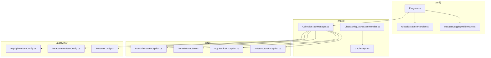
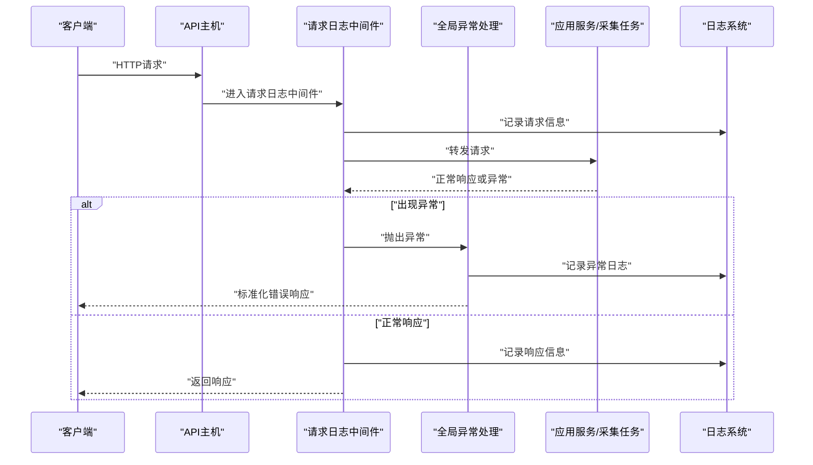
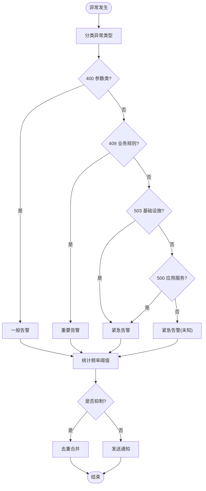
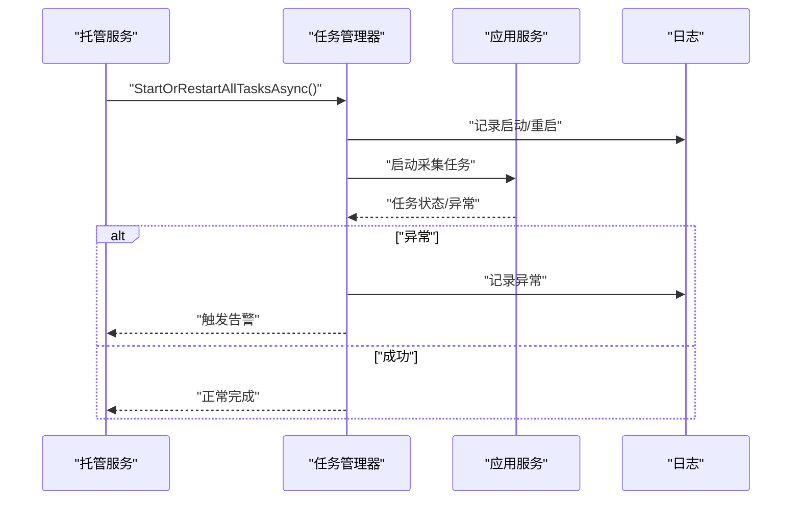
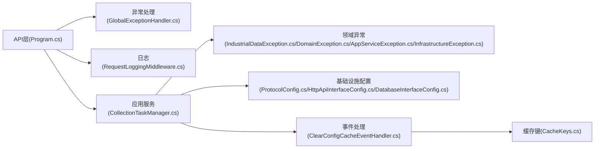

# 告警机制

<cite>
**本文引用的文件**
- [Program.cs](file://IndustrialDataSolution/IndustrialDataProcessor.Api/Program.cs)
- [GlobalExceptionHandler.cs](file://IndustrialDataSolution/IndustrialDataProcessor.Api/Middleware/GlobalExceptionHandler.cs)
- [RequestLoggingMiddleware.cs](file://IndustrialDataSolution/IndustrialDataProcessor.Api/Middleware/RequestLoggingMiddleware.cs)
- [DataCollectionHostedService.cs](file://IndustrialDataSolution/IndustrialDataProcessor.Api/BackgroundServices/DataCollectionHostedService.cs)
- [CollectionTaskManager.cs](file://IndustrialDataSolution/IndustrialDataProcessor.Application/Services/CollectionTaskManager.cs)
- [CacheKeys.cs](file://IndustrialDataSolution/IndustrialDataProcessor.Application/Constants/CacheKeys.cs)
- [ClearConfigCacheEventHandler.cs](file://IndustrialDataSolution/IndustrialDataProcessor.Application/EventHandlers/ClearConfigCacheEventHandler.cs)
- [IndustrialDataException.cs](file://IndustrialDataSolution/IndustrialDataProcessor.Domain/Exceptions/IndustrialDataException.cs)
- [DomainException.cs](file://IndustrialDataSolution/IndustrialDataProcessor.Domain/Exceptions/DomainException.cs)
- [AppServiceException.cs](file://IndustrialDataSolution/IndustrialDataProcessor.Domain/Exceptions/AppServiceException.cs)
- [InfrastructureException.cs](file://IndustrialDataSolution/IndustrialDataProcessor.Domain/Exceptions/InfrastructureException.cs)
- [TransientCommunicationException.cs](file://IndustrialDataSolution/IndustrialDataProcessor.Share/Exceptions/Communication/TransientCommunicationException.cs)
- [HttpApiInterfaceConfig.cs](file://IndustrialDataSolution/IndustrialDataProcessor.Domain/Workstation/Configs/ProtocolSub/HttpApiInterfaceConfig.cs)
- [DatabaseInterfaceConfig.cs](file://IndustrialDataSolution/IndustrialDataProcessor.Domain/Workstation/Configs/ProtocolSub/DatabaseInterfaceConfig.cs)
- [ProtocolConfig.cs](file://IndustrialDataSolution/IndustrialDataProcessor.Domain/Workstation/Configs/ProtocolConfig.cs)
- [appsettings.json](file://IndustrialDataSolution/IndustrialDataProcessor.Api/appsettings.json)
- [appsettings.Development.json](file://IndustrialDataSolution/IndustrialDataProcessor.Api/appsettings.Development.json)
</cite>

## 目录
1. [引言](#引言)
2. [项目结构](#项目结构)
3. [核心组件](#核心组件)
4. [架构总览](#架构总览)
5. [详细组件分析](#详细组件分析)
6. [依赖关系分析](#依赖关系分析)
7. [性能考虑](#性能考虑)
8. [故障排查指南](#故障排查指南)
9. [结论](#结论)
10. [附录](#附录)

## 引言
本文件面向DDD工业数据处理解决方案的“告警机制”建设，结合当前代码库现状进行系统化梳理与扩展设计说明。当前仓库已具备完善的异常处理与请求日志能力，可作为告警体系的基础支撑；同时，后台服务与采集任务管理体现了对运行时状态的可观测性需求。本文围绕以下目标展开：
- 告警触发条件设计：异常频率阈值、系统资源使用率、业务指标异常的判定标准
- 告警通知渠道集成：邮件、短信、企业微信、钉钉机器人
- 告警分级与优先级管理：紧急、重要、一般三类告警的处理流程与响应时限
- 告警去重与抑制：重复告警合并与告警风暴防护策略
- 动态配置与管理：基于业务规则的告警模板与自定义表达式
- 效果评估与持续改进：告警质量度量与优化建议
- 性能优化：在高并发场景下的告警系统稳定性保障

## 项目结构
本项目采用分层架构（API、应用、领域、基础设施、共享），其中与告警相关的关键点包括：
- API层：全局异常处理、请求日志中间件、健康检查端点
- 应用层：采集任务管理、缓存键与事件处理器
- 领域层：异常基类与业务异常类型
- 基础设施层：通信驱动与设备交互（为业务指标异常提供数据来源）

图表来源
- [Program.cs](file://IndustrialDataSolution/IndustrialDataProcessor.Api/Program.cs#L1-L54)
- [GlobalExceptionHandler.cs](file://IndustrialDataSolution/IndustrialDataProcessor.Api/Middleware/GlobalExceptionHandler.cs#L1-L94)
- [RequestLoggingMiddleware.cs](file://IndustrialDataSolution/IndustrialDataProcessor.Api/Middleware/RequestLoggingMiddleware.cs#L1-L141)
- [CollectionTaskManager.cs](file://IndustrialDataSolution/IndustrialDataProcessor.Application/Services/CollectionTaskManager.cs#L32-L60)
- [CacheKeys.cs](file://IndustrialDataSolution/IndustrialDataProcessor.Application/Constants/CacheKeys.cs#L1-L7)
- [ClearConfigCacheEventHandler.cs](file://IndustrialDataSolution/IndustrialDataProcessor.Application/EventHandlers/ClearConfigCacheEventHandler.cs#L1-L25)
- [IndustrialDataException.cs](file://IndustrialDataSolution/IndustrialDataProcessor.Domain/Exceptions/IndustrialDataException.cs#L1-L8)
- [DomainException.cs](file://IndustrialDataSolution/IndustrialDataProcessor.Domain/Exceptions/DomainException.cs#L1-L7)
- [AppServiceException.cs](file://IndustrialDataSolution/IndustrialDataProcessor.Domain/Exceptions/AppServiceException.cs#L1-L9)
- [InfrastructureException.cs](file://IndustrialDataSolution/IndustrialDataProcessor.Domain/Exceptions/InfrastructureException.cs#L1-L9)
- [HttpApiInterfaceConfig.cs](file://IndustrialDataSolution/IndustrialDataProcessor.Domain/Workstation/Configs/ProtocolSub/HttpApiInterfaceConfig.cs#L1-L29)
- [DatabaseInterfaceConfig.cs](file://IndustrialDataSolution/IndustrialDataProcessor.Domain/Workstation/Configs/ProtocolSub/DatabaseInterfaceConfig.cs#L1-L44)
- [ProtocolConfig.cs](file://IndustrialDataSolution/IndustrialDataProcessor.Domain/Workstation/Configs/ProtocolConfig.cs#L1-L50)

章节来源
- [Program.cs](file://IndustrialDataSolution/IndustrialDataProcessor.Api/Program.cs#L1-L54)
- [appsettings.json](file://IndustrialDataSolution/IndustrialDataProcessor.Api/appsettings.json#L1-L17)
- [appsettings.Development.json](file://IndustrialDataSolution/IndustrialDataProcessor.Api/appsettings.Development.json#L1-L9)

## 核心组件
- 全局异常处理：统一捕获未处理异常，输出标准化ProblemDetails响应，便于前端与监控系统识别错误类型与严重程度。
- 请求日志中间件：记录请求/响应元数据与耗时，支持按条件记录请求体/响应体，为异常溯源与性能分析提供依据。
- 后台采集服务：以托管服务形式启动数据采集任务，体现系统运行时的健康状态与任务调度能力。
- 采集任务管理：集中管理采集任务生命周期，包含取消与重启逻辑，为异常恢复与告警抑制提供基础。
- 缓存与事件：内存缓存键与配置更新事件处理器，体现系统状态变更的可观测性入口。

章节来源
- [GlobalExceptionHandler.cs](file://IndustrialDataSolution/IndustrialDataProcessor.Api/Middleware/GlobalExceptionHandler.cs#L12-L47)
- [RequestLoggingMiddleware.cs](file://IndustrialDataSolution/IndustrialDataProcessor.Api/Middleware/RequestLoggingMiddleware.cs#L16-L84)
- [DataCollectionHostedService.cs](file://IndustrialDataSolution/IndustrialDataProcessor.Api/BackgroundServices/DataCollectionHostedService.cs#L15-L26)
- [CollectionTaskManager.cs](file://IndustrialDataSolution/IndustrialDataProcessor.Application/Services/CollectionTaskManager.cs#L32-L60)
- [CacheKeys.cs](file://IndustrialDataSolution/IndustrialDataProcessor.Application/Constants/CacheKeys.cs#L5-L6)
- [ClearConfigCacheEventHandler.cs](file://IndustrialDataSolution/IndustrialDataProcessor.Application/EventHandlers/ClearConfigCacheEventHandler.cs#L16-L24)

## 架构总览
下图展示从请求进入至异常处理与日志记录的整体流程，以及后台采集服务对系统健康的影响。

图表来源
- [Program.cs](file://IndustrialDataSolution/IndustrialDataProcessor.Api/Program.cs#L38-L51)
- [RequestLoggingMiddleware.cs](file://IndustrialDataSolution/IndustrialDataProcessor.Api/Middleware/RequestLoggingMiddleware.cs#L16-L84)
- [GlobalExceptionHandler.cs](file://IndustrialDataSolution/IndustrialDataProcessor.Api/Middleware/GlobalExceptionHandler.cs#L12-L47)

## 详细组件分析

### 异常处理与告警触发
- 触发条件
  - 参数类异常（如参数缺失、参数错误）：映射为400，通常表示业务输入异常，可作为“一般告警”的触发信号。
  - 业务规则冲突（DomainException）：映射为409，指示业务层面的不一致或违反，可作为“重要告警”。
  - 应用服务执行失败（AppServiceException）：映射为500，指示用例执行失败，可作为“紧急告警”。
  - 基础设施不可用（InfrastructureException）：映射为503，指示数据库或外部服务不可用，可作为“紧急告警”。
  - 未知异常：映射为500，作为兜底告警来源。
- 告警分级建议
  - 紧急：503、500（AppServiceException、InfrastructureException）
  - 重要：409（DomainException）
  - 一般：400（参数缺失/错误）
- 告警频率阈值
  - 基于异常类型与路径统计单位时间内的异常次数，超过阈值触发告警；可结合IP/用户维度进行去重。
- 告警抑制
  - 对同一异常类型在短时间内重复出现进行抑制，避免告警风暴。

图表来源
- [GlobalExceptionHandler.cs](file://IndustrialDataSolution/IndustrialDataProcessor.Api/Middleware/GlobalExceptionHandler.cs#L22-L42)

章节来源
- [GlobalExceptionHandler.cs](file://IndustrialDataSolution/IndustrialDataProcessor.Api/Middleware/GlobalExceptionHandler.cs#L12-L47)
- [IndustrialDataException.cs](file://IndustrialDataSolution/IndustrialDataProcessor.Domain/Exceptions/IndustrialDataException.cs#L4-L8)
- [DomainException.cs](file://IndustrialDataSolution/IndustrialDataProcessor.Domain/Exceptions/DomainException.cs#L4-L7)
- [AppServiceException.cs](file://IndustrialDataSolution/IndustrialDataProcessor.Domain/Exceptions/AppServiceException.cs#L5-L8)
- [InfrastructureException.cs](file://IndustrialDataSolution/IndustrialDataProcessor.Domain/Exceptions/InfrastructureException.cs#L5-L9)

### 请求日志与性能监控
- 请求日志中间件记录请求/响应元数据、耗时与TraceId，支持按条件记录请求体/响应体，便于定位慢请求与异常。
- 建议将日志中的耗时与状态码纳入告警规则，例如：
  - 响应时间超过阈值（如95分位耗时）
  - 错误状态码占比异常升高
- 日志去重
  - 基于TraceId与异常堆栈摘要进行去重，避免重复请求导致的重复告警。

章节来源
- [RequestLoggingMiddleware.cs](file://IndustrialDataSolution/IndustrialDataProcessor.Api/Middleware/RequestLoggingMiddleware.cs#L16-L84)

### 后台采集服务与任务管理
- 后台托管服务启动采集任务，任务管理器负责任务的启动/重启与取消，体现系统健康与任务可用性。
- 建议将采集任务的启动/重启、取消与异常纳入告警范围：
  - 采集任务无法启动或频繁重启
  - 采集任务取消后未能及时释放资源
- 告警抑制
  - 对同一任务在短时间内多次失败进行抑制，合并为一次告警。

图表来源
- [DataCollectionHostedService.cs](file://IndustrialDataSolution/IndustrialDataProcessor.Api/BackgroundServices/DataCollectionHostedService.cs#L15-L26)
- [CollectionTaskManager.cs](file://IndustrialDataSolution/IndustrialDataProcessor.Application/Services/CollectionTaskManager.cs#L32-L60)

章节来源
- [DataCollectionHostedService.cs](file://IndustrialDataSolution/IndustrialDataProcessor.Api/BackgroundServices/DataCollectionHostedService.cs#L15-L26)
- [CollectionTaskManager.cs](file://IndustrialDataSolution/IndustrialDataProcessor.Application/Services/CollectionTaskManager.cs#L32-L60)

### 通信协议与业务指标异常
- 协议配置类（HTTP API、数据库）为业务指标异常提供数据来源，异常的网络/数据库访问可作为告警触发条件之一。
- 建议对以下指标进行监控与告警：
  - API调用失败率、超时率
  - 数据库连接失败率、查询超时率
  - 设备离线/无响应比例
- 告警模板
  - 按接口/协议/设备维度构建告警模板，包含上下文信息（URL、SQL、设备ID等）。

章节来源
- [HttpApiInterfaceConfig.cs](file://IndustrialDataSolution/IndustrialDataProcessor.Domain/Workstation/Configs/ProtocolSub/HttpApiInterfaceConfig.cs#L7-L28)
- [DatabaseInterfaceConfig.cs](file://IndustrialDataSolution/IndustrialDataProcessor.Domain/Workstation/Configs/ProtocolSub/DatabaseInterfaceConfig.cs#L7-L43)
- [ProtocolConfig.cs](file://IndustrialDataSolution/IndustrialDataProcessor.Domain/Workstation/Configs/ProtocolConfig.cs#L8-L50)

### 缓存与配置变更
- 内存缓存键与配置更新事件处理器体现系统状态变更的可观测性入口，可用于触发配置相关告警（如缓存未命中率上升、配置更新失败）。
- 建议对以下情况进行告警：
  - 缓存清理后短期内命中率异常下降
  - 配置更新事件触发失败

章节来源
- [CacheKeys.cs](file://IndustrialDataSolution/IndustrialDataProcessor.Application/Constants/CacheKeys.cs#L5-L6)
- [ClearConfigCacheEventHandler.cs](file://IndustrialDataSolution/IndustrialDataProcessor.Application/EventHandlers/ClearConfigCacheEventHandler.cs#L16-L24)

## 依赖关系分析
- API层依赖应用层与基础设施层提供的服务与异常类型，异常处理与日志中间件贯穿请求生命周期。
- 应用层通过任务管理器协调采集任务，任务失败将向上抛出异常，由异常处理中间件统一处理。
- 领域层异常类型为告警分级提供依据，基础设施层异常类型对应“紧急告警”。

图表来源
- [Program.cs](file://IndustrialDataSolution/IndustrialDataProcessor.Api/Program.cs#L18-L34)
- [GlobalExceptionHandler.cs](file://IndustrialDataSolution/IndustrialDataProcessor.Api/Middleware/GlobalExceptionHandler.cs#L1-L94)
- [RequestLoggingMiddleware.cs](file://IndustrialDataSolution/IndustrialDataProcessor.Api/Middleware/RequestLoggingMiddleware.cs#L1-L141)
- [CollectionTaskManager.cs](file://IndustrialDataSolution/IndustrialDataProcessor.Application/Services/CollectionTaskManager.cs#L32-L60)
- [IndustrialDataException.cs](file://IndustrialDataSolution/IndustrialDataProcessor.Domain/Exceptions/IndustrialDataException.cs#L4-L8)
- [DomainException.cs](file://IndustrialDataSolution/IndustrialDataProcessor.Domain/Exceptions/DomainException.cs#L4-L7)
- [AppServiceException.cs](file://IndustrialDataSolution/IndustrialDataProcessor.Domain/Exceptions/AppServiceException.cs#L5-L8)
- [InfrastructureException.cs](file://IndustrialDataSolution/IndustrialDataProcessor.Domain/Exceptions/InfrastructureException.cs#L5-L9)
- [ProtocolConfig.cs](file://IndustrialDataSolution/IndustrialDataProcessor.Domain/Workstation/Configs/ProtocolConfig.cs#L8-L50)
- [HttpApiInterfaceConfig.cs](file://IndustrialDataSolution/IndustrialDataProcessor.Domain/Workstation/Configs/ProtocolSub/HttpApiInterfaceConfig.cs#L7-L28)
- [DatabaseInterfaceConfig.cs](file://IndustrialDataSolution/IndustrialDataProcessor.Domain/Workstation/Configs/ProtocolSub/DatabaseInterfaceConfig.cs#L7-L43)
- [ClearConfigCacheEventHandler.cs](file://IndustrialDataSolution/IndustrialDataProcessor.Application/EventHandlers/ClearConfigCacheEventHandler.cs#L16-L24)
- [CacheKeys.cs](file://IndustrialDataSolution/IndustrialDataProcessor.Application/Constants/CacheKeys.cs#L5-L6)

章节来源
- [Program.cs](file://IndustrialDataSolution/IndustrialDataProcessor.Api/Program.cs#L18-L34)

## 性能考虑
- 日志记录的性能开销控制
  - 仅在Debug级别且满足条件时记录请求体/响应体，避免大体积负载带来的性能损耗。
  - 使用内存流拦截响应体，结束后再写回，减少阻塞。
- 异常处理的吞吐保障
  - 异常处理中间件应快速序列化ProblemDetails并返回，避免阻塞请求管线。
- 采集任务的资源占用
  - 任务管理器在取消旧任务时增加短暂延时，确保资源释放，降低竞争与抖动风险。
- 健康检查与限流
  - 结合健康检查端点与外部限流策略，防止告警风暴引发级联故障。

章节来源
- [RequestLoggingMiddleware.cs](file://IndustrialDataSolution/IndustrialDataProcessor.Api/Middleware/RequestLoggingMiddleware.cs#L29-L68)
- [CollectionTaskManager.cs](file://IndustrialDataSolution/IndustrialDataProcessor.Application/Services/CollectionTaskManager.cs#L32-L40)
- [Program.cs](file://IndustrialDataSolution/IndustrialDataProcessor.Api/Program.cs#L47-L49)

## 故障排查指南
- 快速定位
  - 查看请求日志中的TraceId与耗时，结合异常处理中间件输出的状态码与标题，快速判断异常类型。
- 常见问题
  - 参数类异常：检查请求体与参数校验规则，确认客户端是否正确传递参数。
  - 业务规则冲突：检查领域规则与业务流程，确认是否存在并发或状态不一致。
  - 应用服务执行失败：查看应用服务内部异常堆栈，定位具体用例执行失败点。
  - 基础设施不可用：检查数据库连接字符串与外部服务可用性，确认网络与认证配置。
- 事件与缓存
  - 若配置更新后缓存未生效，检查事件处理器是否触发缓存清理，确认缓存键是否正确。

章节来源
- [RequestLoggingMiddleware.cs](file://IndustrialDataSolution/IndustrialDataProcessor.Api/Middleware/RequestLoggingMiddleware.cs#L72-L78)
- [GlobalExceptionHandler.cs](file://IndustrialDataSolution/IndustrialDataProcessor.Api/Middleware/GlobalExceptionHandler.cs#L22-L42)
- [ClearConfigCacheEventHandler.cs](file://IndustrialDataSolution/IndustrialDataProcessor.Application/EventHandlers/ClearConfigCacheEventHandler.cs#L16-L24)
- [appsettings.json](file://IndustrialDataSolution/IndustrialDataProcessor.Api/appsettings.json#L10-L16)

## 结论
当前代码库已具备完善的异常处理与请求日志能力，可作为告警体系的坚实基础。通过将异常类型映射到告警级别、引入频率阈值与抑制策略、结合采集任务与通信协议的可观测性数据，可构建覆盖系统运行全链路的告警机制。后续建议在现有基础上补充通知渠道集成、动态规则引擎与效果评估体系，以实现持续改进与稳定运行。

## 附录
- 告警通知渠道集成建议
  - 邮件告警：对接SMTP服务，按级别发送不同模板
  - 短信通知：对接短信网关，设置黑名单与速率限制
  - 企业微信/钉钉机器人：通过Webhook推送消息，支持@指定人员
- 告警分级与优先级
  - 紧急：503、500（AppServiceException、InfrastructureException）
  - 重要：409（DomainException）
  - 一般：400（参数缺失/错误）
- 告警去重与抑制
  - 基于异常类型、路径、参数摘要与时间窗口进行去重
  - 对同一指标在短时间内的重复告警进行抑制
- 动态配置与管理
  - 提供告警模板与表达式编辑界面，支持按业务域与设备类型配置
- 告警效果评估与持续改进
  - 关注误报率、漏报率、平均修复时间（MTTR）、告警密度等指标
  - 定期回顾与优化阈值与规则，减少噪声并提升有效性