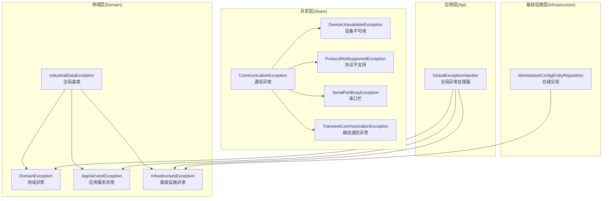
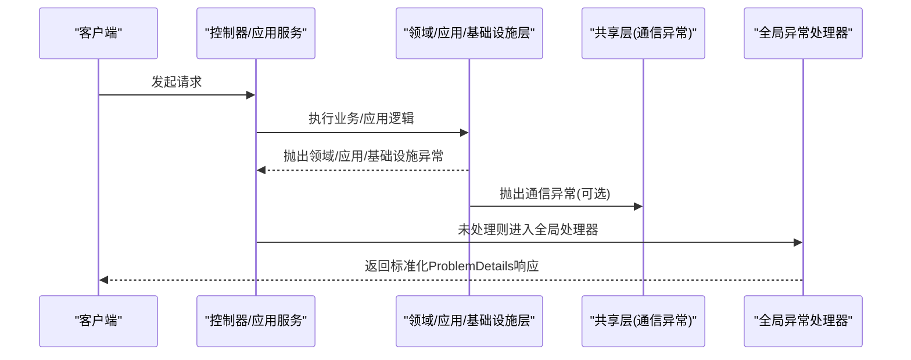
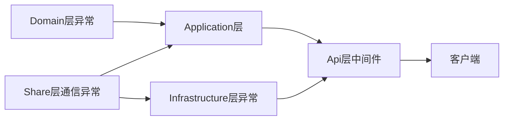

# 异常分类体系

<cite>
**本文档引用的文件**
- [IndustrialDataException.cs](file://IndustrialDataSolution/IndustrialDataProcessor.Domain/Exceptions/IndustrialDataException.cs)
- [DomainException.cs](file://IndustrialDataSolution/IndustrialDataProcessor.Domain/Exceptions/DomainException.cs)
- [AppServiceException.cs](file://IndustrialDataSolution/IndustrialDataProcessor.Domain/Exceptions/AppServiceException.cs)
- [InfrastructureException.cs](file://IndustrialDataSolution/IndustrialDataProcessor.Domain/Exceptions/InfrastructureException.cs)
- [CommunicationException.cs](file://IndustrialDataSolution/IndustrialDataProcessor.Share/Exceptions/Communication/CommunicationException.cs)
- [DeviceUnavailableException.cs](file://IndustrialDataSolution/IndustrialDataProcessor.Share/Exceptions/Communication/DeviceUnavailableException.cs)
- [ProtocolNotSupportedException.cs](file://IndustrialDataSolution/IndustrialDataProcessor.Share/Exceptions/Communication/ProtocolNotSupportedException.cs)
- [SerialPortBusyException.cs](file://IndustrialDataSolution/IndustrialDataProcessor.Share/Exceptions/Communication/SerialPortBusyException.cs)
- [TransientCommunicationException.cs](file://IndustrialDataSolution/IndustrialDataProcessor.Share/Exceptions/Communication/TransientCommunicationException.cs)
- [GlobalExceptionHandler.cs](file://IndustrialDataSolution/IndustrialDataProcessor.Api/Middleware/GlobalExceptionHandler.cs)
- [WorkstationConfigEntityRepository.cs](file://IndustrialDataSolution/IndustrialDataProcessor.Infrastructure.Persistence.SqlSugar/Repositories/WorkstationConfigEntityRepository.cs)
</cite>

## 目录
1. [引言](#引言)
2. [项目结构](#项目结构)
3. [核心组件](#核心组件)
4. [架构总览](#架构总览)
5. [详细组件分析](#详细组件分析)
6. [依赖分析](#依赖分析)
7. [性能考虑](#性能考虑)
8. [故障排除指南](#故障排除指南)
9. [结论](#结论)

## 引言
本文件系统性梳理DDD工业数据处理解决方案中的异常分类体系，围绕“工业数据异常”作为全局基类，构建分层异常模型：领域异常、应用服务异常、基础设施异常与通信异常。文档重点阐述：
- 分层异常的职责边界与继承关系
- 命名规范与语义化设计原则
- 最佳实践与设计模式
- 实际使用场景与错误处理策略

## 项目结构
异常体系分布于多个子项目中，遵循DDD分层架构：
- Domain层：定义全局基类与分层异常（领域、应用、基础设施）
- Share层：定义通信相关异常，供跨层复用
- Api层：通过中间件统一捕获并映射为HTTP响应
- Infrastructure.Persistence.SqlSugar：基础设施层具体实现中抛出基础设施异常



图表来源
- [IndustrialDataException.cs](file://IndustrialDataSolution/IndustrialDataProcessor.Domain/Exceptions/IndustrialDataException.cs#L1-L9)
- [DomainException.cs](file://IndustrialDataSolution/IndustrialDataProcessor.Domain/Exceptions/DomainException.cs#L1-L7)
- [AppServiceException.cs](file://IndustrialDataSolution/IndustrialDataProcessor.Domain/Exceptions/AppServiceException.cs#L1-L9)
- [InfrastructureException.cs](file://IndustrialDataSolution/IndustrialDataProcessor.Domain/Exceptions/InfrastructureException.cs#L1-L10)
- [CommunicationException.cs](file://IndustrialDataSolution/IndustrialDataProcessor.Share/Exceptions/Communication/CommunicationException.cs#L1-L6)
- [DeviceUnavailableException.cs](file://IndustrialDataSolution/IndustrialDataProcessor.Share/Exceptions/Communication/DeviceUnavailableException.cs#L1-L6)
- [ProtocolNotSupportedException.cs](file://IndustrialDataSolution/IndustrialDataProcessor.Share/Exceptions/Communication/ProtocolNotSupportedException.cs#L1-L6)
- [SerialPortBusyException.cs](file://IndustrialDataSolution/IndustrialDataProcessor.Share/Exceptions/Communication/SerialPortBusyException.cs#L1-L6)
- [TransientCommunicationException.cs](file://IndustrialDataSolution/IndustrialDataProcessor.Share/Exceptions/Communication/TransientCommunicationException.cs#L1-L6)
- [GlobalExceptionHandler.cs](file://IndustrialDataSolution/IndustrialDataProcessor.Api/Middleware/GlobalExceptionHandler.cs#L26-L55)
- [WorkstationConfigEntityRepository.cs](file://IndustrialDataSolution/IndustrialDataProcessor.Infrastructure.Persistence.SqlSugar/Repositories/WorkstationConfigEntityRepository.cs#L20-L20)

章节来源
- [IndustrialDataException.cs](file://IndustrialDataSolution/IndustrialDataProcessor.Domain/Exceptions/IndustrialDataException.cs#L1-L9)
- [GlobalExceptionHandler.cs](file://IndustrialDataSolution/IndustrialDataProcessor.Api/Middleware/GlobalExceptionHandler.cs#L26-L55)

## 核心组件
- 工业数据异常（全局基类）：定义所有工业数据相关异常的统一基类，提供一致的消息与内层异常封装能力。
- 领域异常：用于表达业务规则被破坏、聚合状态无效等领域级错误。
- 应用服务异常：用于表达应用层用例执行失败、并发冲突、实体不存在等应用级错误。
- 基础设施异常：用于表达数据库、外部服务、文件系统等基础设施故障。
- 通信异常：用于表达工业设备通信过程中的故障，如设备不可用、协议不支持、串口忙、瞬态通信错误等。

章节来源
- [IndustrialDataException.cs](file://IndustrialDataSolution/IndustrialDataProcessor.Domain/Exceptions/IndustrialDataException.cs#L1-L9)
- [DomainException.cs](file://IndustrialDataSolution/IndustrialDataProcessor.Domain/Exceptions/DomainException.cs#L1-L7)
- [AppServiceException.cs](file://IndustrialDataSolution/IndustrialDataProcessor.Domain/Exceptions/AppServiceException.cs#L1-L9)
- [InfrastructureException.cs](file://IndustrialDataSolution/IndustrialDataProcessor.Domain/Exceptions/InfrastructureException.cs#L1-L10)
- [CommunicationException.cs](file://IndustrialDataSolution/IndustrialDataProcessor.Share/Exceptions/Communication/CommunicationException.cs#L1-L6)

## 架构总览
异常在系统中的流转路径如下：领域/应用/基础设施层抛出相应异常；API层中间件捕获并根据异常类型映射为标准化的HTTP响应；通信异常在共享层定义，便于跨层复用。



图表来源
- [GlobalExceptionHandler.cs](file://IndustrialDataSolution/IndustrialDataProcessor.Api/Middleware/GlobalExceptionHandler.cs#L26-L55)
- [DomainException.cs](file://IndustrialDataSolution/IndustrialDataProcessor.Domain/Exceptions/DomainException.cs#L1-L7)
- [AppServiceException.cs](file://IndustrialDataSolution/IndustrialDataProcessor.Domain/Exceptions/AppServiceException.cs#L1-L9)
- [InfrastructureException.cs](file://IndustrialDataSolution/IndustrialDataProcessor.Domain/Exceptions/InfrastructureException.cs#L1-L10)
- [CommunicationException.cs](file://IndustrialDataSolution/IndustrialDataProcessor.Share/Exceptions/Communication/CommunicationException.cs#L1-L6)

## 详细组件分析

### 工业数据异常层次结构
工业数据异常采用抽象基类+分层派生的模式，确保异常语义清晰、职责分离、易于扩展与维护。

```mermaid
classDiagram
class IndustrialDataException {
"+message"
"+inner"
"+IndustrialDataException(message)"
"+IndustrialDataException(message, inner)"
}
class DomainException {
"+DomainException(message)"
}
class AppServiceException {
"+AppServiceException(message)"
}
class InfrastructureException {
"+InfrastructureException(message)"
"+InfrastructureException(message, inner)"
}
class CommunicationException {
"+CommunicationException(message, inner)"
}
class DeviceUnavailableException {
"+DeviceUnavailableException(message, inner)"
}
class ProtocolNotSupportedException {
"+ProtocolNotSupportedException(message, inner)"
}
class SerialPortBusyException {
"+SerialPortBusyException(message, inner)"
}
class TransientCommunicationException {
"+TransientCommunicationException(message, inner)"
}
IndustrialDataException <|-- DomainException
IndustrialDataException <|-- AppServiceException
IndustrialDataException <|-- InfrastructureException
CommunicationException <|-- DeviceUnavailableException
CommunicationException <|-- ProtocolNotSupportedException
CommunicationException <|-- SerialPortBusyException
CommunicationException <|-- TransientCommunicationException
```

图表来源
- [IndustrialDataException.cs](file://IndustrialDataSolution/IndustrialDataProcessor.Domain/Exceptions/IndustrialDataException.cs#L1-L9)
- [DomainException.cs](file://IndustrialDataSolution/IndustrialDataProcessor.Domain/Exceptions/DomainException.cs#L1-L7)
- [AppServiceException.cs](file://IndustrialDataSolution/IndustrialDataProcessor.Domain/Exceptions/AppServiceException.cs#L1-L9)
- [InfrastructureException.cs](file://IndustrialDataSolution/IndustrialDataProcessor.Domain/Exceptions/InfrastructureException.cs#L1-L10)
- [CommunicationException.cs](file://IndustrialDataSolution/IndustrialDataProcessor.Share/Exceptions/Communication/CommunicationException.cs#L1-L6)
- [DeviceUnavailableException.cs](file://IndustrialDataSolution/IndustrialDataProcessor.Share/Exceptions/Communication/DeviceUnavailableException.cs#L1-L6)
- [ProtocolNotSupportedException.cs](file://IndustrialDataSolution/IndustrialDataProcessor.Share/Exceptions/Communication/ProtocolNotSupportedException.cs#L1-L6)
- [SerialPortBusyException.cs](file://IndustrialDataSolution/IndustrialDataProcessor.Share/Exceptions/Communication/SerialPortBusyException.cs#L1-L6)
- [TransientCommunicationException.cs](file://IndustrialDataSolution/IndustrialDataProcessor.Share/Exceptions/Communication/TransientCommunicationException.cs#L1-L6)

章节来源
- [IndustrialDataException.cs](file://IndustrialDataSolution/IndustrialDataProcessor.Domain/Exceptions/IndustrialDataException.cs#L1-L9)
- [DomainException.cs](file://IndustrialDataSolution/IndustrialDataProcessor.Domain/Exceptions/DomainException.cs#L1-L7)
- [AppServiceException.cs](file://IndustrialDataSolution/IndustrialDataProcessor.Domain/Exceptions/AppServiceException.cs#L1-L9)
- [InfrastructureException.cs](file://IndustrialDataSolution/IndustrialDataProcessor.Domain/Exceptions/InfrastructureException.cs#L1-L10)
- [CommunicationException.cs](file://IndustrialDataSolution/IndustrialDataProcessor.Share/Exceptions/Communication/CommunicationException.cs#L1-L6)

### 异常继承关系与命名规范
- 继承关系
  - 工业数据异常为所有工业相关异常的抽象基类，领域/应用/基础设施异常均继承自该基类。
  - 通信异常独立于工业数据异常层次，但同样以Exception为基类，便于在共享层复用。
- 命名规范
  - 采用语义化命名，异常类名应准确反映错误类型与上下文，避免模糊表述。
  - 使用后缀区分异常类型：如“Exception”、“Unavailable”、“NotSupportedException”、“Busy”、“Transient”等，增强可读性与一致性。
  - 内部消息应简洁明确，必要时保留内层异常以便追踪。

章节来源
- [IndustrialDataException.cs](file://IndustrialDataSolution/IndustrialDataProcessor.Domain/Exceptions/IndustrialDataException.cs#L1-L9)
- [CommunicationException.cs](file://IndustrialDataSolution/IndustrialDataProcessor.Share/Exceptions/Communication/CommunicationException.cs#L1-L6)

### 各层异常职责
- 领域异常：用于表达业务规则被破坏、聚合状态无效等，通常由领域对象在自身不变量被破坏时抛出。
- 应用服务异常：用于表达应用层用例执行失败、并发冲突、实体不存在等，强调业务流程层面的错误。
- 基础设施异常：用于表达数据库、外部服务、文件系统等基础设施故障，强调技术层面的问题。
- 通信异常：用于表达工业设备通信故障，如设备不可用、协议不支持、串口忙、瞬态通信错误等，覆盖工业网络与设备交互场景。

章节来源
- [DomainException.cs](file://IndustrialDataSolution/IndustrialDataProcessor.Domain/Exceptions/DomainException.cs#L1-L7)
- [AppServiceException.cs](file://IndustrialDataSolution/IndustrialDataProcessor.Domain/Exceptions/AppServiceException.cs#L1-L9)
- [InfrastructureException.cs](file://IndustrialDataSolution/IndustrialDataProcessor.Domain/Exceptions/InfrastructureException.cs#L1-L10)
- [CommunicationException.cs](file://IndustrialDataSolution/IndustrialDataProcessor.Share/Exceptions/Communication/CommunicationException.cs#L1-L6)

### 异常使用示例与错误场景分析
- 领域异常使用场景
  - 当业务规则被违反或聚合状态无效时，抛出领域异常，使调用方能够明确识别业务层面的错误。
- 应用服务异常使用场景
  - 当应用层用例执行失败（如并发冲突、实体不存在）时，抛出应用服务异常，便于上层统一处理。
- 基础设施异常使用场景
  - 数据库写入失败、外部服务不可用等基础设施问题，抛出基础设施异常，便于统一降级与重试策略。
- 通信异常使用场景
  - 设备不可用、协议不支持、串口忙、瞬态通信错误等，抛出对应通信异常，便于快速定位通信链路问题。

章节来源
- [GlobalExceptionHandler.cs](file://IndustrialDataSolution/IndustrialDataProcessor.Api/Middleware/GlobalExceptionHandler.cs#L26-L55)
- [WorkstationConfigEntityRepository.cs](file://IndustrialDataSolution/IndustrialDataProcessor.Infrastructure.Persistence.SqlSugar/Repositories/WorkstationConfigEntityRepository.cs#L20-L20)

## 依赖分析
异常体系的依赖关系体现了分层解耦与职责分离：
- 领域层异常仅在Domain层可见，保证领域模型的纯净性。
- 应用层异常在Application层可见，避免领域知识泄露到应用层。
- 基础设施异常在Infrastructure层可见，隔离技术细节。
- 通信异常在Share层可见，便于跨层复用与统一管理。



图表来源
- [GlobalExceptionHandler.cs](file://IndustrialDataSolution/IndustrialDataProcessor.Api/Middleware/GlobalExceptionHandler.cs#L26-L55)
- [WorkstationConfigEntityRepository.cs](file://IndustrialDataSolution/IndustrialDataProcessor.Infrastructure.Persistence.SqlSugar/Repositories/WorkstationConfigEntityRepository.cs#L20-L20)

章节来源
- [GlobalExceptionHandler.cs](file://IndustrialDataSolution/IndustrialDataProcessor.Api/Middleware/GlobalExceptionHandler.cs#L26-L55)
- [WorkstationConfigEntityRepository.cs](file://IndustrialDataSolution/IndustrialDataProcessor.Infrastructure.Persistence.SqlSugar/Repositories/WorkstationConfigEntityRepository.cs#L20-L20)

## 性能考虑
- 异常开销控制：避免在热路径频繁抛出异常，优先通过返回值或状态码表达预期错误。
- 异常消息优化：异常消息应简洁明了，避免包含敏感信息与冗余堆栈。
- 重试与熔断：对瞬态通信异常与基础设施异常建议结合重试与熔断策略，减少抖动对系统的影响。
- 日志与监控：统一记录异常日志并上报监控指标，便于快速定位与恢复。

## 故障排除指南
- 业务规则冲突（409）
  - 现象：领域异常导致业务规则冲突。
  - 排查：检查领域对象的不变量与业务规则，确认输入参数与状态是否满足约束。
- 应用服务执行失败（500）
  - 现象：应用服务异常导致用例执行失败。
  - 排查：检查并发冲突、实体存在性、工作流执行步骤，确认异常消息与上下文。
- 基础设施不可用（503/500）
  - 现象：基础设施异常导致数据库或外部服务不可用。
  - 排查：检查数据库连接、外部API可用性、文件系统权限，确认重试与降级策略生效。
- 通信故障
  - 现象：设备不可用、协议不支持、串口忙、瞬态通信错误。
  - 排查：检查设备状态、协议配置、串口占用情况，评估瞬态错误的重试策略。

章节来源
- [GlobalExceptionHandler.cs](file://IndustrialDataSolution/IndustrialDataProcessor.Api/Middleware/GlobalExceptionHandler.cs#L26-L55)
- [DeviceUnavailableException.cs](file://IndustrialDataSolution/IndustrialDataProcessor.Share/Exceptions/Communication/DeviceUnavailableException.cs#L1-L6)
- [ProtocolNotSupportedException.cs](file://IndustrialDataSolution/IndustrialDataProcessor.Share/Exceptions/Communication/ProtocolNotSupportedException.cs#L1-L6)
- [SerialPortBusyException.cs](file://IndustrialDataSolution/IndustrialDataProcessor.Share/Exceptions/Communication/SerialPortBusyException.cs#L1-L6)
- [TransientCommunicationException.cs](file://IndustrialDataSolution/IndustrialDataProcessor.Share/Exceptions/Communication/TransientCommunicationException.cs#L1-L6)

## 结论
本异常分类体系以“工业数据异常”为全局基类，结合领域、应用、基础设施与通信四类异常，形成清晰的分层职责与继承关系。通过语义化命名与统一的异常处理机制，系统能够在不同层面对错误进行精准表达与高效处理。建议在后续演进中持续完善异常消息规范与监控告警，提升系统的可观测性与稳定性。