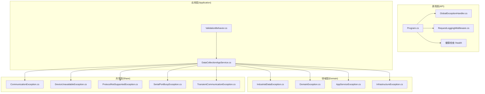
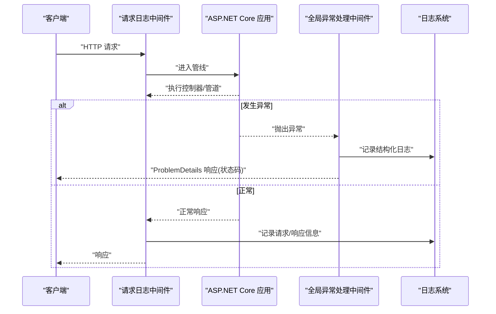
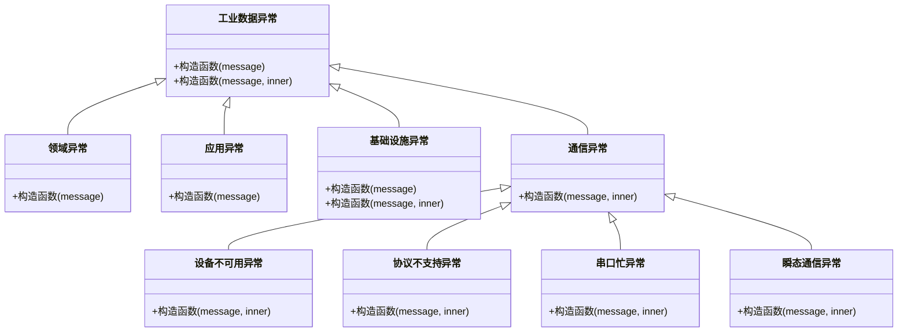
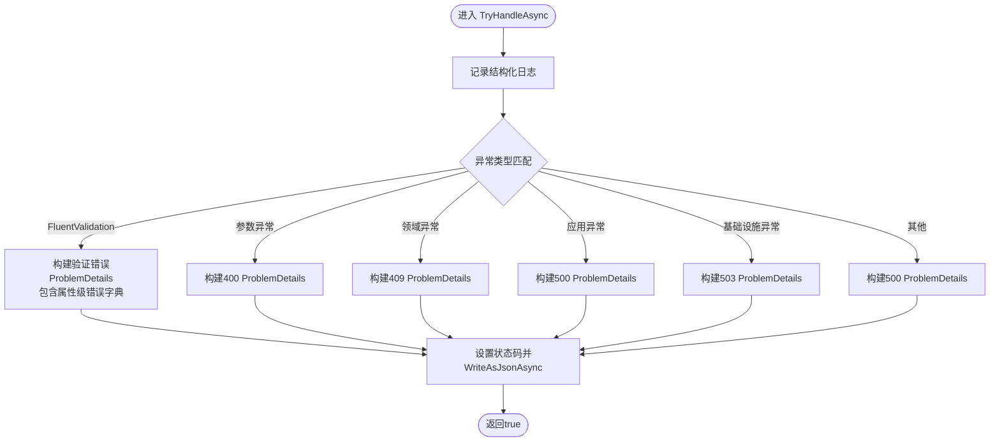
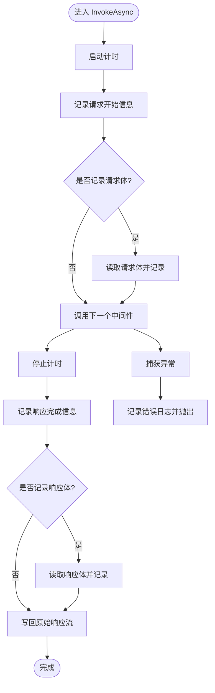
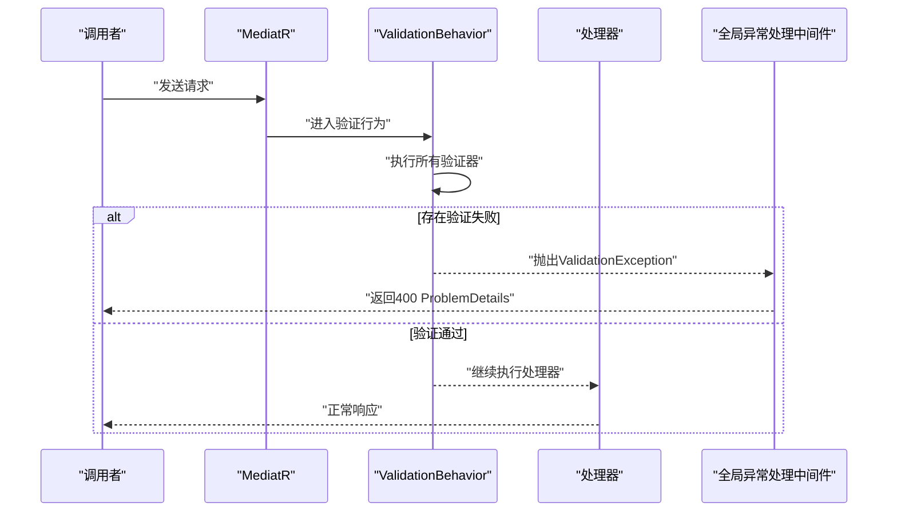
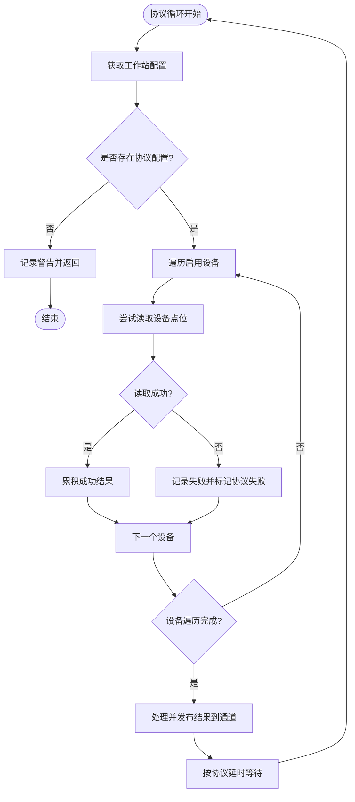
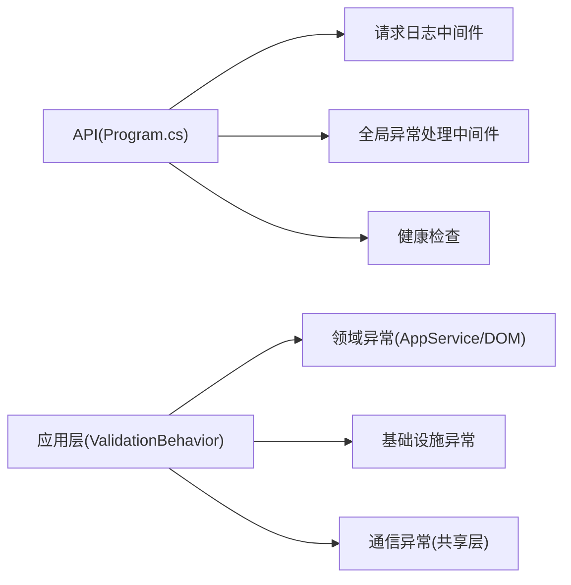

# 异常处理与监控

<cite>
**本文引用的文件**
- [GlobalExceptionHandler.cs](file://IndustrialDataSolution/IndustrialDataProcessor.Api/Middleware/GlobalExceptionHandler.cs)
- [RequestLoggingMiddleware.cs](file://IndustrialDataSolution/IndustrialDataProcessor.Api/Middleware/RequestLoggingMiddleware.cs)
- [Program.cs](file://IndustrialDataSolution/IndustrialDataProcessor.Api/Program.cs)
- [IndustrialDataException.cs](file://IndustrialDataSolution/IndustrialDataProcessor.Domain/Exceptions/IndustrialDataException.cs)
- [DomainException.cs](file://IndustrialDataSolution/IndustrialDataProcessor.Domain/Exceptions/DomainException.cs)
- [AppServiceException.cs](file://IndustrialDataSolution/IndustrialDataProcessor.Domain/Exceptions/AppServiceException.cs)
- [InfrastructureException.cs](file://IndustrialDataSolution/IndustrialDataProcessor.Domain/Exceptions/InfrastructureException.cs)
- [CommunicationException.cs](file://IndustrialDataSolution/IndustrialDataProcessor.Share/Exceptions/Communication/CommunicationException.cs)
- [DeviceUnavailableException.cs](file://IndustrialDataSolution/IndustrialDataProcessor.Share/Exceptions/Communication/DeviceUnavailableException.cs)
- [ProtocolNotSupportedException.cs](file://IndustrialDataSolution/IndustrialDataProcessor.Share/Exceptions/Communication/ProtocolNotSupportedException.cs)
- [SerialPortBusyException.cs](file://IndustrialDataSolution/IndustrialDataProcessor.Share/Exceptions/Communication/SerialPortBusyException.cs)
- [TransientCommunicationException.cs](file://IndustrialDataSolution/IndustrialDataProcessor.Share/Exceptions/Communication/TransientCommunicationException.cs)
- [ValidationBehavior.cs](file://IndustrialDataSolution/IndustrialDataProcessor.Application/Behaviors/ValidationBehavior.cs)
- [DataCollectionAppService.cs](file://IndustrialDataSolution/IndustrialDataProcessor.Application/Services/DataCollectionAppService.cs)
- [appsettings.json](file://IndustrialDataSolution/IndustrialDataProcessor.Api/appsettings.json)
- [appsettings.Development.json](file://IndustrialDataSolution/IndustrialDataProcessor.Api/appsettings.Development.json)
</cite>

## 目录
1. [引言](#引言)
2. [项目结构](#项目结构)
3. [核心组件](#核心组件)
4. [架构总览](#架构总览)
5. [详细组件分析](#详细组件分析)
6. [依赖关系分析](#依赖关系分析)
7. [性能考量](#性能考量)
8. [故障排查指南](#故障排查指南)
9. [结论](#结论)
10. [附录](#附录)

## 引言
本文件面向DDD工业数据处理解决方案，系统性阐述异常处理与监控体系的设计与实现，覆盖异常分类层级、异常转换策略、日志记录规范、监控指标设计、告警配置建议、错误恢复与降级策略，以及故障诊断与根因分析方法论，并提供可操作的监控仪表板与告警规则配置指引。

## 项目结构
本项目采用多层架构（表现层、应用层、领域层、基础设施层），异常与监控能力主要分布在以下模块：
- 表现层（API）：全局异常中间件、请求日志中间件、健康检查、问题详情（ProblemDetails）注册
- 应用层（Application）：统一验证行为（FluentValidation）、数据采集应用服务（含协议级异常隔离）
- 领域层（Domain）：异常基类与分层异常类型
- 共享层（Share）：通信异常类型（设备不可用、协议不支持、串口忙、瞬态通信异常等）

图表来源
- [Program.cs](file://IndustrialDataSolution/IndustrialDataProcessor.Api/Program.cs#L32-L41)
- [GlobalExceptionHandler.cs](file://IndustrialDataSolution/IndustrialDataProcessor.Api/Middleware/GlobalExceptionHandler.cs#L12-L47)
- [RequestLoggingMiddleware.cs](file://IndustrialDataSolution/IndustrialDataProcessor.Api/Middleware/RequestLoggingMiddleware.cs#L16-L84)
- [ValidationBehavior.cs](file://IndustrialDataSolution/IndustrialDataProcessor.Application/Behaviors/ValidationBehavior.cs#L12-L29)
- [DataCollectionAppService.cs](file://IndustrialDataSolution/IndustrialDataProcessor.Application/Services/DataCollectionAppService.cs#L46-L214)
- [IndustrialDataException.cs](file://IndustrialDataSolution/IndustrialDataProcessor.Domain/Exceptions/IndustrialDataException.cs#L4-L8)
- [DomainException.cs](file://IndustrialDataSolution/IndustrialDataProcessor.Domain/Exceptions/DomainException.cs#L4-L7)
- [AppServiceException.cs](file://IndustrialDataSolution/IndustrialDataProcessor.Domain/Exceptions/AppServiceException.cs#L5-L9)
- [InfrastructureException.cs](file://IndustrialDataSolution/IndustrialDataProcessor.Domain/Exceptions/InfrastructureException.cs#L5-L10)
- [CommunicationException.cs](file://IndustrialDataSolution/IndustrialDataProcessor.Share/Exceptions/Communication/CommunicationException.cs#L3-L6)
- [DeviceUnavailableException.cs](file://IndustrialDataSolution/IndustrialDataProcessor.Share/Exceptions/Communication/DeviceUnavailableException.cs#L3-L6)
- [ProtocolNotSupportedException.cs](file://IndustrialDataSolution/IndustrialDataProcessor.Share/Exceptions/Communication/ProtocolNotSupportedException.cs#L3-L6)
- [SerialPortBusyException.cs](file://IndustrialDataSolution/IndustrialDataProcessor.Share/Exceptions/Communication/SerialPortBusyException.cs#L3-L6)
- [TransientCommunicationException.cs](file://IndustrialDataSolution/IndustrialDataProcessor.Share/Exceptions/Communication/TransientCommunicationException.cs#L3-L6)

章节来源
- [Program.cs](file://IndustrialDataSolution/IndustrialDataProcessor.Api/Program.cs#L10-L52)

## 核心组件
- 全局异常处理中间件：统一捕获未处理异常，按异常类型映射为RFC 7807风格的ProblemDetails响应，记录结构化日志，设置HTTP状态码
- 请求日志中间件：拦截请求与响应，记录请求路径、方法、TraceId、耗时、状态码；可选记录请求/响应体；异常时记录错误日志
- 异常分类体系：基于领域驱动设计，按“工业数据异常—领域异常—应用异常—基础设施异常”分层，结合通信异常类型细化工业场景
- 验证与异常转换：应用层通过ValidationBehavior统一触发FluentValidation，异常转换为400系列ProblemDetails
- 数据采集异常隔离：协议级独立循环，异常被捕获并汇总，避免单协议异常影响其他协议，确保系统持续运行

章节来源
- [GlobalExceptionHandler.cs](file://IndustrialDataSolution/IndustrialDataProcessor.Api/Middleware/GlobalExceptionHandler.cs#L12-L47)
- [RequestLoggingMiddleware.cs](file://IndustrialDataSolution/IndustrialDataProcessor.Api/Middleware/RequestLoggingMiddleware.cs#L16-L84)
- [ValidationBehavior.cs](file://IndustrialDataSolution/IndustrialDataProcessor.Application/Behaviors/ValidationBehavior.cs#L12-L29)
- [DataCollectionAppService.cs](file://IndustrialDataSolution/IndustrialDataProcessor.Application/Services/DataCollectionAppService.cs#L46-L214)

## 架构总览
下图展示从请求进入至异常处理与日志记录的关键流程，以及异常类型到HTTP状态码的映射策略。

图表来源
- [RequestLoggingMiddleware.cs](file://IndustrialDataSolution/IndustrialDataProcessor.Api/Middleware/RequestLoggingMiddleware.cs#L16-L84)
- [GlobalExceptionHandler.cs](file://IndustrialDataSolution/IndustrialDataProcessor.Api/Middleware/GlobalExceptionHandler.cs#L12-L47)
- [Program.cs](file://IndustrialDataSolution/IndustrialDataProcessor.Api/Program.cs#L38-L41)

## 详细组件分析

### 异常分类体系与层次结构
- 工业数据异常（领域层基类）：作为所有工业相关异常的根，承载DDD语义
- 领域异常：违反业务规则或聚合状态无效
- 应用异常：应用服务执行失败（如并发冲突、工作流失败）
- 基础设施异常：数据库/外部服务不可用
- 通信异常（共享层）：设备不可用、协议不支持、串口忙、瞬态通信异常等

图表来源
- [IndustrialDataException.cs](file://IndustrialDataSolution/IndustrialDataProcessor.Domain/Exceptions/IndustrialDataException.cs#L4-L8)
- [DomainException.cs](file://IndustrialDataSolution/IndustrialDataProcessor.Domain/Exceptions/DomainException.cs#L4-L7)
- [AppServiceException.cs](file://IndustrialDataSolution/IndustrialDataProcessor.Domain/Exceptions/AppServiceException.cs#L5-L9)
- [InfrastructureException.cs](file://IndustrialDataSolution/IndustrialDataProcessor.Domain/Exceptions/InfrastructureException.cs#L5-L10)
- [CommunicationException.cs](file://IndustrialDataSolution/IndustrialDataProcessor.Share/Exceptions/Communication/CommunicationException.cs#L3-L6)
- [DeviceUnavailableException.cs](file://IndustrialDataSolution/IndustrialDataProcessor.Share/Exceptions/Communication/DeviceUnavailableException.cs#L3-L6)
- [ProtocolNotSupportedException.cs](file://IndustrialDataSolution/IndustrialDataProcessor.Share/Exceptions/Communication/ProtocolNotSupportedException.cs#L3-L6)
- [SerialPortBusyException.cs](file://IndustrialDataSolution/IndustrialDataProcessor.Share/Exceptions/Communication/SerialPortBusyException.cs#L3-L6)
- [TransientCommunicationException.cs](file://IndustrialDataSolution/IndustrialDataProcessor.Share/Exceptions/Communication/TransientCommunicationException.cs#L3-L6)

章节来源
- [IndustrialDataException.cs](file://IndustrialDataSolution/IndustrialDataProcessor.Domain/Exceptions/IndustrialDataException.cs#L4-L8)
- [DomainException.cs](file://IndustrialDataSolution/IndustrialDataProcessor.Domain/Exceptions/DomainException.cs#L4-L7)
- [AppServiceException.cs](file://IndustrialDataSolution/IndustrialDataProcessor.Domain/Exceptions/AppServiceException.cs#L5-L9)
- [InfrastructureException.cs](file://IndustrialDataSolution/IndustrialDataProcessor.Domain/Exceptions/InfrastructureException.cs#L5-L10)
- [CommunicationException.cs](file://IndustrialDataSolution/IndustrialDataProcessor.Share/Exceptions/Communication/CommunicationException.cs#L3-L6)
- [DeviceUnavailableException.cs](file://IndustrialDataSolution/IndustrialDataProcessor.Share/Exceptions/Communication/DeviceUnavailableException.cs#L3-L6)
- [ProtocolNotSupportedException.cs](file://IndustrialDataSolution/IndustrialDataProcessor.Share/Exceptions/Communication/ProtocolNotSupportedException.cs#L3-L6)
- [SerialPortBusyException.cs](file://IndustrialDataSolution/IndustrialDataProcessor.Share/Exceptions/Communication/SerialPortBusyException.cs#L3-L6)
- [TransientCommunicationException.cs](file://IndustrialDataSolution/IndustrialDataProcessor.Share/Exceptions/Communication/TransientCommunicationException.cs#L3-L6)

### 全局异常处理中间件（GlobalExceptionHandler）
- 工作原理
  - 捕获未处理异常，记录结构化日志（区分参数错误与一般异常）
  - 将异常转换为ProblemDetails响应，设置状态码与扩展字段（如验证错误字典）
  - 对FluentValidation异常输出标准RFC 7807格式，包含属性级错误集合
- 异常到状态码映射
  - 参数缺失/错误：400
  - 领域业务规则冲突：409
  - 应用服务执行失败：500
  - 基础设施不可用：503
  - 未知异常：500

图表来源
- [GlobalExceptionHandler.cs](file://IndustrialDataSolution/IndustrialDataProcessor.Api/Middleware/GlobalExceptionHandler.cs#L12-L47)
- [GlobalExceptionHandler.cs](file://IndustrialDataSolution/IndustrialDataProcessor.Api/Middleware/GlobalExceptionHandler.cs#L62-L92)

章节来源
- [GlobalExceptionHandler.cs](file://IndustrialDataSolution/IndustrialDataProcessor.Api/Middleware/GlobalExceptionHandler.cs#L12-L47)
- [GlobalExceptionHandler.cs](file://IndustrialDataSolution/IndustrialDataProcessor.Api/Middleware/GlobalExceptionHandler.cs#L62-L92)

### 请求日志中间件（RequestLoggingMiddleware）
- 功能要点
  - 记录请求开始与完成信息（方法、路径、TraceId、耗时、状态码）
  - 可选记录请求体与响应体（仅在Debug级别且满足条件时）
  - 捕获异常并记录错误日志，交由全局异常中间件处理
- 性能控制
  - 条件记录请求/响应体，避免对生产环境造成过大开销

图表来源
- [RequestLoggingMiddleware.cs](file://IndustrialDataSolution/IndustrialDataProcessor.Api/Middleware/RequestLoggingMiddleware.cs#L16-L84)
- [RequestLoggingMiddleware.cs](file://IndustrialDataSolution/IndustrialDataProcessor.Api/Middleware/RequestLoggingMiddleware.cs#L89-L131)

章节来源
- [RequestLoggingMiddleware.cs](file://IndustrialDataSolution/IndustrialDataProcessor.Api/Middleware/RequestLoggingMiddleware.cs#L16-L84)
- [RequestLoggingMiddleware.cs](file://IndustrialDataSolution/IndustrialDataProcessor.Api/Middleware/RequestLoggingMiddleware.cs#L89-L131)

### 验证与异常转换（ValidationBehavior）
- 在MediatR管道中统一执行FluentValidation验证
- 若存在验证失败，聚合为ValidationException并抛出，由全局异常中间件转换为400 ProblemDetails

图表来源
- [ValidationBehavior.cs](file://IndustrialDataSolution/IndustrialDataProcessor.Application/Behaviors/ValidationBehavior.cs#L12-L29)
- [GlobalExceptionHandler.cs](file://IndustrialDataSolution/IndustrialDataProcessor.Api/Middleware/GlobalExceptionHandler.cs#L22-L25)

章节来源
- [ValidationBehavior.cs](file://IndustrialDataSolution/IndustrialDataProcessor.Application/Behaviors/ValidationBehavior.cs#L12-L29)

### 数据采集异常隔离与恢复（DataCollectionAppService）
- 协议级独立循环，互不影响
- 单点异常被局部捕获并记录，协议整体状态标记失败但不影响其他协议
- 采集周期结束后仍推送结果通道，保证下游可观测性
- 通过取消令牌与延迟机制实现优雅退出与节流

图表来源
- [DataCollectionAppService.cs](file://IndustrialDataSolution/IndustrialDataProcessor.Application/Services/DataCollectionAppService.cs#L22-L41)
- [DataCollectionAppService.cs](file://IndustrialDataSolution/IndustrialDataProcessor.Application/Services/DataCollectionAppService.cs#L46-L214)

章节来源
- [DataCollectionAppService.cs](file://IndustrialDataSolution/IndustrialDataProcessor.Application/Services/DataCollectionAppService.cs#L46-L214)

## 依赖关系分析
- API层依赖全局异常与请求日志中间件，负责统一入口与问题详情输出
- 应用层通过ValidationBehavior与领域异常协作，确保输入与业务规则一致
- 基础设施层异常向上冒泡至全局异常处理，映射为服务不可用状态
- 通信异常位于共享层，贯穿应用与基础设施层，便于跨边界异常识别

图表来源
- [Program.cs](file://IndustrialDataSolution/IndustrialDataProcessor.Api/Program.cs#L32-L41)
- [ValidationBehavior.cs](file://IndustrialDataSolution/IndustrialDataProcessor.Application/Behaviors/ValidationBehavior.cs#L12-L29)
- [AppServiceException.cs](file://IndustrialDataSolution/IndustrialDataProcessor.Domain/Exceptions/AppServiceException.cs#L5-L9)
- [DomainException.cs](file://IndustrialDataSolution/IndustrialDataProcessor.Domain/Exceptions/DomainException.cs#L4-L7)
- [InfrastructureException.cs](file://IndustrialDataSolution/IndustrialDataProcessor.Domain/Exceptions/InfrastructureException.cs#L5-L10)
- [CommunicationException.cs](file://IndustrialDataSolution/IndustrialDataProcessor.Share/Exceptions/Communication/CommunicationException.cs#L3-L6)

章节来源
- [Program.cs](file://IndustrialDataSolution/IndustrialDataProcessor.Api/Program.cs#L32-L41)
- [ValidationBehavior.cs](file://IndustrialDataSolution/IndustrialDataProcessor.Application/Behaviors/ValidationBehavior.cs#L12-L29)

## 性能考量
- 日志记录
  - 请求/响应体仅在Debug级别且满足条件时记录，避免生产环境性能抖动
  - 结构化日志包含TraceId，便于端到端追踪
- 异常处理
  - 全局异常中间件仅在异常发生时产生额外开销
  - 验证阶段批量执行并聚合失败，减少分支判断成本
- 数据采集
  - 协议级独立循环与延迟机制，避免CPU占用过高
  - 取消令牌保障优雅退出，降低资源泄漏风险

章节来源
- [RequestLoggingMiddleware.cs](file://IndustrialDataSolution/IndustrialDataProcessor.Api/Middleware/RequestLoggingMiddleware.cs#L29-L31)
- [RequestLoggingMiddleware.cs](file://IndustrialDataSolution/IndustrialDataProcessor.Api/Middleware/RequestLoggingMiddleware.cs#L114-L131)
- [DataCollectionAppService.cs](file://IndustrialDataSolution/IndustrialDataProcessor.Application/Services/DataCollectionAppService.cs#L204-L211)

## 故障排查指南
- 快速定位
  - 查看请求日志中间件记录的TraceId，关联全局异常日志与响应日志
  - 关注400/409/500/503状态码与ProblemDetails中的扩展字段（如验证错误字典）
- 通信异常
  - 设备不可用/串口忙：优先检查设备状态与串口占用情况
  - 协议不支持：确认协议类型与驱动映射
  - 瞬态通信异常：结合指数退避与重试策略
- 基础设施异常
  - 数据库/外部服务不可用：查看健康检查端点与基础设施日志
- 数据采集异常
  - 协议级失败：关注协议结果中的失败设备数量与错误信息
  - 通道写入失败：检查数据通道消费者与下游系统

章节来源
- [RequestLoggingMiddleware.cs](file://IndustrialDataSolution/IndustrialDataProcessor.Api/Middleware/RequestLoggingMiddleware.cs#L21-L27)
- [GlobalExceptionHandler.cs](file://IndustrialDataSolution/IndustrialDataProcessor.Api/Middleware/GlobalExceptionHandler.cs#L22-L42)
- [DeviceUnavailableException.cs](file://IndustrialDataSolution/IndustrialDataProcessor.Share/Exceptions/Communication/DeviceUnavailableException.cs#L3-L6)
- [SerialPortBusyException.cs](file://IndustrialDataSolution/IndustrialDataProcessor.Share/Exceptions/Communication/SerialPortBusyException.cs#L3-L6)
- [ProtocolNotSupportedException.cs](file://IndustrialDataSolution/IndustrialDataProcessor.Share/Exceptions/Communication/ProtocolNotSupportedException.cs#L3-L6)
- [TransientCommunicationException.cs](file://IndustrialDataSolution/IndustrialDataProcessor.Share/Exceptions/Communication/TransientCommunicationException.cs#L3-L6)
- [InfrastructureException.cs](file://IndustrialDataSolution/IndustrialDataProcessor.Domain/Exceptions/InfrastructureException.cs#L5-L10)
- [DataCollectionAppService.cs](file://IndustrialDataSolution/IndustrialDataProcessor.Application/Services/DataCollectionAppService.cs#L159-L171)

## 结论
本方案以DDD为核心，构建了清晰的异常分层与统一的异常处理与日志记录机制。通过协议级异常隔离与健康检查，系统具备良好的韧性与可观测性。建议在现有基础上完善监控指标与告警策略，形成闭环的运维体系。

## 附录

### 日志记录策略
- 结构化日志
  - 字段建议：时间戳、级别、类别、TraceId、方法、路径、状态码、耗时、异常类型与消息
  - 请求/响应体仅在Debug级别开启，且限定JSON与成功响应
- 日志级别
  - 请求开始/完成：Information
  - Debug：请求体/响应体
  - 错误：Error
  - 参数错误：Warning
- 敏感信息保护
  - 不记录明文密码、密钥等敏感字段
  - 对请求/响应体进行脱敏处理（如掩码、替换）

章节来源
- [RequestLoggingMiddleware.cs](file://IndustrialDataSolution/IndustrialDataProcessor.Api/Middleware/RequestLoggingMiddleware.cs#L21-L27)
- [RequestLoggingMiddleware.cs](file://IndustrialDataSolution/IndustrialDataProcessor.Api/Middleware/RequestLoggingMiddleware.cs#L57-L63)
- [GlobalExceptionHandler.cs](file://IndustrialDataSolution/IndustrialDataProcessor.Api/Middleware/GlobalExceptionHandler.cs#L15-L19)

### 监控指标设计与实现
- 关键业务指标
  - 采集成功率（协议级/设备级）
  - 采集耗时分布（P50/P95/P99）
  - 失败设备数与失败原因分布
- 系统健康状态
  - /health 健康检查端点
  - 基础设施可用性（数据库/外部服务）
- 性能指标
  - 请求QPS、P95/P99延迟
  - 中间件耗时占比
  - 协议循环延迟与吞吐

章节来源
- [Program.cs](file://IndustrialDataSolution/IndustrialDataProcessor.Api/Program.cs#L27-L27)
- [DataCollectionAppService.cs](file://IndustrialDataSolution/IndustrialDataProcessor.Application/Services/DataCollectionAppService.cs#L61-L178)

### 告警机制配置与集成
- 邮件告警
  - 基于日志系统或APM平台的告警规则，配置阈值（如错误率、延迟、健康检查失败）
- 短信通知
  - 与企业通讯平台集成，设置紧急级别阈值
- 第三方监控平台
  - Prometheus/Grafana：导出自定义指标，配置Grafana仪表板
  - APM（如Application Insights/CloudWatch）：配置异常与性能告警
- 告警规则建议
  - 5xx错误率>阈值持续N分钟
  - 响应延迟P95>P阈值持续M分钟
  - 健康检查失败次数>阈值
  - 采集成功率<阈值

章节来源
- [Program.cs](file://IndustrialDataSolution/IndustrialDataProcessor.Api/Program.cs#L47-L47)

### 错误恢复与降级策略
- 熔断机制
  - 对外部依赖（数据库/第三方API）实施快速失败与半开探测
- 优雅降级
  - 采集失败时返回空结果或历史值，保证下游系统可用
- 重试策略
  - 对瞬态通信异常采用指数退避重试
- 限流与隔离
  - 控制并发与队列长度，避免雪崩效应

章节来源
- [TransientCommunicationException.cs](file://IndustrialDataSolution/IndustrialDataProcessor.Share/Exceptions/Communication/TransientCommunicationException.cs#L3-L6)
- [InfrastructureException.cs](file://IndustrialDataSolution/IndustrialDataProcessor.Domain/Exceptions/InfrastructureException.cs#L5-L10)

### 故障诊断与根因分析方法论
- 端到端追踪
  - 以TraceId串联请求日志、异常日志与响应日志
- 分层定位
  - 输入校验失败（400）→ 业务规则冲突（409）→ 应用执行失败（500）→ 基础设施不可用（503）
- 采集聚焦
  - 协议级失败优先，检查设备与驱动映射、串口状态、协议类型
- 回归验证
  - 通过最小化复现步骤与测试用例验证修复效果

章节来源
- [RequestLoggingMiddleware.cs](file://IndustrialDataSolution/IndustrialDataProcessor.Api/Middleware/RequestLoggingMiddleware.cs#L21-L27)
- [GlobalExceptionHandler.cs](file://IndustrialDataSolution/IndustrialDataProcessor.Api/Middleware/GlobalExceptionHandler.cs#L22-L42)
- [DataCollectionAppService.cs](file://IndustrialDataSolution/IndustrialDataProcessor.Application/Services/DataCollectionAppService.cs#L159-L171)

### 监控仪表板与告警规则配置指导
- 仪表板建议
  - 实时吞吐与延迟曲线
  - 错误码分布与趋势
  - 健康检查状态面板
  - 协议级成功率与失败原因TopN
- 告警规则
  - 5xx错误率>阈值持续N分钟
  - 响应延迟P95>P阈值持续M分钟
  - 健康检查失败次数>阈值
  - 采集成功率<阈值

章节来源
- [Program.cs](file://IndustrialDataSolution/IndustrialDataProcessor.Api/Program.cs#L47-L47)
- [DataCollectionAppService.cs](file://IndustrialDataSolution/IndustrialDataProcessor.Application/Services/DataCollectionAppService.cs#L180-L198)