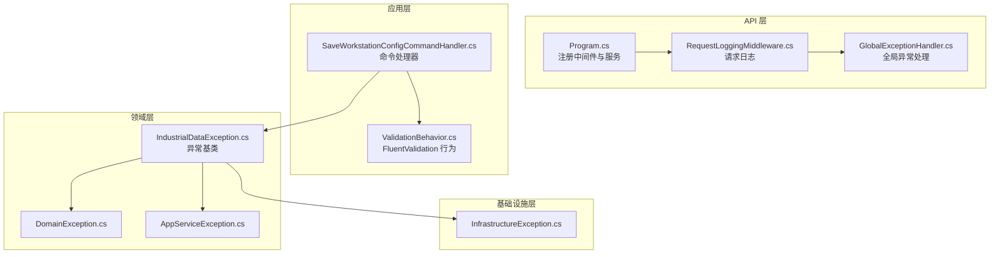
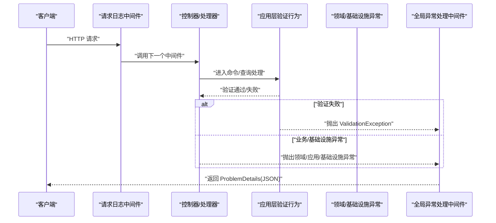
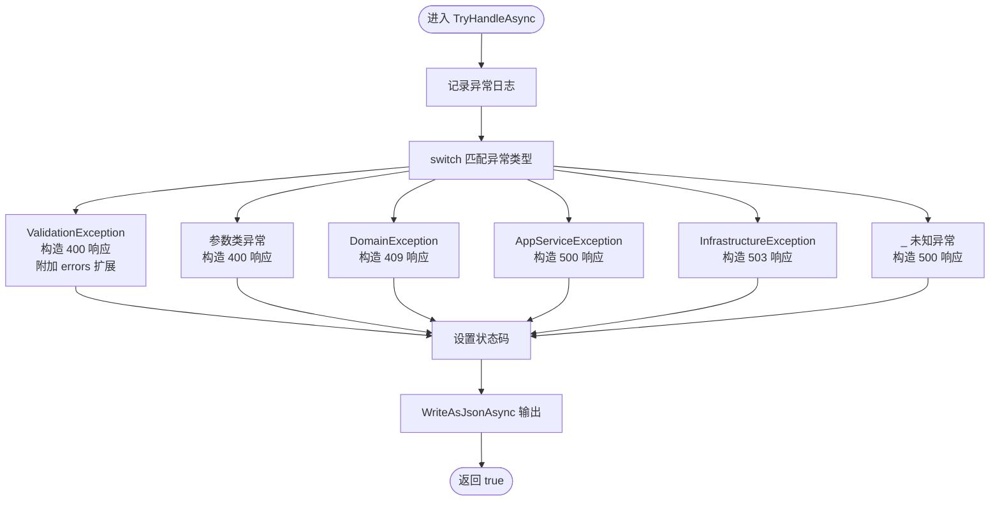
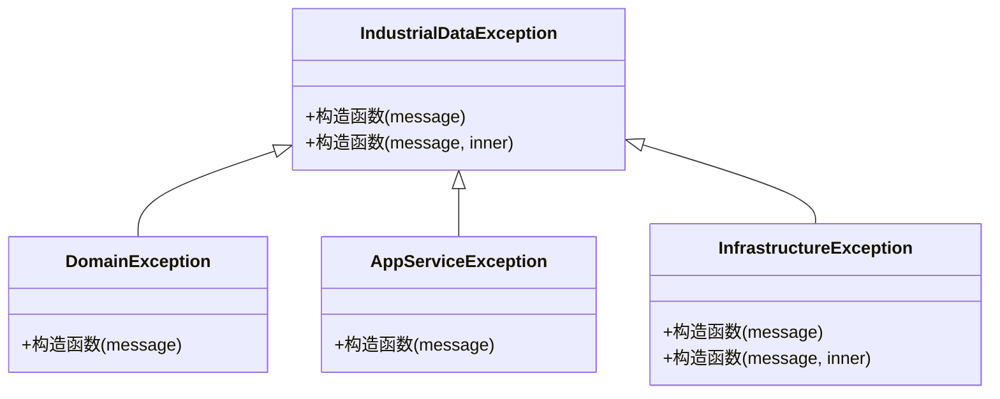
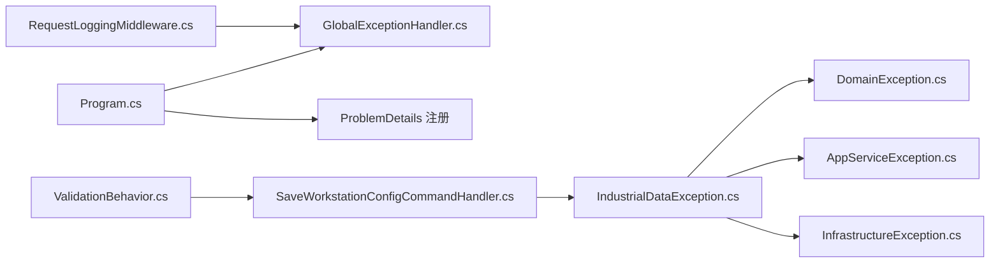

# 异常处理机制

<cite>
**本文引用的文件**
- [GlobalExceptionHandler.cs](file://IndustrialDataSolution/IndustrialDataProcessor.Api/Middleware/GlobalExceptionHandler.cs)
- [Program.cs](file://IndustrialDataSolution/IndustrialDataProcessor.Api/Program.cs)
- [RequestLoggingMiddleware.cs](file://IndustrialDataSolution/IndustrialDataProcessor.Api/Middleware/RequestLoggingMiddleware.cs)
- [ValidationBehavior.cs](file://IndustrialDataSolution/IndustrialDataProcessor.Application/Behaviors/ValidationBehavior.cs)
- [SaveWorkstationConfigCommandHandler.cs](file://IndustrialDataSolution/IndustrialDataProcessor.Application/CommandHandlers/SaveWorkstationConfigCommandHandler.cs)
- [IndustrialDataException.cs](file://IndustrialDataSolution/IndustrialDataProcessor.Domain/Exceptions/IndustrialDataException.cs)
- [DomainException.cs](file://IndustrialDataSolution/IndustrialDataProcessor.Domain/Exceptions/DomainException.cs)
- [AppServiceException.cs](file://IndustrialDataSolution/IndustrialDataProcessor.Domain/Exceptions/AppServiceException.cs)
- [InfrastructureException.cs](file://IndustrialDataSolution/IndustrialDataProcessor.Domain/Exceptions/InfrastructureException.cs)
</cite>

## 更新摘要
**所做更改**
- 移除了通信层异常类相关的内容，包括 CommunicationException、DeviceUnavailableException、ProtocolNotSupportedException、SerialPortBusyException 和 TransientCommunicationException
- 更新了异常层次结构图表，移除了通信层异常类的可视化表示
- 删除了与通信层异常相关的处理逻辑和映射说明
- 更新了依赖关系分析，移除了通信层异常的依赖关系

## 目录
1. [简介](#简介)
2. [项目结构](#项目结构)
3. [核心组件](#核心组件)
4. [架构总览](#架构总览)
5. [详细组件分析](#详细组件分析)
6. [依赖关系分析](#依赖关系分析)
7. [性能考量](#性能考量)
8. [故障排查指南](#故障排查指南)
9. [结论](#结论)
10. [附录](#附录)

## 简介
本文件系统性阐述 DDD 工业数据处理解决方案中的异常处理机制，重点围绕全局异常中间件 GlobalExceptionHandler 的工作原理与实现细节展开，覆盖异常捕获、转换与响应生成的完整流程；说明异常处理的优先级策略与处理顺序；解释标准化输出格式（错误码、标题、详情、实例、类型等）的设计；并结合 CQRS 模式讨论命令与查询场景下的异常处理差异。最后提供可配置项、扩展点以及调试技巧与示例。

## 项目结构
异常处理在 API 层以中间件形式接入，配合应用层的验证行为与领域/基础设施层的异常类型，形成从请求到响应的闭环处理链路。关键位置如下：
- API 层注册与管道：Program.cs 中注册全局异常处理与 ProblemDetails 支持，并按顺序启用请求日志与异常处理中间件。
- 异常处理：GlobalExceptionHandler 实现 IExceptionHandler，负责将各类异常转换为标准化 ProblemDetails 响应。
- 请求日志：RequestLoggingMiddleware 记录请求与异常，便于定位问题。
- 应用层验证：ValidationBehavior 在进入处理器前统一进行 FluentValidation 校验，失败时抛出 ValidationException。
- 领域/基础设施异常：各层定义统一的异常基类与派生异常，供上层捕获并映射为合适的 HTTP 状态码。

**图表来源**
- [Program.cs](file://IndustrialDataSolution/IndustrialDataProcessor.Api/Program.cs#L29-L37)
- [GlobalExceptionHandler.cs](file://IndustrialDataSolution/IndustrialDataProcessor.Api/Middleware/GlobalExceptionHandler.cs#L8-L47)
- [RequestLoggingMiddleware.cs](file://IndustrialDataSolution/IndustrialDataProcessor.Api/Middleware/RequestLoggingMiddleware.cs#L9-L84)
- [ValidationBehavior.cs](file://IndustrialDataSolution/IndustrialDataProcessor.Application/Behaviors/ValidationBehavior.cs#L9-L31)
- [SaveWorkstationConfigCommandHandler.cs](file://IndustrialDataSolution/IndustrialDataProcessor.Application/CommandHandlers/SaveWorkstationConfigCommandHandler.cs#L18-L30)
- [IndustrialDataException.cs](file://IndustrialDataSolution/IndustrialDataProcessor.Domain/Exceptions/IndustrialDataException.cs#L4-L8)
- [DomainException.cs](file://IndustrialDataSolution/IndustrialDataProcessor.Domain/Exceptions/DomainException.cs#L4-L7)
- [AppServiceException.cs](file://IndustrialDataSolution/IndustrialDataProcessor.Domain/Exceptions/AppServiceException.cs#L7-L11)
- [InfrastructureException.cs](file://IndustrialDataSolution/IndustrialDataProcessor.Domain/Exceptions/InfrastructureException.cs#L7-L12)

**章节来源**
- [Program.cs](file://IndustrialDataSolution/IndustrialDataProcessor.Api/Program.cs#L29-L37)
- [GlobalExceptionHandler.cs](file://IndustrialDataSolution/IndustrialDataProcessor.Api/Middleware/GlobalExceptionHandler.cs#L8-L47)
- [RequestLoggingMiddleware.cs](file://IndustrialDataSolution/IndustrialDataProcessor.Api/Middleware/RequestLoggingMiddleware.cs#L9-L84)
- [ValidationBehavior.cs](file://IndustrialDataSolution/IndustrialDataProcessor.Application/Behaviors/ValidationBehavior.cs#L9-L31)
- [SaveWorkstationConfigCommandHandler.cs](file://IndustrialDataSolution/IndustrialDataProcessor.Application/CommandHandlers/SaveWorkstationConfigCommandHandler.cs#L18-L30)
- [IndustrialDataException.cs](file://IndustrialDataSolution/IndustrialDataProcessor.Domain/Exceptions/IndustrialDataException.cs#L4-L8)
- [DomainException.cs](file://IndustrialDataSolution/IndustrialDataProcessor.Domain/Exceptions/DomainException.cs#L4-L7)
- [AppServiceException.cs](file://IndustrialDataSolution/IndustrialDataProcessor.Domain/Exceptions/AppServiceException.cs#L7-L11)
- [InfrastructureException.cs](file://IndustrialDataSolution/IndustrialDataProcessor.Domain/Exceptions/InfrastructureException.cs#L7-L12)

## 核心组件
- 全局异常处理中间件 GlobalExceptionHandler
  - 实现 IExceptionHandler，负责：
    - 记录异常日志（区分参数类异常与一般异常）。
    - 基于异常类型进行优先级匹配，构造 ProblemDetails 响应。
    - 设置响应状态码并以 JSON 写回。
  - 特殊处理 ValidationException，输出 RFC 7807 标准格式，包含 errors 字典映射。
- 请求日志中间件 RequestLoggingMiddleware
  - 记录请求元信息与耗时，异常时记录错误并重新抛出，交由全局异常处理。
- 应用层验证行为 ValidationBehavior
  - 在进入命令/查询处理器前统一执行 FluentValidation，失败时抛出 ValidationException。
- 异常层次结构
  - 工业数据异常基类 IndustrialDataException。
  - 领域层异常 DomainException、应用层异常 AppServiceException、基础设施层异常 InfrastructureException。

**章节来源**
- [GlobalExceptionHandler.cs](file://IndustrialDataSolution/IndustrialDataProcessor.Api/Middleware/GlobalExceptionHandler.cs#L8-L47)
- [RequestLoggingMiddleware.cs](file://IndustrialDataSolution/IndustrialDataProcessor.Api/Middleware/RequestLoggingMiddleware.cs#L9-L84)
- [ValidationBehavior.cs](file://IndustrialDataSolution/IndustrialDataProcessor.Application/Behaviors/ValidationBehavior.cs#L9-L31)
- [IndustrialDataException.cs](file://IndustrialDataSolution/IndustrialDataProcessor.Domain/Exceptions/IndustrialDataException.cs#L4-L8)
- [DomainException.cs](file://IndustrialDataSolution/IndustrialDataProcessor.Domain/Exceptions/DomainException.cs#L4-L7)
- [AppServiceException.cs](file://IndustrialDataSolution/IndustrialDataProcessor.Domain/Exceptions/AppServiceException.cs#L7-L11)
- [InfrastructureException.cs](file://IndustrialDataSolution/IndustrialDataProcessor.Domain/Exceptions/InfrastructureException.cs#L7-L12)

## 架构总览
下图展示从请求进入至异常处理与响应返回的端到端流程，包括中间件顺序、异常传播路径与响应生成。

**图表来源**
- [Program.cs](file://IndustrialDataSolution/IndustrialDataProcessor.Api/Program.cs#L36-L37)
- [RequestLoggingMiddleware.cs](file://IndustrialDataSolution/IndustrialDataProcessor.Api/Middleware/RequestLoggingMiddleware.cs#L16-L79)
- [ValidationBehavior.cs](file://IndustrialDataSolution/IndustrialDataProcessor.Application/Behaviors/ValidationBehavior.cs#L12-L29)
- [GlobalExceptionHandler.cs](file://IndustrialDataSolution/IndustrialDataProcessor.Api/Middleware/GlobalExceptionHandler.cs#L12-L47)

## 详细组件分析

### 全局异常处理中间件 GlobalExceptionHandler
- 工作原理
  - 捕获未处理异常，先记录日志（参数类异常使用警告级别，其他异常使用错误级别）。
  - 使用 switch 表达式按优先级匹配异常类型，构造 ProblemDetails：
    - ValidationException：返回 400，标题"数据验证失败"，Detail 说明，Instance 为当前请求路径，Type 为对应 HTTP 状态码页面链接；若存在 ValidationFailure 集合，则在 Extensions 中附加 errors 字典（属性名 -> 错误消息数组）。
    - 参数类异常（ArgumentNullException、ArgumentException）：返回 400，标题"参数缺失/参数错误"。
    - 领域层异常 DomainException：返回 409，标题"业务规则冲突"。
    - 应用层异常 AppServiceException：返回 500，标题"应用服务执行失败"。
    - 基础设施异常 InfrastructureException：返回 503，标题"基础设施不可用"。
    - 其他未知异常：返回 500，标题"服务器内部错误"。
  - 设置响应状态码并以 JSON 写回。
- 处理顺序与优先级
  - 明确的类型匹配优先于通用兜底，确保：
    - 验证失败优先返回 400 并携带详细错误字典；
    - 参数缺失/错误优先返回 400；
    - 业务规则冲突返回 409；
    - 应用服务失败返回 500；
    - 基础设施故障返回 503；
    - 其余未知异常兜底 500。
- 标准化输出格式
  - 字段：Status（HTTP 状态码）、Title（标题）、Detail（详细说明）、Instance（当前请求路径）、Type（HTTP 状态码页面链接）。
  - 验证错误扩展：在 Extensions 中添加 errors 字典，键为属性名，值为该属性对应的多条错误消息数组；兼容无具体错误集合的情况，使用 General 键包裹消息。

**图表来源**
- [GlobalExceptionHandler.cs](file://IndustrialDataSolution/IndustrialDataProcessor.Api/Middleware/GlobalExceptionHandler.cs#L12-L47)
- [GlobalExceptionHandler.cs](file://IndustrialDataSolution/IndustrialDataProcessor.Api/Middleware/GlobalExceptionHandler.cs#L49-L92)

**章节来源**
- [GlobalExceptionHandler.cs](file://IndustrialDataSolution/IndustrialDataProcessor.Api/Middleware/GlobalExceptionHandler.cs#L12-L47)
- [GlobalExceptionHandler.cs](file://IndustrialDataSolution/IndustrialDataProcessor.Api/Middleware/GlobalExceptionHandler.cs#L49-L92)

### 请求日志中间件 RequestLoggingMiddleware
- 功能要点
  - 记录请求开始、耗时与 TraceId，必要时记录请求体（受日志级别与条件控制）。
  - 捕获下游异常，记录错误日志并重新抛出，交由全局异常处理中间件统一处理。
- 与异常处理的关系
  - 作为第一个中间件，确保异常发生时仍能记录上下文信息。
  - 将异常冒泡至上层，避免重复处理。

**章节来源**
- [RequestLoggingMiddleware.cs](file://IndustrialDataSolution/IndustrialDataProcessor.Api/Middleware/RequestLoggingMiddleware.cs#L9-L84)

### 应用层验证行为 ValidationBehavior
- 功能要点
  - 在进入命令/查询处理器前，对请求对象执行所有关联的 FluentValidation 验证器。
  - 若存在验证失败项，汇总为 ValidationFailure 列表并抛出 ValidationException。
- 与异常处理的衔接
  - 保证在进入处理器前完成参数与业务规则层面的校验，失败即返回 400 并携带详细错误字典。

**章节来源**
- [ValidationBehavior.cs](file://IndustrialDataSolution/IndustrialDataProcessor.Application/Behaviors/ValidationBehavior.cs#L9-L31)

### 命令处理器 SaveWorkstationConfigCommandHandler
- 功能要点
  - 将 DTO 转换为领域模型，序列化后持久化到数据库。
  - 成功后发布领域事件以触发后续流程（如清理缓存）。
- 异常处理关注点
  - 若持久化或领域操作抛出异常（如领域/应用/基础设施异常），将由全局异常处理中间件接管并返回标准化响应。

**章节来源**
- [SaveWorkstationConfigCommandHandler.cs](file://IndustrialDataSolution/IndustrialDataProcessor.Application/CommandHandlers/SaveWorkstationConfigCommandHandler.cs#L18-L30)

### 异常层次结构与映射
- 工业数据异常基类 IndustrialDataException 提供统一的异常基类。
- 领域层异常 DomainException：业务规则破坏、聚合状态无效等。
- 应用层异常 AppServiceException：用例执行失败、并发冲突、实体不存在等。
- 基础设施异常 InfrastructureException：数据库/外部服务不可用等。

**图表来源**
- [IndustrialDataException.cs](file://IndustrialDataSolution/IndustrialDataProcessor.Domain/Exceptions/IndustrialDataException.cs#L4-L8)
- [DomainException.cs](file://IndustrialDataSolution/IndustrialDataProcessor.Domain/Exceptions/DomainException.cs#L4-L7)
- [AppServiceException.cs](file://IndustrialDataSolution/IndustrialDataProcessor.Domain/Exceptions/AppServiceException.cs#L7-L11)
- [InfrastructureException.cs](file://IndustrialDataSolution/IndustrialDataProcessor.Domain/Exceptions/InfrastructureException.cs#L7-L12)

## 依赖关系分析
- 中间件依赖
  - Program.cs 注册 GlobalExceptionHandler 与 ProblemDetails，启用 UseExceptionHandler()。
  - RequestLoggingMiddleware 在异常处理之前运行，确保异常可被记录。
- 应用层依赖
  - ValidationBehavior 依赖 FluentValidation 验证器集合，在进入处理器前统一校验。
- 领域/基础设施依赖
  - 各层异常类型继承自 IndustrialDataException，便于统一识别与映射。

**图表来源**
- [Program.cs](file://IndustrialDataSolution/IndustrialDataProcessor.Api/Program.cs#L29-L37)
- [GlobalExceptionHandler.cs](file://IndustrialDataSolution/IndustrialDataProcessor.Api/Middleware/GlobalExceptionHandler.cs#L8-L47)
- [RequestLoggingMiddleware.cs](file://IndustrialDataSolution/IndustrialDataProcessor.Api/Middleware/RequestLoggingMiddleware.cs#L9-L84)
- [ValidationBehavior.cs](file://IndustrialDataSolution/IndustrialDataProcessor.Application/Behaviors/ValidationBehavior.cs#L9-L31)
- [SaveWorkstationConfigCommandHandler.cs](file://IndustrialDataSolution/IndustrialDataProcessor.Application/CommandHandlers/SaveWorkstationConfigCommandHandler.cs#L18-L30)
- [IndustrialDataException.cs](file://IndustrialDataSolution/IndustrialDataProcessor.Domain/Exceptions/IndustrialDataException.cs#L4-L8)
- [DomainException.cs](file://IndustrialDataSolution/IndustrialDataProcessor.Domain/Exceptions/DomainException.cs#L4-L7)
- [AppServiceException.cs](file://IndustrialDataSolution/IndustrialDataProcessor.Domain/Exceptions/AppServiceException.cs#L7-L11)
- [InfrastructureException.cs](file://IndustrialDataSolution/IndustrialDataProcessor.Domain/Exceptions/InfrastructureException.cs#L7-L12)

**章节来源**
- [Program.cs](file://IndustrialDataSolution/IndustrialDataProcessor.Api/Program.cs#L29-L37)
- [GlobalExceptionHandler.cs](file://IndustrialDataSolution/IndustrialDataProcessor.Api/Middleware/GlobalExceptionHandler.cs#L8-L47)
- [RequestLoggingMiddleware.cs](file://IndustrialDataSolution/IndustrialDataProcessor.Api/Middleware/RequestLoggingMiddleware.cs#L9-L84)
- [ValidationBehavior.cs](file://IndustrialDataSolution/IndustrialDataProcessor.Application/Behaviors/ValidationBehavior.cs#L9-L31)
- [SaveWorkstationConfigCommandHandler.cs](file://IndustrialDataSolution/IndustrialDataProcessor.Application/CommandHandlers/SaveWorkstationConfigCommandHandler.cs#L18-L30)
- [IndustrialDataException.cs](file://IndustrialDataSolution/IndustrialDataProcessor.Domain/Exceptions/IndustrialDataException.cs#L4-L8)
- [DomainException.cs](file://IndustrialDataSolution/IndustrialDataProcessor.Domain/Exceptions/DomainException.cs#L4-L7)
- [AppServiceException.cs](file://IndustrialDataSolution/IndustrialDataProcessor.Domain/Exceptions/AppServiceException.cs#L7-L11)
- [InfrastructureException.cs](file://IndustrialDataSolution/IndustrialDataProcessor.Domain/Exceptions/InfrastructureException.cs#L7-L12)

## 性能考量
- 日志记录
  - 请求日志中间件在 Debug 级别下可能记录请求体，需谨慎开启以避免性能开销。
- 异常处理
  - 全局异常处理仅在异常发生时执行，正常路径不产生额外成本。
  - ProblemDetails 序列化为 JSON 是轻量操作，建议保持默认配置。
- 验证行为
  - ValidationBehavior 对所有验证器并行执行，验证失败时快速抛出，避免无效处理链继续执行。

## 故障排查指南
- 如何确认异常被正确捕获
  - 观察请求日志中间件是否记录了异常堆栈与 TraceId。
  - 检查全局异常处理中间件是否返回了期望的 HTTP 状态码与标题。
- 验证错误未返回详细字典
  - 确认 ValidationBehavior 是否确实抛出了包含 ValidationFailure 的 ValidationException。
  - 确认前端是否正确读取了响应中的 errors 扩展字段。
- 业务规则冲突与应用服务失败
  - 检查领域/应用层是否抛出了 DomainException 或 AppServiceException。
  - 确保异常消息清晰，便于前端与运维定位。
- 基础设施故障
  - 确认是否抛出了 InfrastructureException，且状态码为 503。
- 自定义扩展
  - 新增异常类型时，建议继承 IndustrialDataException 并在全局异常处理中为其指定合适的 HTTP 状态码与标题。
  - 修改现有映射时，遵循"明确类型优先"的原则，避免覆盖更具体的匹配分支。

**章节来源**
- [RequestLoggingMiddleware.cs](file://IndustrialDataSolution/IndustrialDataProcessor.Api/Middleware/RequestLoggingMiddleware.cs#L69-L79)
- [GlobalExceptionHandler.cs](file://IndustrialDataSolution/IndustrialDataProcessor.Api/Middleware/GlobalExceptionHandler.cs#L22-L42)
- [ValidationBehavior.cs](file://IndustrialDataSolution/IndustrialDataProcessor.Application/Behaviors/ValidationBehavior.cs#L23-L24)

## 结论
该异常处理机制通过"请求日志中间件 + 全局异常处理中间件 + 应用层验证行为 + 分层异常类型"的组合，实现了从请求到响应的全链路异常治理。其优先级策略与标准化输出格式确保了前后端一致的错误体验，同时为扩展与定制提供了清晰的接口与路径。

## 附录

### 异常处理优先级与映射表
- ValidationException → 400（带 errors 扩展）
- ArgumentNullException / ArgumentException → 400
- DomainException → 409
- AppServiceException → 500
- InfrastructureException → 503
- 其他异常 → 500

**章节来源**
- [GlobalExceptionHandler.cs](file://IndustrialDataSolution/IndustrialDataProcessor.Api/Middleware/GlobalExceptionHandler.cs#L22-L42)

### CQRS 场景下的异常处理差异
- 命令处理
  - 进入命令处理器前由 ValidationBehavior 完成参数与业务规则校验，失败即返回 400。
  - 领域/应用/基础设施异常在处理器内抛出，由全局异常处理统一映射为 409/500/503。
- 查询处理
  - 查询通常不涉及状态变更，异常主要来自参数校验（400）或数据访问（500/503）。
  - 若查询过程中出现业务规则限制，可抛出 DomainException 映射为 409。

**章节来源**
- [ValidationBehavior.cs](file://IndustrialDataSolution/IndustrialDataProcessor.Application/Behaviors/ValidationBehavior.cs#L9-L31)
- [SaveWorkstationConfigCommandHandler.cs](file://IndustrialDataSolution/IndustrialDataProcessor.Application/CommandHandlers/SaveWorkstationConfigCommandHandler.cs#L18-L30)
- [GlobalExceptionHandler.cs](file://IndustrialDataSolution/IndustrialDataProcessor.Api/Middleware/GlobalExceptionHandler.cs#L22-L42)

### 配置选项与扩展方法
- 注册与启用
  - 在 Program.cs 中注册 GlobalExceptionHandler 与 ProblemDetails，并启用 UseExceptionHandler()。
- 自定义异常处理器
  - 新增派生自 IExceptionHandler 的处理器，按需替换或补充现有逻辑。
- 修改映射策略
  - 在 GlobalExceptionHandler 的 switch 分支中增加新的异常类型分支，或调整已有分支的顺序与状态码。
- 输出格式定制
  - 可在 CreateProblem 与 CreateValidationProblem 中调整标题、详情、Type 与 Extension 结构。

**章节来源**
- [Program.cs](file://IndustrialDataSolution/IndustrialDataProcessor.Api/Program.cs#L29-L37)
- [GlobalExceptionHandler.cs](file://IndustrialDataSolution/IndustrialDataProcessor.Api/Middleware/GlobalExceptionHandler.cs#L49-L92)