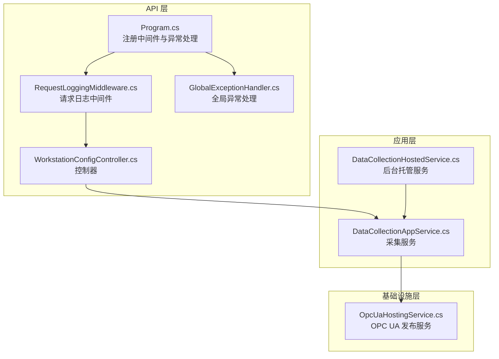
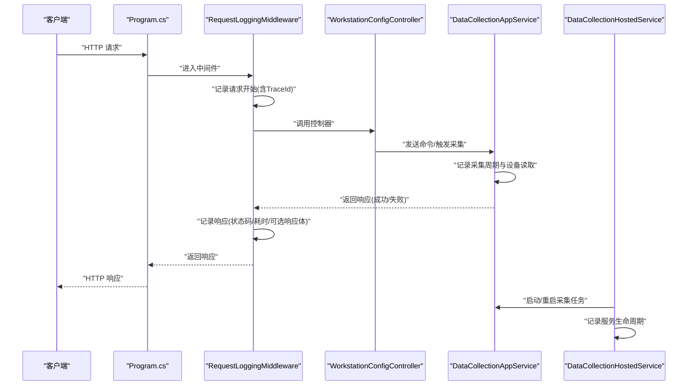
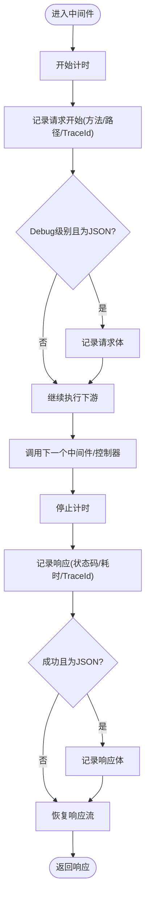
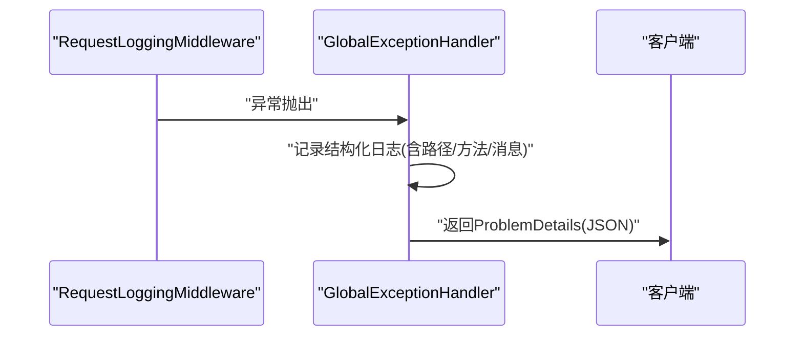
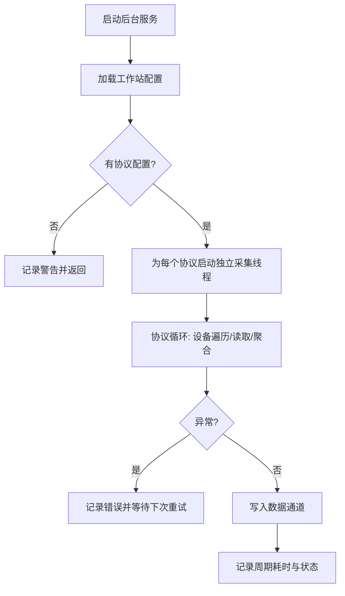
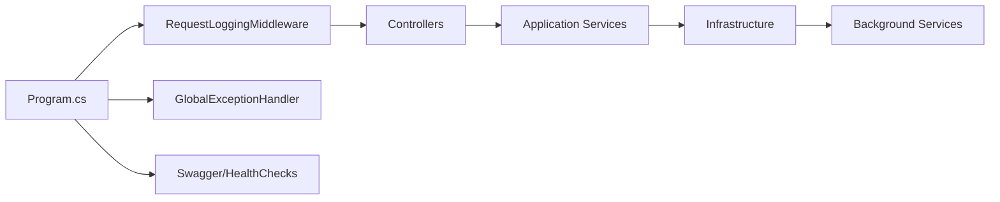

# 日志监控策略

<cite>
**本文引用的文件**
- [Program.cs](file://IndustrialDataSolution/IndustrialDataProcessor.Api/Program.cs)
- [RequestLoggingMiddleware.cs](file://IndustrialDataSolution/IndustrialDataProcessor.Api/Middleware/RequestLoggingMiddleware.cs)
- [GlobalExceptionHandler.cs](file://IndustrialDataSolution/IndustrialDataProcessor.Api/Middleware/GlobalExceptionHandler.cs)
- [appsettings.json](file://IndustrialDataSolution/IndustrialDataProcessor.Api/appsettings.json)
- [appsettings.Development.json](file://IndustrialDataSolution/IndustrialDataProcessor.Api/appsettings.Development.json)
- [DataCollectionHostedService.cs](file://IndustrialDataSolution/IndustrialDataProcessor.Api/BackgroundServices/DataCollectionHostedService.cs)
- [DataCollectionAppService.cs](file://IndustrialDataSolution/IndustrialDataProcessor.Application/Services/DataCollectionAppService.cs)
- [WorkstationConfigController.cs](file://IndustrialDataSolution/IndustrialDataProcessor.Api/Controllers/WorkstationConfigController.cs)
</cite>

## 目录
1. [引言](#引言)
2. [项目结构](#项目结构)
3. [核心组件](#核心组件)
4. [架构总览](#架构总览)
5. [详细组件分析](#详细组件分析)
6. [依赖关系分析](#依赖关系分析)
7. [性能考量](#性能考量)
8. [故障排查指南](#故障排查指南)
9. [结论](#结论)
10. [附录](#附录)

## 引言
本文件面向DDD工业数据处理解决方案，系统性阐述日志监控策略，覆盖结构化日志设计、字段定义、日志级别划分、请求日志中间件功能与配置、日志分类与存储策略、与监控系统的集成方式、日志查询与分析方法，以及日志安全与隐私保护措施。目标是在保障性能的前提下，实现可观测性与可维护性的平衡。

## 项目结构
本项目采用多层架构（API、应用、领域、基础设施），日志策略贯穿请求链路与后台任务，关键入口位于API层的中间件与控制器，应用层承载业务流程与采集任务，基础设施层负责底层通信与OPC UA发布。

图表来源
- [Program.cs](file://IndustrialDataSolution/IndustrialDataProcessor.Api/Program.cs#L36-L51)
- [RequestLoggingMiddleware.cs](file://IndustrialDataSolution/IndustrialDataProcessor.Api/Middleware/RequestLoggingMiddleware.cs#L16-L84)
- [GlobalExceptionHandler.cs](file://IndustrialDataSolution/IndustrialDataProcessor.Api/Middleware/GlobalExceptionHandler.cs#L12-L47)
- [WorkstationConfigController.cs](file://IndustrialDataSolution/IndustrialDataProcessor.Api/Controllers/WorkstationConfigController.cs#L14-L21)
- [DataCollectionAppService.cs](file://IndustrialDataSolution/IndustrialDataProcessor.Application/Services/DataCollectionAppService.cs#L22-L41)
- [DataCollectionHostedService.cs](file://IndustrialDataSolution/IndustrialDataProcessor.Api/BackgroundServices/DataCollectionHostedService.cs#L15-L26)

章节来源
- [Program.cs](file://IndustrialDataSolution/IndustrialDataProcessor.Api/Program.cs#L10-L51)
- [appsettings.json](file://IndustrialDataSolution/IndustrialDataProcessor.Api/appsettings.json#L1-L17)
- [appsettings.Development.json](file://IndustrialDataSolution/IndustrialDataProcessor.Api/appsettings.Development.json#L1-L9)

## 核心组件
- 请求日志中间件：在请求进入与离开时记录关键元数据（方法、路径、状态码、耗时、TraceId），并在Debug级别可选记录请求/响应体。
- 全局异常处理：统一捕获未处理异常，按异常类型映射HTTP状态码与ProblemDetails响应，并记录结构化日志。
- 应用层采集服务：在协议采集周期中记录配置加载、设备读取、异常与通道写入等关键事件。
- 后台托管服务：启动采集任务并记录服务生命周期事件。
- 配置与环境：默认日志级别为Information，开发环境保持一致，便于本地调试。

章节来源
- [RequestLoggingMiddleware.cs](file://IndustrialDataSolution/IndustrialDataProcessor.Api/Middleware/RequestLoggingMiddleware.cs#L16-L84)
- [GlobalExceptionHandler.cs](file://IndustrialDataSolution/IndustrialDataProcessor.Api/Middleware/GlobalExceptionHandler.cs#L12-L47)
- [DataCollectionAppService.cs](file://IndustrialDataSolution/IndustrialDataProcessor.Application/Services/DataCollectionAppService.cs#L22-L41)
- [DataCollectionHostedService.cs](file://IndustrialDataSolution/IndustrialDataProcessor.Api/BackgroundServices/DataCollectionHostedService.cs#L15-L26)
- [appsettings.json](file://IndustrialDataSolution/IndustrialDataProcessor.Api/appsettings.json#L2-L7)
- [appsettings.Development.json](file://IndustrialDataSolution/IndustrialDataProcessor.Api/appsettings.Development.json#L2-L8)

## 架构总览
下图展示从客户端到控制器、中间件、异常处理、应用服务与后台任务的整体调用链及日志落点。

图表来源
- [Program.cs](file://IndustrialDataSolution/IndustrialDataProcessor.Api/Program.cs#L36-L51)
- [RequestLoggingMiddleware.cs](file://IndustrialDataSolution/IndustrialDataProcessor.Api/Middleware/RequestLoggingMiddleware.cs#L16-L84)
- [WorkstationConfigController.cs](file://IndustrialDataSolution/IndustrialDataProcessor.Api/Controllers/WorkstationConfigController.cs#L14-L21)
- [DataCollectionAppService.cs](file://IndustrialDataSolution/IndustrialDataProcessor.Application/Services/DataCollectionAppService.cs#L22-L41)
- [DataCollectionHostedService.cs](file://IndustrialDataSolution/IndustrialDataProcessor.Api/BackgroundServices/DataCollectionHostedService.cs#L15-L26)

## 详细组件分析

### 结构化日志设计与实现
- 字段标准化
  - 请求/响应：方法、路径、状态码、耗时、TraceId
  - 请求体：仅在Debug级别且满足条件时记录
  - 响应体：仅在成功且JSON时记录
  - 异常：异常类型、路径、方法、消息
- 日志级别划分
  - Information：服务启动/停止、采集任务启动、成功响应
  - Warning：缺少配置、参数缺失、业务规则冲突
  - Error：未处理异常、协议驱动缺失、采集异常、通道写入失败
- TraceId：利用ASP.NET Core内置TraceIdentifier，贯穿请求全链路

章节来源
- [RequestLoggingMiddleware.cs](file://IndustrialDataSolution/IndustrialDataProcessor.Api/Middleware/RequestLoggingMiddleware.cs#L23-L55)
- [RequestLoggingMiddleware.cs](file://IndustrialDataSolution/IndustrialDataProcessor.Api/Middleware/RequestLoggingMiddleware.cs#L69-L78)
- [GlobalExceptionHandler.cs](file://IndustrialDataSolution/IndustrialDataProcessor.Api/Middleware/GlobalExceptionHandler.cs#L15-L19)
- [DataCollectionAppService.cs](file://IndustrialDataSolution/IndustrialDataProcessor.Application/Services/DataCollectionAppService.cs#L29-L33)
- [DataCollectionAppService.cs](file://IndustrialDataSolution/IndustrialDataProcessor.Application/Services/DataCollectionAppService.cs#L54-L56)
- [DataCollectionAppService.cs](file://IndustrialDataSolution/IndustrialDataProcessor.Application/Services/DataCollectionAppService.cs#L170-L171)
- [DataCollectionAppService.cs](file://IndustrialDataSolution/IndustrialDataProcessor.Application/Services/DataCollectionAppService.cs#L196-L197)
- [DataCollectionHostedService.cs](file://IndustrialDataSolution/IndustrialDataProcessor.Api/BackgroundServices/DataCollectionHostedService.cs#L17-L25)

### 请求日志中间件
- 功能要点
  - 计时与耗时统计
  - TraceId贯穿
  - 可选记录请求/响应体（受内容类型与状态码限制）
  - 异常捕获并记录
- 性能与安全
  - Debug级别才记录体，避免高开销
  - 仅记录JSON体，减少无关负载
  - 通过中间件顺序保证最早拦截

图表来源
- [RequestLoggingMiddleware.cs](file://IndustrialDataSolution/IndustrialDataProcessor.Api/Middleware/RequestLoggingMiddleware.cs#L16-L84)

章节来源
- [RequestLoggingMiddleware.cs](file://IndustrialDataSolution/IndustrialDataProcessor.Api/Middleware/RequestLoggingMiddleware.cs#L16-L84)

### 全局异常处理中间件
- 行为
  - 将异常映射为ProblemDetails，统一返回
  - 结构化记录：参数错误Warning，其他Error
  - 保留路径、方法、消息等上下文
- 与中间件顺序
  - 在请求日志之后注册，确保异常也能被记录

图表来源
- [GlobalExceptionHandler.cs](file://IndustrialDataSolution/IndustrialDataProcessor.Api/Middleware/GlobalExceptionHandler.cs#L12-L47)
- [RequestLoggingMiddleware.cs](file://IndustrialDataSolution/IndustrialDataProcessor.Api/Middleware/RequestLoggingMiddleware.cs#L69-L78)

章节来源
- [GlobalExceptionHandler.cs](file://IndustrialDataSolution/IndustrialDataProcessor.Api/Middleware/GlobalExceptionHandler.cs#L12-L47)

### 应用层采集服务与后台托管服务
- 采集服务
  - 加载配置、启动协议采集线程、逐设备读取、聚合结果、写入通道
  - 关键事件均记录日志，异常被捕获并降级处理
- 后台托管服务
  - 启动/停止采集任务，记录服务生命周期

图表来源
- [DataCollectionAppService.cs](file://IndustrialDataSolution/IndustrialDataProcessor.Application/Services/DataCollectionAppService.cs#L22-L41)
- [DataCollectionAppService.cs](file://IndustrialDataSolution/IndustrialDataProcessor.Application/Services/DataCollectionAppService.cs#L46-L200)
- [DataCollectionHostedService.cs](file://IndustrialDataSolution/IndustrialDataProcessor.Api/BackgroundServices/DataCollectionHostedService.cs#L15-L26)

章节来源
- [DataCollectionAppService.cs](file://IndustrialDataSolution/IndustrialDataProcessor.Application/Services/DataCollectionAppService.cs#L22-L41)
- [DataCollectionAppService.cs](file://IndustrialDataSolution/IndustrialDataProcessor.Application/Services/DataCollectionAppService.cs#L46-L200)
- [DataCollectionHostedService.cs](file://IndustrialDataSolution/IndustrialDataProcessor.Api/BackgroundServices/DataCollectionHostedService.cs#L15-L26)

### 控制器与命令处理
- 控制器接收请求，封装为命令并通过MediatR传递至应用层
- 日志由中间件与应用层共同覆盖，确保端到端可观测

章节来源
- [WorkstationConfigController.cs](file://IndustrialDataSolution/IndustrialDataProcessor.Api/Controllers/WorkstationConfigController.cs#L14-L21)

## 依赖关系分析
- 中间件注册顺序：请求日志中间件 → 全局异常处理 → Swagger/UI → 授权 → 控制器
- 日志级别：默认Information，开发环境一致
- 依赖注入：应用层与基础设施层在Program中注册，后台服务随应用启动

图表来源
- [Program.cs](file://IndustrialDataSolution/IndustrialDataProcessor.Api/Program.cs#L36-L51)

章节来源
- [Program.cs](file://IndustrialDataSolution/IndustrialDataProcessor.Api/Program.cs#L36-L51)
- [appsettings.json](file://IndustrialDataSolution/IndustrialDataProcessor.Api/appsettings.json#L2-L7)
- [appsettings.Development.json](file://IndustrialDataSolution/IndustrialDataProcessor.Api/appsettings.Development.json#L2-L8)

## 性能考量
- 请求体记录仅在Debug级别且满足条件时开启，避免生产环境高开销
- 成功响应体仅在JSON且状态码<400时记录
- 采集服务中的异常被捕获并降级，避免单点故障扩散
- 后台服务使用无限等待直至取消，降低唤醒成本

章节来源
- [RequestLoggingMiddleware.cs](file://IndustrialDataSolution/IndustrialDataProcessor.Api/Middleware/RequestLoggingMiddleware.cs#L114-L131)
- [DataCollectionAppService.cs](file://IndustrialDataSolution/IndustrialDataProcessor.Application/Services/DataCollectionAppService.cs#L159-L171)
- [DataCollectionHostedService.cs](file://IndustrialDataSolution/IndustrialDataProcessor.Api/BackgroundServices/DataCollectionHostedService.cs#L23-L25)

## 故障排查指南
- 请求失败定位
  - 查看请求日志中间件记录的状态码、耗时、TraceId
  - 若Debug级别开启，核对请求/响应体
- 异常排查
  - 全局异常处理会输出路径、方法、消息
  - 根据ProblemDetails状态码与标题快速定位问题类型
- 采集异常
  - 关注采集服务日志中的协议驱动缺失、连接异常、通道写入失败
  - 检查协议配置与设备参数有效性

章节来源
- [RequestLoggingMiddleware.cs](file://IndustrialDataSolution/IndustrialDataProcessor.Api/Middleware/RequestLoggingMiddleware.cs#L49-L55)
- [RequestLoggingMiddleware.cs](file://IndustrialDataSolution/IndustrialDataProcessor.Api/Middleware/RequestLoggingMiddleware.cs#L72-L77)
- [GlobalExceptionHandler.cs](file://IndustrialDataSolution/IndustrialDataProcessor.Api/Middleware/GlobalExceptionHandler.cs#L15-L19)
- [DataCollectionAppService.cs](file://IndustrialDataSolution/IndustrialDataProcessor.Application/Services/DataCollectionAppService.cs#L54-L56)
- [DataCollectionAppService.cs](file://IndustrialDataSolution/IndustrialDataProcessor.Application/Services/DataCollectionAppService.cs#L170-L171)
- [DataCollectionAppService.cs](file://IndustrialDataSolution/IndustrialDataProcessor.Application/Services/DataCollectionAppService.cs#L196-L197)

## 结论
本方案通过中间件与异常处理实现请求全链路可观测，结合应用层与后台服务的关键事件日志，形成完整的工业数据采集系统日志体系。配合合理的日志级别与条件记录，既满足生产可用性，又兼顾性能与安全。

## 附录

### 日志字段定义与示例
- 请求开始
  - 字段：方法、路径、TraceId
  - 示例：开始处理请求: GET /api/workstation-config - TraceId: 0HMS123456789
- 请求完成
  - 字段：方法、路径、状态码、耗时(ms)、TraceId
  - 示例：完成请求: POST /api/workstation-config - 状态码: 200 - 耗时: 123ms - TraceId: 0HMS123456789
- 异常
  - 字段：异常类型、路径、方法、消息、耗时(ms)、TraceId
  - 示例：请求处理异常: POST /api/workstation-config - 耗时: 123ms - TraceId: 0HMS123456789
- 采集服务
  - 字段：协议ID、设备数量、耗时(ms)、成功/失败状态
  - 示例：协议 [PROTOCOL-001] 的独立采集线程已启动
  - 示例：协议 [PROTOCOL-001] 采集周期发生底层或连接异常，将在延时后重试...

章节来源
- [RequestLoggingMiddleware.cs](file://IndustrialDataSolution/IndustrialDataProcessor.Api/Middleware/RequestLoggingMiddleware.cs#L23-L55)
- [RequestLoggingMiddleware.cs](file://IndustrialDataSolution/IndustrialDataProcessor.Api/Middleware/RequestLoggingMiddleware.cs#L69-L78)
- [DataCollectionAppService.cs](file://IndustrialDataSolution/IndustrialDataProcessor.Application/Services/DataCollectionAppService.cs#L48-L48)
- [DataCollectionAppService.cs](file://IndustrialDataSolution/IndustrialDataProcessor.Application/Services/DataCollectionAppService.cs#L170-L171)

### 日志级别划分
- Information：服务启动/停止、采集任务启动、成功响应
- Warning：缺少配置、参数缺失、业务规则冲突
- Error：未处理异常、协议驱动缺失、采集异常、通道写入失败

章节来源
- [GlobalExceptionHandler.cs](file://IndustrialDataSolution/IndustrialDataProcessor.Api/Middleware/GlobalExceptionHandler.cs#L15-L19)
- [DataCollectionAppService.cs](file://IndustrialDataSolution/IndustrialDataProcessor.Application/Services/DataCollectionAppService.cs#L29-L33)
- [DataCollectionAppService.cs](file://IndustrialDataSolution/IndustrialDataProcessor.Application/Services/DataCollectionAppService.cs#L54-L56)
- [DataCollectionAppService.cs](file://IndustrialDataSolution/IndustrialDataProcessor.Application/Services/DataCollectionAppService.cs#L170-L171)
- [DataCollectionAppService.cs](file://IndustrialDataSolution/IndustrialDataProcessor.Application/Services/DataCollectionAppService.cs#L196-L197)

### 日志分类与存储策略
- 分类
  - 请求日志：中间件记录
  - 异常日志：全局异常处理记录
  - 业务日志：应用层采集服务与后台服务记录
- 存储
  - 建议按日切分文件，保留7-14天滚动日志
  - 错误与异常单独标记，便于检索
- 轮转与归档
  - 建议使用系统工具或日志代理进行压缩归档

[本节为通用实践建议，无需特定文件引用]

### 日志与监控系统集成
- ELK Stack
  - 使用Filebeat/Agent收集日志，Elasticsearch索引，Kibana可视化
  - 建议基于TraceId进行跨服务关联查询
- Prometheus/Grafana
  - 将关键指标（如采集周期耗时、成功率）导出为指标
  - Grafana仪表盘展示趋势与告警
- 配置要点
  - 保持日志格式结构化，便于解析
  - 为不同环境设置差异化日志级别

[本节为通用实践建议，无需特定文件引用]

### 日志查询与分析
- 聚合
  - 按TraceId聚合一次请求的全链路日志
  - 按协议ID聚合采集周期日志
- 统计
  - 统计状态码分布、平均耗时、错误率
- 趋势
  - 基于时间序列分析采集成功率与异常趋势
- 建议
  - 对高频错误建立告警阈值

[本节为通用实践建议，无需特定文件引用]

### 日志安全与隐私保护
- 脱敏
  - 不在日志中记录敏感头与请求/响应体（Debug级别除外）
  - 对TraceId等标识符进行最小化暴露
- 访问控制
  - 限制日志文件读取权限
  - 通过代理与网关控制日志访问
- 合规
  - 遵循企业数据保护政策，定期清理过期日志

[本节为通用实践建议，无需特定文件引用]