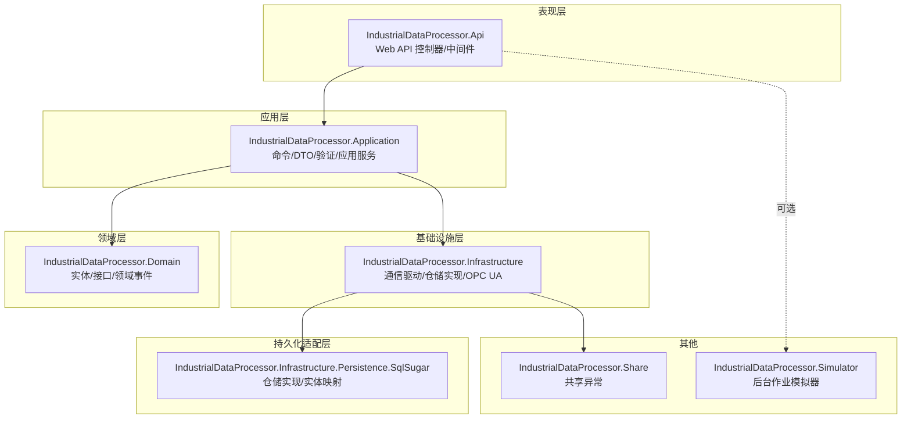
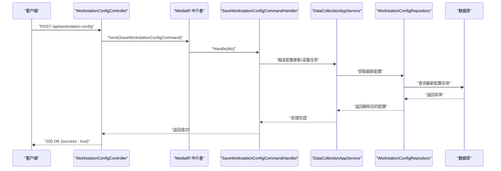
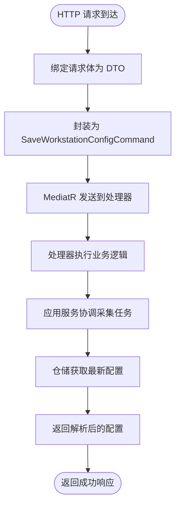
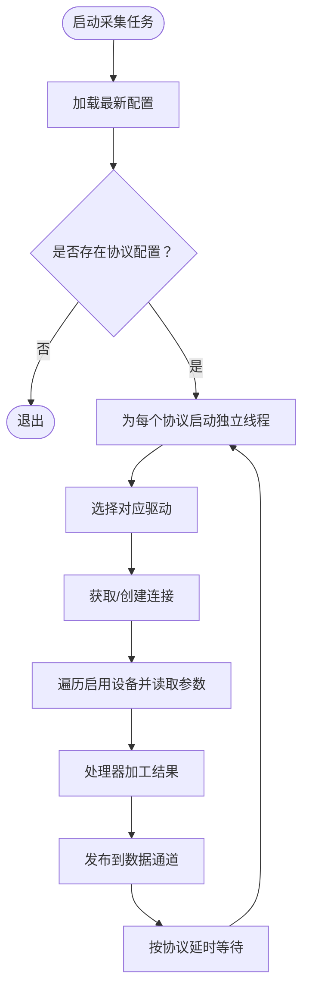
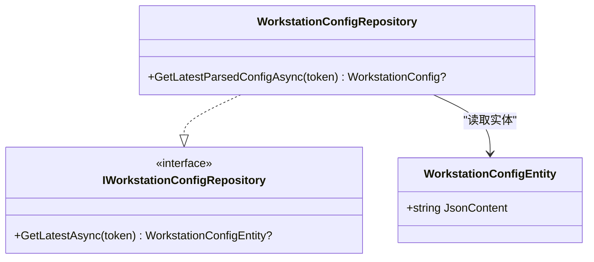
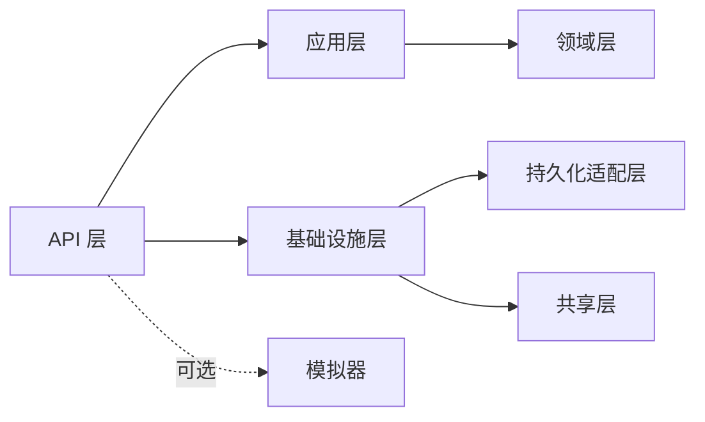

# 快速开始

<cite>
**本文引用的文件**
- [IndustrialDataProcessor.Api\Program.cs](file://IndustrialDataSolution/IndustrialDataProcessor.Api/Program.cs)
- [IndustrialDataProcessor.Api\appsettings.json](file://IndustrialDataSolution/IndustrialDataProcessor.Api/appsettings.json)
- [IndustrialDataProcessor.Api\appsettings.Development.json](file://IndustrialDataSolution/IndustrialDataProcessor.Api/appsettings.Development.json)
- [IndustrialDataProcessor.Api\Properties\launchSettings.json](file://IndustrialDataSolution/IndustrialDataProcessor.Api/Properties/launchSettings.json)
- [IndustrialDataProcessor.Api\Controllers\WorkstationConfigController.cs](file://IndustrialDataSolution/IndustrialDataProcessor.Api/Controllers/WorkstationConfigController.cs)
- [IndustrialDataProcessor.Application\Commands\SaveWorkstationConfigCommand.cs](file://IndustrialDataSolution/IndustrialDataProcessor.Application/Commands/SaveWorkstationConfigCommand.cs)
- [IndustrialDataProcessor.Application\Dtos\SaveWorkstationConfigRequest.cs](file://IndustrialDataSolution/IndustrialDataProcessor.Application/Dtos/SaveWorkstationConfigRequest.cs)
- [IndustrialDataProcessor.Application\DependencyInjection.cs](file://IndustrialDataSolution/IndustrialDataProcessor.Application/DependencyInjection.cs)
- [IndustrialDataProcessor.Application\Services\DataCollectionAppService.cs](file://IndustrialDataSolution/IndustrialDataProcessor.Application\Services/DataCollectionAppService.cs)
- [IndustrialDataProcessor.Infrastructure\Repositories\WorkstationConfigRepository.cs](file://IndustrialDataSolution/IndustrialDataProcessor.Infrastructure\Repositories/WorkstationConfigRepository.cs)
- [IndustrialDataProcessor.Domain\Entities\WorkstationConfigEntity.cs](file://IndustrialDataSolution/IndustrialDataProcessor.Domain/Entities/WorkstationConfigEntity.cs)
- [IndustrialDataProcessor.Simulator\Program.cs](file://IndustrialDataSolution/IndustrialDataProcessor.Simulator/Program.cs)
- [IndustrialDataProcessor.Simulator\appsettings.json](file://IndustrialDataSolution/IndustrialDataProcessor.Simulator/appsettings.json)
- [IndustrialDataSolution.slnx](file://IndustrialDataSolution/IndustrialDataSolution.slnx)
</cite>

## 目录
1. [简介](#简介)
2. [项目结构](#项目结构)
3. [核心组件](#核心组件)
4. [架构概览](#架构概览)
5. [详细组件分析](#详细组件分析)
6. [依赖关系分析](#依赖关系分析)
7. [性能考虑](#性能考虑)
8. [故障排除指南](#故障排除指南)
9. [结论](#结论)
10. [附录](#附录)

## 简介
本指南面向首次接触 DDD 工业数据处理解决方案的开发者，目标是在约 30 分钟内完成环境准备、项目构建、数据库初始化与本地运行，并通过基本 API 测试验证系统功能。文档覆盖以下要点：
- 环境准备：.NET SDK 版本、PostgreSQL 安装与配置、开发工具设置
- 项目克隆与依赖安装
- 数据库初始化步骤
- 本地开发环境启动：配置文件、环境变量、调试运行
- 基本 API 测试：工作站配置的创建与获取
- 常见问题排查与解决方案

## 项目结构
该项目采用多项目解决方案，按 DDD 分层组织，主要模块如下：
- 表现层：IndustrialDataProcessor.Api（ASP.NET Core Web API）
- 应用层：IndustrialDataProcessor.Application（命令、DTO、验证器、应用服务）
- 领域层：IndustrialDataProcessor.Domain（实体、枚举、领域事件、接口）
- 基础设施层：IndustrialDataProcessor.Infrastructure（通信驱动、仓储实现、OPC UA、持久化适配）
- 持久化适配层：IndustrialDataProcessor.Infrastructure.Persistence.SqlSugar（基于 SqlSugar 的仓储实现）
- 共享层：IndustrialDataProcessor.Share（共享异常类型）
- 模拟器：IndustrialDataProcessor.Simulator（后台作业模拟器）

图表来源
- [IndustrialDataProcessor.Api\Program.cs](file://IndustrialDataSolution/IndustrialDataProcessor.Api/Program.cs#L1-L54)
- [IndustrialDataProcessor.Application\DependencyInjection.cs](file://IndustrialDataSolution/IndustrialDataProcessor.Application/DependencyInjection.cs#L1-L40)
- [IndustrialDataProcessor.Infrastructure\Repositories\WorkstationConfigRepository.cs](file://IndustrialDataSolution/IndustrialDataProcessor.Infrastructure/Repositories/WorkstationConfigRepository.cs#L1-L43)

章节来源
- [IndustrialDataSolution.slnx](file://IndustrialDataSolution/IndustrialDataSolution.slnx)

## 核心组件
- Web API 层：负责路由、控制器、中间件、健康检查与 Swagger 文档展示
- 应用服务层：封装业务流程，协调仓储与协议驱动，管理采集任务
- 领域层：定义工作站配置、协议、设备与参数等核心领域模型
- 基础设施层：提供通信驱动、连接管理、OPC UA 服务与数据存储适配
- 持久化适配层：将领域模型映射到数据库实体，完成 JSON 序列化/反序列化
- 模拟器：作为后台作业运行，可选用于演示数据采集流程

章节来源
- [IndustrialDataProcessor.Api\Program.cs](file://IndustrialDataSolution/IndustrialDataProcessor.Api/Program.cs#L1-L54)
- [IndustrialDataProcessor.Application\DependencyInjection.cs](file://IndustrialDataSolution/IndustrialDataProcessor.Application/DependencyInjection.cs#L1-L40)
- [IndustrialDataProcessor.Application\Services\DataCollectionAppService.cs](file://IndustrialDataSolution/IndustrialDataProcessor.Application/Services/DataCollectionAppService.cs#L1-L216)
- [IndustrialDataProcessor.Infrastructure\Repositories\WorkstationConfigRepository.cs](file://IndustrialDataSolution/IndustrialDataProcessor.Infrastructure/Repositories/WorkstationConfigRepository.cs#L1-L43)
- [IndustrialDataProcessor.Domain\Entities\WorkstationConfigEntity.cs](file://IndustrialDataSolution/IndustrialDataProcessor.Domain/Entities/WorkstationConfigEntity.cs#L1-L7)
- [IndustrialDataProcessor.Simulator\Program.cs](file://IndustrialDataSolution/IndustrialDataProcessor.Simulator/Program.cs#L1-L13)

## 架构概览
系统采用分层架构与 CQRS/MediatR 组合，API 控制器接收请求，转换为命令并通过中介者发送至命令处理器；应用服务协调仓储与协议驱动执行数据采集；基础设施层提供通信与存储能力；持久化适配层负责 JSON 与数据库实体之间的映射。

图表来源
- [IndustrialDataProcessor.Api\Controllers\WorkstationConfigController.cs](file://IndustrialDataSolution/IndustrialDataProcessor.Api/Controllers/WorkstationConfigController.cs#L1-L22)
- [IndustrialDataProcessor.Application\Commands\SaveWorkstationConfigCommand.cs](file://IndustrialDataSolution/IndustrialDataProcessor.Application/Commands/SaveWorkstationConfigCommand.cs#L1-L9)
- [IndustrialDataProcessor.Application\Services\DataCollectionAppService.cs](file://IndustrialDataSolution/IndustrialDataProcessor.Application/Services/DataCollectionAppService.cs#L1-L216)
- [IndustrialDataProcessor.Infrastructure\Repositories\WorkstationConfigRepository.cs](file://IndustrialDataSolution/IndustrialDataProcessor.Infrastructure/Repositories/WorkstationConfigRepository.cs#L1-L43)

## 详细组件分析

### API 控制器与请求处理链路
- 控制器接收 HTTP 请求，将请求体封装为 DTO 并转换为命令，交由中介者处理
- 命令处理器触发应用服务，应用服务启动或更新采集任务
- 应用服务从仓储获取最新配置，仓储负责 JSON 反序列化与实体映射

图表来源
- [IndustrialDataProcessor.Api\Controllers\WorkstationConfigController.cs](file://IndustrialDataSolution/IndustrialDataProcessor.Api/Controllers/WorkstationConfigController.cs#L1-L22)
- [IndustrialDataProcessor.Application\Commands\SaveWorkstationConfigCommand.cs](file://IndustrialDataSolution/IndustrialDataProcessor.Application/Commands/SaveWorkstationConfigCommand.cs#L1-L9)
- [IndustrialDataProcessor.Application\Services\DataCollectionAppService.cs](file://IndustrialDataSolution/IndustrialDataProcessor.Application/Services/DataCollectionAppService.cs#L1-L216)
- [IndustrialDataProcessor.Infrastructure\Repositories\WorkstationConfigRepository.cs](file://IndustrialDataSolution/IndustrialDataProcessor.Infrastructure/Repositories/WorkstationConfigRepository.cs#L1-L43)

章节来源
- [IndustrialDataProcessor.Api\Controllers\WorkstationConfigController.cs](file://IndustrialDataSolution/IndustrialDataProcessor.Api/Controllers/WorkstationConfigController.cs#L1-L22)
- [IndustrialDataProcessor.Application\Commands\SaveWorkstationConfigCommand.cs](file://IndustrialDataSolution/IndustrialDataProcessor.Application/Commands/SaveWorkstationConfigCommand.cs#L1-L9)
- [IndustrialDataProcessor.Application\Services\DataCollectionAppService.cs](file://IndustrialDataSolution/IndustrialDataProcessor.Application/Services/DataCollectionAppService.cs#L1-L216)
- [IndustrialDataProcessor.Infrastructure\Repositories\WorkstationConfigRepository.cs](file://IndustrialDataSolution/IndustrialDataProcessor.Infrastructure/Repositories/WorkstationConfigRepository.cs#L1-L43)

### 应用服务与采集任务
- 应用服务启动所有协议的独立采集任务，每个协议在独立线程中循环执行
- 通过连接管理器获取或创建连接，驱动器执行读取操作，结果经处理器加工后发布到数据通道
- 协议级异常被捕获并记录，不影响其他协议的执行

图表来源
- [IndustrialDataProcessor.Application\Services\DataCollectionAppService.cs](file://IndustrialDataSolution/IndustrialDataProcessor.Application/Services/DataCollectionAppService.cs#L1-L216)

章节来源
- [IndustrialDataProcessor.Application\Services\DataCollectionAppService.cs](file://IndustrialDataSolution/IndustrialDataProcessor.Application/Services/DataCollectionAppService.cs#L1-L216)

### 仓储与实体映射
- 仓储从数据库获取最新配置实体，使用指定的 JSON 选项进行反序列化
- 反序列化过程中注册多态转换器以正确映射协议配置
- 若 JSON 格式错误，抛出异常提示配置解析失败

图表来源
- [IndustrialDataProcessor.Infrastructure\Repositories\WorkstationConfigRepository.cs](file://IndustrialDataSolution/IndustrialDataProcessor.Infrastructure/Repositories/WorkstationConfigRepository.cs#L1-L43)
- [IndustrialDataProcessor.Domain\Entities\WorkstationConfigEntity.cs](file://IndustrialDataSolution/IndustrialDataProcessor.Domain/Entities/WorkstationConfigEntity.cs#L1-L7)

章节来源
- [IndustrialDataProcessor.Infrastructure\Repositories\WorkstationConfigRepository.cs](file://IndustrialDataSolution/IndustrialDataProcessor.Infrastructure/Repositories/WorkstationConfigRepository.cs#L1-L43)
- [IndustrialDataProcessor.Domain\Entities\WorkstationConfigEntity.cs](file://IndustrialDataSolution/IndustrialDataProcessor.Domain/Entities/WorkstationConfigEntity.cs#L1-L7)

## 依赖关系分析
- API 层依赖应用层与基础设施层，注册健康检查、控制器、Swagger 与异常处理中间件
- 应用层通过依赖注入注册验证器、应用服务、任务管理器与中介者
- 基础设施层提供通信驱动、连接管理与仓储实现
- 持久化适配层将领域模型映射到数据库实体，完成 JSON 序列化/反序列化

图表来源
- [IndustrialDataProcessor.Api\Program.cs](file://IndustrialDataSolution/IndustrialDataProcessor.Api/Program.cs#L1-L54)
- [IndustrialDataProcessor.Application\DependencyInjection.cs](file://IndustrialDataSolution/IndustrialDataProcessor.Application/DependencyInjection.cs#L1-L40)

章节来源
- [IndustrialDataProcessor.Api\Program.cs](file://IndustrialDataSolution/IndustrialDataProcessor.Api/Program.cs#L1-L54)
- [IndustrialDataProcessor.Application\DependencyInjection.cs](file://IndustrialDataSolution/IndustrialDataProcessor.Application/DependencyInjection.cs#L1-L40)

## 性能考虑
- 协议级采集任务独立运行，互不影响，提高并发与稳定性
- 采集周期延时可配置，避免 CPU 飙高
- 连接复用与异常隔离，降低网络波动对整体的影响
- JSON 反序列化在基础设施层完成，减少应用层负担

## 故障排除指南
- 数据库连接失败
  - 检查连接字符串中的主机、端口、数据库名、用户名与密码
  - 确认 PostgreSQL 已启动并允许本地连接
  - 参考配置文件路径：[IndustrialDataProcessor.Api\appsettings.json](file://IndustrialDataSolution/IndustrialDataProcessor.Api/appsettings.json#L10-L12)
- Swagger 文档不可访问
  - 确认 API 已注册 Swagger 与 SwaggerUI
  - 参考注册位置：[IndustrialDataProcessor.Api\Program.cs](file://IndustrialDataSolution/IndustrialDataProcessor.Api/Program.cs#L27-L30)
- 健康检查端点未响应
  - 确认已注册健康检查并映射到 /health
  - 参考注册位置：[IndustrialDataProcessor.Api\Program.cs](file://IndustrialDataSolution/IndustrialDataProcessor.Api/Program.cs#L27-L27)
- 配置 JSON 解析失败
  - 确认上传的 JSON 结构符合工作站配置规范
  - 查看仓储层的异常提示，定位 JSON 格式问题
  - 参考位置：[IndustrialDataProcessor.Infrastructure\Repositories\WorkstationConfigRepository.cs](file://IndustrialDataSolution/IndustrialDataProcessor.Infrastructure/Repositories/WorkstationConfigRepository.cs#L37-L41)
- 开发环境未生效
  - 确认启动配置文件中的环境变量已设置为 Development
  - 参考位置：[IndustrialDataProcessor.Api\Properties\launchSettings.json](file://IndustrialDataSolution/IndustrialDataProcessor.Api/Properties/launchSettings.json#L18-L19)

章节来源
- [IndustrialDataProcessor.Api\appsettings.json](file://IndustrialDataSolution/IndustrialDataProcessor.Api/appsettings.json#L10-L12)
- [IndustrialDataProcessor.Api\Program.cs](file://IndustrialDataSolution/IndustrialDataProcessor.Api/Program.cs#L27-L30)
- [IndustrialDataProcessor.Api\Properties\launchSettings.json](file://IndustrialDataSolution/IndustrialDataProcessor.Api/Properties/launchSettings.json#L18-L19)
- [IndustrialDataProcessor.Infrastructure\Repositories\WorkstationConfigRepository.cs](file://IndustrialDataSolution/IndustrialDataProcessor.Infrastructure/Repositories/WorkstationConfigRepository.cs#L37-L41)

## 结论
通过本指南，您可以在本地快速搭建并运行 DDD 工业数据处理解决方案。建议在完成基础运行后，进一步学习各层职责与扩展点，逐步引入更多协议驱动与数据存储适配。

## 附录

### 环境准备与安装
- .NET SDK
  - 确保安装与项目兼容的 .NET 版本（建议查看项目文件中的 TargetFramework）
  - 参考项目文件位置：[IndustrialDataProcessor.Api\IndustrialDataProcessor.Api.csproj](file://IndustrialDataSolution/IndustrialDataProcessor.Api/IndustrialDataProcessor.Api.csproj)
- PostgreSQL
  - 安装并启动 PostgreSQL，创建数据库与用户
  - 修改连接字符串中的主机、端口、数据库名、用户名与密码
  - 参考配置位置：[IndustrialDataProcessor.Api\appsettings.json](file://IndustrialDataSolution/IndustrialDataProcessor.Api/appsettings.json#L10-L12)
- 开发工具
  - 推荐使用 Visual Studio 或 VS Code
  - 安装 .NET 扩展与 C# 扩展（如使用 VS Code）

### 项目克隆与依赖安装
- 克隆仓库后，打开解决方案文件
  - 解决方案文件位置：[IndustrialDataSolution.slnx](file://IndustrialDataSolution/IndustrialDataSolution.slnx)
- 还原 NuGet 包（IDE 自动或命令行 dotnet restore）
- 如需初始化数据库，请参考仓储与实体映射逻辑，确认表结构与字段一致
  - 参考实体定义：[IndustrialDataProcessor.Domain\Entities\WorkstationConfigEntity.cs](file://IndustrialDataSolution/IndustrialDataProcessor.Domain/Entities/WorkstationConfigEntity.cs#L1-L7)
  - 参考仓储实现：[IndustrialDataProcessor.Infrastructure\Repositories\WorkstationConfigRepository.cs](file://IndustrialDataSolution/IndustrialDataProcessor.Infrastructure/Repositories/WorkstationConfigRepository.cs#L1-L43)

### 本地开发环境启动
- 启动配置
  - 设置环境变量 ASPNETCORE_ENVIRONMENT 为 Development
  - 参考位置：[IndustrialDataProcessor.Api\Properties\launchSettings.json](file://IndustrialDataSolution/IndustrialDataProcessor.Api/Properties/launchSettings.json#L18-L19)
- 运行 API 项目
  - 使用 IDE 启动或命令行 dotnet run
  - 访问 Swagger：http://localhost:端口/swagger
  - 访问健康检查：http://localhost:端口/health
  - 参考注册位置：[IndustrialDataProcessor.Api\Program.cs](file://IndustrialDataSolution/IndustrialDataProcessor.Api/Program.cs#L27-L49)
- 可选启动模拟器
  - 运行模拟器项目以演示后台作业
  - 参考入口：[IndustrialDataProcessor.Simulator\Program.cs](file://IndustrialDataSolution/IndustrialDataProcessor.Simulator/Program.cs#L1-L13)

### 基本 API 测试
- 创建工作站配置
  - 端点：POST /api/workstation-config
  - 请求体：包含工作站配置的 JSON（字段名称参考 DTO 定义）
  - 参考控制器：[IndustrialDataProcessor.Api\Controllers\WorkstationConfigController.cs](file://IndustrialDataSolution/IndustrialDataProcessor.Api/Controllers/WorkstationConfigController.cs#L1-L22)
  - 参考命令与 DTO：[IndustrialDataProcessor.Application\Commands\SaveWorkstationConfigCommand.cs](file://IndustrialDataSolution/IndustrialDataProcessor.Application/Commands/SaveWorkstationConfigCommand.cs#L1-L9)，[IndustrialDataProcessor.Application\Dtos\SaveWorkstationConfigRequest.cs](file://IndustrialDataSolution/IndustrialDataProcessor.Application/Dtos/SaveWorkstationConfigRequest.cs#L1-L12)
- 获取工作站配置
  - 建议通过应用服务或仓储查询最新配置
  - 参考应用服务：[IndustrialDataProcessor.Application\Services\DataCollectionAppService.cs](file://IndustrialDataSolution/IndustrialDataProcessor.Application/Services/DataCollectionAppService.cs#L1-L216)
  - 参考仓储：[IndustrialDataProcessor.Infrastructure\Repositories\WorkstationConfigRepository.cs](file://IndustrialDataSolution/IndustrialDataProcessor.Infrastructure/Repositories/WorkstationConfigRepository.cs#L1-L43)

### 常见问题排查清单
- 端口冲突：修改 launchSettings.json 中的 applicationUrl
  - 参考位置：[IndustrialDataProcessor.Api\Properties\launchSettings.json](file://IndustrialDataSolution/IndustrialDataProcessor.Api/Properties/launchSettings.json#L17-L17)
- CORS 问题：如浏览器跨域访问失败，检查控制器上的 CORS 策略
- 日志级别：调整 appsettings.json 中的日志等级以辅助诊断
  - 参考位置：[IndustrialDataProcessor.Api\appsettings.json](file://IndustrialDataSolution/IndustrialDataProcessor.Api/appsettings.json#L2-L7)，[IndustrialDataProcessor.Api\appsettings.Development.json](file://IndustrialDataSolution/IndustrialDataProcessor.Api/appsettings.Development.json#L2-L7)