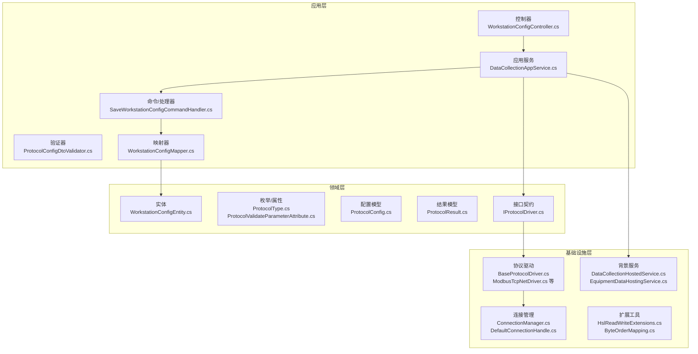
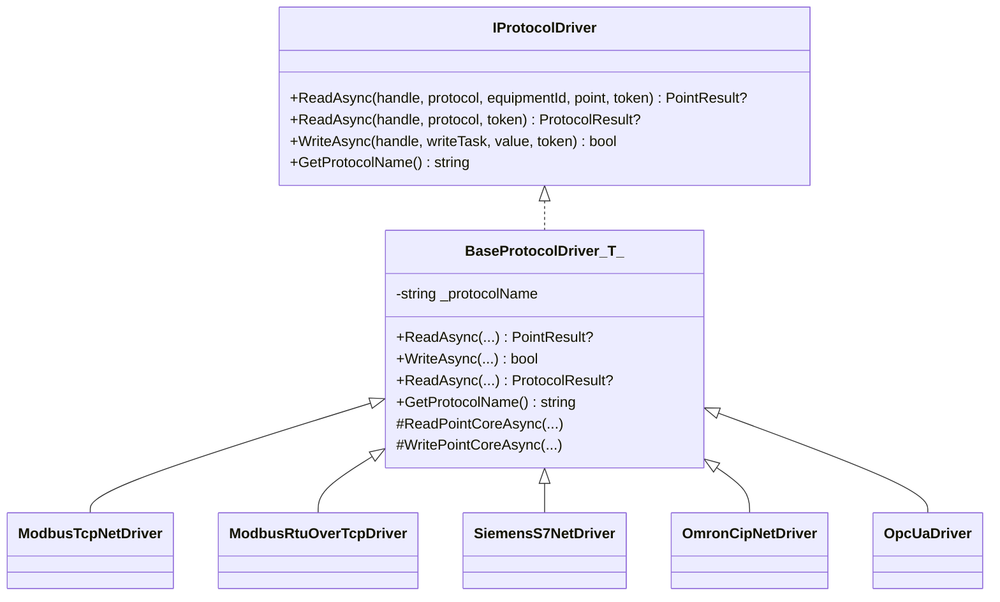
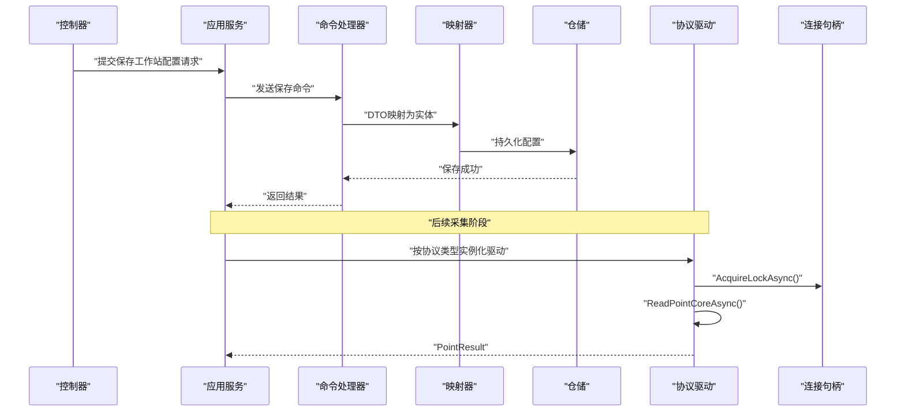
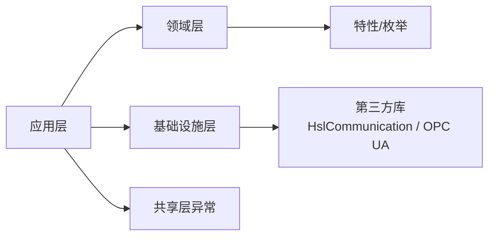

# 协议扩展

<cite>
**本文引用的文件**
- [IProtocolDriver.cs](file://IndustrialDataSolution/IndustrialDataProcessor.Domain/Communication/IConnection/IProtocolDriver.cs)
- [BaseProtocolDriver.cs](file://IndustrialDataSolution/IndustrialDataProcessor.Infrastructure/Communication/Drivers/TcpCommon/BaseProtocolDriver.cs)
- [ProtocolType.cs](file://IndustrialDataSolution/IndustrialDataProcessor.Domain/Enums/ProtocolType.cs)
- [ProtocolTypeHelper.cs](file://IndustrialDataSolution/IndustrialDataProcessor.Domain/Helpers/ProtocolTypeHelper.cs)
- [ProtocolInterfaceTypeAttribute.cs](file://IndustrialDataSolution/IndustrialDataProcessor.Domain/Attributes/ProtocolInterfaceTypeAttribute.cs)
- [ProtocolValidateParameterAttribute.cs](file://IndustrialDataSolution/IndustrialDataProcessor.Domain/Attributes/ProtocolValidateParameterAttribute.cs)
- [ProtocolConfig.cs](file://IndustrialDataSolution/IndustrialDataProcessor.Domain/Workstation/Configs/ProtocolConfig.cs)
- [ProtocolResult.cs](file://IndustrialDataSolution/IndustrialDataProcessor.Domain/Workstation/Results/ProtocolResult.cs)
- [ModbusTcpNetDriver.cs](file://IndustrialDataSolution/IndustrialDataProcessor.Infrastructure/Communication/Drivers/TcpCommon/ModbusTcpNetDriver.cs)
- [ModbusRtuOverTcpDriver.cs](file://IndustrialDataSolution/IndustrialDataProcessor.Infrastructure/Communication/Drivers/TcpCommon/ModbusRtuOverTcpDriver.cs)
- [SiemensS7NetDriver.cs](file://IndustrialDataSolution/IndustrialDataProcessor.Infrastructure/Communication/Drivers/TcpCommon/SiemensS7NetDriver.cs)
- [OmronCipNetDriver.cs](file://IndustrialDataSolution/IndustrialDataProcessor.Infrastructure/Communication/Drivers/TcpCommon/OmronCipNetDriver.cs)
- [IEC104Driver.cs](file://IndustrialDataSolution/IndustrialDataProcessor.Infrastructure/Communication/Drivers/TcpSpecial/IEC104Driver.cs)
- [OpcUaDriver.cs](file://IndustrialDataSolution/IndustrialDataProcessor.Infrastructure/Communication/Drivers/TcpSpecial/OpcUaDriver.cs)
- [DependencyInjection.cs](file://IndustrialDataSolution/IndustrialDataProcessor.Application/DependencyInjection.cs)
- [WorkstationConfigController.cs](file://IndustrialDataSolution/IndustrialDataProcessor.Api/Controllers/WorkstationConfigController.cs)
- [SaveWorkstationConfigCommandHandler.cs](file://IndustrialDataSolution/IndustrialDataProcessor.Application/CommandHandlers/SaveWorkstationConfigCommandHandler.cs)
- [SaveWorkstationConfigCommand.cs](file://IndustrialDataSolution/IndustrialDataProcessor.Application/Commands/SaveWorkstationConfigCommand.cs)
- [WorkstationConfigDto.cs](file://IndustrialDataSolution/IndustrialDataProcessor.Application/Dtos/WorkstationDto/WorkstationConfigDto.cs)
- [ProtocolConfigDto.cs](file://IndustrialDataSolution/IndustrialDataSolution/IndustrialDataProcessor.Application/Dtos/WorkstationDto/ProtocolConfigDto.cs)
- [ProtocolConfigDtoValidator.cs](file://IndustrialDataSolution/IndustrialDataProcessor.Application/Validators/ProtocolConfigDtoValidator.cs)
- [WorkstationConfigMapper.cs](file://IndustrialDataSolution/IndustrialDataProcessor.Application/Mappers/WorkstationConfigMapper.cs)
- [WorkstationConfigRepository.cs](file://IndustrialDataSolution/IndustrialDataProcessor.Infrastructure/Repositories/WorkstationConfigRepository.cs)
- [WorkstationConfigEntityRepository.cs](file://IndustrialDataSolution/IndustrialDataProcessor.Infrastructure.Persistence.SqlSugar/Repositories/WorkstationConfigEntityRepository.cs)
- [WorkstationConfigEntity.cs](file://IndustrialDataSolution/IndustrialDataProcessor.Domain/Entities/WorkstationConfigEntity.cs)
- [WorkstationConfigPo.cs](file://IndustrialDataSolution/IndustrialDataProcessor.Infrastructure.Persistence.SqlSugar/DbEntities/WorkstationConfigPo.cs)
- [Program.cs](file://IndustrialDataSolution/IndustrialDataProcessor.Api/Program.cs)
- [appsettings.json](file://IndustrialDataSolution/IndustrialDataProcessor.Api/appsettings.json)
- [appsettings.Development.json](file://IndustrialDataSolution/IndustrialDataProcessor.Api/appsettings.Development.json)
- [GlobalExceptionHandler.cs](file://IndustrialDataSolution/IndustrialDataProcessor.Api/Middleware/GlobalExceptionHandler.cs)
- [RequestLoggingMiddleware.cs](file://IndustrialDataSolution/IndustrialDataProcessor.Api/Middleware/RequestLoggingMiddleware.cs)
- [DataCollectionHostedService.cs](file://IndustrialDataSolution/IndustrialDataProcessor.Api/BackgroundServices/DataCollectionHostedService.cs)
- [EquipmentDataHostingService.cs](file://IndustrialDataSolution/IndustrialDataProcessor.Infrastructure/BackgroundServices/EquipmentDataHostingService.cs)
- [OpcUaHostingService.cs](file://IndustrialDataSolution/IndustrialDataProcessor.Infrastructure/BackgroundServices/OpcUaHostingService.cs)
- [ConnectionManager.cs](file://IndustrialDataSolution/IndustrialDataProcessor.Infrastructure/Communication/Connection/ConnectionManager.cs)
- [DefaultConnectionHandle.cs](file://IndustrialDataSolution/IndustrialDataProcessor.Infrastructure/Communication/Connection/DefaultConnectionHandle.cs)
- [HslReadWriteExtensions.cs](file://IndustrialDataSolution/IndustrialDataProcessor.Infrastructure/Communication/Extensions/HslReadWriteExtensions.cs)
- [ByteOrderMapping.cs](file://IndustrialDataSolution/IndustrialDataProcessor.Infrastructure/Extensions/ByteOrderMapping.cs)
- [SerialPortMapping.cs](file://IndustrialDataSolution/IndustrialDataProcessor.Infrastructure/Extensions/SerialPortMapping.cs)
- [EquipmentDataProcessor.cs](file://IndustrialDataSolution/IndustrialDataProcessor.Infrastructure/EquipmentCollectionDataProcessing/EquipmentDataProcessor.cs)
- [NumberBaseConverter.cs](file://IndustrialDataSolution/IndustrialDataProcessor.Infrastructure/EquipmentCollectionDataProcessing/NumberBaseConverter.cs)
- [NumericTypeChecker.cs](file://IndustrialDataSolution/IndustrialDataProcessor.Infrastructure/EquipmentCollectionDataProcessing/NumericTypeChecker.cs)
- [PointExpressionConverter.cs](file://IndustrialDataSolution/IndustrialDataProcessor.Infrastructure/EquipmentCollectionDataProcessing/PointExpressionConverter.cs)
- [SingleVariableExpressionEvaluator.cs](file://IndustrialDataSolution/IndustrialDataProcessor.Infrastructure/EquipmentCollectionDataProcessing/SingleVariableExpressionEvaluator.cs)
- [VariablePlaceholderParser.cs](file://IndustrialDataSolution/IndustrialDataProcessor.Infrastructure/EquipmentCollectionDataProcessing/VariablePlaceholderParser.cs)
- [VirtualPointCalculator.cs](file://IndustrialDataSolution/IndustrialDataProcessor.Infrastructure/EquipmentCollectionDataProcessing/VirtualPointCalculator.cs)
- [ModbusTcpDriverIntegrationTests.cs](file://IndustrialDataSolution/IndustrialDataProcessor.Infrastructure.Tests/Integration/ModbusTcpDriverIntegrationTests.cs)
- [WorkstationConfigApiTests.cs](file://IndustrialDataSolution/IndustrialDataProcessor.Api.Tests/Integration/WorkstationConfigApiTests.cs)
- [WorkstationConfigServiceTests.cs](file://IndustrialDataSolution/IndustrialDataProcessor.Application.Test/Services/WorkstationConfigServiceTests.cs)
- [CommunicationException.cs](file://IndustrialDataSolution/IndustrialDataProcessor.Share/Exceptions/Communication/CommunicationException.cs)
- [DeviceUnavailableException.cs](file://IndustrialDataSolution/IndustrialDataProcessor.Share/Exceptions/Communication/DeviceUnavailableException.cs)
- [ProtocolNotSupportedException.cs](file://IndustrialDataSolution/IndustrialDataProcessor.Share/Exceptions/Communication/ProtocolNotSupportedException.cs)
- [SerialPortBusyException.cs](file://IndustrialDataSolution/IndustrialDataProcessor.Share/Exceptions/Communication/SerialPortBusyException.cs)
- [TransientCommunicationException.cs](file://IndustrialDataSolution/IndustrialDataProcessor.Share/Exceptions/Communication/TransientCommunicationException.cs)
</cite>

## 目录
1. [简介](#简介)
2. [项目结构](#项目结构)
3. [核心组件](#核心组件)
4. [架构总览](#架构总览)
5. [详细组件分析](#详细组件分析)
6. [依赖关系分析](#依赖关系分析)
7. [性能考虑](#性能考虑)
8. [故障排除指南](#故障排除指南)
9. [结论](#结论)
10. [附录](#附录)

## 简介
本文件面向希望为DDD工业数据处理解决方案新增协议支持的开发者，提供从协议分析、设计建模、实现编码到测试部署的全流程指导。重点涵盖：
- 协议驱动架构设计：基于BaseProtocolDriver的模板方法模式与IProtocolDriver接口契约
- 协议配置管理：协议类型定义、参数校验与配置存储
- 协议测试与验证：仿真、数据校验与性能测试
- 协议扩展集成：工厂模式、动态加载与运行时切换
- 常见工业协议扩展示例：Modbus、IEC 61850、Profinet等的实现要点

## 项目结构
该解决方案采用分层架构与领域驱动设计（DDD）组织代码，核心模块如下：
- 应用层（Application）：命令、事件、验证器、映射器与应用服务
- 领域层（Domain）：实体、枚举、配置模型、结果模型与接口契约
- 基础设施层（Infrastructure）：协议驱动实现、连接管理、背景服务、序列化转换器
- 共享层（Share）：通信相关异常
- 测试层（Infrastructure.Tests、Application.Test、Api.Tests）
- 控制台模拟器（Simulator）

图表来源
- [WorkstationConfigController.cs](file://IndustrialDataSolution/IndustrialDataProcessor.Api/Controllers/WorkstationConfigController.cs#L1-L200)
- [SaveWorkstationConfigCommandHandler.cs](file://IndustrialDataSolution/IndustrialDataProcessor.Application/CommandHandlers/SaveWorkstationConfigCommandHandler.cs#L1-L200)
- [IProtocolDriver.cs](file://IndustrialDataSolution/IndustrialDataProcessor.Domain/Communication/IConnection/IProtocolDriver.cs#L1-L14)
- [BaseProtocolDriver.cs](file://IndustrialDataSolution/IndustrialDataProcessor.Infrastructure/Communication/Drivers/TcpCommon/BaseProtocolDriver.cs#L1-L108)
- [ConnectionManager.cs](file://IndustrialDataSolution/IndustrialDataProcessor.Infrastructure/Communication/Connection/ConnectionManager.cs#L1-L200)
- [DefaultConnectionHandle.cs](file://IndustrialDataSolution/IndustrialDataProcessor.Infrastructure/Communication/Connection/DefaultConnectionHandle.cs#L1-L200)

章节来源
- [Program.cs](file://IndustrialDataSolution/IndustrialDataProcessor.Api/Program.cs#L1-L200)
- [DependencyInjection.cs](file://IndustrialDataSolution/IndustrialDataProcessor.Application/DependencyInjection.cs#L1-L40)

## 核心组件
- 协议驱动接口与基类
  - IProtocolDriver：定义协议读写与协议名查询的统一契约
  - BaseProtocolDriver<TConnection>：模板方法封装通用流程（并发锁、异常包装、默认整包读取不支持）
- 协议类型与配置
  - ProtocolType：枚举所有支持的协议，并通过特性标注接口类型与参数校验规则
  - ProtocolConfig：协议配置的抽象基类，包含接口类型、协议类型、超时与账号密码等
  - ProtocolResult：协议读取结果聚合
- 领域模型与验证
  - WorkstationConfigEntity/WorkstationConfigPo：工作站配置持久化模型
  - ProtocolConfigDtoValidator：协议配置DTO校验
- 应用服务与命令
  - SaveWorkstationConfigCommand/Handler：保存工作站配置的命令与处理器
  - DataCollectionAppService：数据采集应用服务（通过注入IProtocolDriver实现多协议读写）

章节来源
- [IProtocolDriver.cs](file://IndustrialDataSolution/IndustrialDataProcessor.Domain/Communication/IConnection/IProtocolDriver.cs#L1-L14)
- [BaseProtocolDriver.cs](file://IndustrialDataSolution/IndustrialDataProcessor.Infrastructure/Communication/Drivers/TcpCommon/BaseProtocolDriver.cs#L1-L108)
- [ProtocolType.cs](file://IndustrialDataSolution/IndustrialDataProcessor.Domain/Enums/ProtocolType.cs#L1-L231)
- [ProtocolConfig.cs](file://IndustrialDataSolution/IndustrialDataProcessor.Domain/Workstation/Configs/ProtocolConfig.cs#L1-L64)
- [ProtocolResult.cs](file://IndustrialDataSolution/IndustrialDataProcessor.Domain/Workstation/Results/ProtocolResult.cs#L1-L26)
- [SaveWorkstationConfigCommand.cs](file://IndustrialDataSolution/IndustrialDataProcessor.Application/Commands/SaveWorkstationConfigCommand.cs#L1-L200)
- [SaveWorkstationConfigCommandHandler.cs](file://IndustrialDataSolution/IndustrialDataProcessor.Application/CommandHandlers/SaveWorkstationConfigCommandHandler.cs#L1-L200)
- [WorkstationConfigDto.cs](file://IndustrialDataSolution/IndustrialDataProcessor.Application/Dtos/WorkstationDto/WorkstationConfigDto.cs#L1-L200)
- [ProtocolConfigDtoValidator.cs](file://IndustrialDataSolution/IndustrialDataProcessor.Application/Validators/ProtocolConfigDtoValidator.cs#L1-L200)

## 架构总览
协议扩展遵循“接口契约 + 抽象基类 + 具体驱动”的分层设计，结合配置模型与应用服务完成端到端的数据采集。

图表来源
- [IProtocolDriver.cs](file://IndustrialDataSolution/IndustrialDataProcessor.Domain/Communication/IConnection/IProtocolDriver.cs#L1-L14)
- [BaseProtocolDriver.cs](file://IndustrialDataSolution/IndustrialDataProcessor.Infrastructure/Communication/Drivers/TcpCommon/BaseProtocolDriver.cs#L1-L108)
- [ModbusTcpNetDriver.cs](file://IndustrialDataSolution/IndustrialDataProcessor.Infrastructure/Communication/Drivers/TcpCommon/ModbusTcpNetDriver.cs#L1-L41)
- [ModbusRtuOverTcpDriver.cs](file://IndustrialDataSolution/IndustrialDataProcessor.Infrastructure/Communication/Drivers/TcpCommon/ModbusRtuOverTcpDriver.cs#L1-L41)
- [SiemensS7NetDriver.cs](file://IndustrialDataSolution/IndustrialDataProcessor.Infrastructure/Communication/Drivers/TcpCommon/SiemensS7NetDriver.cs#L1-L24)
- [OmronCipNetDriver.cs](file://IndustrialDataSolution/IndustrialDataProcessor.Infrastructure/Communication/Drivers/TcpCommon/OmronCipNetDriver.cs#L1-L29)
- [OpcUaDriver.cs](file://IndustrialDataSolution/IndustrialDataProcessor.Infrastructure/Communication/Drivers/TcpSpecial/OpcUaDriver.cs#L1-L21)

## 详细组件分析

### 协议驱动接口与基类
- IProtocolDriver：定义协议读写与协议名查询的统一契约，确保不同协议实现的一致性
- BaseProtocolDriver<TConnection>：
  - 模板方法：在读写前自动获取通道锁，避免并发冲突；异常统一包装
  - 默认行为：不支持整包读取（可由特定协议子类重写）
  - 生命周期：驱动无状态，无需显式释放资源
  - 协议名：从类名自动推断（如“ModbusTcpDriver” -> “ModbusTcp”）

章节来源
- [IProtocolDriver.cs](file://IndustrialDataSolution/IndustrialDataProcessor.Domain/Communication/IConnection/IProtocolDriver.cs#L1-L14)
- [BaseProtocolDriver.cs](file://IndustrialDataSolution/IndustrialDataProcessor.Infrastructure/Communication/Drivers/TcpCommon/BaseProtocolDriver.cs#L1-L108)

### 协议类型与参数校验
- ProtocolType：枚举所有支持协议，并通过ProtocolInterfaceTypeAttribute与ProtocolValidateParameterAttribute标注接口类型与参数校验要求
- ProtocolTypeHelper：根据接口类型筛选可用协议集合，用于配置校验与UI选择
- ProtocolConfig：抽象协议配置，包含接口类型、协议类型、超时、账号密码、备注与设备列表等

章节来源
- [ProtocolType.cs](file://IndustrialDataSolution/IndustrialDataProcessor.Domain/Enums/ProtocolType.cs#L1-L231)
- [ProtocolTypeHelper.cs](file://IndustrialDataSolution/IndustrialDataProcessor.Domain/Helpers/ProtocolTypeHelper.cs#L1-L35)
- [ProtocolInterfaceTypeAttribute.cs](file://IndustrialDataSolution/IndustrialDataProcessor.Domain/Attributes/ProtocolInterfaceTypeAttribute.cs#L1-L19)
- [ProtocolValidateParameterAttribute.cs](file://IndustrialDataSolution/IndustrialDataProcessor.Domain/Attributes/ProtocolValidateParameterAttribute.cs#L1-L28)
- [ProtocolConfig.cs](file://IndustrialDataSolution/IndustrialDataProcessor.Domain/Workstation/Configs/ProtocolConfig.cs#L1-L64)

### 具体协议驱动实现
- ModbusTcpNetDriver / ModbusRtuOverTcpDriver：基于HslCommunication.ModBus，设置站号、数据格式、地址起始位后调用扩展方法读写
- SiemensS7NetDriver：基于HslCommunication.Profinet.Siemens，直接调用扩展方法
- OmronCipNetDriver：基于HslCommunication.Profinet.Omron，直接调用扩展方法
- IEC104Driver：占位实现，尚未完成
- OpcUaDriver：继承BaseProtocolDriver<Session>，待实现读写

章节来源
- [ModbusTcpNetDriver.cs](file://IndustrialDataSolution/IndustrialDataProcessor.Infrastructure/Communication/Drivers/TcpCommon/ModbusTcpNetDriver.cs#L1-L41)
- [ModbusRtuOverTcpDriver.cs](file://IndustrialDataSolution/IndustrialDataProcessor.Infrastructure/Communication/Drivers/TcpCommon/ModbusRtuOverTcpDriver.cs#L1-L41)
- [SiemensS7NetDriver.cs](file://IndustrialDataSolution/IndustrialDataProcessor.Infrastructure/Communication/Drivers/TcpCommon/SiemensS7NetDriver.cs#L1-L24)
- [OmronCipNetDriver.cs](file://IndustrialDataSolution/IndustrialDataProcessor.Infrastructure/Communication/Drivers/TcpCommon/OmronCipNetDriver.cs#L1-L29)
- [IEC104Driver.cs](file://IndustrialDataSolution/IndustrialDataProcessor.Infrastructure/Communication/Drivers/TcpSpecial/IEC104Driver.cs#L1-L6)
- [OpcUaDriver.cs](file://IndustrialDataSolution/IndustrialDataProcessor.Infrastructure/Communication/Drivers/TcpSpecial/OpcUaDriver.cs#L1-L21)

### 数据采集流程与序列图
以下序列图展示了应用服务通过协议驱动进行点位读取的典型流程。

图表来源
- [WorkstationConfigController.cs](file://IndustrialDataSolution/IndustrialDataProcessor.Api/Controllers/WorkstationConfigController.cs#L1-L200)
- [SaveWorkstationConfigCommandHandler.cs](file://IndustrialDataSolution/IndustrialDataProcessor.Application/CommandHandlers/SaveWorkstationConfigCommandHandler.cs#L1-L200)
- [WorkstationConfigMapper.cs](file://IndustrialDataSolution/IndustrialDataProcessor.Application/Mappers/WorkstationConfigMapper.cs#L1-L200)
- [WorkstationConfigRepository.cs](file://IndustrialDataSolution/IndustrialDataProcessor.Infrastructure/Repositories/WorkstationConfigRepository.cs#L1-L200)
- [IProtocolDriver.cs](file://IndustrialDataSolution/IndustrialDataProcessor.Domain/Communication/IConnection/IProtocolDriver.cs#L1-L14)
- [BaseProtocolDriver.cs](file://IndustrialDataSolution/IndustrialDataProcessor.Infrastructure/Communication/Drivers/TcpCommon/BaseProtocolDriver.cs#L1-L108)

### 协议配置管理
- 配置模型：ProtocolConfig抽象类定义了协议配置的公共字段（接口类型、协议类型、超时、账号密码、设备列表等）
- 参数校验：ProtocolConfigDtoValidator对ProtocolConfigDto进行校验，结合ProtocolType枚举的ProtocolValidateParameterAttribute进行规则约束
- 配置存储：WorkstationConfigEntity/WorkstationConfigPo作为持久化模型，通过仓储层进行保存与读取

章节来源
- [ProtocolConfig.cs](file://IndustrialDataSolution/IndustrialDataProcessor.Domain/Workstation/Configs/ProtocolConfig.cs#L1-L64)
- [ProtocolConfigDtoValidator.cs](file://IndustrialDataSolution/IndustrialDataProcessor.Application/Validators/ProtocolConfigDtoValidator.cs#L1-L200)
- [WorkstationConfigEntity.cs](file://IndustrialDataSolution/IndustrialDataProcessor.Domain/Entities/WorkstationConfigEntity.cs#L1-L200)
- [WorkstationConfigPo.cs](file://IndustrialDataSolution/IndustrialDataProcessor.Infrastructure.Persistence.SqlSugar/DbEntities/WorkstationConfigPo.cs#L1-L200)
- [WorkstationConfigEntityRepository.cs](file://IndustrialDataSolution/IndustrialDataProcessor.Infrastructure.Persistence.SqlSugar/Repositories/WorkstationConfigEntityRepository.cs#L1-L200)

### 工厂模式与动态加载
- 通过ProtocolType与ProtocolTypeHelper实现协议类型到驱动类的映射，结合依赖注入容器进行实例化
- 在应用服务中根据ProtocolConfig.ProtocolType动态选择对应驱动，实现运行时切换

章节来源
- [ProtocolType.cs](file://IndustrialDataSolution/IndustrialDataProcessor.Domain/Enums/ProtocolType.cs#L1-L231)
- [ProtocolTypeHelper.cs](file://IndustrialDataSolution/IndustrialDataProcessor.Domain/Helpers/ProtocolTypeHelper.cs#L1-L35)
- [DependencyInjection.cs](file://IndustrialDataSolution/IndustrialDataProcessor.Application/DependencyInjection.cs#L1-L40)

### 常见工业协议扩展示例

#### Modbus
- 适用场景：LAN接口，支持TCP与RTU封装
- 实现要点：
  - 继承BaseProtocolDriver<T>，在ReadPointCoreAsync/WritePointCoreAsync中设置站号、数据格式、地址起始位
  - 使用HslReadWriteExtensions提供的扩展方法完成读写
- 参考实现路径
  - [ModbusTcpNetDriver.cs](file://IndustrialDataSolution/IndustrialDataProcessor.Infrastructure/Communication/Drivers/TcpCommon/ModbusTcpNetDriver.cs#L1-L41)
  - [ModbusRtuOverTcpDriver.cs](file://IndustrialDataSolution/IndustrialDataProcessor.Infrastructure/Communication/Drivers/TcpCommon/ModbusRtuOverTcpDriver.cs#L1-L41)

章节来源
- [ModbusTcpNetDriver.cs](file://IndustrialDataSolution/IndustrialDataProcessor.Infrastructure/Communication/Drivers/TcpCommon/ModbusTcpNetDriver.cs#L1-L41)
- [ModbusRtuOverTcpDriver.cs](file://IndustrialDataSolution/IndustrialDataProcessor.Infrastructure/Communication/Drivers/TcpCommon/ModbusRtuOverTcpDriver.cs#L1-L41)

#### IEC 61850（概念性说明）
- 适用场景：变电站自动化，基于IEC 61850标准
- 实现要点（概念）：
  - 定义ProtocolType枚举值与接口类型标注
  - 实现IProtocolDriver接口，封装GOOSE/SV/GSE通信流程
  - 集成IEC 61850客户端库，实现读写与订阅
- 注意：当前仓库未包含具体实现，需按上述步骤扩展

#### Profinet（概念性说明）
- 适用场景：工业以太网，支持IO设备寻址与实时数据交换
- 实现要点（概念）：
  - 定义ProtocolType枚举值与接口类型标注
  - 实现IProtocolDriver接口，封装AM/FR/DC等帧类型
  - 集成Profinet栈或第三方库，完成读写与诊断
- 注意：当前仓库未包含具体实现，需按上述步骤扩展

### 协议测试与验证
- 单元测试与集成测试：
  - ModbusTcp驱动集成测试：验证读写流程与异常处理
  - API接口测试：验证工作站配置保存的端到端流程
  - 应用服务测试：验证配置变更事件与缓存清理
- 性能测试建议：
  - 并发读写：模拟多点位同时访问，验证通道锁与异常包装
  - 超时与重试：调整通信超时参数，评估瞬时故障恢复
  - 序列化开销：对比不同JSON转换器的性能差异
- 参考测试路径
  - [ModbusTcpDriverIntegrationTests.cs](file://IndustrialDataSolution/IndustrialDataProcessor.Infrastructure.Tests/Integration/ModbusTcpDriverIntegrationTests.cs#L1-L200)
  - [WorkstationConfigApiTests.cs](file://IndustrialDataSolution/IndustrialDataProcessor.Api.Tests/Integration/WorkstationConfigApiTests.cs#L1-L200)
  - [WorkstationConfigServiceTests.cs](file://IndustrialDataSolution/IndustrialDataProcessor.Application.Test/Services/WorkstationConfigServiceTests.cs#L1-L200)

章节来源
- [ModbusTcpDriverIntegrationTests.cs](file://IndustrialDataSolution/IndustrialDataProcessor.Infrastructure.Tests/Integration/ModbusTcpDriverIntegrationTests.cs#L1-L200)
- [WorkstationConfigApiTests.cs](file://IndustrialDataSolution/IndustrialDataProcessor.Api.Tests/Integration/WorkstationConfigApiTests.cs#L1-L200)
- [WorkstationConfigServiceTests.cs](file://IndustrialDataSolution/IndustrialDataProcessor.Application.Test/Services/WorkstationConfigServiceTests.cs#L1-L200)

## 依赖关系分析
- 应用层依赖领域层与基础设施层的服务与驱动
- 基础设施层依赖HslCommunication与OPC UA客户端库
- 领域层通过特性与枚举约束配置合法性
- 异常层提供通信相关异常类型，便于上层捕获与处理

图表来源
- [DependencyInjection.cs](file://IndustrialDataSolution/IndustrialDataProcessor.Application/DependencyInjection.cs#L1-L40)
- [ProtocolType.cs](file://IndustrialDataSolution/IndustrialDataProcessor.Domain/Enums/ProtocolType.cs#L1-L231)
- [CommunicationException.cs](file://IndustrialDataSolution/IndustrialDataProcessor.Share/Exceptions/Communication/CommunicationException.cs#L1-L200)

章节来源
- [DependencyInjection.cs](file://IndustrialDataSolution/IndustrialDataProcessor.Application/DependencyInjection.cs#L1-L40)
- [ProtocolType.cs](file://IndustrialDataSolution/IndustrialDataProcessor.Domain/Enums/ProtocolType.cs#L1-L231)

## 性能考虑
- 并发控制：基类在读写前获取通道锁，避免同一连接并发冲突
- 超时参数：合理设置通信、接收与连接超时，平衡响应速度与稳定性
- 序列化与转换：使用高效的JSON转换器与数值类型检查，减少解析成本
- 虚拟点处理：写入虚拟点位时不发起网络请求，降低无效写入开销

章节来源
- [BaseProtocolDriver.cs](file://IndustrialDataSolution/IndustrialDataProcessor.Infrastructure/Communication/Drivers/TcpCommon/BaseProtocolDriver.cs#L1-L108)
- [EquipmentDataProcessor.cs](file://IndustrialDataSolution/IndustrialDataProcessor.Infrastructure/EquipmentCollectionDataProcessing/EquipmentDataProcessor.cs#L1-L200)

## 故障排除指南
- 通信异常
  - 通信异常：通用通信异常，用于封装底层错误
  - 设备不可用：设备离线或被占用
  - 协议不支持：协议类型与接口类型不匹配
  - 串口忙：串口被其他进程占用
  - 临时通信异常：瞬时故障，建议重试
- 日志与中间件
  - 全局异常处理：统一捕获异常并返回标准化错误
  - 请求日志：记录请求与响应，辅助定位问题
- 建议排查步骤
  - 检查协议类型与接口类型匹配
  - 校验参数（站号、数据格式、地址起始位等）
  - 查看连接状态与通道锁是否正确释放
  - 启用详细日志，复现问题场景

章节来源
- [CommunicationException.cs](file://IndustrialDataSolution/IndustrialDataProcessor.Share/Exceptions/Communication/CommunicationException.cs#L1-L200)
- [DeviceUnavailableException.cs](file://IndustrialDataSolution/IndustrialDataProcessor.Share/Exceptions/Communication/DeviceUnavailableException.cs#L1-L200)
- [ProtocolNotSupportedException.cs](file://IndustrialDataSolution/IndustrialDataProcessor.Share/Exceptions/Communication/ProtocolNotSupportedException.cs#L1-L200)
- [SerialPortBusyException.cs](file://IndustrialDataSolution/IndustrialDataProcessor.Share/Exceptions/Communication/SerialPortBusyException.cs#L1-L200)
- [TransientCommunicationException.cs](file://IndustrialDataSolution/IndustrialDataProcessor.Share/Exceptions/Communication/TransientCommunicationException.cs#L1-L200)
- [GlobalExceptionHandler.cs](file://IndustrialDataSolution/IndustrialDataProcessor.Api/Middleware/GlobalExceptionHandler.cs#L1-L200)
- [RequestLoggingMiddleware.cs](file://IndustrialDataSolution/IndustrialDataProcessor.Api/Middleware/RequestLoggingMiddleware.cs#L1-L200)

## 结论
通过IProtocolDriver接口与BaseProtocolDriver基类，本方案提供了清晰的协议扩展框架。结合ProtocolType枚举、特性标注与配置模型，能够快速实现新协议的接入与运行时切换。配合完善的测试与异常处理机制，可确保协议扩展在工业场景中的可靠性与可维护性。

## 附录
- 配置示例与环境
  - 开发与生产配置：appsettings.json与appsettings.Development.json
  - 程序入口：Program.cs
- 关键扩展工具
  - HSL读写扩展：HslReadWriteExtensions
  - 字节序映射：ByteOrderMapping
  - 串口映射：SerialPortMapping

章节来源
- [appsettings.json](file://IndustrialDataSolution/IndustrialDataProcessor.Api/appsettings.json#L1-L200)
- [appsettings.Development.json](file://IndustrialDataSolution/IndustrialDataProcessor.Api/appsettings.Development.json#L1-L200)
- [Program.cs](file://IndustrialDataSolution/IndustrialDataProcessor.Api/Program.cs#L1-L200)
- [HslReadWriteExtensions.cs](file://IndustrialDataSolution/IndustrialDataProcessor.Infrastructure/Communication/Extensions/HslReadWriteExtensions.cs#L1-L200)
- [ByteOrderMapping.cs](file://IndustrialDataSolution/IndustrialDataProcessor.Infrastructure/Extensions/ByteOrderMapping.cs#L1-L200)
- [SerialPortMapping.cs](file://IndustrialDataSolution/IndustrialDataProcessor.Infrastructure/Extensions/SerialPortMapping.cs#L1-L200)