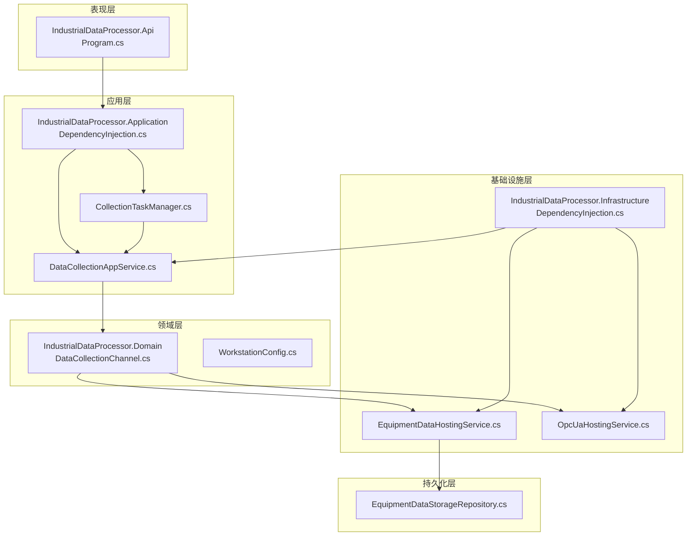
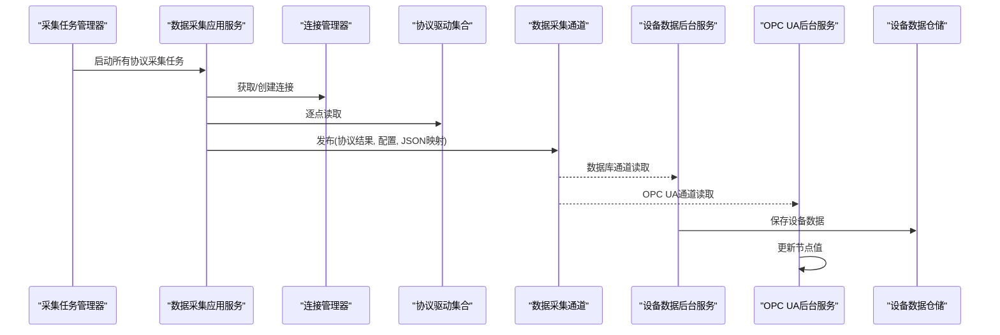
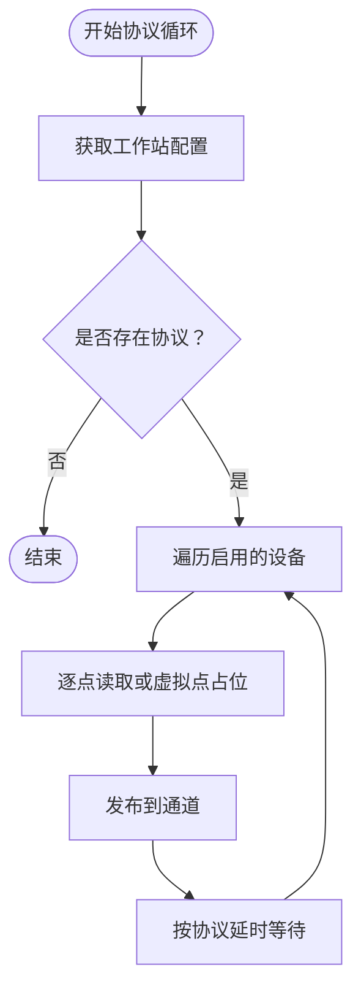
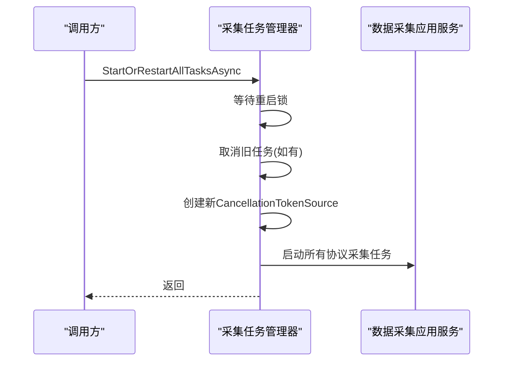
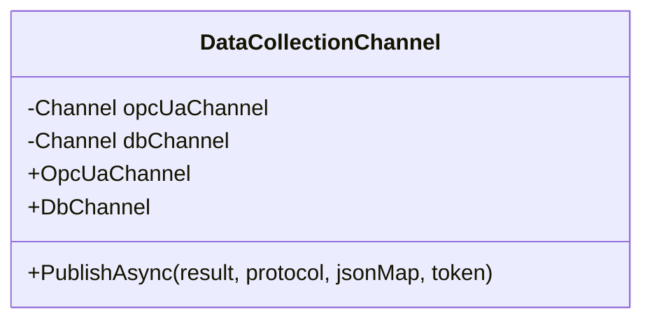
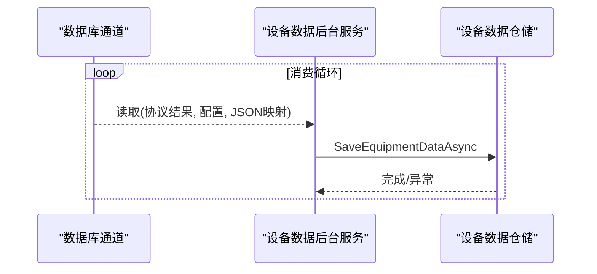
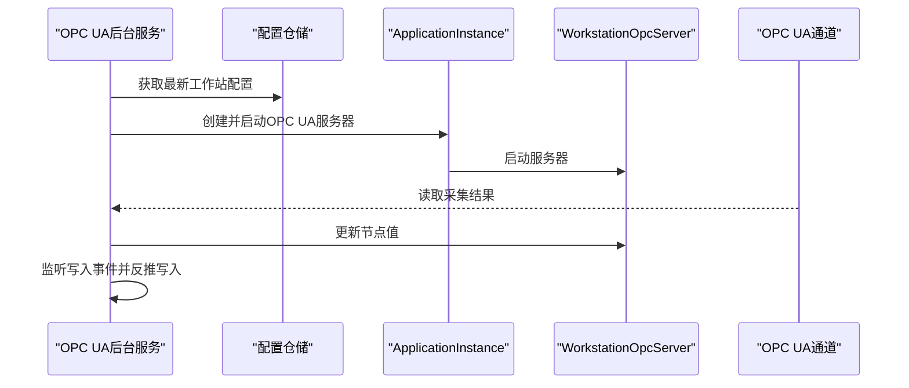
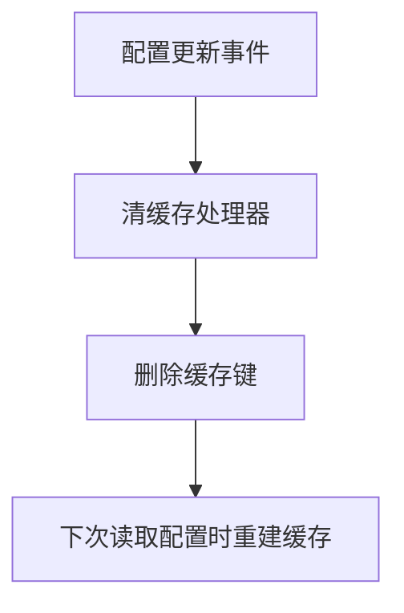
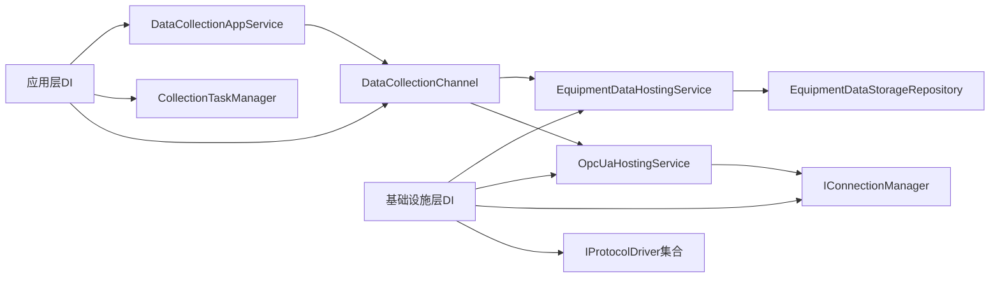

# 性能扩展

<cite>
**本文引用的文件**
- [Program.cs](file://IndustrialDataSolution/IndustrialDataProcessor.Api/Program.cs)
- [GlobalExceptionHandler.cs](file://IndustrialDataSolution/IndustrialDataProcessor.Api/Middleware/GlobalExceptionHandler.cs)
- [DependencyInjection.cs（应用层）](file://IndustrialDataSolution/IndustrialDataProcessor.Application/DependencyInjection.cs)
- [DependencyInjection.cs（基础设施层）](file://IndustrialDataSolution/IndustrialDataProcessor.Infrastructure/DependencyInjection.cs)
- [DataCollectionAppService.cs](file://IndustrialDataSolution/IndustrialDataProcessor.Application/Services/DataCollectionAppService.cs)
- [CollectionTaskManager.cs](file://IndustrialDataSolution/IndustrialDataProcessor.Application/Services/CollectionTaskManager.cs)
- [DataCollectionChannel.cs](file://IndustrialDataSolution/IndustrialDataProcessor.Domain/Workstation/Results/DataCollectionChannel.cs)
- [EquipmentDataHostingService.cs](file://IndustrialDataSolution/IndustrialDataProcessor.Infrastructure/BackgroundServices/EquipmentDataHostingService.cs)
- [OpcUaHostingService.cs](file://IndustrialDataSolution/IndustrialDataProcessor.Infrastructure/BackgroundServices/OpcUaHostingService.cs)
- [EquipmentDataStorageRepository.cs](file://IndustrialDataSolution/IndustrialDataProcessor.Infrastructure.Persistence.SqlSugar/Repositories/EquipmentDataStorageRepository.cs)
- [CacheKeys.cs](file://IndustrialDataSolution/IndustrialDataProcessor.Application/Constants/CacheKeys.cs)
- [ClearConfigCacheEventHandler.cs](file://IndustrialDataSolution/IndustrialDataProcessor.Application/EventHandlers/ClearConfigCacheEventHandler.cs)
- [WorkstationConfig.cs](file://IndustrialDataSolution/IndustrialDataProcessor.Domain/Workstation/Configs/WorkstationConfig.cs)
</cite>

## 目录
1. [引言](#引言)
2. [项目结构](#项目结构)
3. [核心组件](#核心组件)
4. [架构总览](#架构总览)
5. [详细组件分析](#详细组件分析)
6. [依赖关系分析](#依赖关系分析)
7. [性能考量与优化实践](#性能考量与优化实践)
8. [监控与可观测性扩展](#监控与可观测性扩展)
9. [分布式部署与扩展指南](#分布式部署与扩展指南)
10. [性能测试与调优方法](#性能测试与调优方法)
11. [故障排查指南](#故障排查指南)
12. [结论](#结论)

## 引言
本文件面向DDD工业数据处理解决方案的性能扩展开发，围绕分布式部署、微服务架构设计、服务拆分策略、分布式协调机制、负载均衡、缓存集群、并发控制、监控与可观测性、性能优化以及性能测试与调优等方面，结合代码库现状进行系统化梳理与落地建议。目标是在保障稳定性与可维护性的前提下，最大化吞吐、降低延迟、提升弹性与可扩展性。

## 项目结构
项目采用多层架构与领域驱动设计（DDD）组织，主要分为以下层次：
- 表现层（Api）：ASP.NET Core Web API，注册中间件、健康检查、控制器与异常处理。
- 应用层（Application）：应用服务、命令/事件处理、验证器、依赖注入入口。
- 领域层（Domain）：实体、领域事件、结果模型、通道与配置模型。
- 基础设施层（Infrastructure）：后台服务、通信驱动、OPC UA服务、仓储实现。
- 持久化层（Infrastructure.Persistence.SqlSugar）：基于SqlSugar的设备数据写入实现。
- 共享层（Share）：通用异常与工具（本文件不涉及）。

图示来源
- [Program.cs](file://IndustrialDataSolution/IndustrialDataProcessor.Api/Program.cs#L10-L51)
- [DependencyInjection.cs（应用层）](file://IndustrialDataSolution/IndustrialDataProcessor.Application/DependencyInjection.cs#L16-L39)
- [DependencyInjection.cs（基础设施层）](file://IndustrialDataSolution/IndustrialDataProcessor.Infrastructure/DependencyInjection.cs#L17-L79)
- [DataCollectionAppService.cs](file://IndustrialDataSolution/IndustrialDataProcessor.Application/Services/DataCollectionAppService.cs#L10-L41)
- [CollectionTaskManager.cs](file://IndustrialDataSolution/IndustrialDataProcessor.Application/Services/CollectionTaskManager.cs#L19-L59)
- [DataCollectionChannel.cs](file://IndustrialDataSolution/IndustrialDataProcessor.Domain/Workstation/Results/DataCollectionChannel.cs#L10-L36)
- [EquipmentDataHostingService.cs](file://IndustrialDataSolution/IndustrialDataProcessor.Infrastructure/BackgroundServices/EquipmentDataHostingService.cs#L9-L42)
- [OpcUaHostingService.cs](file://IndustrialDataSolution/IndustrialDataProcessor.Infrastructure/BackgroundServices/OpcUaHostingService.cs#L20-L61)
- [EquipmentDataStorageRepository.cs](file://IndustrialDataSolution/IndustrialDataProcessor.Infrastructure.Persistence.SqlSugar/Repositories/EquipmentDataStorageRepository.cs#L11-L73)
- [WorkstationConfig.cs](file://IndustrialDataSolution/IndustrialDataProcessor.Domain/Workstation/Configs/WorkstationConfig.cs#L6-L27)

章节来源
- [Program.cs](file://IndustrialDataSolution/IndustrialDataProcessor.Api/Program.cs#L10-L51)
- [DependencyInjection.cs（应用层）](file://IndustrialDataSolution/IndustrialDataProcessor.Application/DependencyInjection.cs#L16-L39)
- [DependencyInjection.cs（基础设施层）](file://IndustrialDataSolution/IndustrialDataProcessor.Infrastructure/DependencyInjection.cs#L17-L79)
- [DataCollectionChannel.cs](file://IndustrialDataSolution/IndustrialDataProcessor.Domain/Workstation/Results/DataCollectionChannel.cs#L10-L36)

## 核心组件
- 数据采集应用服务：负责按协议维度启动独立后台循环，进行设备点位读取、异常隔离与结果发布。
- 采集任务管理器：统一启动/重启所有采集任务，提供取消令牌与并发重启保护。
- 数据采集通道：基于无界通道的扇出机制，向OPC UA与数据库消费者分发采集结果。
- 设备数据后台服务：消费数据库通道并将数据批量写入数据库。
- OPC UA后台服务：启动OPC UA服务器，订阅采集通道并更新节点值，同时支持写入反推。
- 仓储实现：将采集结果序列化后写入时序数据库。
- 缓存与事件：内存缓存键常量与配置变更事件清理缓存。

章节来源
- [DataCollectionAppService.cs](file://IndustrialDataSolution/IndustrialDataProcessor.Application/Services/DataCollectionAppService.cs#L22-L41)
- [CollectionTaskManager.cs](file://IndustrialDataSolution/IndustrialDataProcessor.Application/Services/CollectionTaskManager.cs#L19-L59)
- [DataCollectionChannel.cs](file://IndustrialDataSolution/IndustrialDataProcessor.Domain/Workstation/Results/DataCollectionChannel.cs#L26-L36)
- [EquipmentDataHostingService.cs](file://IndustrialDataSolution/IndustrialDataProcessor.Infrastructure/BackgroundServices/EquipmentDataHostingService.cs#L16-L41)
- [OpcUaHostingService.cs](file://IndustrialDataSolution/IndustrialDataProcessor.Infrastructure/BackgroundServices/OpcUaHostingService.cs#L101-L184)
- [EquipmentDataStorageRepository.cs](file://IndustrialDataSolution/IndustrialDataProcessor.Infrastructure.Persistence.SqlSugar/Repositories/EquipmentDataStorageRepository.cs#L38-L72)
- [CacheKeys.cs](file://IndustrialDataSolution/IndustrialDataProcessor.Application/Constants/CacheKeys.cs#L5-L6)
- [ClearConfigCacheEventHandler.cs](file://IndustrialDataSolution/IndustrialDataProcessor.Application/EventHandlers/ClearConfigCacheEventHandler.cs#L16-L24)

## 架构总览
系统采用“后台服务 + 无界通道 + 多消费者”的解耦架构：
- 采集层：按协议独立循环，互不影响，异常隔离。
- 通道层：无界通道扇出，分别供给OPC UA与数据库消费者。
- 消费层：OPC UA服务与数据库后台服务各自消费通道并执行对应动作。
- 缓存层：内存缓存配合事件清理，保证配置读取一致性。

图示来源
- [CollectionTaskManager.cs](file://IndustrialDataSolution/IndustrialDataProcessor.Application/Services/CollectionTaskManager.cs#L49-L51)
- [DataCollectionAppService.cs](file://IndustrialDataSolution/IndustrialDataProcessor.Application/Services/DataCollectionAppService.cs#L79-L198)
- [DataCollectionChannel.cs](file://IndustrialDataSolution/IndustrialDataProcessor.Domain/Workstation/Results/DataCollectionChannel.cs#L29-L35)
- [EquipmentDataHostingService.cs](file://IndustrialDataSolution/IndustrialDataProcessor.Infrastructure/BackgroundServices/EquipmentDataHostingService.cs#L21-L35)
- [OpcUaHostingService.cs](file://IndustrialDataSolution/IndustrialDataProcessor.Infrastructure/BackgroundServices/OpcUaHostingService.cs#L161-L174)
- [EquipmentDataStorageRepository.cs](file://IndustrialDataSolution/IndustrialDataProcessor.Infrastructure.Persistence.SqlSugar/Repositories/EquipmentDataStorageRepository.cs#L38-L53)

## 详细组件分析

### 数据采集应用服务
- 独立协议循环：为每个协议创建独立后台任务，互不阻塞，按协议配置的延时推进。
- 异常隔离：协议级异常被捕获并记录，不影响其他协议线程。
- 虚拟点处理：对虚拟点直接构造占位结果，减少底层驱动开销。
- 结果发布：将协议结果与JSON映射一并发布至通道，供下游处理。

图示来源
- [DataCollectionAppService.cs](file://IndustrialDataSolution/IndustrialDataProcessor.Application/Services/DataCollectionAppService.cs#L22-L41)
- [DataCollectionAppService.cs](file://IndustrialDataSolution/IndustrialDataProcessor.Application/Services/DataCollectionAppService.cs#L46-L214)

章节来源
- [DataCollectionAppService.cs](file://IndustrialDataSolution/IndustrialDataProcessor.Application/Services/DataCollectionAppService.cs#L22-L41)
- [DataCollectionAppService.cs](file://IndustrialDataSolution/IndustrialDataProcessor.Application/Services/DataCollectionAppService.cs#L46-L214)

### 采集任务管理器
- 统一启动/重启：通过取消令牌与信号源控制旧任务安全退出，再启动新任务。
- 并发保护：使用信号量防止并发重启。
- 作用域解析：在短暂作用域中解析应用服务，避免生命周期问题。

图示来源
- [CollectionTaskManager.cs](file://IndustrialDataSolution/IndustrialDataProcessor.Application/Services/CollectionTaskManager.cs#L19-L59)
- [DataCollectionAppService.cs](file://IndustrialDataSolution/IndustrialDataProcessor.Application/Services/DataCollectionAppService.cs#L22-L41)

章节来源
- [CollectionTaskManager.cs](file://IndustrialDataSolution/IndustrialDataProcessor.Application/Services/CollectionTaskManager.cs#L19-L59)

### 数据采集通道
- 无界通道：为OPC UA与数据库分别建立无界通道，避免背压阻塞。
- 扇出发布：将同一轮采集结果同时写入两个通道，实现多路消费。

图示来源
- [DataCollectionChannel.cs](file://IndustrialDataSolution/IndustrialDataProcessor.Domain/Workstation/Results/DataCollectionChannel.cs#L10-L36)

章节来源
- [DataCollectionChannel.cs](file://IndustrialDataSolution/IndustrialDataProcessor.Domain/Workstation/Results/DataCollectionChannel.cs#L10-L36)

### 设备数据后台服务
- 消费数据库通道：持续读取并逐条写入数据库，异常单独捕获记录。
- 顺序写入：逐条保存，便于定位问题与回溯。

图示来源
- [EquipmentDataHostingService.cs](file://IndustrialDataSolution/IndustrialDataProcessor.Infrastructure/BackgroundServices/EquipmentDataHostingService.cs#L16-L41)
- [EquipmentDataStorageRepository.cs](file://IndustrialDataSolution/IndustrialDataProcessor.Infrastructure.Persistence.SqlSugar/Repositories/EquipmentDataStorageRepository.cs#L38-L72)

章节来源
- [EquipmentDataHostingService.cs](file://IndustrialDataSolution/IndustrialDataProcessor.Infrastructure/BackgroundServices/EquipmentDataHostingService.cs#L16-L41)
- [EquipmentDataStorageRepository.cs](file://IndustrialDataSolution/IndustrialDataProcessor.Infrastructure.Persistence.SqlSugar/Repositories/EquipmentDataStorageRepository.cs#L38-L72)

### OPC UA后台服务
- 服务器生命周期：支持启动/重启，使用信号量保护并发重启。
- 写入反推：接收OPC客户端写入请求，通过表达式转换器反推物理值并调用驱动写入。
- 数据更新：从通道读取采集结果，更新节点管理器中的数据。

图示来源
- [OpcUaHostingService.cs](file://IndustrialDataSolution/IndustrialDataProcessor.Infrastructure/BackgroundServices/OpcUaHostingService.cs#L101-L184)
- [OpcUaHostingService.cs](file://IndustrialDataSolution/IndustrialDataProcessor.Infrastructure/BackgroundServices/OpcUaHostingService.cs#L136-L158)

章节来源
- [OpcUaHostingService.cs](file://IndustrialDataSolution/IndustrialDataProcessor.Infrastructure/BackgroundServices/OpcUaHostingService.cs#L101-L184)

### 缓存与事件（内存缓存）
- 缓存键：定义“最新工作站配置”缓存键。
- 清理策略：监听配置更新事件，主动删除缓存键，确保后续读取到最新配置。

图示来源
- [CacheKeys.cs](file://IndustrialDataSolution/IndustrialDataProcessor.Application/Constants/CacheKeys.cs#L5-L6)
- [ClearConfigCacheEventHandler.cs](file://IndustrialDataSolution/IndustrialDataProcessor.Application/EventHandlers/ClearConfigCacheEventHandler.cs#L16-L24)

章节来源
- [CacheKeys.cs](file://IndustrialDataSolution/IndustrialDataProcessor.Application/Constants/CacheKeys.cs#L5-L6)
- [ClearConfigCacheEventHandler.cs](file://IndustrialDataSolution/IndustrialDataProcessor.Application/EventHandlers/ClearConfigCacheEventHandler.cs#L16-L24)

## 依赖关系分析
- 依赖注入：应用层注册应用服务、验证器、MediatR与通道；基础设施层注册连接管理器、后台服务、驱动集合与序列化选项。
- 后台服务：采集应用服务与任务管理器在API层注册为托管服务；OPC UA与数据库后台服务在基础设施层注册。
- 通道耦合：采集应用服务与后台服务通过通道解耦，降低耦合度与提升扩展性。

图示来源
- [DependencyInjection.cs（应用层）](file://IndustrialDataSolution/IndustrialDataProcessor.Application/DependencyInjection.cs#L16-L39)
- [DependencyInjection.cs（基础设施层）](file://IndustrialDataSolution/IndustrialDataProcessor.Infrastructure/DependencyInjection.cs#L17-L79)
- [DataCollectionChannel.cs](file://IndustrialDataSolution/IndustrialDataProcessor.Domain/Workstation/Results/DataCollectionChannel.cs#L10-L36)
- [EquipmentDataHostingService.cs](file://IndustrialDataSolution/IndustrialDataProcessor.Infrastructure/BackgroundServices/EquipmentDataHostingService.cs#L9-L42)
- [OpcUaHostingService.cs](file://IndustrialDataSolution/IndustrialDataProcessor.Infrastructure/BackgroundServices/OpcUaHostingService.cs#L20-L46)

章节来源
- [DependencyInjection.cs（应用层）](file://IndustrialDataSolution/IndustrialDataProcessor.Application/DependencyInjection.cs#L16-L39)
- [DependencyInjection.cs（基础设施层）](file://IndustrialDataSolution/IndustrialDataProcessor.Infrastructure/DependencyInjection.cs#L17-L79)

## 性能考量与优化实践
- 线程与并发
  - 协议级独立循环：避免相互阻塞，提升整体吞吐。
  - 通道无界：防止背压，但需关注内存占用与GC压力，必要时引入背压策略。
  - 后台服务消费：逐条写入，简单可靠；可考虑批量写入以降低IO次数。
- 异步与I/O
  - 通道读写与数据库写入均采用异步，避免阻塞。
  - 驱动读取与写入在应用服务中异步执行，异常隔离。
- 内存与序列化
  - 采集结果序列化为JSON字符串后写入数据库，减少对象图复杂度。
  - 虚拟点直接构造占位结果，减少无效I/O。
- 数据库优化
  - 使用时序数据库（TimescaleDB）存储设备数据，适合高频写入与时间序列查询。
  - 写入采用单条插入，便于定位问题；可评估批量写入策略。
- 缓存
  - 内存缓存用于热点配置读取，事件驱动清理，避免陈旧数据。
- 网络与协议
  - 连接复用与长连接策略减少握手开销；异常时自动重试。
- 监控与日志
  - 全局异常处理输出结构化ProblemDetails，便于前端与网关处理。
  - 关键路径使用计时器与日志记录耗时，支撑性能分析。

章节来源
- [DataCollectionAppService.cs](file://IndustrialDataSolution/IndustrialDataProcessor.Application/Services/DataCollectionAppService.cs#L79-L198)
- [EquipmentDataHostingService.cs](file://IndustrialDataSolution/IndustrialDataProcessor.Infrastructure/BackgroundServices/EquipmentDataHostingService.cs#L21-L35)
- [EquipmentDataStorageRepository.cs](file://IndustrialDataSolution/IndustrialDataProcessor.Infrastructure.Persistence.SqlSugar/Repositories/EquipmentDataStorageRepository.cs#L38-L72)
- [GlobalExceptionHandler.cs](file://IndustrialDataSolution/IndustrialDataProcessor.Api/Middleware/GlobalExceptionHandler.cs#L12-L47)

## 监控与可观测性扩展
- 指标收集
  - 在采集应用服务的关键路径（协议/设备/点位）埋点，记录耗时与成功率。
  - 在后台服务中记录每批次写入数量与耗时，形成吞吐指标。
- 分布式追踪
  - 为每个采集批次生成唯一ID，贯穿通道与后台服务，便于跨服务追踪。
- 日志聚合
  - 使用结构化日志，保留请求ID、协议ID、设备ID等上下文字段，便于检索与聚合。
- 健康检查
  - 已注册健康检查端点，可作为Kubernetes探针或网关健康检查依据。

章节来源
- [Program.cs](file://IndustrialDataSolution/IndustrialDataProcessor.Api/Program.cs#L27-L49)
- [DataCollectionAppService.cs](file://IndustrialDataSolution/IndustrialDataProcessor.Application/Services/DataCollectionAppService.cs#L61-L178)
- [EquipmentDataHostingService.cs](file://IndustrialDataSolution/IndustrialDataProcessor.Infrastructure/BackgroundServices/EquipmentDataHostingService.cs#L21-L35)

## 分布式部署与扩展指南
- 微服务架构设计
  - 采集服务：独立容器化，按协议或站点拆分，支持水平扩展。
  - 数据服务：数据库与OPC UA服务可独立部署，通过通道或消息队列解耦。
  - 配置服务：集中化配置中心，事件驱动缓存清理。
- 服务拆分策略
  - 按协议类型拆分：不同协议驱动独立部署，便于灰度与扩容。
  - 按站点拆分：多工厂/多站点部署，避免跨站点干扰。
- 分布式协调机制
  - 使用命名空间与标签区分环境与租户，避免资源冲突。
  - 使用Leader选举或分布式锁控制关键资源访问（如证书、端口）。
- 负载均衡
  - 客户端负载均衡：在网关或客户端侧实现轮询/权重/健康检查。
  - 服务端负载均衡：Kubernetes Service或Ingress，结合健康检查。
  - 会话亲和性：OPC UA写入场景可按设备/协议设置亲和，确保写入一致性。
- 缓存集群
  - 使用Redis或Memcached集群，开启持久化与主从复制。
  - 一致性：写后失效策略，读前刷新策略，避免脏读。
  - 失效策略：基于事件驱动与TTL结合，控制缓存命中率与新鲜度。
- 并发控制
  - 线程池：合理配置最小/最大线程数，避免CPU争抢。
  - 异步处理：优先使用异步API，减少阻塞。
  - 无锁数据结构：在高频读写场景使用ConcurrentDictionary等。

[本节为概念性指导，不直接分析具体文件，故无章节来源]

## 性能测试与调优方法
- 压力测试
  - 使用JMeter/Loader.io/K6等工具模拟高并发采集请求，观察吞吐与延迟。
  - 针对OPC UA写入场景进行峰值测试，评估写入反推链路。
- 性能基准测试
  - 对关键方法（驱动读取、序列化、写入）进行基准测试，识别瓶颈。
- 瓶颈分析
  - 结合日志与指标，定位CPU、内存、磁盘与网络瓶颈。
  - 通道背压与数据库写入延迟是常见瓶颈，需针对性优化。

[本节为通用方法论，不直接分析具体文件，故无章节来源]

## 故障排查指南
- 全局异常处理
  - 统一捕获并输出RFC 7807格式的ProblemDetails，便于前端与网关处理。
  - 区分参数错误、业务冲突、应用服务失败与基础设施不可用等场景。
- 采集异常
  - 协议级异常被捕获并记录，不影响其他协议线程；检查日志定位具体协议与设备。
- 数据持久化异常
  - 后台服务中对单条写入异常单独记录，避免吞没异常；检查数据库连接与权限。
- OPC UA异常
  - 服务器启动/重启过程中的异常会被记录为严重级别；检查证书与端口占用。

章节来源
- [GlobalExceptionHandler.cs](file://IndustrialDataSolution/IndustrialDataProcessor.Api/Middleware/GlobalExceptionHandler.cs#L12-L47)
- [DataCollectionAppService.cs](file://IndustrialDataSolution/IndustrialDataProcessor.Application/Services/DataCollectionAppService.cs#L159-L171)
- [EquipmentDataHostingService.cs](file://IndustrialDataSolution/IndustrialDataProcessor.Infrastructure/BackgroundServices/EquipmentDataHostingService.cs#L30-L34)
- [OpcUaHostingService.cs](file://IndustrialDataSolution/IndustrialDataProcessor.Infrastructure/BackgroundServices/OpcUaHostingService.cs#L176-L183)

## 结论
本方案通过“后台服务 + 无界通道 + 多消费者”的解耦架构，在保障稳定性的同时实现了良好的扩展性。建议在现有基础上进一步引入分布式协调、缓存集群、负载均衡与可观测性体系，结合性能测试与调优方法，持续提升系统的吞吐、延迟与可靠性，满足工业场景的高可用需求。