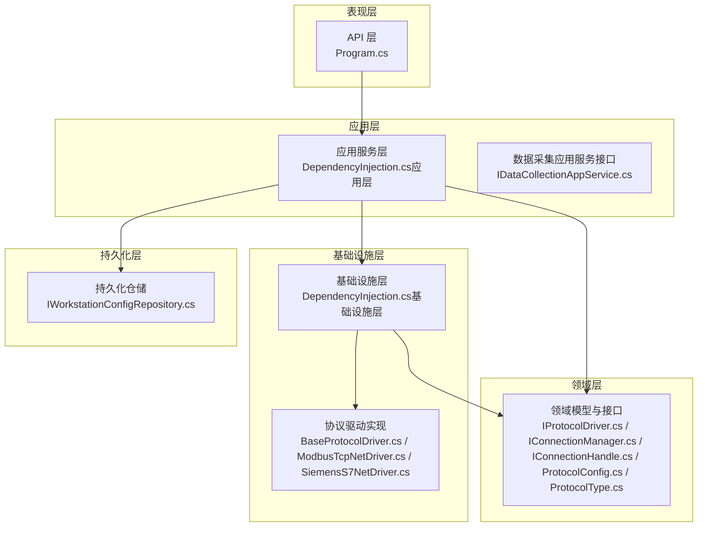
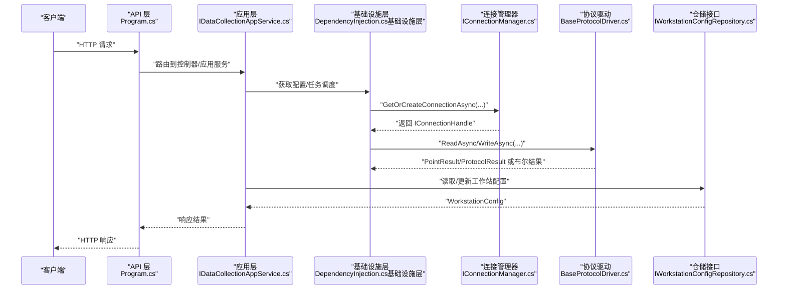
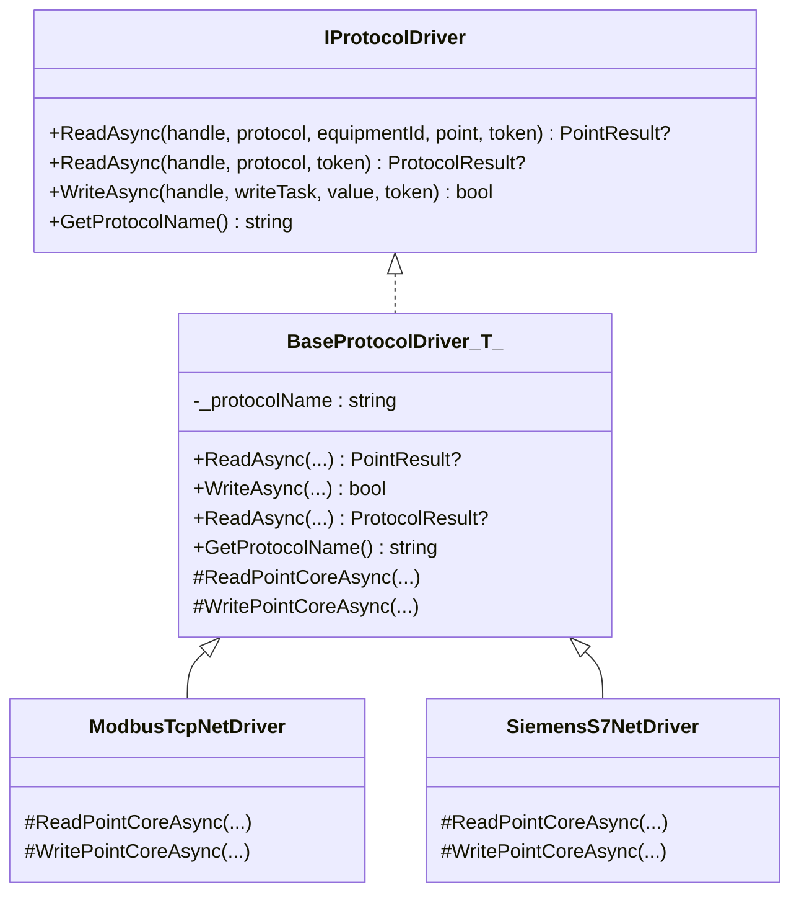
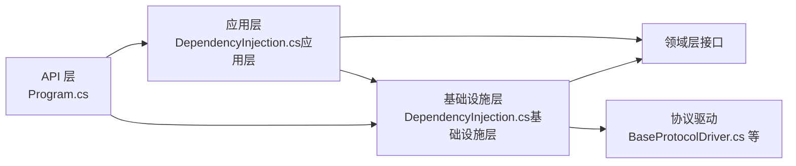

# 扩展开发

<cite>
**本文引用的文件**
- [Program.cs](file://IndustrialDataSolution/IndustrialDataProcessor.Api/Program.cs)
- [DependencyInjection.cs（应用层）](file://IndustrialDataSolution/IndustrialDataProcessor.Application/DependencyInjection.cs)
- [DependencyInjection.cs（基础设施层）](file://IndustrialDataSolution/IndustrialDataProcessor.Infrastructure/DependencyInjection.cs)
- [IProtocolDriver.cs](file://IndustrialDataSolution/IndustrialDataProcessor.Domain/Communication/IConnection/IProtocolDriver.cs)
- [IConnectionManager.cs](file://IndustrialDataSolution/IndustrialDataProcessor.Domain/Communication/IConnection/IConnectionManager.cs)
- [IConnectionHandle.cs](file://IndustrialDataSolution/IndustrialDataProcessor.Domain/Communication/IConnection/IConnectionHandle.cs)
- [ProtocolConfig.cs](file://IndustrialDataSolution/IndustrialDataProcessor.Domain/Workstation/Configs/ProtocolConfig.cs)
- [ProtocolType.cs](file://IndustrialDataSolution/IndustrialDataProcessor.Domain/Enums/ProtocolType.cs)
- [BaseProtocolDriver.cs](file://IndustrialDataSolution/IndustrialDataProcessor.Infrastructure/Communication/Drivers/TcpCommon/BaseProtocolDriver.cs)
- [ModbusTcpNetDriver.cs](file://IndustrialDataSolution/IndustrialDataProcessor.Infrastructure/Communication/Drivers/TcpCommon/ModbusTcpNetDriver.cs)
- [SiemensS7NetDriver.cs](file://IndustrialDataSolution/IndustrialDataProcessor.Infrastructure/Communication/Drivers/TcpCommon/SiemensS7NetDriver.cs)
- [IDataCollectionAppService.cs](file://IndustrialDataSolution/IndustrialDataProcessor.Application/Services/IDataCollectionAppService.cs)
- [IWorkstationConfigRepository.cs](file://IndustrialDataSolution/IndustrialDataProcessor.Domain/Repositories/IWorkstationConfigRepository.cs)
</cite>

## 目录
1. [引言](#引言)
2. [项目结构](#项目结构)
3. [核心组件](#核心组件)
4. [架构总览](#架构总览)
5. [详细组件分析](#详细组件分析)
6. [依赖关系分析](#依赖关系分析)
7. [性能考虑](#性能考虑)
8. [故障排查指南](#故障排查指南)
9. [结论](#结论)
10. [附录](#附录)

## 引言
本文件面向需要为 DDD 工业数据处理解决方案进行扩展开发的工程师，提供从接口设计、实现规范到集成测试的完整指南。内容覆盖以下主题：
- 新协议支持的开发流程（协议分析、驱动实现、配置管理、测试验证）
- 自定义扩展点的开发方法（接口扩展、服务注册、依赖注入配置）
- 第三方系统集成（API 适配、数据格式转换、同步机制）
- 数据存储扩展（新存储后端集成、数据迁移策略）
- 监控与告警扩展（自定义指标收集、告警规则配置）
- 性能扩展（分布式部署、负载均衡、缓存集群）
- 最佳实践与注意事项，以及向社区贡献的指导

## 项目结构
该解决方案采用分层架构与领域驱动设计（DDD）思想，主要分为以下层次：
- 表现层（API 层）：负责 HTTP 入口、中间件、健康检查、Swagger 文档等
- 应用层（Application）：负责用例编排、事务边界、验证行为、事件处理
- 领域层（Domain）：定义协议、设备、点位、枚举、仓储接口等核心模型
- 基础设施层（Infrastructure）：实现协议驱动、连接管理、OPC UA、序列化转换器、后台服务等
- 持久化层（Persistence）：当前使用 SqlSugar 实现仓储与实体映射
- 共享层（Share）：异常与共享能力

图表来源
- [Program.cs](file://IndustrialDataSolution/IndustrialDataProcessor.Api/Program.cs#L1-L54)
- [DependencyInjection.cs（应用层）](file://IndustrialDataSolution/IndustrialDataProcessor.Application/DependencyInjection.cs#L1-L40)
- [DependencyInjection.cs（基础设施层）](file://IndustrialDataSolution/IndustrialDataProcessor.Infrastructure/DependencyInjection.cs#L1-L82)
- [IProtocolDriver.cs](file://IndustrialDataSolution/IndustrialDataProcessor.Domain/Communication/IConnection/IProtocolDriver.cs#L1-L14)
- [IConnectionManager.cs](file://IndustrialDataSolution/IndustrialDataProcessor.Domain/Communication/IConnection/IConnectionManager.cs#L1-L19)
- [IConnectionHandle.cs](file://IndustrialDataSolution/IndustrialDataProcessor.Domain/Communication/IConnection/IConnectionHandle.cs#L1-L19)
- [ProtocolConfig.cs](file://IndustrialDataSolution/IndustrialDataProcessor.Domain/Workstation/Configs/ProtocolConfig.cs#L1-L64)
- [ProtocolType.cs](file://IndustrialDataSolution/IndustrialDataProcessor.Domain/Enums/ProtocolType.cs#L1-L231)
- [BaseProtocolDriver.cs](file://IndustrialDataSolution/IndustrialDataProcessor.Infrastructure/Communication/Drivers/TcpCommon/BaseProtocolDriver.cs#L1-L108)
- [ModbusTcpNetDriver.cs](file://IndustrialDataSolution/IndustrialDataProcessor.Infrastructure/Communication/Drivers/TcpCommon/ModbusTcpNetDriver.cs#L1-L41)
- [SiemensS7NetDriver.cs](file://IndustrialDataSolution/IndustrialDataProcessor.Infrastructure/Communication/Drivers/TcpCommon/SiemensS7NetDriver.cs#L1-L24)
- [IWorkstationConfigRepository.cs](file://IndustrialDataSolution/IndustrialDataProcessor.Domain/Repositories/IWorkstationConfigRepository.cs#L1-L12)

章节来源
- [Program.cs](file://IndustrialDataSolution/IndustrialDataProcessor.Api/Program.cs#L1-L54)
- [DependencyInjection.cs（应用层）](file://IndustrialDataSolution/IndustrialDataProcessor.Application/DependencyInjection.cs#L1-L40)
- [DependencyInjection.cs（基础设施层）](file://IndustrialDataSolution/IndustrialDataProcessor.Infrastructure/DependencyInjection.cs#L1-L82)

## 核心组件
- 协议驱动接口与抽象基类
  - IProtocolDriver 定义了统一的读写契约与协议名称标识
  - BaseProtocolDriver 提供通用的连接保障、异常包装与模板方法编排
- 连接管理与句柄
  - IConnectionManager 负责按协议配置获取/创建连接句柄与清理
  - IConnectionHandle 提供原始连接访问与通道锁（保证串口/TCP通道串行）
- 协议配置与类型
  - ProtocolConfig 定义协议通用字段（超时、账号密码、备注、附加选项、设备列表等）
  - ProtocolType 枚举定义所有受支持的协议类型及接口类型、参数校验元数据
- 应用服务与后台任务
  - IDataCollectionAppService 作为后台常驻采集任务的入口
  - 应用层通过依赖注入注册验证行为、MediatR、应用服务与任务管理器
- 基础设施层与驱动注册
  - 基础设施层在启动时对 HSL 授权进行校验，并注册 IConnectionManager、OPC UA 后台服务、设备数据处理器、表达式转换器、协议驱动集合等
  - 自动扫描并注册所有 IProtocolDriver 的非抽象实现为单例

章节来源
- [IProtocolDriver.cs](file://IndustrialDataSolution/IndustrialDataProcessor.Domain/Communication/IConnection/IProtocolDriver.cs#L1-L14)
- [BaseProtocolDriver.cs](file://IndustrialDataSolution/IndustrialDataProcessor.Infrastructure/Communication/Drivers/TcpCommon/BaseProtocolDriver.cs#L1-L108)
- [IConnectionManager.cs](file://IndustrialDataSolution/IndustrialDataProcessor.Domain/Communication/IConnection/IConnectionManager.cs#L1-L19)
- [IConnectionHandle.cs](file://IndustrialDataSolution/IndustrialDataProcessor.Domain/Communication/IConnection/IConnectionHandle.cs#L1-L19)
- [ProtocolConfig.cs](file://IndustrialDataSolution/IndustrialDataProcessor.Domain/Workstation/Configs/ProtocolConfig.cs#L1-L64)
- [ProtocolType.cs](file://IndustrialDataSolution/IndustrialDataProcessor.Domain/Enums/ProtocolType.cs#L1-L231)
- [IDataCollectionAppService.cs](file://IndustrialDataSolution/IndustrialDataProcessor.Application/Services/IDataCollectionAppService.cs#L1-L13)
- [DependencyInjection.cs（应用层）](file://IndustrialDataSolution/IndustrialDataProcessor.Application/DependencyInjection.cs#L1-L40)
- [DependencyInjection.cs（基础设施层）](file://IndustrialDataSolution/IndustrialDataProcessor.Infrastructure/DependencyInjection.cs#L1-L82)

## 架构总览
下图展示了从 API 到应用层、领域层、基础设施层与存储层的整体交互路径，以及协议驱动的扩展点。

图表来源
- [Program.cs](file://IndustrialDataSolution/IndustrialDataProcessor.Api/Program.cs#L1-L54)
- [IDataCollectionAppService.cs](file://IndustrialDataSolution/IndustrialDataProcessor.Application/Services/IDataCollectionAppService.cs#L1-L13)
- [DependencyInjection.cs（基础设施层）](file://IndustrialDataSolution/IndustrialDataProcessor.Infrastructure/DependencyInjection.cs#L1-L82)
- [IConnectionManager.cs](file://IndustrialDataSolution/IndustrialDataProcessor.Domain/Communication/IConnection/IConnectionManager.cs#L1-L19)
- [BaseProtocolDriver.cs](file://IndustrialDataSolution/IndustrialDataProcessor.Infrastructure/Communication/Drivers/TcpCommon/BaseProtocolDriver.cs#L1-L108)
- [IWorkstationConfigRepository.cs](file://IndustrialDataSolution/IndustrialDataProcessor.Domain/Repositories/IWorkstationConfigRepository.cs#L1-L12)

## 详细组件分析

### 协议驱动扩展：新协议支持开发流程
目标：为新协议实现 IProtocolDriver 并接入系统，完成配置、读写、异常处理与测试验证。

- 协议分析与配置
  - 明确协议接口类型（LAN/COM/API/DATABASE）与参数要求（站号、数据格式、地址起始、仪表类型等）
  - 在 ProtocolType 中新增枚举项，并标注接口类型与参数校验元数据
  - 在 ProtocolConfig 中补充协议特有字段（若需要），并在应用层 DTO 中体现
- 驱动实现
  - 继承 BaseProtocolDriver<TConnection>，实现 ReadPointCoreAsync 与 WritePointCoreAsync
  - 使用 IConnectionHandle.GetRawConnection<T>() 获取底层连接实例
  - 在读写前通过 AcquireLockAsync 获取通道锁，避免并发冲突
  - 对异常进行统一包装，便于上层识别与日志记录
- 配置管理
  - 在基础设施层的依赖注入中，确保新驱动被自动注册为单例
  - 若需要特殊初始化（如授权、参数映射），在基础设施层注册阶段完成
- 测试验证
  - 单元测试：针对读写核心逻辑与异常分支
  - 集成测试：通过模拟 IConnectionHandle 与真实设备/模拟器进行端到端验证
  - 回归测试：确保现有协议不受影响

图表来源
- [IProtocolDriver.cs](file://IndustrialDataSolution/IndustrialDataProcessor.Domain/Communication/IConnection/IProtocolDriver.cs#L1-L14)
- [BaseProtocolDriver.cs](file://IndustrialDataSolution/IndustrialDataProcessor.Infrastructure/Communication/Drivers/TcpCommon/BaseProtocolDriver.cs#L1-L108)
- [ModbusTcpNetDriver.cs](file://IndustrialDataSolution/IndustrialDataProcessor.Infrastructure/Communication/Drivers/TcpCommon/ModbusTcpNetDriver.cs#L1-L41)
- [SiemensS7NetDriver.cs](file://IndustrialDataSolution/IndustrialDataProcessor.Infrastructure/Communication/Drivers/TcpCommon/SiemensS7NetDriver.cs#L1-L24)

章节来源
- [ProtocolType.cs](file://IndustrialDataSolution/IndustrialDataProcessor.Domain/Enums/ProtocolType.cs#L1-L231)
- [ProtocolConfig.cs](file://IndustrialDataSolution/IndustrialDataProcessor.Domain/Workstation/Configs/ProtocolConfig.cs#L1-L64)
- [BaseProtocolDriver.cs](file://IndustrialDataSolution/IndustrialDataProcessor.Infrastructure/Communication/Drivers/TcpCommon/BaseProtocolDriver.cs#L1-L108)
- [DependencyInjection.cs（基础设施层）](file://IndustrialDataSolution/IndustrialDataProcessor.Infrastructure/DependencyInjection.cs#L55-L62)

### 自定义扩展点：接口扩展、服务注册与依赖注入
- 扩展点设计
  - 在领域层定义新的接口（如 ICustomDataProcessor、ICustomSerializer），并在应用层声明对应的服务接口
  - 在基础设施层提供默认实现，并通过依赖注入注册
- 服务注册
  - 在基础设施层的 DependencyInjection 中注册新服务与转换器
  - 在应用层的 DependencyInjection 中注册应用服务与 MediatR 行为
- 依赖注入配置
  - 生命周期选择：无状态工具类推荐 Singleton；有状态且与请求上下文相关的服务推荐 Scoped
  - 通过 AddValidatorsFromAssembly、AddMediatR 等方法批量注册
- 集成测试
  - 使用 TestContainer 或 Mock 对象验证接口契约与行为

章节来源
- [DependencyInjection.cs（应用层）](file://IndustrialDataSolution/IndustrialDataProcessor.Application/DependencyInjection.cs#L1-L40)
- [DependencyInjection.cs（基础设施层）](file://IndustrialDataSolution/IndustrialDataProcessor.Infrastructure/DependencyInjection.cs#L1-L82)

### 第三方系统集成：API 适配、数据格式转换与同步机制
- API 适配
  - 在协议类型中新增 API 类型（ProtocolType.API），并在驱动中实现 HTTP/REST 调用
  - 使用 IConnectionHandle 的通道锁与超时控制，确保并发安全与稳定性
- 数据格式转换
  - 在基础设施层注册自定义 Json 转换器，处理协议配置与点位数据的序列化/反序列化
  - 通过 ProtocolConfigJsonConverter 等转换器扩展支持新的字段或命名策略
- 同步机制
  - 通过应用层的 IDataCollectionAppService 启动采集任务，结合后台托管服务实现周期性同步
  - 对于 OPC UA 等场景，利用基础设施层的 OpcUaHostingService 与 IDataPublishServerManager 实现发布订阅

章节来源
- [ProtocolType.cs](file://IndustrialDataSolution/IndustrialDataProcessor.Domain/Enums/ProtocolType.cs#L212-L220)
- [DependencyInjection.cs（基础设施层）](file://IndustrialDataSolution/IndustrialDataProcessor.Infrastructure/DependencyInjection.cs#L64-L77)
- [DependencyInjection.cs（基础设施层）](file://IndustrialDataSolution/IndustrialDataProcessor.Infrastructure/DependencyInjection.cs#L40-L46)

### 数据存储扩展：新存储后端集成与数据迁移策略
- 新存储后端集成
  - 在领域层定义仓储接口（如 IEquipmentDataStorageRepository），在基础设施层实现具体仓储
  - 在应用层通过依赖注入切换存储实现（多态与工厂模式）
- 数据迁移策略
  - 增量迁移：基于时间戳或版本号，逐步迁移历史数据
  - 双写一致性：迁移期间同时写入新旧存储，最终切换读取源
  - 回滚预案：保留旧存储，确保迁移失败时可快速回退

章节来源
- [IWorkstationConfigRepository.cs](file://IndustrialDataSolution/IndustrialDataProcessor.Domain/Repositories/IWorkstationConfigRepository.cs#L1-L12)

### 监控与告警扩展：自定义指标收集与告警规则配置
- 指标收集
  - 在基础设施层注册健康检查与自定义指标（如采集成功率、延迟、错误率）
  - 通过中间件记录请求耗时与异常，辅助定位问题
- 告警规则
  - 基于指标阈值触发告警（如连续失败次数、平均延迟超限）
  - 结合外部告警平台（如 Prometheus/Grafana/PagerDuty）实现通知与升级

章节来源
- [Program.cs](file://IndustrialDataSolution/IndustrialDataProcessor.Api/Program.cs#L27-L28)
- [Program.cs](file://IndustrialDataSolution/IndustrialDataProcessor.Api/Program.cs#L38-L41)

### 性能扩展：分布式部署、负载均衡与缓存集群
- 分布式部署
  - 将应用层与基础设施层拆分为独立服务，通过消息队列或事件总线解耦
  - 使用容器编排（Kubernetes）实现弹性伸缩与滚动更新
- 负载均衡
  - 在网关层进行流量分发，结合会话亲和或无状态设计
- 缓存集群
  - 使用内存缓存与分布式缓存（Redis）降低数据库压力
  - 对热点配置与计算结果进行缓存，配合失效策略与一致性保证

章节来源
- [Program.cs](file://IndustrialDataSolution/IndustrialDataProcessor.Api/Program.cs#L14-L15)
- [DependencyInjection.cs（应用层）](file://IndustrialDataSolution/IndustrialDataProcessor.Application/DependencyInjection.cs#L25-L26)

## 依赖关系分析
- 组件耦合与内聚
  - 领域层接口与实现分离，基础设施层实现与应用层解耦
  - 协议驱动通过抽象基类统一读写流程，提升内聚性与可测试性
- 直接与间接依赖
  - 应用层依赖领域接口与基础设施服务
  - 基础设施层依赖第三方库（如 HSL）与系统服务（OPC UA、后台服务）
- 外部依赖与集成点
  - HSL 授权验证在启动阶段执行，失败则阻止应用启动
  - OPC UA 通过后台托管服务提供发布能力

图表来源
- [DependencyInjection.cs（应用层）](file://IndustrialDataSolution/IndustrialDataProcessor.Application/DependencyInjection.cs#L1-L40)
- [DependencyInjection.cs（基础设施层）](file://IndustrialDataSolution/IndustrialDataProcessor.Infrastructure/DependencyInjection.cs#L1-L82)
- [Program.cs](file://IndustrialDataSolution/IndustrialDataProcessor.Api/Program.cs#L1-L54)

章节来源
- [DependencyInjection.cs（应用层）](file://IndustrialDataSolution/IndustrialDataProcessor.Application/DependencyInjection.cs#L1-L40)
- [DependencyInjection.cs（基础设施层）](file://IndustrialDataSolution/IndustrialDataProcessor.Infrastructure/DependencyInjection.cs#L1-L82)

## 性能考虑
- 连接复用与锁优化
  - 使用 IConnectionHandle 的 AcquireLockAsync 保证串行访问，避免并发冲突
  - 合理设置超时参数（ConnectTimeOut、ReceiveTimeOut、CommunicationDelay）
- 序列化与转换
  - 通过自定义转换器减少序列化开销，保持字段命名策略一致
- 缓存与批处理
  - 对频繁读取的配置与计算结果进行缓存
  - 批量读取协议数据，降低网络往返次数
- 异常与可观测性
  - 统一异常包装，便于快速定位失败原因
  - 记录关键指标（成功率、延迟、错误分布）

## 故障排查指南
- 启动失败（HSL 授权）
  - 现象：启动时报错提示未找到授权码或授权失败
  - 处理：检查配置节点 HslCommunication:AuthorizationCode 是否存在且有效
- 连接异常
  - 现象：读写失败、超时或设备不可用
  - 处理：确认协议配置（站号、数据格式、地址起始）、网络连通性与设备状态
- 协议不支持整包读取
  - 现象：调用 ReadAsync(ProtocolConfig, CancellationToken) 抛出未实现异常
  - 处理：仅支持点位级读取；如需整包读取，在驱动中重写该方法
- 写入虚拟点
  - 现象：写入虚拟点位返回成功但不上网
  - 处理：根据业务需求决定是否忽略或报错

章节来源
- [DependencyInjection.cs（基础设施层）](file://IndustrialDataSolution/IndustrialDataProcessor.Infrastructure/DependencyInjection.cs#L19-L28)
- [BaseProtocolDriver.cs](file://IndustrialDataSolution/IndustrialDataProcessor.Infrastructure/Communication/Drivers/TcpCommon/BaseProtocolDriver.cs#L77-L81)
- [BaseProtocolDriver.cs](file://IndustrialDataSolution/IndustrialDataProcessor.Infrastructure/Communication/Drivers/TcpCommon/BaseProtocolDriver.cs#L43-L50)

## 结论
通过清晰的分层架构与可扩展的协议驱动体系，该解决方案为工业数据处理提供了强大的扩展能力。开发者只需遵循接口契约、依赖注入规范与测试策略，即可快速集成新协议、第三方系统与存储后端，并在监控与性能方面获得良好的可运维性与可扩展性。

## 附录
- 最佳实践
  - 无状态优先：驱动与工具类尽量注册为 Singleton
  - 明确生命周期：仓储与上下文相关服务使用 Scoped
  - 参数校验：严格依据 ProtocolType 的元数据进行参数校验
  - 异常统一：在驱动层包装异常，便于上层识别与日志记录
- 向社区贡献
  - 提交新协议驱动时，附带单元测试与集成测试用例
  - 更新协议类型与参数校验元数据，完善文档与示例配置
  - 遵循代码风格与提交规范，确保可维护性与可读性