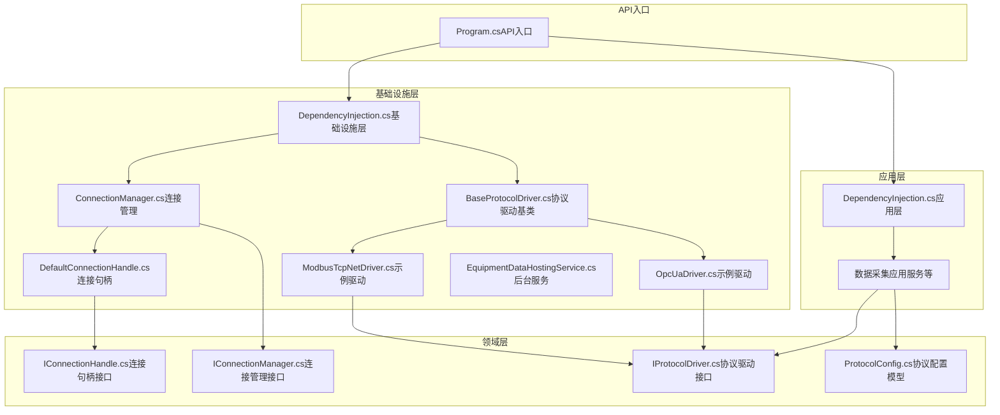
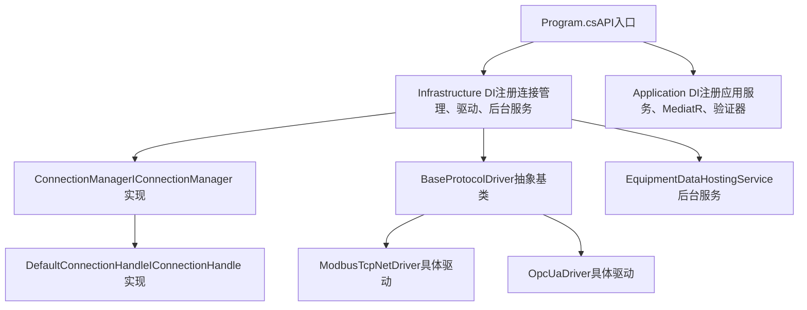
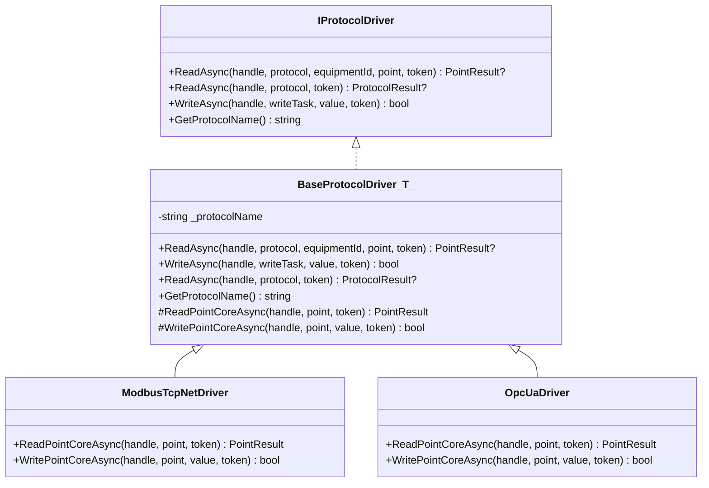
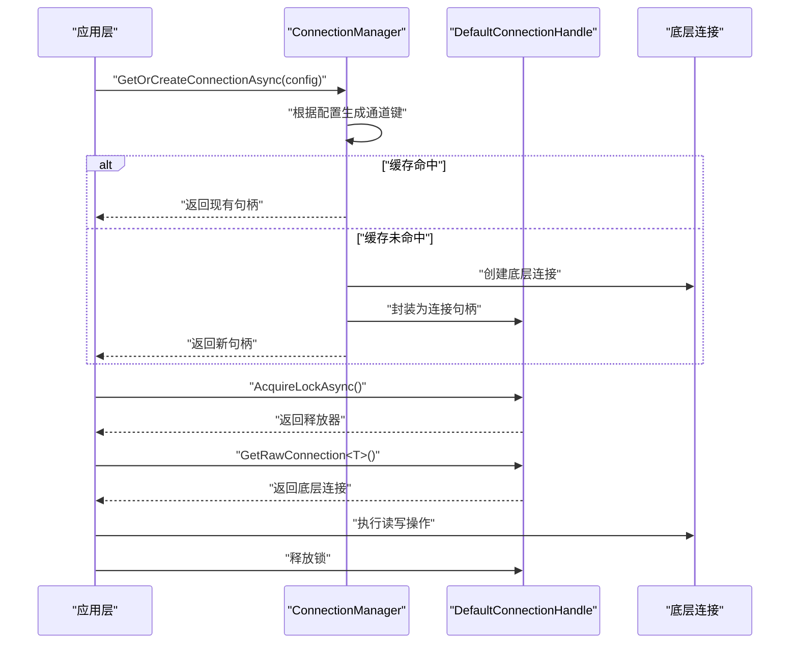
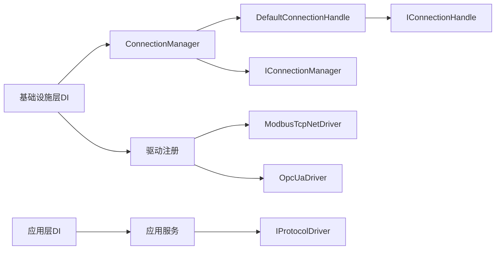
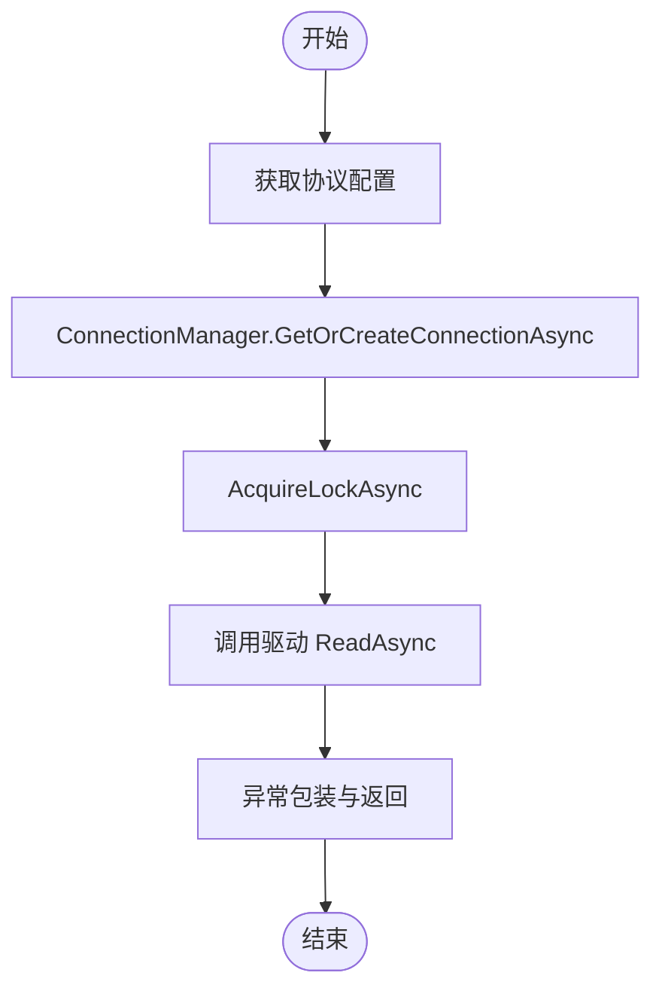

# 插件开发

<cite>
**本文引用的文件**
- [IProtocolDriver.cs](file://IndustrialDataSolution/IndustrialDataProcessor.Domain/Communication/IConnection/IProtocolDriver.cs)
- [IConnectionManager.cs](file://IndustrialDataSolution/IndustrialDataProcessor.Domain/Communication/IConnection/IConnectionManager.cs)
- [IConnectionHandle.cs](file://IndustrialDataSolution/IndustrialDataProcessor.Domain/Communication/IConnection/IConnectionHandle.cs)
- [ConnectionManager.cs](file://IndustrialDataSolution/IndustrialDataProcessor.Infrastructure/Communication/Connection/ConnectionManager.cs)
- [DefaultConnectionHandle.cs](file://IndustrialDataSolution/IndustrialDataProcessor.Infrastructure/Communication/Connection/DefaultConnectionHandle.cs)
- [BaseProtocolDriver.cs](file://IndustrialDataSolution/IndustrialDataProcessor.Infrastructure/Communication/Drivers/TcpCommon/BaseProtocolDriver.cs)
- [ModbusTcpNetDriver.cs](file://IndustrialDataSolution/IndustrialDataProcessor.Infrastructure/Communication/Drivers/TcpCommon/ModbusTcpNetDriver.cs)
- [OpcUaDriver.cs](file://IndustrialDataSolution/IndustrialDataProcessor.Infrastructure/Communication/Drivers/TcpSpecial/OpcUaDriver.cs)
- [ProtocolConfig.cs](file://IndustrialDataSolution/IndustrialDataProcessor.Domain/Workstation/Configs/ProtocolConfig.cs)
- [DependencyInjection.cs（应用层）](file://IndustrialDataSolution/IndustrialDataProcessor.Application/DependencyInjection.cs)
- [DependencyInjection.cs（基础设施层）](file://IndustrialDataSolution/IndustrialDataProcessor.Infrastructure/DependencyInjection.cs)
- [EquipmentDataHostingService.cs](file://IndustrialDataSolution/IndustrialDataProcessor.Infrastructure/BackgroundServices/EquipmentDataHostingService.cs)
- [Program.cs（API入口）](file://IndustrialDataSolution/IndustrialDataProcessor.Api/Program.cs)
- [appsettings.json（API配置）](file://IndustrialDataSolution/IndustrialDataProcessor.Api/appsettings.json)
</cite>

## 目录
1. [简介](#简介)
2. [项目结构](#项目结构)
3. [核心组件](#核心组件)
4. [架构总览](#架构总览)
5. [详细组件分析](#详细组件分析)
6. [依赖关系分析](#依赖关系分析)
7. [性能考量](#性能考量)
8. [故障排查指南](#故障排查指南)
9. [结论](#结论)
10. [附录](#附录)

## 简介
本文件面向DDD工业数据处理解决方案的插件开发，系统性阐述插件架构设计、接口定义、依赖注入配置与生命周期管理，提供协议驱动与连接管理插件的开发指南、测试与验证方法、配置与部署流程，以及最佳实践（错误处理、资源管理、版本兼容性）。目标是帮助开发者快速理解并扩展新的协议驱动与连接管理能力。

## 项目结构
该解决方案采用分层架构与领域驱动设计（DDD）组织代码：
- 工业数据处理解决方案位于 IndustrialDataSolution 目录下，包含应用层、领域层、基础设施层、共享层、模拟器与API入口。
- 插件开发主要围绕领域层的通信接口与基础设施层的具体实现展开，同时通过依赖注入完成装配与生命周期管理。

图表来源
- [Program.cs（API入口）](file://IndustrialDataSolution/IndustrialDataProcessor.Api/Program.cs#L1-L54)
- [DependencyInjection.cs（应用层）](file://IndustrialDataSolution/IndustrialDataProcessor.Application/DependencyInjection.cs#L1-L40)
- [DependencyInjection.cs（基础设施层）](file://IndustrialDataSolution/IndustrialDataProcessor.Infrastructure/DependencyInjection.cs#L1-L82)
- [ConnectionManager.cs](file://IndustrialDataSolution/IndustrialDataProcessor.Infrastructure/Communication/Connection/ConnectionManager.cs#L1-L396)
- [DefaultConnectionHandle.cs](file://IndustrialDataSolution/IndustrialDataProcessor.Infrastructure/Communication/Connection/DefaultConnectionHandle.cs#L1-L50)
- [BaseProtocolDriver.cs](file://IndustrialDataSolution/IndustrialDataProcessor.Infrastructure/Communication/Drivers/TcpCommon/BaseProtocolDriver.cs#L1-L108)
- [ModbusTcpNetDriver.cs](file://IndustrialDataSolution/IndustrialDataProcessor.Infrastructure/Communication/Drivers/TcpCommon/ModbusTcpNetDriver.cs#L1-L41)
- [OpcUaDriver.cs](file://IndustrialDataSolution/IndustrialDataProcessor.Infrastructure/Communication/Drivers/TcpSpecial/OpcUaDriver.cs#L1-L21)
- [IProtocolDriver.cs](file://IndustrialDataSolution/IndustrialDataProcessor.Domain/Communication/IConnection/IProtocolDriver.cs#L1-L14)
- [IConnectionManager.cs](file://IndustrialDataSolution/IndustrialDataProcessor.Domain/Communication/IConnection/IConnectionManager.cs#L1-L19)
- [IConnectionHandle.cs](file://IndustrialDataSolution/IndustrialDataProcessor.Domain/Communication/IConnection/IConnectionHandle.cs#L1-L19)
- [ProtocolConfig.cs](file://IndustrialDataSolution/IndustrialDataProcessor.Domain/Workstation/Configs/ProtocolConfig.cs#L1-L64)

章节来源
- [Program.cs（API入口）](file://IndustrialDataSolution/IndustrialDataProcessor.Api/Program.cs#L1-L54)
- [DependencyInjection.cs（应用层）](file://IndustrialDataSolution/IndustrialDataProcessor.Application/DependencyInjection.cs#L1-L40)
- [DependencyInjection.cs（基础设施层）](file://IndustrialDataSolution/IndustrialDataProcessor.Infrastructure/DependencyInjection.cs#L1-L82)

## 核心组件
本节聚焦插件开发的核心接口与实现，明确职责边界与协作方式。

- 协议驱动接口 IProtocolDriver
  - 定义统一的读写契约与协议名称查询，屏蔽底层通信库差异。
  - 支持单点读取、批量读取（部分协议支持）、写入操作。
  - 章节来源
    - [IProtocolDriver.cs](file://IndustrialDataSolution/IndustrialDataProcessor.Domain/Communication/IConnection/IProtocolDriver.cs#L1-L14)

- 连接管理接口 IConnectionManager
  - 提供按协议配置获取或创建连接句柄的能力，内置自动重连逻辑（由实现决定）。
  - 支持清空所有连接并销毁，便于配置变更后的资源回收。
  - 章节来源
    - [IConnectionManager.cs](file://IndustrialDataSolution/IndustrialDataProcessor.Domain/Communication/IConnection/IConnectionManager.cs#L1-L19)

- 连接句柄接口 IConnectionHandle
  - 暴露底层通信对象访问与通道锁机制，确保串口/TCP通道的并发安全。
  - 章节来源
    - [IConnectionHandle.cs](file://IndustrialDataSolution/IndustrialDataProcessor.Domain/Communication/IConnection/IConnectionHandle.cs#L1-L19)

- 连接管理实现 ConnectionManager
  - 基于协议配置的接口类型与协议类型进行分发，创建对应底层连接并封装为连接句柄。
  - 使用并发字典缓存连接，避免重复创建；支持清空与异步释放。
  - 章节来源
    - [ConnectionManager.cs](file://IndustrialDataSolution/IndustrialDataProcessor.Infrastructure/Communication/Connection/ConnectionManager.cs#L1-L396)

- 连接句柄实现 DefaultConnectionHandle
  - 通过信号量实现通道级互斥，确保同一物理通道的串行访问。
  - 提供底层连接对象的类型化获取与异步释放。
  - 章节来源
    - [DefaultConnectionHandle.cs](file://IndustrialDataSolution/IndustrialDataProcessor.Infrastructure/Communication/Connection/DefaultConnectionHandle.cs#L1-L50)

- 协议驱动基类 BaseProtocolDriver<T>
  - 模板方法模式：统一编排读写流程、异常包装、通道锁获取。
  - 子类仅需实现核心读写逻辑，降低重复代码与风险。
  - 章节来源
    - [BaseProtocolDriver.cs](file://IndustrialDataSolution/IndustrialDataProcessor.Infrastructure/Communication/Drivers/TcpCommon/BaseProtocolDriver.cs#L1-L108)

- 示例驱动 ModbusTcpNetDriver
  - 展示如何从连接句柄获取底层连接、设置站号与数据格式、调用扩展方法完成读写。
  - 章节来源
    - [ModbusTcpNetDriver.cs](file://IndustrialDataSolution/IndustrialDataProcessor.Infrastructure/Communication/Drivers/TcpCommon/ModbusTcpNetDriver.cs#L1-L41)

- 示例驱动 OpcUaDriver
  - 当前未实现具体读写逻辑，作为扩展点示范。
  - 章节来源
    - [OpcUaDriver.cs](file://IndustrialDataSolution/IndustrialDataProcessor.Infrastructure/Communication/Drivers/TcpSpecial/OpcUaDriver.cs#L1-L21)

- 协议配置模型 ProtocolConfig
  - 描述协议标识、接口类型、协议类型、超时与账号密码、备注、附加选项及设备集合等。
  - 章节来源
    - [ProtocolConfig.cs](file://IndustrialDataSolution/IndustrialDataProcessor.Domain/Workstation/Configs/ProtocolConfig.cs#L1-L64)

## 架构总览
下图展示插件体系在运行时的交互关系：API入口通过依赖注入装配应用层与基础设施层；应用层使用协议驱动与连接管理；基础设施层提供具体实现与后台服务。

图表来源
- [Program.cs（API入口）](file://IndustrialDataSolution/IndustrialDataProcessor.Api/Program.cs#L1-L54)
- [DependencyInjection.cs（基础设施层）](file://IndustrialDataSolution/IndustrialDataProcessor.Infrastructure/DependencyInjection.cs#L1-L82)
- [DependencyInjection.cs（应用层）](file://IndustrialDataSolution/IndustrialDataProcessor.Application/DependencyInjection.cs#L1-L40)
- [ConnectionManager.cs](file://IndustrialDataSolution/IndustrialDataProcessor.Infrastructure/Communication/Connection/ConnectionManager.cs#L1-L396)
- [DefaultConnectionHandle.cs](file://IndustrialDataSolution/IndustrialDataProcessor.Infrastructure/Communication/Connection/DefaultConnectionHandle.cs#L1-L50)
- [BaseProtocolDriver.cs](file://IndustrialDataSolution/IndustrialDataProcessor.Infrastructure/Communication/Drivers/TcpCommon/BaseProtocolDriver.cs#L1-L108)
- [ModbusTcpNetDriver.cs](file://IndustrialDataSolution/IndustrialDataProcessor.Infrastructure/Communication/Drivers/TcpCommon/ModbusTcpNetDriver.cs#L1-L41)
- [OpcUaDriver.cs](file://IndustrialDataSolution/IndustrialDataProcessor.Infrastructure/Communication/Drivers/TcpSpecial/OpcUaDriver.cs#L1-L21)
- [EquipmentDataHostingService.cs](file://IndustrialDataSolution/IndustrialDataProcessor.Infrastructure/BackgroundServices/EquipmentDataHostingService.cs#L1-L43)

## 详细组件分析

### 协议驱动插件开发指南
- 接口实现规范
  - 实现 IProtocolDriver，提供读取、写入与协议名称查询方法。
  - 若协议支持整包读取，重写相应方法；否则保持默认抛出未实现异常。
  - 章节来源
    - [IProtocolDriver.cs](file://IndustrialDataSolution/IndustrialDataProcessor.Domain/Communication/IConnection/IProtocolDriver.cs#L1-L14)

- 协议分析方法
  - 明确协议类型与接口类型，结合配置模型中的字段（如站号、数据格式、地址起始位等）进行适配。
  - 章节来源
    - [ProtocolConfig.cs](file://IndustrialDataSolution/IndustrialDataProcessor.Domain/Workstation/Configs/ProtocolConfig.cs#L1-L64)

- 驱动注册流程
  - 基础设施层通过反射扫描实现类并注册为单例，形成多态驱动集合。
  - 章节来源
    - [DependencyInjection.cs（基础设施层）](file://IndustrialDataSolution/IndustrialDataProcessor.Infrastructure/DependencyInjection.cs#L55-L62)

- 开发步骤示例（以 ModbusTcpNet 为例）
  - 继承 BaseProtocolDriver<ModbusTcpNet>，在子类中实现核心读写逻辑。
  - 从连接句柄获取底层连接，设置站号与数据格式，调用扩展方法完成读写。
  - 章节来源
    - [BaseProtocolDriver.cs](file://IndustrialDataSolution/IndustrialDataProcessor.Infrastructure/Communication/Drivers/TcpCommon/BaseProtocolDriver.cs#L1-L108)
    - [ModbusTcpNetDriver.cs](file://IndustrialDataSolution/IndustrialDataProcessor.Infrastructure/Communication/Drivers/TcpCommon/ModbusTcpNetDriver.cs#L1-L41)

图表来源
- [IProtocolDriver.cs](file://IndustrialDataSolution/IndustrialDataProcessor.Domain/Communication/IConnection/IProtocolDriver.cs#L1-L14)
- [BaseProtocolDriver.cs](file://IndustrialDataSolution/IndustrialDataProcessor.Infrastructure/Communication/Drivers/TcpCommon/BaseProtocolDriver.cs#L1-L108)
- [ModbusTcpNetDriver.cs](file://IndustrialDataSolution/IndustrialDataProcessor.Infrastructure/Communication/Drivers/TcpCommon/ModbusTcpNetDriver.cs#L1-L41)
- [OpcUaDriver.cs](file://IndustrialDataSolution/IndustrialDataProcessor.Infrastructure/Communication/Drivers/TcpSpecial/OpcUaDriver.cs#L1-L21)

### 连接管理插件开发指南
- 接口实现规范
  - 实现 IConnectionManager，提供按配置获取/创建连接句柄与清空连接的能力。
  - 连接句柄需实现 IConnectionHandle，提供底层连接访问与通道锁。
  - 章节来源
    - [IConnectionManager.cs](file://IndustrialDataSolution/IndustrialDataProcessor.Domain/Communication/IConnection/IConnectionManager.cs#L1-L19)
    - [IConnectionHandle.cs](file://IndustrialDataSolution/IndustrialDataProcessor.Domain/Communication/IConnection/IConnectionHandle.cs#L1-L19)

- 连接池管理策略
  - 使用并发字典缓存连接，键为协议配置Id，避免重复创建。
  - 清空时先取出待释放集合，再清空字典，最后逐个释放句柄。
  - 章节来源
    - [ConnectionManager.cs](file://IndustrialDataSolution/IndustrialDataProcessor.Infrastructure/Communication/Connection/ConnectionManager.cs#L21-L396)

- 通道锁与并发控制
  - DefaultConnectionHandle 使用信号量实现通道级互斥，确保串口/TCP通道的串行访问。
  - 章节来源
    - [DefaultConnectionHandle.cs](file://IndustrialDataSolution/IndustrialDataProcessor.Infrastructure/Communication/Connection/DefaultConnectionHandle.cs#L1-L50)

图表来源
- [ConnectionManager.cs](file://IndustrialDataSolution/IndustrialDataProcessor.Infrastructure/Communication/Connection/ConnectionManager.cs#L21-L396)
- [DefaultConnectionHandle.cs](file://IndustrialDataSolution/IndustrialDataProcessor.Infrastructure/Communication/Connection/DefaultConnectionHandle.cs#L1-L50)

### 生命周期与依赖注入
- 依赖注入配置
  - 基础设施层：注册 IConnectionManager 为单例；自动扫描并注册所有 IProtocolDriver 实现为单例；注册后台服务与序列化选项。
  - 应用层：注册应用服务、MediatR、验证器与全局行为。
  - 章节来源
    - [DependencyInjection.cs（基础设施层）](file://IndustrialDataSolution/IndustrialDataProcessor.Infrastructure/DependencyInjection.cs#L15-L82)
    - [DependencyInjection.cs（应用层）](file://IndustrialDataSolution/IndustrialDataProcessor.Application/DependencyInjection.cs#L11-L40)

- 启动装配
  - API入口在构建服务容器时依次注册基础设施层、应用层与持久化层，并注册后台托管服务。
  - 章节来源
    - [Program.cs（API入口）](file://IndustrialDataSolution/IndustrialDataProcessor.Api/Program.cs#L1-L54)

### 测试与验证
- 单元测试
  - 针对协议驱动：构造最小配置与连接句柄，断言读写返回值与异常包装。
  - 针对接口实现：Mock IConnectionHandle，验证连接管理器的创建与缓存逻辑。
  - 章节来源
    - [BaseProtocolDriver.cs](file://IndustrialDataSolution/IndustrialDataProcessor.Infrastructure/Communication/Drivers/TcpCommon/BaseProtocolDriver.cs#L24-L84)
    - [ConnectionManager.cs](file://IndustrialDataSolution/IndustrialDataProcessor.Infrastructure/Communication/Connection/ConnectionManager.cs#L21-L56)

- 集成测试
  - 使用真实配置与后台服务，验证数据采集与持久化流程。
  - 章节来源
    - [EquipmentDataHostingService.cs](file://IndustrialDataSolution/IndustrialDataProcessor.Infrastructure/BackgroundServices/EquipmentDataHostingService.cs#L1-L43)

- 性能测试
  - 并发读写压力测试：模拟多点位高并发访问，评估通道锁与连接池表现。
  - 资源回收：验证清空连接后句柄释放与内存占用变化。
  - 章节来源
    - [DefaultConnectionHandle.cs](file://IndustrialDataSolution/IndustrialDataProcessor.Infrastructure/Communication/Connection/DefaultConnectionHandle.cs#L15-L34)
    - [ConnectionManager.cs](file://IndustrialDataSolution/IndustrialDataProcessor.Infrastructure/Communication/Connection/ConnectionManager.cs#L372-L396)

### 配置与部署
- 配置文件格式
  - appsettings.json 包含数据库连接字符串与HslCommunication授权码。
  - 章节来源
    - [appsettings.json（API配置）](file://IndustrialDataSolution/IndustrialDataProcessor.Api/appsettings.json#L1-L17)

- 运行时加载
  - 启动阶段读取配置并校验授权码，未配置或校验失败将导致启动失败。
  - 章节来源
    - [DependencyInjection.cs（基础设施层）](file://IndustrialDataSolution/IndustrialDataProcessor.Infrastructure/DependencyInjection.cs#L17-L29)

- 热插拔支持
  - 通过依赖注入注册新驱动后即可生效；连接管理器基于配置键缓存连接，配置变更时调用清空接口以回收资源。
  - 章节来源
    - [DependencyInjection.cs（基础设施层）](file://IndustrialDataSolution/IndustrialDataProcessor.Infrastructure/DependencyInjection.cs#L55-L62)
    - [ConnectionManager.cs](file://IndustrialDataSolution/IndustrialDataProcessor.Infrastructure/Communication/Connection/ConnectionManager.cs#L372-L396)

### 最佳实践
- 错误处理
  - 驱动层统一包装异常，保留原始堆栈以便定位问题。
  - 章节来源
    - [BaseProtocolDriver.cs](file://IndustrialDataSolution/IndustrialDataProcessor.Infrastructure/Communication/Drivers/TcpCommon/BaseProtocolDriver.cs#L36-L71)

- 资源管理
  - 连接句柄实现异步释放；连接管理器在清空与释放时遍历并释放所有句柄。
  - 章节来源
    - [DefaultConnectionHandle.cs](file://IndustrialDataSolution/IndustrialDataProcessor.Infrastructure/Communication/Connection/DefaultConnectionHandle.cs#L21-L34)
    - [ConnectionManager.cs](file://IndustrialDataSolution/IndustrialDataProcessor.Infrastructure/Communication/Connection/ConnectionManager.cs#L372-L396)

- 版本兼容性
  - 通过接口与抽象基类隔离底层通信库版本差异；新增协议时遵循现有命名与生命周期约定。
  - 章节来源
    - [IProtocolDriver.cs](file://IndustrialDataSolution/IndustrialDataProcessor.Domain/Communication/IConnection/IProtocolDriver.cs#L1-L14)
    - [BaseProtocolDriver.cs](file://IndustrialDataSolution/IndustrialDataProcessor.Infrastructure/Communication/Drivers/TcpCommon/BaseProtocolDriver.cs#L16-L22)

## 依赖关系分析
- 组件耦合
  - 应用层仅依赖领域接口，通过依赖注入解耦具体实现。
  - 基础设施层实现领域接口并与第三方库（如HslCommunication、OPC UA）耦合。
- 直接与间接依赖
  - ConnectionManager 依赖协议配置模型与底层通信库。
  - 协议驱动依赖连接句柄与扩展方法。
- 循环依赖
  - 通过接口与分层避免循环依赖。
- 外部依赖与集成点
  - HslCommunication 授权码校验与序列化转换器注册。

图表来源
- [DependencyInjection.cs（应用层）](file://IndustrialDataSolution/IndustrialDataProcessor.Application/DependencyInjection.cs#L11-L40)
- [DependencyInjection.cs（基础设施层）](file://IndustrialDataSolution/IndustrialDataProcessor.Infrastructure/DependencyInjection.cs#L15-L82)
- [ConnectionManager.cs](file://IndustrialDataSolution/IndustrialDataProcessor.Infrastructure/Communication/Connection/ConnectionManager.cs#L1-L396)
- [DefaultConnectionHandle.cs](file://IndustrialDataSolution/IndustrialDataProcessor.Infrastructure/Communication/Connection/DefaultConnectionHandle.cs#L1-L50)
- [BaseProtocolDriver.cs](file://IndustrialDataSolution/IndustrialDataProcessor.Infrastructure/Communication/Drivers/TcpCommon/BaseProtocolDriver.cs#L1-L108)
- [ModbusTcpNetDriver.cs](file://IndustrialDataSolution/IndustrialDataProcessor.Infrastructure/Communication/Drivers/TcpCommon/ModbusTcpNetDriver.cs#L1-L41)
- [OpcUaDriver.cs](file://IndustrialDataSolution/IndustrialDataProcessor.Infrastructure/Communication/Drivers/TcpSpecial/OpcUaDriver.cs#L1-L21)
- [IProtocolDriver.cs](file://IndustrialDataSolution/IndustrialDataProcessor.Domain/Communication/IConnection/IProtocolDriver.cs#L1-L14)
- [IConnectionManager.cs](file://IndustrialDataSolution/IndustrialDataProcessor.Domain/Communication/IConnection/IConnectionManager.cs#L1-L19)
- [IConnectionHandle.cs](file://IndustrialDataSolution/IndustrialDataProcessor.Domain/Communication/IConnection/IConnectionHandle.cs#L1-L19)

## 性能考量
- 连接复用与缓存
  - 基于配置Id的并发字典缓存连接，减少重复创建开销。
- 通道锁粒度
  - 通道级信号量互斥，避免串口/TCP并发冲突，提升稳定性。
- 异步与取消
  - 全链路支持取消令牌，后台服务与读写流程均响应取消。
- 序列化与转换
  - 预置序列化选项与转换器，减少运行时开销。

## 故障排查指南
- 启动失败（HslCommunication 授权）
  - 现象：启动时报错提示未找到授权码或授权验证未通过。
  - 处理：检查配置文件中授权码节点是否存在且有效。
  - 章节来源
    - [DependencyInjection.cs（基础设施层）](file://IndustrialDataSolution/IndustrialDataProcessor.Infrastructure/DependencyInjection.cs#L17-L29)
    - [appsettings.json（API配置）](file://IndustrialDataSolution/IndustrialDataProcessor.Api/appsettings.json#L10-L16)

- 连接失败
  - 现象：连接底层设备失败并抛出异常。
  - 处理：核对协议配置（IP、端口、超时、账号密码）与网络连通性。
  - 章节来源
    - [ConnectionManager.cs](file://IndustrialDataSolution/IndustrialDataProcessor.Infrastructure/Communication/Connection/ConnectionManager.cs#L61-L347)

- 写入异常
  - 现象：写入失败或抛出异常包装。
  - 处理：确认站号、数据格式与地址起始位设置；检查底层库扩展方法可用性。
  - 章节来源
    - [BaseProtocolDriver.cs](file://IndustrialDataSolution/IndustrialDataProcessor.Infrastructure/Communication/Drivers/TcpCommon/BaseProtocolDriver.cs#L43-L72)
    - [ModbusTcpNetDriver.cs](file://IndustrialDataSolution/IndustrialDataProcessor.Infrastructure/Communication/Drivers/TcpCommon/ModbusTcpNetDriver.cs#L27-L39)

- 数据持久化异常
  - 现象：后台服务在保存设备数据时记录错误日志。
  - 处理：检查存储库实现与数据库连接字符串。
  - 章节来源
    - [EquipmentDataHostingService.cs](file://IndustrialDataSolution/IndustrialDataProcessor.Infrastructure/BackgroundServices/EquipmentDataHostingService.cs#L20-L35)
    - [appsettings.json（API配置）](file://IndustrialDataSolution/IndustrialDataProcessor.Api/appsettings.json#L10-L12)

## 结论
本插件体系通过清晰的接口分层与依赖注入，实现了协议驱动与连接管理的可插拔架构。开发者可基于抽象基类快速实现新协议驱动，通过连接管理器统一处理底层连接与并发控制。配合完善的测试与配置机制，能够稳定地扩展工业数据采集能力。

## 附录
- 关键流程图：读取点位的完整调用链

图表来源
- [ConnectionManager.cs](file://IndustrialDataSolution/IndustrialDataProcessor.Infrastructure/Communication/Connection/ConnectionManager.cs#L21-L56)
- [BaseProtocolDriver.cs](file://IndustrialDataSolution/IndustrialDataProcessor.Infrastructure/Communication/Drivers/TcpCommon/BaseProtocolDriver.cs#L24-L41)