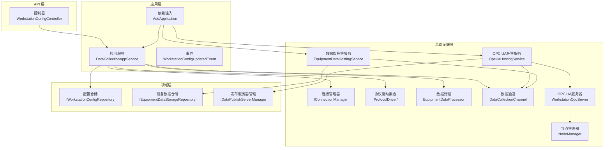
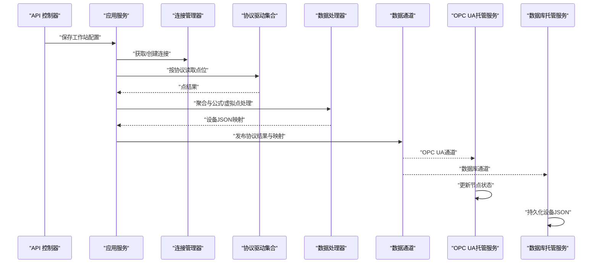
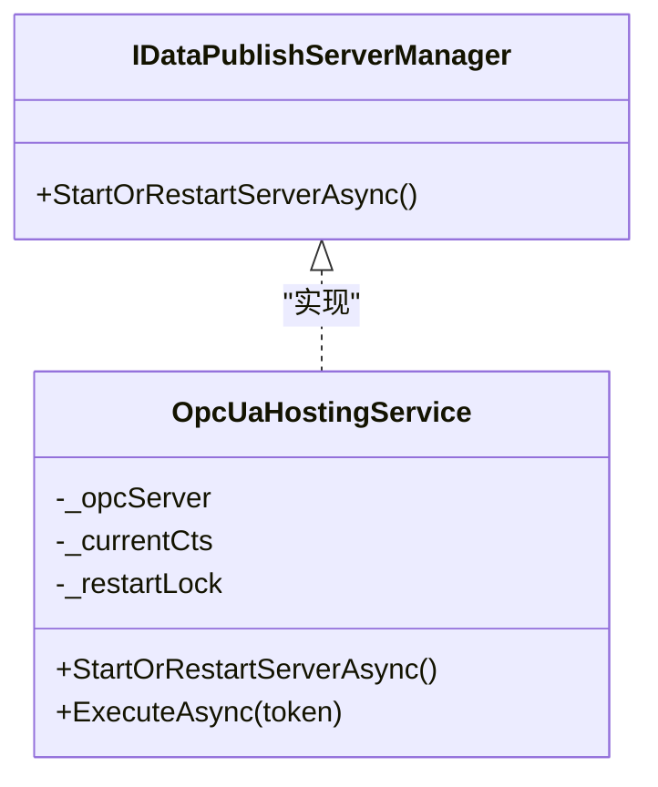
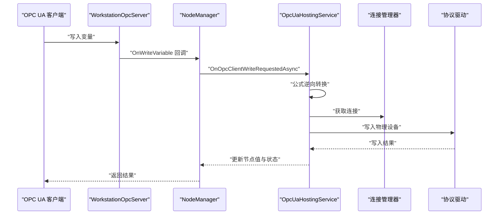
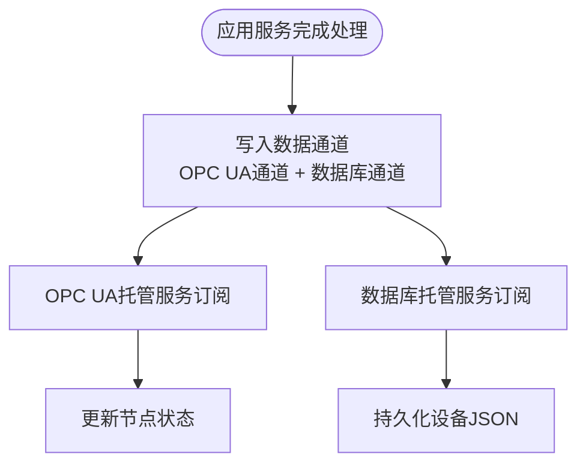
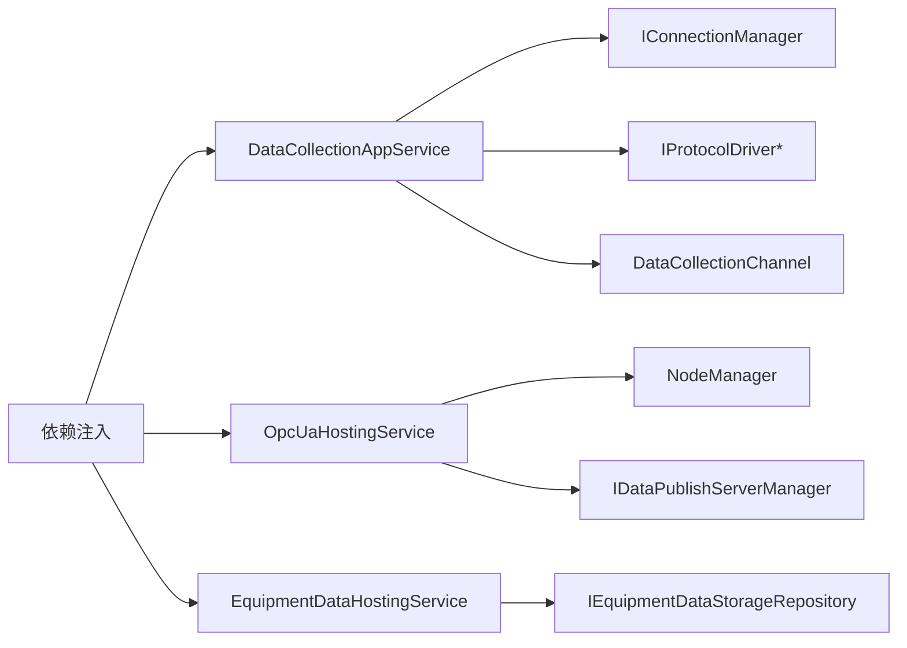

# 系统集成

<cite>
**本文引用的文件**
- [IndustrialDataProcessor.Domain\Repositories\IDataPublishServerManager.cs](file://IndustrialDataProcessor.Domain\Repositories\IDataPublishServerManager.cs)
- [IndustrialDataProcessor.Infrastructure\OpcUa\WorkstationOpcServer.cs](file://IndustrialDataProcessor.Infrastructure\OpcUa\WorkstationOpcServer.cs)
- [IndustrialDataProcessor.Infrastructure\OpcUa\NodeManager.cs](file://IndustrialDataProcessor.Infrastructure\OpcUa\NodeManager.cs)
- [IndustrialDataProcessor.Infrastructure\BackgroundServices\OpcUaHostingService.cs](file://IndustrialDataProcessor.Infrastructure\BackgroundServices\OpcUaHostingService.cs)
- [IndustrialDataProcessor.Application\Services\DataCollectionAppService.cs](file://IndustrialDataProcessor.Application\Services\DataCollectionAppService.cs)
- [IndustrialDataProcessor.Domain\Workstation\Results\DataCollectionChannel.cs](file://IndustrialDataProcessor.Domain\Workstation\Results\DataCollectionChannel.cs)
- [IndustrialDataProcessor.Infrastructure\EquipmentCollectionDataProcessing\EquipmentDataProcessor.cs](file://IndustrialDataProcessor.Infrastructure\EquipmentCollectionDataProcessing\EquipmentDataProcessor.cs)
- [IndustrialDataProcessor.Infrastructure\BackgroundServices\EquipmentDataHostingService.cs](file://IndustrialDataProcessor.Infrastructure\BackgroundServices\EquipmentDataHostingService.cs)
- [IndustrialDataProcessor.Domain\Workstation\Configs\ProtocolSub\HttpApiInterfaceConfig.cs](file://IndustrialDataProcessor.Domain\Workstation\Configs\ProtocolSub\HttpApiInterfaceConfig.cs)
- [IndustrialDataProcessor.Domain\Workstation\Configs\ProtocolSub\DatabaseInterfaceConfig.cs](file://IndustrialDataProcessor.Domain\Workstation\Configs\ProtocolSub\DatabaseInterfaceConfig.cs)
- [IndustrialDataProcessor.Infrastructure\Communication\Drivers\TcpSpecial\OpcUaDriver.cs](file://IndustrialDataProcessor.Infrastructure\Communication\Drivers\TcpSpecial\OpcUaDriver.cs)
- [IndustrialDataProcessor.Application\DependencyInjection.cs](file://IndustrialDataProcessor.Application\DependencyInjection.cs)
- [IndustrialDataProcessor.Api\Controllers\WorkstationConfigController.cs](file://IndustrialDataProcessor.Api\Controllers\WorkstationConfigController.cs)
- [IndustrialDataProcessor.Application\Events\WorkstationConfigUpdatedEvent.cs](file://IndustrialDataProcessor.Application\Events\WorkstationConfigUpdatedEvent.cs)
</cite>

## 目录
1. [简介](#简介)
2. [项目结构](#项目结构)
3. [核心组件](#核心组件)
4. [架构总览](#架构总览)
5. [详细组件分析](#详细组件分析)
6. [依赖关系分析](#依赖关系分析)
7. [性能考量](#性能考量)
8. [故障排查指南](#故障排查指南)
9. [结论](#结论)
10. [附录](#附录)

## 简介
本文件面向DDD工业数据处理解决方案的系统集成开发，围绕以下目标展开：
- 第三方系统集成：API适配器开发、数据格式转换与同步机制
- 数据发布系统扩展：IDataPublishServerManager接口实现与新发布协议支持
- OPC UA集成：WorkstationOpcServer扩展与自定义节点类型实现
- 消息队列与事件总线：异步处理、事件驱动架构与消息路由
- 数据库集成：新存储后端接入、数据迁移与一致性保障
- 云平台集成：Azure IoT Hub、AWS IoT Core等适配思路
- 集成测试与验证：确保系统间数据一致性与可靠性

## 项目结构
系统采用分层与领域驱动设计，主要模块如下：
- 应用层：命令、事件、应用服务、验证器与依赖注入
- 领域层：实体、配置、结果模型、接口与异常
- 基础设施层：通信驱动、OPC UA服务器、后台服务、数据处理与仓储
- 分享层：共享异常与通用工具
- 持久化适配层：SqlSugar实现
- API层：控制器与中间件
- 模拟器：本地运行与测试

图表来源
- [IndustrialDataProcessor.Api\Controllers\WorkstationConfigController.cs](file://IndustrialDataProcessor.Api\Controllers\WorkstationConfigController.cs#L1-L22)
- [IndustrialDataProcessor.Application\Services\DataCollectionAppService.cs](file://IndustrialDataProcessor.Application\Services\DataCollectionAppService.cs#L1-L216)
- [IndustrialDataProcessor.Application\DependencyInjection.cs](file://IndustrialDataProcessor.Application\DependencyInjection.cs#L1-L40)
- [IndustrialDataProcessor.Infrastructure\BackgroundServices\OpcUaHostingService.cs](file://IndustrialDataProcessor.Infrastructure\BackgroundServices\OpcUaHostingService.cs#L1-L228)
- [IndustrialDataProcessor.Infrastructure\BackgroundServices\EquipmentDataHostingService.cs](file://IndustrialDataProcessor.Infrastructure\BackgroundServices\EquipmentDataHostingService.cs#L1-L43)
- [IndustrialDataProcessor.Infrastructure\OpcUa\WorkstationOpcServer.cs](file://IndustrialDataProcessor.Infrastructure\OpcUa\WorkstationOpcServer.cs#L1-L36)
- [IndustrialDataProcessor.Infrastructure\OpcUa\NodeManager.cs](file://IndustrialDataProcessor.Infrastructure\OpcUa\NodeManager.cs#L1-L417)
- [IndustrialDataProcessor.Domain\Repositories\IDataPublishServerManager.cs](file://IndustrialDataProcessor.Domain\Repositories\IDataPublishServerManager.cs#L1-L10)

章节来源
- [IndustrialDataProcessor.Api\Controllers\WorkstationConfigController.cs](file://IndustrialDataProcessor.Api\Controllers\WorkstationConfigController.cs#L1-L22)
- [IndustrialDataProcessor.Application\DependencyInjection.cs](file://IndustrialDataProcessor.Application\DependencyInjection.cs#L1-L40)

## 核心组件
- 数据采集与分发
  - 应用服务负责启动各协议采集任务、驱动读写、异常隔离与结果聚合，并通过通道向OPC UA与数据库消费者广播
  - 数据通道为无界通道，分别输出至OPC UA与数据库消费者
- 数据处理
  - 设备数据处理器负责公式转换、虚拟点计算、最终聚合状态统计与JSON序列化
- 发布与订阅
  - OPC UA托管服务启动服务器、订阅通道并将采集结果映射到节点状态；同时支持客户端写入反推到物理设备
  - 数据库托管服务订阅通道并持久化设备JSON数据
- 发布服务器管理
  - 基础设施层实现IDataPublishServerManager接口，提供启动/重启服务器能力，支持并发重启保护

章节来源
- [IndustrialDataProcessor.Application\Services\DataCollectionAppService.cs](file://IndustrialDataProcessor.Application\Services\DataCollectionAppService.cs#L1-L216)
- [IndustrialDataProcessor.Domain\Workstation\Results\DataCollectionChannel.cs](file://IndustrialDataProcessor.Domain\Workstation\Results\DataCollectionChannel.cs#L1-L37)
- [IndustrialDataProcessor.Infrastructure\EquipmentCollectionDataProcessing\EquipmentDataProcessor.cs](file://IndustrialDataProcessor.Infrastructure\EquipmentCollectionDataProcessing\EquipmentDataProcessor.cs#L1-L157)
- [IndustrialDataProcessor.Infrastructure\BackgroundServices\OpcUaHostingService.cs](file://IndustrialDataProcessor.Infrastructure\BackgroundServices\OpcUaHostingService.cs#L1-L228)
- [IndustrialDataProcessor.Infrastructure\BackgroundServices\EquipmentDataHostingService.cs](file://IndustrialDataProcessor.Infrastructure\BackgroundServices\EquipmentDataHostingService.cs#L1-L43)
- [IndustrialDataProcessor.Domain\Repositories\IDataPublishServerManager.cs](file://IndustrialDataProcessor.Domain\Repositories\IDataPublishServerManager.cs#L1-L10)

## 架构总览
系统采用事件驱动与异步通道解耦生产者与消费者，形成“采集-处理-发布/存储”的流水线。

图表来源
- [IndustrialDataProcessor.Api\Controllers\WorkstationConfigController.cs](file://IndustrialDataProcessor.Api\Controllers\WorkstationConfigController.cs#L1-L22)
- [IndustrialDataProcessor.Application\Services\DataCollectionAppService.cs](file://IndustrialDataProcessor.Application\Services\DataCollectionAppService.cs#L1-L216)
- [IndustrialDataProcessor.Domain\Workstation\Results\DataCollectionChannel.cs](file://IndustrialDataProcessor.Domain\Workstation\Results\DataCollectionChannel.cs#L1-L37)
- [IndustrialDataProcessor.Infrastructure\BackgroundServices\OpcUaHostingService.cs](file://IndustrialDataProcessor.Infrastructure\BackgroundServices\OpcUaHostingService.cs#L1-L228)
- [IndustrialDataProcessor.Infrastructure\BackgroundServices\EquipmentDataHostingService.cs](file://IndustrialDataProcessor.Infrastructure\BackgroundServices\EquipmentDataHostingService.cs#L1-L43)

## 详细组件分析

### 数据发布系统扩展（IDataPublishServerManager）
- 接口职责
  - 管理对外发布数据服务器生命周期（如重启、停止）
- 基础设施实现
  - OPC UA托管服务实现接口，提供并发安全的启动/重启流程，包含旧实例停止、证书校验、服务器启动与通道订阅
- 新发布协议支持
  - 可复用通道模式，新增协议只需在应用服务中将结果写入对应通道，由相应托管服务订阅并发布

图表来源
- [IndustrialDataProcessor.Domain\Repositories\IDataPublishServerManager.cs](file://IndustrialDataProcessor.Domain\Repositories\IDataPublishServerManager.cs#L1-L10)
- [IndustrialDataProcessor.Infrastructure\BackgroundServices\OpcUaHostingService.cs](file://IndustrialDataProcessor.Infrastructure\BackgroundServices\OpcUaHostingService.cs#L1-L228)

章节来源
- [IndustrialDataProcessor.Domain\Repositories\IDataPublishServerManager.cs](file://IndustrialDataProcessor.Domain\Repositories\IDataPublishServerManager.cs#L1-L10)
- [IndustrialDataProcessor.Infrastructure\BackgroundServices\OpcUaHostingService.cs](file://IndustrialDataProcessor.Infrastructure\BackgroundServices\OpcUaHostingService.cs#L63-L99)

### OPC UA集成（WorkstationOpcServer与NodeManager）
- WorkstationOpcServer
  - 重写创建主节点管理器方法，注入自定义节点管理器，统一调度多节点管理器
- NodeManager
  - 动态创建工作站/设备/点位三层地址空间，建立节点ID到配置的路由映射
  - 提供从采集结果更新节点值与状态的能力，支持协议级/设备级失败标记
  - 写入回调触发应用层写请求事件，支持反推计算与驱动下发
- 写入反推流程
  - 客户端写入变量触发回调，查询路由映射，调用应用层事件处理器，经公式逆向转换后驱动写入

图表来源
- [IndustrialDataProcessor.Infrastructure\OpcUa\WorkstationOpcServer.cs](file://IndustrialDataProcessor.Infrastructure\OpcUa\WorkstationOpcServer.cs#L1-L36)
- [IndustrialDataProcessor.Infrastructure\OpcUa\NodeManager.cs](file://IndustrialDataProcessor.Infrastructure\OpcUa\NodeManager.cs#L1-L417)
- [IndustrialDataProcessor.Infrastructure\BackgroundServices\OpcUaHostingService.cs](file://IndustrialDataProcessor.Infrastructure\BackgroundServices\OpcUaHostingService.cs#L135-L158)

章节来源
- [IndustrialDataProcessor.Infrastructure\OpcUa\WorkstationOpcServer.cs](file://IndustrialDataProcessor.Infrastructure\OpcUa\WorkstationOpcServer.cs#L11-L35)
- [IndustrialDataProcessor.Infrastructure\OpcUa\NodeManager.cs](file://IndustrialDataProcessor.Infrastructure\OpcUa\NodeManager.cs#L36-L127)
- [IndustrialDataProcessor.Infrastructure\BackgroundServices\OpcUaHostingService.cs](file://IndustrialDataProcessor.Infrastructure\BackgroundServices\OpcUaHostingService.cs#L135-L158)

### 消息队列与事件总线（异步处理与路由）
- 通道模型
  - 单例数据通道包含两条无界通道：OPC UA通道与数据库通道
  - 应用服务在处理完成后将协议结果与JSON映射同时写入两条通道，实现扇出
- 消费者
  - OPC UA托管服务订阅OPC UA通道，更新节点状态
  - 数据库托管服务订阅数据库通道，持久化设备JSON
- 事件驱动
  - 配置更新事件通过MediatR传播，应用服务可据此触发采集任务重启或配置刷新

图表来源
- [IndustrialDataProcessor.Domain\Workstation\Results\DataCollectionChannel.cs](file://IndustrialDataProcessor.Domain\Workstation\Results\DataCollectionChannel.cs#L1-L37)
- [IndustrialDataProcessor.Application\Services\DataCollectionAppService.cs](file://IndustrialDataProcessor.Application\Services\DataCollectionAppService.cs#L185-L197)
- [IndustrialDataProcessor.Infrastructure\BackgroundServices\OpcUaHostingService.cs](file://IndustrialDataProcessor.Infrastructure\BackgroundServices\OpcUaHostingService.cs#L160-L174)
- [IndustrialDataProcessor.Infrastructure\BackgroundServices\EquipmentDataHostingService.cs](file://IndustrialDataProcessor.Infrastructure\BackgroundServices\EquipmentDataHostingService.cs#L20-L35)

章节来源
- [IndustrialDataProcessor.Domain\Workstation\Results\DataCollectionChannel.cs](file://IndustrialDataProcessor.Domain\Workstation\Results\DataCollectionChannel.cs#L10-L36)
- [IndustrialDataProcessor.Application\Services\DataCollectionAppService.cs](file://IndustrialDataProcessor.Application\Services\DataCollectionAppService.cs#L185-L197)
- [IndustrialDataProcessor.Application\Events\WorkstationConfigUpdatedEvent.cs](file://IndustrialDataProcessor.Application\Events\WorkstationConfigUpdatedEvent.cs#L1-L11)

### 数据库集成扩展（新存储后端接入、迁移与一致性）
- 接入方式
  - 通过IEquipmentDataStorageRepository接口抽象，数据库托管服务订阅通道并逐条持久化
  - 可替换实现以接入不同存储后端（如关系型、时序库、对象存储）
- 数据迁移
  - 建议基于设备ID与时间戳构建复合主键，采用批量写入提升性能
  - 迁移策略可采用“双写+对账+切换”或“停机窗口迁移”
- 一致性保障
  - 通道消费采用异步逐条写入，异常记录日志并继续处理，避免单点故障影响整体
  - 建议在应用层增加幂等写入与重复键检测

章节来源
- [IndustrialDataProcessor.Infrastructure\BackgroundServices\EquipmentDataHostingService.cs](file://IndustrialDataProcessor.Infrastructure\BackgroundServices\EquipmentDataHostingService.cs#L1-L43)

### API适配器开发与数据格式转换
- API协议配置
  - HttpApiInterfaceConfig定义HTTP接口类型、请求方式、访问路径与代理网关
- 数据格式转换
  - EquipmentDataProcessor在设备维度完成公式转换与虚拟点计算，输出JSON映射
  - NodeManager在OPC UA侧进行类型清洗，避免类型不匹配异常
- 同步机制
  - 采集周期结束后统一发布，消费者异步处理，保证系统解耦与高吞吐

章节来源
- [IndustrialDataProcessor.Domain\Workstation\Configs\ProtocolSub\HttpApiInterfaceConfig.cs](file://IndustrialDataProcessor.Domain\Workstation\Configs\ProtocolSub\HttpApiInterfaceConfig.cs#L1-L30)
- [IndustrialDataProcessor.Infrastructure\EquipmentCollectionDataProcessing\EquipmentDataProcessor.cs](file://IndustrialDataProcessor.Infrastructure\EquipmentCollectionDataProcessing\EquipmentDataProcessor.cs#L21-L48)
- [IndustrialDataProcessor.Infrastructure\OpcUa\NodeManager.cs](file://IndustrialDataProcessor.Infrastructure\OpcUa\NodeManager.cs#L388-L415)

### 云平台集成（Azure IoT Hub、AWS IoT Core）
- 适配思路
  - 以IEquipmentDataStorageRepository为抽象，新增云平台实现（如IoT Hub/AWS IoT Core SDK）
  - 在通道中增加云平台通道，或在数据库通道消费者中分流至云SDK
  - 采用批量上报、重试与退避策略，结合设备指纹与时间戳保证幂等
- 安全与认证
  - 使用设备证书/密钥与平台CA信任链，结合传输加密与签名
- 监控与可观测性
  - 上报指标（吞吐、延迟、错误率）、日志与追踪ID，便于问题定位

（本节为概念性指导，无需源码引用）

### OPC UA驱动开发（OpcUaDriver）
- 现状
  - OpcUaDriver继承BaseProtocolDriver，当前读写方法未实现
- 扩展建议
  - 基于OPC UA客户端库实现会话管理、节点读写与错误处理
  - 与NodeManager写入回调配合，实现双向数据流

章节来源
- [IndustrialDataProcessor.Infrastructure\Communication\Drivers\TcpSpecial\OpcUaDriver.cs](file://IndustrialDataProcessor.Infrastructure\Communication\Drivers\TcpSpecial\OpcUaDriver.cs#L1-L21)

## 依赖关系分析
- 应用层依赖
  - 依赖连接管理器与协议驱动集合，通过泛型驱动选择具体协议
  - 依赖数据通道进行跨组件广播
- 基础设施层
  - OPC UA托管服务依赖节点管理器与发布服务器管理接口
  - 数据库托管服务依赖设备数据存储仓储
- 依赖注入
  - 应用层注册应用服务、通道与MediatR
  - 基础设施层注册托管服务与OPC UA服务器配置

图表来源
- [IndustrialDataProcessor.Application\DependencyInjection.cs](file://IndustrialDataProcessor.Application\DependencyInjection.cs#L16-L39)
- [IndustrialDataProcessor.Application\Services\DataCollectionAppService.cs](file://IndustrialDataProcessor.Application\Services\DataCollectionAppService.cs#L10-L17)
- [IndustrialDataProcessor.Infrastructure\BackgroundServices\OpcUaHostingService.cs](file://IndustrialDataProcessor.Infrastructure\BackgroundServices\OpcUaHostingService.cs#L20-L27)

章节来源
- [IndustrialDataProcessor.Application\DependencyInjection.cs](file://IndustrialDataProcessor.Application\DependencyInjection.cs#L16-L39)

## 性能考量
- 采集并发
  - 每协议独立后台循环，互不影响，降低抖动
- 通道与处理
  - 无界通道避免背压堆积，处理器在内存中完成公式与聚合，减少IO往返
- OPC UA
  - 节点状态更新加锁保护，批量更新时尽量减少状态码切换
- 数据库
  - 逐条写入便于异常隔离，建议结合批量写入与事务优化

（本节为通用指导，无需源码引用）

## 故障排查指南
- OPC UA写入失败
  - 检查节点路由映射是否存在、写入回调是否订阅、驱动写入结果
- 通道消费异常
  - 查看数据库托管服务日志，确认异常是否被捕获并记录
- 服务器重启
  - 确认并发重启保护是否生效，旧实例是否正确停止与端口释放
- 配置更新
  - 确认配置事件是否触发，采集任务是否按新配置重新启动

章节来源
- [IndustrialDataProcessor.Infrastructure\OpcUa\NodeManager.cs](file://IndustrialDataProcessor.Infrastructure\OpcUa\NodeManager.cs#L341-L383)
- [IndustrialDataProcessor.Infrastructure\BackgroundServices\EquipmentDataHostingService.cs](file://IndustrialDataProcessor.Infrastructure\BackgroundServices\EquipmentDataHostingService.cs#L30-L34)
- [IndustrialDataProcessor.Infrastructure\BackgroundServices\OpcUaHostingService.cs](file://IndustrialDataProcessor.Infrastructure\BackgroundServices\OpcUaHostingService.cs#L70-L98)

## 结论
本系统通过事件驱动与通道解耦实现了高内聚、低耦合的工业数据处理流水线。OPC UA与数据库的发布/存储分离，既满足实时可视化需求，又保证了数据持久化与可追溯性。通过抽象接口与依赖注入，系统具备良好的扩展性，便于接入新协议、新存储与云平台。

## 附录
- API端点
  - 保存工作站配置：POST /api/workstation-config
- 关键流程
  - 配置保存触发采集任务与发布服务器重启
  - 采集完成后通过通道广播，消费者异步处理

章节来源
- [IndustrialDataProcessor.Api\Controllers\WorkstationConfigController.cs](file://IndustrialDataProcessor.Api\Controllers\WorkstationConfigController.cs#L14-L21)